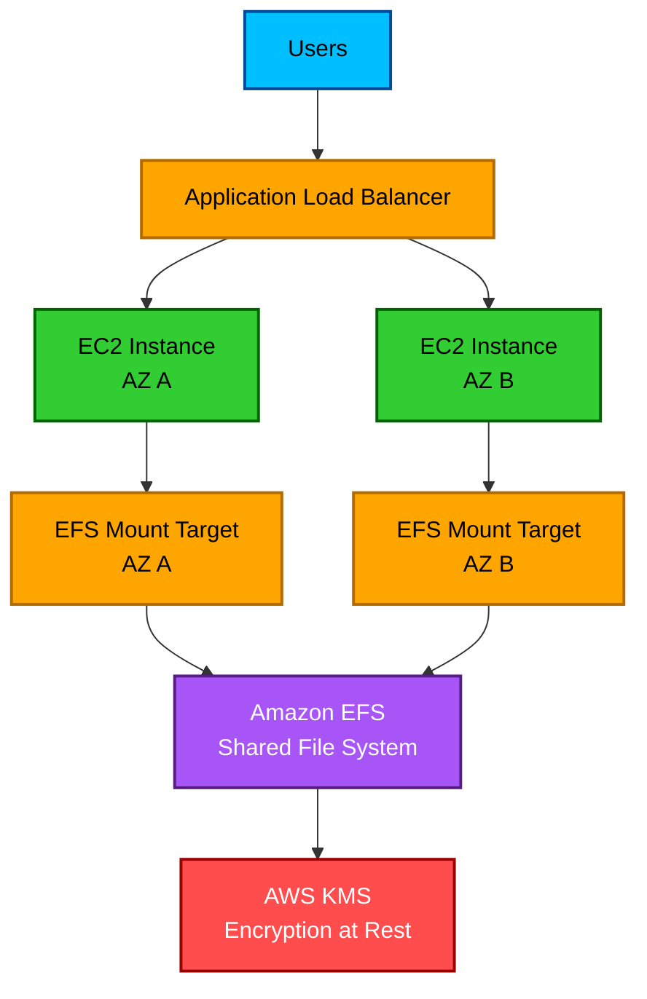

# EFS

1. Definition

## 1. Definition

### Simple Definition

Amazon EFS, or Elastic File System, is a fully managed shared file storage service for Linux workloads.

It provides a file system that multiple EC2 instances, containers, and AWS services can access at the same time.

### Simple Memory Hook

EFS = Elastic File System = shared Linux folder in the cloud.

### Key Idea

Use EFS when many compute resources need to read and write the same files at the same time.

2. What Problem Does It Solve?

## 2. What Problem Does It Solve?

### Main Problem

EFS solves the problem of sharing files between multiple servers.

Without EFS, each EC2 instance may have its own local storage, which makes file sharing difficult.

### Example Problem

You have 3 EC2 instances behind a load balancer, and all of them need access to the same uploaded user files.

EFS lets all 3 instances mount the same file system.

### Simple Analogy

Think of EFS like a shared network drive for Linux servers.

3. Core Use Cases

## 3. Core Use Cases

### Common Real-World Use Cases

- Shared storage for multiple EC2 instances
- Web servers that need shared user uploads
- Content management systems like WordPress
- Linux application shared directories
- Container storage for ECS and EKS
- Big data and analytics workloads
- Machine learning training data
- Home directories for users
- Lift-and-shift Linux applications

### Best Fit

EFS is best when you need:

- File storage
- Linux access
- Multiple clients accessing the same data
- Automatic scaling
- Multi-AZ availability

4. Important Features for SAA

## 4. Important Features for SAA

### File Storage Type

EFS is file storage.

It uses the NFS protocol, mainly NFSv4.

### Works With Linux

EFS is designed for Linux-based workloads.

For Windows file shares, use Amazon FSx for Windows File Server instead.

### Shared Access

Multiple EC2 instances can mount the same EFS file system at the same time.

This is one of the biggest exam points.

### Automatic Scaling

EFS automatically grows and shrinks as files are added or removed.

You do not need to provision storage size in advance.

### Regional Service

Standard EFS file systems are Regional.

They store data across multiple Availability Zones in a Region.

### Mount Targets

To access EFS from a VPC, you create mount targets.

A mount target is created in a subnet and has a security group.

Best practice is to create one mount target in each Availability Zone where clients need access.

### Performance Modes

| Performance Mode | Use Case |
|---|---|
| General Purpose | Default option, good for most workloads |
| Max I/O | Higher aggregate throughput, higher latency, good for large-scale parallel workloads |

### Throughput Modes

| Throughput Mode | Meaning |
|---|---|
| Bursting Throughput | Throughput scales with file system size |
| Provisioned Throughput | You manually set throughput independent of size |
| Elastic Throughput | Automatically scales throughput based on workload activity |

### Storage Classes

| Storage Class | Purpose |
|---|---|
| EFS Standard | Frequently accessed files, Multi-AZ |
| EFS Standard-IA | Infrequently accessed files, Multi-AZ |
| EFS One Zone | Lower-cost storage in one AZ |
| EFS One Zone-IA | Lower-cost infrequently accessed storage in one AZ |

### Access Points

EFS Access Points provide application-specific entry points into an EFS file system.

They can enforce:

- Root directory
- POSIX user
- POSIX group
- Permissions

### Lifecycle Management

EFS can automatically move files to lower-cost storage classes when they are not accessed for a period of time.

Example:

- Move files to EFS Standard-IA after 30 days of no access
- Move files back to Standard when accessed again, if configured

### Exam Memory Hook

EFS = Linux + NFS + shared access + Multi-AZ + auto scaling.

5. Security Model

## 5. Security Model

### IAM Permissions

IAM controls who can manage EFS resources through the AWS API.

Examples:

- Create file systems
- Delete file systems
- Create access points
- Modify lifecycle policies

IAM can also be used with EFS file system policies and access points to control client access.

### File System Policies

EFS supports resource-based file system policies.

These policies can control which AWS principals can mount or write to the file system.

### POSIX Permissions

EFS uses standard Linux POSIX permissions.

This includes:

- User IDs
- Group IDs
- File permissions
- Directory permissions

Important exam point:

IAM alone does not replace Linux file permissions.

### Encryption At Rest

EFS supports encryption at rest using AWS KMS.

You can use:

- AWS managed KMS key
- Customer managed KMS key

### Encryption In Transit

EFS supports encryption in transit using TLS.

This protects data moving between clients and EFS.

### Network Security

EFS is accessed through mount targets inside a VPC.

Security is controlled with:

- VPC networking
- Subnets
- Security groups
- Network ACLs
- Route tables

### Security Groups

The EFS mount target security group must allow inbound NFS traffic on port 2049 from the client security group.

### Shared Responsibility

| Responsibility | AWS | Customer |
|---|---:|---:|
| Physical infrastructure | Yes | No |
| EFS service availability | Yes | No |
| Encryption feature availability | Yes | No |
| IAM policies | No | Yes |
| Security groups | No | Yes |
| POSIX file permissions | No | Yes |
| Data classification | No | Yes |

6. High Availability / Durability Behavior

## 6. High Availability / Durability Behavior

### Availability

Standard EFS file systems are designed to be highly available across multiple Availability Zones.

Clients in different AZs can access the same file system.

### Multi-AZ Behavior

EFS Standard stores data across multiple AZs in a Region.

This makes it suitable for applications that need high availability.

### Mount Target Best Practice

Create a mount target in each AZ where your EC2 instances run.

This improves availability and reduces cross-AZ network dependency.

### Fault Tolerance

If one AZ has an issue, EFS Standard can still serve data from other AZs.

Your application should also run across multiple AZs to fully benefit.

### One Zone Behavior

EFS One Zone stores data in only one Availability Zone.

It costs less but has lower availability and durability than EFS Standard.

### Multi-Region Behavior

EFS is Regional, not global.

For cross-Region disaster recovery, you can use EFS replication to copy data to another Region.

### Durability

EFS Standard is designed for high durability by storing data redundantly across multiple AZs.

EFS One Zone is less durable because data is stored in a single AZ.

### Exam Memory Hook

Standard EFS = Multi-AZ.

One Zone EFS = one AZ, cheaper, less resilient.

7. Cost Optimization Options

## 7. Cost Optimization Options

### Use Infrequent Access Storage

Use EFS Standard-IA for files that are not accessed often.

This reduces storage cost.

### Use Lifecycle Policies

Lifecycle policies automatically move old or rarely accessed files to cheaper storage classes.

Example:

| File Access Pattern | Recommended Option |
|---|---|
| Frequently used | EFS Standard |
| Rarely used | EFS Standard-IA |
| Single-AZ workload | EFS One Zone |
| Single-AZ and rarely used | EFS One Zone-IA |

### Use EFS One Zone When Appropriate

EFS One Zone is cheaper than EFS Standard.

Use it only when Multi-AZ resilience is not required.

Good examples:

- Development environments
- Test environments
- Non-critical workloads
- Data that can be recreated

### Choose the Right Throughput Mode

| Requirement | Best Option |
|---|---|
| Simple default behavior | Bursting Throughput |
| Predictable high throughput | Provisioned Throughput |
| Variable or unpredictable workload | Elastic Throughput |

### Avoid Unnecessary Cross-AZ Access

Create mount targets in the same AZs as your clients.

This can improve performance and reduce unnecessary networking costs.

### Cost Memory Hook

Use lifecycle rules and IA classes to avoid paying full price for cold files.

8. Common Exam Traps

## 8. Common Exam Traps

### Trap 1: EFS vs EBS

EFS can be shared by many EC2 instances.

EBS is usually attached to one EC2 instance at a time.

### Trap 2: EFS vs S3

EFS is file storage mounted by Linux clients.

S3 is object storage accessed through APIs.

Do not choose EFS when the question asks for object storage, static website hosting, or unlimited object storage.

### Trap 3: EFS Is Not For Windows File Shares

EFS is mainly for Linux and NFS.

For Windows SMB file shares, choose FSx for Windows File Server.

### Trap 4: Standard EFS Is Multi-AZ

EFS Standard stores data across multiple AZs.

EFS One Zone stores data in one AZ only.

### Trap 5: Security Group Port

EFS uses NFS port 2049.

If EC2 cannot mount EFS, check the security group rules.

### Trap 6: EFS Automatically Scales Storage

You do not provision EFS size in advance.

It grows and shrinks automatically.

### Trap 7: EFS Is Regional

EFS Standard is Regional, but not automatically Multi-Region.

For another Region, use replication.

### Trap 8: IAM Does Not Replace POSIX Permissions

EFS can use IAM policies, but Linux file permissions still matter.

### Trap 9: EFS Is Not Block Storage

If the question requires low-latency block storage for a database, choose EBS, not EFS.

### Trap 10: One Zone Is Cheaper But Less Resilient

EFS One Zone is cheaper but not Multi-AZ.

Choose it only when the workload can tolerate AZ-level loss.

9. Compare With Similar Services

## 9. Compare With Similar Services

### Simple Comparison Table

| Service | Storage Type | Best For | Shared Access | Exam Tip |
|---|---|---|---|---|
| EFS | File storage | Shared Linux file system | Yes, many clients | Choose for Linux NFS shared files |
| EBS | Block storage | EC2 boot volumes, databases | Usually one EC2 | Choose for low-latency block storage |
| S3 | Object storage | Objects, backups, static assets | API-based | Choose for object storage and durability |
| FSx for Windows File Server | File storage | Windows SMB file shares | Yes | Choose for Windows file shares |
| FSx for Lustre | File storage | HPC, machine learning, high performance | Yes | Choose for high-performance workloads |
| Instance Store | Temporary block storage | Ephemeral high-speed local storage | No | Data is lost when instance stops/terminates |

### When To Choose EFS

Choose EFS when the question says:

- Multiple EC2 instances need shared storage
- Linux servers need a shared file system
- NFS is required
- Storage should scale automatically
- Multi-AZ file storage is needed

### When Not To Choose EFS

Do not choose EFS when the question needs:

- Object storage
- Static website hosting
- Windows SMB file shares
- Lowest latency block storage
- Temporary local storage

### Memory Hook

EBS = one server disk.

EFS = many Linux servers shared folder.

S3 = object bucket.

FSx = specialized file systems.

10. Mini Architecture Example

## 10. Mini Architecture Example

### Scenario

A company runs a WordPress website on multiple EC2 instances behind an Application Load Balancer.

All EC2 instances need access to the same uploaded media files.

### Solution

Use Amazon EFS as shared storage.

Each EC2 instance mounts the same EFS file system.

The EFS file system has mount targets in multiple Availability Zones.

### Architecture Flow

1. Users access the website through an Application Load Balancer.
2. The load balancer sends traffic to EC2 instances in multiple AZs.
3. Each EC2 instance mounts the same EFS file system.
4. Uploaded files are stored on EFS.
5. All EC2 instances can read and write the same files.

### Mermaid Diagram

### Why EFS Fits

EFS is a good choice because:

- Multiple EC2 instances need the same files
- The workload is Linux-based
- Storage must scale automatically
- The application runs across multiple AZs
- High availability is important

### Final Exam Summary

EFS is the best answer when the exam asks for a shared, scalable, Linux-based file system that can be mounted by multiple EC2 instances across Availability Zones.

