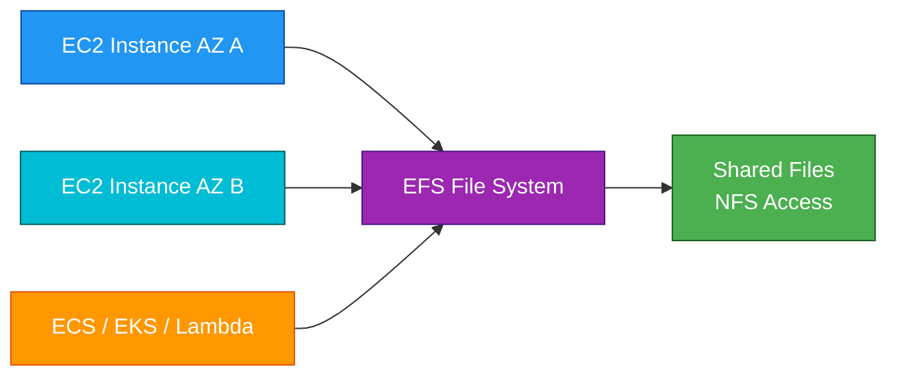
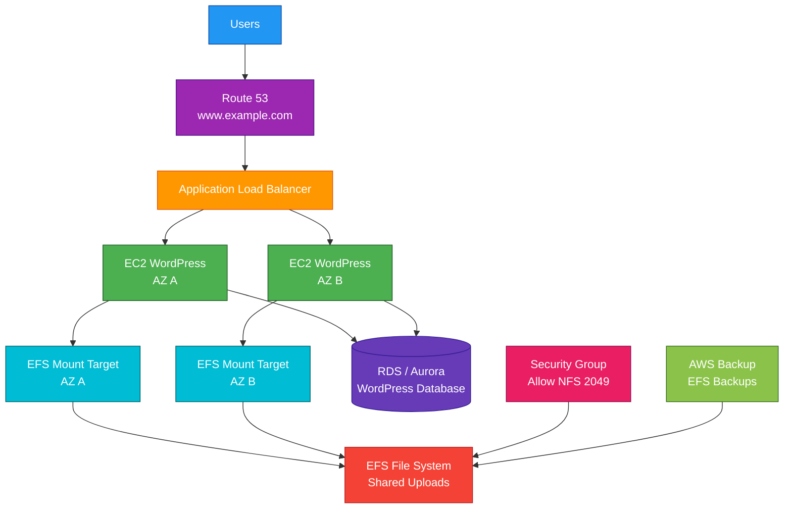

# EFS

## 1. Definition

### Simple Definition

Amazon EFS, or Elastic File System, is a managed shared file storage service for Linux-based workloads.

It lets multiple EC2 instances, containers, and Lambda functions access the same file system at the same time.

### Memory Hook

EFS = Elastic File System = Shared Linux file storage.

### Basic Idea

EFS provides a shared file system that can be mounted by many resources using the NFS protocol.

### Key Point

EFS is file storage.

It is different from:

- EBS, which is block storage for EC2
- S3, which is object storage
- FSx, which provides specialized managed file systems

## 2. What Problem Does It Solve?

### Main Problem

EFS solves the problem of needing shared file storage that can be accessed by multiple compute resources at the same time.

### Without EFS

You may have problems such as:

- Files stored separately on each EC2 instance
- Hard-to-share application files
- Manual NFS server management
- Difficult Multi-AZ file access
- Storage capacity planning
- File server patching and scaling

### With EFS

AWS manages the shared file system for you.

You mount it from multiple compute resources and store shared files in one place.

### Key Benefit

EFS provides elastic, managed, shared Linux file storage without managing file servers.

## 3. Core Use Cases

### Shared Web Content

Use EFS when multiple web servers need access to the same files.

Examples:

- User uploads
- Shared media files
- WordPress content
- Shared configuration files

### Linux Shared File System

EFS is commonly used when Linux applications need a shared NFS file system.

### Container Persistent Storage

EFS can provide shared persistent storage for containers.

Common services:

- Amazon ECS
- Amazon EKS
- AWS Fargate

### Lambda Shared File Access

Lambda functions can mount EFS when they need shared file storage or large dependency files.

### Content Management Systems

EFS is useful for content management systems that need shared files across multiple application servers.

Example:

WordPress running on multiple EC2 instances behind an ALB.

### Home Directories

EFS can be used for shared home directories in Linux environments.

### Data Processing

Use EFS when multiple compute nodes need shared access to input files, scripts, or output files.

## 4. Important Features for SAA

### File System

An EFS file system is the main storage resource.

It can be mounted by many clients at the same time.

### NFS Protocol

EFS uses the Network File System protocol.

Important exam point:

EFS is mainly for Linux workloads using NFS.

For Windows file shares, think Amazon FSx for Windows File Server.

### Mount Target

A mount target is an endpoint that allows resources in a VPC subnet to access EFS.

Best practice:

Create one mount target in each Availability Zone where clients need access.

### Multi-AZ Access

With EFS Standard storage classes, data is stored across multiple Availability Zones.

Clients in different AZs can access the same file system.

### Regional vs One Zone

EFS has two main availability designs.

| EFS Type | Storage Location | Best For |
|---|---|---|
| Regional | Multiple AZs | Production and high availability |
| One Zone | One AZ | Lower-cost workloads that can tolerate AZ loss |

### Storage Classes

EFS supports storage classes for cost optimization.

| Storage Class | Best For |
|---|---|
| EFS Standard | Frequently accessed files across multiple AZs |
| EFS Standard-IA | Infrequently accessed files across multiple AZs |
| EFS One Zone | Frequently accessed files in one AZ |
| EFS One Zone-IA | Infrequently accessed files in one AZ |
| EFS Archive | Rarely accessed long-term file data |

### Lifecycle Management

Lifecycle management automatically moves files to lower-cost storage classes based on access patterns.

Example:

Move files to Infrequent Access after 30 days of no access.

### Intelligent-Tiering Style Behavior

EFS can move files between storage classes using lifecycle policies.

This helps reduce cost for old or rarely accessed files.

### Performance Modes

EFS has performance modes.

| Performance Mode | Best For |
|---|---|
| General Purpose | Most applications |
| Max I/O | Highly parallel workloads needing more aggregate throughput |

### General Purpose Performance Mode

General Purpose is the default and best choice for most workloads.

It has lower latency.

### Max I/O Performance Mode

Max I/O supports higher levels of aggregate throughput and operations.

It may have higher latency than General Purpose.

Use it for large-scale parallel workloads.

### Throughput Modes

EFS supports throughput modes.

| Throughput Mode | Best For |
|---|---|
| Elastic Throughput | Automatically scales throughput with workload |
| Bursting Throughput | Throughput scales with stored data size |
| Provisioned Throughput | Manually set throughput independent of storage size |

### Elastic Throughput

Elastic Throughput automatically scales throughput up and down based on workload demand.

This is a good choice when access patterns are unpredictable.

### Bursting Throughput

Bursting Throughput is based on the amount of data stored.

Larger file systems can burst to higher throughput.

### Provisioned Throughput

Provisioned Throughput lets you pay for a specific throughput level.

Use it when you need consistent throughput regardless of file system size.

### Access Points

EFS Access Points provide application-specific entry points into a file system.

Use them to enforce:

- Root directory
- POSIX user and group
- Application-specific permissions

### POSIX Permissions

EFS supports POSIX-style file permissions.

Linux clients use users, groups, and file permissions to control access.

### EFS with ECS and EKS

EFS can be mounted by containers.

Use it when tasks or pods need shared persistent file storage.

### EFS with Lambda

Lambda can mount EFS through a VPC.

Use it when Lambda needs:

- Shared files
- Large libraries
- Machine learning models
- Persistent file access

### Backup Support

EFS integrates with AWS Backup.

Use AWS Backup for centralized backup plans, retention, and restore.

## 5. Security Model

### IAM Permissions

IAM controls who can create, manage, mount, and configure EFS resources.

Common permissions:

| Permission | Purpose |
|---|---|
| `elasticfilesystem:CreateFileSystem` | Create a file system |
| `elasticfilesystem:CreateMountTarget` | Create mount target |
| `elasticfilesystem:CreateAccessPoint` | Create access point |
| `elasticfilesystem:ClientMount` | Allow client mount |
| `elasticfilesystem:ClientWrite` | Allow client write |
| `elasticfilesystem:DeleteFileSystem` | Delete file system |

### Security Groups

Mount targets use security groups.

To allow EC2 or other clients to mount EFS, allow NFS traffic.

Common port:

| Protocol | Port |
|---|---:|
| NFS | 2049 |

### Common Security Group Pattern

Allow inbound NFS traffic to the EFS mount target from the application security group.

Example:

- EC2 security group: application instances
- EFS security group: allows inbound TCP `2049` from EC2 security group

### Network ACLs

NACLs must allow NFS traffic between clients and EFS mount targets.

Remember:

- NACLs are stateless
- Return traffic must be allowed

### Encryption at Rest

EFS supports encryption at rest using AWS KMS.

Use encryption when storing sensitive data.

### Encryption in Transit

EFS supports encryption in transit using TLS.

Use the EFS mount helper to mount with TLS.

### File System Policy

EFS supports resource-based file system policies.

Use file system policies to control client access with IAM.

### Access Points Security

Access Points can enforce application-specific access.

They help avoid giving every application full access to the root of the file system.

### POSIX Security

EFS uses POSIX ownership and permissions.

You are responsible for setting correct Linux file permissions.

### VPC-Based Access

EFS is accessed through mount targets inside a VPC.

It is not accessed like a public internet object store.

### Shared Responsibility

AWS is responsible for:

- EFS managed infrastructure
- Storage durability
- Service availability
- Multi-AZ storage for Regional file systems
- Physical security
- Managed scaling

You are responsible for:

- IAM permissions
- Security groups
- NACLs
- File system policies
- POSIX permissions
- Encryption settings
- Backup configuration
- Mount target placement
- Application access controls

## 6. High Availability / Durability Behavior

### Availability

EFS is designed to provide highly available shared file storage.

Regional EFS stores data across multiple Availability Zones.

### Regional EFS

Regional EFS is the best choice for production high availability.

It stores data redundantly across multiple AZs.

### One Zone EFS

One Zone EFS stores data in one Availability Zone.

It costs less but does not protect against full AZ failure.

Use it for:

- Development
- Test workloads
- Re-creatable data
- Lower-cost non-critical workloads

### Mount Target Availability

Create mount targets in each AZ where clients run.

This improves performance and availability by allowing clients to connect locally within their AZ.

### Multi-AZ Client Access

Multiple EC2 instances in different AZs can mount and use the same Regional EFS file system.

This is one of the biggest differences between EFS and EBS.

### Durability

Regional EFS is designed for durability across multiple AZs.

One Zone EFS has lower resilience because data is stored in one AZ.

### Multi-Region Behavior

EFS is regional.

For Multi-Region disaster recovery, use EFS replication or backup/restore strategies.

### EFS Replication

EFS replication can copy file system data to another AWS Region or file system.

Use it for disaster recovery or read-only copies in another location.

### Backup and Restore

Use AWS Backup to protect EFS data.

Backups help recover from:

- Accidental deletion
- Corruption
- Bad application changes
- Ransomware-style events

### Important Exam Point

EFS is shared Multi-AZ file storage.

EBS is single-AZ block storage.

S3 is regional object storage.

## 7. Cost Optimization Options

### Use Lifecycle Management

Lifecycle policies move rarely accessed files to lower-cost storage classes.

This is one of the most important EFS cost optimization options.

### Choose the Right Storage Class

| Workload | Good Choice |
|---|---|
| Production shared files | EFS Standard |
| Rarely accessed production files | EFS Standard-IA |
| Lower-cost single-AZ workload | EFS One Zone |
| Rarely accessed single-AZ files | EFS One Zone-IA |
| Long-term rarely accessed files | EFS Archive |

### Use One Zone for Non-Critical Data

EFS One Zone costs less than Regional EFS.

Use it only when you can tolerate loss of an Availability Zone or recreate the data.

### Use Elastic Throughput for Variable Workloads

Elastic Throughput automatically adjusts based on demand.

This can reduce the need to overprovision throughput.

### Use Provisioned Throughput Only When Needed

Provisioned Throughput adds cost.

Use it only when workload throughput must be independent of file system size.

### Clean Up Old Files

Delete unused files.

EFS grows and shrinks automatically as files are added and removed, so cleanup can directly reduce storage cost.

### Use AWS Backup Retention Carefully

Backups add cost.

Set backup retention based on real recovery and compliance needs.

### Avoid Storing Large Static Assets Unnecessarily

For public static assets, S3 plus CloudFront is often cheaper and better than EFS.

### Monitor Usage

Use CloudWatch and EFS metrics to monitor:

- Storage size
- Throughput
- I/O activity
- Client connections
- Percent I/O limit

### Choose EFS Only When Shared File Access Is Needed

If only one EC2 instance needs block storage, EBS is usually more cost-effective.

If applications need object storage, S3 is usually better.

## 8. Common Exam Traps

### EFS vs EBS

EFS is shared file storage.

EBS is block storage attached to EC2.

| Need | Choose |
|---|---|
| Multiple EC2 instances need shared files | EFS |
| One EC2 instance needs persistent disk | EBS |

### EFS Is for Linux/NFS

EFS uses NFS and is best for Linux workloads.

For Windows SMB file shares, choose FSx for Windows File Server.

### EFS Is Not Object Storage

If the question asks for object storage, static assets, backups, or data lakes, choose S3.

### EFS Can Be Mounted by Multiple Instances

This is a major exam clue.

If multiple EC2 instances need simultaneous access to the same file system, EFS is likely the answer.

### EBS Cannot Be Shared Like EFS

Most EBS volumes attach to one EC2 instance in one AZ.

EFS supports shared access across multiple instances and AZs.

### Regional vs One Zone

Regional EFS is Multi-AZ.

One Zone EFS is single-AZ and lower cost.

Do not choose One Zone for critical data that must survive AZ failure.

### Mount Targets Are Required

Clients access EFS through mount targets in a VPC.

If an EC2 instance cannot mount EFS, check:

- Mount target exists
- Security group allows NFS port `2049`
- Route table and NACLs are correct
- DNS resolution works

### Security Groups Matter

The EFS mount target security group must allow NFS from the client security group.

### EFS Is Elastic

You do not provision file system size in advance.

EFS grows and shrinks automatically as files are added or removed.

### EFS Is Regional

EFS file systems are regional.

They do not automatically exist in every Region.

### EFS Is Not a Database

EFS stores files.

For structured relational data, use RDS or Aurora.

For NoSQL data, use DynamoDB.

## 9. Compare With Similar Services

### Service Comparison Table

| Service | Storage Type | Best For | Choose When |
|---|---|---|---|
| EFS | Shared file storage | Linux shared file systems | Multiple instances need shared NFS file access |
| EBS | Block storage | EC2 disks and databases | One EC2 instance needs persistent block storage |
| S3 | Object storage | Files, backups, media, data lakes | You need scalable object storage |
| FSx for Windows File Server | Managed Windows file system | SMB Windows shares | Windows apps need shared file storage |
| FSx for Lustre | High-performance file system | HPC and analytics | You need very high-performance file storage |
| Instance Store | Temporary block storage | Cache and temporary files | Data can be lost safely |

### EFS vs EBS

| Feature | EFS | EBS |
|---|---|---|
| Storage type | File | Block |
| Access | Many clients at once | Usually one EC2 instance |
| Protocol | NFS | Block device |
| AZ scope | Regional or One Zone | Single AZ |
| Best for | Shared Linux files | EC2 boot/data volumes |

### EFS vs S3

| Feature | EFS | S3 |
|---|---|---|
| Storage type | File | Object |
| Access method | NFS mount | API/object key |
| Best for | Shared file system | Object storage and data lakes |
| Mountable | Yes | No, not as a normal file system |
| Common use | Shared app files | Images, logs, backups, static assets |

### EFS vs FSx for Windows File Server

| Feature | EFS | FSx for Windows File Server |
|---|---|---|
| Protocol | NFS | SMB |
| Best for | Linux workloads | Windows workloads |
| Directory integration | POSIX/Linux permissions | Microsoft Active Directory |
| Common use | Linux shared files | Windows file shares |

### EFS vs FSx for Lustre

| Feature | EFS | FSx for Lustre |
|---|---|---|
| Main purpose | General shared file storage | High-performance file system |
| Best for | Shared app files | HPC, ML, analytics |
| Performance focus | Elastic shared access | Very high throughput and low latency |
| Common integration | EC2, ECS, EKS, Lambda | S3 and compute-heavy workloads |

### EFS vs Instance Store

| Feature | EFS | Instance Store |
|---|---|---|
| Persistence | Persistent | Temporary |
| Shared access | Yes | No |
| Lifecycle | Independent managed service | Tied to EC2 host |
| Best for | Shared files | Cache, buffers, scratch data |

### When to Choose EFS

Choose EFS when:

- Multiple EC2 instances need shared file access
- Linux workloads need NFS storage
- Containers need shared persistent storage
- Lambda functions need shared files
- Storage should grow and shrink automatically
- You need a managed file system
- You need Multi-AZ shared file storage with Regional EFS
- You do not want to manage NFS servers yourself

## 10. Mini Architecture Example

### Scenario

A company runs a WordPress website on multiple EC2 instances behind an Application Load Balancer.

All instances need access to the same uploaded media files.

### Architecture

Use EFS as shared storage for WordPress uploads.

Create EFS mount targets in multiple Availability Zones.

Mount EFS on each EC2 instance.

Use RDS or Aurora for the database.

### Why This Is Good

- Multiple EC2 instances share the same files
- EFS provides managed NFS storage
- Mount targets in each AZ improve availability and performance
- WordPress instances can scale horizontally
- Uploaded media is not tied to one EC2 instance
- Database data is stored separately in RDS or Aurora
- AWS Backup can protect EFS data
- Security groups restrict NFS access

### Exam Answer Pattern

If the question says:

“Multiple Linux EC2 instances across Availability Zones need shared file storage.”

Think:

Amazon EFS.

If the question says:

“An EC2 instance needs persistent block storage.”

Think:

Amazon EBS.

If the question says:

“Store objects, static files, backups, logs, or data lake data.”

Think:

Amazon S3.

### Final Memory Hook

EFS = Shared Linux file storage.

EBS = EC2 block storage.

S3 = Object storage.

FSx for Windows = Windows SMB file shares.

Regional EFS = Multi-AZ.

One Zone EFS = Lower cost, single AZ.

Mount target = VPC access point.

NFS port = `2049`.

Lifecycle policies = Lower storage cost.

AWS Backup = Protect EFS data.

