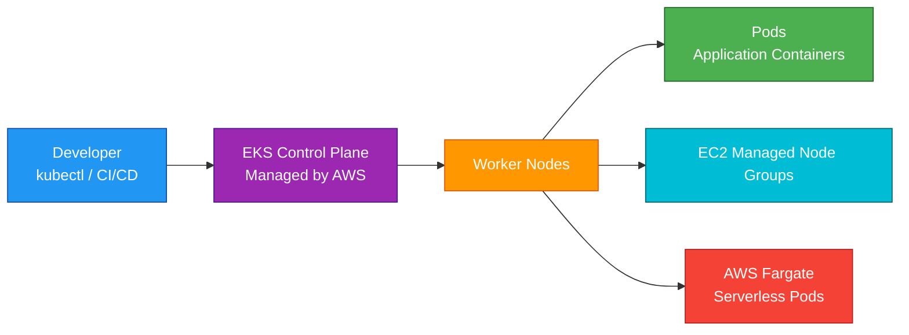
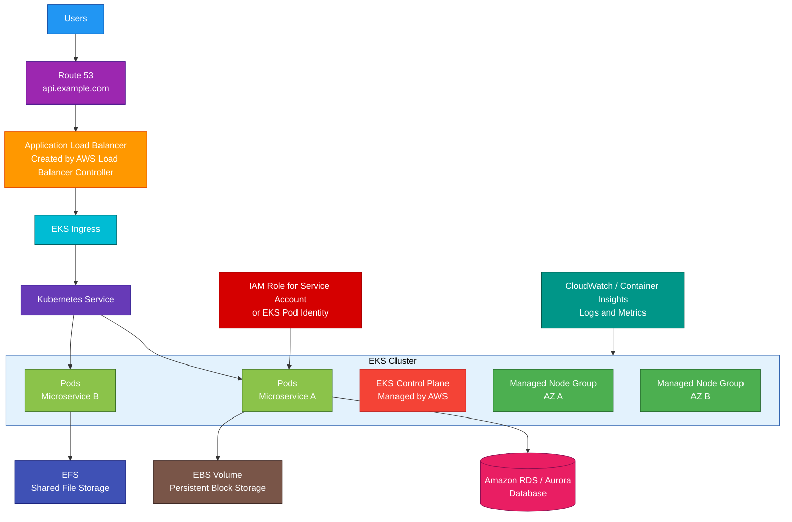

# EKS

## 1. Definition

### Simple Definition

Amazon EKS, or Elastic Kubernetes Service, is AWS’s managed Kubernetes service.

It lets you run Kubernetes clusters on AWS without managing the Kubernetes control plane yourself.

### Memory Hook

EKS = Elastic Kubernetes Service = Managed Kubernetes on AWS.

### Basic Idea

You run containerized applications using Kubernetes.

AWS manages the Kubernetes control plane, while you choose where your worker nodes run.

### Key Point

EKS is for Kubernetes workloads.

If you do not need Kubernetes, ECS is usually simpler.

## 2. What Problem Does It Solve?

### Main Problem

EKS solves the problem of running Kubernetes on AWS without manually operating the Kubernetes control plane.

### Without EKS

You may need to manage:

- Kubernetes API servers
- etcd database
- Control plane scaling
- Control plane patching
- Control plane high availability
- Kubernetes version upgrades
- Control plane security
- Integration with AWS services

### With EKS

AWS manages the Kubernetes control plane for you.

You focus on:

- Worker nodes
- Pods
- Deployments
- Services
- Networking
- IAM and Kubernetes RBAC
- Application scaling
- Cluster add-ons

### Key Benefit

EKS gives you managed Kubernetes with deep AWS integration.

## 3. Core Use Cases

### Kubernetes Workloads on AWS

Use EKS when your applications already use Kubernetes or require Kubernetes APIs.

Examples:

- Kubernetes Deployments
- Kubernetes Services
- Kubernetes Ingress
- Helm charts
- Operators
- Custom Resource Definitions

### Microservices

EKS is commonly used to run microservices at scale.

Example services:

- User service
- Order service
- Payment service
- Inventory service

### Container Platform Standardization

Use EKS when your organization wants a standard Kubernetes platform across teams.

### Hybrid and Multi-Cloud Kubernetes

Use EKS when Kubernetes portability is important.

Applications using Kubernetes manifests can often move more easily between environments than AWS-specific container platforms.

### Advanced Container Orchestration

Choose EKS when you need advanced Kubernetes features such as:

- Operators
- Custom controllers
- Custom scheduling
- Kubernetes-native tooling
- Service mesh integrations

### Serverless Kubernetes Pods

Use EKS with AWS Fargate when you want to run Kubernetes pods without managing EC2 worker nodes.

### Batch and ML Workloads

EKS can run containerized batch, data processing, and machine learning workloads when Kubernetes is the chosen orchestration platform.

## 4. Important Features for SAA

### Cluster

An EKS cluster includes:

- Managed Kubernetes control plane
- Worker compute
- Networking
- Add-ons
- IAM and Kubernetes access configuration

### Control Plane

The control plane runs Kubernetes management components.

AWS manages:

- API server
- etcd
- Control plane availability
- Control plane scaling
- Control plane patching

Important exam point:

AWS manages the EKS control plane, but you still manage the worker nodes unless using Fargate.

### Worker Nodes

Worker nodes run your application pods.

EKS supports different worker options:

| Worker Option | Description |
|---|---|
| Managed Node Groups | AWS-managed EC2 worker groups |
| Self-Managed Nodes | You manage EC2 worker nodes yourself |
| Fargate | Serverless pod compute |

### Managed Node Groups

Managed node groups simplify EC2 worker node management.

AWS helps with:

- Node provisioning
- Node updates
- Auto Scaling Group integration
- Health replacement
- Kubernetes node lifecycle

### Self-Managed Nodes

Self-managed nodes give more control but more responsibility.

You manage:

- EC2 instances
- AMIs
- Scaling
- Patching
- Upgrades
- Node replacement

### Fargate for EKS

Fargate lets you run pods without managing EC2 nodes.

Important points:

- No EC2 worker node management
- Each pod runs in isolated serverless compute
- Good for simpler workloads
- Not every Kubernetes feature or daemon pattern fits Fargate

### Pod

A pod is the smallest deployable unit in Kubernetes.

A pod can contain one or more containers.

### Deployment

A Deployment manages replicas of pods.

It helps with:

- Rolling updates
- Scaling
- Self-healing
- Version rollout

### Service

A Kubernetes Service provides stable networking for pods.

Common service types:

| Service Type | Purpose |
|---|---|
| ClusterIP | Internal cluster access |
| NodePort | Exposes service on node port |
| LoadBalancer | Creates AWS load balancer |
| ExternalName | Maps service to external DNS name |

### Ingress

Ingress manages HTTP/HTTPS routing into the cluster.

In AWS, the AWS Load Balancer Controller can create an Application Load Balancer for Kubernetes Ingress.

### AWS Load Balancer Controller

AWS Load Balancer Controller integrates Kubernetes with AWS load balancers.

It can create:

- ALB for Ingress
- NLB for Services

### VPC CNI

Amazon VPC CNI gives pods IP addresses from the VPC.

Important exam point:

EKS pods can receive VPC IP addresses, which allows direct VPC networking behavior.

### EKS Add-ons

EKS add-ons are operational components for the cluster.

Common add-ons:

- VPC CNI
- CoreDNS
- kube-proxy
- EBS CSI driver
- EFS CSI driver

### Storage Options

EKS can use several AWS storage services.

| Storage | Best For |
|---|---|
| EBS | Block storage for one pod/node workload |
| EFS | Shared file storage across pods |
| FSx for Lustre | High-performance file workloads |
| S3 | Object storage, accessed through application SDKs |

### EBS CSI Driver

The EBS CSI driver allows Kubernetes to create and manage EBS volumes.

Use it for persistent block storage.

Important point:

EBS volumes are AZ-scoped.

### EFS CSI Driver

The EFS CSI driver allows pods to mount EFS file systems.

Use it when multiple pods need shared file storage across AZs.

### Autoscaling

EKS supports multiple scaling layers.

| Scaling Type | Purpose |
|---|---|
| Horizontal Pod Autoscaler | Scales pod replicas |
| Cluster Autoscaler | Adds or removes worker nodes |
| Karpenter | Flexible node provisioning and scaling |
| Vertical Pod Autoscaler | Adjusts pod resource requests |

### Kubernetes RBAC

Kubernetes RBAC controls permissions inside the Kubernetes cluster.

Examples:

- Who can create pods
- Who can read secrets
- Who can modify deployments
- Who can access namespaces

### IAM Integration

EKS integrates with IAM for AWS-level authentication and service access.

Important exam point:

IAM controls access to AWS APIs.

Kubernetes RBAC controls access inside Kubernetes.

### IRSA

IAM Roles for Service Accounts, or IRSA, lets Kubernetes pods use IAM roles.

Example:

A pod needs to read from S3.

Attach an IAM role to the pod’s Kubernetes service account.

### EKS Pod Identity

EKS Pod Identity is another AWS-managed way to give IAM permissions to Kubernetes workloads.

For SAA, remember the key idea:

Pods should use IAM roles, not hardcoded AWS access keys.

### kubectl

`kubectl` is the command-line tool used to interact with Kubernetes clusters.

Examples:

- Create deployments
- View pods
- Check services
- Apply manifests

### eksctl

`eksctl` is a popular command-line tool for creating and managing EKS clusters.

It is useful for quickly building EKS environments.

### Helm

Helm is a package manager for Kubernetes.

It is commonly used to install applications and controllers into EKS.

## 5. Security Model

### IAM Permissions

IAM controls who can create and manage EKS resources in AWS.

Common permissions:

| Permission | Purpose |
|---|---|
| `eks:CreateCluster` | Create EKS cluster |
| `eks:DescribeCluster` | View cluster details |
| `eks:UpdateClusterConfig` | Update cluster settings |
| `eks:DeleteCluster` | Delete cluster |
| `eks:CreateNodegroup` | Create managed node group |
| `eks:UpdateNodegroupConfig` | Update node group |

### IAM vs Kubernetes RBAC

EKS uses both IAM and Kubernetes RBAC.

| Control Type | Purpose |
|---|---|
| IAM | Controls AWS API access |
| Kubernetes RBAC | Controls Kubernetes cluster permissions |

### Cluster Access

Access to the EKS cluster should be carefully controlled.

Use least privilege for:

- Cluster administrators
- Developers
- CI/CD systems
- Service accounts
- Node roles

### Node IAM Role

Worker nodes need an IAM role to communicate with AWS services and the EKS control plane.

This role should not be overly permissive.

### Pod IAM Permissions

Applications running in pods should use IAM roles through IRSA or EKS Pod Identity.

Best practice:

Give each workload only the AWS permissions it needs.

### Secrets Management

Do not store secrets in container images.

Use secure options such as:

- Kubernetes Secrets with encryption controls
- AWS Secrets Manager
- Systems Manager Parameter Store
- External Secrets operators
- KMS encryption

### Security Groups

EKS uses VPC security groups to control network access.

Common controls:

- Control plane to node communication
- Load balancer to pod or node traffic
- Pod traffic to databases
- Node outbound access

### Network Policies

Kubernetes NetworkPolicies can control pod-to-pod traffic.

Important point:

Network policy enforcement requires a compatible network policy engine.

### Private Cluster Endpoint

EKS API endpoint access can be public, private, or both.

For stronger security, use private endpoint access where appropriate.

### Encryption at Rest

EKS can encrypt Kubernetes secrets using AWS KMS.

Storage services used by workloads should also enable encryption.

Examples:

- EBS encryption
- EFS encryption
- S3 encryption
- RDS encryption

### Encryption in Transit

Use TLS for traffic between clients, load balancers, services, and applications.

For service-to-service security, some environments use a service mesh.

### Image Security

Use secure container image practices:

- Store images in Amazon ECR
- Scan images
- Use trusted base images
- Patch images regularly
- Avoid secrets in images
- Use least privilege containers

### Shared Responsibility

AWS is responsible for:

- EKS managed control plane
- Control plane availability
- Control plane patching
- Managed service infrastructure
- Physical security

You are responsible for:

- Worker node security
- Kubernetes RBAC
- IAM permissions
- Pod security
- Container image security
- Network policies
- Secrets management
- Cluster add-ons
- Application security
- Node patching when using EC2 nodes

## 6. High Availability / Durability Behavior

### Availability

EKS is designed for high availability.

AWS runs the managed control plane across multiple Availability Zones.

### Control Plane HA

AWS manages the control plane across multiple AZs.

You do not manually run Kubernetes API servers or etcd.

### Worker Node HA

You are responsible for worker node availability.

For production, run worker nodes across multiple Availability Zones.

### Multi-AZ Node Groups

Use managed node groups across multiple subnets in different AZs.

This allows pods to run across multiple AZs.

### Pod Availability

Use Kubernetes Deployments with multiple replicas.

This allows Kubernetes to replace failed pods and spread workloads.

### Load Balancer HA

Use AWS load balancers across multiple AZs.

Common choices:

- ALB for HTTP/HTTPS
- NLB for TCP/UDP

### Fargate HA

With EKS on Fargate, AWS manages the compute infrastructure.

You still configure pod placement through namespaces, profiles, and subnets.

### Multi-Region Behavior

EKS clusters are regional.

For Multi-Region applications, deploy separate EKS clusters in multiple Regions.

Use global routing services such as:

- Route 53
- CloudFront
- AWS Global Accelerator

### Durability

EKS is a container orchestration service, not durable storage.

Store persistent data in durable services such as:

- S3
- EBS
- EFS
- RDS
- Aurora
- DynamoDB

### Stateless Design

For better reliability, design application pods to be stateless when possible.

Store state outside the pod.

### Important Exam Point

EKS manages the Kubernetes control plane, but you must design worker nodes, pods, storage, and applications for high availability.

## 7. Cost Optimization Options

### Choose the Right Compute Option

Use the compute model that fits your workload.

| Option | Cost Pattern |
|---|---|
| Managed Node Groups | Good balance of control and management |
| Self-Managed Nodes | More control, more operational work |
| Fargate | Pay per pod resources, less management |
| Spot Instances | Lower cost for interruptible workloads |

### Use EC2 Spot for Fault-Tolerant Workloads

Spot Instances can reduce cost for workloads that tolerate interruption.

Good examples:

- Batch jobs
- Stateless services
- CI/CD workers
- Data processing jobs

### Use Fargate for Variable Workloads

Fargate can be cost-effective when workloads are variable and you want to avoid paying for idle EC2 nodes.

### Right-Size Pod Requests

Kubernetes schedules pods based on CPU and memory requests.

Over-requesting resources wastes capacity.

Monitor and tune:

- CPU requests
- Memory requests
- Limits
- Replica counts

### Use Autoscaling

Use autoscaling to match capacity to demand.

Common tools:

- Horizontal Pod Autoscaler
- Cluster Autoscaler
- Karpenter
- Managed node group scaling

### Use Karpenter for Flexible Scaling

Karpenter can provision right-sized nodes based on pending pod requirements.

This can reduce wasted capacity.

### Avoid Idle Clusters

EKS clusters have control plane cost.

Delete unused development or test clusters.

### Use One Cluster Carefully

Running many tiny clusters can increase control plane and management cost.

However, do not combine workloads if isolation, compliance, or security requires separate clusters.

### Optimize Load Balancers

Each Kubernetes Service of type LoadBalancer may create an AWS load balancer.

Avoid creating unnecessary load balancers.

Use Ingress when multiple HTTP services can share an ALB.

### Manage Logs and Metrics

EKS logs and Container Insights can create cost.

Use:

- Appropriate log levels
- CloudWatch retention policies
- Metrics filtering
- S3 lifecycle policies for archived logs

## 8. Common Exam Traps

### EKS vs ECS

EKS is Kubernetes.

ECS is AWS-native container orchestration.

If the question requires Kubernetes, choose EKS.

If Kubernetes is not required and simplicity is preferred, ECS may be better.

### EKS Does Not Mean Serverless by Default

EKS manages the control plane, but worker nodes may still be EC2 instances.

Use Fargate if you want serverless pod compute.

### Control Plane vs Worker Nodes

AWS manages the EKS control plane.

You manage worker capacity unless using Fargate.

### EKS Is Not Just EC2

EKS can run workloads on:

- Managed node groups
- Self-managed EC2 nodes
- Fargate

### Kubernetes RBAC Is Not IAM

IAM controls AWS access.

Kubernetes RBAC controls Kubernetes API permissions.

They are related but not the same.

### Pods Need IAM Roles Safely

Do not store AWS access keys in pods.

Use IRSA or EKS Pod Identity for AWS service access.

### EBS Is AZ-Scoped

If a pod uses EBS, it must run in the same AZ as the EBS volume.

For shared multi-AZ file storage, use EFS.

### Fargate Does Not Support Every Daemon Pattern

Some workloads need DaemonSets or host-level access.

These often fit better on EC2 worker nodes than Fargate.

### LoadBalancer Service Can Create AWS Load Balancers

A Kubernetes Service of type `LoadBalancer` can create AWS load balancer resources.

This can affect cost and architecture.

### EKS Is Regional

An EKS cluster runs in one Region.

For Multi-Region resilience, deploy separate clusters in multiple Regions.

### Cluster Add-ons Need Maintenance

EKS add-ons like VPC CNI, CoreDNS, kube-proxy, and CSI drivers should be kept updated.

### EKS Is More Complex Than ECS

EKS gives Kubernetes flexibility, but with more operational complexity.

Choose EKS when Kubernetes is required or valuable.

## 9. Compare With Similar Services

### Service Comparison Table

| Service | Main Purpose | Best For | Choose When |
|---|---|---|---|
| EKS | Managed Kubernetes | Kubernetes workloads | You need Kubernetes APIs and ecosystem |
| ECS | AWS-native container orchestration | Running containers simply on AWS | You do not need Kubernetes |
| Fargate | Serverless container compute | Containers without managing servers | You want serverless compute for ECS or EKS |
| EC2 | Virtual machines | Full OS control | You need custom servers or node control |
| Lambda | Serverless functions | Event-driven short tasks | You need function-based compute |
| Elastic Beanstalk | App deployment platform | Easy app deployment | You want AWS to manage app infrastructure |
| App Runner | Simple web/container hosting | Simple containerized web apps | You want minimal container service setup |

### EKS vs ECS

| Feature | EKS | ECS |
|---|---|---|
| Orchestrator | Kubernetes | AWS-native ECS |
| Complexity | Higher | Lower |
| Portability | Strong Kubernetes portability | More AWS-specific |
| Best for | Kubernetes teams and tools | Simpler AWS container workloads |
| Common exam clue | Kubernetes required | Run containers without Kubernetes |

### EKS with Fargate vs EKS with EC2 Nodes

| Feature | EKS with Fargate | EKS with EC2 Nodes |
|---|---|---|
| Server management | AWS manages compute | You manage node capacity |
| Operational effort | Lower | Higher |
| Kubernetes flexibility | Lower than EC2 nodes | Higher |
| Best for | Simpler pod workloads | Advanced Kubernetes workloads |
| DaemonSets/host access | Limited | Supported |

### EKS vs Lambda

| Feature | EKS | Lambda |
|---|---|---|
| Compute style | Containers on Kubernetes | Serverless functions |
| Runtime duration | Long-running services supported | Max 15 minutes |
| Management | Kubernetes management needed | Minimal infrastructure management |
| Best for | Complex container platforms | Event-driven short-running code |

### EKS vs Elastic Beanstalk

| Feature | EKS | Elastic Beanstalk |
|---|---|---|
| Main purpose | Kubernetes orchestration | Managed app platform |
| Abstraction | Container platform | Application platform |
| Best for | Kubernetes microservices | Traditional app deployment |
| Complexity | Higher | Lower |

### EKS vs App Runner

| Feature | EKS | App Runner |
|---|---|---|
| Main purpose | Full Kubernetes platform | Simple managed web services |
| Configuration | More flexible | Much simpler |
| Best for | Complex container workloads | Simple web apps and APIs |
| Kubernetes support | Yes | No |

### When to Choose EKS

Choose EKS when:

- You need Kubernetes
- You already use Kubernetes manifests or Helm charts
- You need Kubernetes operators or CRDs
- You need advanced container orchestration
- You need portability across Kubernetes environments
- You need fine-grained Kubernetes networking and scheduling
- Your team already has Kubernetes skills
- ECS is too simple for the required platform needs

## 10. Mini Architecture Example

### Scenario

A company wants to run a Kubernetes-based microservices platform on AWS.

The platform should support public APIs, private workloads, autoscaling, and persistent storage.

### Architecture

Use EKS with managed node groups across multiple Availability Zones.

Use an Application Load Balancer through the AWS Load Balancer Controller for public ingress.

Use EBS for block storage and EFS for shared file storage.

Use IAM roles for service accounts or EKS Pod Identity for pod permissions.

### Why This Is Good

- EKS provides managed Kubernetes control plane
- Managed node groups run workloads across multiple AZs
- ALB exposes HTTP/HTTPS applications
- Kubernetes Services provide stable internal access
- Pods run containerized microservices
- IAM roles for pods avoid hardcoded AWS credentials
- EBS supports persistent block storage
- EFS supports shared file storage
- CloudWatch provides logs and metrics

### Exam Answer Pattern

If the question says:

“Run Kubernetes workloads on AWS with a managed Kubernetes control plane.”

Think:

Amazon EKS.

If the question says:

“Run containers without Kubernetes and with less operational complexity.”

Think:

Amazon ECS.

If the question says:

“Run containers without managing EC2 instances.”

Think:

Fargate with ECS or EKS.

### Final Memory Hook

EKS = Managed Kubernetes.

ECS = AWS-native containers.

Fargate = Serverless container compute.

Pod = Smallest Kubernetes workload unit.

Deployment = Manages pod replicas.

Service = Stable access to pods.

Ingress = HTTP routing into the cluster.

IRSA / Pod Identity = IAM permissions for pods.

EBS = Block storage.

EFS = Shared file storage.

