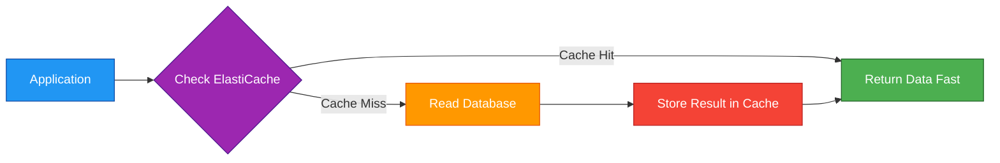
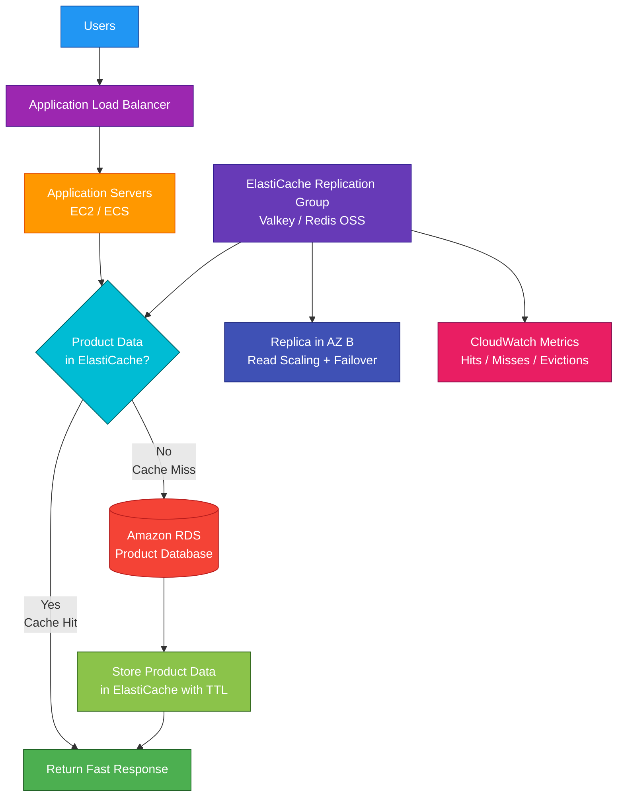

# Amazon ElastiCache

## 1. Definition

### Simple Definition

Amazon ElastiCache is a fully managed in-memory caching service.

It helps applications retrieve frequently used data very quickly by storing that data in memory instead of repeatedly reading it from a slower database.

### Memory Hook

ElastiCache = Elastic in-memory cache for faster applications.

### Basic Idea

Your application checks the cache first.

If the data is found, the app gets a very fast response.

If the data is not found, the app reads from the database and can store the result in the cache for next time.

### Supported Engines

Amazon ElastiCache supports:

| Engine | Best For |
|---|---|
| Valkey | Redis-compatible caching with modern open-source engine |
| Redis OSS | Redis-compatible caching, data structures, pub/sub, replicas |
| Memcached | Simple, high-throughput, distributed object caching |

## 2. What Problem Does It Solve?

### Main Problem

ElastiCache solves the problem of slow or overloaded databases caused by repeated reads of the same data.

Instead of asking the database the same question again and again, the application can store frequently used results in ElastiCache.

### Without ElastiCache

Applications may suffer from:

- Slow database reads
- High database load
- Expensive database scaling
- Poor user experience
- Repeated queries for the same data
- Session data stored inefficiently
- High latency for frequently accessed data

### With ElastiCache

Frequently accessed data is stored in memory.

This improves:

- Application speed
- Database performance
- Read scalability
- User experience
- Cost efficiency for read-heavy workloads

### Key Benefit

ElastiCache reduces latency and offloads repeated read traffic from databases.

## 3. Core Use Cases

### Database Query Caching

Store results from expensive database queries.

Example:

A product page repeatedly reads the same product details from RDS.

ElastiCache can store the result and reduce database load.

### Session Store

Store user session data for web applications.

Example:

A user logs in, and their session is stored in ElastiCache so multiple application servers can access it.

### Leaderboards

Use Valkey or Redis OSS sorted sets to build gaming or ranking leaderboards.

Example:

Store player scores and quickly retrieve top players.

### Real-Time Counters

Use ElastiCache for fast counters.

Examples:

- Page views
- Likes
- Votes
- Rate limits
- Inventory checks

### Pub/Sub Messaging

Valkey and Redis OSS support publish/subscribe messaging patterns.

Use this for lightweight real-time messaging between application components.

### Caching API Responses

Cache responses from slow or expensive backend services.

Example:

An API calls several services to build a response, then caches the result for future requests.

### Reduce Database Cost

Caching can reduce the need to scale the database for read-heavy workloads.

This can lower cost while improving performance.

## 4. Important Features for SAA

### In-Memory Storage

ElastiCache stores data in memory.

Memory is much faster than disk-based storage.

This makes ElastiCache useful for low-latency workloads.

### Cache Hit

A cache hit means the requested data is found in the cache.

This gives a fast response and avoids a database call.

### Cache Miss

A cache miss means the requested data is not in the cache.

The application must read from the database or source system.

### Cache-Aside Pattern

Cache-aside is the most common caching pattern.

Steps:

1. Application checks cache.
2. If data exists, return it.
3. If data does not exist, read from database.
4. Store result in cache.
5. Return data to user.

### Write-Through Pattern

In write-through caching, the application writes data to the cache and database together.

This helps keep cache data updated but adds write complexity.

### Lazy Loading

Lazy loading means data is loaded into the cache only when requested.

This avoids caching unused data.

### Time to Live

Time to Live, or TTL, controls how long cached data stays in the cache.

Use TTL to prevent stale data from living forever.

Example:

Cache product recommendations for 10 minutes.

### Eviction

Eviction happens when ElastiCache removes data from memory.

This can happen when:

- TTL expires
- Memory is full
- Eviction policy removes old or less-used data

### Valkey

Valkey is an open-source Redis-compatible engine supported by ElastiCache.

It is useful when you want Redis-compatible features with a modern open-source engine.

### Redis OSS

Redis OSS is an in-memory data store that supports rich data structures.

Common Redis-style data structures:

- Strings
- Hashes
- Lists
- Sets
- Sorted sets
- Streams

### Memcached

Memcached is a simple distributed in-memory cache.

Best for:

- Simple key-value caching
- Very high throughput
- Horizontal scaling
- Simple object caching

### Valkey / Redis OSS vs Memcached

| Feature | Valkey / Redis OSS | Memcached |
|---|---|---|
| Data structures | Rich | Simple key-value |
| Replication | Yes | No native replication like Redis-style engines |
| Persistence options | Available depending on configuration | No persistence |
| Pub/Sub | Yes | No |
| Multi-AZ failover | Yes with replication groups | Not the same model |
| Best for | Advanced caching and HA | Simple distributed cache |

### ElastiCache Serverless

ElastiCache Serverless automatically manages capacity.

Use it when you want less capacity planning and automatic scaling for caching workloads.

### Node-Based Clusters

Node-based clusters give more control over:

- Node type
- Number of nodes
- Shards
- Replicas
- Placement
- Engine version
- Scaling strategy

### Replication Group

For Valkey and Redis OSS, a replication group includes a primary node and optional replica nodes.

The primary handles writes.

Replicas can serve reads and support failover.

### Primary Node

The primary node accepts writes.

For high availability, it should have replicas in different Availability Zones.

### Replica Node

Replica nodes copy data from the primary.

They can be used for:

- Read scaling
- High availability
- Failover target

### Multi-AZ with Automatic Failover

For Valkey and Redis OSS, Multi-AZ with automatic failover can promote a replica if the primary fails.

This improves availability.

### Cluster Mode

Cluster mode partitions data across multiple shards.

Use cluster mode when you need to scale beyond one primary node.

### Shard

A shard is a partition of cache data.

Each shard has a primary node and optional replicas.

More shards can increase write capacity and storage capacity.

### Read Replicas

Read replicas can serve read traffic.

This helps scale read-heavy workloads.

### Global Datastore

Global Datastore provides cross-Region replication for Valkey and Redis OSS workloads.

Use it for:

- Multi-Region read access
- Disaster recovery
- Low-latency reads closer to users

### Subnet Group

An ElastiCache subnet group defines which VPC subnets the cache can use.

Use private subnets for production cache clusters.

### Parameter Group

A parameter group controls engine configuration settings.

Examples:

- Eviction behavior
- Memory settings
- Engine-specific tuning

### Backup and Restore

Valkey and Redis OSS support backups through snapshots.

Backups can help restore cache data after failure or migration.

Important point:

For many cache use cases, the database remains the source of truth.

### Memcached Auto Discovery

Memcached supports auto discovery so clients can discover cache nodes automatically.

This helps applications adapt when nodes are added or removed.

## 5. Security Model

### IAM Permissions

IAM controls who can create, modify, delete, and manage ElastiCache resources.

Common permissions:

| Permission | Purpose |
|---|---|
| `elasticache:CreateCacheCluster` | Create a cache cluster |
| `elasticache:CreateReplicationGroup` | Create a replication group |
| `elasticache:ModifyReplicationGroup` | Modify replication settings |
| `elasticache:DeleteCacheCluster` | Delete cache cluster |
| `elasticache:CreateSnapshot` | Create backup snapshot |
| `elasticache:DescribeCacheClusters` | View cluster details |

### Data Access vs Management Access

IAM controls management actions through AWS APIs.

Application data access is usually controlled through:

- Network access
- Security groups
- Authentication tokens or users where supported
- TLS settings
- Engine-specific access controls

### VPC Placement

ElastiCache runs inside a VPC.

Production caches should usually be deployed in private subnets, not exposed publicly.

### Security Groups

Security groups control which resources can connect to ElastiCache.

Common pattern:

- Application security group can connect to ElastiCache
- ElastiCache security group allows inbound cache port only from the application security group

### Common Ports

| Engine | Common Port |
|---|---:|
| Valkey / Redis OSS | 6379 |
| Memcached | 11211 |

### Encryption in Transit

ElastiCache supports encryption in transit for secure communication between clients and the cache.

Use TLS when sensitive data moves between applications and ElastiCache.

### Encryption at Rest

ElastiCache supports encryption at rest for supported engines and configurations.

This protects stored data, backups, and related storage.

### Authentication

Valkey and Redis OSS can support authentication features such as passwords or user-based access controls, depending on engine and configuration.

Use authentication to reduce the risk of unauthorized cache access.

### KMS Encryption

Where supported, ElastiCache can use AWS KMS for encryption at rest.

Make sure KMS permissions allow the required users and services to use the key.

### Secrets Management

Do not hardcode cache passwords or tokens in application code.

Use:

- AWS Secrets Manager
- Systems Manager Parameter Store
- KMS-encrypted configuration

### Network Isolation

ElastiCache should not be treated as a public internet service.

Use:

- Private subnets
- Security groups
- NACLs where needed
- VPC routing controls
- Least privilege network access

### Shared Responsibility

AWS is responsible for:

- ElastiCache managed infrastructure
- Hardware provisioning
- Managed service availability
- Patching options
- Node replacement
- Physical security

You are responsible for:

- Security groups
- Subnet placement
- Authentication configuration
- Encryption settings
- IAM permissions
- Cache data design
- Backup settings
- Client configuration
- Preventing public or broad network access

## 6. High Availability / Durability Behavior

### Availability

ElastiCache availability depends on engine and configuration.

For production, use Multi-AZ where supported.

### Valkey / Redis OSS High Availability

For Valkey and Redis OSS, use replication groups with replicas in multiple Availability Zones.

This supports automatic failover when enabled.

### Automatic Failover

Automatic failover promotes a replica to primary if the primary fails.

This helps reduce downtime.

### Read Replicas

Read replicas improve availability and read scalability.

If the primary node fails, a replica can become the new primary when automatic failover is enabled.

### Cluster Mode Availability

With cluster mode, data is spread across multiple shards.

Each shard can have replicas for high availability.

### Memcached Availability

Memcached is designed for simple distributed caching.

It does not provide the same built-in replication and automatic failover model as Valkey or Redis OSS.

If a Memcached node fails, cached data on that node may be lost.

### Durability

ElastiCache is primarily a cache, not a durable database.

For most architectures, the durable source of truth should be:

- RDS
- Aurora
- DynamoDB
- S3
- Another persistent database or storage service

### Snapshots

Valkey and Redis OSS snapshots can help with restore and migration.

However, do not treat cache snapshots as a replacement for database backups.

### Multi-AZ Behavior

For high availability:

- Place replicas in different AZs
- Enable automatic failover
- Use multiple subnets in the subnet group
- Make applications reconnect correctly after failover

### Multi-Region Behavior

Global Datastore can replicate Valkey or Redis OSS data across Regions.

Use it for:

- Disaster recovery
- Low-latency global reads
- Multi-Region application architectures

### Important Exam Point

ElastiCache improves application performance, but it should usually not be the only copy of important data.

## 7. Cost Optimization Options

### Cache the Right Data

Only cache data that improves performance or reduces backend load.

Good candidates:

- Frequently read data
- Expensive query results
- Session data
- API responses
- Computed values

### Use TTLs

TTL helps remove old data automatically.

This reduces memory usage and stale data risk.

### Right-Size Nodes

For node-based clusters, choose node sizes based on:

- Memory usage
- CPU usage
- Network throughput
- Connection count
- Read/write traffic

### Use Serverless for Variable Workloads

ElastiCache Serverless can reduce capacity planning for unpredictable or variable workloads.

Use it when you want AWS to scale cache capacity automatically.

### Use Reserved Nodes for Steady Workloads

For predictable long-running node-based workloads, reserved nodes can reduce cost.

### Avoid Over-Replication

Replicas improve availability and read scaling but add cost.

Use the number of replicas that matches availability and read requirements.

### Choose the Right Engine

| Requirement | Cost-Aware Choice |
|---|---|
| Simple key-value cache | Memcached |
| Advanced data structures or HA | Valkey / Redis OSS |
| Less capacity planning | ElastiCache Serverless |
| More control | Node-based cluster |

### Monitor Evictions

Frequent evictions may mean the cache is too small or TTL settings are poor.

Monitor memory usage and eviction metrics.

### Avoid Caching Huge Objects

Large objects consume memory quickly.

For large files or objects, store them in S3 and cache metadata or keys instead.

### Use CloudWatch Metrics

Monitor:

- CPU utilization
- Memory usage
- Evictions
- Cache hits
- Cache misses
- Connections
- Replication lag
- Network traffic

## 8. Common Exam Traps

### ElastiCache Is Not a Primary Database

ElastiCache is usually a cache.

Do not use it as the only durable source of important data unless the scenario clearly supports that design.

### Cache Hit vs Cache Miss

| Term | Meaning |
|---|---|
| Cache hit | Data found in cache |
| Cache miss | Data not found, must read from source |

### Valkey / Redis OSS vs Memcached

Choose Valkey or Redis OSS when you need:

- Replication
- Automatic failover
- Backups
- Rich data structures
- Pub/Sub
- Sorted sets
- Global Datastore

Choose Memcached when you need:

- Simple key-value caching
- Simple horizontal scaling
- Very lightweight distributed cache

### Multi-AZ Is Not Automatic for Every Setup

For high availability with Valkey or Redis OSS, configure replicas and automatic failover.

Do not assume a single cache node is highly available.

### Memcached Node Failure Can Lose Cached Data

Memcached does not provide the same replication model as Redis-style engines.

If a node fails, data cached on that node can be lost.

### ElastiCache Does Not Reduce Write Load Automatically

Caching mainly helps reduce repeated reads.

Write-heavy workloads may need database scaling, queueing, or architecture changes.

### Stale Data Risk

Cached data can become stale.

Use TTLs, invalidation, or write-through patterns when freshness matters.

### Security Groups Still Matter

If the application cannot connect to ElastiCache, check:

- Security groups
- Subnet routing
- NACLs
- Correct port
- TLS/auth settings

### Public Access Is Not the Goal

ElastiCache should usually be private inside a VPC.

Applications connect from private subnets or allowed network paths.

### Cache Size Matters

If the cache is too small, evictions increase and hit rate decreases.

A low hit rate means the cache is not helping much.

### ElastiCache vs DAX

DAX is a dedicated cache for DynamoDB.

ElastiCache is a general-purpose in-memory cache.

### ElastiCache vs CloudFront

CloudFront caches content at edge locations for global users.

ElastiCache caches application data inside your backend architecture.

## 9. Compare With Similar Services

### Service Comparison Table

| Service | Main Purpose | Best For | Choose When |
|---|---|---|---|
| ElastiCache | In-memory caching | Fast app data caching | You need low-latency access to frequently used data |
| DAX | DynamoDB cache | DynamoDB read acceleration | You need microsecond reads for DynamoDB |
| CloudFront | CDN edge caching | Static/dynamic web content near users | You need global content acceleration |
| RDS | Relational database | SQL transactions and joins | You need durable relational data |
| DynamoDB | NoSQL database | Serverless key-value/document data | You need durable NoSQL at scale |
| MemoryDB | Durable Redis-compatible database | Redis-compatible primary database | You need Redis-compatible durable data storage |

### Valkey / Redis OSS vs Memcached

| Feature | Valkey / Redis OSS | Memcached |
|---|---|---|
| Data model | Rich structures | Simple key-value |
| Replication | Yes | No native replication model |
| Automatic failover | Yes, with replicas | Not like Redis-style engines |
| Persistence/snapshots | Supported | No |
| Pub/Sub | Yes | No |
| Best for | Advanced cache and HA | Simple distributed cache |

### ElastiCache vs DAX

| Feature | ElastiCache | DAX |
|---|---|---|
| Main purpose | General cache | DynamoDB-specific cache |
| Works with | Many apps/databases | DynamoDB only |
| Engine | Valkey, Redis OSS, Memcached | DynamoDB Accelerator |
| Best for | RDS/API/session/general cache | DynamoDB read-heavy workloads |

### ElastiCache vs CloudFront

| Feature | ElastiCache | CloudFront |
|---|---|---|
| Cache location | Inside application backend/VPC | AWS edge locations |
| Best for | Database query results, sessions, counters | Web content and APIs near users |
| Access pattern | Application uses cache directly | Users access through CDN |
| Example | Cache product query result | Cache images, CSS, API responses |

### ElastiCache vs RDS

| Feature | ElastiCache | RDS |
|---|---|---|
| Main purpose | In-memory cache | Relational database |
| Durability | Cache-focused | Durable database |
| Query language | Engine-specific commands | SQL |
| Best for | Speeding up repeated access | Source of truth for relational data |
| Common use together | Cache reads | Store durable records |

### ElastiCache vs MemoryDB

| Feature | ElastiCache | MemoryDB |
|---|---|---|
| Main purpose | Cache | Durable Redis-compatible database |
| Durability focus | Lower, cache-oriented | Higher, database-oriented |
| Best for | Reduce latency and database load | Primary Redis-compatible data store |
| Exam clue | Cache frequently accessed data | Durable Redis-compatible database needed |

### When to Choose ElastiCache

Choose ElastiCache when:

- You need in-memory caching
- You need to reduce database read load
- You need very low-latency reads
- You need session storage
- You need leaderboards or counters
- You need Redis-compatible data structures
- You need simple Memcached object caching
- You need a managed cache instead of self-managed Redis or Memcached

## 10. Mini Architecture Example

### Scenario

A company runs an e-commerce application using an Application Load Balancer, application servers, and Amazon RDS.

Product pages are slow because the application repeatedly queries the database for the same product information.

The company wants faster reads and less database load.

### Architecture

Use Amazon ElastiCache for Valkey or Redis OSS as a cache.

The application checks ElastiCache before querying RDS.

If the product data is not cached, the application reads from RDS and stores the result in ElastiCache with a TTL.

### Why This Is Good

- ElastiCache reduces repeated database reads
- Product pages respond faster
- RDS has less read load
- TTL reduces stale data risk
- Replicas improve read scaling and availability
- Multi-AZ with automatic failover improves resilience
- CloudWatch metrics show cache hit rate and evictions
- The database remains the durable source of truth

### Exam Answer Pattern

If the question says:

“Improve application performance by caching frequently accessed database query results.”

Think:

Amazon ElastiCache.

If the question says:

“Need Redis-compatible rich data structures, replication, failover, or pub/sub.”

Think:

ElastiCache for Valkey or Redis OSS.

If the question says:

“Need a simple distributed key-value object cache.”

Think:

ElastiCache for Memcached.

If the question says:

“Need DynamoDB-specific caching.”

Think:

DAX.

### Final Memory Hook

ElastiCache = In-memory cache.

Valkey / Redis OSS = Advanced cache with data structures, replicas, and failover.

Memcached = Simple distributed key-value cache.

Cache hit = Fast response.

Cache miss = Read from source.

TTL = Expire old cache data.

Eviction = Cache removes data due to memory pressure or policy.

Multi-AZ + replicas = Better availability.

DAX = DynamoDB-specific cache.

CloudFront = Edge cache for users.

RDS/DynamoDB = Durable source of truth.

