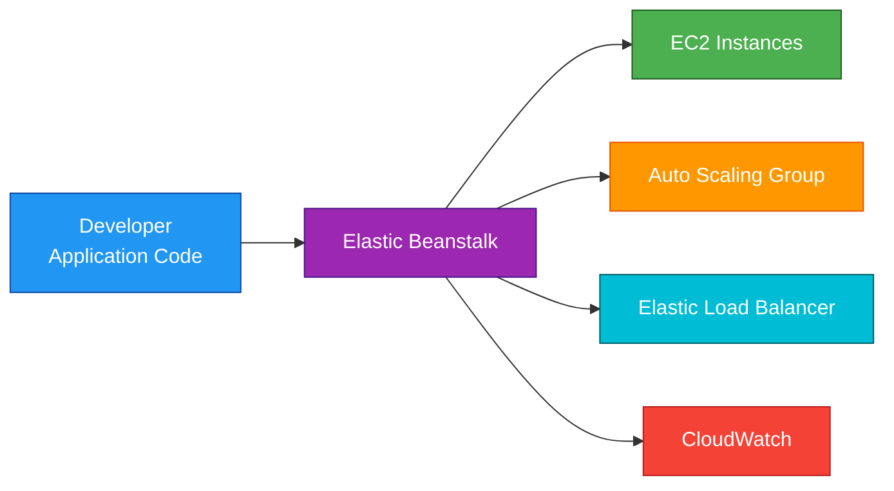
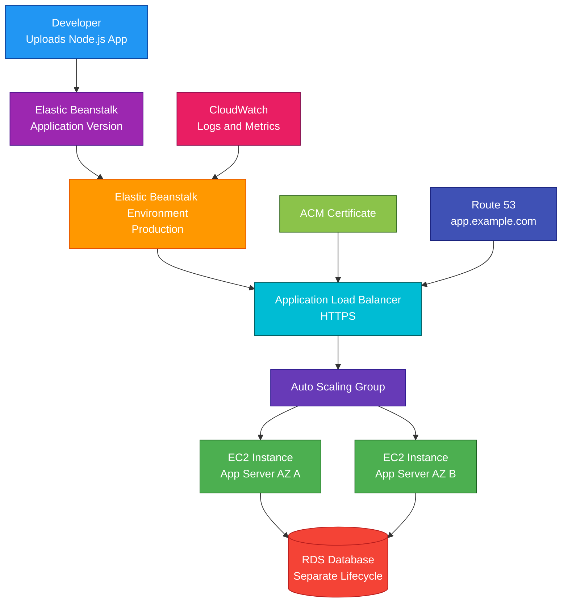

# AWS Elastic Beanstalk

## 1. Definition

### Simple Definition

AWS Elastic Beanstalk is a managed application deployment service.

It lets you upload application code, and AWS automatically handles much of the infrastructure needed to run it.

### Memory Hook

Elastic Beanstalk = Upload code, AWS grows the environment.

### Basic Idea

You provide your application code.

Elastic Beanstalk can create and manage resources such as:

- EC2 instances
- Auto Scaling Groups
- Elastic Load Balancers
- Security groups
- CloudWatch monitoring
- Deployment configuration

### Key Point

Elastic Beanstalk is a Platform as a Service, or PaaS.

It gives developers an easier way to deploy applications without manually building all infrastructure pieces.

## 2. What Problem Does It Solve?

### Main Problem

Elastic Beanstalk solves the problem of deploying applications to AWS without manually configuring all the underlying infrastructure.

### Without Elastic Beanstalk

You may need to manually create and configure:

- EC2 instances
- Load balancers
- Auto Scaling Groups
- Security groups
- Deployment scripts
- CloudWatch monitoring
- Application health checks
- Rolling deployments

### With Elastic Beanstalk

You upload your code, choose a platform, and Elastic Beanstalk provisions and manages the environment.

### Key Benefit

Elastic Beanstalk simplifies application deployment while still allowing access to the underlying AWS resources.

## 3. Core Use Cases

### Simple Web Application Deployment

Use Elastic Beanstalk to quickly deploy web applications.

Examples:

- Node.js app
- Python app
- Java app
- .NET app
- PHP app
- Ruby app
- Go app

### Developer-Friendly AWS Deployment

Elastic Beanstalk is useful when developers want to focus on code instead of infrastructure.

### Traditional Application Hosting

Use Elastic Beanstalk for applications that run on EC2 but do not require fully custom infrastructure.

### Auto Scaling Web Apps

Elastic Beanstalk can create an Auto Scaling environment that adjusts capacity based on demand.

### Load-Balanced Applications

Elastic Beanstalk can create a load-balanced environment with multiple EC2 instances behind an Elastic Load Balancer.

### Worker Applications

Elastic Beanstalk supports worker environments for background processing.

A worker environment commonly uses SQS to receive tasks.

### Quick Prototyping

Elastic Beanstalk is useful for quickly deploying proof-of-concept or small production applications.

## 4. Important Features for SAA

### Application

An Elastic Beanstalk application is a logical container for your environments, versions, and configuration.

Example:

`shopping-cart-app`

### Application Version

An application version is a specific deployable version of your code.

Example:

- `v1`
- `v2`
- `release-2026-04-29`

### Environment

An environment is a running deployment of your application version.

Common environments:

- `dev`
- `test`
- `prod`

### Environment Types

Elastic Beanstalk has two main environment types.

| Environment Type | Best For |
|---|---|
| Web Server Environment | Handles HTTP/HTTPS requests |
| Worker Environment | Processes background jobs from a queue |

### Web Server Environment

A web server environment runs an application that receives web traffic.

Common components:

- Load balancer
- Auto Scaling Group
- EC2 instances
- Security groups

### Worker Environment

A worker environment processes background tasks.

Common pattern:

- Messages go to SQS
- Worker instances poll SQS
- Application code processes jobs

### Supported Platforms

Elastic Beanstalk supports several platforms.

Examples:

- Node.js
- Python
- Java
- .NET
- PHP
- Ruby
- Go
- Docker
- Tomcat

### Platform Version

A platform version includes the operating system, runtime, web server, and Elastic Beanstalk components.

Example:

A Python platform may include Amazon Linux, Python runtime, and web server configuration.

### Managed Updates

Elastic Beanstalk can help manage platform updates.

This can reduce manual patching effort for supported platform components.

### Deployment Policies

Elastic Beanstalk supports different deployment strategies.

| Deployment Policy | Description |
|---|---|
| All at Once | Deploys to all instances at the same time |
| Rolling | Deploys in batches |
| Rolling with Additional Batch | Adds extra capacity during deployment |
| Immutable | Creates new instances for the new version |
| Traffic Splitting | Sends part of traffic to new version first |
| Blue/Green | Uses a separate environment and swaps URLs |

### All at Once Deployment

All at once is the fastest but riskiest deployment option.

It can cause downtime because all instances update at the same time.

### Rolling Deployment

Rolling deployment updates instances in batches.

This reduces downtime risk compared with all at once.

### Rolling with Additional Batch

Rolling with additional batch launches extra instances during deployment.

This helps maintain full capacity while updating.

### Immutable Deployment

Immutable deployment launches a new set of instances with the new version.

If the deployment succeeds, traffic moves to the new instances.

This is safer but slower and may cost more during deployment.

### Traffic Splitting

Traffic splitting sends a small percentage of traffic to the new version first.

Use it to test a new version with real traffic before full rollout.

### Blue/Green Deployment

Blue/green deployment uses two separate environments.

The current environment is blue.

The new environment is green.

After testing green, you swap environment URLs.

### Configuration Files

Elastic Beanstalk supports `.ebextensions` configuration files.

Use them to customize environment resources and settings.

Examples:

- Install packages
- Set environment variables
- Configure resources
- Customize EC2 instances

### Saved Configurations

Saved configurations let you reuse environment settings.

This helps create consistent environments.

### Environment Variables

Elastic Beanstalk supports environment variables for application configuration.

Examples:

- Database endpoint
- Feature flags
- API URLs
- Runtime settings

Do not store plaintext secrets directly if a secrets service is more appropriate.

### Health Monitoring

Elastic Beanstalk monitors environment health.

Health status can show whether the application is running correctly.

### Enhanced Health Reporting

Enhanced health reporting gives deeper visibility into environment health.

It can check:

- Application response
- Instance health
- Load balancer health
- Deployment status
- Resource metrics

### Logs

Elastic Beanstalk can collect logs from EC2 instances.

Logs can be viewed, downloaded, or streamed to CloudWatch Logs if configured.

### Underlying Resources

Elastic Beanstalk creates normal AWS resources.

You can view many of them in services like:

- EC2
- Auto Scaling
- ELB
- CloudWatch
- CloudFormation

### CloudFormation

Elastic Beanstalk uses AWS CloudFormation behind the scenes to provision and manage environments.

Exam tip:

Elastic Beanstalk simplifies deployment, but the underlying resources are still real AWS resources.

## 5. Security Model

### IAM Permissions

IAM controls who can create, deploy, update, and delete Elastic Beanstalk applications and environments.

Common permissions:

| Permission | Purpose |
|---|---|
| `elasticbeanstalk:CreateApplication` | Create an application |
| `elasticbeanstalk:CreateEnvironment` | Create an environment |
| `elasticbeanstalk:UpdateEnvironment` | Update environment configuration |
| `elasticbeanstalk:CreateApplicationVersion` | Create a new app version |
| `elasticbeanstalk:TerminateEnvironment` | Delete an environment |
| `elasticbeanstalk:SwapEnvironmentCNAMEs` | Swap environment URLs |

### Service Role

Elastic Beanstalk uses a service role to manage AWS resources on your behalf.

This role allows Elastic Beanstalk to interact with services like:

- EC2
- Auto Scaling
- ELB
- CloudWatch
- CloudFormation

### Instance Profile

EC2 instances in an Elastic Beanstalk environment use an instance profile.

This gives the application running on EC2 permission to access AWS services.

Example:

An application needs to read objects from S3.

Attach permissions to the EC2 instance profile.

### Security Groups

Elastic Beanstalk environments use security groups to control network traffic.

Common rules:

| Component | Security Group Purpose |
|---|---|
| Load Balancer | Allow HTTP/HTTPS from users |
| EC2 Instances | Allow traffic from the load balancer |
| Database | Allow traffic only from application instances |

### Encryption in Transit

Use HTTPS for secure user traffic.

Common pattern:

- Attach ACM certificate to the load balancer
- Configure HTTPS listener
- Redirect HTTP to HTTPS if needed

### Encryption at Rest

Elastic Beanstalk itself deploys applications, but storage encryption depends on the underlying resources.

Examples:

- EBS encryption for EC2 volumes
- RDS encryption for databases
- S3 encryption for uploaded objects or logs

### Secrets Management

Do not hardcode secrets in application code.

Use services such as:

- AWS Secrets Manager
- Systems Manager Parameter Store
- KMS-encrypted environment variables

### VPC Security

Elastic Beanstalk can run inside a custom VPC.

Best practice for production:

- Load balancer in public subnets
- EC2 instances in private subnets
- Database in private subnets
- NAT Gateway for outbound internet access from private instances

### Shared Responsibility

AWS is responsible for:

- Elastic Beanstalk managed service infrastructure
- Service operations
- Platform orchestration
- Physical security
- Managed AWS service availability

You are responsible for:

- Application code security
- IAM roles and permissions
- Security groups
- VPC design
- Secrets handling
- Patch and platform update choices
- Data encryption settings
- Application authentication and authorization

## 6. High Availability / Durability Behavior

### Availability

Elastic Beanstalk can create highly available environments using multiple EC2 instances across multiple Availability Zones.

### Single-Instance Environment

A single-instance environment runs one EC2 instance.

It is cheaper but not highly available.

Best for:

- Development
- Testing
- Small non-critical workloads

### Load-Balanced Environment

A load-balanced environment uses an Elastic Load Balancer and Auto Scaling Group.

This is better for production workloads.

### Multi-AZ Behavior

For high availability, configure Elastic Beanstalk to use multiple Availability Zones.

This allows instances to run in more than one AZ.

### Auto Scaling

Elastic Beanstalk can scale EC2 instances based on demand.

Common scaling metrics:

- CPU utilization
- Network traffic
- Request count
- Latency

### Health Checks

Elastic Beanstalk uses health checks to detect unhealthy instances or environments.

Unhealthy instances can be replaced through Auto Scaling.

### Fault Tolerance

A production Elastic Beanstalk environment should use:

- Load balancer
- Multiple EC2 instances
- Multiple AZs
- Auto Scaling
- External durable storage
- Managed database service

### Durability

Elastic Beanstalk is not a storage service.

Application data should be stored in durable services such as:

- S3
- RDS
- Aurora
- DynamoDB
- EFS

### Instance Replacement

EC2 instances in Elastic Beanstalk can be replaced.

Do not store important persistent application data only on the instance local disk.

### Multi-Region Behavior

Elastic Beanstalk environments are regional.

For Multi-Region disaster recovery, deploy separate environments in multiple Regions and use Route 53 or Global Accelerator for failover.

## 7. Cost Optimization Options

### Use Single-Instance for Dev/Test

Single-instance environments are cheaper than load-balanced environments.

Use them for non-production workloads when high availability is not required.

### Use Auto Scaling

Auto Scaling helps match EC2 capacity to demand.

This avoids running too many instances during low traffic periods.

### Choose the Right Instance Type

Right-size EC2 instances based on actual workload needs.

Avoid using large instances when smaller ones are enough.

### Use Savings Plans or Reserved Instances

For steady production workloads running on EC2, Savings Plans or Reserved Instances can reduce compute cost.

### Stop or Terminate Unused Environments

Elastic Beanstalk environments can continue running EC2, ELB, and other resources.

Terminate unused dev, test, or old environments.

### Use Appropriate Deployment Strategy

Some deployment strategies temporarily run extra instances.

| Deployment Type | Cost Impact |
|---|---|
| All at Once | Lowest deployment cost, highest risk |
| Rolling | Moderate |
| Rolling with Additional Batch | More temporary capacity |
| Immutable | More temporary capacity |
| Blue/Green | Requires separate environment |

### Manage Logs

Logs stored in CloudWatch Logs or S3 can create cost.

Set retention policies and delete old logs when not needed.

### Avoid Overprovisioned Databases

Elastic Beanstalk can integrate with databases, but database cost is separate.

Right-size RDS, Aurora, or other backend services.

### Use S3 for Static Assets

Store static files in S3 and optionally serve them through CloudFront.

This can reduce load on EC2 instances.

### Use Load-Balanced Environments Only When Needed

Production usually needs load balancing.

Small dev/test apps may not.

## 8. Common Exam Traps

### Elastic Beanstalk Is Not Serverless

Elastic Beanstalk usually runs applications on EC2 instances.

You still pay for the underlying resources.

If the question asks for fully serverless code execution, think Lambda.

### Elastic Beanstalk Does Not Replace EC2 Knowledge

Elastic Beanstalk manages EC2, Auto Scaling, and ELB for you, but these resources still exist.

### Single-Instance Is Not Highly Available

A single-instance environment is not suitable for production high availability.

Use a load-balanced Multi-AZ environment.

### Application Data Should Not Live Only on EC2

Elastic Beanstalk instances can be replaced.

Store persistent data in durable services like RDS, S3, DynamoDB, Aurora, or EFS.

### All at Once Can Cause Downtime

All at once deployment updates all instances together.

This is fast but risky.

### Immutable Is Safer but Costs More During Deployment

Immutable deployment creates new instances before replacing old ones.

This reduces risk but temporarily increases cost.

### Blue/Green Uses Separate Environments

Blue/green deployment is not just a setting inside one environment.

It usually involves two environments and a CNAME swap.

### Elastic Beanstalk Is Regional

Environments are deployed in a specific Region.

For Multi-Region DR, create separate environments in different Regions.

### Beanstalk Is Platform Management, Not Container Orchestration

Elastic Beanstalk can run Docker apps, but if the exam asks for advanced container orchestration, choose ECS or EKS.

### IAM Roles Matter

Elastic Beanstalk needs:

- A service role for managing infrastructure
- An instance profile for EC2 application permissions

### Database Lifecycle Trap

If you create an RDS database inside an Elastic Beanstalk environment, its lifecycle may be tied to the environment.

For production, it is often better to create the database separately.

### Platform Updates Are Your Responsibility to Configure

Elastic Beanstalk can help with managed platform updates, but you must configure update behavior and test compatibility.

## 9. Compare With Similar Services

### Service Comparison Table

| Service | Main Purpose | Best For | Choose When |
|---|---|---|---|
| Elastic Beanstalk | Managed app deployment platform | Quickly deploying web apps on managed infrastructure | You want AWS to handle EC2, ELB, and Auto Scaling setup |
| EC2 | Virtual servers | Full control over compute | You need OS-level control and custom server setup |
| Lambda | Serverless functions | Event-driven short-running code | You want to run code without managing servers |
| ECS | Container orchestration | Docker containers | You need managed container scheduling |
| EKS | Managed Kubernetes | Kubernetes workloads | You need Kubernetes control and ecosystem |
| App Runner | Simple container/web app hosting | Easy managed web services | You want simpler container deployment than ECS/EKS |

### Elastic Beanstalk vs EC2

| Feature | Elastic Beanstalk | EC2 |
|---|---|---|
| Abstraction level | Higher | Lower |
| Infrastructure setup | Managed by Beanstalk | You configure manually |
| Control | Moderate | High |
| Best for | Quick app deployment | Custom infrastructure |
| Underlying compute | Usually EC2 | EC2 |

### Elastic Beanstalk vs Lambda

| Feature | Elastic Beanstalk | Lambda |
|---|---|---|
| Compute model | App platform on EC2 | Serverless functions |
| Runtime duration | Long-running apps supported | Max 15 minutes |
| Server management | Abstracted but EC2 exists | No server management |
| Best for | Traditional web apps | Event-driven code |
| Scaling | Auto Scaling Groups | Automatic function scaling |

### Elastic Beanstalk vs ECS

| Feature | Elastic Beanstalk | ECS |
|---|---|---|
| Main purpose | Application platform | Container orchestration |
| Container support | Yes, simpler | Yes, more powerful |
| Control | Less container control | More container control |
| Best for | Simple app deployment | Microservices and container workloads |

### Elastic Beanstalk vs App Runner

| Feature | Elastic Beanstalk | App Runner |
|---|---|---|
| Main purpose | Managed app platform | Fully managed web app/container service |
| Infrastructure visibility | More visible AWS resources | More abstracted |
| Best for | Apps needing more AWS resource control | Simple web services and APIs |
| Common compute | EC2-based | Fully managed service |

### Elastic Beanstalk vs CloudFormation

| Feature | Elastic Beanstalk | CloudFormation |
|---|---|---|
| Main purpose | Deploy applications | Provision infrastructure as code |
| Abstraction | Application-focused | Infrastructure-focused |
| Best for | Developers deploying apps | Defining full AWS environments |
| Common relation | Uses CloudFormation behind the scenes | Can create Beanstalk resources |

### When to Choose Elastic Beanstalk

Choose Elastic Beanstalk when:

- You want quick application deployment
- You want AWS to manage common infrastructure setup
- You need a web app or worker app environment
- You want Auto Scaling and load balancing without manual setup
- You want more control than fully serverless platforms
- You are deploying a traditional application
- You do not need advanced container orchestration

## 10. Mini Architecture Example

### Scenario

A company has a Node.js web application.

They want to deploy it quickly to AWS with load balancing, Auto Scaling, monitoring, and HTTPS.

### Architecture

Use Elastic Beanstalk with a load-balanced web server environment.

Elastic Beanstalk provisions an Application Load Balancer, Auto Scaling Group, EC2 instances, and CloudWatch monitoring.

The application stores data in a separately managed RDS database.

### Why This Is Good

- Developers deploy code without manually building all infrastructure
- ALB distributes traffic across EC2 instances
- Auto Scaling adjusts capacity based on demand
- Multi-AZ instances improve availability
- ACM enables HTTPS
- CloudWatch provides logs and metrics
- RDS is managed separately for safer production lifecycle
- Route 53 provides a friendly domain name

### Exam Answer Pattern

If the question says:

“Deploy a web application quickly without manually provisioning EC2, load balancers, Auto Scaling, and monitoring.”

Think:

AWS Elastic Beanstalk.

If the question says:

“Run code without managing servers at all.”

Think:

AWS Lambda.

If the question says:

“Run and orchestrate Docker containers.”

Think:

Amazon ECS or Amazon EKS.

### Final Memory Hook

Elastic Beanstalk deploys applications.

EC2 provides virtual servers.

ELB distributes traffic.

Auto Scaling adjusts capacity.

CloudWatch monitors health.

CloudFormation manages infrastructure.

Lambda is serverless functions.

ECS and EKS are for containers.

