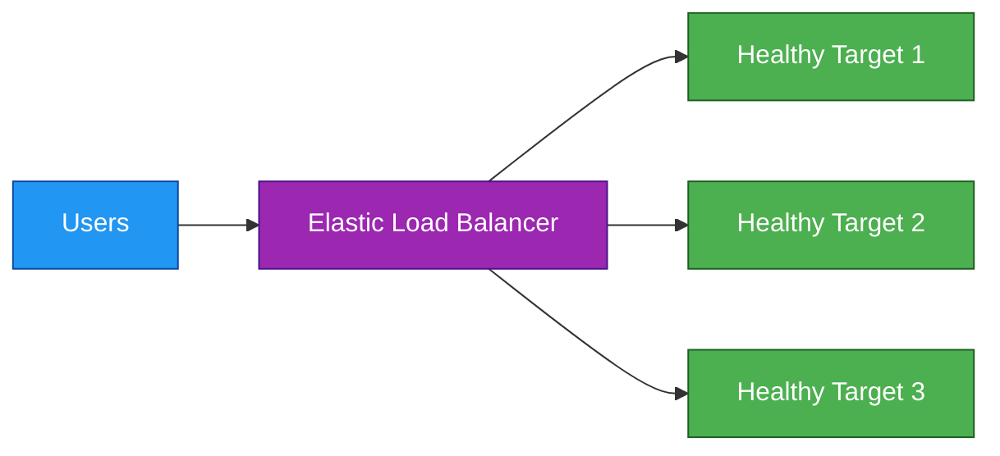
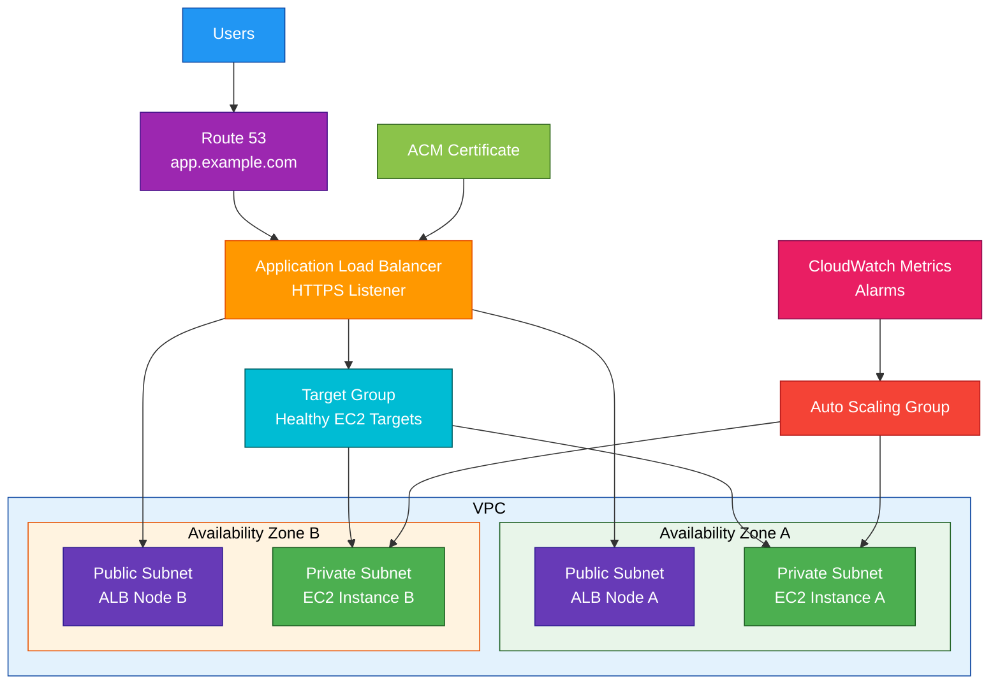

# Elastic Load Balancer

## 1. Definition

### Simple Definition

Elastic Load Balancing, or ELB, is an AWS service that automatically distributes incoming traffic across multiple targets.

Targets can include:

- EC2 instances
- Containers
- IP addresses
- Lambda functions, for ALB
- Network appliances, for GWLB

### Memory Hook

ELB = Evenly Load Balances traffic.

### Basic Idea

Instead of users connecting directly to one server, users connect to a load balancer.

The load balancer sends requests to healthy targets.

### Main Purpose

ELB improves:

- Availability
- Fault tolerance
- Scalability
- Traffic distribution
- Health-based routing

## 2. What Problem Does It Solve?

### Main Problem

ELB solves the problem of sending traffic to multiple backend resources safely and automatically.

Without a load balancer, users may connect to one server directly.

If that server fails, users may lose access.

### Without ELB

You may have problems such as:

- One server gets overloaded
- Failed servers still receive traffic
- Manual traffic routing
- No easy Multi-AZ distribution
- Harder scaling
- Direct exposure of backend servers

### With ELB

ELB distributes traffic across healthy targets.

If a target becomes unhealthy, ELB stops sending traffic to it.

### Key Benefit

ELB helps build highly available and scalable applications.

## 3. Core Use Cases

### Web Application Load Balancing

Use an Application Load Balancer to distribute HTTP and HTTPS traffic to web applications.

Example:

- Users visit a website
- ALB receives the request
- ALB forwards the request to EC2, ECS, or Lambda

### Microservices Routing

ALB can route traffic to different target groups based on paths or hostnames.

Examples:

| Request | Target |
|---|---|
| `/api/*` | API service |
| `/images/*` | Image service |
| `admin.example.com` | Admin service |

### High-Performance TCP/UDP Traffic

Use a Network Load Balancer for very high-performance Layer 4 traffic.

Examples:

- TCP applications
- UDP workloads
- TLS pass-through
- Static IP requirements

### Private Internal Applications

Use an internal load balancer for private traffic inside a VPC.

Examples:

- Internal APIs
- Backend services
- Private microservices
- Internal admin tools

### Container Workloads

ELB integrates with ECS and EKS to distribute traffic to containers.

Common choices:

- ALB for HTTP/HTTPS container apps
- NLB for TCP/UDP container apps

### Network Appliance Traffic

Use Gateway Load Balancer to distribute traffic to third-party virtual appliances.

Examples:

- Firewalls
- Intrusion detection systems
- Intrusion prevention systems
- Deep packet inspection appliances

## 4. Important Features for SAA

### Main Load Balancer Types

AWS has several load balancer types.

| Type | Layer | Best For |
|---|---|---|
| Application Load Balancer | Layer 7 | HTTP/HTTPS apps, path routing, host routing |
| Network Load Balancer | Layer 4 | TCP, UDP, TLS, high performance, static IPs |
| Gateway Load Balancer | Layer 3/4 style appliance routing | Firewalls and network appliances |
| Classic Load Balancer | Legacy | Older EC2-Classic style workloads |

### Application Load Balancer

ALB operates at Layer 7.

It understands HTTP and HTTPS traffic.

Important features:

- Path-based routing
- Host-based routing
- HTTP header routing
- Query string routing
- Redirects
- Fixed responses
- WebSocket support
- HTTP/2 support
- Lambda targets
- WAF integration

### Network Load Balancer

NLB operates at Layer 4.

It is designed for extreme performance and low latency.

Important features:

- TCP support
- UDP support
- TLS support
- Static IP support
- Elastic IP support
- Very high throughput
- Preserves source IP
- Handles millions of requests per second

### Gateway Load Balancer

GWLB is used for deploying and scaling virtual network appliances.

Important features:

- Transparent traffic inspection
- Gateway Load Balancer endpoints
- Third-party firewall integration
- Centralized appliance scaling
- Uses GENEVE protocol

### Classic Load Balancer

Classic Load Balancer is the older generation.

For new architectures, choose ALB or NLB instead.

Exam tip:

If the question does not mention legacy workloads, do not choose Classic Load Balancer.

### Listener

A listener checks for incoming traffic on a specific protocol and port.

Examples:

| Listener | Use |
|---|---|
| HTTP:80 | Web traffic |
| HTTPS:443 | Secure web traffic |
| TCP:443 | Layer 4 encrypted traffic |
| UDP:53 | DNS-style UDP traffic |

### Target Group

A target group is a group of backend resources that receive traffic.

Targets can be:

- EC2 instances
- IP addresses
- Lambda functions, for ALB
- Containers through ECS/EKS
- Appliances, for GWLB

### Health Checks

Health checks let ELB know which targets are healthy.

If a target fails health checks, ELB stops routing traffic to it.

### Availability Zones

ELB can distribute traffic across targets in multiple Availability Zones.

For high availability, enable at least two AZs.

### Internet-Facing Load Balancer

An internet-facing load balancer accepts traffic from the public internet.

Common use:

Public website or public API.

### Internal Load Balancer

An internal load balancer is reachable only inside the VPC or connected private networks.

Common use:

Private backend service or internal API.

### Cross-Zone Load Balancing

Cross-zone load balancing allows the load balancer to distribute traffic evenly across targets in enabled Availability Zones.

Exam tip:

This helps prevent one AZ’s targets from receiving too much traffic.

### Sticky Sessions

Sticky sessions keep a user connected to the same target for a period of time.

Use only when session state is stored on the instance.

Better design:

Store session state outside the instance using ElastiCache, DynamoDB, or another shared store.

### TLS Termination

ELB can terminate TLS/HTTPS connections.

Common pattern:

- Client connects to ALB using HTTPS
- ALB decrypts traffic
- ALB forwards to targets using HTTP or HTTPS

### ACM Integration

ELB integrates with AWS Certificate Manager for TLS certificates.

Use ACM certificates with HTTPS listeners.

### Access Logs

ELB access logs capture request information.

They can be stored in S3.

Use them for:

- Auditing
- Troubleshooting
- Traffic analysis
- Security investigation

### Connection Draining / Deregistration Delay

Deregistration delay allows in-flight requests to complete before a target is removed.

This helps avoid dropping active user requests during deployments or scaling.

### ALB Routing Rules

ALB supports advanced routing rules.

Examples:

| Rule Type | Example |
|---|---|
| Path-based | `/api/*` goes to API target group |
| Host-based | `app.example.com` goes to app target group |
| Header-based | Route based on HTTP header |
| Query string | Route based on query parameter |

### NLB Static IP

NLB can provide static IP addresses.

This is useful when clients or firewalls need to allowlist fixed IPs.

## 5. Security Model

### IAM Permissions

IAM controls who can create and manage load balancers.

Common permissions:

| Permission | Purpose |
|---|---|
| `elasticloadbalancing:CreateLoadBalancer` | Create a load balancer |
| `elasticloadbalancing:CreateTargetGroup` | Create target groups |
| `elasticloadbalancing:CreateListener` | Create listeners |
| `elasticloadbalancing:RegisterTargets` | Register backend targets |
| `elasticloadbalancing:ModifyLoadBalancerAttributes` | Modify load balancer settings |
| `elasticloadbalancing:DeleteLoadBalancer` | Delete a load balancer |

### Security Groups

Application Load Balancers use security groups.

Security groups control which traffic can reach the ALB.

Example ALB security group:

| Direction | Rule |
|---|---|
| Inbound | Allow HTTPS from internet |
| Outbound | Allow traffic to app targets |

### Target Security Groups

Backend targets should allow traffic from the load balancer security group.

Example:

Allow inbound traffic from the ALB security group on port `8080`.

### NLB Security

Network Load Balancers historically did not use security groups, but modern NLB configurations can support security groups in many cases.

For SAA, remember:

- ALB uses security groups
- NLB is commonly controlled with target security groups, NACLs, and listener configuration
- Always protect backend targets properly

### Network ACLs

NACLs can control subnet-level traffic for load balancer subnets and target subnets.

Remember:

- NACLs are stateless
- Return traffic must be allowed

### TLS Certificates

Use ACM certificates with HTTPS or TLS listeners.

This helps encrypt traffic in transit.

### Encryption in Transit

ELB can support encryption between:

- Client and load balancer
- Load balancer and targets, if configured

For end-to-end encryption, use HTTPS from client to load balancer and HTTPS from load balancer to backend targets.

### AWS WAF Integration

AWS WAF can be associated with an Application Load Balancer.

Use WAF to protect web applications from:

- SQL injection
- Cross-site scripting
- Bad IP addresses
- Bot traffic
- Layer 7 attacks

### Authentication with ALB

ALB can authenticate users using:

- Amazon Cognito
- OIDC identity providers

This is useful for web applications that need user authentication before reaching backend targets.

### Shared Responsibility

AWS is responsible for:

- ELB managed infrastructure
- Load balancer availability
- Scaling infrastructure
- Physical security
- Managed service patching

You are responsible for:

- Listener configuration
- Security groups
- NACLs
- TLS certificates
- WAF rules
- Target security
- Logging configuration
- Backend application security

## 6. High Availability / Durability Behavior

### Availability

ELB is a managed AWS service designed for high availability.

You enable Availability Zones, and AWS runs load balancer nodes in those AZs.

### Multi-AZ Behavior

For high availability, configure ELB across multiple Availability Zones.

If one AZ has problems, the load balancer can continue routing traffic to healthy targets in other AZs.

### Target Health

ELB continuously checks target health.

Unhealthy targets are removed from routing until they pass health checks again.

### Fault Tolerance

ELB improves fault tolerance by distributing traffic across multiple healthy targets.

A single failed EC2 instance should not bring down the application.

### Scaling Behavior

ELB scales automatically as traffic changes.

You do not manage load balancer servers.

### Cross-Zone Load Balancing

Cross-zone load balancing can distribute traffic evenly across targets in all enabled AZs.

This helps when target counts are uneven across AZs.

### Multi-Region Behavior

ELB is regional.

A load balancer does not span multiple AWS Regions.

For Multi-Region architectures, use one load balancer per Region and route traffic with:

- Route 53
- CloudFront
- Global Accelerator

### Durability

ELB is not a storage service.

Durability applies to backend data stores such as:

- S3
- EBS
- RDS
- Aurora
- DynamoDB

### Important Exam Point

ELB improves application availability, but your backend targets must also be deployed across multiple Availability Zones.

## 7. Cost Optimization Options

### Choose the Right Load Balancer Type

Use the load balancer type that matches the workload.

| Need | Best Choice |
|---|---|
| HTTP/HTTPS routing | ALB |
| TCP/UDP high performance | NLB |
| Firewall appliance scaling | GWLB |
| Legacy EC2 workload | CLB only if required |

### Avoid Unused Load Balancers

Load balancers have ongoing cost.

Delete unused load balancers in dev, test, and old environments.

### Use ALB for Multiple Services

One ALB can route to multiple target groups using host-based or path-based routing.

This may reduce the need for many separate load balancers.

### Use Auto Scaling with ELB

Pair ELB with Auto Scaling Groups.

This helps run only the number of backend instances needed.

### Monitor Load Balancer Capacity Usage

ELB pricing includes usage dimensions such as processed traffic and load balancer capacity usage.

Reduce unnecessary traffic where possible.

### Use CloudFront for Static and Global Content

For global users or cacheable content, place CloudFront in front of ALB.

This can reduce load on the ALB and backend targets.

### Enable Access Logs Only When Needed

Access logs are useful, but storing and analyzing logs in S3 or other services can add cost.

Use lifecycle policies for log storage.

### Avoid Cross-Zone Cost Surprises

Cross-zone load balancing can improve distribution.

However, data transfer cost behavior depends on load balancer type and configuration.

For exams, focus on availability and even distribution.

### Right-Size Backend Targets

ELB itself distributes traffic, but backend EC2 or container capacity still affects cost.

Use CloudWatch metrics to right-size targets.

### Use Internal Load Balancers for Private Traffic

Do not expose private services publicly.

Internal load balancers can reduce security risk and unnecessary public traffic paths.

## 8. Common Exam Traps

### ALB vs NLB

ALB is for Layer 7 HTTP/HTTPS features.

NLB is for Layer 4 TCP/UDP/TLS performance.

Memory hook:

- ALB = Application HTTP routing
- NLB = Network high performance
- GWLB = Gateway appliances

### ALB Supports Path-Based Routing

If the exam mentions routing `/api` and `/images` to different services, choose ALB.

### NLB Supports Static IPs

If the exam requires static IP addresses for the load balancer, choose NLB.

### ALB Does Not Provide Static IPs by Default

ALB provides a DNS name, not fixed IP addresses.

Use Route 53 Alias records to point a domain to the ALB.

### ELB Uses DNS Name

Load balancers are accessed through DNS names.

Do not hardcode changing IP addresses for ALB.

### Health Checks Matter

If targets are unhealthy, ELB will not route traffic to them.

Check:

- Health check path
- Health check port
- Security groups
- NACLs
- Application response codes

### Public vs Internal Load Balancer

| Type | Reachability |
|---|---|
| Internet-facing | Public internet |
| Internal | Private VPC/internal networks |

### Load Balancer Does Not Replace Auto Scaling

ELB distributes traffic.

Auto Scaling adds or removes compute capacity.

They are often used together.

### Sticky Sessions Can Hide Bad Design

Sticky sessions can help legacy apps, but storing session state on instances reduces scalability.

Better design:

Use external session storage.

### ELB Is Regional

ELB works within one Region.

For Multi-Region failover, use Route 53, CloudFront, or Global Accelerator.

### Classic Load Balancer Is Legacy

For new applications, choose ALB or NLB.

### Gateway Load Balancer Is for Appliances

Do not choose GWLB for normal web app load balancing.

Choose GWLB when the question mentions firewalls, inspection appliances, or third-party network appliances.

### TLS Termination Location Matters

TLS can terminate at the load balancer or continue to the target.

If end-to-end encryption is required, use HTTPS/TLS to the backend targets too.

## 9. Compare With Similar Services

### Service Comparison Table

| Service | Main Purpose | Best For | Choose When |
|---|---|---|---|
| ALB | Layer 7 load balancing | HTTP/HTTPS apps and microservices | You need path, host, or header routing |
| NLB | Layer 4 load balancing | High-performance TCP/UDP/TLS | You need static IPs, low latency, or TCP/UDP |
| GWLB | Appliance load balancing | Firewalls and traffic inspection | You need to scale network appliances |
| CLB | Legacy load balancing | Older EC2 workloads | Use only for legacy requirements |
| CloudFront | CDN | Global caching and edge delivery | You need content acceleration and caching |
| Route 53 | DNS routing | Domain routing and DNS failover | You need DNS-level routing |

### ALB vs NLB

| Feature | ALB | NLB |
|---|---|---|
| OSI layer | Layer 7 | Layer 4 |
| Protocols | HTTP, HTTPS | TCP, UDP, TLS |
| Routing | Path, host, headers, query strings | Port/protocol based |
| Static IP | No default static IP | Yes |
| WAF support | Yes | Not like ALB Layer 7 WAF |
| Best for | Web apps and APIs | High-performance network traffic |

### ALB vs API Gateway

| Feature | ALB | API Gateway |
|---|---|---|
| Main purpose | Load balancing | API management |
| Best for | Routing to EC2/ECS services | Managed APIs with auth/throttling/stages |
| API keys/usage plans | No | Yes |
| Path routing | Yes | Yes |
| Common backend | EC2, ECS, Lambda | Lambda, HTTP, AWS services |

### ELB vs Auto Scaling

| Feature | ELB | Auto Scaling |
|---|---|---|
| Main purpose | Distribute traffic | Adjust compute capacity |
| Handles health checks | Yes | Yes, for replacement/scaling |
| Adds instances | No | Yes |
| Common use together | Yes | Yes |

### ELB vs CloudFront

| Feature | ELB | CloudFront |
|---|---|---|
| Main purpose | Regional load balancing | Global content delivery |
| Caching | No | Yes |
| Scope | Regional | Global edge network |
| Best for | Distributing traffic to targets | Speeding up global content delivery |
| Common use together | CloudFront can use ALB as origin | ALB serves dynamic backend |

### ELB vs Route 53

| Feature | ELB | Route 53 |
|---|---|---|
| Main purpose | Load balancing traffic to targets | DNS routing |
| Routing level | Request/connection level | DNS query level |
| Health checks | Target health checks | DNS endpoint health checks |
| Common use together | Route 53 Alias points to ELB | ELB handles backend distribution |

### When to Choose ELB

Choose ELB when:

- You need to distribute traffic across multiple targets
- You need health checks
- You need Multi-AZ application availability
- You need HTTP/HTTPS routing with ALB
- You need TCP/UDP high performance with NLB
- You need network appliance scaling with GWLB
- You use EC2, ECS, EKS, or Lambda targets behind a frontend

## 10. Mini Architecture Example

### Scenario

A company runs a web application on EC2 instances across two Availability Zones.

Users access the application from the internet.

The company wants high availability, HTTPS, and automatic scaling.

### Architecture

Use an internet-facing Application Load Balancer across public subnets.

Place EC2 instances in private subnets inside an Auto Scaling Group.

Use ACM for the HTTPS certificate.

Use Route 53 to point the domain to the ALB.

### Why This Is Good

- ALB distributes traffic across healthy EC2 instances
- Multi-AZ design improves availability
- EC2 instances stay private
- ACM enables HTTPS
- Route 53 provides friendly DNS
- Auto Scaling adjusts capacity based on demand
- CloudWatch metrics can trigger scaling or alerts

### Exam Answer Pattern

If the question says:

“Distribute HTTP/HTTPS traffic across multiple EC2 instances in multiple Availability Zones.”

Think:

Application Load Balancer.

If the question says:

“Need ultra-low latency TCP/UDP traffic or static IP addresses.”

Think:

Network Load Balancer.

If the question says:

“Distribute traffic through firewall or inspection appliances.”

Think:

Gateway Load Balancer.

### Final Memory Hook

ALB = Layer 7 web routing.

NLB = Layer 4 high performance and static IPs.

GWLB = Network appliances.

CLB = Legacy.

ELB distributes traffic.

Auto Scaling changes capacity.

Route 53 handles DNS.

CloudFront caches globally.

