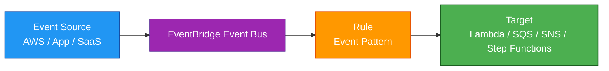
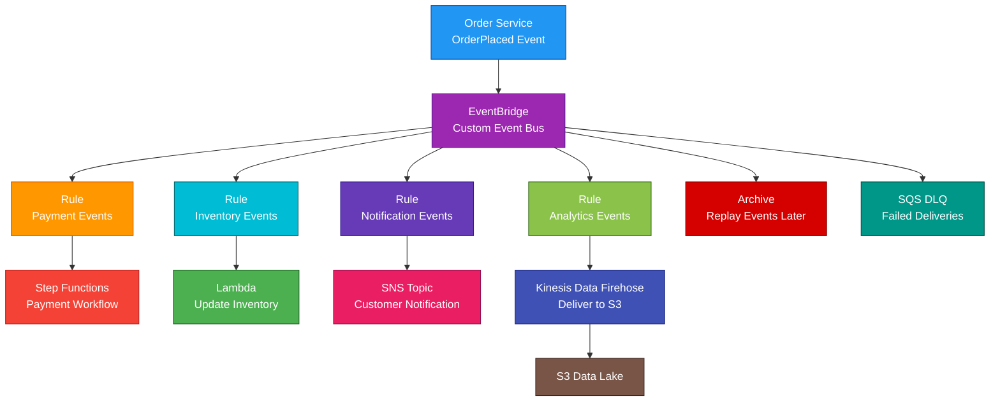

# Amazon EventBridge

<details>
<summary>

## 1. Definition

</summary>

### Simple Definition

Amazon EventBridge is a serverless event bus service that routes events from AWS services, custom applications, and SaaS applications to targets.

It helps you build event-driven architectures without managing servers.

### Memory Hook

EventBridge = Event router for AWS applications.

### Basic Idea

An event happens.

EventBridge receives the event, checks rules, and sends the event to one or more targets.



### What EventBridge Is Best At

EventBridge is best for:

- Event-driven applications
- Decoupling services
- Routing events between AWS services
- SaaS application integration
- Scheduled tasks
- Cross-account event routing
- Event filtering
- Workflow triggering

</details>

<details>
<summary>

## 2. What Problem Does It Solve?

</summary>

### Main Problem

EventBridge solves the problem of connecting systems together without tightly coupling them.

Instead of one service directly calling another service, the first service publishes an event and EventBridge routes it to the correct target.

### Without EventBridge

Applications may have problems such as:

- Services directly depend on each other
- Hard-to-change integrations
- Too much custom routing code
- No central event routing
- Difficult SaaS integration
- Harder event filtering
- Complex retry handling
- Difficult cross-account event delivery

### With EventBridge

Applications can publish events to an event bus.

EventBridge handles matching, routing, retries, and delivery to targets.

### Key Benefit

EventBridge makes applications more loosely coupled, scalable, and event-driven.

</details>

<details>
<summary>

## 3. Core Use Cases

</summary>

### Event-Driven Applications

Use EventBridge when one part of an application should react to something that happened elsewhere.

Example:

An order is created, and multiple services respond to that event.

### AWS Service Events

EventBridge can receive events from AWS services.

Examples:

- EC2 instance state changed
- S3 object event through EventBridge
- CodePipeline deployment failed
- GuardDuty finding created
- Auto Scaling action occurred

### Custom Application Events

Your applications can send custom events to EventBridge.

Example:

An e-commerce app sends an `OrderPlaced` event.

Targets can then process payment, update inventory, and send notifications.

### SaaS Integration

EventBridge can receive events from supported SaaS applications.

Examples:

- Zendesk
- Shopify
- Datadog
- Auth0
- PagerDuty

### Scheduled Tasks

EventBridge can run tasks on a schedule.

Examples:

- Run Lambda every hour
- Start Step Functions every night
- Trigger ECS task every Monday
- Run cleanup jobs daily

### Cross-Account Event Routing

EventBridge can send events between AWS accounts.

Example:

Application accounts send security events to a central security account.

### Workflow Triggers

EventBridge can start Step Functions workflows when events occur.

Example:

When a new customer signs up, start an onboarding workflow.

### Event Fanout

One event can trigger multiple targets.

Example:

An `OrderPlaced` event triggers:

- Payment processing
- Inventory update
- Email notification
- Analytics event storage

</details>

<details>
<summary>

## 4. Important Features for SAA

</summary>

### Event

An event is a JSON message that represents something that happened.

Example:

```json
{
  "source": "myapp.orders",
  "detail-type": "OrderPlaced",
  "detail": {
    "orderId": "12345",
    "customerId": "abc"
  }
}
```

### Event Source

An event source is where the event comes from.

Common sources:

- AWS services
- Custom applications
- SaaS applications
- Other EventBridge event buses

### Event Bus

An event bus receives events and routes them to targets.

EventBridge has different types of event buses.

| Event Bus Type | Purpose |
|---|---|
| Default event bus | Receives AWS service events |
| Custom event bus | Receives custom application events |
| Partner event bus | Receives SaaS partner events |

### Default Event Bus

The default event bus receives events from AWS services.

Example:

An EC2 instance changes state, and EventBridge receives the event.

### Custom Event Bus

A custom event bus is used for your own application events.

Example:

Your app publishes `OrderPlaced`, `PaymentCompleted`, or `UserCreated` events.

### Partner Event Bus

A partner event bus receives events from SaaS providers.

Use it when integrating third-party SaaS event sources.

### Rule

A rule watches for events that match an event pattern or schedule.

When a rule matches, it sends the event to one or more targets.

### Event Pattern

An event pattern defines which events a rule should match.

Example:

Match only events where the source is `myapp.orders` and detail type is `OrderPlaced`.

```json
{
  "source": ["myapp.orders"],
  "detail-type": ["OrderPlaced"]
}
```

### Target

A target is the destination that receives the matched event.

Common targets:

- Lambda
- SQS
- SNS
- Step Functions
- ECS task
- Kinesis Data Streams
- Firehose
- API Gateway
- EventBridge event bus
- Systems Manager Automation

### Multiple Targets

One rule can send an event to multiple targets.

This supports fanout patterns.

Example:

One order event triggers a Lambda function, an SQS queue, and a Step Functions workflow.

### Scheduled Rules

EventBridge can trigger targets based on a schedule.

Schedule types:

- Rate expression
- Cron expression

Examples:

```text
rate(5 minutes)
cron(0 12 * * ? *)
```

### EventBridge Scheduler

EventBridge Scheduler is used for creating, running, and managing scheduled tasks at scale.

It is more specialized for scheduling than basic EventBridge scheduled rules.

Use it for:

- One-time schedules
- Recurring schedules
- Large-scale scheduled task management
- Time zone support

### EventBridge Pipes

EventBridge Pipes connects an event source to a target with optional filtering and enrichment.

Common sources:

- SQS
- Kinesis Data Streams
- DynamoDB Streams
- Amazon MSK

Common targets:

- Lambda
- Step Functions
- EventBridge event bus
- SQS
- API destinations

### Pipes Filtering

Pipes can filter events before sending them to a target.

This reduces unnecessary processing.

### Pipes Enrichment

Pipes can enrich events before delivery.

Example:

A pipe reads an event from SQS, calls Lambda to add more data, then sends it to Step Functions.

### Archive

EventBridge can archive events from an event bus.

Use archives to store events for later replay.

### Replay

Replay sends archived events back through the event bus.

Use replay to:

- Reprocess events
- Recover from bugs
- Test new targets
- Rebuild downstream state

### Schema Registry

EventBridge Schema Registry stores event schemas.

Schemas describe the structure of events.

This helps developers understand event formats and generate code bindings.

### API Destinations

API Destinations allow EventBridge to send events to external HTTP endpoints.

Use this for integrating with third-party APIs.

### Input Transformer

Input transformers can change the event data before sending it to a target.

Example:

Extract only `orderId` and `customerEmail` before sending to a Lambda function.

### Retry Policy

EventBridge can retry failed event deliveries.

This helps handle temporary target failures.

### Dead-Letter Queue

A dead-letter queue, or DLQ, stores events that could not be delivered after retries.

Common DLQ target:

- Amazon SQS

### Global Endpoints

EventBridge Global Endpoints can improve availability for event ingestion across Regions.

They can fail over event ingestion to a secondary Region during Regional issues.

### Event Size

EventBridge events have size limits.

For large payloads, store the data in S3 and put the S3 object reference in the event.

</details>

<details>
<summary>

## 5. Security Model

</summary>

### IAM Permissions

IAM controls who can create, manage, and publish events to EventBridge.

Common permissions:

| Permission | Purpose |
|---|---|
| `events:PutEvents` | Send custom events |
| `events:PutRule` | Create or update rules |
| `events:PutTargets` | Add targets to rules |
| `events:DeleteRule` | Delete rules |
| `events:RemoveTargets` | Remove targets |
| `events:CreateEventBus` | Create custom event bus |
| `events:PutPermission` | Allow cross-account access |

### Resource-Based Policies

EventBridge event buses can use resource-based policies.

Use them to allow:

- Cross-account event publishing
- Cross-account event routing
- Organization-wide event sharing

### Cross-Account Security

For cross-account event routing, configure permissions carefully.

Example:

A central event bus allows selected accounts to send events.

### Target Permissions

EventBridge needs permission to invoke targets.

Examples:

- Lambda resource policy allows EventBridge invocation
- IAM role allows EventBridge to start Step Functions
- IAM role allows EventBridge to run ECS tasks
- SQS queue policy allows EventBridge to send messages

### Encryption in Transit

Events are sent to EventBridge using AWS APIs over HTTPS.

### Encryption at Rest

EventBridge encrypts event data at rest using AWS-managed encryption.

For some related services, configure encryption separately.

Examples:

- SQS DLQ encryption
- CloudWatch Logs encryption
- S3 archive or target storage encryption
- KMS permissions for encrypted targets

### Least Privilege

Use least privilege for:

- Publishing events
- Managing event buses
- Creating rules
- Adding targets
- Invoking downstream services

### Sensitive Data

Avoid putting sensitive data directly in events unless required.

Events may be routed to multiple targets.

Best practice:

Store sensitive or large data in a secure service like S3 or a database and include a reference in the event.

### Shared Responsibility

AWS is responsible for:

- EventBridge managed infrastructure
- Event routing service availability
- Managed scaling
- Physical security
- Service-side encryption

You are responsible for:

- IAM permissions
- Event bus policies
- Target permissions
- Sensitive data handling
- DLQ configuration
- Event schema design
- Monitoring delivery failures
- Cross-account access controls

</details>

<details>
<summary>

## 6. High Availability / Durability Behavior

</summary>

### Availability

EventBridge is a managed, serverless service.

AWS manages availability, scaling, and infrastructure.

### Regional Service

EventBridge is regional.

Event buses, rules, and targets are created in a specific AWS Region.

### Multi-AZ Behavior

EventBridge is managed across AWS infrastructure in a Region.

You do not configure Multi-AZ manually.

### Fault Tolerance

EventBridge helps fault tolerance by decoupling producers and consumers.

If a target temporarily fails, EventBridge can retry delivery.

### Retry Behavior

EventBridge retries failed deliveries according to retry policy.

This helps with temporary issues such as throttling or transient service failures.

### Dead-Letter Queues

Use DLQs to capture events that cannot be delivered after retries.

This prevents failed events from being silently lost.

### Archive and Replay

Archive and replay help recover from downstream failures or application bugs.

Example:

If a Lambda target had a bug, fix the function and replay archived events.

### Multi-Region Behavior

For Multi-Region event-driven systems, deploy event buses and rules in multiple Regions.

Use options such as:

- EventBridge Global Endpoints
- Cross-Region event routing
- Route 53 health checks
- Application-level failover
- Event archive and replay

### Durability

EventBridge is not long-term storage.

It routes events.

For long-term storage, send events to durable targets such as:

- S3
- DynamoDB
- Kinesis Data Firehose
- CloudWatch Logs
- EventBridge Archive for replay use cases

### Important Exam Point

EventBridge provides managed event routing, retries, DLQs, and replay options, but it is not a replacement for a database or long-term event store.

</details>

<details>
<summary>

## 7. Cost Optimization Options

</summary>

### Filter Events Early

Use event patterns to send only relevant events to targets.

This reduces unnecessary Lambda invocations, Step Functions executions, and downstream processing.

### Use EventBridge Pipes Filtering

Filter events in Pipes before they reach the target.

This can reduce compute and processing cost.

### Avoid Over-Routing

Do not send every event to every target.

Route only what each target needs.

### Use Input Transformers

Input transformers can reduce payload size and simplify target processing.

This can reduce downstream compute time.

### Choose the Right Service

EventBridge is not always the cheapest option for every messaging pattern.

| Need | Often Better Choice |
|---|---|
| Simple queue buffering | SQS |
| High-throughput streaming | Kinesis Data Streams |
| Simple pub/sub fanout | SNS |
| Event routing and filtering | EventBridge |

### Manage Archives

Archives add cost.

Archive only events that need replay or recovery.

Set retention based on real business needs.

### Use DLQs Wisely

DLQs are important for reliability, but monitor and clean them up.

Old failed events stored in SQS can create storage cost.

### Avoid Unnecessary Schedules

Remove old scheduled rules or Scheduler schedules that are no longer needed.

### Monitor Target Invocations

EventBridge may trigger services that have their own costs.

Examples:

- Lambda invocations
- Step Functions state transitions
- ECS tasks
- API destinations
- SQS requests

### Use CloudWatch Metrics

Monitor:

- Matched events
- Invocations
- Failed invocations
- Throttled rules
- DLQ deliveries
- Archive usage

</details>

<details>
<summary>

## 8. Common Exam Traps

</summary>

### EventBridge vs SNS

SNS is mainly pub/sub fanout.

EventBridge is event routing with rules, patterns, SaaS integrations, schemas, archives, and replay.

### EventBridge vs SQS

SQS is a queue.

EventBridge is an event bus.

Use SQS when one or more consumers need to process messages reliably from a queue.

Use EventBridge when events need routing and filtering.

### EventBridge vs Step Functions

EventBridge routes events.

Step Functions orchestrates workflows.

Use Step Functions when you need state, branching, retries, and multi-step process control.

### EventBridge vs Kinesis

Kinesis is for high-throughput streaming data.

EventBridge is for event routing and application integration.

### CloudWatch Events

EventBridge is the newer service that evolved from CloudWatch Events.

For exam questions, EventBridge is usually the modern answer.

### EventBridge Is Not a Queue

EventBridge routes events to targets.

It does not behave like SQS where messages wait for consumers to poll them.

### EventBridge Is Not Long-Term Storage

Use archives for replay use cases.

Use S3, DynamoDB, or Kinesis for long-term event storage or analytics.

### Rules Need Matching Patterns

If a rule pattern is wrong, the target will not be invoked.

Check:

- `source`
- `detail-type`
- `detail`
- Account
- Region
- Event bus

### Target Permission Problems

If EventBridge matches an event but cannot invoke the target, check target permissions.

Examples:

- Lambda resource policy
- SQS queue policy
- IAM role for Step Functions or ECS

### Scheduled Tasks Are Not Only Lambda

EventBridge schedules can trigger many targets, not just Lambda.

Examples:

- ECS tasks
- Step Functions
- SQS
- SNS
- API destinations

### Large Payload Trap

Do not put huge payloads in events.

Store large data in S3 and send a reference.

### Event Ordering

EventBridge does not guarantee strict ordering for all event routing use cases.

If strict ordering is required, consider SQS FIFO or Kinesis depending on the scenario.

</details>

<details>
<summary>

## 9. Compare With Similar Services

</summary>

### Service Comparison Table

| Service | Main Purpose | Best For | Choose When |
|---|---|---|---|
| EventBridge | Event bus and event routing | Event-driven apps and integrations | You need filtering, routing, SaaS integration, schedules, or replay |
| SNS | Pub/sub messaging | Fanout notifications | One message should notify many subscribers |
| SQS | Message queue | Decoupling producers and consumers | Consumers need to process queued messages reliably |
| Step Functions | Workflow orchestration | Multi-step business processes | You need state, retries, branching, and coordination |
| Kinesis Data Streams | Streaming data | High-throughput ordered streaming | You need real-time stream processing |
| CloudWatch Events | Older event service | Legacy scheduled/event rules | Use EventBridge for modern event routing |

### EventBridge vs SNS

| Feature | EventBridge | SNS |
|---|---|---|
| Main purpose | Event routing | Pub/sub fanout |
| Filtering | Advanced event patterns | Message filtering |
| SaaS integration | Yes | Not the main focus |
| Archive and replay | Yes | No |
| Best for | Event-driven application integration | Simple fanout notifications |

### EventBridge vs SQS

| Feature | EventBridge | SQS |
|---|---|---|
| Main purpose | Route events | Queue messages |
| Consumer model | Push to targets | Consumers poll messages |
| Best for | Event routing and filtering | Reliable buffering and decoupling |
| Ordering | Not strict general ordering | FIFO queues support ordering |
| Common use together | EventBridge sends to SQS | SQS buffers processing |

### EventBridge vs Step Functions

| Feature | EventBridge | Step Functions |
|---|---|---|
| Main purpose | Event routing | Workflow orchestration |
| State management | No | Yes |
| Branching logic | Basic routing rules | Advanced workflow branching |
| Retries | Delivery retries | Step-level retries and catches |
| Best for | Connect event sources to targets | Coordinate multi-step workflows |

### EventBridge vs Kinesis

| Feature | EventBridge | Kinesis Data Streams |
|---|---|---|
| Main purpose | Event routing | Streaming data ingestion |
| Throughput | Application event routing | Very high-throughput streams |
| Ordering | Not main strength | Ordering within shard |
| Replay | Archive replay | Stream retention replay |
| Best for | App integration events | Real-time analytics and stream processing |

### EventBridge vs EventBridge Scheduler

| Feature | EventBridge Rules | EventBridge Scheduler |
|---|---|---|
| Main purpose | Event matching and simple schedules | Large-scale scheduling |
| One-time schedules | Limited | Yes |
| Time zones | Less specialized | Strong support |
| Best for | Event routing and basic schedules | Advanced scheduled task management |

### When to Choose EventBridge

Choose EventBridge when:

- You need event-driven architecture
- You need to route events based on patterns
- You need SaaS application integration
- You need scheduled tasks
- You need cross-account event routing
- You need archive and replay
- You need to decouple application services
- You need to trigger Lambda, SQS, SNS, Step Functions, ECS, or other targets from events

</details>

<details>
<summary>

## 10. Mini Architecture Example

</summary>

### Scenario

A company runs an e-commerce platform.

When an order is placed, multiple systems must react independently.

The company wants to avoid direct service-to-service dependencies.

### Architecture

The order service publishes an `OrderPlaced` event to a custom EventBridge event bus.

EventBridge rules route the event to different targets.

Payment processing uses Step Functions.

Inventory update uses Lambda.

Email notification uses SNS.

Analytics uses Kinesis Data Firehose to store events in S3.



### Why This Is Good

- Services are loosely coupled
- Order service does not directly call every downstream service
- Rules route events based on event patterns
- Step Functions handles payment workflow orchestration
- Lambda updates inventory independently
- SNS handles notification fanout
- Firehose stores events in S3 for analytics
- Archive and replay support recovery and reprocessing
- DLQ captures failed deliveries

### Exam Answer Pattern

If the question says:

“Build an event-driven architecture that routes events from AWS services, custom apps, or SaaS apps to multiple targets using filtering rules.”

Think:

Amazon EventBridge.

If the question says:

“Send one message to many subscribers.”

Think:

SNS.

If the question says:

“Buffer messages for reliable processing by consumers.”

Think:

SQS.

If the question says:

“Coordinate a multi-step workflow with retries and branching.”

Think:

Step Functions.

### Final Memory Hook

EventBridge = Event router.

Event bus = Receives events.

Rule = Matches events.

Event pattern = Filters events.

Target = Receives matched events.

Scheduler = Runs tasks on schedules.

Pipes = Connects source to target with filtering and enrichment.

Archive = Stores events.

Replay = Reprocesses events.

SNS = Fanout.

SQS = Queue.

Step Functions = Workflow.

Kinesis = Streaming.

</details>