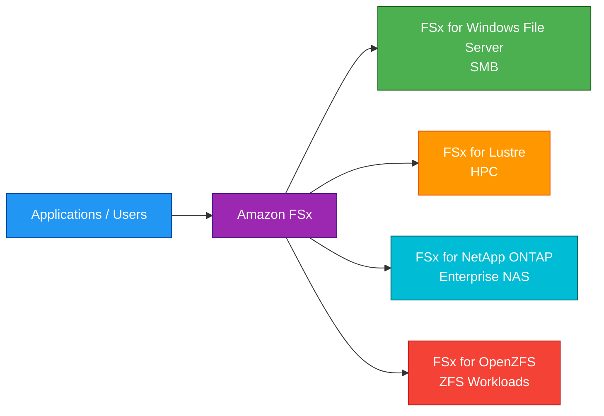
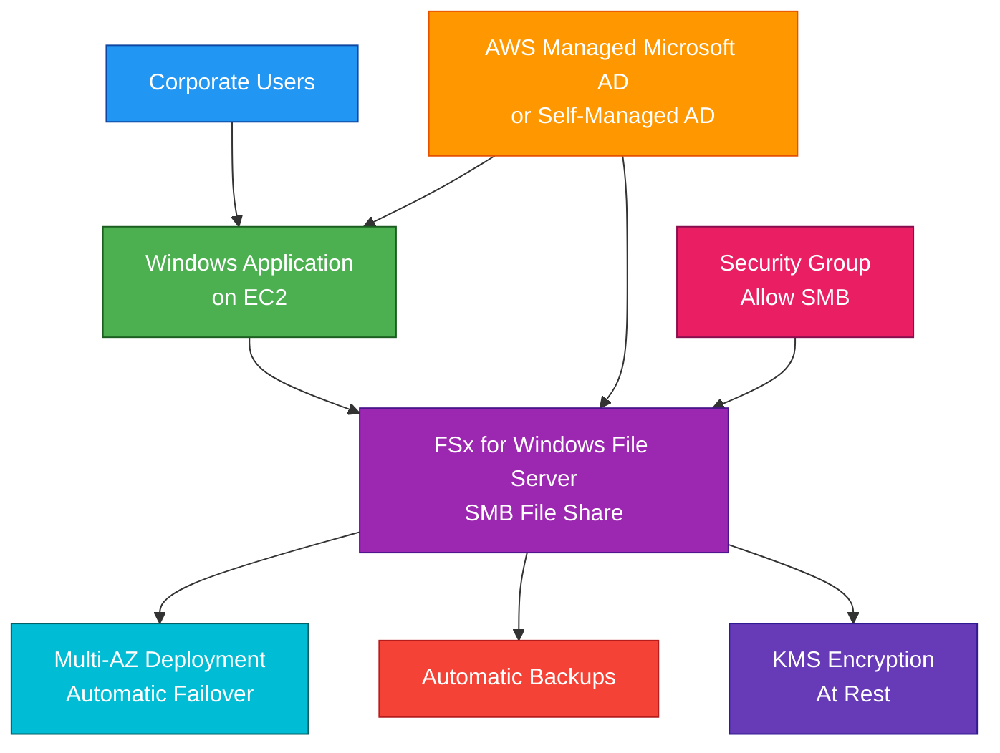

# Amazon FSx

## 1. Definition

### Simple Definition

Amazon FSx is a fully managed service for running high-performance file systems in AWS.

It gives you specialized file storage options for Windows, high-performance computing, NetApp ONTAP, and OpenZFS workloads.

### Memory Hook

FSx = Fully managed specialized file systems.

### Basic Idea

Instead of building and managing file servers yourself, you choose the FSx file system type that matches your application.

### Main FSx File System Types

| FSx Type | Best For |
|---|---|
| FSx for Windows File Server | Windows SMB file shares |
| FSx for Lustre | High-performance computing and fast processing |
| FSx for NetApp ONTAP | Enterprise NAS, NFS, SMB, iSCSI, snapshots |
| FSx for OpenZFS | ZFS-based Linux/Unix workloads |

## 2. What Problem Does It Solve?

### Main Problem

Amazon FSx solves the problem of running specialized file systems without managing file servers, storage hardware, replication, patching, and backups yourself.

### Without Amazon FSx

You may need to manage:

- File server installation
- Storage provisioning
- Patching
- Backups
- Replication
- Failover
- Performance tuning
- Active Directory integration
- High availability

### With Amazon FSx

AWS manages the file system infrastructure.

You focus on:

- Choosing the right FSx type
- File system access
- Permissions
- Performance settings
- Backup policies
- Application integration

### Key Benefit

Amazon FSx provides managed file systems for workloads that need more specialized features than EFS or S3.

## 3. Core Use Cases

### Windows File Shares

Use FSx for Windows File Server when Windows applications need shared SMB file storage.

Examples:

- Windows home directories
- Department shares
- Microsoft SQL Server file shares
- Windows application storage

### High-Performance Computing

Use FSx for Lustre when applications need very high throughput and low-latency file access.

Examples:

- Machine learning
- Genomics
- Media rendering
- Financial simulations
- Scientific computing

### Enterprise NAS Migration

Use FSx for NetApp ONTAP when migrating or extending NetApp-style enterprise storage to AWS.

Examples:

- NFS shares
- SMB shares
- iSCSI block access
- Snapshots
- Deduplication and compression

### ZFS-Based Workloads

Use FSx for OpenZFS when applications need ZFS features with managed AWS operations.

Examples:

- Linux file shares
- Low-latency workloads
- Snapshot-heavy workloads
- Applications already built around ZFS

### Shared File Storage for Applications

Use Amazon FSx when multiple application servers need access to the same managed file system.

### Data Processing with S3

FSx for Lustre can integrate with S3.

This is useful when data lives in S3 but needs high-performance file system access for processing.

## 4. Important Features for SAA

### FSx for Windows File Server

FSx for Windows File Server provides a fully managed Windows file system using the SMB protocol.

Best for:

- Windows workloads
- Active Directory integration
- SMB file shares
- NTFS permissions
- Windows user home directories
- Lift-and-shift Windows applications

### SMB Protocol

SMB is the common file sharing protocol used by Windows systems.

Important exam clue:

If the question says Windows file shares or SMB, think FSx for Windows File Server.

### Active Directory Integration

FSx for Windows File Server integrates with Microsoft Active Directory.

You can use:

- AWS Managed Microsoft AD
- Self-managed Microsoft AD

This allows users to access files using existing AD identities and permissions.

### FSx for Lustre

FSx for Lustre provides a high-performance parallel file system.

Best for:

- HPC
- Machine learning
- Big data analytics
- Media processing
- Workloads needing very high throughput

### Lustre and S3 Integration

FSx for Lustre can link to S3.

Common pattern:

1. Store data in S3.
2. Process data at high speed using FSx for Lustre.
3. Write results back to S3.

### Scratch vs Persistent Lustre

FSx for Lustre has deployment options.

| Option | Best For |
|---|---|
| Scratch | Temporary high-performance processing |
| Persistent | Longer-term workloads needing durable file system storage |

### FSx for NetApp ONTAP

FSx for NetApp ONTAP provides managed NetApp ONTAP storage.

It supports multiple protocols:

- NFS
- SMB
- iSCSI

Useful features include:

- Snapshots
- Cloning
- Replication
- Deduplication
- Compression
- Thin provisioning

### FSx for OpenZFS

FSx for OpenZFS provides managed OpenZFS file systems.

Best for:

- Linux/Unix workloads
- ZFS-based applications
- Snapshot and clone workflows
- Low-latency file access

### File System Deployment Options

Deployment options depend on the FSx type.

Common concepts include:

- Single-AZ
- Multi-AZ
- Scratch
- Persistent
- Throughput capacity
- SSD storage
- HDD storage for some file systems

### Storage Options

Some FSx file systems support SSD and HDD storage.

| Storage Type | Best For |
|---|---|
| SSD | Low latency and high IOPS |
| HDD | Lower-cost storage for throughput-oriented workloads |

### Backups

Amazon FSx supports backups.

Backups can be:

- Automatic
- User-initiated
- Managed by AWS Backup for supported FSx types

### Data Deduplication and Compression

Some FSx types support storage efficiency features.

Example:

FSx for NetApp ONTAP supports deduplication and compression.

This can reduce storage cost for duplicate or compressible data.

### Snapshots and Clones

Some FSx types support snapshots and fast clones.

These are useful for:

- Testing
- Development
- Data protection
- Quick recovery
- Analytics copies

### Performance Configuration

Amazon FSx lets you choose performance settings such as:

- Storage capacity
- Throughput capacity
- IOPS options, depending on file system type
- Deployment type

### AWS Backup Integration

Amazon FSx integrates with AWS Backup for centralized backup plans, retention rules, and recovery management.

## 5. Security Model

### IAM Permissions

IAM controls who can create, manage, and delete FSx resources.

Common permissions:

| Permission | Purpose |
|---|---|
| `fsx:CreateFileSystem` | Create an FSx file system |
| `fsx:DeleteFileSystem` | Delete an FSx file system |
| `fsx:DescribeFileSystems` | View file system details |
| `fsx:CreateBackup` | Create a backup |
| `fsx:RestoreVolumeFromSnapshot` | Restore from snapshot where supported |
| `fsx:UpdateFileSystem` | Modify file system settings |

### Network Security

FSx file systems run inside a VPC.

Access is controlled using:

- Security groups
- Network ACLs
- Route tables
- Subnet placement
- Active Directory permissions where applicable

### Security Groups

Security groups control which clients can connect to the file system.

Examples:

- Allow SMB from Windows application servers
- Allow NFS from Linux application servers
- Allow iSCSI from approved clients

### Common Protocols

| FSx Type | Common Protocols |
|---|---|
| FSx for Windows File Server | SMB |
| FSx for Lustre | Lustre client protocol |
| FSx for NetApp ONTAP | NFS, SMB, iSCSI |
| FSx for OpenZFS | NFS |

### Encryption at Rest

Amazon FSx supports encryption at rest using AWS KMS.

This protects file system data and backups.

### Encryption in Transit

Encryption in transit depends on the FSx type and protocol.

Examples:

- SMB encryption for Windows workloads
- Kerberos-based security with Active Directory
- TLS or protocol-level encryption where supported
- Application-level encryption when needed

### Active Directory Security

For FSx for Windows File Server, use Active Directory users, groups, and NTFS permissions to control file access.

### File Permissions

File-level permissions depend on the file system type.

Examples:

- NTFS permissions for Windows file shares
- POSIX permissions for NFS-based workloads
- ONTAP storage policies and permissions

### Shared Responsibility

AWS is responsible for:

- FSx managed infrastructure
- File system service availability
- Hardware maintenance
- Managed backups infrastructure
- Physical security
- Managed patching of service infrastructure

You are responsible for:

- IAM permissions
- Security groups
- Network access
- File permissions
- Active Directory configuration
- KMS key permissions
- Backup retention settings
- Application access control

## 6. High Availability / Durability Behavior

### Availability

Amazon FSx availability depends on the file system type and deployment option.

Some FSx types support Multi-AZ deployments for higher availability.

### Single-AZ

Single-AZ file systems run in one Availability Zone.

Use them when:

- Lower cost is important
- Workload can tolerate AZ-level failure
- Data can be restored from backup
- Dev/test environment is acceptable

### Multi-AZ

Multi-AZ file systems replicate data to a standby file server in another Availability Zone, depending on FSx type.

Use Multi-AZ for production workloads that need higher availability.

### FSx for Windows HA

FSx for Windows File Server supports Single-AZ and Multi-AZ deployment options.

Multi-AZ provides automatic failover for higher availability.

### FSx for Lustre Durability

FSx for Lustre has scratch and persistent options.

| Option | Durability Pattern |
|---|---|
| Scratch | Temporary processing, not for long-term durable storage |
| Persistent | More durable file system for longer-running workloads |

### FSx for NetApp ONTAP HA

FSx for NetApp ONTAP supports high availability features and can provide Multi-AZ deployment options.

It is commonly used for enterprise workloads needing resilient NAS features.

### FSx for OpenZFS HA

FSx for OpenZFS supports managed ZFS file storage with deployment options depending on requirements.

For exam purposes, match it to ZFS-style Linux/Unix workloads.

### Backup Durability

FSx backups help protect against accidental deletion, corruption, or file system failure.

Backups can be copied or managed using AWS Backup where supported.

### Multi-Region Behavior

Amazon FSx file systems are regional resources.

For Multi-Region disaster recovery, use backup copy, replication features, or application-level replication depending on the FSx type.

### Important Exam Point

Amazon FSx provides managed file systems, but you must choose the correct deployment option for availability and durability requirements.

## 7. Cost Optimization Options

### Choose the Correct FSx Type

The biggest cost optimization is choosing the right file system for the workload.

| Requirement | Cost-Aware Choice |
|---|---|
| Windows SMB shares | FSx for Windows File Server |
| HPC temporary processing | FSx for Lustre Scratch |
| Enterprise NAS features | FSx for NetApp ONTAP |
| ZFS workload | FSx for OpenZFS |
| Simple Linux shared files | EFS may be better |

### Use Single-AZ When Appropriate

Single-AZ deployments are usually cheaper than Multi-AZ.

Use Single-AZ only when the workload can tolerate AZ-level failure.

### Use HDD When Workload Allows

For supported FSx types, HDD storage may cost less than SSD.

Use HDD for workloads that need lower-cost storage and do not require SSD latency.

### Right-Size Throughput Capacity

Do not overprovision throughput.

Choose throughput based on application needs and monitor usage.

### Delete Unused File Systems

FSx file systems can create ongoing cost.

Delete unused dev/test file systems when they are no longer needed.

### Use Backups Carefully

Backups add cost.

Set backup retention based on recovery and compliance needs.

### Use Storage Efficiency Features

For FSx for NetApp ONTAP, use features like deduplication and compression when appropriate.

These can reduce storage consumption.

### Use S3 with FSx for Lustre

For analytics and HPC workloads, keep durable source data in S3 and use FSx for Lustre for high-speed processing.

This avoids keeping expensive high-performance file storage longer than needed.

### Monitor Usage

Use CloudWatch metrics to monitor:

- Storage capacity
- Throughput
- IOPS
- Client connections
- Backup usage

### Avoid Using FSx When S3 Is Enough

If applications only need object storage, backups, static assets, or data lake storage, S3 is usually more cost-effective than FSx.

## 8. Common Exam Traps

### FSx Is Not One File System

Amazon FSx is a family of managed file systems.

Always identify which FSx type the exam scenario needs.

### Windows File Share Means FSx for Windows File Server

If the question says Windows, SMB, NTFS, or Active Directory file shares, choose FSx for Windows File Server.

### HPC Means FSx for Lustre

If the question says high-performance computing, machine learning training, parallel processing, or S3-linked high-speed file access, choose FSx for Lustre.

### NetApp Means FSx for NetApp ONTAP

If the question mentions NetApp ONTAP features, NFS/SMB/iSCSI together, snapshots, clones, deduplication, or enterprise NAS migration, choose FSx for NetApp ONTAP.

### ZFS Means FSx for OpenZFS

If the question mentions ZFS workloads, snapshots, clones, or OpenZFS compatibility, choose FSx for OpenZFS.

### FSx vs EFS

EFS is general-purpose shared Linux NFS file storage.

FSx is for specialized managed file systems.

### FSx vs S3

S3 is object storage.

FSx is file storage.

If the question asks for data lake object storage, choose S3.

### FSx vs EBS

EBS is block storage attached to EC2.

FSx is managed shared file storage.

### Lustre Scratch Is Not for Long-Term Durable Storage

FSx for Lustre Scratch is for temporary high-performance workloads.

For longer-term Lustre workloads, use Persistent.

### Multi-AZ Costs More but Improves Availability

Do not choose Multi-AZ only for lowest cost.

Choose Multi-AZ when production availability is required.

### File Permissions Still Matter

FSx manages infrastructure, but you still manage access controls such as NTFS, POSIX, AD permissions, and security groups.

## 9. Compare With Similar Services

### Service Comparison Table

| Service | Storage Type | Best For | Choose When |
|---|---|---|---|
| FSx for Windows File Server | Managed Windows file system | SMB, NTFS, AD-integrated file shares | Windows applications need shared file storage |
| FSx for Lustre | High-performance file system | HPC, ML, analytics, S3-linked processing | You need very high throughput and low latency |
| FSx for NetApp ONTAP | Enterprise NAS | NFS, SMB, iSCSI, snapshots, dedupe | You need NetApp ONTAP features in AWS |
| FSx for OpenZFS | Managed ZFS file system | ZFS-based Linux/Unix workloads | You need OpenZFS features |
| EFS | Managed NFS file storage | Shared Linux file systems | Multiple Linux clients need shared files |
| EBS | Block storage | EC2 disks and databases | One EC2 instance needs persistent block storage |
| S3 | Object storage | Backups, logs, data lakes, static files | You need scalable object storage |

### FSx vs EFS

| Feature | Amazon FSx | Amazon EFS |
|---|---|---|
| Main purpose | Specialized managed file systems | General Linux NFS shared storage |
| Protocols | SMB, NFS, Lustre, iSCSI depending on type | NFS |
| Best for | Windows, HPC, NetApp, ZFS workloads | Shared Linux file access |
| Exam clue | Specialized file system requirement | Multiple Linux instances need shared files |

### FSx for Windows vs EFS

| Feature | FSx for Windows File Server | EFS |
|---|---|---|
| Protocol | SMB | NFS |
| Best for | Windows workloads | Linux workloads |
| Permissions | NTFS and Active Directory | POSIX |
| Common use | Windows file shares | Linux shared app files |

### FSx for Lustre vs S3

| Feature | FSx for Lustre | S3 |
|---|---|---|
| Storage type | High-performance file system | Object storage |
| Best for | Fast processing | Durable object storage |
| Common use together | Process S3 data quickly | Store source and results durably |
| Exam clue | HPC and high throughput | Data lake and object storage |

### FSx vs EBS

| Feature | FSx | EBS |
|---|---|---|
| Storage type | File | Block |
| Sharing | Shared file system | Usually attached to one EC2 instance |
| Best for | Shared file workloads | EC2 boot/data volumes |
| Management | AWS manages file system | You manage file system on volume |

### FSx vs Storage Gateway

| Feature | FSx | Storage Gateway |
|---|---|---|
| Main purpose | Managed cloud file systems | Hybrid access to AWS storage |
| Best for | AWS-hosted file workloads | On-premises apps needing AWS-backed storage |
| Common use | File system in AWS | File, volume, or tape gateway on-premises |

### When to Choose Amazon FSx

Choose Amazon FSx when:

- You need managed file storage
- You need Windows SMB shares
- You need high-performance Lustre storage
- You need NetApp ONTAP features
- You need OpenZFS compatibility
- You need Active Directory-integrated file storage
- You need specialized file system features not provided by EFS or S3

## 10. Mini Architecture Example

### Scenario

A company runs Windows applications on EC2 instances.

The applications need a shared Windows file share with Active Directory permissions.

The company wants high availability and managed file server operations.

### Architecture

Use FSx for Windows File Server with Multi-AZ deployment.

Join it to AWS Managed Microsoft AD or self-managed AD.

Windows EC2 instances access the file share using SMB.

### Why This Is Good

- FSx provides managed Windows file shares
- SMB supports Windows application access
- Active Directory controls user authentication and permissions
- Multi-AZ improves availability
- Backups protect file data
- KMS encryption protects data at rest
- Security groups restrict file share access
- AWS manages file server infrastructure

### Exam Answer Pattern

If the question says:

“Windows applications need shared SMB file storage with Active Directory integration.”

Think:

FSx for Windows File Server.

If the question says:

“High-performance file system for machine learning, analytics, or HPC with S3 integration.”

Think:

FSx for Lustre.

If the question says:

“Managed NetApp ONTAP features such as snapshots, clones, deduplication, NFS, SMB, and iSCSI.”

Think:

FSx for NetApp ONTAP.

If the question says:

“Managed OpenZFS-compatible file system.”

Think:

FSx for OpenZFS.

### Final Memory Hook

FSx = Specialized managed file systems.

FSx for Windows = SMB + AD + NTFS.

FSx for Lustre = HPC + high throughput + S3 integration.

FSx for NetApp ONTAP = Enterprise NAS + NFS/SMB/iSCSI.

FSx for OpenZFS = Managed ZFS.

EFS = General Linux NFS shared file storage.

EBS = EC2 block storage.

S3 = Object storage.

