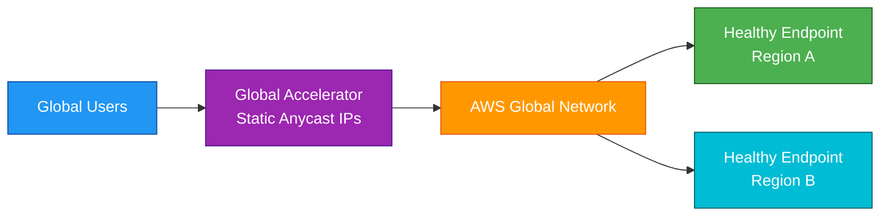
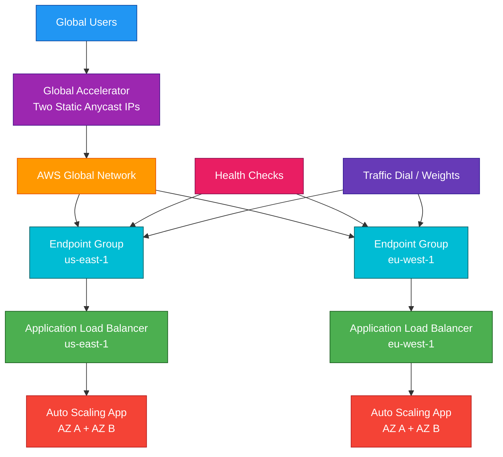

# AWS Global Accelerator

## 1. Definition

### Simple Definition

AWS Global Accelerator is a networking service that improves global application availability and performance using static anycast IP addresses.

It routes user traffic through the AWS global network to the best healthy application endpoint.

### Memory Hook

Global Accelerator = Global static IPs + fast AWS network routing.

### Basic Idea

Users connect to Global Accelerator’s static IP addresses.

Global Accelerator sends traffic over the AWS global network to the closest healthy endpoint.

### Main Purpose

Global Accelerator helps improve:

- Global application performance
- Fast regional failover
- Static IP access
- Traffic routing across AWS Regions
- Availability for internet-facing applications

## 2. What Problem Does It Solve?

### Main Problem

Global Accelerator solves the problem of slow or unreliable global traffic routing over the public internet.

Internet routing can be unpredictable because traffic may pass through many networks before reaching AWS.

### Without Global Accelerator

Global users may experience:

- Higher latency
- Slower failover
- DNS caching delays
- Unpredictable internet paths
- Complex IP allowlisting
- Regional endpoint management issues

### With Global Accelerator

Users connect to fixed global IP addresses.

AWS routes traffic through its global network to the best healthy endpoint.

### Key Benefit

Global Accelerator gives applications faster, more reliable global access with static IP addresses and quick failover.

## 3. Core Use Cases

### Improve Global Application Performance

Use Global Accelerator when users are spread across the world and need fast access to your application.

Examples:

- Gaming applications
- Financial applications
- Real-time APIs
- Voice or video applications
- Global web applications

### Fast Multi-Region Failover

Global Accelerator can quickly route traffic away from unhealthy endpoints.

Example:

If the application in one Region fails, traffic can shift to another healthy Region.

### Static IP Address Requirement

Global Accelerator provides static anycast IP addresses.

Use it when clients, partners, or firewalls need fixed IPs to connect to your application.

### Regional Application Routing

Route users to application endpoints in different AWS Regions.

Examples:

- ALB in `us-east-1`
- NLB in `eu-west-1`
- EC2 endpoint in `ap-southeast-1`

### Non-HTTP Workloads

Use Global Accelerator for TCP or UDP applications that need global performance.

Examples:

- Gaming servers
- VoIP
- Custom TCP services
- UDP-based applications

### Blue/Green or Traffic Shifting

Use endpoint weights and traffic dials to shift traffic between endpoints or Regions.

Example:

Send 10% of global traffic to a new Region for testing.

## 4. Important Features for SAA

### Accelerator

An accelerator is the main Global Accelerator resource.

It provides static IP addresses that users connect to.

Important points:

- Provides two static anycast IPv4 addresses by default
- Routes traffic over the AWS global network
- Supports TCP and UDP traffic
- Routes traffic to healthy endpoints

### Anycast IP Addresses

Anycast means the same IP address is advertised from multiple edge locations.

Users are routed to the nearest AWS edge location.

### Static IP Addresses

Global Accelerator gives fixed IP addresses that do not change.

This is useful for:

- Firewall allowlists
- Partner integrations
- Stable client configuration
- Avoiding DNS change delays

### AWS Global Network

After traffic reaches the nearest AWS edge location, it travels across AWS’s private global network.

This can improve performance compared with normal public internet routing.

### Listener

A listener processes inbound connections based on protocol and port.

Examples:

| Listener | Use Case |
|---|---|
| TCP 443 | Secure application traffic |
| TCP 80 | Web traffic |
| UDP 5000 | Gaming or real-time app traffic |

### Endpoint Group

An endpoint group is associated with a specific AWS Region.

It contains endpoints in that Region.

Example:

- Endpoint group in `us-east-1`
- Endpoint group in `eu-west-1`

### Endpoint

An endpoint is the AWS resource that receives traffic.

Supported standard accelerator endpoints include:

- Application Load Balancer
- Network Load Balancer
- EC2 instance
- Elastic IP address

### Standard Accelerator

A standard accelerator routes traffic to the best healthy endpoint based on performance, health, and routing settings.

Use this for most application acceleration and failover use cases.

### Custom Routing Accelerator

A custom routing accelerator lets you map traffic to specific EC2 instances and ports in VPC subnets.

Use it for specialized applications that need custom port mapping.

Example:

Gaming servers where each client connects to a specific game session endpoint.

### Health Checks

Global Accelerator checks endpoint health.

If an endpoint becomes unhealthy, traffic is routed to healthy endpoints.

Important exam point:

Global Accelerator failover is not affected by DNS TTL caching in the same way as DNS-based failover.

### Traffic Dial

Traffic dial controls the percentage of traffic sent to an endpoint group.

Example:

| Region | Traffic Dial |
|---|---:|
| `us-east-1` | 100% |
| `eu-west-1` | 0% |

Use this for:

- Regional failover
- Testing
- Gradual traffic shifting
- Blue/green deployment

### Endpoint Weight

Endpoint weights control how much traffic goes to specific endpoints within an endpoint group.

Example:

| Endpoint | Weight |
|---|---:|
| ALB A | 90 |
| ALB B | 10 |

### Client Affinity

Client affinity can keep traffic from the same source IP going to the same endpoint.

Use it when applications need session stickiness based on client IP.

### Failover

Global Accelerator can fail over traffic quickly to healthy endpoints.

This is useful for Multi-Region disaster recovery.

### Bring Your Own IP

Global Accelerator can support Bring Your Own IP, or BYOIP, for using your own public IP address ranges with AWS.

### Flow Logs

Global Accelerator flow logs capture traffic information.

Use them for:

- Troubleshooting
- Security analysis
- Traffic visibility
- Auditing

## 5. Security Model

### IAM Permissions

IAM controls who can create and manage Global Accelerator resources.

Common permissions:

| Permission | Purpose |
|---|---|
| `globalaccelerator:CreateAccelerator` | Create an accelerator |
| `globalaccelerator:CreateListener` | Create a listener |
| `globalaccelerator:CreateEndpointGroup` | Create endpoint groups |
| `globalaccelerator:UpdateAccelerator` | Modify accelerator settings |
| `globalaccelerator:DeleteAccelerator` | Delete an accelerator |
| `globalaccelerator:DescribeAccelerator` | View accelerator details |

### Static IP Security

Global Accelerator provides static public IP addresses.

You can give these IPs to clients or partners for allowlisting.

### Endpoint Security

Global Accelerator does not replace endpoint security.

You still need to secure backend resources using:

- Security groups
- Network ACLs
- Load balancer listeners
- TLS certificates
- Application authentication
- WAF where applicable

### Security Groups

For endpoints like ALB, NLB, or EC2, configure security groups to allow only required traffic.

Example:

Allow inbound HTTPS traffic from Global Accelerator to the ALB or target.

### Encryption in Transit

Global Accelerator improves network routing but does not automatically encrypt application traffic.

Use encryption protocols such as:

- HTTPS
- TLS
- Application-level encryption

### AWS Shield

Global Accelerator includes AWS Shield Standard protection.

This helps protect against common DDoS attacks.

For advanced DDoS protection, use AWS Shield Advanced.

### WAF Integration

AWS WAF is not attached directly to Global Accelerator.

For HTTP/HTTPS applications, attach WAF to supported resources such as:

- Application Load Balancer
- CloudFront
- API Gateway

### Flow Logs

Enable flow logs when you need visibility into traffic.

Flow logs can help investigate:

- Source IPs
- Ports
- Traffic patterns
- Accepted or rejected flows

### Shared Responsibility

AWS is responsible for:

- Global Accelerator infrastructure
- Edge network availability
- Anycast IP routing
- AWS global network operations
- Physical security
- Shield Standard protection

You are responsible for:

- IAM permissions
- Endpoint security
- Security groups and NACLs
- TLS configuration
- Application authentication
- WAF placement where needed
- Monitoring and logging
- Traffic routing configuration

## 6. High Availability / Durability Behavior

### Availability

Global Accelerator is designed for high availability using AWS global edge locations and the AWS global network.

Users connect to static anycast IPs that are advertised from multiple edge locations.

### Fault Tolerance

If one edge location has an issue, traffic can be routed to another edge location.

If one application endpoint becomes unhealthy, traffic can be routed to another healthy endpoint.

### Multi-Region Behavior

Global Accelerator is commonly used for Multi-Region applications.

Example:

- Primary endpoint in `us-east-1`
- Secondary endpoint in `us-west-2`
- Global Accelerator routes users to the best healthy Region

### Multi-AZ Behavior

Global Accelerator itself is global.

Your endpoints should still be designed for Multi-AZ availability.

Example:

Use an ALB across multiple Availability Zones as a Global Accelerator endpoint.

### Health-Based Routing

Global Accelerator continuously monitors endpoint health.

Unhealthy endpoints are removed from traffic routing.

### Fast Failover

Global Accelerator can provide faster failover than DNS-based failover because clients keep using the same static IP addresses.

There is no need to wait for DNS caches to expire.

### Durability

Global Accelerator is not a storage service.

Durability applies to your backend data services, such as:

- S3
- DynamoDB
- Aurora
- RDS
- EFS

### Endpoint Responsibility

Global Accelerator improves traffic routing, but the application endpoints must still be highly available.

Use:

- Multi-AZ load balancers
- Auto Scaling
- Healthy target groups
- Multi-Region deployment
- Database replication
- Backups

## 7. Cost Optimization Options

### Use Global Accelerator Only When Needed

Global Accelerator adds cost.

Use it when you need benefits such as:

- Static global IPs
- Fast failover
- Improved global routing
- TCP/UDP acceleration
- Multi-Region traffic management

### Do Not Use It Just for Caching

Global Accelerator does not cache content.

If the main goal is caching static content globally, use CloudFront instead.

### Use Traffic Dials for Controlled Rollouts

Traffic dials can reduce risk during deployments.

Example:

Send only 10% of traffic to a new Region before scaling fully.

### Right-Size Backend Endpoints

Global Accelerator routes traffic, but backend resources still create cost.

Optimize:

- ALB/NLB usage
- EC2 instance size
- Auto Scaling capacity
- Multi-Region standby size

### Avoid Unnecessary Regions

Each additional Region can add backend infrastructure cost.

Use extra Regions only when they improve performance, availability, or DR.

### Monitor Data Transfer

Global Accelerator can change how traffic flows through AWS.

Monitor data transfer and accelerator usage to understand cost.

### Use CloudFront for Cacheable Content

For websites with static or cacheable content, CloudFront may reduce origin traffic and cost.

Use Global Accelerator for dynamic, TCP, UDP, or static-IP needs.

### Delete Unused Accelerators

Remove unused accelerators, listeners, and endpoint groups from test or old environments.

### Compare With Route 53

If DNS-based routing is enough and fast failover/static IPs are not required, Route 53 may be more cost-effective.

## 8. Common Exam Traps

### Global Accelerator Is Not a CDN

Global Accelerator does not cache content.

CloudFront is the CDN.

Memory hook:

- CloudFront = Cache content
- Global Accelerator = Accelerate network path

### Global Accelerator vs Route 53

Route 53 uses DNS routing.

Global Accelerator uses static anycast IPs and routes traffic through the AWS global network.

### DNS Failover Can Be Delayed

Route 53 failover can be affected by DNS caching and TTL.

Global Accelerator avoids this issue because clients use the same static IPs.

### Static IP Requirement Means Global Accelerator or NLB

If the exam asks for static global anycast IPs, choose Global Accelerator.

If it asks for static IPs for a regional Layer 4 load balancer, choose NLB.

### CloudFront Is Better for Static Content Caching

If the question says cache images, videos, CSS, JavaScript, or static website content globally, choose CloudFront.

### Global Accelerator Supports TCP and UDP

Global Accelerator is good for non-HTTP workloads.

CloudFront is mainly for HTTP/HTTPS content delivery.

### ELB Is Regional

ALB and NLB are regional services.

Global Accelerator can front regional endpoints and provide global entry points.

### It Does Not Replace Security Groups

Global Accelerator improves routing.

Security groups, NACLs, TLS, WAF, and application authentication are still needed.

### WAF Is Not Directly Attached to Global Accelerator

For Layer 7 protection, attach WAF to ALB, CloudFront, or API Gateway where supported.

### Global Accelerator Does Not Store Data

It is a networking service, not a database, cache, or storage service.

### Best Endpoint Choice Matters

For HTTP/HTTPS web apps, a common endpoint is ALB.

For TCP/UDP or static regional IP workloads, a common endpoint is NLB.

### Custom Routing Is Special Purpose

Most exam scenarios use standard accelerators.

Custom routing is for special cases where traffic must map to specific EC2 instances and ports.

## 9. Compare With Similar Services

### Service Comparison Table

| Service | Main Purpose | Best For | Choose When |
|---|---|---|---|
| Global Accelerator | Global network acceleration | Static anycast IPs, fast failover, TCP/UDP acceleration | You need global performance and stable IPs |
| CloudFront | CDN and edge caching | Static/dynamic HTTP content delivery | You need caching close to users |
| Route 53 | DNS routing | Domain name routing and DNS failover | You need DNS records or DNS-based routing |
| Application Load Balancer | Layer 7 load balancing | HTTP/HTTPS routing | You need path, host, or header routing |
| Network Load Balancer | Layer 4 load balancing | TCP/UDP/TLS and static regional IPs | You need high performance regional load balancing |
| Direct Connect | Private connectivity | Hybrid network connection to AWS | You need private dedicated on-premises connectivity |

### Global Accelerator vs CloudFront

| Feature | Global Accelerator | CloudFront |
|---|---|---|
| Main purpose | Network acceleration | CDN caching |
| Caching | No | Yes |
| Protocol focus | TCP and UDP | HTTP and HTTPS |
| Static anycast IPs | Yes | Not the main feature |
| Best for | Dynamic apps, gaming, TCP/UDP, fast failover | Websites, APIs, static content, video |
| Exam clue | Static IPs and global failover | Cache content near users |

### Global Accelerator vs Route 53

| Feature | Global Accelerator | Route 53 |
|---|---|---|
| Routing method | Anycast IP routing | DNS routing |
| Static IPs | Yes | No static anycast IPs |
| Failover speed | Fast, not TTL-dependent | Affected by DNS TTL/cache |
| Best for | Global app acceleration | DNS management and routing policies |
| Common use together | Route 53 can point domain to accelerator | Route 53 manages DNS name |

### Global Accelerator vs ALB

| Feature | Global Accelerator | ALB |
|---|---|---|
| Scope | Global | Regional |
| Layer | Network acceleration | Layer 7 load balancing |
| Path-based routing | No | Yes |
| Static anycast IPs | Yes | No |
| Common use together | Global Accelerator fronts ALB | ALB routes to app targets |

### Global Accelerator vs NLB

| Feature | Global Accelerator | NLB |
|---|---|---|
| Scope | Global | Regional |
| Static IP type | Global anycast IPs | Regional static IPs |
| Main purpose | Global routing and acceleration | Regional Layer 4 load balancing |
| Common use together | Global Accelerator fronts NLB | NLB receives accelerated traffic |

### Global Accelerator vs Direct Connect

| Feature | Global Accelerator | Direct Connect |
|---|---|---|
| Main purpose | Improve internet-facing app access | Private hybrid connectivity |
| Users | Public internet clients | On-premises networks |
| Network path | AWS edge and global network | Dedicated private connection |
| Best for | Global public apps | Data center to AWS connectivity |

### When to Choose Global Accelerator

Choose Global Accelerator when:

- You need static global IP addresses
- You need faster global application access
- You need fast Multi-Region failover
- You need TCP or UDP acceleration
- You want traffic to use the AWS global network
- You need to front ALB, NLB, EC2, or Elastic IP endpoints
- DNS failover is too slow because of TTL caching

## 10. Mini Architecture Example

### Scenario

A company runs a latency-sensitive application in two AWS Regions.

Users are global, and the company wants fixed IP addresses, fast failover, and better performance than normal internet routing.

### Architecture

Use Global Accelerator with two static anycast IPs.

Create endpoint groups in two Regions.

Each Region has an Application Load Balancer across multiple Availability Zones.

Global Accelerator routes users to the closest healthy Region.

### Why This Is Good

- Users connect to fixed global IP addresses
- Traffic enters AWS at a nearby edge location
- AWS global network carries traffic to the best endpoint
- Health checks support fast failover
- Endpoint groups support Multi-Region routing
- ALBs distribute traffic across Multi-AZ application targets
- Traffic dials and weights support controlled traffic shifting

### Exam Answer Pattern

If the question says:

“Improve global performance and provide static IP addresses for an application deployed across multiple AWS Regions.”

Think:

AWS Global Accelerator.

If the question says:

“Cache static content globally.”

Think:

CloudFront.

If the question says:

“DNS routing and domain registration.”

Think:

Route 53.

### Final Memory Hook

Global Accelerator = Static global IPs and fast failover.

CloudFront = CDN caching at the edge.

Route 53 = DNS routing.

ALB = Regional Layer 7 load balancing.

NLB = Regional Layer 4 load balancing with static IPs.

Direct Connect = Private connection from on-premises to AWS.

