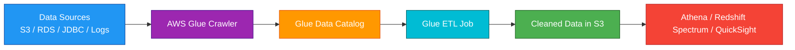
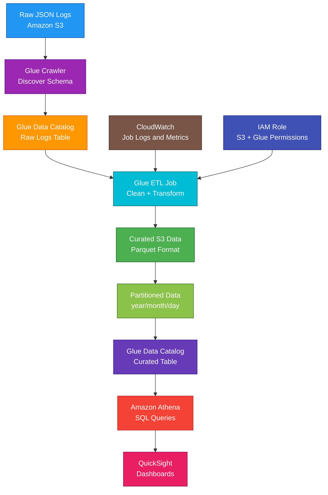

# AWS Glue

<details>
<summary>

## 1. Definition

</summary>

### Simple Definition

AWS Glue is a fully managed serverless data integration service.

It helps you discover, catalog, clean, transform, and move data between different data stores.

### Memory Hook

Glue = Connects and prepares data for analytics.

### Basic Idea

AWS Glue is commonly used to prepare data for analytics.

It can crawl data sources, create metadata tables, run ETL jobs, and make data queryable by services like Athena, Redshift Spectrum, and EMR.



### Key Point

AWS Glue is serverless.

You do not manage ETL servers, clusters, or infrastructure for most Glue workloads.

</details>

<details>
<summary>

## 2. What Problem Does It Solve?

</summary>

### Main Problem

AWS Glue solves the problem of preparing data for analytics without manually managing data processing infrastructure.

Data is often stored in different formats and locations.

Glue helps discover, catalog, transform, and organize that data.

### Without AWS Glue

You may need to manually manage:

- ETL servers
- Data catalogs
- Schema discovery
- Data transformation scripts
- Data format conversion
- Job scheduling
- Spark clusters
- Metadata tables
- Data lake preparation

### With AWS Glue

AWS manages much of the data integration infrastructure.

You focus on:

- Data sources
- Transformation logic
- Job configuration
- Data catalog metadata
- Security permissions
- Analytics goals

### Key Benefit

AWS Glue makes it easier to build data lakes, ETL pipelines, and analytics-ready datasets.

</details>

<details>
<summary>

## 3. Core Use Cases

</summary>

### Data Lake Cataloging

Use Glue Crawlers to scan data in S3 and create table metadata in the Glue Data Catalog.

Example:

Crawl raw JSON logs in S3 and create tables for Athena queries.

### ETL Processing

Use Glue ETL jobs to extract, transform, and load data.

Examples:

- Convert JSON to Parquet
- Clean messy CSV files
- Join datasets
- Remove duplicate records
- Transform raw logs into analytics tables

### Data Format Conversion

Convert data into more efficient analytics formats.

Common conversions:

| From | To |
|---|---|
| JSON | Parquet |
| CSV | Parquet |
| Raw logs | Partitioned analytics data |
| Semi-structured data | Query-optimized tables |

### Data Lake Analytics

Glue prepares S3 data so analytics services can query it.

Common services:

- Amazon Athena
- Amazon Redshift Spectrum
- Amazon EMR
- Amazon QuickSight

### Schema Discovery

Glue Crawlers can detect schema from data sources.

Example:

A crawler scans S3 files and detects columns such as `userId`, `eventTime`, and `eventType`.

### Data Pipeline Automation

Glue jobs can run on a schedule or be triggered by events.

Examples:

- Daily ETL job
- Hourly log processing
- Event-driven data transformation
- Batch analytics pipeline

### Central Metadata Catalog

Glue Data Catalog stores metadata used by multiple analytics services.

This helps create a shared view of data across your data lake.

</details>

<details>
<summary>

## 4. Important Features for SAA

</summary>

### Glue Data Catalog

The Glue Data Catalog is a central metadata repository.

It stores information about data such as:

- Databases
- Tables
- Columns
- Data types
- Partitions
- File locations
- Data formats

### Metadata

Metadata means data about data.

Example:

A file in S3 contains sales records.

The metadata says:

- File format is Parquet
- Columns are `orderId`, `customerId`, and `amount`
- Data is located in `s3://bucket/sales/`
- Table name is `sales`

### Database

In Glue Data Catalog, a database is a logical container for tables.

Example:

`sales_analytics`

### Table

A table represents a dataset.

A Glue table can point to data stored in locations like S3.

Example:

An Athena query can use a Glue table to read S3 data.

### Crawler

A crawler scans data sources and creates or updates metadata in the Glue Data Catalog.

Crawler can detect:

- Schema
- File format
- Partitions
- Table structure

### Crawler Sources

Glue Crawlers can scan sources such as:

- Amazon S3
- JDBC data stores
- DynamoDB
- Data lake storage locations

### Classifier

A classifier tells Glue how to recognize data formats.

Built-in classifiers can detect common formats.

Examples:

- JSON
- CSV
- Parquet
- ORC
- Avro
- XML

### Custom Classifier

Use a custom classifier when Glue needs help understanding a special or custom data format.

### ETL Job

A Glue ETL job transforms data.

Common job languages and engines:

- Apache Spark
- Python
- PySpark
- Scala
- Python shell jobs

### Apache Spark

Glue commonly uses Apache Spark for distributed data processing.

Use Spark jobs for large-scale transformations.

### Python Shell Job

Python shell jobs are useful for smaller scripts that do not need distributed Spark processing.

### Glue Studio

Glue Studio provides a visual interface for creating, running, and monitoring ETL jobs.

Use it to build jobs with less manual coding.

### Glue Job Bookmark

Job bookmarks help Glue remember what data has already been processed.

Use job bookmarks to avoid reprocessing the same data.

Example:

Only process new files added since the last successful job run.

### Triggers

Triggers start Glue jobs.

Common trigger types:

| Trigger Type | Purpose |
|---|---|
| Scheduled | Run job at a specific time or interval |
| On-demand | Run manually |
| Conditional | Run after another job or crawler succeeds |

### Workflow

A Glue workflow coordinates multiple crawlers, jobs, and triggers.

Use workflows for multi-step ETL pipelines.

### Partitions

Partitions organize data by values such as date, region, or customer.

Example S3 path:

```text
s3://bucket/sales/year=2026/month=05/day=03/
```

Partitioning helps reduce query cost and improve performance.

### Glue and Athena

Athena uses Glue Data Catalog metadata to query S3 data.

Common pattern:

1. Store data in S3.
2. Use Glue crawler to catalog data.
3. Query the data using Athena.

### Glue and Redshift Spectrum

Redshift Spectrum can use Glue Data Catalog tables to query data in S3.

This allows Redshift to analyze data outside the Redshift cluster.

### Glue and Lake Formation

AWS Lake Formation builds on Glue Data Catalog for data lake governance.

Use Lake Formation when you need fine-grained permissions and centralized data lake access control.

### Glue Schema Registry

Glue Schema Registry helps manage schemas for streaming data.

It is useful with services such as:

- Amazon Kinesis
- Amazon MSK
- Kafka applications

### Glue Data Quality

AWS Glue Data Quality helps evaluate data against rules.

Examples:

- Column should not be null
- Values should be within a range
- Row count should meet expectations
- Data format should match rules

### Glue Connections

Glue connections store connection information for data sources.

Examples:

- JDBC endpoint
- Database credentials
- VPC connection settings
- Network configuration

### Development Endpoints and Notebooks

Glue can support interactive development using notebooks or development environments.

For SAA, focus more on crawlers, Data Catalog, ETL jobs, and integration with S3 and Athena.

</details>

<details>
<summary>

## 5. Security Model

</summary>

### IAM Permissions

IAM controls who can create, run, and manage Glue resources.

Common permissions:

| Permission | Purpose |
|---|---|
| `glue:CreateDatabase` | Create Glue database |
| `glue:CreateTable` | Create Glue table |
| `glue:GetTable` | Read table metadata |
| `glue:CreateCrawler` | Create crawler |
| `glue:StartCrawler` | Run crawler |
| `glue:CreateJob` | Create ETL job |
| `glue:StartJobRun` | Run ETL job |

### Glue Service Role

Glue jobs and crawlers use an IAM service role.

This role needs permissions to access data sources and targets.

Example permissions:

- Read raw data from S3
- Write transformed data to S3
- Access Glue Data Catalog
- Use KMS keys
- Connect to VPC resources

### S3 Permissions

Glue commonly reads and writes data in S3.

The Glue role may need:

- `s3:GetObject`
- `s3:PutObject`
- `s3:ListBucket`
- `s3:DeleteObject`, if cleanup is required

### Database Permissions

If Glue connects to RDS, Redshift, or JDBC sources, it needs:

- Network access
- Database credentials
- Security group access
- IAM permissions where applicable

### Encryption at Rest

Glue supports encryption for metadata and job outputs.

Common encryption areas:

- Glue Data Catalog metadata
- S3 data read or written by Glue
- Job bookmarks
- Logs
- Temporary data

Use AWS KMS when customer-managed encryption control is required.

### Encryption in Transit

Use SSL/TLS when connecting to data sources where supported.

Examples:

- JDBC over TLS
- HTTPS to AWS APIs
- Encrypted connections to databases

### VPC Access

Glue jobs can run inside a VPC to access private resources.

Use VPC access when Glue needs to connect to:

- RDS in private subnets
- Redshift in private subnets
- Internal JDBC databases
- Private data stores

### Security Groups

When Glue accesses VPC resources, security groups must allow traffic.

Example:

Allow Glue job network interfaces to connect to RDS on port `5432` or `3306`.

### Secrets Management

Do not hardcode database passwords in Glue scripts.

Use:

- AWS Secrets Manager
- Systems Manager Parameter Store
- Glue connections with secure credential handling

### Lake Formation Permissions

Lake Formation can provide fine-grained access control over data lake tables and columns.

Use it when access control needs to be more detailed than basic IAM and S3 bucket policies.

### Shared Responsibility

AWS is responsible for:

- Glue managed infrastructure
- Serverless job infrastructure
- Data Catalog service availability
- Physical security
- Managed scaling

You are responsible for:

- IAM roles and policies
- S3 bucket security
- KMS key policies
- Database credentials
- VPC security groups
- Data permissions
- Encryption settings
- ETL script security
- Sensitive data handling

</details>

<details>
<summary>

## 6. High Availability / Durability Behavior

</summary>

### Availability

AWS Glue is a managed regional service.

AWS manages the infrastructure used to run Glue jobs, crawlers, and the Data Catalog.

### Regional Service

Glue resources are created in a specific AWS Region.

Examples:

- Glue Data Catalog database
- Glue crawler
- Glue job
- Glue workflow

### Multi-AZ Behavior

Glue is managed by AWS across regional infrastructure.

You do not manually configure Multi-AZ for Glue jobs or crawlers.

### Data Durability

Glue itself is not usually the primary storage location for your data.

Data durability depends on the storage service used.

Common storage:

| Storage | Durability Role |
|---|---|
| S3 | Durable data lake storage |
| RDS | Durable relational database |
| Redshift | Data warehouse storage |
| DynamoDB | Durable NoSQL storage |

### Data Catalog Durability

Glue Data Catalog stores metadata as a managed service.

For disaster recovery, important table definitions and ETL code should also be managed using infrastructure as code where possible.

### Job Retry Behavior

Glue jobs can be configured with retries.

This helps recover from temporary failures.

### Failure Handling

Common Glue job failure causes:

- Missing IAM permission
- Wrong S3 path
- Schema mismatch
- Bad input data
- Network access problem
- Database connection issue
- KMS permission issue

### Multi-Region Behavior

Glue resources are regional.

For Multi-Region architectures, create Glue catalogs, jobs, and pipelines in each required Region or replicate metadata and data as needed.

### Backup and Recovery

For recovery, protect:

- Source data in S3
- Transformed data in S3
- Glue scripts
- Data Catalog definitions
- Job configuration
- Infrastructure as Code templates

### Important Exam Point

Glue prepares and catalogs data, but S3 is usually the durable storage layer in a data lake architecture.

</details>

<details>
<summary>

## 7. Cost Optimization Options

</summary>

### Use the Right Job Type

Use Spark jobs for large distributed processing.

Use Python shell jobs for smaller scripts.

Choosing the right job type can reduce cost.

### Right-Size Worker Type

Glue jobs use workers.

Avoid overprovisioning workers for small jobs.

Increase workers only when needed for performance.

### Use Job Bookmarks

Job bookmarks help avoid reprocessing old data.

This can reduce runtime and cost.

### Use Partitioning

Partition data in S3 by common query filters.

Examples:

- Date
- Region
- Customer
- Application

Partitioning reduces data scanned by Athena and other analytics tools.

### Convert to Columnar Formats

Convert raw JSON or CSV data to Parquet or ORC.

This can reduce:

- Storage cost
- Athena query cost
- Processing time
- Data scanned

### Avoid Running Crawlers Too Often

Crawlers cost money when they run.

Run crawlers only as often as needed.

For predictable schemas, consider manually defining tables or using scheduled crawlers less frequently.

### Filter Input Data

Process only the data needed.

Use:

- S3 prefixes
- Partitions
- Pushdown predicates
- Job bookmarks
- Incremental processing

### Use Triggers Carefully

Avoid unnecessary scheduled jobs.

Do not run ETL jobs every hour if data only arrives once per day.

### Clean Temporary Data

Glue jobs can create temporary files.

Clean up temporary S3 paths when they are no longer needed.

### Monitor Job Metrics

Use CloudWatch to monitor:

- Job duration
- Job failures
- Worker usage
- Data processed
- Retry count

</details>

<details>
<summary>

## 8. Common Exam Traps

</summary>

### Glue Is Not a Database

Glue does not store your main business data.

It catalogs and transforms data.

For storage, think S3, RDS, Redshift, DynamoDB, or other data stores.

### Glue Data Catalog Stores Metadata

The Data Catalog stores metadata, not the full dataset.

The actual data often stays in S3.

### Glue vs Athena

Glue catalogs and prepares data.

Athena queries data using SQL.

Common pattern:

Glue Data Catalog + S3 + Athena.

### Glue vs Redshift

Glue is for ETL and metadata cataloging.

Redshift is a data warehouse for analytics queries.

### Glue vs EMR

Glue is serverless ETL.

EMR gives more control over big data clusters like Spark, Hive, and Hadoop.

### Crawler Does Not Transform Data

A crawler discovers schema and creates metadata.

An ETL job transforms data.

### Job Bookmark Avoids Reprocessing

If the question says avoid processing the same data again, think Glue job bookmarks.

### Crawler Schema Can Be Wrong

If data is messy or inconsistent, a crawler may infer schema incorrectly.

Use custom classifiers or manual table definitions when needed.

### S3 Partitioning Matters

Poor partitioning can cause high Athena scan cost and slower queries.

Good partitioning improves analytics performance.

### Glue Needs IAM and S3 Permissions

If a Glue job fails to read or write data, check:

- Glue service role
- S3 bucket policy
- KMS key policy
- Lake Formation permissions
- VPC access

### Private Databases Need VPC Access

If Glue must connect to private RDS or Redshift, configure VPC, subnet, route, and security group access.

### Glue Is Regional

Glue jobs, crawlers, and Data Catalog resources are regional.

They do not automatically exist in all Regions.

</details>

<details>
<summary>

## 9. Compare With Similar Services

</summary>

### Service Comparison Table

| Service | Main Purpose | Best For | Choose When |
|---|---|---|---|
| AWS Glue | Serverless ETL and Data Catalog | Data lake preparation and metadata cataloging | You need to discover, catalog, clean, or transform data |
| Amazon Athena | Serverless SQL queries | Querying S3 data directly | You need SQL analytics on S3 |
| Amazon Redshift | Data warehouse | Large-scale analytics and reporting | You need high-performance OLAP queries |
| Amazon EMR | Big data cluster platform | Spark, Hadoop, Hive, Presto with more control | You need custom big data clusters |
| AWS Lake Formation | Data lake governance | Fine-grained data lake permissions | You need centralized data lake security |
| Kinesis Data Firehose | Streaming delivery | Delivering streaming data to S3/Redshift/OpenSearch | You need managed stream delivery |

### Glue vs Athena

| Feature | AWS Glue | Amazon Athena |
|---|---|---|
| Main purpose | Catalog and transform data | Query data with SQL |
| Stores metadata | Yes | Uses Glue Data Catalog |
| Runs ETL jobs | Yes | No |
| Common storage | S3 | S3 |
| Exam clue | Discover schema or transform data | Run SQL query on S3 |

### Glue vs Redshift

| Feature | AWS Glue | Amazon Redshift |
|---|---|---|
| Main purpose | ETL and metadata | Data warehouse |
| Query engine | ETL processing | SQL analytics engine |
| Best for | Preparing data | Analyzing structured data |
| Common use together | Load/prepare data | Query/report data |

### Glue vs EMR

| Feature | AWS Glue | Amazon EMR |
|---|---|---|
| Management | Serverless | Cluster-based |
| Control | Less infrastructure control | More control |
| Best for | Managed ETL jobs | Custom Spark/Hadoop workloads |
| Operations | Lower | Higher |
| Exam clue | Serverless ETL | Big data cluster control |

### Glue vs Lake Formation

| Feature | AWS Glue | AWS Lake Formation |
|---|---|---|
| Main purpose | ETL and metadata catalog | Data lake governance |
| Catalog | Glue Data Catalog | Uses Glue Data Catalog |
| Access control | IAM and resource policies | Fine-grained data permissions |
| Best for | Data preparation | Secure data lake management |

### Glue vs Kinesis Data Firehose

| Feature | AWS Glue | Kinesis Data Firehose |
|---|---|---|
| Main purpose | ETL and cataloging | Streaming data delivery |
| Processing style | Batch or serverless ETL | Near real-time delivery |
| Common target | S3, databases, analytics stores | S3, Redshift, OpenSearch, HTTP |
| Exam clue | Transform/catalog datasets | Deliver streaming logs/data |

### When to Choose AWS Glue

Choose AWS Glue when:

- You need serverless ETL
- You need to catalog S3 data
- You need schema discovery with crawlers
- You need to convert data formats
- You need to prepare data for Athena or Redshift Spectrum
- You need job bookmarks for incremental processing
- You need a central metadata catalog
- You need data lake preparation without managing Spark clusters

</details>

<details>
<summary>

## 10. Mini Architecture Example

</summary>

### Scenario

A company stores raw application logs in Amazon S3 as JSON files.

They want to query the logs using SQL and reduce query cost.

The raw logs should be transformed into partitioned Parquet files.

### Architecture

Use Glue Crawler to catalog raw S3 logs.

Use Glue ETL job to transform JSON into Parquet.

Store transformed data in a curated S3 bucket partitioned by date.

Use Athena to query the transformed data using the Glue Data Catalog.



### Why This Is Good

- S3 stores raw and curated data durably
- Glue Crawler discovers schema automatically
- Glue Data Catalog stores metadata for Athena
- Glue ETL transforms JSON to Parquet
- Parquet reduces query scan cost
- Partitioning improves Athena query performance
- Athena provides serverless SQL queries
- QuickSight can visualize query results
- CloudWatch monitors Glue job logs and metrics
- IAM role controls access to S3 and Glue resources

### Exam Answer Pattern

If the question says:

“Discover schema and create metadata tables for data stored in S3.”

Think:

AWS Glue Crawler and Glue Data Catalog.

If the question says:

“Transform raw data into analytics-ready format without managing servers.”

Think:

AWS Glue ETL job.

If the question says:

“Run SQL queries directly on data stored in S3.”

Think:

Amazon Athena.

If the question says:

“Need a managed data warehouse for complex analytics.”

Think:

Amazon Redshift.

### Final Memory Hook

Glue = Serverless ETL and catalog.

Crawler = Discovers schema.

Data Catalog = Metadata repository.

Table = Metadata pointing to data.

ETL job = Transforms data.

Job bookmark = Avoids reprocessing.

Partitioning = Faster and cheaper queries.

Parquet/ORC = Efficient analytics formats.

Athena = SQL on S3.

Redshift = Data warehouse.

Lake Formation = Data lake governance.

</details>