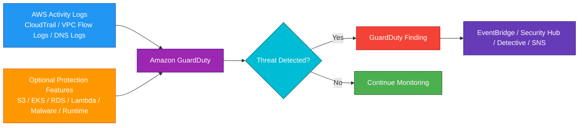
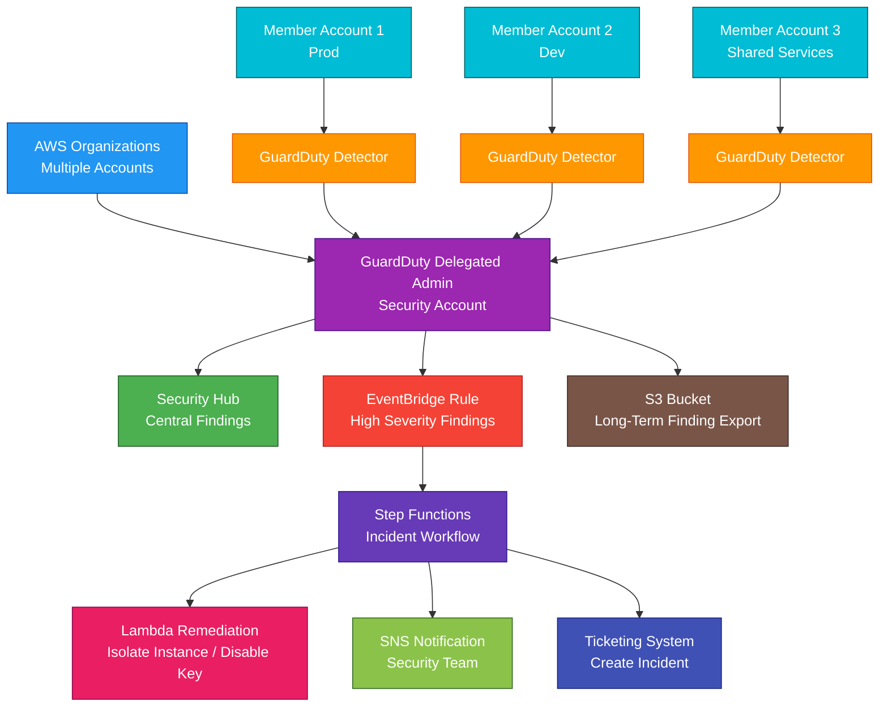

# AWS GuardDuty

## 1. Definition

### Simple Definition

Amazon GuardDuty is a managed threat detection service.

It continuously monitors AWS accounts, workloads, and activity logs to detect suspicious or malicious behavior.

### Memory Hook

GuardDuty = AWS threat detective.

### Basic Idea

GuardDuty analyzes AWS activity and security signals.

If it detects suspicious behavior, it creates a security finding.

### Key Point

GuardDuty is a detective security service.

It detects threats and creates findings.

It does not automatically block attacks unless you build automated response actions using other services.

## 2. What Problem Does It Solve?

### Main Problem

GuardDuty solves the problem of detecting suspicious activity across AWS without manually collecting and analyzing many security logs yourself.

### Without GuardDuty

You may need to manually analyze:

- CloudTrail events
- VPC Flow Logs
- DNS query logs
- S3 data events
- EKS audit logs
- RDS login activity
- Lambda network activity
- Malware scan results
- Runtime behavior signals

### With GuardDuty

AWS analyzes security signals using threat intelligence, anomaly detection, and machine learning.

### Key Benefit

GuardDuty helps detect threats quickly without requiring you to build your own threat detection platform.

### Example Threats GuardDuty Can Detect

GuardDuty can help detect:

- Compromised IAM credentials
- Suspicious API calls
- EC2 instance communicating with malicious IPs
- Cryptocurrency mining behavior
- Port scanning
- Data exfiltration patterns
- S3 suspicious access
- RDS suspicious login behavior
- EKS suspicious activity
- Malware on supported resources

## 3. Core Use Cases

### Account Threat Detection

Use GuardDuty to detect suspicious AWS account activity.

Examples:

- Unusual API calls
- IAM user behavior from unusual locations
- Root credential usage patterns
- Access key used from suspicious IPs

### EC2 Threat Detection

GuardDuty can detect suspicious activity involving EC2 instances.

Examples:

- Instance communicating with known malicious IP
- Port scanning
- Cryptocurrency mining indicators
- Unusual network traffic

### S3 Threat Detection

GuardDuty S3 Protection detects suspicious access to S3 data.

Examples:

- Unusual object access
- Suspicious data retrieval patterns
- API calls from unusual locations
- Potential data exfiltration behavior

### EKS Threat Detection

GuardDuty can monitor Amazon EKS activity.

Examples:

- Suspicious Kubernetes API calls
- Possible compromised cluster activity
- Runtime behavior involving containers
- Suspicious process or network activity where runtime monitoring is enabled

### RDS Login Threat Detection

GuardDuty RDS Protection detects suspicious database login behavior for supported engines.

Examples:

- Brute-force login attempts
- Login from unusual source
- Suspicious or anomalous database access

### Lambda Threat Detection

GuardDuty Lambda Protection monitors Lambda network activity.

Examples:

- Lambda function communicating with suspicious destinations
- Possible compromised function behavior
- Unusual outbound network patterns

### Malware Detection

GuardDuty Malware Protection can help detect malware in supported workloads and storage.

Examples:

- Scan EBS volumes attached to EC2 workloads
- Scan newly uploaded S3 objects when configured
- Generate findings when malware is detected

### Centralized Security Monitoring

Use GuardDuty with AWS Organizations to monitor multiple AWS accounts from a delegated administrator account.

## 4. Important Features for SAA

### Detector

A GuardDuty detector is the regional GuardDuty resource that enables threat detection in an account.

Important exam point:

GuardDuty is enabled per account and per Region.

### Foundational Data Sources

When GuardDuty is enabled, it automatically analyzes foundational data sources.

These include:

- AWS CloudTrail management events
- VPC Flow Logs
- DNS logs

### No Manual Log Enablement for Foundational Sources

For foundational monitoring, you do not need to manually enable CloudTrail, VPC Flow Logs, or DNS logs for GuardDuty to analyze them.

GuardDuty uses its own managed access to these data sources.

### Threat Intelligence

GuardDuty uses threat intelligence to detect known bad activity.

Examples:

- Known malicious IP addresses
- Known malicious domains
- Known malware indicators
- Suspicious file hashes

### Machine Learning and Anomaly Detection

GuardDuty can learn normal behavior and detect unusual activity.

Example:

An IAM role is suddenly used from a country or IP range that is unusual for the account.

### Finding

A finding is a security alert generated by GuardDuty.

A finding includes:

- Finding type
- Severity
- Resource affected
- Account ID
- Region
- Time detected
- Description
- Recommended remediation context

### Finding Severity

GuardDuty findings have severity levels.

| Severity | Meaning |
|---|---|
| Low | Suspicious but lower urgency |
| Medium | Potential threat requiring investigation |
| High | Serious threat requiring quick response |

### Finding Types

Finding types describe the threat pattern.

Examples:

- Unauthorized access
- Reconnaissance
- Cryptocurrency mining
- Trojan activity
- Data exfiltration
- Policy abuse
- Runtime compromise
- Malware detection

### S3 Protection

S3 Protection analyzes S3-related activity such as CloudTrail S3 data events.

Use it to detect suspicious access to S3 buckets and objects.

### EKS Protection

EKS Protection analyzes Kubernetes audit activity for Amazon EKS clusters.

Use it to detect suspicious Kubernetes control plane behavior.

### Runtime Monitoring

Runtime Monitoring observes behavior inside supported workloads.

It can analyze signals such as:

- Process execution
- File activity
- Network connections
- Runtime events

Important point:

Runtime Monitoring may require a GuardDuty security agent depending on workload type.

### Malware Protection for EC2

Malware Protection for EC2 can scan Amazon EBS volumes associated with EC2 workloads.

Use it to detect malware without manually installing and managing traditional antivirus on every instance.

### Malware Protection for S3

Malware Protection for S3 can scan newly uploaded S3 objects when configured.

Use it when uploaded objects need malware scanning before further processing.

### RDS Protection

RDS Protection analyzes database login activity for supported Amazon Aurora and Amazon RDS engines.

Use it to detect suspicious or anomalous login behavior.

### Lambda Protection

Lambda Protection monitors network activity for Lambda functions.

Use it to detect suspicious network behavior from serverless workloads.

### Multi-Account Management

GuardDuty integrates with AWS Organizations.

Use a delegated administrator account to manage GuardDuty across member accounts.

### EventBridge Integration

GuardDuty findings are sent to Amazon EventBridge.

Use EventBridge rules to trigger automated responses.

Examples:

- Send SNS notification
- Invoke Lambda remediation
- Create ticket
- Start Step Functions workflow

### Security Hub Integration

GuardDuty findings can be sent to AWS Security Hub.

Security Hub provides a centralized view of security findings from multiple AWS services and partner tools.

### Detective Integration

Amazon Detective helps investigate GuardDuty findings.

Use Detective to analyze relationships between users, resources, IP addresses, and events.

### Suppression Rules

Suppression rules automatically archive findings that match specific criteria.

Use them carefully to reduce noise from known acceptable behavior.

### Trusted IP Lists

Trusted IP lists identify IP addresses that should not generate certain findings.

Example:

A company-approved vulnerability scanner.

### Threat Lists

Threat lists contain known suspicious IP addresses that you want GuardDuty to monitor.

Use them to add custom threat intelligence.

## 5. Security Model

### IAM Permissions

IAM controls who can enable, manage, and view GuardDuty.

Common permissions:

| Permission | Purpose |
|---|---|
| `guardduty:CreateDetector` | Enable GuardDuty detector |
| `guardduty:GetDetector` | View detector configuration |
| `guardduty:ListFindings` | List GuardDuty findings |
| `guardduty:GetFindings` | View finding details |
| `guardduty:UpdateDetector` | Modify detector settings |
| `guardduty:ArchiveFindings` | Archive findings |
| `guardduty:CreateMembers` | Add member accounts |
| `guardduty:CreatePublishingDestination` | Export findings |

### Service-Linked Role

GuardDuty uses service-linked roles to access required data sources and perform detection tasks.

Important point:

Do not delete GuardDuty service-linked roles unless GuardDuty is disabled and you understand the impact.

### Data Access

GuardDuty analyzes security metadata and logs.

For foundational monitoring, it does not require you to manually manage log collection pipelines.

### Encryption at Rest

GuardDuty findings and related service data are protected by AWS-managed encryption.

If exporting findings to S3, configure S3 encryption as needed.

### Encryption in Transit

GuardDuty API calls use HTTPS.

Findings delivered to other AWS services use AWS-managed secure service integrations.

### Finding Export Security

When exporting GuardDuty findings, secure the destination.

Examples:

- Encrypt S3 bucket
- Restrict bucket policy
- Use least privilege IAM
- Enable S3 Block Public Access
- Protect KMS keys

### Least Privilege

Security teams should have permissions to view and manage findings.

Application teams may only need read access to findings related to their accounts or resources.

### Multi-Account Security

Use AWS Organizations delegated administrator for centralized GuardDuty management.

This helps ensure GuardDuty is enabled consistently across accounts.

### Automated Response Security

If using Lambda or Step Functions for remediation, keep permissions limited.

Example:

A remediation Lambda that isolates EC2 instances should not have broad administrator permissions.

### Shared Responsibility

AWS is responsible for:

- GuardDuty managed infrastructure
- Threat detection engine
- Service availability
- Threat intelligence integration
- Managed analysis of supported data sources
- Physical security

You are responsible for:

- Enabling GuardDuty in needed accounts and Regions
- Enabling optional protection features
- Reviewing findings
- Responding to threats
- Configuring multi-account management
- Securing exported findings
- Managing IAM access
- Creating automated remediation safely

## 6. High Availability / Durability Behavior

### Availability

GuardDuty is a managed regional service.

AWS manages the infrastructure for availability and scaling.

### Regional Behavior

GuardDuty is enabled per Region.

Important exam point:

If GuardDuty is enabled only in one Region, it does not automatically monitor every other Region.

### Multi-Region Monitoring

For broad coverage, enable GuardDuty in all active Regions.

In AWS Organizations, use delegated administration to manage GuardDuty across accounts and Regions.

### Multi-AZ Behavior

GuardDuty is managed by AWS across regional infrastructure.

You do not configure Multi-AZ manually.

### Finding Delivery

GuardDuty findings can be viewed in the GuardDuty console and sent to services such as:

- EventBridge
- Security Hub
- S3 export destination
- Detective

### Durability of Findings

GuardDuty stores findings for a limited period in the service.

For long-term retention or compliance, export findings to S3 or send them to a central logging/security system.

### Fault Tolerance

GuardDuty itself is managed, but your response workflows should be fault tolerant.

Example:

Use EventBridge with SQS DLQ or Step Functions error handling for automated remediation.

### Multi-Account Behavior

A delegated administrator can centrally view and manage GuardDuty findings for member accounts.

This improves security visibility across the organization.

### Important Exam Point

GuardDuty detects threats, but it does not automatically make workloads highly available or automatically remediate every issue.

You must design response and recovery processes.

## 7. Cost Optimization Options

### Understand Pricing Drivers

GuardDuty cost depends on analyzed data and enabled protection features.

Common cost drivers include:

- CloudTrail management event analysis
- VPC Flow Log and DNS log analysis
- S3 data event analysis
- EKS audit log analysis
- RDS login activity analysis
- Lambda network activity analysis
- Malware scanning
- Runtime monitoring

### Use Free Trial for Estimation

GuardDuty commonly provides a free trial period when first enabled in an account and Region.

Use the trial to estimate monthly cost before full rollout.

### Enable Needed Protection Features

Foundational GuardDuty monitoring is very valuable.

Optional protections add coverage but may also add cost.

Enable optional features based on workload risk and compliance needs.

### Monitor Usage

Use GuardDuty usage estimates and AWS billing tools to monitor cost.

Helpful tools:

- GuardDuty usage page
- AWS Cost Explorer
- AWS Budgets
- Cost allocation tags where applicable

### Multi-Account Cost Visibility

In AWS Organizations, monitor GuardDuty usage across accounts.

This helps identify accounts or Regions with high activity.

### Avoid Unused Regions

If your organization does not use certain Regions, consider disabling unused Regions at the organization level with SCPs.

This can reduce security risk and unnecessary monitoring scope.

### Tune Suppression Rules Carefully

Suppression rules can reduce alert noise.

However, do not suppress real threats just to reduce investigation workload.

### Use Automated Response for High-Value Findings

Automation can reduce operational cost.

Examples:

- Notify security team
- Isolate suspicious instance
- Disable compromised access key
- Create incident ticket

### Export Findings Wisely

If exporting findings to S3 or SIEM tools, manage storage and ingestion costs.

Use lifecycle policies for S3 archives.

### Avoid Duplicate Tooling Where Possible

GuardDuty, Security Hub, Detective, and SIEM tools can work together.

Avoid unnecessary duplicate alert pipelines that create cost and noise without improving detection.

## 8. Common Exam Traps

### GuardDuty Is Detective, Not Preventive

GuardDuty detects threats and creates findings.

It does not act as a firewall.

If the exam asks to block web attacks, think AWS WAF.

If the exam asks to block network traffic, think Security Groups, NACLs, or Network Firewall.

### GuardDuty Does Not Replace CloudTrail

CloudTrail records API activity.

GuardDuty analyzes activity to detect threats.

They are complementary.

### GuardDuty Does Not Replace Security Hub

GuardDuty detects threats.

Security Hub aggregates and prioritizes security findings from multiple sources.

### GuardDuty Does Not Replace Detective

GuardDuty creates findings.

Detective helps investigate findings.

### GuardDuty Does Not Replace Inspector

GuardDuty detects active or suspicious threats.

Inspector scans workloads for vulnerabilities and exposure.

### GuardDuty Does Not Require Agents for Foundational Detection

Foundational GuardDuty detection does not require agents.

However, Runtime Monitoring may require a security agent.

### GuardDuty Is Regional

You must enable GuardDuty in each Region where monitoring is needed.

### Optional Protections May Need Separate Enablement

Some protections are not automatically enabled just because foundational GuardDuty is enabled.

Examples:

- S3 Protection
- EKS Protection
- RDS Protection
- Lambda Protection
- Runtime Monitoring
- Malware Protection

### Findings Need Investigation

A finding is not always proof of compromise.

It is a signal that should be investigated.

### Suppression Rules Can Hide Important Alerts

Use suppression rules carefully.

Bad suppression rules can hide real attacks.

### Trusted IP Lists Are Not Block Lists

Trusted IP lists reduce findings from known trusted sources.

They do not block traffic.

### Threat Lists Are Detection Inputs

Threat lists help GuardDuty detect activity involving specific suspicious IPs.

They do not directly block traffic.

### GuardDuty Does Not Patch Vulnerabilities

If the question asks for vulnerability management, think Amazon Inspector.

If the question asks for threat detection, think GuardDuty.

## 9. Compare With Similar Services

### Service Comparison Table

| Service | Main Purpose | Best For | Choose When |
|---|---|---|---|
| GuardDuty | Threat detection | Detect suspicious activity and compromised resources | You need managed threat detection |
| Security Hub | Security findings aggregation | Central security posture and findings | You need one place for security findings |
| Detective | Security investigation | Investigating GuardDuty findings | You need root-cause analysis and relationship graphs |
| Inspector | Vulnerability management | Finding software vulnerabilities and exposure | You need vulnerability scanning |
| Macie | Sensitive data discovery | Finding sensitive data in S3 | You need to discover PII or sensitive data |
| WAF | Web application firewall | Blocking Layer 7 web attacks | You need to block SQL injection, XSS, bots |
| Network Firewall | VPC network firewall | Filtering VPC network traffic | You need managed network traffic inspection |

### GuardDuty vs Security Hub

| Feature | GuardDuty | Security Hub |
|---|---|---|
| Main purpose | Threat detection | Findings aggregation and posture management |
| Creates threat findings | Yes | Aggregates findings |
| Compliance checks | Limited | Stronger focus |
| Best for | Detect suspicious activity | Centralize security visibility |

### GuardDuty vs Detective

| Feature | GuardDuty | Detective |
|---|---|---|
| Main purpose | Detect threats | Investigate threats |
| Output | Findings | Investigation graphs and context |
| Best for | Alerting on suspicious activity | Understanding what happened |
| Common use together | GuardDuty finding starts investigation | Detective analyzes the finding |

### GuardDuty vs Inspector

| Feature | GuardDuty | Inspector |
|---|---|---|
| Main purpose | Threat detection | Vulnerability scanning |
| Detects active suspicious behavior | Yes | No, not its main purpose |
| Finds CVEs/exposures | No | Yes |
| Best for | Compromise and attack detection | Vulnerability management |

### GuardDuty vs Macie

| Feature | GuardDuty | Macie |
|---|---|---|
| Main purpose | Threat detection | Sensitive data discovery |
| Focus | Suspicious activity | Sensitive data in S3 |
| Example | S3 data exfiltration pattern | S3 bucket contains PII |
| Best for | Detecting threats | Finding and classifying sensitive data |

### GuardDuty vs WAF

| Feature | GuardDuty | AWS WAF |
|---|---|---|
| Main purpose | Detect threats | Block/filter web requests |
| Action type | Detective | Preventive/protective |
| Layer | Security analytics | Layer 7 HTTP/HTTPS |
| Best for | Suspicious AWS activity | SQL injection, XSS, bot filtering |

### GuardDuty vs Network Firewall

| Feature | GuardDuty | Network Firewall |
|---|---|---|
| Main purpose | Detect threats | Enforce network traffic rules |
| Blocks traffic | No | Yes |
| Analyzes behavior | Yes | Rule-based inspection |
| Best for | Threat findings | VPC network filtering |

### When to Choose GuardDuty

Choose GuardDuty when:

- You need managed threat detection
- You need to detect compromised IAM credentials
- You need to detect suspicious EC2 network activity
- You need S3 access threat detection
- You need EKS, RDS, Lambda, malware, or runtime threat detection
- You need findings sent to EventBridge or Security Hub
- You need centralized multi-account threat monitoring
- You do not want to build your own security log analysis system

## 10. Mini Architecture Example

### Scenario

A company has multiple AWS accounts under AWS Organizations.

The security team wants centralized threat detection and automated response for high-severity findings.

### Architecture

Enable GuardDuty across all accounts and Regions.

Use a delegated administrator account for centralized management.

Send findings to Security Hub for central visibility.

Use EventBridge to trigger automated response workflows for high-severity findings.

### Why This Is Good

- GuardDuty detects suspicious activity across accounts
- Delegated administrator centralizes management
- Security Hub centralizes findings
- EventBridge enables automated response
- Step Functions coordinates incident workflow
- Lambda can perform safe remediation actions
- SNS notifies the security team
- S3 export supports long-term retention and audit
- Multi-account setup improves organization-wide visibility

### Exam Answer Pattern

If the question says:

“Detect suspicious activity, compromised credentials, or malicious behavior in AWS accounts.”

Think:

Amazon GuardDuty.

If the question says:

“Aggregate security findings from many AWS services.”

Think:

AWS Security Hub.

If the question says:

“Investigate the root cause of GuardDuty findings.”

Think:

Amazon Detective.

If the question says:

“Scan EC2 instances, containers, or Lambda functions for vulnerabilities.”

Think:

Amazon Inspector.

### Final Memory Hook

GuardDuty = Threat detection.

Security Hub = Security findings center.

Detective = Investigate findings.

Inspector = Vulnerability scanning.

Macie = Sensitive data discovery.

WAF = Block web attacks.

Network Firewall = Filter VPC traffic.

EventBridge = Automate response.

Foundational sources = CloudTrail, VPC Flow Logs, DNS logs.

Finding = GuardDuty security alert.

GuardDuty is detective, not preventive.

