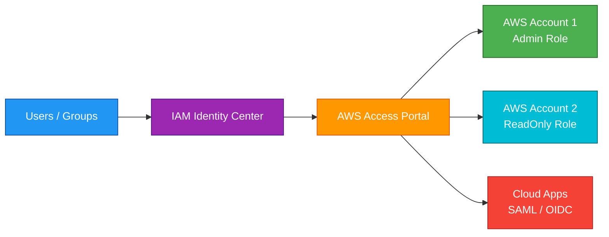
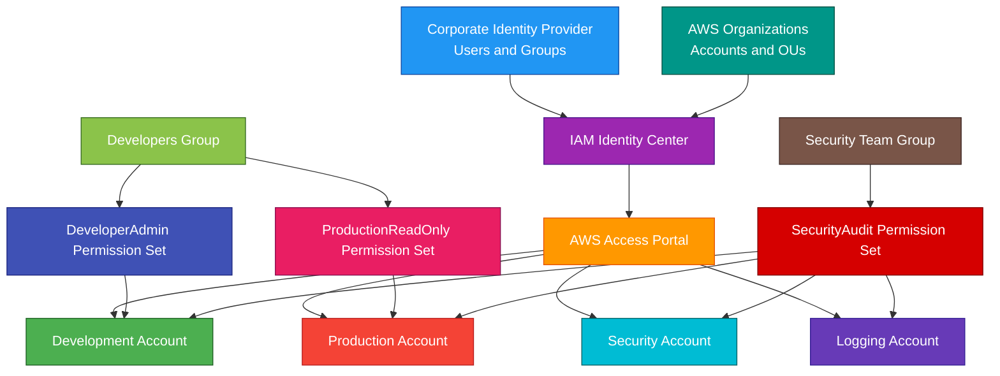

# IAM Identity Center

## 1. Definition

### Simple Definition

IAM Identity Center is an AWS service that centrally manages workforce access to multiple AWS accounts and cloud applications.

It was formerly called AWS Single Sign-On, or AWS SSO.

### Memory Hook

IAM Identity Center = Central login portal for AWS accounts and apps.

### Basic Idea

Users sign in once through IAM Identity Center.

Then they can access assigned AWS accounts, permission sets, and applications from one place.

### Key Point

IAM Identity Center is mainly for human workforce access.

It helps users access multiple AWS accounts without creating separate IAM users in every account.

## 2. What Problem Does It Solve?

### Main Problem

IAM Identity Center solves the problem of managing user access across many AWS accounts and applications.

Without it, you may need to create and manage users separately in each AWS account.

### Without IAM Identity Center

You may have problems such as:

- Too many IAM users across accounts
- Hard-to-manage passwords
- Difficult offboarding
- Inconsistent permissions
- No central access portal
- More long-term credential risk
- Complicated multi-account access management

### With IAM Identity Center

You centrally manage users, groups, account assignments, and permission sets.

Users sign in once and access only what they are assigned.

### Key Benefit

IAM Identity Center simplifies and centralizes workforce access to AWS accounts and applications.

## 3. Core Use Cases

### Multi-Account AWS Access

Use IAM Identity Center to give users access to multiple AWS accounts in AWS Organizations.

Example:

A developer gets access to:

- Development account
- Testing account
- Read-only production account

### Centralized Workforce Login

Users access AWS accounts through a central AWS access portal.

This avoids separate usernames and passwords in each AWS account.

### Group-Based Access

Assign permissions to groups instead of individual users.

Example:

- Developers group
- Security team group
- Finance group
- Read-only auditors group

### Temporary AWS Credentials

Users can get temporary credentials for the AWS CLI or SDKs from IAM Identity Center.

This is safer than long-term IAM access keys.

### Application Single Sign-On

IAM Identity Center can provide SSO access to supported cloud applications.

Examples:

- Business applications
- SAML applications
- Custom applications
- AWS managed applications

### External Identity Provider Integration

IAM Identity Center can connect to an external identity provider.

Examples:

- Microsoft Entra ID
- Okta
- Google Workspace
- Ping Identity
- Other SAML 2.0 identity providers

### AWS Organizations Integration

IAM Identity Center works well with AWS Organizations to manage access across member accounts.

## 4. Important Features for SAA

### AWS Access Portal

The AWS access portal is the web page where users sign in.

After sign-in, users see assigned AWS accounts and applications.

### Identity Source

The identity source is where users and groups come from.

Common identity sources:

| Identity Source | Description |
|---|---|
| Identity Center directory | Built-in user and group store |
| External identity provider | SAML 2.0 provider like Okta or Entra ID |
| Active Directory | Microsoft AD-based identities |

### Identity Center Directory

The Identity Center directory is the built-in user directory.

Use it when you do not already have an external identity provider.

### External Identity Provider

An external identity provider lets you use existing company identities.

Common benefit:

Users can sign in using corporate credentials instead of separate AWS credentials.

### Active Directory Integration

IAM Identity Center can connect to Microsoft Active Directory options.

Common choices:

- AWS Managed Microsoft AD
- AD Connector
- Self-managed AD integration patterns

### Permission Set

A permission set defines what level of access users get in AWS accounts.

Think of a permission set as a reusable access template.

Examples:

- AdministratorAccess
- PowerUserAccess
- ReadOnlyAccess
- BillingAccess
- DeveloperAccess

### Account Assignment

An account assignment connects:

- User or group
- AWS account
- Permission set

Example:

The `Developers` group gets `PowerUserAccess` in the development account.

### Permission Set Provisioning

When you assign a permission set to an account, IAM Identity Center creates IAM roles in that target AWS account.

Users assume those roles when accessing the account.

### IAM Role Behind the Scenes

IAM Identity Center uses IAM roles behind the scenes.

Important exam point:

Users do not need separate IAM users in every account.

### Temporary Credentials

IAM Identity Center provides temporary credentials for:

- AWS Management Console
- AWS CLI
- AWS SDKs

Temporary credentials are safer than permanent access keys.

### AWS CLI Access

Users can configure AWS CLI access using IAM Identity Center.

This allows CLI access without long-term IAM access keys.

### Attribute-Based Access Control

IAM Identity Center can support attribute-based access control, or ABAC.

ABAC uses user attributes to make access decisions.

Example attributes:

- Department
- Cost center
- Job role
- Project

### MFA

IAM Identity Center supports multi-factor authentication.

MFA improves sign-in security for workforce users.

### Session Duration

Permission sets can define session duration.

Example:

Admin sessions last 1 hour, while read-only sessions last 8 hours.

### Application Assignments

IAM Identity Center can assign users and groups access to applications.

Common app standards:

- SAML 2.0
- OIDC, depending on application support

### AWS Managed Applications

Some AWS services integrate with IAM Identity Center for user access.

Examples:

- Amazon Q Business
- Amazon SageMaker Studio
- AWS IAM Identity Center-enabled apps

### Delegated Administration

IAM Identity Center can work with delegated administration patterns for management outside the AWS Organizations management account.

This reduces the need to use the management account for daily access administration.

## 5. Security Model

### IAM Permissions

IAM controls who can manage IAM Identity Center resources.

Common permissions:

| Permission | Purpose |
|---|---|
| `sso:CreatePermissionSet` | Create permission set |
| `sso:PutInlinePolicyToPermissionSet` | Add inline policy to permission set |
| `sso:CreateAccountAssignment` | Assign access to an account |
| `sso:DeleteAccountAssignment` | Remove account assignment |
| `sso:ListPermissionSets` | List permission sets |
| `sso:DescribePermissionSet` | View permission set details |

### Least Privilege

Give users only the permissions they need.

Good pattern:

- Developers get admin-like access only in dev accounts
- Developers get read-only access in production
- Security team gets audit access across accounts
- Billing team gets billing permissions only

### Group-Based Access Control

Use groups instead of assigning permissions directly to individual users.

This makes access easier to manage and audit.

### MFA Protection

Enable MFA for workforce users.

MFA reduces risk if a password is stolen.

### Temporary Credentials

IAM Identity Center gives temporary access credentials.

This reduces risk compared with long-term IAM access keys.

### No Long-Term IAM Users

Best practice:

Avoid creating IAM users for human access when IAM Identity Center can be used.

Use IAM users only for specific legacy or special cases.

### External Identity Provider Security

If using an external identity provider, security depends on proper identity provider configuration.

Important controls:

- MFA
- Conditional access
- User lifecycle management
- Group synchronization
- Strong password policies
- Offboarding automation

### Permission Sets and IAM Policies

Permission sets can use:

- AWS managed policies
- Customer managed policies
- Inline policies
- Permission boundaries in some designs

### Account Isolation

IAM Identity Center grants access to roles in specific AWS accounts.

Users only see accounts and roles assigned to them.

### CloudTrail Auditing

IAM Identity Center and related role assumption activity can be audited with CloudTrail.

Use CloudTrail to track:

- Permission set changes
- Account assignments
- Role assumptions
- Administrative changes

### Shared Responsibility

AWS is responsible for:

- IAM Identity Center managed service infrastructure
- Access portal availability
- Integration with AWS Organizations
- Managed authentication service components
- Physical security

You are responsible for:

- User and group assignments
- Permission set design
- MFA configuration
- External IdP configuration
- Least privilege access
- CloudTrail monitoring
- Offboarding users
- Reviewing access regularly

## 6. High Availability / Durability Behavior

### Availability

IAM Identity Center is a managed AWS service.

AWS manages the service infrastructure and availability.

### Regional Configuration

IAM Identity Center is enabled in a specific AWS Region.

However, it can provide access to AWS accounts across AWS Organizations.

### Multi-Account Behavior

IAM Identity Center is commonly used with AWS Organizations.

This allows centralized access management across many AWS accounts.

### Account Access Resilience

Users access AWS accounts through permission sets and generated IAM roles.

If a user is removed from a group or assignment, their future access can be removed centrally.

### Temporary Session Behavior

Users receive temporary sessions.

When a session expires, the user must authenticate again.

### Multi-Region Workloads

IAM Identity Center is not used to make applications Multi-Region.

It manages workforce access.

Application high availability still depends on services like:

- Multi-AZ
- Route 53
- Global Accelerator
- CloudFront
- Multi-Region deployments

### Durability

IAM Identity Center stores access configuration as a managed AWS service.

For operational safety, document and automate important access patterns where possible.

Examples:

- Permission set definitions
- Group assignments
- Account assignment strategy
- Infrastructure as Code where supported

### External IdP Dependency

If using an external identity provider, user sign-in depends on that provider being available and properly configured.

### Important Exam Point

IAM Identity Center centralizes access management, but it does not replace IAM policies, SCPs, or application-level authorization.

## 7. Cost Optimization Options

### Reduce IAM User Management Overhead

IAM Identity Center reduces the operational cost of managing separate IAM users across many accounts.

### Use Group Assignments

Assign access to groups instead of individual users.

This reduces manual access management work.

### Use Permission Sets Repeatedly

Create reusable permission sets.

Examples:

- ReadOnly
- Developer
- Admin
- SecurityAudit
- Billing

This avoids maintaining many duplicate policies.

### Improve Offboarding

Centralized offboarding reduces risk and administrative time.

Remove a user from the identity source or group, and access can be removed centrally.

### Avoid Over-Permissioned Access

Least privilege reduces the risk and cost of accidental changes.

Example:

Do not give production administrator access to users who only need read-only troubleshooting access.

### Use Temporary Credentials

Temporary credentials reduce the risk and cleanup cost of leaked long-term access keys.

### Avoid Duplicate Identity Systems

Integrate with an existing corporate identity provider when appropriate.

This can reduce duplicate user lifecycle management.

### Review Access Regularly

Regular access reviews help remove unused or unnecessary permissions.

This reduces risk and operational cost.

### Use AWS Organizations

Using IAM Identity Center with AWS Organizations simplifies account-wide access management.

This is more efficient than configuring access separately in every account.

### Avoid Management Account Overuse

Use permission sets to access member accounts directly.

Avoid using the AWS Organizations management account for everyday work.

## 8. Common Exam Traps

### IAM Identity Center vs IAM

IAM controls AWS identities, roles, and permissions inside AWS accounts.

IAM Identity Center centrally manages workforce access across accounts and applications.

### IAM Identity Center Is Not AWS Organizations

AWS Organizations manages accounts, OUs, SCPs, and billing.

IAM Identity Center manages user access to those accounts.

They commonly work together.

### Permission Sets Do Not Replace SCPs

Permission sets grant access through IAM roles.

SCPs set maximum permission guardrails for accounts.

Both can affect what a user can do.

### SCPs Can Still Block Actions

Even if a permission set allows an action, an SCP can deny it.

Exam memory:

Permission set allows access, SCP limits maximum access.

### Do Not Create IAM Users in Every Account

For workforce access across many accounts, use IAM Identity Center.

Creating IAM users in every account is harder to manage and less secure.

### IAM Identity Center Uses Temporary Credentials

Users get temporary role credentials.

This is safer than long-term access keys.

### External IdP Is Optional

You can use the built-in Identity Center directory or connect an external identity provider.

### Account Assignment Requires Three Parts

An account assignment needs:

- User or group
- AWS account
- Permission set

### Permission Set Creates Roles in Accounts

IAM Identity Center provisions IAM roles into assigned AWS accounts.

Users assume those roles when they access the account.

### IAM Identity Center Is for Workforce Access

For application-to-application AWS access, use IAM roles, service roles, and resource policies.

For customer sign-up/sign-in to apps, use Amazon Cognito.

### Cognito Is Different

Cognito is for application users.

IAM Identity Center is for workforce users accessing AWS accounts and business apps.

### Management Account Should Be Protected

IAM Identity Center often integrates with AWS Organizations.

Do not use the management account for normal workloads.

## 9. Compare With Similar Services

### Service Comparison Table

| Service | Main Purpose | Best For | Choose When |
|---|---|---|---|
| IAM Identity Center | Workforce SSO and multi-account access | Central access to AWS accounts and apps | Employees need access to many AWS accounts |
| IAM | AWS identity and permissions | Roles, policies, users, service access | You need to control AWS API permissions |
| AWS Organizations | Multi-account governance | OUs, SCPs, consolidated billing | You need to manage many AWS accounts |
| Amazon Cognito | App user identity | Web/mobile user sign-up and sign-in | Customers need to log in to your application |
| AWS Directory Service | Managed Microsoft AD and directories | AD integration | You need Microsoft AD in AWS |
| STS | Temporary security credentials | Role assumption and federation | You need temporary AWS credentials |

### IAM Identity Center vs IAM

| Feature | IAM Identity Center | IAM |
|---|---|---|
| Main purpose | Workforce SSO | AWS permissions and identities |
| Scope | Multi-account access portal | Account-level access control |
| Human users | Centralized | Possible but not preferred at scale |
| Temporary credentials | Yes | STS roles can provide temporary credentials |
| Best for | Employees accessing many accounts | Roles, policies, service permissions |

### IAM Identity Center vs AWS Organizations

| Feature | IAM Identity Center | AWS Organizations |
|---|---|---|
| Main purpose | User access | Account management |
| Manages users/groups | Yes | No |
| Manages accounts/OUs | No | Yes |
| SCPs | No | Yes |
| Common use together | Assign users to accounts | Organize and govern accounts |

### IAM Identity Center vs Cognito

| Feature | IAM Identity Center | Amazon Cognito |
|---|---|---|
| User type | Workforce users | Application customers/users |
| Common users | Employees, contractors, admins | Web/mobile app users |
| Access target | AWS accounts and business apps | Your application |
| Example | Developer accesses AWS dev account | Customer logs in to shopping app |

### IAM Identity Center vs STS

| Feature | IAM Identity Center | AWS STS |
|---|---|---|
| Main purpose | SSO access management | Temporary credential service |
| User portal | Yes | No |
| Role credentials | Uses temporary credentials | Issues temporary credentials |
| Best for | Workforce access experience | Programmatic role assumption |

### IAM Identity Center vs Directory Service

| Feature | IAM Identity Center | AWS Directory Service |
|---|---|---|
| Main purpose | Access portal and account assignments | Managed directory services |
| Active Directory | Can integrate with AD | Provides or connects AD |
| Best for | Assign access to AWS accounts/apps | Run or connect Microsoft AD |

### When to Choose IAM Identity Center

Choose IAM Identity Center when:

- Employees need access to multiple AWS accounts
- You need centralized workforce SSO
- You want to avoid IAM users in every account
- You need group-based account assignments
- You need temporary AWS CLI credentials for users
- You use AWS Organizations
- You want to integrate with an external identity provider
- You need centralized access to AWS accounts and cloud applications

## 10. Mini Architecture Example

### Scenario

A company has separate AWS accounts for production, development, security, and logging.

Developers need admin access in development but only read-only access in production.

The security team needs audit access across all accounts.

### Architecture

Use AWS Organizations to manage accounts.

Use IAM Identity Center for workforce access.

Connect IAM Identity Center to the company identity provider.

Create permission sets and assign them to groups.

### Why This Is Good

- Users sign in through one access portal
- Corporate identity provider remains the source of users and groups
- Developers get strong access in development only
- Production access is limited to read-only
- Security team gets audit access across accounts
- No need to create IAM users in every account
- Temporary credentials reduce long-term key risk
- AWS Organizations provides the multi-account foundation
- Permission sets make access reusable and consistent

### Exam Answer Pattern

If the question says:

“Centrally manage workforce access to multiple AWS accounts using single sign-on.”

Think:

IAM Identity Center.

If the question says:

“Create guardrails that limit what member accounts can do.”

Think:

AWS Organizations SCPs.

If the question says:

“Authenticate customers for a web or mobile application.”

Think:

Amazon Cognito.

If the question says:

“Grant an AWS service permission to access another AWS service.”

Think:

IAM role.

### Final Memory Hook

IAM Identity Center = Workforce SSO.

AWS Organizations = Multi-account management.

IAM = Roles and permissions.

Permission set = Reusable access template.

Account assignment = User/group + account + permission set.

Access portal = User login page.

Temporary credentials = Safer than access keys.

External IdP = Corporate login source.

Cognito = App users.

SCP = Account guardrail.

