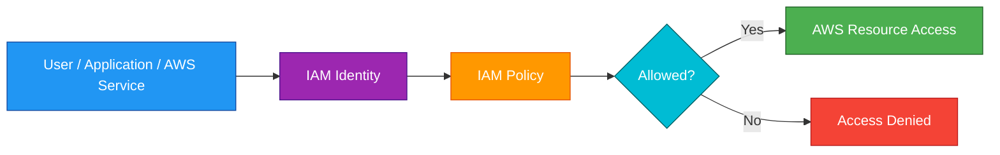
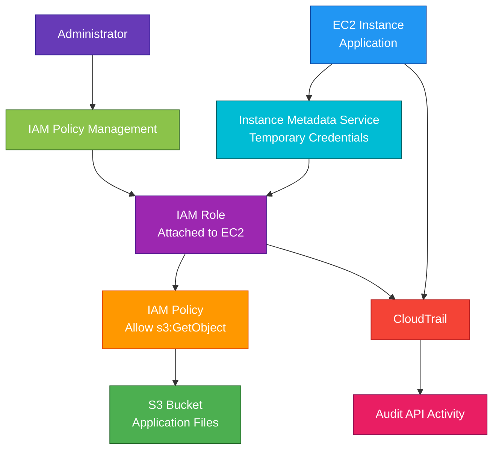

# IAM

<details>
<summary>

## 1. Definition

</summary>

### Simple Definition

AWS IAM, or Identity and Access Management, is the AWS service used to control who can access AWS resources and what actions they can perform.

It helps manage permissions for users, groups, roles, applications, and AWS services.

### Memory Hook

IAM = Identity + Access + Management.

### Basic Idea

IAM answers two main questions:

| Question | IAM Concept |
|---|---|
| Who are you? | Authentication |
| What are you allowed to do? | Authorization |



### What IAM Controls

IAM controls access to AWS services and resources using:

- Users
- Groups
- Roles
- Policies
- Permissions
- MFA
- Access keys
- Federation
- Temporary credentials

</details>

<details>
<summary>

## 2. What Problem Does It Solve?

</summary>

### Main Problem

IAM solves the problem of securely controlling access to AWS resources.

Without IAM, every person, application, or service could have too much access, which is dangerous.

### Without IAM

You may not be able to safely control:

- Who can access AWS
- Which services users can use
- Which actions are allowed
- Which resources can be modified
- Which applications can call AWS APIs
- Whether access is temporary or long-term

### With IAM

You can give each user, application, and service only the permissions they need.

### Key Benefit

IAM helps enforce least privilege access across your AWS account.

### Least Privilege

Least privilege means giving only the minimum permissions required to complete a task.

Example:

If an application only needs to read from one S3 bucket, do not give it full S3 admin access.

</details>

<details>
<summary>

## 3. Core Use Cases

</summary>

### Human Access to AWS

Use IAM or IAM Identity Center to control human access to the AWS Management Console and AWS CLI.

Examples:

- Developer access
- Admin access
- Read-only auditor access
- Billing access

### Application Access to AWS Services

Use IAM roles to allow applications to access AWS services securely.

Example:

An EC2 instance uses an IAM role to read files from S3.

### AWS Service-to-Service Access

Use IAM roles to allow AWS services to work with each other.

Example:

Lambda uses an execution role to write logs to CloudWatch and read from DynamoDB.

### Cross-Account Access

Use IAM roles to allow trusted users or services in one AWS account to access resources in another AWS account.

Example:

A security account assumes a role in production accounts for auditing.

### Temporary Credentials

Use IAM roles and AWS STS to provide temporary credentials instead of long-term access keys.

### Federation

Use federation to allow external identities to access AWS.

Examples:

- Corporate identity provider
- SAML
- OIDC
- IAM Identity Center

### Multi-Factor Authentication

Use MFA to add extra protection for sensitive users and actions.

Common example:

Enable MFA for the AWS root user.

</details>

<details>
<summary>

## 4. Important Features for SAA

</summary>

### IAM User

An IAM user represents a person or workload with long-term credentials.

Important points:

- Can have console password
- Can have access keys
- Can have policies attached
- Should not be used when a role is better
- Long-term credentials require careful management

### IAM Group

An IAM group is a collection of IAM users.

Use groups to assign permissions to multiple users at once.

Example:

| Group | Permission Example |
|---|---|
| Developers | Access dev resources |
| Admins | Administrator access |
| Auditors | Read-only access |

### IAM Role

An IAM role is an identity with permissions that can be assumed temporarily.

Roles are preferred for:

- AWS services
- EC2 instances
- Lambda functions
- ECS tasks
- Cross-account access
- Federation

### Memory Hook

Users are for people.

Roles are for temporary access.

Groups organize users.

Policies define permissions.

### IAM Policy

An IAM policy is a JSON document that defines permissions.

A policy includes:

- Effect
- Action
- Resource
- Condition

### Basic Policy Structure

```json
{
  "Version": "2012-10-17",
  "Statement": [
    {
      "Effect": "Allow",
      "Action": "s3:GetObject",
      "Resource": "arn:aws:s3:::example-bucket/*"
    }
  ]
}
```

### Policy Effect

The effect says whether the policy allows or denies access.

| Effect | Meaning |
|---|---|
| `Allow` | Allows the action |
| `Deny` | Denies the action |

Important exam point:

Explicit deny always wins.

### Action

The action defines which AWS API operation is allowed or denied.

Examples:

- `s3:GetObject`
- `ec2:RunInstances`
- `dynamodb:PutItem`
- `lambda:InvokeFunction`

### Resource

The resource defines which AWS resource the policy applies to.

Example:

`arn:aws:s3:::my-bucket/*`

### Condition

A condition adds extra rules to a policy.

Examples:

- Require MFA
- Allow only from a specific IP range
- Allow only in a specific Region
- Allow only with specific tags

### Identity-Based Policy

An identity-based policy is attached to an IAM user, group, or role.

It defines what that identity can do.

### Resource-Based Policy

A resource-based policy is attached to a resource.

It defines who can access that resource.

Examples:

- S3 bucket policy
- SQS queue policy
- SNS topic policy
- Lambda resource policy
- KMS key policy

### Identity-Based vs Resource-Based Policy

| Policy Type | Attached To | Example |
|---|---|---|
| Identity-based policy | User, group, role | IAM role can read S3 |
| Resource-based policy | Resource | S3 bucket allows another account |

### Managed Policy

A managed policy is a reusable policy.

Types:

| Type | Meaning |
|---|---|
| AWS managed policy | Created and managed by AWS |
| Customer managed policy | Created and managed by you |

### Inline Policy

An inline policy is embedded directly into one IAM identity.

Use it when the permission should not be reused elsewhere.

### Permissions Boundary

A permissions boundary sets the maximum permissions an IAM user or role can have.

Important exam point:

A permissions boundary does not grant permissions by itself.

It only limits the maximum allowed permissions.

### Service Control Policy

A Service Control Policy, or SCP, is used with AWS Organizations to set permission guardrails across accounts.

Important exam point:

An SCP does not grant permissions.

It only defines the maximum permissions available in an account.

### Policy Evaluation Logic

AWS evaluates permissions using multiple policy types.

General rules:

1. Default is deny.
2. Explicit allow grants access.
3. Explicit deny always wins.
4. Boundaries and SCPs can limit access.

### AWS STS

AWS Security Token Service, or STS, provides temporary security credentials.

Common use:

- Assume an IAM role
- Cross-account access
- Federation
- Temporary access for applications

### MFA

Multi-Factor Authentication adds another layer of security.

Use MFA for:

- Root user
- Admin users
- Sensitive operations
- Privileged role assumption

### Access Keys

Access keys are long-term credentials used for programmatic access.

Important best practices:

- Avoid long-term access keys when possible
- Use IAM roles instead
- Rotate access keys regularly
- Never hardcode keys in code
- Disable unused keys

### IAM Identity Center

IAM Identity Center is the recommended service for centralized workforce access to AWS accounts and applications.

It is commonly used with AWS Organizations.

### IAM Access Analyzer

IAM Access Analyzer helps identify resources that are shared externally.

It can analyze access for resources such as:

- S3 buckets
- IAM roles
- KMS keys
- Lambda functions
- SQS queues

### Credential Report

A credential report lists IAM users and credential status.

It helps identify:

- Users without MFA
- Old access keys
- Unused passwords
- Stale credentials

</details>

<details>
<summary>

## 5. Security Model

</summary>

### IAM Permissions

IAM permissions define who can do what in AWS.

Permissions are controlled using:

- Identity-based policies
- Resource-based policies
- Permission boundaries
- SCPs
- Session policies
- KMS key policies
- VPC endpoint policies

### Authentication

Authentication proves the identity of the requester.

Examples:

- Console password
- Access key and secret access key
- MFA device
- Federated login
- Temporary STS credentials

### Authorization

Authorization decides whether the authenticated identity is allowed to perform the requested action.

Example:

A user may be authenticated but still denied access to delete an S3 bucket.

### Root User Security

The root user has full access to the AWS account.

Best practices:

- Do not use root for daily work
- Enable MFA on root
- Store root credentials securely
- Do not create root access keys
- Use root only for tasks that require it

### IAM Role Security

IAM roles are safer than long-term access keys.

Use roles for:

- EC2
- Lambda
- ECS
- EKS
- Cross-account access
- Federation

### Trust Policy

A trust policy defines who can assume a role.

Example:

An EC2 service trust policy allows EC2 to assume the role.

### Permission Policy

A permission policy defines what the role can do after it is assumed.

Example:

The role can read objects from a specific S3 bucket.

### Trust Policy vs Permission Policy

| Policy | Question Answered |
|---|---|
| Trust policy | Who can assume this role? |
| Permission policy | What can this role do? |

### Encryption and IAM

IAM does not encrypt application data directly.

IAM controls who can use encryption-related services and keys.

Examples:

- Allow use of KMS keys
- Deny access to unencrypted resources
- Require encrypted S3 uploads using policy conditions

### Network and Security Controls

IAM is not a network firewall.

Use IAM together with:

- Security groups
- NACLs
- VPC endpoint policies
- Resource policies
- KMS key policies
- AWS Organizations SCPs

### Shared Responsibility

AWS is responsible for:

- IAM service infrastructure
- Secure operation of the IAM control plane
- Availability of IAM service
- Physical security

You are responsible for:

- Creating secure policies
- Enforcing least privilege
- Managing users, groups, and roles
- Enabling MFA
- Rotating credentials
- Removing unused access
- Protecting root account
- Reviewing access regularly

</details>

<details>
<summary>

## 6. High Availability / Durability Behavior

</summary>

### Global Service

IAM is a global AWS service.

IAM users, groups, roles, and policies are not created inside one specific Region.

### High Availability

AWS manages IAM as a highly available global service.

You do not configure Multi-AZ or Auto Scaling for IAM.

### Regional Impact

IAM identities are global, but they grant access to regional and global AWS services.

Example:

An IAM role can allow EC2 actions in one Region or multiple Regions depending on the policy.

### Eventual Consistency

IAM changes can take a short time to propagate.

Example:

If you create a role and immediately use it, there may be a short delay before it works everywhere.

### Durability

IAM stores identity and policy configuration as part of the AWS managed IAM service.

For SAA, focus on:

- IAM is global
- IAM is highly available
- IAM changes may have eventual consistency
- IAM does not store application data

### Multi-Account Behavior

For large environments, use AWS Organizations and IAM Identity Center to manage access across accounts.

### Disaster Recovery Consideration

IAM is not usually part of data backup and restore.

However, access recovery planning is important.

Examples:

- Protect root account
- Keep emergency admin access
- Use break-glass roles carefully
- Monitor changes to admin permissions

</details>

<details>
<summary>

## 7. Cost Optimization Options

</summary>

### IAM Has No Direct Cost

IAM itself is available at no additional charge.

You do not pay to create IAM users, groups, roles, or policies.

### Use Roles Instead of Long-Term Credentials

Using IAM roles reduces operational cost and security risk.

It avoids manual key rotation and secret management work.

### Avoid Over-Permissioned Access

Over-permissioned users can accidentally create expensive resources.

Use least privilege to reduce accidental cost risk.

### Use SCPs for Guardrails

SCPs can prevent expensive or risky actions across accounts.

Examples:

- Deny expensive Regions
- Deny large instance types
- Deny disabling CloudTrail
- Deny deleting backup vaults

### Use Permission Boundaries for Delegation

Permission boundaries allow teams to create roles without exceeding approved limits.

This helps safely delegate IAM administration.

### Review Unused Access

Remove unused users, roles, and access keys.

This reduces security risk and operational cleanup work.

### Use Credential Reports

Credential reports help identify stale credentials.

Look for:

- Old access keys
- Unused passwords
- Users without MFA
- Inactive IAM users

### Use IAM Access Analyzer

Access Analyzer can help find unintended external access.

This reduces risk from overly open resource policies.

### Prefer IAM Identity Center for Workforce Access

IAM Identity Center can simplify access management across multiple AWS accounts.

This reduces duplicated user management and permission sprawl.

</details>

<details>
<summary>

## 8. Common Exam Traps

</summary>

### Explicit Deny Always Wins

If one policy allows an action but another policy explicitly denies it, the request is denied.

Memory hook:

Deny beats allow.

### Default Is Deny

If there is no matching allow, access is denied by default.

### SCPs Do Not Grant Permissions

An SCP only sets the maximum available permissions for accounts in AWS Organizations.

The IAM user or role still needs an allow policy.

### Permissions Boundaries Do Not Grant Permissions

A permissions boundary only limits maximum permissions.

The identity still needs an identity-based policy that allows the action.

### IAM Role vs IAM User

| Identity | Best For |
|---|---|
| IAM User | Long-term human or workload identity, less preferred now |
| IAM Role | Temporary access for services, apps, federation, and cross-account access |

### Groups Cannot Contain Groups

IAM groups can contain users.

IAM groups cannot contain other groups.

### Groups Are Not Used for AWS Services

AWS services assume roles.

They do not use IAM groups.

### Roles Use Temporary Credentials

When a role is assumed, AWS STS provides temporary credentials.

### Do Not Store Access Keys in Code

For EC2, Lambda, ECS, and other AWS compute services, use IAM roles instead of hardcoded access keys.

### Root User Should Not Be Used Daily

Use the root user only for account-level tasks that require it.

Enable MFA and avoid root access keys.

### IAM Is Global

IAM is not Region-specific.

However, policies can restrict access by Region using conditions.

### Resource Policies Can Grant Cross-Account Access

For services like S3, resource-based policies can allow another account to access a resource.

### Trust Policy Is Required for Role Assumption

A role needs a trust policy allowing the trusted principal to assume it.

### IAM vs Resource-Level Security

IAM grants permission to call AWS APIs.

It does not replace application-level authentication or operating system security.

### IAM Identity Center vs IAM Users

For workforce access across many AWS accounts, IAM Identity Center is usually preferred over creating separate IAM users in each account.

</details>

<details>
<summary>

## 9. Compare With Similar Services

</summary>

### Service Comparison Table

| Service | Main Purpose | Best For | Choose When |
|---|---|---|---|
| IAM | AWS access control | Users, roles, policies, service permissions | You need to control access to AWS resources |
| IAM Identity Center | Workforce SSO | Centralized access across accounts/apps | You need SSO for employees across AWS Organizations |
| AWS Organizations SCPs | Account guardrails | Restrict maximum permissions across accounts | You need organization-wide permission boundaries |
| Cognito | App user identity | Web/mobile user sign-up and sign-in | You need customer-facing app authentication |
| Directory Service | Microsoft AD integration | Windows/domain workloads | You need Active Directory in AWS |
| KMS | Key management | Encryption key access control | You need to control encryption key usage |

### IAM vs IAM Identity Center

| Feature | IAM | IAM Identity Center |
|---|---|---|
| Main purpose | AWS permissions and identities | Workforce SSO |
| Best for | Roles, policies, service access | Human access across accounts |
| User experience | IAM users or roles | Central SSO portal |
| Common use together | Permission policies | Assign permission sets to users/groups |

### IAM vs Cognito

| Feature | IAM | Cognito |
|---|---|---|
| Main purpose | AWS resource access | App user authentication |
| Best for | Admins, roles, services | Web/mobile customers |
| Example | Lambda can read DynamoDB | User signs into mobile app |
| Exam clue | AWS API permissions | User pools and identity pools |

### IAM vs Directory Service

| Feature | IAM | Directory Service |
|---|---|---|
| Main purpose | AWS access control | Active Directory-style identity |
| Best for | AWS APIs and permissions | Windows/domain workloads |
| Users | IAM users/roles | AD users/groups |
| Example | Allow S3 access | Domain-join Windows EC2 |

### IAM Policies vs SCPs

| Feature | IAM Policy | SCP |
|---|---|---|
| Attached to | Users, groups, roles | AWS Organizations accounts/OUs |
| Grants permissions | Yes, if allowed | No |
| Limits permissions | Can deny | Yes |
| Best for | Identity-level permissions | Organization-wide guardrails |

### IAM vs KMS Key Policies

| Feature | IAM Policy | KMS Key Policy |
|---|---|---|
| Purpose | Control AWS API access | Control access to KMS keys |
| Attached to | IAM identity | KMS key |
| Important point | May allow KMS actions | Key policy must also allow access |
| Exam clue | Access denied to encrypted resource | Check KMS permissions |

### When to Choose IAM

Choose IAM when:

- You need to control AWS access
- You need users, groups, roles, or policies
- You need least privilege permissions
- You need service-to-service access
- You need cross-account access
- You need temporary credentials
- You need MFA and credential control
- You need access analysis and permission review

</details>

<details>
<summary>

## 10. Mini Architecture Example

</summary>

### Scenario

A company runs an application on EC2.

The application needs to read files from an S3 bucket.

The company wants secure access without storing AWS access keys on the EC2 instance.

### Architecture

Create an IAM role with permission to read from the S3 bucket.

Attach the role to the EC2 instance.

The application gets temporary credentials from the instance metadata service and uses them to access S3.



### Why This Is Good

- No hardcoded AWS access keys
- EC2 receives temporary credentials automatically
- IAM role follows least privilege
- S3 access can be limited to one bucket or prefix
- CloudTrail records API activity
- Credentials rotate automatically

### Exam Answer Pattern

If the question says:

“An application running on EC2 needs secure access to S3 without storing access keys.”

Think:

Attach an IAM role to the EC2 instance.

If the question says:

“Allow one AWS account to access another AWS account.”

Think:

Cross-account IAM role with a trust policy.

If the question says:

“Limit maximum permissions across AWS accounts.”

Think:

AWS Organizations SCP.

### Final Memory Hook

IAM controls AWS access.

User = long-term identity.

Group = collection of users.

Role = temporary access.

Policy = permissions document.

Trust policy = who can assume the role.

Permission policy = what the role can do.

Explicit deny always wins.

Least privilege is the goal.

</details>