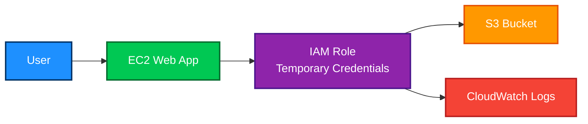

# IAM

<details>
<summary>1. Definition</summary>

## 1. Definition

### Simple Definition

AWS Identity and Access Management (IAM) is the AWS service used to control **who can access AWS resources** and **what actions they can perform**.

IAM answers two main questions:

| Question | Meaning |
|---|---|
| Who are you? | Authentication |
| What are you allowed to do? | Authorization |

### Key Idea

IAM is the **permission system** for AWS.

Memory hook:

> **IAM = Identity + Access + Management**

### Important IAM Components

| Component | Simple Meaning |
|---|---|
| User | A single identity, usually a person or application |
| Group | A collection of users |
| Role | Temporary identity that can be assumed |
| Policy | JSON document that defines permissions |
| Permission | Allowed or denied action |
| Principal | User, role, service, or account making a request |

</details>

<details>
<summary>2. What Problem Does It Solve?</summary>

## 2. What Problem Does It Solve?

### Main Problem

IAM solves the problem of **secure access control** in AWS.

Without IAM, every person or application might have too much access, which is dangerous.

### IAM Helps You

- Give users only the access they need
- Avoid using the root account for daily work
- Allow AWS services to access other AWS services securely
- Enable temporary access instead of long-term credentials
- Control access across multiple AWS accounts
- Enforce security best practices like MFA and least privilege

### Example Problem

An EC2 instance needs to read files from an S3 bucket.

Bad solution:

- Store AWS access keys on the EC2 instance

Good solution:

- Attach an IAM role to the EC2 instance
- The role gives temporary permissions to access S3

</details>

<details>
<summary>3. Core Use Cases</summary>

## 3. Core Use Cases

### User Access Management

Create IAM users or federated identities for people who need AWS access.

Common examples:

- Developers
- Administrators
- Read-only auditors
- Support engineers

### Service-to-Service Access

Allow one AWS service to access another AWS service securely.

Examples:

- EC2 reads from S3
- Lambda writes logs to CloudWatch
- ECS pulls images from ECR
- CloudFormation creates AWS resources

### Cross-Account Access

Allow users or services in one AWS account to access resources in another account.

Example:

- A security account assumes a role in production accounts for auditing

### Temporary Credentials

Use IAM roles and AWS STS to provide short-lived credentials.

This is better than long-term access keys.

### Permission Boundaries

Limit the maximum permissions an IAM user or role can receive.

Useful for delegated administration.

### Federated Access

Allow external identities to access AWS.

Examples:

- IAM Identity Center
- Active Directory
- Google Workspace
- SAML identity provider
- OIDC identity provider

</details>

<details>
<summary>4. Important Features for SAA</summary>

## 4. Important Features for SAA

### IAM Users

IAM users represent individual identities.

They can have:

- Console password
- Access keys
- MFA device
- Attached permissions

For the exam, remember:

> IAM users use **long-term credentials**, so they are not preferred for applications or temporary access.

### IAM Groups

Groups are collections of IAM users.

Use groups to assign the same permissions to multiple users.

Example:

| Group | Permission |
|---|---|
| Developers | Limited EC2, S3, CloudWatch |
| Admins | Full admin access |
| Auditors | Read-only access |

Important:

- Users can belong to multiple groups
- Groups cannot contain other groups
- Groups are only for IAM users, not roles

### IAM Roles

IAM roles are identities with permissions, but they are **assumed temporarily**.

Roles are commonly used by:

- AWS services
- Applications
- Federated users
- Cross-account users

Examples:

| Role Use Case | Example |
|---|---|
| EC2 instance role | EC2 accesses S3 |
| Lambda execution role | Lambda writes to CloudWatch Logs |
| Cross-account role | Security account audits production account |
| Federated role | Corporate user logs in using SSO |

Memory hook:

> **Use roles when something needs temporary AWS access.**

### IAM Policies

IAM policies are JSON documents that define permissions.

A policy usually includes:

| Element | Meaning |
|---|---|
| Effect | Allow or Deny |
| Action | API call, such as `s3:GetObject` |
| Resource | AWS resource ARN |
| Condition | Optional rule for when permission applies |

Example policy idea:

```json
{
  "Effect": "Allow",
  "Action": "s3:GetObject",
  "Resource": "arn:aws:s3:::example-bucket/*"
}
```

### Policy Types

| Policy Type | Attached To | Purpose |
|---|---|---|
| Identity-based policy | User, group, role | Grants permissions to identities |
| Resource-based policy | Resource | Grants access to a resource |
| Permissions boundary | User or role | Sets maximum allowed permissions |
| Service Control Policy | AWS account or OU | Sets maximum permissions in AWS Organizations |
| Session policy | Temporary session | Further limits temporary permissions |

### Identity-Based Policies

These are attached to IAM users, groups, or roles.

Example:

- Allow a role to read from S3
- Allow a user to start EC2 instances

### Resource-Based Policies

These are attached directly to AWS resources.

Common examples:

- S3 bucket policy
- KMS key policy
- SQS queue policy
- SNS topic policy
- Lambda resource policy

### Explicit Deny

An explicit deny always wins.

Permission evaluation order:

1. Start with implicit deny
2. Check for explicit allow
3. Explicit deny overrides everything

Memory hook:

> **Deny beats Allow. Always.**

### IAM Policy Evaluation

A request is allowed only if all required permission layers allow it.

Common layers:

- Identity-based policy
- Resource-based policy
- Permissions boundary
- SCP
- Session policy

### AWS STS

AWS Security Token Service provides temporary credentials.

Common STS action:

- `AssumeRole`

STS is used for:

- IAM roles
- Cross-account access
- Federation
- Temporary sessions

### Root User

The root user is created when the AWS account is created.

It has full access to everything in the account.

For the exam:

- Do not use root for daily tasks
- Enable MFA on root
- Do not create root access keys
- Use root only for specific account-level tasks

### IAM Access Analyzer

IAM Access Analyzer helps identify resources that are shared externally.

It can analyze:

- S3 bucket policies
- IAM roles
- KMS keys
- Lambda functions
- SQS queues
- Secrets Manager secrets

Exam idea:

> Use IAM Access Analyzer to find unintended public or cross-account access.

### IAM Credential Report

The credential report shows security status for IAM users.

It can help identify:

- Users without MFA
- Old access keys
- Unused passwords
- Password rotation status

### Access Advisor

Access Advisor shows which services were last accessed by an IAM identity.

Use it to remove unused permissions and move toward least privilege.

</details>

<details>
<summary>5. Security Model</summary>

## 5. Security Model

### IAM Permissions

IAM uses policies to control permissions.

A permission can allow or deny actions on AWS resources.

Basic rule:

```text
Principal + Action + Resource + Condition = Permission Decision
```

Example:

| Part | Example |
|---|---|
| Principal | IAM role |
| Action | `s3:GetObject` |
| Resource | S3 bucket object |
| Condition | Only from a specific VPC endpoint |

### Least Privilege

Least privilege means giving only the permissions required to do a task.

Bad:

```text
Allow: *
Resource: *
```

Better:

```text
Allow: s3:GetObject
Resource: specific bucket only
```

Memory hook:

> **Start small, grant more only when needed.**

### MFA

Multi-factor authentication adds an extra login factor.

Use MFA especially for:

- Root user
- Admin users
- Sensitive IAM actions
- Console access

### Encryption Options

IAM itself does not store application data like S3 or EBS.

However, security is still important:

| Area | What to Know |
|---|---|
| Passwords | Protected by AWS |
| Access keys | Must be securely stored by the customer |
| Temporary credentials | Generated by STS |
| KMS permissions | Controlled using IAM policies and KMS key policies |
| API requests | Signed using AWS Signature Version 4 |

Important exam point:

> IAM controls access to encryption keys, but AWS KMS performs key management and cryptographic operations.

### Network and Security Controls

IAM is a global access control service, not a VPC networking service.

But IAM policies can use conditions such as:

| Condition Type | Example |
|---|---|
| Source IP | Allow only from company IP range |
| MFA present | Require MFA for sensitive actions |
| VPC endpoint | Allow access only through a specific endpoint |
| Requested region | Restrict actions to certain AWS Regions |
| Tags | Allow access based on resource tags |

### Shared Responsibility

| Responsibility | AWS | Customer |
|---|---|---|
| IAM service availability | Yes | No |
| Secure infrastructure | Yes | No |
| Create users, roles, policies | No | Yes |
| Apply least privilege | No | Yes |
| Enable MFA | No | Yes |
| Rotate access keys | No | Yes |
| Avoid root usage | No | Yes |

</details>

<details>
<summary>6. High Availability / Durability Behavior</summary>

## 6. High Availability / Durability Behavior

### Availability

IAM is a **global AWS service**.

It is not tied to a single AWS Region.

This means IAM identities and policies are available across AWS Regions.

### Fault Tolerance

AWS manages IAM availability and infrastructure.

You do not configure:

- Multi-AZ IAM
- IAM replication
- IAM load balancing

AWS handles this for you.

### Multi-Region Behavior

IAM is global, but permissions apply to regional services.

Example:

- IAM role is global
- EC2 is regional
- An IAM policy can allow EC2 actions in one region and deny them in another using conditions

### Durability

IAM configuration is managed by AWS.

You do not choose durability settings for IAM.

However, you should protect IAM configuration by using:

- MFA
- Least privilege
- CloudTrail logging
- IAM Access Analyzer
- AWS Organizations SCPs
- Infrastructure as Code for repeatability

### Important Exam Point

IAM is global, but many AWS resources controlled by IAM are regional.

Example:

| Item | Scope |
|---|---|
| IAM users | Global |
| IAM roles | Global |
| IAM policies | Global |
| EC2 instances | Regional |
| S3 bucket names | Global namespace |
| Lambda functions | Regional |

</details>

<details>
<summary>7. Cost Optimization Options</summary>

## 7. Cost Optimization Options

### IAM Pricing

IAM has no additional charge.

You can create IAM users, groups, roles, and policies without paying for IAM itself.

### Cost Impact

IAM does not directly reduce cost like storage classes or reserved instances.

But IAM can help prevent expensive mistakes.

Examples:

- Prevent users from launching large EC2 instances
- Restrict access to expensive regions
- Deny creation of unused resources
- Limit who can modify billing settings
- Use tags to control resource creation

### Cost Control with IAM Conditions

You can use IAM conditions to enforce cost-related controls.

Examples:

| Control | Example |
|---|---|
| Region restriction | Allow resources only in approved regions |
| Instance type restriction | Deny large EC2 instance types |
| Tag enforcement | Require cost center tags |
| Service restriction | Allow only approved AWS services |

### Use SCPs for Organization-Wide Cost Guardrails

In AWS Organizations, SCPs can restrict what accounts are allowed to do.

Example:

- Deny launching EC2 instances outside approved regions
- Deny disabling CloudTrail
- Deny using expensive services in sandbox accounts

### Memory Hook

> IAM is free, but bad IAM permissions can become expensive.

</details>

<details>
<summary>8. Common Exam Traps</summary>

## 8. Common Exam Traps

### Trap 1: Root User for Daily Tasks

Do not use the root user for daily administration.

Best practice:

- Enable MFA on root
- Lock away root credentials
- Use IAM admin roles or IAM Identity Center

### Trap 2: IAM User vs IAM Role

| Need | Choose |
|---|---|
| Long-term named identity | IAM user |
| Temporary access | IAM role |
| AWS service access | IAM role |
| Cross-account access | IAM role |
| Federation | IAM role |

Exam shortcut:

> For EC2, Lambda, ECS, and cross-account access, choose IAM roles.

### Trap 3: Storing Access Keys on EC2

Do not store access keys on EC2 instances.

Use an IAM role attached to the EC2 instance.

### Trap 4: Explicit Deny

Explicit deny always overrides allow.

Even if a user has an allow policy, a deny from another policy blocks access.

### Trap 5: Permissions Boundary Does Not Grant Permissions

A permissions boundary only sets the maximum allowed permissions.

It does not grant permissions by itself.

A user or role still needs an identity-based policy.

### Trap 6: SCP Does Not Grant Permissions

An SCP sets the maximum available permissions in an AWS Organization.

It does not grant permissions by itself.

### Trap 7: Resource-Based Policy vs Identity-Based Policy

Identity-based policy:

- Attached to user, group, or role
- Says what the identity can do

Resource-based policy:

- Attached to a resource
- Says who can access the resource

### Trap 8: IAM Groups Cannot Be Principals

IAM groups are used to organize users.

Groups cannot be used as principals in resource-based policies.

### Trap 9: IAM Is Global

IAM is a global service.

Do not choose answers that say you must create IAM users separately in each region.

### Trap 10: Role Trust Policy vs Permission Policy

An IAM role usually has two important policy parts:

| Policy | Purpose |
|---|---|
| Trust policy | Who can assume the role |
| Permission policy | What the role can do |

</details>

<details>
<summary>9. Compare With Similar Services</summary>

## 9. Compare With Similar Services

### IAM vs Similar AWS Security Services

| Service | Main Purpose | When to Choose |
|---|---|---|
| IAM | Control access to AWS resources | For users, roles, policies, and permissions |
| IAM Identity Center | Central workforce access to AWS accounts and apps | For SSO and managing human access across accounts |
| AWS Organizations | Manage multiple AWS accounts | For account structure and SCP guardrails |
| AWS STS | Temporary security credentials | For assuming roles and federation |
| AWS KMS | Manage encryption keys | For encryption and key access control |
| AWS Secrets Manager | Store and rotate secrets | For database passwords, API keys, and credentials |
| Amazon Cognito | App user authentication | For mobile/web app users |
| AWS Directory Service | Managed Microsoft AD or directory integration | For Active Directory workloads |

### IAM vs IAM Identity Center

| Feature | IAM | IAM Identity Center |
|---|---|---|
| Best for | AWS permissions and roles | Human SSO access |
| Users | IAM users | Workforce users |
| Credentials | Can be long-term | Temporary |
| Multi-account access | Possible with roles | Built for this |
| Exam preference | Use roles, avoid long-term users | Preferred for workforce SSO |

### IAM vs Cognito

| Feature | IAM | Cognito |
|---|---|---|
| Users | AWS administrators, services, workloads | Application users |
| Example | Developer accessing AWS console | Customer logging into a mobile app |
| Main job | AWS resource access | App authentication |
| SAA clue | AWS account permissions | Web/mobile user sign-up and sign-in |

### IAM vs KMS

| Feature | IAM | KMS |
|---|---|---|
| Main job | Access control | Encryption key management |
| Controls | Who can call AWS APIs | Who can use encryption keys |
| Policy type | IAM policies | Key policies and IAM policies |
| Example | Allow `s3:GetObject` | Allow `kms:Decrypt` |

</details>

<details>
<summary>10. Mini Architecture Example</summary>

## 10. Mini Architecture Example

### Scenario

A web application runs on EC2 and needs to read files from an S3 bucket.

### Bad Design

The developer stores AWS access keys on the EC2 instance.

Problems:

- Keys can be stolen
- Keys may not rotate automatically
- Hard to manage securely

### Better Design

Use an IAM role attached to the EC2 instance.

The EC2 instance receives temporary credentials automatically.

### Architecture Flow



### Permissions Needed

The IAM role should allow only what the EC2 application needs.

Example permissions:

| Service | Permission |
|---|---|
| S3 | Read objects from one bucket |
| CloudWatch Logs | Write application logs |

### Exam Takeaway

For AWS services accessing other AWS services:

> Prefer IAM roles with temporary credentials.

### Memory Hook Summary

| Concept | Memory Hook |
|---|---|
| IAM | Who can do what |
| Role | Temporary permissions |
| Policy | Permission document |
| Explicit deny | Deny always wins |
| Root user | Lock it away |
| Least privilege | Give only what is needed |
| STS | Temporary credentials |
| SCP | Organization-wide maximum boundary |

</details>