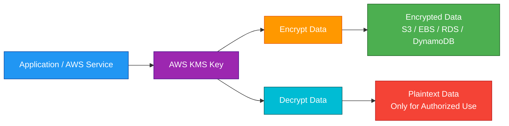
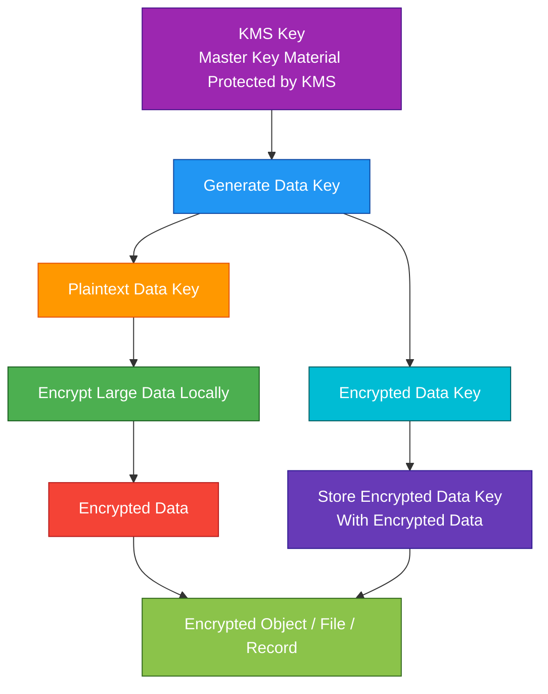
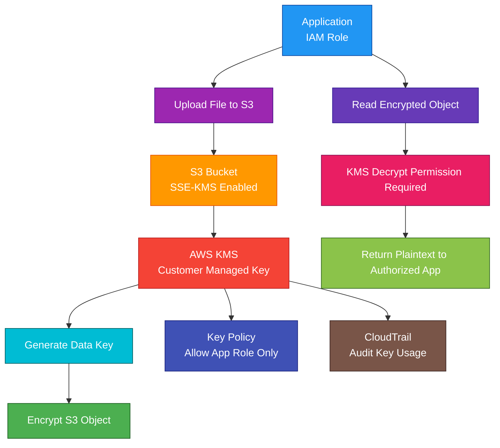

# AWS KMS

## 1. Definition

### Simple Definition

AWS KMS, or AWS Key Management Service, is a managed service for creating, storing, and controlling encryption keys.

It helps protect data by managing the keys used to encrypt and decrypt that data.

### Memory Hook

KMS = Key Management Service = Manage encryption keys.

### Basic Idea

AWS services or applications use KMS keys to encrypt data.

KMS protects the key material and controls who can use the keys.

### Key Point

KMS does not usually encrypt large files directly.

Instead, it commonly protects data encryption keys that encrypt the actual data.

This is called envelope encryption.

## 2. What Problem Does It Solve?

### Main Problem

AWS KMS solves the problem of securely managing encryption keys without building your own key management system.

### Without KMS

You may need to manage:

- Key generation
- Key storage
- Key rotation
- Key access control
- Key audit logs
- Key deletion
- Encryption integrations
- Hardware security modules
- Compliance requirements

### With KMS

AWS manages the key infrastructure and integrates with many AWS services.

You control:

- Who can use keys
- Which services can use keys
- Key policies
- IAM permissions
- Key rotation
- Key deletion
- Auditing

### Key Benefit

KMS makes encryption easier to use, manage, and audit across AWS.

## 3. Core Use Cases

### Encrypt AWS Service Data

Use KMS keys to encrypt data in AWS services.

Examples:

- S3 objects
- EBS volumes
- RDS databases
- DynamoDB tables
- EFS file systems
- Secrets Manager secrets
- SQS queues
- SNS topics
- CloudWatch Logs

### Application-Level Encryption

Applications can call KMS APIs to encrypt and decrypt data.

Common use:

An application asks KMS for a data key, encrypts local data, and stores encrypted data safely.

### Secrets Protection

Services like Secrets Manager use KMS to encrypt stored secrets.

Example:

A database password is stored in Secrets Manager and encrypted using a KMS key.

### Cross-Account Encryption

Use KMS key policies and grants to allow another AWS account to use a key.

Example:

A central security account owns a KMS key that encrypts shared logs.

### Compliance and Auditing

KMS integrates with CloudTrail, so key usage can be audited.

This helps answer:

- Who used the key?
- When was it used?
- Which service used it?
- What action was performed?

### Multi-Region Applications

Use multi-Region KMS keys when encrypted data must be decrypted in more than one Region.

Example:

A disaster recovery application replicates encrypted data to another Region.

## 4. Important Features for SAA

### KMS Key

A KMS key is the main resource in AWS KMS.

It is used to perform cryptographic operations such as:

- Encrypt
- Decrypt
- Generate data key
- Re-encrypt
- Sign
- Verify

### Customer Managed Key

A customer managed key is created and controlled by you.

You manage:

- Key policy
- IAM permissions
- Rotation setting
- Alias
- Deletion schedule
- Grants
- Cross-account access

### AWS Managed Key

An AWS managed key is created and managed by AWS for a specific AWS service.

Example aliases:

- `aws/s3`
- `aws/ebs`
- `aws/rds`
- `aws/secretsmanager`

Important point:

You can view AWS managed keys, but you have less control over them than customer managed keys.

### AWS Owned Key

AWS owned keys are fully managed and owned by AWS.

You do not see or manage these keys directly.

Some AWS services use them automatically.

### Key Type Comparison

| Key Type | Managed By | Visible to Customer | Best For |
|---|---|---|---|
| Customer managed key | You | Yes | Full control and audit needs |
| AWS managed key | AWS service | Yes | Easy service encryption |
| AWS owned key | AWS | No | Default service-managed encryption |

### Symmetric KMS Key

A symmetric KMS key uses the same key for encryption and decryption.

This is the most common KMS key type.

Best for:

- S3 encryption
- EBS encryption
- RDS encryption
- Secrets Manager encryption
- General AWS service encryption

### Asymmetric KMS Key

An asymmetric KMS key uses a public/private key pair.

Use it for:

- Digital signing
- Signature verification
- Encryption outside AWS with public key
- Decryption inside KMS with private key

### HMAC KMS Key

HMAC keys are used to generate and verify hash-based message authentication codes.

Use them when you need message integrity and authenticity.

### Envelope Encryption

Envelope encryption means encrypting data with a data key, then encrypting that data key with a KMS key.

This is a major KMS exam concept.

### Data Key

A data key is used to encrypt actual application data.

KMS can generate:

- Plaintext data key
- Encrypted copy of the data key

The plaintext data key is used briefly by the application and should be removed from memory after use.

### Encrypt API

The `Encrypt` API encrypts small amounts of data directly with KMS.

Important exam point:

KMS direct encryption has size limits, so large data should use envelope encryption.

### Decrypt API

The `Decrypt` API decrypts ciphertext that was encrypted with KMS.

Common use:

Decrypt an encrypted data key so the application can decrypt local data.

### GenerateDataKey API

The `GenerateDataKey` API returns:

- Plaintext data key
- Encrypted data key

Applications use the plaintext data key to encrypt data and store the encrypted data key with the encrypted data.

### ReEncrypt API

The `ReEncrypt` API decrypts data encrypted under one KMS key and re-encrypts it under another KMS key.

Use it when changing keys without exposing plaintext data to the application.

### Key Policy

A key policy is the main resource-based policy for a KMS key.

Important point:

Every KMS key must have a key policy.

### IAM Policies and KMS

IAM policies can allow users or roles to use KMS keys, but the key policy must also allow that access.

Exam tip:

For KMS access, check both IAM policy and key policy.

### Grants

A grant gives temporary or scoped permission to use a KMS key.

AWS services often use grants to access keys on your behalf.

Example:

EBS uses a grant to encrypt and decrypt data for an encrypted volume.

### Alias

An alias is a friendly name for a KMS key.

Example:

`alias/prod-app-key`

Aliases make applications easier to manage because you can refer to the alias instead of the key ID.

### Automatic Key Rotation

Customer managed symmetric encryption keys can support automatic rotation.

Important points:

- Rotation changes backing key material
- Key ID stays the same
- Old key material remains available to decrypt old data
- Rotation helps meet security requirements

### Manual Rotation

Manual rotation means creating a new KMS key and updating applications or aliases to use it.

Use manual rotation when automatic rotation is not supported or when you need more control.

### Key Deletion

KMS keys cannot be deleted immediately.

You schedule deletion with a waiting period.

Important exam point:

Deleting a KMS key can make encrypted data permanently unrecoverable.

### Disable Key

You can disable a KMS key to temporarily prevent its use.

This is safer than deletion when you are unsure.

### Multi-Region Keys

Multi-Region keys are related KMS keys in different AWS Regions with the same key ID and key material.

Use them for:

- Disaster recovery
- Multi-Region applications
- Client-side encryption across Regions
- Data replicated across Regions

### CloudTrail Integration

KMS integrates with CloudTrail.

CloudTrail can record key usage events such as:

- Encrypt
- Decrypt
- GenerateDataKey
- ScheduleKeyDeletion
- DisableKey
- CreateGrant

### Custom Key Store

A custom key store lets you use key material backed by AWS CloudHSM.

Use it when compliance requires key material in dedicated HSMs under more direct control.

### External Key Store

An external key store lets KMS use keys stored outside AWS in an external key manager.

Use it when strict compliance requires external key control.

## 5. Security Model

### IAM Permissions

IAM controls who can call AWS KMS APIs.

Common permissions:

| Permission | Purpose |
|---|---|
| `kms:Encrypt` | Encrypt data |
| `kms:Decrypt` | Decrypt data |
| `kms:GenerateDataKey` | Generate data keys |
| `kms:ReEncrypt` | Re-encrypt data under another key |
| `kms:CreateKey` | Create KMS key |
| `kms:CreateAlias` | Create key alias |
| `kms:ScheduleKeyDeletion` | Schedule key deletion |
| `kms:DisableKey` | Disable key |

### Key Policy

A key policy controls access to a specific KMS key.

Important points:

- Required for every KMS key
- Resource-based policy
- Defines key administrators and key users
- Can allow IAM policies to grant access
- Critical for cross-account access

### Key Administrators

Key administrators can manage a key.

They may be allowed to:

- Update key policy
- Enable or disable key
- Create aliases
- Configure rotation
- Schedule deletion

Important point:

Key administrators should not automatically be allowed to decrypt data unless needed.

### Key Users

Key users can use the key for cryptographic operations.

Examples:

- Encrypt
- Decrypt
- GenerateDataKey
- ReEncrypt

### Least Privilege

Give users and services only the KMS permissions they need.

Example:

An application that only decrypts secrets should not have permission to delete the KMS key.

### Separation of Duties

Separate key administration from key usage.

Example:

Security team manages key policy.

Application role uses the key to decrypt application secrets.

### Encryption at Rest

KMS is commonly used to protect data at rest in AWS services.

Examples:

- S3 SSE-KMS
- EBS encryption
- RDS encryption
- DynamoDB encryption
- EFS encryption
- Secrets Manager encryption
- SQS and SNS encryption

### Encryption in Transit

KMS API calls use HTTPS.

KMS manages keys, but application traffic still needs encryption in transit using TLS/HTTPS where appropriate.

### KMS and Service Permissions

When an AWS service uses a KMS key, both the service and the calling principal may need permissions.

Example:

To read an SSE-KMS encrypted S3 object, the user may need:

- `s3:GetObject`
- `kms:Decrypt`

### KMS Conditions

KMS supports policy conditions.

Common condition examples:

- Restrict key use to a specific AWS service
- Restrict key use to a specific encryption context
- Restrict key use to specific accounts
- Restrict key use through specific VPC endpoints

### Encryption Context

Encryption context is extra authenticated data used with cryptographic operations.

It helps bind encrypted data to a context.

Example:

A service may include a bucket name, table name, or resource ARN in the encryption context.

### CloudTrail Auditing

CloudTrail records KMS API activity.

This helps investigate:

- Who decrypted data
- Which key was used
- When the key was used
- Which service made the request

### Shared Responsibility

AWS is responsible for:

- KMS managed infrastructure
- Key material protection
- HSM-backed security
- Physical security
- KMS service availability
- Cryptographic operation infrastructure

You are responsible for:

- Key policies
- IAM permissions
- Key rotation settings
- Key deletion decisions
- KMS grants
- Choosing correct key type
- Protecting encrypted data
- Monitoring key usage
- Cross-account access control

## 6. High Availability / Durability Behavior

### Availability

AWS KMS is a managed regional service.

AWS manages the infrastructure for high availability inside the Region.

### Regional Service

KMS keys are regional by default.

A key created in one Region is normally used in that Region.

### Multi-AZ Behavior

KMS is managed by AWS across regional infrastructure.

You do not configure Multi-AZ manually.

### Durability

KMS protects key material using highly durable managed infrastructure.

For SAA, focus on:

- Do not delete keys accidentally
- Key deletion can make data unrecoverable
- Old key material remains available after automatic rotation
- Backups and encrypted data depend on key availability

### Multi-Region Behavior

Standard KMS keys are single-Region.

Multi-Region keys can be created when the same cryptographic key material is needed in multiple Regions.

### Multi-Region Key Use Case

Use multi-Region keys when:

- Data is replicated across Regions
- Applications need to decrypt data in another Region
- Client-side encryption is used across Regions
- Disaster recovery requires key availability in another Region

### Automatic Rotation Durability

When a KMS key is rotated automatically, old key material is retained.

This means old encrypted data can still be decrypted.

### Key Deletion Risk

If a KMS key is deleted, data encrypted under that key may become permanently unreadable.

Important exam point:

Never delete a KMS key unless you are certain no data needs it.

### Disable vs Delete

| Action | Effect |
|---|---|
| Disable key | Temporarily prevents key usage |
| Delete key | Permanently removes key after waiting period |

### Backup Dependency

If backups are encrypted with a KMS key, restoring those backups requires access to the same key or a valid copied key setup.

### Important Exam Point

KMS availability is managed by AWS, but customer mistakes in key policy, deletion, or KMS permissions can make encrypted data inaccessible.

## 7. Cost Optimization Options

### Use AWS Managed Keys When Full Control Is Not Needed

AWS managed keys are simpler and may reduce management overhead.

Use them when:

- Default service encryption is enough
- You do not need custom key policies
- You do not need detailed key lifecycle control

### Use Customer Managed Keys Only When Needed

Customer managed keys give more control but can add cost and management work.

Use them when you need:

- Custom key policies
- Rotation control
- Cross-account access
- Compliance requirements
- Separate audit and administration
- Key aliases and grants control

### Reduce Excessive KMS API Calls

KMS charges can include API request usage.

Avoid unnecessary calls by:

- Caching data keys safely
- Avoiding repeated decrypt calls in tight loops
- Using service-side encryption integrations efficiently

### Use Data Key Caching

For client-side encryption, data key caching can reduce repeated KMS calls.

Important point:

Use caching carefully and follow security requirements.

### Avoid Too Many Duplicate Keys

Do not create separate KMS keys for every tiny use case unless isolation or compliance requires it.

Use key strategy by:

- Environment
- Application
- Data classification
- Account boundary

### Delete Unused Keys Carefully

Unused customer managed keys can add cost.

Before deleting a key, confirm no data still depends on it.

Safer first step:

Disable the key and monitor for failures.

### Use Aliases for Easier Key Changes

Aliases make it easier to switch applications to a new key during manual rotation.

This can reduce operational cost.

### Avoid Unnecessary Multi-Region Keys

Multi-Region keys are useful for DR and global apps but may add management complexity and cost.

Use them only when cross-Region cryptographic compatibility is required.

### Monitor Key Usage

Use CloudTrail and CloudWatch to identify:

- Unused keys
- Unexpected decrypt activity
- Excessive API calls
- Failed access attempts

### Use Service Default Encryption Where Appropriate

Many AWS services provide default encryption options.

For low-risk workloads, default AWS managed encryption may be enough.

## 8. Common Exam Traps

### KMS Does Not Usually Encrypt Large Data Directly

KMS has size limits for direct encryption.

For large data, use envelope encryption.

### KMS Key Policy Matters

IAM permission alone may not be enough.

The KMS key policy must allow access or allow IAM policies to grant access.

### Explicit Deny Wins

If a key policy or IAM policy explicitly denies KMS access, the request fails.

### KMS Key Deletion Can Destroy Access to Data

If a KMS key is deleted, encrypted data may become impossible to decrypt.

This is a major exam trap.

### Disable Is Safer Than Delete

If unsure, disable a key first instead of deleting it.

### S3 SSE-KMS Requires KMS Permissions

To read an SSE-KMS encrypted S3 object, the principal needs both:

- S3 permission
- KMS decrypt permission

### AWS Managed Key vs Customer Managed Key

| Requirement | Choose |
|---|---|
| Simple AWS service encryption | AWS managed key |
| Full policy/rotation/cross-account control | Customer managed key |

### KMS Is Not Secrets Manager

KMS manages encryption keys.

Secrets Manager stores and rotates secret values.

They commonly work together.

### KMS Is Not CloudHSM

KMS is managed key management.

CloudHSM gives dedicated hardware security modules with more direct control.

### Automatic Rotation Does Not Change Key ID

Automatic key rotation keeps the same KMS key ID.

Old data can still be decrypted.

### Cross-Account Access Needs Key Policy

For another account to use a KMS key, the key policy must allow that account.

IAM policy in the other account alone is not enough.

### Multi-Region Keys Are Not Automatic for Every Key

You must create and configure multi-Region keys.

Normal KMS keys are regional.

### KMS Does Not Replace TLS

KMS protects encryption keys and data at rest.

Use TLS/HTTPS for encryption in transit.

### Key Administrators Are Not Always Key Users

A user who can manage a key does not necessarily need permission to decrypt data.

This supports separation of duties.

## 9. Compare With Similar Services

### Service Comparison Table

| Service | Main Purpose | Best For | Choose When |
|---|---|---|---|
| AWS KMS | Managed encryption keys | AWS-integrated encryption and key access control | You need managed keys for encrypt/decrypt operations |
| AWS CloudHSM | Dedicated HSMs | Strict compliance and direct HSM control | You need dedicated hardware key control |
| AWS Secrets Manager | Secret storage and rotation | Passwords, API keys, database credentials | You need to store and rotate secrets |
| Systems Manager Parameter Store | Config and secure parameters | App config and simple encrypted values | You need lower-cost parameter storage |
| ACM | TLS certificate management | HTTPS certificates | You need SSL/TLS certificates |
| IAM | Access control | Users, roles, policies | You need to control who can use keys and services |

### KMS vs CloudHSM

| Feature | AWS KMS | AWS CloudHSM |
|---|---|---|
| Management | Fully managed key service | Dedicated HSM cluster |
| Control | Less direct hardware control | More direct HSM control |
| AWS service integration | Strong | Less automatic |
| Best for | Most AWS encryption needs | Strict compliance/custom crypto needs |
| Exam clue | Managed encryption keys | Dedicated hardware security module |

### KMS vs Secrets Manager

| Feature | KMS | Secrets Manager |
|---|---|---|
| Main purpose | Manage encryption keys | Store and rotate secrets |
| Stores passwords | No, not as primary purpose | Yes |
| Rotates secrets | No | Yes |
| Encrypts secrets | Provides key | Uses KMS |
| Exam clue | Key used for encryption | Database password/API key rotation |

### KMS vs Parameter Store

| Feature | KMS | Parameter Store |
|---|---|---|
| Main purpose | Encryption key management | Store configuration values |
| Stores config values | No | Yes |
| SecureString encryption | Provides key | Uses KMS |
| Best for | Cryptographic key control | App config and simple secrets |

### KMS vs ACM

| Feature | KMS | ACM |
|---|---|---|
| Main purpose | Encryption keys | TLS certificates |
| Common use | Encrypt data at rest | HTTPS for websites/APIs |
| Key type | KMS keys | Public SSL/TLS certificates |
| Exam clue | Encrypt EBS/S3/RDS data | Attach certificate to ALB/CloudFront |

### KMS vs IAM

| Feature | KMS | IAM |
|---|---|---|
| Main purpose | Cryptographic keys | Identity and access control |
| Controls key usage | Yes, with key policies | Yes, with IAM policies |
| Stores identities | No | Yes |
| Common use together | Key policy + IAM permission | Grant access to use key |

### When to Choose AWS KMS

Choose AWS KMS when:

- You need managed encryption keys
- You need to encrypt AWS service data
- You need key policies and audit logs
- You need customer managed keys
- You need envelope encryption
- You need KMS integration with S3, EBS, RDS, DynamoDB, EFS, SQS, SNS, or Secrets Manager
- You need CloudTrail auditing of key usage
- You need Multi-Region keys for cross-Region decryption
- You do not need direct dedicated HSM control

## 10. Mini Architecture Example

### Scenario

A company stores sensitive customer files in Amazon S3.

The files must be encrypted at rest.

Only the application role should be allowed to decrypt the files.

All key usage must be auditable.

### Architecture

Use S3 with SSE-KMS.

Create a customer managed KMS key.

Allow the application IAM role to use `kms:Encrypt`, `kms:Decrypt`, and `kms:GenerateDataKey`.

Store files in S3 encrypted with the KMS key.

Use CloudTrail to audit key usage.

### Why This Is Good

- S3 objects are encrypted at rest
- KMS customer managed key gives control over key policy
- Application role gets least privilege access
- Unauthorized users cannot decrypt the files
- CloudTrail records KMS key usage
- Key rotation can be enabled for security requirements
- Key deletion protection avoids accidental data loss
- S3 and KMS permissions work together

### Exam Answer Pattern

If the question says:

“Encrypt AWS service data and control access to encryption keys.”

Think:

AWS KMS.

If the question says:

“Store and automatically rotate database passwords or API keys.”

Think:

AWS Secrets Manager.

If the question says:

“Need dedicated hardware security modules with direct control.”

Think:

AWS CloudHSM.

If the question says:

“Need HTTPS certificates for ALB, CloudFront, or API Gateway.”

Think:

AWS Certificate Manager.

### Final Memory Hook

KMS = Managed encryption keys.

KMS key = Key used for cryptographic operations.

Customer managed key = Full control.

AWS managed key = Service-managed convenience.

AWS owned key = Fully hidden AWS-managed key.

Envelope encryption = Data key encrypts data, KMS key encrypts data key.

Key policy = Main control for KMS key access.

IAM + key policy = Both matter.

CloudTrail = Audit key usage.

Disable key = Temporary block.

Delete key = Dangerous and permanent after waiting period.

Multi-Region key = Same key material across Regions.

Secrets Manager stores secrets.

KMS encrypts secrets.

