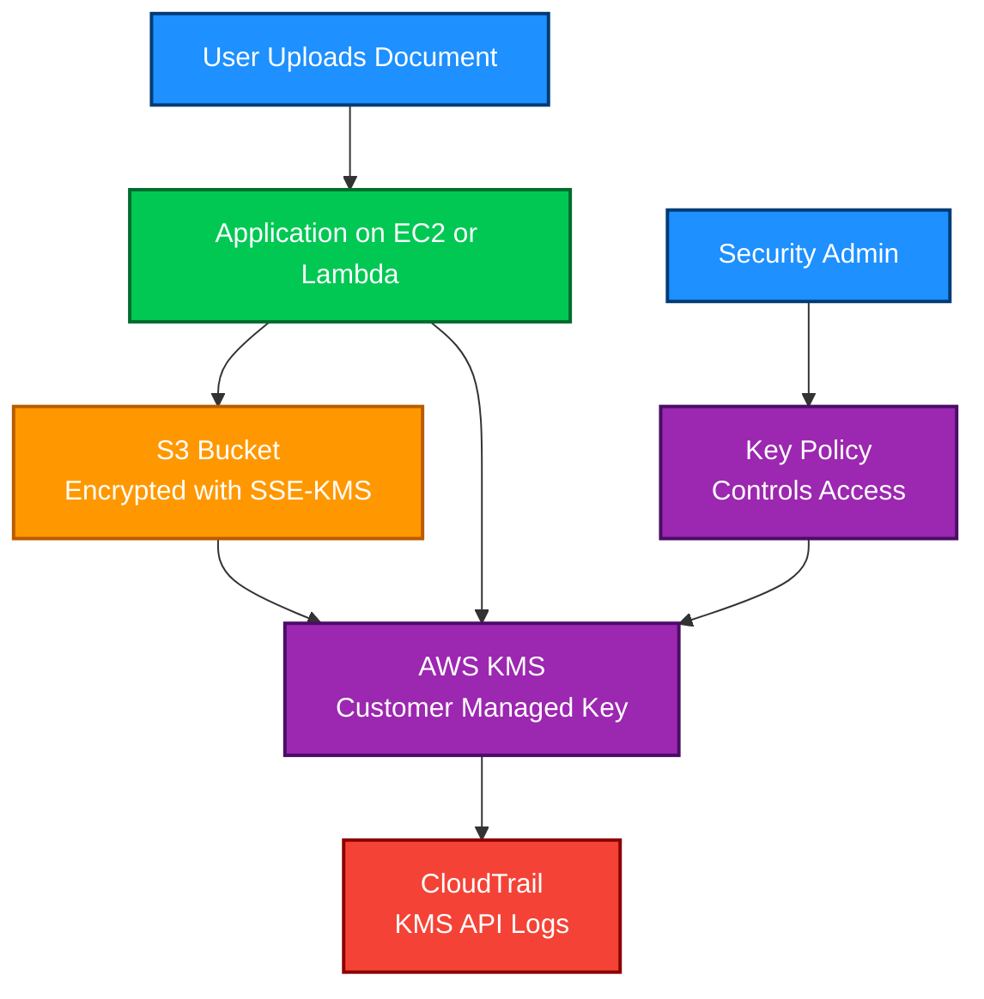

# KMS

<details>
<summary>1. Definition</summary>

## 1. Definition

### Simple Definition

AWS Key Management Service, or **AWS KMS**, is a managed service used to **create, store, control, rotate, and use encryption keys**.

It helps protect data by managing the keys used to encrypt and decrypt data across AWS services.

### Simple Analogy

Think of AWS KMS as a **secure key vault**.

- Your data is locked with encryption.
- KMS manages the keys.
- IAM and key policies decide who can use the keys.
- AWS services like S3, EBS, RDS, Lambda, and CloudTrail can use KMS keys for encryption.

### Key Exam Idea

KMS usually does **not encrypt large files directly**.

Instead, KMS commonly uses **envelope encryption**:

1. KMS creates or protects a small data key.
2. The data key encrypts the actual data.
3. KMS protects the data key.

### Memory Hook

**KMS = Key Management Service**

Think:

> **KMS manages the keys, not usually the bulk data.**

</details>

<details>
<summary>2. What Problem Does It Solve?</summary>

## 2. What Problem Does It Solve?

### Main Problem

Applications need encryption, but managing encryption keys securely is difficult.

Without KMS, you would need to handle:

- Key storage
- Key rotation
- Access control
- Audit logging
- Secure deletion
- Integration with AWS services
- Protection against unauthorized key use

KMS solves this by giving you a managed, secure, auditable key management system.

### Why This Matters

Encryption is only useful if the keys are protected.

KMS helps answer:

- Who can use this key?
- Which service used the key?
- Was the key used to encrypt or decrypt data?
- Can this key be rotated?
- Can access be revoked?

### Exam-Focused Summary

KMS helps with:

- **Encryption at rest**
- **Centralized key control**
- **Auditability with CloudTrail**
- **Integration with many AWS services**
- **Fine-grained access control**

</details>

<details>
<summary>3. Core Use Cases</summary>

## 3. Core Use Cases

### Encrypting AWS Service Data

KMS is commonly used to encrypt data stored in AWS services.

Examples:

| AWS Service | KMS Use Case |
|---|---|
| S3 | Encrypt objects using SSE-KMS |
| EBS | Encrypt volumes and snapshots |
| RDS | Encrypt databases and snapshots |
| DynamoDB | Encrypt table data |
| Lambda | Encrypt environment variables |
| Secrets Manager | Encrypt secrets |
| CloudTrail | Encrypt log files |
| SQS | Encrypt messages at rest |
| EFS | Encrypt file systems |

### Application-Level Encryption

Applications can call KMS directly to:

- Generate data keys
- Encrypt small secrets
- Decrypt protected data keys
- Sign or verify data using asymmetric keys
- Generate or verify HMACs

### Envelope Encryption

Envelope encryption is a major KMS concept.

The application encrypts data with a **data key**, and KMS encrypts the **data key**.

This is more scalable than sending all data to KMS.

### Cross-Account Encryption

KMS can be used in cross-account designs.

Common example:

- Account A owns encrypted S3 data.
- Account B needs to decrypt it.
- The KMS key policy must allow Account B.
- Account B IAM permissions must also allow KMS usage.

### Compliance and Auditing

KMS integrates with AWS CloudTrail so you can track key usage.

Useful for:

- Security audits
- Compliance requirements
- Detecting unauthorized decrypt attempts
- Tracking who used which key and when

</details>

<details>
<summary>4. Important Features for SAA</summary>

## 4. Important Features for SAA

### KMS Key Types

| Key Type | Managed By | Use Case |
|---|---|---|
| AWS owned key | AWS | Default encryption fully managed by AWS |
| AWS managed key | AWS, but visible in your account | Easy encryption for AWS services |
| Customer managed key | You | More control, policies, rotation, aliases |
| Imported key material | You provide key material | Bring your own key material |
| Custom key store | CloudHSM or external key store | Higher control or compliance needs |

### AWS Owned Keys

AWS owned keys are fully managed by AWS.

You usually do not see or manage them.

Used when a service provides default encryption with minimal user control.

### AWS Managed Keys

AWS managed keys are created and managed by AWS for a specific service.

Example aliases:

- `aws/s3`
- `aws/ebs`
- `aws/rds`

You can view them, but you cannot fully manage their policies like customer managed keys.

### Customer Managed Keys

Customer managed keys give you the most control.

You can manage:

- Key policy
- IAM access
- Rotation
- Aliases
- Tags
- Enable or disable state
- Scheduled deletion
- Cross-account access

For the SAA exam, customer managed keys are important when the question needs **fine-grained control**.

### Symmetric Keys

Symmetric KMS keys use the same key material for encryption and decryption.

This is the most common KMS key type.

Most AWS service integrations use **symmetric encryption KMS keys**.

### Asymmetric Keys

Asymmetric KMS keys use a public/private key pair.

They can be used for:

- Encryption and decryption
- Signing and verification

The private key stays protected inside KMS.

### HMAC Keys

HMAC keys are used to generate and verify message authentication codes.

They are for checking:

- Integrity
- Authenticity

They are not the main SAA focus, but know they exist.

### Envelope Encryption

Envelope encryption is one of the most important KMS exam topics.

Process:

1. KMS generates a data key.
2. Application receives:
   - Plaintext data key
   - Encrypted data key
3. Application encrypts data locally with the plaintext data key.
4. Application stores encrypted data plus encrypted data key.
5. Later, application sends encrypted data key to KMS for decryption.
6. KMS returns plaintext data key.
7. Application decrypts the data locally.

### Why Envelope Encryption Matters

Envelope encryption reduces direct KMS usage for large data.

It improves:

- Performance
- Scalability
- Cost efficiency
- Security separation

### Direct Encryption Limit

KMS direct encryption is for small data, such as secrets or small plaintext values.

For larger data, use envelope encryption or AWS service integrations.

### Key Rotation

KMS supports key rotation.

Important exam points:

| Key Type | Rotation Behavior |
|---|---|
| AWS managed keys | Automatically rotated by AWS |
| Customer managed keys | You can enable automatic rotation |
| Imported key material | Manual rotation required |
| Asymmetric keys | Rotation behavior is more limited than standard symmetric keys |
| Multi-Region keys | Rotation must be understood per key/replica behavior |

### Aliases

Aliases are friendly names for KMS keys.

Example:

```text
alias/prod/app-key
```

Aliases make applications easier to manage because you can reference an alias instead of a raw key ID.

### Key States

KMS keys can have states such as:

| State | Meaning |
|---|---|
| Enabled | Key can be used |
| Disabled | Key cannot be used |
| Pending deletion | Key is scheduled for deletion |
| Pending import | Waiting for imported key material |
| Unavailable | Key material or custom key store may be unavailable |

### Scheduled Deletion

KMS keys are not deleted immediately.

You schedule deletion with a waiting period.

Exam idea:

> If a KMS key is deleted, data encrypted with that key may become permanently unrecoverable.

### Multi-Region Keys

Multi-Region keys are KMS keys that can be replicated into different AWS Regions.

They are useful for:

- Multi-Region applications
- Disaster recovery
- Globally replicated encrypted data
- Reducing cross-Region decrypt dependency

Important:

- Multi-Region keys are not global keys.
- Each replica exists in a specific Region.
- Key policies and aliases are managed separately per Region.

### Grants

Grants are temporary or delegated permissions to use a KMS key.

AWS services often use grants when they need permission to use a key on your behalf.

Example:

- EBS uses a grant to attach and use an encrypted volume.

### CloudTrail Integration

KMS integrates with CloudTrail.

CloudTrail can log KMS API calls such as:

- `Encrypt`
- `Decrypt`
- `GenerateDataKey`
- `ScheduleKeyDeletion`
- `DisableKey`
- `CreateGrant`

This is important for auditing and security investigations.

</details>

<details>
<summary>5. Security Model</summary>

## 5. Security Model

### IAM Permissions

IAM permissions control who can call KMS APIs.

Common KMS permissions:

| Permission | Purpose |
|---|---|
| `kms:Encrypt` | Encrypt data |
| `kms:Decrypt` | Decrypt data |
| `kms:GenerateDataKey` | Generate a data key for envelope encryption |
| `kms:DescribeKey` | View key metadata |
| `kms:CreateGrant` | Allow delegated access |
| `kms:ScheduleKeyDeletion` | Schedule key deletion |
| `kms:DisableKey` | Disable a key |

### Key Policies

Every KMS key has a **key policy**.

This is one of the most important KMS security concepts.

A key policy decides who can administer or use the key.

Important exam rule:

> IAM permissions alone are not enough unless the key policy allows IAM permissions to be used.

### Key Policy and IAM Together

For a principal to use a customer managed KMS key, access usually requires:

1. The key policy allows access, or allows the account to use IAM policies.
2. The IAM policy grants the required KMS action.

### Cross-Account Access

For cross-account KMS access, you usually need both:

| Location | Required Permission |
|---|---|
| Key-owning account | KMS key policy allows external account/principal |
| External account | IAM policy allows KMS actions on the key |

Memory hook:

> **Cross-account KMS = key policy plus IAM policy.**

### Encryption Options

KMS supports several encryption-related patterns:

| Option | Description |
|---|---|
| SSE-KMS | AWS service encrypts data at rest using KMS |
| Client-side encryption | Application encrypts data before storing it |
| Envelope encryption | Data key encrypts data; KMS protects data key |
| Asymmetric encryption | Public/private key encryption |
| Signing and verification | Validate authenticity using asymmetric keys |
| HMAC | Verify message integrity and authenticity |

### Network and Security Controls

KMS is a regional AWS service.

Security controls include:

- IAM policies
- Key policies
- Grants
- CloudTrail logging
- VPC endpoints using AWS PrivateLink
- Service control policies in AWS Organizations
- Key disabling
- Key deletion waiting period
- Encryption context

### VPC Endpoints

You can use an interface VPC endpoint for KMS.

This allows resources in a VPC to reach KMS privately without using the public internet.

Useful for:

- Private workloads
- Compliance-sensitive environments
- Reducing internet exposure

### Encryption Context

Encryption context is additional key-value metadata supplied during encryption.

It is not secret.

It can be used as additional authenticated data.

Example:

```text
AppName=Payments
Environment=Prod
```

For decryption, the same encryption context may be required.

### Shared Responsibility

| Responsibility | AWS | Customer |
|---|---|---|
| Physical security of KMS infrastructure | Yes | No |
| KMS service availability | Yes | No |
| Protecting KMS key material inside KMS | Yes | No |
| Choosing correct key type | No | Yes |
| Writing secure key policies | No | Yes |
| Managing IAM permissions | No | Yes |
| Enabling rotation where needed | No | Yes |
| Protecting application data keys in memory | No | Yes |
| Avoiding accidental key deletion | No | Yes |

### Important Security Warning

Never give broad decrypt permissions unless required.

This is risky:

```text
kms:Decrypt on *
```

Prefer least privilege:

- Limit actions.
- Limit resources.
- Use key policies carefully.
- Use encryption context when helpful.
- Monitor with CloudTrail.

</details>

<details>
<summary>6. High Availability / Durability Behavior</summary>

## 6. High Availability / Durability Behavior

### Availability

AWS KMS is a managed regional service.

AWS manages the infrastructure for availability within a Region.

You do not manage KMS servers, patching, clustering, or replication inside the Region.

### Regional Nature

Most KMS keys are Region-specific.

A key created in `us-east-1` is normally used in `us-east-1`.

If you encrypt data with a single-Region key, decryption generally depends on that Region’s KMS key.

### Multi-AZ Behavior

KMS is designed as a highly available managed service within an AWS Region.

You do not need to configure Multi-AZ for KMS.

### Multi-Region Behavior

Standard KMS keys are single-Region.

Multi-Region keys can be replicated to other Regions.

Use Multi-Region keys when you need:

- Multi-Region disaster recovery
- Active-active applications
- Region-local decrypt operations
- Encrypted data replicated across Regions

### Multi-Region Key Exam Trap

Multi-Region keys are not automatically the same as global keys.

Important points:

- You create a primary key.
- You replicate it to other Regions.
- Each replica has its own ARN.
- Each Region has separate key policy management.
- Aliases are not automatically shared globally.
- Disabling one replica does not necessarily disable all replicas.

### Durability

KMS protects key material using AWS-managed secure infrastructure.

For SAA, remember:

> KMS key material is highly protected, but if you delete the key, AWS cannot decrypt your data for you.

### Fault Tolerance

AWS handles KMS fault tolerance inside the Region.

For higher resilience across Regions, design with:

- Multi-Region keys
- Replicated encrypted data
- Regional AWS service failover
- Backup and restore plans

</details>

<details>
<summary>7. Cost Optimization Options</summary>

## 7. Cost Optimization Options

### Main Cost Areas

KMS costs commonly come from:

- Customer managed KMS keys
- KMS API requests
- Multi-Region key replicas
- Custom key stores
- High request volume from applications or AWS services

### Use AWS Managed Keys When Appropriate

AWS managed keys are simpler and may reduce management overhead.

Use them when you do not need:

- Custom key policies
- Cross-account key sharing
- Manual administrative control
- Custom aliases
- Strict separation by application or team

### Use Customer Managed Keys Only When Needed

Customer managed keys give more control but may cost more.

Use customer managed keys when you need:

- Fine-grained access control
- Cross-account access
- Key rotation control
- Separation by workload
- Compliance-driven ownership
- Auditing by specific key

### Reduce Excessive API Calls

High-volume applications can increase KMS request costs.

Cost optimization options:

- Use envelope encryption.
- Cache data keys carefully when appropriate.
- Avoid unnecessary decrypt calls.
- Let AWS services handle encryption when possible.
- Avoid calling KMS directly for every small operation if not needed.

### Avoid Unused Customer Managed Keys

Unused customer managed keys can still create monthly key storage charges.

Periodically review:

- Old keys
- Disabled keys
- Test keys
- Unused aliases
- Keys scheduled for future deletion

### Be Careful With Multi-Region Keys

Each primary and replica Multi-Region key can have cost implications.

Use them when there is a real Multi-Region requirement.

Do not choose Multi-Region keys only because they sound more available.

### Custom Key Store Cost Warning

Custom key stores can use AWS CloudHSM or external key stores.

These are usually more expensive and operationally complex.

Use them only for strong compliance or control requirements.

### Memory Hook

> **KMS cost = keys plus requests.**

</details>

<details>
<summary>8. Common Exam Traps</summary>

## 8. Common Exam Traps

### Trap 1: IAM Alone Is Not Always Enough

For customer managed KMS keys, IAM permissions alone may not work.

The key policy must also allow the access path.

Correct idea:

> KMS authorization depends heavily on the key policy.

### Trap 2: Key Policy Is Central

Unlike many AWS services, KMS has a very important resource policy: the key policy.

For SAA, always check:

- Does the IAM role have permission?
- Does the key policy allow it?
- Is this cross-account?
- Is the key enabled?
- Is the key in the correct Region?

### Trap 3: KMS Does Not Usually Encrypt Large Data Directly

KMS direct encryption is for small data.

For large objects, use:

- S3 SSE-KMS
- EBS encryption
- RDS encryption
- Envelope encryption
- AWS Encryption SDK

### Trap 4: Deleting a Key Can Destroy Access to Data

If a KMS key is deleted, data encrypted with that key may be unrecoverable.

Exam wording may say:

> A company deleted a KMS key and needs to recover encrypted data.

Usually, if the deletion completed, recovery is not possible.

### Trap 5: Disabled Key Means Data Cannot Be Decrypted

If a KMS key is disabled:

- New encryption fails.
- Decryption fails.
- AWS services depending on the key may fail to access encrypted data.

### Trap 6: AWS Managed Key vs Customer Managed Key

| Requirement | Better Choice |
|---|---|
| Simple service-managed encryption | AWS managed key |
| Fine-grained key policy control | Customer managed key |
| Cross-account sharing | Customer managed key |
| Custom rotation/control | Customer managed key |
| Least management effort | AWS managed key |

### Trap 7: Multi-Region Keys Are Not Automatic Global Magic

Multi-Region keys help with regional cryptographic operations, but:

- You must create replicas.
- Key policies are separate.
- Aliases are separate.
- Applications still need to use the correct regional key.
- They do not automatically replicate your encrypted data.

### Trap 8: Imported Key Material Requires More Customer Management

If you import key material:

- You are responsible for generating key material.
- You may need to re-import it if it expires.
- Automatic rotation is not the same as AWS-generated keys.
- Losing imported key material can affect recovery plans.

### Trap 9: Grants Are Often Used by AWS Services

If an AWS service needs to use your KMS key, it may create a grant.

Do not confuse grants with IAM policies.

Grants are often temporary delegated permissions.

### Trap 10: Region Mismatch

KMS keys are regional unless using Multi-Region keys.

A common problem:

- Data is in one Region.
- KMS key is in another Region.
- Service integration requires a key in the same Region.

### Trap 11: SSE-S3 vs SSE-KMS

| Encryption Type | Key Management |
|---|---|
| SSE-S3 | S3 manages encryption keys |
| SSE-KMS | KMS manages encryption keys |
| SSE-C | Customer provides the encryption key to S3 |

Choose SSE-KMS when the question requires:

- KMS audit logs
- Customer managed keys
- Key policies
- More control over access

### Trap 12: CloudHSM Is Not the Same as KMS

KMS is managed and integrates deeply with AWS services.

CloudHSM gives dedicated hardware security modules that you manage more directly.

For most SAA questions, choose KMS unless the question requires dedicated HSM control.

</details>

<details>
<summary>9. Compare With Similar Services</summary>

## 9. Compare With Similar Services

### Comparison Table

| Service / Feature | Main Purpose | Key Ownership / Control | Choose When |
|---|---|---|---|
| AWS KMS | Managed encryption key service | AWS protects key material; you control policies | You need encryption keys integrated with AWS services |
| AWS CloudHSM | Dedicated hardware security module | You manage keys more directly | You need dedicated HSMs or strict compliance control |
| AWS Secrets Manager | Store and rotate secrets | Uses KMS for encryption | You need to store passwords, API keys, DB credentials |
| SSM Parameter Store | Store configuration and simple secrets | Can use KMS for SecureString | You need low-cost config/secrets storage |
| ACM | Manage TLS certificates | AWS manages private key for public certs | You need HTTPS certificates for ELB, CloudFront, API Gateway |
| S3 SSE-S3 | S3-managed encryption | S3 manages keys | You want simple S3 encryption with minimal control |
| S3 SSE-KMS | S3 encryption using KMS | KMS key policies and CloudTrail visibility | You need auditability and key-level control |
| Client-side encryption | App encrypts before sending to AWS | You control encryption flow | You need data encrypted before it reaches AWS services |

### KMS vs CloudHSM

| Feature | KMS | CloudHSM |
|---|---|---|
| Management | Fully managed | More customer-managed |
| AWS service integration | Very strong | Limited compared with KMS |
| Dedicated hardware | No, managed shared service boundary | Yes |
| Operational effort | Low | Higher |
| Common SAA answer | Usually KMS | Only when dedicated HSM is required |

### KMS vs Secrets Manager

| Feature | KMS | Secrets Manager |
|---|---|---|
| Stores secrets? | No, not directly for general secret management | Yes |
| Manages encryption keys? | Yes | No, it uses KMS |
| Rotates database credentials? | No | Yes |
| Encrypts secret values? | Yes, indirectly used by Secrets Manager | Yes, using KMS |

### KMS vs SSM Parameter Store

| Feature | KMS | Parameter Store |
|---|---|---|
| Main purpose | Key management | Store configuration values |
| SecureString support | Provides encryption key | Uses KMS for encryption |
| Secret rotation | No | Limited compared with Secrets Manager |
| Best for | Encryption keys | App config and simple secrets |

### When to Choose KMS

Choose KMS when the question says:

- Encrypt data at rest.
- Control access to encryption keys.
- Audit key usage.
- Use customer managed encryption keys.
- Allow cross-account encrypted data access.
- Integrate encryption with S3, EBS, RDS, DynamoDB, Lambda, or CloudTrail.

### When Not to Choose KMS Alone

Do not choose KMS alone when the question needs:

| Requirement | Better Service |
|---|---|
| Store database passwords with rotation | Secrets Manager |
| Store simple config values | SSM Parameter Store |
| Dedicated HSM ownership | CloudHSM |
| Public TLS certificate | ACM |
| Encrypt huge files directly through one API call | Use envelope encryption or service-native encryption |

</details>

<details>
<summary>10. Mini Architecture Example</summary>

## 10. Mini Architecture Example

### Scenario

A company stores customer documents in Amazon S3.

Requirements:

- Encrypt documents at rest.
- Use a customer managed KMS key.
- Allow only the application role to decrypt objects.
- Log all key usage.
- Support future cross-account audit access.

### Architecture



### How It Works

1. User uploads a document through the application.
2. The application stores the document in S3.
3. S3 encrypts the object using SSE-KMS.
4. KMS protects the encryption key.
5. The application role needs permission to use `kms:Encrypt` and `kms:Decrypt`.
6. The KMS key policy must allow the application role.
7. CloudTrail records KMS activity for auditing.

### Example Access Design

| Principal | Permission |
|---|---|
| Application role | Encrypt and decrypt using the KMS key |
| Security admin | Manage key policy and rotation |
| Auditor role | View CloudTrail logs, not decrypt data |
| Other users | No KMS decrypt permission |

### Exam-Focused Design Notes

Use a **customer managed KMS key** when you need:

- More control than AWS managed keys
- Custom key policies
- Cross-account access
- Detailed audit separation
- Ability to disable or rotate a specific workload key

### Final Memory Hook

> **KMS protects keys. Keys protect data. Policies protect keys. CloudTrail watches usage.**

</details>