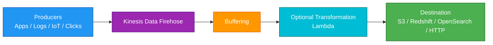
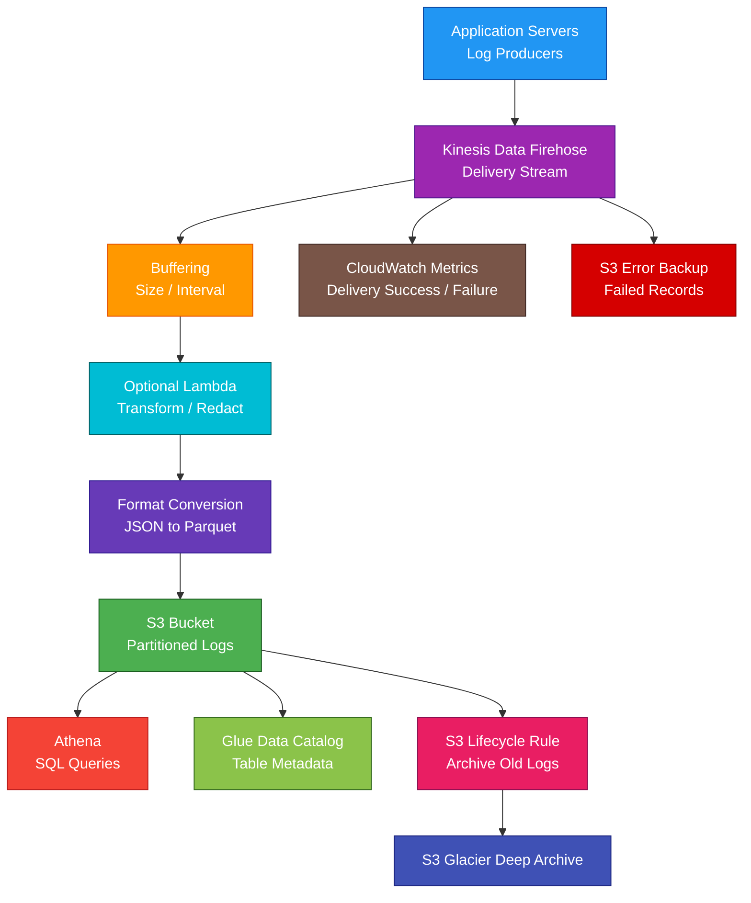

# Amazon Kinesis Data Firehose

<details>
<summary>

## 1. Definition

</summary>

### Simple Definition

Amazon Kinesis Data Firehose is a fully managed service for loading streaming data into destinations.

It collects streaming data, optionally transforms it, buffers it, and delivers it to services such as Amazon S3, Amazon Redshift, Amazon OpenSearch Service, and third-party HTTP endpoints.

### Naming Note

Amazon Kinesis Data Firehose is now commonly referred to as Amazon Data Firehose.

For the AWS SAA exam, you may still see the older name: Kinesis Data Firehose.

### Memory Hook

Firehose = Stream data into storage and analytics destinations.

### Basic Idea

Producers send streaming data to Firehose.

Firehose buffers, optionally transforms, and delivers the data to a destination.



### What It Is Best At

Kinesis Data Firehose is best for:

- Streaming data delivery
- Log delivery
- Clickstream delivery
- IoT data delivery
- Near real-time analytics ingestion
- Loading data into S3
- Loading data into Redshift
- Loading data into OpenSearch
- Sending events to HTTP endpoints or third-party tools

</details>

<details>
<summary>

## 2. What Problem Does It Solve?

</summary>

### Main Problem

Kinesis Data Firehose solves the problem of delivering streaming data to storage and analytics destinations without building and managing custom consumers.

### Without Firehose

You may need to manually manage:

- Stream consumers
- Data buffering
- Retry logic
- Batch delivery
- Data transformation
- Delivery failures
- Scaling
- Destination integration
- Error handling
- Compression and format conversion

### With Firehose

AWS manages the delivery pipeline.

You send data to Firehose, and Firehose delivers it to the configured destination.

### Key Benefit

Firehose makes streaming data delivery easy, managed, and scalable.

### Simple Example

Instead of writing custom code to collect application logs and upload them to S3, send logs to Firehose and let Firehose deliver them to S3 automatically.

</details>

<details>
<summary>

## 3. Core Use Cases

</summary>

### Log Delivery to S3

Use Firehose to deliver application, infrastructure, or security logs to S3.

Examples:

- Web server logs
- Application logs
- VPC Flow Logs
- CloudWatch Logs subscriptions
- Security logs

### Clickstream Data Delivery

Use Firehose to collect website or mobile app click events and deliver them to S3 or analytics tools.

Examples:

- Page views
- Product clicks
- Search events
- Cart activity

### Real-Time Analytics Ingestion

Use Firehose to load streaming data into analytics services.

Common destinations:

- S3 data lake
- Redshift data warehouse
- OpenSearch dashboards
- Third-party monitoring platforms

### IoT Data Delivery

Use Firehose to deliver IoT device data to storage or analytics destinations.

Examples:

- Sensor readings
- Machine metrics
- Device logs
- Telemetry events

### Security Analytics

Use Firehose to deliver security events into S3 or OpenSearch for analysis.

Examples:

- Network logs
- Application security events
- Threat detection logs
- Audit data

### Data Lake Ingestion

Use Firehose to continuously deliver raw or transformed data to S3.

Later, services such as Athena, Glue, EMR, or Redshift Spectrum can analyze the data.

### Third-Party Tool Integration

Firehose can send data to HTTP endpoints and supported third-party services.

Examples:

- Monitoring tools
- Observability platforms
- Security analytics tools
- Custom HTTP collectors

</details>

<details>
<summary>

## 4. Important Features for SAA

</summary>

### Delivery Stream

A delivery stream is the main Firehose resource.

It receives streaming data and delivers it to a destination.

### Producers

Producers send data records to Firehose.

Examples:

- Application code
- AWS SDK
- CloudWatch Logs
- IoT devices
- Kinesis Data Streams
- AWS services
- Agents running on servers

### Records

A record is one piece of data sent to Firehose.

Example:

```json
{
  "userId": "123",
  "eventType": "ProductClicked",
  "productId": "sku-789"
}
```

### Destinations

Firehose delivers data to supported destinations.

Common SAA destinations:

| Destination | Use Case |
|---|---|
| Amazon S3 | Data lake, logs, backups, raw event storage |
| Amazon Redshift | Data warehouse analytics |
| Amazon OpenSearch Service | Search, logs, dashboards |
| HTTP endpoint | Custom or third-party delivery |
| Third-party services | Observability and security tools |

### S3 Destination

S3 is the most common Firehose destination.

Use it for:

- Raw data storage
- Log archives
- Data lakes
- Long-term analytics
- Backup delivery

### Redshift Destination

Firehose can deliver data to Redshift.

Important point:

Firehose usually first delivers data to S3, then loads it into Redshift using the Redshift `COPY` command.

### OpenSearch Destination

Firehose can deliver streaming data to OpenSearch.

Use this for:

- Log analytics
- Search dashboards
- Security analytics
- Operational monitoring

### HTTP Endpoint Destination

Firehose can deliver data to HTTP endpoints.

Use it for:

- Third-party tools
- Custom APIs
- SaaS integrations
- Observability pipelines

### Buffering

Firehose buffers incoming records before delivering them.

Buffering is based on:

- Buffer size
- Buffer interval

Firehose delivers data when one of the buffer conditions is met.

### Near Real-Time Delivery

Firehose is near real-time, not instant.

Because it buffers data before delivery, there can be a short delay.

### Memory Hook

Data Streams = real-time custom processing.

Firehose = near real-time managed delivery.

### Data Transformation

Firehose can invoke Lambda to transform records before delivery.

Examples:

- Convert log format
- Add fields
- Remove sensitive data
- Enrich events
- Normalize JSON

### Format Conversion

Firehose can convert data formats before delivering to S3.

Example:

Convert JSON data to Apache Parquet or Apache ORC for analytics efficiency.

### Compression

Firehose can compress delivered data.

Common options may include:

- GZIP
- ZIP
- Snappy
- Hadoop-compatible Snappy

Compression reduces storage and transfer size.

### Dynamic Partitioning

Firehose can dynamically partition S3 data based on record fields.

Example S3 prefixes:

```text
s3://bucket/events/year=2026/month=05/day=01/
s3://bucket/events/customerId=123/
```

This helps improve query performance in services like Athena.

### Error Handling

If Firehose cannot deliver records to the destination, it can send failed records to an S3 backup location.

This helps avoid silent data loss.

### Source Options

Firehose can receive data directly or from Kinesis Data Streams.

Common patterns:

| Source | Pattern |
|---|---|
| Direct PUT | Producers send directly to Firehose |
| Kinesis Data Streams | Firehose reads from a stream and delivers to destination |
| CloudWatch Logs | Logs subscription sends records to Firehose |

### Direct PUT

With Direct PUT, applications send records directly to Firehose.

Use this when you only need managed delivery and do not need custom stream consumers.

### Kinesis Data Streams as Source

Firehose can use Kinesis Data Streams as a source.

Use this when:

- Multiple consumers need the same stream
- You need replay with Data Streams retention
- You need custom consumers and Firehose delivery together

### Firehose vs Data Streams Source Pattern

A common architecture is:

Kinesis Data Streams receives events.

Custom consumers process events.

Firehose also reads from the stream and delivers raw data to S3.

### Automatic Scaling

Firehose is fully managed and automatically scales delivery capacity.

You do not manage shards like Kinesis Data Streams.

### No Shard Management

Unlike Kinesis Data Streams, Firehose does not require shard provisioning or resharding.

This is a major exam difference.

### Backup to S3

For some destinations, Firehose can back up all records or failed records to S3.

This is useful for replay, troubleshooting, and audit.

### CloudWatch Metrics

Firehose publishes metrics to CloudWatch.

Common metrics:

- Incoming records
- Incoming bytes
- Delivery success
- Delivery failure
- Delivery latency
- Throttled records
- Lambda transformation errors

</details>

<details>
<summary>

## 5. Security Model

</summary>

### IAM Permissions

IAM controls who can create, manage, write to, and configure Firehose delivery streams.

Common permissions:

| Permission | Purpose |
|---|---|
| `firehose:CreateDeliveryStream` | Create delivery stream |
| `firehose:PutRecord` | Send one record |
| `firehose:PutRecordBatch` | Send multiple records |
| `firehose:DescribeDeliveryStream` | View delivery stream details |
| `firehose:UpdateDestination` | Modify destination |
| `firehose:DeleteDeliveryStream` | Delete delivery stream |

### Service Role

Firehose uses an IAM service role to access destination services.

Examples:

- Write objects to S3
- Invoke Lambda transformation function
- Load data into Redshift
- Write to OpenSearch
- Write failed records to S3 backup

### Producer Permissions

Producers need permission to put records into Firehose.

Common actions:

- `firehose:PutRecord`
- `firehose:PutRecordBatch`

### Destination Permissions

The Firehose service role must have permission to deliver data to the destination.

Examples:

- `s3:PutObject`
- `lambda:InvokeFunction`
- `redshift:DescribeClusters`
- OpenSearch write permissions
- KMS permissions for encrypted destinations

### Encryption in Transit

Firehose uses HTTPS endpoints for API calls.

This protects records sent from producers to Firehose.

### Encryption at Rest

Firehose can use encryption for stored and buffered data.

Destination services should also use encryption.

Examples:

- S3 SSE-S3 or SSE-KMS
- Redshift encryption
- OpenSearch encryption
- KMS keys for backup buckets

### KMS Key Permissions

If using customer managed KMS keys, make sure Firehose has permission to use the keys.

Wrong KMS permissions can cause delivery failures.

### VPC Delivery

For some destinations, Firehose can deliver data to resources in a VPC.

Use security groups, subnet configuration, and IAM roles carefully.

### Sensitive Data

Be careful sending sensitive data through Firehose.

Use Lambda transformation or preprocessing to:

- Redact sensitive fields
- Remove passwords
- Mask personal data
- Normalize records

### Least Privilege

Use least privilege for:

- Producers writing to Firehose
- Firehose service role
- Lambda transformation role
- Destination access
- KMS key usage

### Shared Responsibility

AWS is responsible for:

- Firehose managed infrastructure
- Scaling
- Delivery service operations
- Physical security
- Managed service availability

You are responsible for:

- IAM permissions
- Service role permissions
- Destination security
- KMS key policies
- Data transformation logic
- Sensitive data handling
- Monitoring failed deliveries
- Backup and retention configuration

</details>

<details>
<summary>

## 6. High Availability / Durability Behavior

</summary>

### Availability

Firehose is a fully managed service.

AWS manages scaling, infrastructure, and availability.

### Regional Service

Firehose delivery streams are regional.

You create delivery streams in a specific AWS Region.

### Multi-AZ Behavior

Firehose is managed across AWS infrastructure in a Region.

You do not configure Multi-AZ manually.

### Delivery Reliability

Firehose retries delivery when the destination is temporarily unavailable.

This helps handle transient failures.

### Failed Delivery Backup

If records cannot be delivered after retries, Firehose can write failed records to S3 backup.

This is important for troubleshooting and recovery.

### Buffering and Durability

Firehose buffers data before delivery.

For SAA, remember that Firehose is designed for managed delivery, but the long-term durable destination is usually S3, Redshift, OpenSearch, or another configured target.

### S3 Durability

When Firehose delivers to S3, the records use S3 durability.

For exam purposes, S3 is designed for 11 9s of durability.

### Multi-Region Behavior

Firehose does not automatically deliver to multiple Regions unless you design it that way.

For Multi-Region designs, use:

- Separate delivery streams in multiple Regions
- S3 Cross-Region Replication
- Producers writing to multiple Regions
- Event or stream replication patterns

### Source Stream Retention

If Firehose reads from Kinesis Data Streams, replay and retention depend on the source stream retention window.

Firehose itself is not a replayable stream like Kinesis Data Streams.

### Important Exam Point

Firehose is for managed delivery, not long-term stream retention or custom replay processing.

For replayable stream processing, use Kinesis Data Streams.

</details>

<details>
<summary>

## 7. Cost Optimization Options

</summary>

### Use Firehose Instead of Custom Consumers

Firehose can reduce operational cost by eliminating custom delivery applications.

You do not manage servers, shards, or delivery workers.

### Choose the Right Destination

For low-cost long-term storage, deliver to S3.

For searchable logs, deliver to OpenSearch only when search and dashboard features are needed.

### Use Compression

Compression can reduce S3 storage size and downstream transfer costs.

### Use Format Conversion

Convert JSON to Parquet or ORC for analytics workloads.

This can reduce Athena query cost because less data is scanned.

### Use Dynamic Partitioning

Dynamic partitioning can organize S3 data by fields such as date, region, or customer.

This can reduce query cost in Athena and improve analytics performance.

### Tune Buffer Size and Interval

Larger buffers can reduce the number of files in S3 and improve analytics efficiency.

Smaller buffers reduce delivery latency.

Choose based on:

- Latency needs
- Destination performance
- File size needs
- Query efficiency

### Avoid Unnecessary Lambda Transformations

Lambda transformations add cost.

Use them only when transformation, enrichment, filtering, or redaction is needed.

### Send Only Needed Data

Filter unnecessary records before sending to Firehose when possible.

This reduces ingestion and destination costs.

### Use S3 Lifecycle Policies

For S3 destinations, lifecycle policies can move older data to cheaper storage.

Examples:

- S3 Standard-IA
- S3 Glacier Instant Retrieval
- S3 Glacier Flexible Retrieval
- S3 Glacier Deep Archive

### Monitor Delivery Failures

Failed delivery retries and backup storage can add cost and operational work.

Fix destination issues quickly.

</details>

<details>
<summary>

## 8. Common Exam Traps

</summary>

### Firehose vs Kinesis Data Streams

This is the biggest exam trap.

| Requirement | Choose |
|---|---|
| Custom real-time consumers and replay | Kinesis Data Streams |
| Managed delivery to S3, Redshift, OpenSearch, or HTTP endpoint | Kinesis Data Firehose |

### Firehose Is Near Real-Time

Firehose buffers records before delivery.

It is not instant record-by-record processing.

### Firehose Does Not Use Shards

Unlike Kinesis Data Streams, Firehose does not require shard management.

If the question mentions managing shards, partition keys, or replay by consumers, think Kinesis Data Streams.

### Firehose Is Not a Queue

Firehose is not a message queue.

If you need queue-based decoupling where consumers poll messages, choose SQS.

### Firehose Is Not Pub/Sub

Firehose delivers to configured destinations.

If one message must fan out to many subscribers, SNS or EventBridge may be better.

### Firehose Is Not Long-Term Storage

Firehose delivers data to destinations.

It is not the final durable storage service.

Common final destination:

- S3
- Redshift
- OpenSearch
- HTTP endpoint

### Lambda Transformation Is Optional

Firehose does not require Lambda.

Use Lambda only when records need transformation before delivery.

### Redshift Delivery Uses S3 Staging

For Redshift delivery, Firehose commonly stages data in S3 and then loads it into Redshift.

### Failed Records Need S3 Backup

If delivery fails or transformation fails, use S3 backup/error output to avoid losing visibility into failed records.

### OpenSearch Is for Search and Dashboards

Do not choose OpenSearch as a cheap long-term raw data lake.

Use S3 for low-cost durable storage.

### Firehose Does Not Guarantee Strict Ordering

If strict ordered processing is required, consider Kinesis Data Streams with partition keys or SQS FIFO depending on the scenario.

### Large Payloads

For very large payloads, store the data in S3 and send references or smaller records through streaming systems.

</details>

<details>
<summary>

## 9. Compare With Similar Services

</summary>

### Service Comparison Table

| Service | Main Purpose | Best For | Choose When |
|---|---|---|---|
| Kinesis Data Firehose | Managed streaming data delivery | Loading data into S3, Redshift, OpenSearch, or HTTP endpoints | You want delivery without managing consumers |
| Kinesis Data Streams | Real-time stream processing | Custom consumers and replay | You need low-latency processing and stream retention |
| SQS | Message queue | Decoupling producers and consumers | Consumers need to process queued messages reliably |
| SNS | Pub/sub notifications | Fanout messaging | One message should notify many subscribers |
| EventBridge | Event routing | Application and SaaS event integration | You need event rules, filtering, schedules, or routing |
| AWS Glue | ETL and data catalog | Batch data transformation | You need managed ETL jobs and cataloging |

### Firehose vs Kinesis Data Streams

| Feature | Firehose | Data Streams |
|---|---|---|
| Main purpose | Deliver streaming data | Process streaming data |
| Consumers | Managed by AWS | You build/manage consumers |
| Replay | Not the main feature | Yes, within retention |
| Shards | No shard management | Shard-based capacity |
| Latency | Near real-time, buffered | Low-latency real-time |
| Best for | S3/Redshift/OpenSearch delivery | Custom real-time processing |

### Firehose vs SQS

| Feature | Firehose | SQS |
|---|---|---|
| Main purpose | Stream delivery | Message queue |
| Consumer model | Firehose delivers to destination | Consumers poll messages |
| Best for | Logs/events to analytics destinations | Decoupling app components |
| Replay | Not queue-like | Messages stay until processed or expire |
| Ordering | Not strict | FIFO queue supports ordering |

### Firehose vs SNS

| Feature | Firehose | SNS |
|---|---|---|
| Main purpose | Deliver data to destinations | Publish messages to subscribers |
| Delivery target | S3, Redshift, OpenSearch, HTTP | SQS, Lambda, email, HTTP, mobile push |
| Fanout | Not primary purpose | Main purpose |
| Best for | Streaming ingestion pipelines | Notifications and pub/sub |

### Firehose vs EventBridge

| Feature | Firehose | EventBridge |
|---|---|---|
| Main purpose | Streaming data delivery | Event routing |
| Filtering | Limited compared with EventBridge | Strong rule-based filtering |
| Destinations | Analytics/storage destinations | Many AWS service targets |
| Best for | Logs and data streams to destinations | Application events and SaaS integration |

### Firehose vs AWS Glue

| Feature | Firehose | AWS Glue |
|---|---|---|
| Processing style | Streaming delivery | Batch or serverless ETL |
| Transformation | Lightweight Lambda transformation | More advanced ETL jobs |
| Best for | Continuous ingestion | Data preparation and cataloging |
| Common use together | Firehose writes to S3 | Glue catalogs/transforms S3 data |

### When to Choose Kinesis Data Firehose

Choose Firehose when:

- You need managed streaming data delivery
- You want to deliver logs or events to S3
- You want to load streaming data into Redshift
- You want searchable logs in OpenSearch
- You want to send events to an HTTP endpoint
- You do not want to manage stream consumers
- You do not need replayable custom stream processing
- You want buffering, retry, compression, and optional transformation managed for you

</details>

<details>
<summary>

## 10. Mini Architecture Example

</summary>

### Scenario

A company wants to collect application logs from many servers and store them in S3 for long-term analytics.

The company also wants the logs converted to a query-efficient format and partitioned by date.

### Architecture

Applications send logs to Kinesis Data Firehose.

Firehose buffers the records.

A Lambda function optionally transforms the logs.

Firehose converts the data to Parquet and stores it in S3 using date-based prefixes.

Athena queries the S3 data.



### Why This Is Good

- Firehose handles streaming log delivery automatically
- No custom consumers or shard management are required
- Buffering improves delivery efficiency
- Lambda can transform or redact sensitive fields
- Parquet improves query efficiency
- S3 provides durable long-term storage
- Athena can query logs using SQL
- Glue Data Catalog stores table metadata
- Lifecycle rules reduce old log storage cost
- Failed records are backed up for troubleshooting

### Exam Answer Pattern

If the question says:

“Load streaming data into S3, Redshift, OpenSearch, or an HTTP endpoint with minimal management.”

Think:

Kinesis Data Firehose.

If the question says:

“Process streaming data with custom consumers and replay records.”

Think:

Kinesis Data Streams.

If the question says:

“Decouple producers and consumers with a queue.”

Think:

SQS.

If the question says:

“Route application events based on rules.”

Think:

EventBridge.

### Final Memory Hook

Firehose = Managed delivery.

Data Streams = Custom real-time stream processing.

Firehose has no shard management.

Firehose buffers before delivery.

Lambda transformation is optional.

S3 is the most common destination.

Redshift delivery commonly uses S3 staging.

OpenSearch is for search and dashboards.

Compression saves storage.

Parquet/ORC improves analytics.

Failed records should go to S3 backup.

</details>