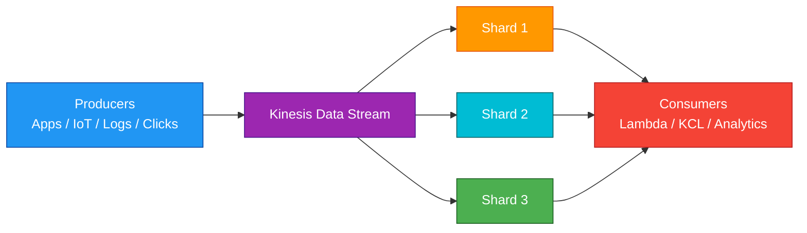
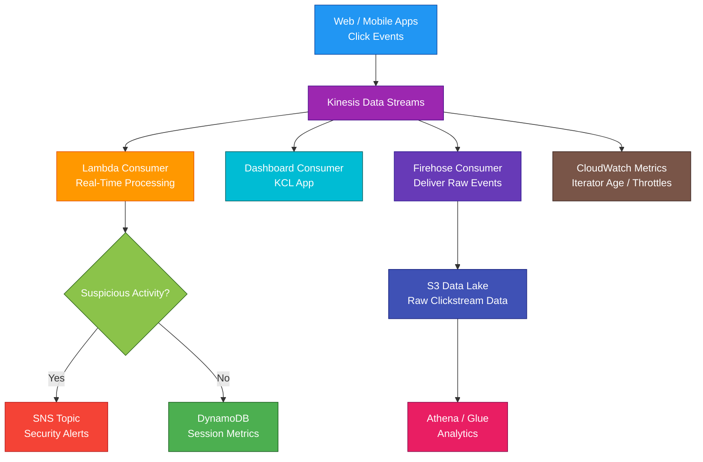

# Amazon Kinesis Data Streams

<details>
<summary>

## 1. Definition

</summary>

### Simple Definition

Amazon Kinesis Data Streams is a managed real-time data streaming service.

It collects, stores, and processes large streams of data records in near real time.

### Memory Hook

Kinesis Data Streams = Real-time stream of records.

### Basic Idea

Applications, devices, or services send records into a stream.

Consumers read those records and process them in real time.



### What It Is Best At

Kinesis Data Streams is best for:

- Real-time data ingestion
- Real-time analytics
- Log and event streaming
- Clickstream processing
- IoT telemetry
- Application event processing
- Streaming data pipelines

</details>

<details>
<summary>

## 2. What Problem Does It Solve?

</summary>

### Main Problem

Kinesis Data Streams solves the problem of collecting and processing continuous data in real time.

Instead of waiting for batch jobs, applications can process events almost immediately after they happen.

### Without Kinesis Data Streams

You may have problems such as:

- Delayed batch processing
- Lost real-time insights
- Hard-to-scale event ingestion
- Custom streaming infrastructure
- Difficulty handling many producers
- Difficulty handling multiple consumers
- No replay of recent events

### With Kinesis Data Streams

You can continuously ingest records and allow one or more consumers to process them.

### Key Benefit

Kinesis Data Streams gives you scalable, replayable, real-time streaming data.

</details>

<details>
<summary>

## 3. Core Use Cases

</summary>

### Clickstream Analytics

Capture user clicks from websites or mobile apps.

Examples:

- Page views
- Button clicks
- Search terms
- Shopping cart events

### Real-Time Log Processing

Stream logs from applications or infrastructure.

Examples:

- Web server logs
- Application logs
- Security logs
- API request logs

### IoT Data Ingestion

Collect telemetry from devices.

Examples:

- Sensor readings
- Device health
- GPS locations
- Machine metrics

### Real-Time Metrics

Process operational metrics in real time.

Examples:

- Application latency
- Error counts
- User activity
- System health

### Fraud Detection

Analyze transaction events as they happen.

Example:

A payment event is streamed to Kinesis and checked for suspicious behavior.

### Event-Driven Applications

Use Kinesis Data Streams when multiple services need to consume the same ordered event stream.

### Data Lake Ingestion

Stream data into processing systems and then store processed or raw data in S3.

Common pattern:

Kinesis Data Streams → Lambda / Firehose / Flink → S3

</details>

<details>
<summary>

## 4. Important Features for SAA

</summary>

### Stream

A stream is the main Kinesis Data Streams resource.

It stores incoming records for a retention period so consumers can read them.

### Record

A record is one unit of data in a stream.

A record includes:

- Data blob
- Partition key
- Sequence number

### Data Blob

The data blob is the actual payload.

Example:

```json
{
  "userId": "123",
  "eventType": "PageViewed",
  "page": "/products"
}
```

### Partition Key

The partition key determines which shard receives the record.

Important point:

Records with the same partition key go to the same shard.

### Sequence Number

Kinesis assigns a sequence number to each record.

This helps identify the order of records within a shard.

### Shard

A shard is a unit of capacity inside a stream.

Each shard provides a fixed amount of read and write throughput.

### Shard Capacity

For SAA, remember the common shard limits:

| Per Shard Capacity | Limit |
|---|---:|
| Write throughput | 1 MB/sec |
| Write records | 1,000 records/sec |
| Shared read throughput | 2 MB/sec |
| Enhanced fan-out read throughput | 2 MB/sec per consumer |

### Ordering

Kinesis Data Streams preserves ordering within a shard.

Important exam point:

Ordering is guaranteed only for records with the same partition key in the same shard.

### Producers

A producer writes records to a stream.

Examples:

- Application code
- IoT devices
- AWS SDK
- Kinesis Producer Library
- CloudWatch Logs subscription
- AWS services

### Consumers

A consumer reads records from a stream.

Examples:

- AWS Lambda
- Kinesis Client Library application
- Amazon Data Firehose
- Managed Service for Apache Flink
- Custom application using AWS SDK

### Kinesis Client Library

Kinesis Client Library, or KCL, helps build stream processing applications.

It handles:

- Reading from shards
- Checkpointing
- Load balancing across workers
- Shard coordination
- Resharding changes

### Checkpointing

Checkpointing records how far a consumer has processed in the stream.

This helps consumers resume processing after failure.

### Lambda Consumer

Lambda can be triggered by Kinesis Data Streams.

Lambda polls the stream and invokes the function with batches of records.

Use this for serverless stream processing.

### Batch Processing with Lambda

Lambda receives records in batches.

This improves efficiency but means your function should handle batch failure carefully.

### Shared Throughput Consumer

By default, consumers share the shard’s read throughput.

If multiple consumers read from the same shard, they share the 2 MB/sec read capacity.

### Enhanced Fan-Out

Enhanced fan-out gives each registered consumer dedicated read throughput from each shard.

Use it when:

- Multiple consumers need low-latency reads
- Consumers should not compete for read throughput
- Real-time processing latency matters

### Retention Period

Kinesis Data Streams stores records for a retention period.

Default retention is 24 hours.

Retention can be increased for longer replay windows.

### Replay

Consumers can re-read records within the retention window.

This is useful for:

- Reprocessing
- Recovering from consumer failure
- Debugging
- Building new consumers

### Capacity Modes

Kinesis Data Streams has two capacity modes.

| Capacity Mode | Best For |
|---|---|
| On-Demand | Unknown or variable traffic |
| Provisioned | Predictable traffic and manual shard control |

### On-Demand Mode

On-Demand mode automatically scales stream capacity.

Use it when traffic is unpredictable or you want less capacity management.

### Provisioned Mode

Provisioned mode requires you to manage shard count.

Use it when traffic is predictable and you want more control over throughput and cost.

### Resharding

Resharding changes the number of shards in a stream.

Common operations:

- Split shard
- Merge shards
- Update shard count

Use resharding to increase or decrease stream capacity in provisioned mode.

### Hot Shard

A hot shard happens when too much traffic goes to one shard.

This often happens because partition keys are not evenly distributed.

### Good Partition Key Design

Choose partition keys that spread records evenly.

Good examples:

- User ID if many users exist
- Device ID if many devices exist
- Randomized key for very high-volume events

Bad example:

Using the same partition key for all records.

### Kinesis Producer Library

Kinesis Producer Library, or KPL, helps optimize producer writes.

It can improve throughput using batching and aggregation.

### Kinesis Data Streams vs Data Firehose

Kinesis Data Streams stores a stream for consumers to process.

Kinesis Data Firehose delivers data to destinations like S3, Redshift, OpenSearch, and third-party services.

Memory hook:

- Data Streams = Real-time stream processing
- Firehose = Load streaming data into destinations

</details>

<details>
<summary>

## 5. Security Model

</summary>

### IAM Permissions

IAM controls who can create, manage, read from, and write to streams.

Common permissions:

| Permission | Purpose |
|---|---|
| `kinesis:CreateStream` | Create a stream |
| `kinesis:PutRecord` | Write one record |
| `kinesis:PutRecords` | Write multiple records |
| `kinesis:GetRecords` | Read records |
| `kinesis:GetShardIterator` | Get position for reading |
| `kinesis:DescribeStream` | View stream details |
| `kinesis:RegisterStreamConsumer` | Register enhanced fan-out consumer |

### Producer Permissions

Producers need permission to write records.

Common actions:

- `kinesis:PutRecord`
- `kinesis:PutRecords`

### Consumer Permissions

Consumers need permission to read records.

Common actions:

- `kinesis:GetRecords`
- `kinesis:GetShardIterator`
- `kinesis:DescribeStream`

### Encryption in Transit

Kinesis Data Streams uses HTTPS endpoints for API calls.

This protects data moving between producers, consumers, and Kinesis.

### Encryption at Rest

Kinesis Data Streams supports server-side encryption using AWS KMS.

This protects stored stream data.

### KMS Key Permissions

If using a customer managed KMS key, make sure producers and consumers have the correct KMS permissions.

Wrong KMS permissions can break reads or writes.

### VPC Endpoints

You can use VPC interface endpoints powered by AWS PrivateLink to access Kinesis privately from a VPC.

This avoids sending traffic over the public internet.

### Least Privilege

Give producers and consumers only the permissions they need.

Example:

A producer should not need permission to delete streams.

### Data Sensitivity

Avoid sending sensitive data unless required.

If sensitive data is streamed:

- Use encryption
- Restrict IAM access
- Monitor access with CloudTrail
- Control downstream consumers carefully

### CloudTrail Auditing

CloudTrail can record Kinesis API activity.

Use it for auditing management and data access patterns.

### Shared Responsibility

AWS is responsible for:

- Kinesis managed service infrastructure
- Stream storage infrastructure
- Managed scaling infrastructure
- Physical security
- Service availability

You are responsible for:

- IAM permissions
- KMS key policies
- Producer and consumer security
- VPC endpoint policies
- Data classification
- Retention settings
- Monitoring stream usage
- Handling failed records

</details>

<details>
<summary>

## 6. High Availability / Durability Behavior

</summary>

### Availability

Kinesis Data Streams is a managed regional service.

AWS manages the underlying infrastructure for availability and scaling.

### Multi-AZ Behavior

Kinesis Data Streams stores data across multiple Availability Zones in a Region.

You do not manually configure Multi-AZ.

### Regional Service

A stream is created in one AWS Region.

Applications that use the stream should connect to that Region.

### Durability

Records are stored durably within the configured retention period.

After the retention period expires, records are removed.

### Replay Durability Window

Consumers can replay records only while they are still inside the retention period.

If records expire, they cannot be replayed from the stream.

### Producer Retry Behavior

Producers should retry failed writes.

Use retry logic with exponential backoff for throttling or temporary failures.

### Consumer Failure Recovery

Consumers can resume processing using checkpointing.

This is common with KCL-based applications.

### Lambda Failure Handling

When Lambda processes Kinesis records, failed batches can be retried.

Configure failure handling carefully to avoid blocking shard progress.

Useful options may include:

- Bisect batch on error
- Maximum retry attempts
- Maximum record age
- Destination for failed records

### Enhanced Fan-Out Availability

Enhanced fan-out gives dedicated throughput to consumers.

This improves consumer isolation because one consumer does not take read capacity from another consumer.

### Multi-Region Behavior

Kinesis Data Streams is not automatically Multi-Region.

For Multi-Region designs, use:

- Separate streams in multiple Regions
- Cross-Region producers
- Lambda replication
- Application-level replication
- EventBridge or other routing services where appropriate

### Important Exam Point

Kinesis Data Streams is highly available inside a Region, but you must design Multi-Region streaming separately.

</details>

<details>
<summary>

## 7. Cost Optimization Options

</summary>

### Choose the Right Capacity Mode

Use the capacity mode that matches traffic patterns.

| Workload Pattern | Better Option |
|---|---|
| Unknown or spiky traffic | On-Demand |
| Predictable traffic | Provisioned |
| New application | On-Demand |
| Mature steady workload | Provisioned |

### Right-Size Shards

In provisioned mode, shard count affects cost.

Too many shards waste money.

Too few shards cause throttling.

### Avoid Hot Shards

Bad partition keys can overload one shard while others are underused.

Use evenly distributed partition keys to use shard capacity efficiently.

### Use PutRecords

Use `PutRecords` to send multiple records in one API call.

This can improve efficiency compared with many single `PutRecord` calls.

### Use KPL for High-Volume Producers

Kinesis Producer Library can batch and aggregate records.

This can improve throughput and reduce inefficient API usage.

### Use Enhanced Fan-Out Only When Needed

Enhanced fan-out gives dedicated throughput but adds cost.

Use it when consumers need low latency or independent read throughput.

### Control Retention Period

Longer retention increases cost.

Use longer retention only when you need replay or delayed processing.

### Compress Data

Compress records when appropriate to reduce data size.

Smaller records can reduce throughput pressure.

### Avoid Oversized Records

Large records consume more throughput.

For very large payloads, store the data in S3 and put the S3 object reference in the stream.

### Monitor with CloudWatch

Monitor:

- Incoming bytes
- Incoming records
- Write throttles
- Read throttles
- Iterator age
- Get records latency
- Put record success/failure

</details>

<details>
<summary>

## 8. Common Exam Traps

</summary>

### Kinesis Data Streams vs Data Firehose

This is the biggest exam trap.

| Requirement | Choose |
|---|---|
| Real-time custom processing and replay | Kinesis Data Streams |
| Load streaming data into S3/Redshift/OpenSearch without managing consumers | Kinesis Data Firehose |

### Streams Store Data Temporarily

Kinesis Data Streams is not permanent storage.

Records expire after the retention period.

For long-term storage, send data to S3 or another durable store.

### Ordering Is Per Shard

Kinesis does not guarantee global ordering across the whole stream.

Ordering is guaranteed only within a shard.

### Same Partition Key Means Same Shard

Records with the same partition key go to the same shard.

This helps ordering but can cause hot shards if overused.

### Hot Shards Cause Throttling

If one partition key receives too much traffic, one shard can be overloaded.

Use better partition key distribution.

### More Consumers Can Compete for Read Throughput

With shared throughput, consumers share the shard read capacity.

Use enhanced fan-out if each consumer needs dedicated throughput.

### Kinesis Is Not SQS

SQS is a queue where messages are usually processed and deleted.

Kinesis is a stream where multiple consumers can read and replay records within retention.

### Kinesis Is Not SNS

SNS is pub/sub push messaging.

Kinesis is streaming data ingestion and processing.

### Kinesis Is Not EventBridge

EventBridge is event routing and integration.

Kinesis Data Streams is high-throughput streaming data processing.

### Lambda Batch Failures Can Block Progress

If Lambda keeps failing on a bad record, processing for that shard can be delayed.

Use failure handling settings.

### Shard Count Matters in Provisioned Mode

In provisioned mode, you must manage enough shards for write and read throughput.

### Retention Is Not Infinite

If consumers fall too far behind and records expire, data is lost from the stream.

Monitor iterator age.

</details>

<details>
<summary>

## 9. Compare With Similar Services

</summary>

### Service Comparison Table

| Service | Main Purpose | Best For | Choose When |
|---|---|---|---|
| Kinesis Data Streams | Real-time streaming data | Custom real-time processing and replay | You need low-latency stream consumers |
| Kinesis Data Firehose | Stream delivery | Loading data into S3, Redshift, OpenSearch, or third-party destinations | You want managed delivery without custom consumers |
| SQS | Message queue | Decoupling producers and consumers | You need reliable queue-based processing |
| SNS | Pub/sub notifications | Fanout to many subscribers | One message should notify many systems |
| EventBridge | Event routing | Application and SaaS event integration | You need rules, filtering, and event bus routing |
| Amazon MSK | Managed Kafka | Kafka-compatible streaming | You need Apache Kafka APIs and ecosystem |

### Kinesis Data Streams vs Data Firehose

| Feature | Data Streams | Data Firehose |
|---|---|---|
| Main purpose | Real-time stream processing | Stream delivery |
| Consumers | You build/manage consumers | AWS manages delivery |
| Replay | Yes, within retention | Not the main feature |
| Latency | Low | Near real time, buffered |
| Destinations | Consumers decide | S3, Redshift, OpenSearch, HTTP endpoints, partners |
| Exam clue | Custom consumers need to process stream | Deliver logs/data to S3 easily |

### Kinesis Data Streams vs SQS

| Feature | Kinesis Data Streams | SQS |
|---|---|---|
| Data model | Stream | Queue |
| Message retention | Time-based stream retention | Queue message retention |
| Consumers | Multiple consumers can read same records | Messages are processed and deleted |
| Ordering | Per shard | FIFO queues support strict ordering |
| Replay | Yes, within retention | Not after delete |
| Best for | Streaming analytics | Decoupled work queues |

### Kinesis Data Streams vs SNS

| Feature | Kinesis Data Streams | SNS |
|---|---|---|
| Main purpose | Streaming records | Pub/sub notifications |
| Delivery model | Consumers pull/poll stream | Push to subscribers |
| Replay | Yes, within retention | No normal replay |
| Ordering | Per shard | FIFO topics support ordering in specific use cases |
| Best for | Real-time data pipelines | Fanout notifications |

### Kinesis Data Streams vs EventBridge

| Feature | Kinesis Data Streams | EventBridge |
|---|---|---|
| Main purpose | High-throughput streaming | Event routing |
| Event filtering | Consumer-side or app logic | Rule-based event patterns |
| Replay | Retention-based replay | Archive and replay |
| Throughput pattern | Streaming data | Application events |
| Best for | Clickstreams, logs, telemetry | App integration, SaaS events, schedules |

### Kinesis Data Streams vs Amazon MSK

| Feature | Kinesis Data Streams | Amazon MSK |
|---|---|---|
| Engine | AWS-native streaming | Managed Apache Kafka |
| Operations | More AWS-managed | Kafka cluster concepts |
| API compatibility | Kinesis APIs | Kafka APIs |
| Best for | AWS-native streaming apps | Existing Kafka workloads |
| Exam clue | Simple AWS stream processing | Kafka ecosystem required |

### When to Choose Kinesis Data Streams

Choose Kinesis Data Streams when:

- You need real-time streaming ingestion
- You need multiple consumers to process the same stream
- You need replay within a retention window
- You need ordered processing per partition key
- You need custom stream processing logic
- You need low-latency event processing
- You need to process clickstreams, logs, IoT telemetry, or application events at scale

</details>

<details>
<summary>

## 10. Mini Architecture Example

</summary>

### Scenario

A company wants to process website clickstream events in near real time.

The application must analyze user behavior, detect suspicious activity, and store raw events for long-term analytics.

### Architecture

Web and mobile apps send click events to Kinesis Data Streams.

Lambda processes events in near real time.

Suspicious events are sent to an alerting system.

Raw events are delivered to S3 for analytics.

A separate consumer reads the same stream for real-time dashboards.



### Why This Is Good

- Kinesis Data Streams ingests high-volume click events
- Lambda processes events in near real time
- Multiple consumers can read the same stream
- Suspicious events can trigger alerts
- Raw events are stored in S3 for long-term analytics
- DynamoDB can store real-time session metrics
- CloudWatch monitors stream health and consumer lag
- Consumers can replay records within the retention period

### Exam Answer Pattern

If the question says:

“Collect and process streaming data in real time with custom consumers and replay capability.”

Think:

Amazon Kinesis Data Streams.

If the question says:

“Deliver streaming data directly to S3, Redshift, OpenSearch, or third-party destinations with minimal management.”

Think:

Kinesis Data Firehose.

If the question says:

“Decouple application components using a message queue.”

Think:

SQS.

### Final Memory Hook

Kinesis Data Streams = Real-time stream processing.

Shard = Unit of stream capacity.

Partition key = Chooses shard.

Ordering = Guaranteed within a shard.

Producer = Writes records.

Consumer = Reads records.

Retention = Replay window.

Enhanced fan-out = Dedicated read throughput.

On-Demand = Automatic capacity.

Provisioned = You manage shards.

Firehose = Managed delivery to destinations.

SQS = Queue.

SNS = Pub/sub.

EventBridge = Event routing.

</details>