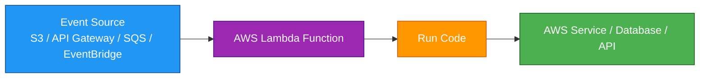
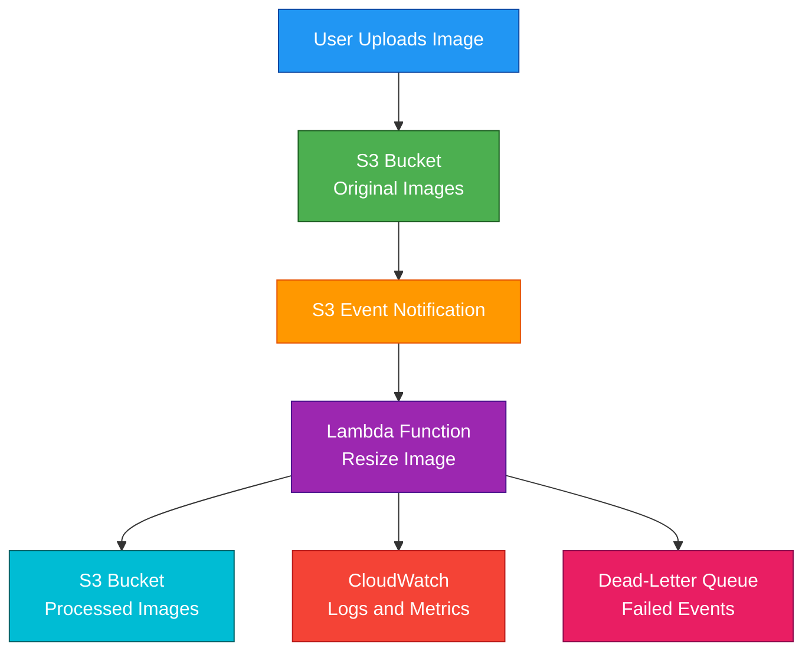

# AWS Lambda

## 1. Definition

### Simple Definition

AWS Lambda is a serverless compute service that runs your code without you managing servers.

You upload code, choose a runtime, configure a trigger, and Lambda runs the code when an event happens.

### Memory Hook

Lambda = Run code when something happens.

### Basic Idea

Instead of running an EC2 server 24/7, Lambda runs only when needed.

You pay mainly for the number of requests and the time your code runs.

## 2. What Problem Does It Solve?

### Main Problem

Lambda solves the problem of running backend code without managing servers, operating systems, scaling, or patching.

### Without Lambda

You may need to manage:

- EC2 instances
- Operating system patches
- Auto Scaling groups
- Load balancers
- Server capacity
- Runtime installation
- High availability setup

### With Lambda

AWS manages the compute infrastructure.

You focus on writing code and connecting it to events.

### Key Benefit

Lambda is best for event-driven, short-running, automatically scaling workloads.

## 3. Core Use Cases

### Serverless APIs

Use Lambda behind API Gateway to build REST, HTTP, or WebSocket APIs.

Example:

- Client calls API Gateway
- API Gateway invokes Lambda
- Lambda returns the response

### Event Processing

Lambda can process events from AWS services.

Examples:

- S3 object uploaded
- DynamoDB table updated
- EventBridge rule triggered
- SNS message published

### Queue Processing

Lambda can poll SQS queues and process messages automatically.

This is useful for background jobs and decoupled processing.

### File Processing

Common file workflows:

- Resize images uploaded to S3
- Process CSV files
- Generate thumbnails
- Validate documents

### Scheduled Jobs

EventBridge can trigger Lambda on a schedule.

Examples:

- Run cleanup every night
- Send daily reports
- Check system health every 5 minutes

### Automation

Lambda is often used for cloud automation.

Examples:

- Stop unused EC2 instances
- Rotate resources
- Respond to CloudWatch alarms
- Update tags automatically

### Lightweight Backend Logic

Lambda is good for small backend tasks that do not need a continuously running server.

## 4. Important Features for SAA

### Function

A Lambda function is the unit of code that AWS runs.

It includes:

- Runtime
- Handler
- Code package or container image
- Memory setting
- Timeout setting
- IAM execution role
- Environment variables

### Runtime

A runtime is the language environment for your function.

Examples:

- Node.js
- Python
- Java
- .NET
- Go
- Ruby
- Custom runtime

### Handler

The handler is the entry point for the Lambda function.

It is the method Lambda calls when the function starts.

### Event Source

An event source is the service or system that triggers Lambda.

Common event sources:

| Event Source | Example |
|---|---|
| API Gateway | HTTP API request |
| S3 | Object upload |
| SQS | Message in queue |
| SNS | Notification message |
| EventBridge | Scheduled event or event rule |
| DynamoDB Streams | Table item changes |
| Kinesis | Stream records |
| ALB | HTTP request through load balancer |

### Invocation Types

Lambda supports different invocation types.

| Invocation Type | Description | Example |
|---|---|---|
| Synchronous | Caller waits for response | API Gateway to Lambda |
| Asynchronous | Event is queued and Lambda runs later | S3 event to Lambda |
| Poll-Based | Lambda polls source for records | SQS, Kinesis, DynamoDB Streams |

### Synchronous Invocation

The caller waits for Lambda to finish and return a response.

Common examples:

- API Gateway
- Application Load Balancer
- Direct SDK call

### Asynchronous Invocation

Lambda queues the event and returns immediately.

If processing fails, Lambda retries automatically.

Common examples:

- S3 events
- SNS
- EventBridge

### Poll-Based Invocation

Lambda polls the event source and invokes the function with batches of records.

Common examples:

- SQS
- Kinesis Data Streams
- DynamoDB Streams

### Timeout

Lambda has a maximum execution timeout of 15 minutes.

If the function runs longer than the configured timeout, Lambda stops it.

Exam tip:

For workloads longer than 15 minutes, consider ECS, EC2, AWS Batch, or Step Functions depending on the use case.

### Memory and CPU

You configure memory for a Lambda function.

More memory also gives the function more CPU power.

Exam tip:

Increasing memory can sometimes reduce execution time and improve performance.

### Ephemeral Storage

Lambda provides temporary storage in the `/tmp` directory.

Use it for temporary files during function execution.

Do not use it for durable storage.

### Environment Variables

Environment variables store configuration values.

Examples:

- Table name
- Bucket name
- API endpoint
- Feature flag

Do not store plaintext secrets in environment variables.

Use Secrets Manager or Systems Manager Parameter Store for secrets.

### Layers

Lambda Layers let you share code, libraries, or dependencies across multiple functions.

Use layers for:

- Common libraries
- Shared utilities
- Runtime dependencies

### Versions

A version is an immutable snapshot of a Lambda function.

After publishing a version, the code and configuration for that version do not change.

### Aliases

An alias points to a Lambda version.

Examples:

- `dev`
- `test`
- `prod`

Aliases are useful for safe deployments and traffic shifting.

### Reserved Concurrency

Reserved concurrency guarantees a specific amount of concurrency for a function.

It also limits the maximum concurrency that function can use.

Use it to:

- Protect critical functions
- Prevent one function from using all account concurrency
- Limit pressure on downstream systems

### Provisioned Concurrency

Provisioned concurrency keeps function environments initialized and ready.

Use it to reduce cold starts for latency-sensitive applications.

### Cold Start

A cold start happens when Lambda creates a new execution environment before running your code.

Cold starts can add latency.

Common ways to reduce cold starts:

- Use provisioned concurrency
- Keep deployment package small
- Avoid unnecessary dependencies
- Use efficient initialization code

### Dead-Letter Queue

For asynchronous invocations, Lambda can send failed events to a dead-letter queue.

Supported DLQ targets include:

- SQS
- SNS

### Lambda Destinations

Lambda destinations can send invocation results to another service after success or failure.

Destinations are often more flexible than DLQs.

Common targets:

- SQS
- SNS
- EventBridge
- Lambda

### Event Source Mapping

Event source mapping connects Lambda to poll-based sources.

Examples:

- SQS queue
- Kinesis stream
- DynamoDB stream

It controls settings such as:

- Batch size
- Retry behavior
- Maximum batching window
- Failure handling

### Container Image Support

Lambda can run functions packaged as container images.

This is useful when you need larger dependencies or container-based packaging.

Important exam point:

Lambda container images still run on Lambda, not on ECS or EKS.

## 5. Security Model

### IAM Execution Role

Every Lambda function has an execution role.

This IAM role gives the function permission to call AWS services.

Example:

A Lambda function that writes to DynamoDB needs permission such as `dynamodb:PutItem`.

### Least Privilege

Give Lambda only the permissions it needs.

Avoid broad permissions like `*:*`.

### Resource-Based Policies

Lambda supports resource-based policies.

These allow other AWS services or accounts to invoke the function.

Example:

Allow API Gateway or S3 to invoke a Lambda function.

### IAM Permissions for Managing Lambda

IAM also controls who can create, update, delete, and invoke Lambda functions.

Common permissions:

| Permission | Purpose |
|---|---|
| `lambda:CreateFunction` | Create a function |
| `lambda:UpdateFunctionCode` | Update function code |
| `lambda:InvokeFunction` | Invoke a function |
| `lambda:DeleteFunction` | Delete a function |
| `lambda:AddPermission` | Add resource-based permissions |

### Secrets Management

Do not hardcode secrets in Lambda code.

Use:

- AWS Secrets Manager
- Systems Manager Parameter Store
- KMS-encrypted environment variables

### Encryption at Rest

Lambda encrypts environment variables at rest.

You can use AWS managed keys or customer managed KMS keys.

### Encryption in Transit

Use HTTPS/TLS when Lambda calls external services or AWS APIs.

### VPC Access

Lambda can be configured to access resources inside a VPC.

Examples:

- RDS database in private subnet
- ElastiCache cluster
- Internal service behind private load balancer

### Lambda in a VPC

When Lambda is attached to a VPC, it uses elastic network interfaces to access VPC resources.

Important exam point:

Putting Lambda in a VPC is needed only when it must access private VPC resources.

### Internet Access from VPC Lambda

A Lambda function inside private subnets does not automatically have internet access.

For outbound internet access, it needs a route through a NAT Gateway or NAT instance.

### Security Groups

When Lambda is placed in a VPC, you attach security groups to control network access.

Example:

Allow Lambda security group to connect to RDS on port `5432` or `3306`.

### Shared Responsibility

AWS is responsible for:

- Lambda infrastructure
- Scaling infrastructure
- Runtime patching for managed runtimes
- Availability of the managed service
- Physical security

You are responsible for:

- Function code
- IAM permissions
- Secrets handling
- VPC configuration
- Dependency management
- Input validation
- Logging and monitoring

## 6. High Availability / Durability Behavior

### Availability

Lambda is a fully managed regional service.

AWS runs Lambda across multiple Availability Zones in a Region.

### Fault Tolerance

Lambda automatically manages infrastructure failures.

You do not manage servers, clusters, or Auto Scaling groups.

### Automatic Scaling

Lambda automatically scales by running more function instances when more events arrive.

Example:

If many API requests arrive at once, Lambda can run multiple executions in parallel.

### Multi-AZ Behavior

Lambda runs across multiple Availability Zones automatically.

You do not configure Multi-AZ for Lambda itself.

### Multi-Region Behavior

Lambda functions are regional.

For Multi-Region applications, deploy the function separately in each Region.

Use services like Route 53, CloudFront, Global Accelerator, or EventBridge global endpoints depending on the architecture.

### Durability

Lambda is compute, not storage.

It does not provide durable storage for application data.

Use durable services such as:

- S3
- DynamoDB
- RDS
- EFS
- SQS

### Retry Behavior

Retry behavior depends on invocation type.

| Invocation Type | Retry Behavior |
|---|---|
| Synchronous | Caller handles retries |
| Asynchronous | Lambda retries failed events |
| SQS event source | Message returns to queue after visibility timeout |
| Kinesis/DynamoDB Streams | Lambda retries records until success or expiration/settings |

### Failure Handling

Common failure handling options:

- Dead-letter queues
- Lambda destinations
- SQS redrive policies
- Partial batch response for SQS
- CloudWatch alarms

### Stateless Design

Lambda functions should be stateless.

Do not rely on local memory or `/tmp` for long-term state.

Store persistent state in services like DynamoDB, S3, or RDS.

## 7. Cost Optimization Options

### Pay Only When Code Runs

Lambda charges are based mainly on:

- Number of requests
- Execution duration
- Memory configured

This makes Lambda cost-effective for intermittent workloads.

### Right-Size Memory

Memory affects CPU power.

Sometimes increasing memory reduces runtime enough to lower total cost.

Test different memory settings to find the best balance.

### Reduce Execution Time

Optimize code to finish faster.

Examples:

- Reuse SDK clients outside the handler
- Avoid unnecessary network calls
- Reduce package size
- Use efficient libraries
- Cache small reusable data when safe

### Use Appropriate Concurrency

Reserved concurrency can protect downstream systems from too much traffic.

Provisioned concurrency reduces cold starts but adds cost.

Use provisioned concurrency only for latency-sensitive workloads.

### Avoid Long-Running Tasks

Lambda has a maximum runtime of 15 minutes.

For long-running or continuously running workloads, consider:

- ECS
- EC2
- AWS Batch
- Step Functions

### Use SQS for Spiky Workloads

Put SQS in front of Lambda to buffer spikes.

This protects downstream systems and smooths processing.

### Control Logging Costs

Lambda logs to CloudWatch Logs.

High-volume logging can become expensive.

Use appropriate log levels and retention policies.

### Avoid Unnecessary VPC Configuration

Only put Lambda in a VPC when it needs access to private VPC resources.

Unnecessary VPC configuration can add complexity.

### Choose Architecture Carefully

Lambda is great for event-driven workloads.

For steady, always-on, high-throughput workloads, containers or EC2 may be more cost-effective.

## 8. Common Exam Traps

### Lambda Is Not for Long-Running Workloads

Lambda has a maximum execution time of 15 minutes.

If the exam describes a task that runs for hours, choose another service.

### Lambda Is Regional

Lambda functions are created in a specific Region.

They are not automatically global.

### Lambda Is Stateless

Do not store durable application state inside the function environment.

Use S3, DynamoDB, RDS, or another durable store.

### `/tmp` Is Temporary

The `/tmp` directory is temporary storage for the execution environment.

It may be reused, but it is not reliable durable storage.

### VPC Lambda Does Not Automatically Have Internet

If Lambda is attached to private VPC subnets, it needs NAT Gateway or NAT instance for outbound internet access.

### Security Group Needed for VPC Resources

If Lambda must access RDS in a VPC, configure:

- Lambda VPC settings
- Subnets
- Security groups
- RDS security group rules

### API Gateway Timeout vs Lambda Timeout

Lambda can run up to 15 minutes, but API Gateway has shorter integration timeout limits.

For long work from an API request, use asynchronous processing with SQS or Step Functions.

### Cold Starts Can Affect Latency

For latency-sensitive workloads, use provisioned concurrency to reduce cold starts.

### Reserved vs Provisioned Concurrency

| Feature | Meaning |
|---|---|
| Reserved Concurrency | Guarantees and limits concurrency |
| Provisioned Concurrency | Keeps environments warm to reduce cold starts |

### SQS Retry Behavior

With SQS, Lambda does not delete messages unless processing succeeds.

If processing fails, messages become visible again after visibility timeout.

Use a dead-letter queue for repeated failures.

### Lambda and ALB

Application Load Balancer can invoke Lambda.

But for API management features like usage plans, API keys, throttling, and authorizers, API Gateway is usually the better answer.

### Lambda@Edge Is Different

Lambda@Edge runs code closer to users with CloudFront.

Regular Lambda runs in a specific AWS Region.

## 9. Compare With Similar Services

### Service Comparison Table

| Service | Main Purpose | Best For | Choose When |
|---|---|---|---|
| Lambda | Serverless functions | Event-driven short-running code | You want to run code without managing servers |
| EC2 | Virtual servers | Full control over compute | You need OS access or long-running servers |
| ECS | Containers | Containerized applications | You want to run Docker containers |
| EKS | Kubernetes | Kubernetes workloads | You need managed Kubernetes |
| Fargate | Serverless containers | Containers without servers | You want containers without managing EC2 |
| AWS Batch | Batch processing | Large batch jobs | You need managed batch compute |
| Step Functions | Workflow orchestration | Multi-step processes | You need state, retries, branching, and coordination |

### Lambda vs EC2

| Feature | Lambda | EC2 |
|---|---|---|
| Server management | No | Yes |
| Runtime limit | 15 minutes | No fixed AWS function timeout |
| Scaling | Automatic | You configure scaling |
| Best for | Event-driven tasks | Long-running or custom server workloads |
| Pricing | Pay per request and duration | Pay for instance running time |

### Lambda vs ECS/Fargate

| Feature | Lambda | ECS/Fargate |
|---|---|---|
| Packaging | Function code or image | Containers |
| Runtime style | Event-driven functions | Services, tasks, jobs |
| Max runtime | 15 minutes | Better for longer workloads |
| Best for | Short event-driven code | Containerized apps and services |

### Lambda vs Step Functions

| Feature | Lambda | Step Functions |
|---|---|---|
| Main purpose | Run code | Orchestrate workflows |
| State management | No built-in workflow state | Built-in state machine |
| Retries/branching | Code/config-based | Native workflow feature |
| Best together | Lambda performs tasks | Step Functions coordinates tasks |

### Lambda vs API Gateway

| Feature | Lambda | API Gateway |
|---|---|---|
| Main purpose | Compute | API front door |
| Runs code | Yes | No |
| Handles HTTP API management | No | Yes |
| Common use together | Backend function | Public API endpoint |

### When to Choose Lambda

Choose Lambda when:

- You need serverless compute
- Code runs in response to events
- Workloads are short-running
- Traffic is unpredictable or spiky
- You want automatic scaling
- You do not want to manage servers
- You are building serverless APIs or event processing pipelines

## 10. Mini Architecture Example

### Scenario

A company wants to build a serverless image processing system.

When a user uploads an image, the image should be resized automatically and stored in another S3 bucket.

### Architecture

S3 triggers Lambda when a new image is uploaded.

Lambda reads the image, resizes it, and stores the processed image in another bucket.

CloudWatch stores logs and metrics.

### Why This Is Good

- No servers to manage
- Lambda runs only when an image is uploaded
- S3 stores original and processed files durably
- CloudWatch provides logs and metrics
- DLQ can capture failed events
- The system scales automatically with upload volume

### Exam Answer Pattern

If the question says:

“Run code automatically in response to an AWS event without managing servers.”

Think:

AWS Lambda.

### Final Memory Hook

Lambda runs code.

API Gateway exposes APIs.

SQS buffers work.

SNS broadcasts events.

EventBridge routes events.

Step Functions coordinates workflows.

