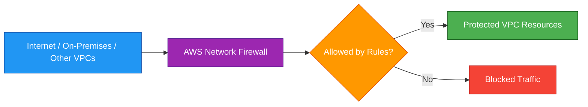
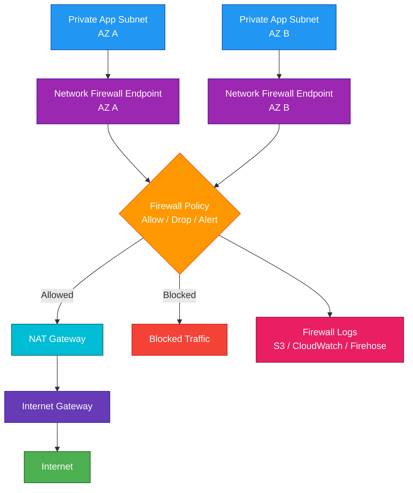

# AWS Network Firewall

## 1. Definition

### Simple Definition

AWS Network Firewall is a managed network firewall service for protecting traffic in and out of Amazon VPCs.

It helps inspect, filter, allow, block, and monitor network traffic at the VPC level.

### Memory Hook

AWS Network Firewall = Managed firewall for VPC traffic.

### Basic Idea

Instead of deploying and managing your own firewall appliances, AWS Network Firewall gives you a managed firewall that can inspect traffic using rules.

### Main Purpose

AWS Network Firewall helps protect:

- VPC traffic
- Internet-bound traffic
- Inbound traffic from the internet
- Traffic between VPCs
- Traffic between subnets
- Hybrid traffic from on-premises networks

## 2. What Problem Does It Solve?

### Main Problem

AWS Network Firewall solves the problem of needing centralized, managed network traffic inspection inside AWS.

Without it, you may need to deploy, scale, patch, and manage firewall appliances yourself.

### Without AWS Network Firewall

You may need to manage:

- Third-party firewall appliances
- EC2-based firewall instances
- High availability
- Scaling
- Patching
- Rule updates
- Logging pipelines
- Routing complexity

### With AWS Network Firewall

AWS provides a managed firewall service that scales automatically and integrates with VPC routing.

### Key Benefit

AWS Network Firewall gives you managed, stateful network protection for VPC traffic without managing firewall servers.

## 3. Core Use Cases

### Inspect Internet-Bound Traffic

Use AWS Network Firewall to inspect outbound traffic from private subnets to the internet.

Example:

Block access to known malicious domains or unauthorized ports.

### Protect Inbound Traffic

Use AWS Network Firewall to inspect traffic coming from the internet before it reaches application resources.

Example:

Inspect traffic before it reaches an Application Load Balancer or application subnet.

### Control Traffic Between VPCs

Use AWS Network Firewall with Transit Gateway to inspect traffic flowing between multiple VPCs.

Example:

Central security VPC inspects traffic between production, development, and shared services VPCs.

### Control Traffic Between Subnets

Use AWS Network Firewall to inspect east-west traffic between subnets in the same VPC.

Example:

Inspect traffic between application subnets and database subnets.

### Hybrid Network Inspection

Use AWS Network Firewall to inspect traffic between on-premises networks and AWS.

Common connections:

- Site-to-Site VPN
- Direct Connect
- Transit Gateway

### Egress Filtering

Use AWS Network Firewall to control what destinations workloads can reach.

Examples:

- Allow only approved domains
- Block known malicious IPs
- Deny risky protocols
- Restrict outbound traffic to required ports

## 4. Important Features for SAA

### Firewall

A firewall is the main AWS Network Firewall resource.

It is deployed into a VPC and associated with firewall subnets.

### Firewall Endpoint

When you create a firewall, AWS creates firewall endpoints in selected subnets.

Traffic must be routed through these endpoints for inspection.

Important exam point:

AWS Network Firewall does not automatically inspect all VPC traffic.

You must update route tables so traffic flows through the firewall endpoints.

### Firewall Subnet

A firewall subnet is a subnet dedicated to AWS Network Firewall endpoints.

Best practice:

Use separate firewall subnets in each Availability Zone.

### Firewall Policy

A firewall policy defines how traffic is inspected.

It contains references to:

- Stateless rule groups
- Stateful rule groups
- Default actions
- Logging behavior

### Rule Group

A rule group is a reusable set of firewall rules.

There are two main types:

| Rule Group Type | Purpose |
|---|---|
| Stateless Rule Group | Fast packet-level inspection |
| Stateful Rule Group | Connection-aware inspection |

### Stateless Rules

Stateless rules inspect each packet independently.

They do not remember connection state.

Use stateless rules for simple packet matching.

Examples:

- Source IP
- Destination IP
- Protocol
- Source port
- Destination port

### Stateful Rules

Stateful rules understand connection context.

They can inspect traffic flows more deeply.

Use stateful rules for:

- Domain filtering
- Protocol inspection
- Intrusion prevention-style rules
- Application-aware traffic filtering

### Stateless vs Stateful

| Feature | Stateless | Stateful |
|---|---|---|
| Tracks connection state | No | Yes |
| Speed | Faster | Deeper inspection |
| Rule type | Packet-level | Flow/application-aware |
| Example | Block TCP port 23 | Block malicious domain |

### Rule Actions

Common rule actions include:

| Action | Meaning |
|---|---|
| Pass | Allow matching traffic |
| Drop | Block matching traffic |
| Alert | Log matching traffic without blocking |
| Forward to stateful engine | Send traffic from stateless to stateful inspection |

### Domain List Filtering

AWS Network Firewall can filter traffic based on domain names.

Examples:

- Allow only approved domains
- Block known bad domains
- Restrict outbound web access

### Suricata-Compatible Rules

AWS Network Firewall supports Suricata-compatible stateful rules.

This is useful for advanced intrusion detection and prevention patterns.

### TLS Inspection

AWS Network Firewall can support TLS inspection for deeper visibility into encrypted traffic.

Important point:

TLS inspection requires careful certificate and policy configuration.

### Logging

AWS Network Firewall supports logging for inspected traffic.

Common log types:

| Log Type | Purpose |
|---|---|
| Alert Logs | Records traffic matching alert rules |
| Flow Logs | Records network traffic flow metadata |
| TLS Logs | Records TLS inspection-related information where configured |

### Log Destinations

Logs can be sent to:

- Amazon S3
- CloudWatch Logs
- Kinesis Data Firehose

### Route Table Integration

AWS Network Firewall works with VPC route tables.

To inspect traffic, routes must point to firewall endpoints.

Example route pattern:

| Traffic | Route Target |
|---|---|
| Private subnet outbound internet traffic | Firewall endpoint |
| Firewall subnet internet route | NAT Gateway or Internet Gateway |
| Inbound protected traffic | Firewall endpoint before workload subnet |

### High Availability Deployment

Deploy firewall endpoints in multiple Availability Zones.

Each AZ should route traffic through the firewall endpoint in the same AZ.

### Centralized Inspection

For many VPCs, use AWS Network Firewall with Transit Gateway.

A common design is:

- Central inspection VPC
- AWS Network Firewall in inspection VPC
- Transit Gateway routes traffic through inspection VPC

### AWS Firewall Manager Integration

AWS Firewall Manager can centrally manage AWS Network Firewall policies across multiple accounts in AWS Organizations.

Use it for multi-account security governance.

## 5. Security Model

### IAM Permissions

IAM controls who can create and manage AWS Network Firewall resources.

Common permissions:

| Permission | Purpose |
|---|---|
| `network-firewall:CreateFirewall` | Create a firewall |
| `network-firewall:CreateFirewallPolicy` | Create a firewall policy |
| `network-firewall:CreateRuleGroup` | Create a rule group |
| `network-firewall:UpdateFirewallPolicy` | Modify firewall policy |
| `network-firewall:UpdateRuleGroup` | Modify rules |
| `network-firewall:DeleteFirewall` | Delete firewall |

### Rule-Based Traffic Control

AWS Network Firewall controls traffic using firewall rules.

Rules can allow, block, or alert on traffic based on:

- IP address
- Port
- Protocol
- Domain name
- Traffic direction
- Stateful inspection patterns
- Suricata-compatible signatures

### Network Security

AWS Network Firewall is part of a layered network security design.

Use it together with:

- Security groups
- Network ACLs
- Route tables
- AWS WAF
- AWS Shield
- VPC Flow Logs
- GuardDuty

### Encryption in Transit

AWS Network Firewall can inspect network traffic, but application encryption still matters.

Use protocols such as:

- HTTPS
- TLS
- SSH
- VPN
- IPsec

### TLS Inspection Security

If using TLS inspection, manage certificates carefully.

Important responsibilities:

- Certificate authority trust
- Key protection
- Inspection policy
- Privacy and compliance requirements
- Exclusion of sensitive traffic when needed

### Encryption at Rest

AWS Network Firewall logs can be encrypted at rest in their destination services.

Examples:

- S3 server-side encryption
- CloudWatch Logs encryption with KMS
- Kinesis Data Firehose encryption

### Least Privilege

Only trusted network or security administrators should manage firewall policies.

A bad firewall rule can accidentally block production traffic.

### Shared Responsibility

AWS is responsible for:

- AWS Network Firewall managed infrastructure
- Firewall endpoint availability
- Service scaling
- Service patching
- Physical security

You are responsible for:

- Firewall rules
- Firewall policies
- Route table configuration
- Logging configuration
- TLS inspection configuration
- Security group and NACL design
- Monitoring alerts
- Testing rule changes
- Multi-AZ routing design

## 6. High Availability / Durability Behavior

### Availability

AWS Network Firewall is a managed service.

AWS handles firewall infrastructure scaling and availability.

### Multi-AZ Behavior

For high availability, deploy firewall endpoints in multiple Availability Zones.

Each AZ should have its own firewall endpoint.

### Same-AZ Routing

Best practice:

Route traffic from each AZ through the firewall endpoint in the same AZ.

This helps reduce cross-AZ dependency and can reduce data transfer cost.

### Fault Tolerance

If one AZ has a problem, traffic in other AZs can continue using their local firewall endpoints.

However, your route tables and application design must support this.

### Scaling

AWS Network Firewall scales automatically with traffic.

You do not manage firewall instances or appliance capacity.

### Multi-Region Behavior

AWS Network Firewall is regional.

For Multi-Region workloads, deploy and configure firewalls in each Region where inspection is required.

### Durability

AWS Network Firewall is not a storage service.

Durability applies to:

- Logs stored in S3 or CloudWatch Logs
- Firewall configuration managed by AWS
- Infrastructure as Code templates for recreating firewall rules

### Route Dependency

The firewall only inspects traffic routed through it.

If routes bypass the firewall, that traffic is not inspected.

### Important Exam Point

High availability requires both:

- Firewall endpoints in multiple AZs
- Correct route tables for each AZ

## 7. Cost Optimization Options

### Inspect Only Required Traffic

Route only the traffic that needs inspection through AWS Network Firewall.

Avoid sending unnecessary internal traffic through the firewall.

### Use Same-AZ Routing

Route traffic to the firewall endpoint in the same Availability Zone when possible.

This can reduce cross-AZ data transfer costs and improve resilience.

### Centralize Inspection Carefully

A centralized inspection VPC can reduce duplicate firewall deployments across many VPCs.

But it can also add Transit Gateway and data processing costs.

Use centralized inspection when governance and scale justify it.

### Use Rule Groups Efficiently

Avoid overly complex rule sets that are not needed.

Keep firewall policies focused on real security requirements.

### Control Logging Volume

Firewall logs can become large.

Reduce log cost by:

- Logging only what is needed
- Sending logs to S3 for long-term storage
- Applying S3 lifecycle policies
- Setting CloudWatch Logs retention
- Using alert logs carefully

### Use Firewall Manager for Large Organizations

For many accounts, Firewall Manager can reduce manual management overhead and policy drift.

### Avoid Duplicate Firewalls

Do not deploy separate firewalls for every workload if a shared inspection architecture meets the requirement.

### Monitor Utilization

Use CloudWatch metrics and logs to understand traffic volume and rule matches.

This helps tune policies and avoid unnecessary processing.

### Test Before Broad Deployment

Test firewall policies in non-production first.

A misconfigured rule can create downtime and operational cost.

## 8. Common Exam Traps

### Network Firewall vs WAF

AWS Network Firewall protects network traffic in VPCs.

AWS WAF protects HTTP/HTTPS web requests.

Memory hook:

- Network Firewall = VPC network traffic
- WAF = Web application traffic

### Network Firewall Is Not a Security Group

Security groups are resource-level firewalls.

AWS Network Firewall is a managed network firewall that inspects routed traffic.

### Network Firewall Is Not a NACL

NACLs are simple stateless subnet-level allow/deny filters.

AWS Network Firewall provides deeper managed inspection with stateful rules.

### Traffic Must Be Routed Through It

This is a major exam trap.

AWS Network Firewall does not inspect traffic automatically.

Route tables must send traffic through firewall endpoints.

### Deploy Across Multiple AZs

For high availability, deploy firewall endpoints in multiple AZs.

A single firewall endpoint creates an AZ-level dependency.

### Stateful and Stateless Are Different

Stateless rules inspect individual packets.

Stateful rules inspect traffic flows and connection context.

### Alert Does Not Block

An alert rule logs matching traffic.

It does not block traffic unless the rule action is drop or another blocking action applies.

### AWS Network Firewall Is Regional

It does not automatically protect workloads across all Regions.

Deploy it in each Region where needed.

### It Does Not Replace Application Security

Network Firewall helps with network protection, but applications still need:

- Authentication
- Authorization
- Input validation
- Secure coding
- Patch management

### It Does Not Replace Shield

AWS Network Firewall can filter traffic, but AWS Shield is for DDoS protection.

### It Does Not Replace GuardDuty

GuardDuty detects suspicious activity.

Network Firewall enforces network traffic rules.

They are complementary.

### Centralized Inspection Needs Transit Gateway

For many VPCs, centralized inspection commonly uses Transit Gateway.

VPC Peering is not transitive and is not ideal for large hub-and-spoke inspection designs.

## 9. Compare With Similar Services

### Service Comparison Table

| Service | Main Purpose | Best For | Choose When |
|---|---|---|---|
| AWS Network Firewall | Managed VPC network firewall | Stateful/stateless network inspection | You need centralized network traffic filtering in VPCs |
| AWS WAF | Web application firewall | HTTP/HTTPS request filtering | You need to block SQL injection, XSS, bots, or web attacks |
| Security Groups | Resource firewall | Instance/ENI-level access control | You need stateful allow rules for resources |
| Network ACLs | Subnet firewall | Simple subnet-level filtering | You need stateless allow/deny rules |
| AWS Shield | DDoS protection | DDoS defense | You need protection from denial-of-service attacks |
| Gateway Load Balancer | Appliance traffic distribution | Third-party firewall appliances | You need to scale virtual firewall appliances |

### AWS Network Firewall vs AWS WAF

| Feature | AWS Network Firewall | AWS WAF |
|---|---|---|
| Protection layer | Network layer | Application layer |
| Traffic type | VPC traffic | HTTP/HTTPS requests |
| Common placement | VPC route path | CloudFront, ALB, API Gateway |
| Example | Block outbound TCP traffic | Block SQL injection |
| Best for | Network inspection | Web request filtering |

### AWS Network Firewall vs Security Groups

| Feature | AWS Network Firewall | Security Group |
|---|---|---|
| Scope | Routed VPC traffic | ENI/resource level |
| Stateful | Yes, with stateful rules | Yes |
| Allow and deny | Yes | Allow rules only |
| Deep inspection | Yes | No |
| Common use | Central firewall inspection | Resource access control |

### AWS Network Firewall vs NACL

| Feature | AWS Network Firewall | NACL |
|---|---|---|
| Scope | Routed traffic through firewall endpoints | Subnet boundary |
| Stateful | Supports stateful rules | Stateless |
| Rule depth | Advanced | Basic IP/port/protocol |
| Managed scaling | Yes | Built into VPC |
| Best for | Central inspection | Simple subnet guardrails |

### AWS Network Firewall vs Gateway Load Balancer

| Feature | AWS Network Firewall | Gateway Load Balancer |
|---|---|---|
| Main purpose | AWS-managed firewall | Distribute traffic to appliances |
| Firewall engine included | Yes | No |
| Third-party appliances | Not needed | Yes |
| Best for | Managed AWS-native firewall | Existing vendor firewall appliances |

### AWS Network Firewall vs Shield

| Feature | AWS Network Firewall | AWS Shield |
|---|---|---|
| Main purpose | Network traffic filtering | DDoS protection |
| Rule-based inspection | Yes | No, managed DDoS defense |
| Common use | Block unwanted traffic | Absorb/mitigate DDoS attacks |
| Best together | Yes | Yes |

### When to Choose AWS Network Firewall

Choose AWS Network Firewall when:

- You need managed firewall protection for VPC traffic
- You need stateful and stateless network inspection
- You need outbound domain or IP filtering
- You need centralized inspection across VPCs
- You need to inspect traffic between subnets or VPCs
- You want AWS-managed firewall scaling
- You do not want to manage third-party firewall appliances

## 10. Mini Architecture Example

### Scenario

A company has multiple private application subnets that need outbound internet access.

Security requires all outbound traffic to be inspected before it reaches the internet.

### Architecture

Deploy AWS Network Firewall in dedicated firewall subnets across multiple Availability Zones.

Private subnet route tables send outbound traffic to the local firewall endpoint.

The firewall inspects traffic, then allowed traffic continues to a NAT Gateway and the internet.

### Why This Is Good

- Outbound traffic is inspected before reaching the internet
- Firewall endpoints are deployed across multiple AZs
- Same-AZ routing improves resilience and reduces cross-AZ dependency
- NAT Gateway still provides outbound internet access
- Firewall rules can block risky domains, IPs, ports, or protocols
- Logs provide security visibility and investigation data
- No self-managed firewall appliances are required

### Exam Answer Pattern

If the question says:

“Inspect and filter VPC network traffic with a managed stateful firewall.”

Think:

AWS Network Firewall.

If the question says:

“Protect HTTP/HTTPS applications from SQL injection or XSS.”

Think:

AWS WAF.

If the question says:

“Use third-party firewall appliances at scale.”

Think:

Gateway Load Balancer.

### Final Memory Hook

Network Firewall protects VPC network traffic.

WAF protects web requests.

Security groups protect resources.

NACLs protect subnet boundaries.

Shield protects against DDoS.

Gateway Load Balancer scales third-party appliances.

Transit Gateway helps centralize inspection across many VPCs.

