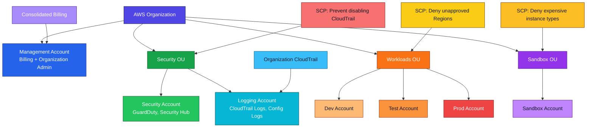

# AWS Organizations

<details>
<summary>## 1. Definition</summary>

## 1. Definition

### Simple Definition

AWS Organizations is an AWS account management service that lets you centrally manage multiple AWS accounts under one organization.

Instead of running everything in one AWS account, you can create separate accounts for different teams, environments, or workloads and manage them together.

### Key Idea

Think of AWS Organizations as a company structure for AWS accounts.

```text
Organization
├── Management Account
├── Organizational Units
│   ├── Production Accounts
│   ├── Development Accounts
│   └── Security Accounts
└── Policies
```

### Main Components

| Component | Meaning |
|---|---|
| Organization | The top-level container for all AWS accounts |
| Management account | The main account that creates and manages the organization |
| Member account | Any AWS account inside the organization |
| Organizational Unit | A folder-like group of accounts |
| Service Control Policy | A guardrail that limits what accounts can do |

### Memory Hook

AWS Organizations = “Manage many AWS accounts from one place.”

</details>

<details>
<summary>## 2. What Problem Does It Solve?</summary>

## 2. What Problem Does It Solve?

### The Problem

As companies grow, using one AWS account becomes risky and hard to manage.

Problems include:

- Too many workloads in one account
- Hard to separate production and development
- Hard to control permissions across teams
- Hard to track costs by department
- Higher blast radius if something goes wrong
- Difficult compliance and security management

### The Solution

AWS Organizations helps you:

- Create and manage multiple AWS accounts
- Group accounts by business unit, team, or environment
- Apply security rules centrally
- Consolidate billing across all accounts
- Enable AWS services across the whole organization
- Reduce risk by separating workloads into different accounts

### Simple Example

Instead of this:

```text
One AWS Account
├── Production
├── Development
├── Testing
├── Security
└── Finance
```

Use this:

```text
AWS Organization
├── Production Account
├── Development Account
├── Testing Account
├── Security Account
└── Finance Account
```

### Exam Focus

For the SAA exam, remember that AWS Organizations is mainly about:

- Multi-account management
- Centralized governance
- Consolidated billing
- Service Control Policies
- Account isolation

</details>

<details>
<summary>## 3. Core Use Cases</summary>

## 3. Core Use Cases

### Multi-Account Management

Use AWS Organizations to manage many AWS accounts from one central place.

Common account types:

| Account Type | Purpose |
|---|---|
| Production | Runs live workloads |
| Development | Used by developers |
| Testing | Used for QA and experiments |
| Security | Central security tools and logs |
| Logging | Stores centralized logs |
| Shared services | Networking, directory, DNS, CI/CD |

### Consolidated Billing

AWS Organizations allows one management account to pay for all member accounts.

Benefits:

- One bill for multiple accounts
- Easier cost tracking
- Volume discounts may apply across accounts
- Reserved Instance and Savings Plans benefits can be shared in some cases

### Environment Separation

Separate accounts reduce risk.

Example:

| Environment | AWS Account |
|---|---|
| Dev | dev-account |
| Test | test-account |
| Prod | prod-account |

This helps prevent development mistakes from affecting production.

### Centralized Security Controls

You can use Service Control Policies to create permission guardrails.

Example:

- Prevent disabling CloudTrail
- Prevent deleting security logs
- Prevent launching resources in unapproved Regions
- Prevent use of expensive services

### Compliance and Governance

Organizations help enforce company-wide rules.

Examples:

- Only allow specific AWS Regions
- Require accounts to follow security baselines
- Centralize audit logs
- Separate regulated workloads

### AWS Service Integration

Many AWS services integrate with AWS Organizations, such as:

- AWS CloudTrail
- AWS Config
- AWS Control Tower
- AWS Security Hub
- Amazon GuardDuty
- IAM Identity Center
- AWS Backup

</details>

<details>
<summary>## 4. Important Features for SAA</summary>

## 4. Important Features for SAA

### Management Account

The management account is the root-level account for the organization.

It can:

- Create the organization
- Invite accounts
- Create new accounts
- Manage billing
- Apply organization policies
- Enable trusted access for AWS services

### Important Exam Point

Do not run normal workloads in the management account.

Best practice:

- Use the management account only for billing and organization administration
- Put workloads in member accounts

### Member Accounts

Member accounts are regular AWS accounts that belong to the organization.

They can be:

- Created inside the organization
- Invited into the organization
- Moved between Organizational Units

### Organizational Units

Organizational Units, or OUs, are groups of accounts.

Example:

```text
Root
├── Security OU
├── Infrastructure OU
├── Sandbox OU
└── Workloads OU
    ├── Dev Account
    ├── Test Account
    └── Prod Account
```

OUs make it easier to apply policies to many accounts at once.

### Service Control Policies

Service Control Policies, or SCPs, are permission guardrails.

They define the maximum permissions available to accounts.

Important:

- SCPs do not grant permissions
- SCPs only limit permissions
- IAM policies are still required to allow actions
- SCPs can be applied to the root, OU, or account level
- SCPs affect IAM users and IAM roles in member accounts
- SCPs do not affect the management account

### SCP Evaluation

For an action to be allowed:

```text
Allowed by IAM policy
AND
Allowed by SCP
```

If either one denies the action, the action is denied.

### SCP Example

An SCP can deny access to all Regions except approved ones.

```json
{
  "Version": "2012-10-17",
  "Statement": [
    {
      "Effect": "Deny",
      "Action": "*",
      "Resource": "*",
      "Condition": {
        "StringNotEquals": {
          "aws:RequestedRegion": [
            "us-east-1",
            "us-west-2"
          ]
        }
      }
    }
  ]
}
```

### Consolidated Billing

With consolidated billing:

- One account pays for all accounts
- Billing is centralized
- Costs can still be tracked per account
- Some discounts can be shared across accounts

### All Features Mode

AWS Organizations has two feature sets:

| Feature Set | Description |
|---|---|
| Consolidated billing only | Only billing features |
| All features | Billing plus advanced management features |

For SCPs, you need all features enabled.

### Tag Policies

Tag policies help standardize tags across accounts.

Example required tags:

- `Environment`
- `Owner`
- `CostCenter`
- `Application`

Important:

Tag policies help enforce tag consistency, but they are not the same as IAM permissions or SCPs.

### Backup Policies

Backup policies allow centralized backup configuration across accounts.

They can help standardize:

- Backup frequency
- Backup retention
- Backup target vaults

### Delegated Administrator

Delegated administrator lets a member account manage a service on behalf of the organization.

Example:

A security account can be delegated to manage GuardDuty or Security Hub for the organization.

### AWS Organizations and Control Tower

AWS Control Tower uses AWS Organizations underneath.

Control Tower provides:

- Landing zone setup
- Account factory
- Guardrails
- Best-practice multi-account structure

AWS Organizations is the foundation.
AWS Control Tower is the managed setup experience.

</details>

<details>
<summary>## 5. Security Model</summary>

## 5. Security Model

### IAM Permissions

AWS Organizations does not replace IAM.

You still need IAM policies to allow users and roles to perform actions.

SCPs only define the maximum boundary.

### IAM vs SCP

| Feature | IAM Policy | SCP |
|---|---|---|
| Grants permissions | Yes | No |
| Limits permissions | Yes | Yes |
| Applies inside account | Yes | Yes |
| Used for identity access | Yes | No |
| Used as account guardrail | No | Yes |

### Example

If IAM allows `ec2:RunInstances` but SCP denies it:

```text
Final result = Denied
```

If SCP allows `ec2:RunInstances` but IAM does not allow it:

```text
Final result = Denied
```

Both IAM and SCP must allow the action.

### Root User Considerations

The root user in a member account is also affected by SCPs.

Example:

An SCP can prevent the root user in a member account from disabling CloudTrail.

However, SCPs do not affect the root user of the management account.

### Encryption Options

AWS Organizations itself is a management and governance service, not a storage service like S3 or EBS.

Encryption is usually handled by the AWS services being governed.

Examples:

| Service | Encryption Control |
|---|---|
| S3 | SSE-S3, SSE-KMS, bucket policies |
| EBS | EBS encryption |
| RDS | KMS encryption |
| CloudTrail | Log file encryption with KMS |
| AWS Config | Encrypted delivery bucket |

### Network and Security Controls

AWS Organizations does not directly control network traffic.

Network security is handled by services such as:

- VPC
- Security groups
- Network ACLs
- AWS Network Firewall
- Route tables
- VPC endpoints
- Transit Gateway

However, SCPs can prevent users from changing network resources.

Examples:

- Deny deleting VPC Flow Logs
- Deny modifying security groups
- Deny disabling AWS Network Firewall
- Deny creating public S3 buckets

### Shared Responsibility

AWS is responsible for:

- Operating the AWS Organizations service
- Maintaining service availability
- Protecting the underlying infrastructure

You are responsible for:

- Designing the account structure
- Applying correct SCPs
- Securing the management account
- Using strong IAM controls
- Enabling logging and monitoring
- Reviewing costs and permissions

### Security Best Practices

- Use multiple accounts for workload isolation
- Avoid workloads in the management account
- Enable MFA on root users
- Use IAM Identity Center for workforce access
- Use SCPs for preventive controls
- Use CloudTrail organization trails
- Use centralized logging
- Use delegated admin accounts for security services

</details>

<details>
<summary>## 6. High Availability / Durability Behavior</summary>

## 6. High Availability / Durability Behavior

### Availability

AWS Organizations is a managed AWS global service.

You do not manage servers, scaling, patching, or availability zones for it.

### Global Service Behavior

AWS Organizations is not deployed by you inside a VPC or subnet.

It is used to manage accounts and policies across AWS.

### Fault Tolerance

Because AWS Organizations is managed by AWS, the service itself is designed for high availability.

From an exam perspective, focus more on how Organizations helps you design fault-tolerant account structures.

### Account Isolation

Separate accounts improve fault isolation.

Example:

If a developer accidentally deletes resources in the dev account, production resources in another account are not directly affected.

### Multi-Account Resilience

A good multi-account setup can separate:

- Production workloads
- Development workloads
- Security tools
- Logging resources
- Backup resources
- Shared networking

This reduces blast radius.

### Multi-Region Behavior

AWS Organizations can govern accounts that use multiple AWS Regions.

You can use SCPs to:

- Allow only approved Regions
- Deny use of restricted Regions
- Require centralized security services

### Durability

AWS Organizations itself does not store application data.

Durability depends on the services used in member accounts.

Example:

| Workload Data | Durability Service |
|---|---|
| Object data | Amazon S3 |
| Database backups | AWS Backup |
| Audit logs | CloudTrail + S3 |
| Configuration history | AWS Config |

### Exam Focus

AWS Organizations helps with governance and isolation, but it is not a backup, database, or disaster recovery service.

</details>

<details>
<summary>## 7. Cost Optimization Options</summary>

## 7. Cost Optimization Options

### Consolidated Billing

The biggest cost benefit is consolidated billing.

Benefits:

- One bill for all AWS accounts
- Easier cost visibility
- Account-level cost tracking
- Shared volume discounts in some cases

### Cost Allocation by Account

Using separate accounts makes it easier to understand cost by:

- Team
- Project
- Application
- Environment
- Department

Example:

| Account | Purpose | Cost Tracking Benefit |
|---|---|---|
| dev-account | Development | Track developer usage |
| prod-account | Production | Track live workload cost |
| security-account | Security tools | Track security spend |
| data-account | Analytics | Track data platform cost |

### Tag Policies

Tag policies help standardize cost allocation tags.

Example tags:

| Tag | Purpose |
|---|---|
| Environment | Dev, Test, Prod |
| Owner | Team or person responsible |
| CostCenter | Finance tracking |
| Application | App or workload name |

### SCPs for Cost Control

SCPs can prevent expensive mistakes.

Examples:

- Deny expensive instance families
- Deny unapproved Regions
- Deny certain services
- Deny creating resources without required conditions

### Separate Sandbox Accounts

Use sandbox accounts for experimentation.

Apply stricter SCPs to sandbox accounts, such as:

- Deny large EC2 instances
- Deny GPU instances
- Deny expensive database engines
- Deny resources outside approved Regions

### AWS Budgets and Cost Explorer

AWS Organizations works well with:

- AWS Budgets
- AWS Cost Explorer
- AWS Cost and Usage Reports
- Cost allocation tags

### Important Exam Point

AWS Organizations helps centralize billing, but it does not automatically reduce cost by itself.

You still need:

- Budgets
- Monitoring
- Tagging
- SCP guardrails
- Right sizing
- Savings Plans or Reserved Instances where appropriate

</details>

<details>
<summary>## 8. Common Exam Traps</summary>

## 8. Common Exam Traps

### Trap 1: SCPs Grant Permissions

SCPs do not grant permissions.

They only set permission boundaries for accounts.

Correct logic:

```text
IAM allows + SCP allows = Allowed
IAM allows + SCP denies = Denied
IAM denies + SCP allows = Denied
```

### Trap 2: SCPs Replace IAM

SCPs do not replace IAM.

Use IAM for user and role permissions.
Use SCPs for account-level guardrails.

### Trap 3: SCPs Affect the Management Account

SCPs do not affect the management account.

They affect member accounts.

### Trap 4: Management Account Should Run Workloads

Do not run normal workloads in the management account.

Use it mainly for:

- Billing
- Organization administration
- Account management

### Trap 5: Consolidated Billing Only Supports SCPs

SCPs require all features mode.

Consolidated billing-only mode does not support full governance features like SCPs.

### Trap 6: OUs Are AWS Accounts

OUs are not accounts.

They are containers used to group accounts.

### Trap 7: AWS Organizations Is the Same as Control Tower

They are related but not the same.

| Service | Role |
|---|---|
| AWS Organizations | Core multi-account management |
| AWS Control Tower | Managed landing zone setup using Organizations |

### Trap 8: SCP Deny vs Allow

Explicit deny always wins.

A deny in an SCP overrides an allow in IAM.

### Trap 9: SCPs Control Resource-Based Policies Automatically

SCPs mainly restrict principals in member accounts.

For the exam, remember that SCPs are account guardrails, not a replacement for resource policies such as S3 bucket policies or KMS key policies.

### Trap 10: Organizations Is for High Availability of Applications

AWS Organizations does not automatically make applications highly available.

It helps structure accounts and governance.
Application HA still depends on services like:

- Auto Scaling
- Elastic Load Balancing
- Multi-AZ RDS
- S3
- Route 53
- Multi-Region architectures

### Memory Hook

SCP = “Service Control Policy” = “Stop Certain Permissions.”

It does not give permissions.
It only limits them.

</details>

<details>
<summary>## 9. Compare With Similar Services</summary>

## 9. Compare With Similar Services

### Service Comparison

| Service | Main Purpose | Choose When |
|---|---|---|
| AWS Organizations | Manage multiple AWS accounts | You need account grouping, SCPs, and consolidated billing |
| AWS Control Tower | Set up a governed multi-account landing zone | You want AWS best-practice account setup with guardrails |
| IAM | Manage permissions inside an AWS account | You need to allow or deny users, groups, and roles |
| IAM Identity Center | Centralized workforce sign-in | You need SSO access to multiple AWS accounts |
| AWS Resource Access Manager | Share resources across accounts | You need to share resources like subnets or Transit Gateways |
| AWS Config | Track resource configuration and compliance | You need compliance checks and configuration history |
| AWS CloudTrail | Record API activity | You need audit logs for account activity |
| AWS Budgets | Monitor and alert on cost | You need cost alerts and budget limits |

### AWS Organizations vs IAM

| Feature | AWS Organizations | IAM |
|---|---|---|
| Scope | Multiple accounts | Single account |
| Main use | Governance and account management | Access control |
| Grants permissions | No | Yes |
| Uses policies | SCPs | IAM policies |
| Exam keyword | Guardrails | Permissions |

### AWS Organizations vs AWS Control Tower

| Feature | AWS Organizations | AWS Control Tower |
|---|---|---|
| Type | Core AWS service | Managed governance service |
| Main use | Account and policy management | Landing zone setup |
| Uses Organizations | N/A | Yes |
| Best for | Custom multi-account setup | Standardized best-practice setup |
| Includes guardrails | SCP-based | Preventive and detective guardrails |

### AWS Organizations vs IAM Identity Center

| Feature | AWS Organizations | IAM Identity Center |
|---|---|---|
| Main purpose | Manage accounts | Manage user access |
| Controls accounts | Yes | No |
| Provides SSO | No | Yes |
| Uses permission sets | No | Yes |
| Exam keyword | Multi-account governance | Centralized login |

### When to Choose AWS Organizations

Choose AWS Organizations when the question says:

- Manage multiple AWS accounts
- Consolidated billing
- Apply guardrails across accounts
- Group accounts by environment
- Restrict services or Regions across accounts
- Central governance
- Account isolation

</details>

<details>
<summary>## 10. Mini Architecture Example</summary>

## 10. Mini Architecture Example

### Scenario

A company wants to separate production, development, security, and logging workloads.

They also want:

- Centralized billing
- Centralized security logging
- Guardrails to prevent risky actions
- Separate accounts for each environment
- Restricted access to unapproved AWS Regions

### Architecture



### How It Works

The management account controls the organization and billing.

The security account manages organization-wide security services.

The logging account stores centralized audit logs.

Workload accounts are separated by environment:

- Dev
- Test
- Prod

Sandbox accounts are restricted with stricter SCPs to control cost and risk.

### Example SCP Guardrails

| Guardrail | Purpose |
|---|---|
| Deny unapproved Regions | Control compliance and cost |
| Prevent disabling CloudTrail | Protect audit logging |
| Deny large EC2 instances in sandbox | Reduce accidental high costs |
| Deny deleting log buckets | Protect security evidence |

### SAA Exam Summary

Remember these key points:

- AWS Organizations manages multiple AWS accounts.
- The management account controls the organization.
- Member accounts run workloads.
- OUs group accounts.
- SCPs set maximum permissions.
- SCPs do not grant permissions.
- IAM still grants permissions.
- Consolidated billing centralizes payment.
- AWS Control Tower builds on AWS Organizations.
- Use separate accounts to reduce blast radius.

### Final Memory Hook

AWS Organizations = “Accounts, OUs, SCPs, and Billing.”

```text
A = Accounts
O = Organizational Units
S = Service Control Policies
B = Billing
```

</details>