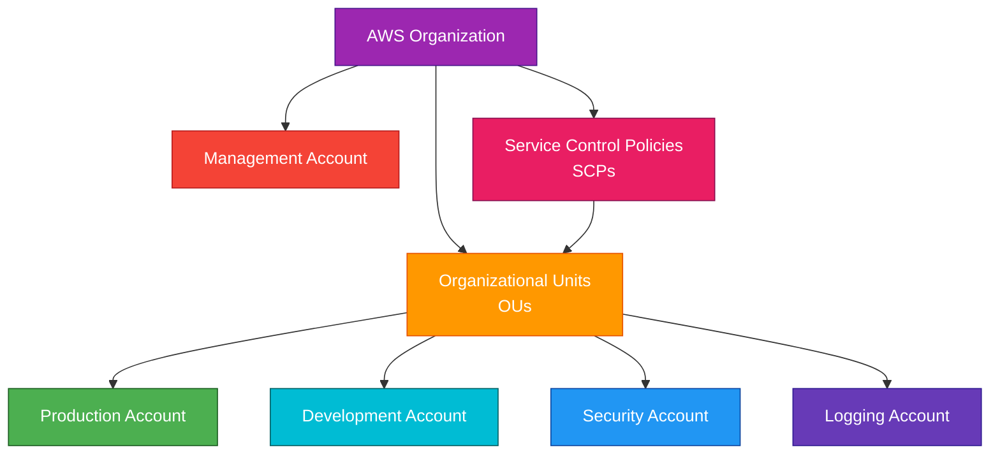
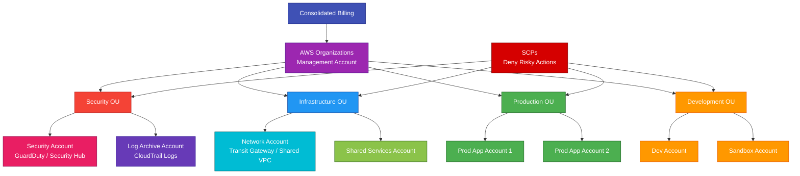

# AWS Organizations

## 1. Definition

### Simple Definition

AWS Organizations is a service that helps you centrally manage multiple AWS accounts.

It lets you group accounts, apply security guardrails, consolidate billing, and manage accounts at scale.

### Memory Hook

AWS Organizations = Manage many AWS accounts from one place.

### Basic Idea

Instead of using one AWS account for everything, you create multiple accounts and manage them under one organization.

### What AWS Organizations Manages

AWS Organizations helps manage:

- Multiple AWS accounts
- Organizational units
- Consolidated billing
- Service Control Policies
- Account creation
- Central governance
- AWS service integrations
- Multi-account security guardrails

## 2. What Problem Does It Solve?

### Main Problem

AWS Organizations solves the problem of managing many AWS accounts separately.

As companies grow, using one AWS account for everything becomes risky and hard to manage.

### Without AWS Organizations

You may struggle with:

- Separate billing for every account
- No central account governance
- Harder security control
- Difficult account creation
- Poor workload isolation
- Manual policy management
- Complex multi-account administration

### With AWS Organizations

You can centrally manage accounts, billing, and permission guardrails.

### Key Benefit

AWS Organizations provides centralized governance for multi-account AWS environments.

### Why Multiple Accounts Matter

Multiple AWS accounts help separate:

- Production workloads
- Development workloads
- Security tools
- Logging
- Shared services
- Sandbox environments
- Business units

This improves security, billing visibility, and operational control.

## 3. Core Use Cases

### Multi-Account Management

Use AWS Organizations to manage many AWS accounts under one organization.

Example account structure:

- Management account
- Security account
- Logging account
- Production account
- Development account
- Sandbox account

### Consolidated Billing

AWS Organizations combines charges from all member accounts into one bill.

This simplifies payment and cost management.

### Centralized Governance

Use Service Control Policies to set permission guardrails across accounts.

Example:

Deny users from disabling CloudTrail in all production accounts.

### Environment Isolation

Separate workloads into different accounts.

Examples:

- Production account
- Development account
- Testing account
- Security account

### Security Account Structure

A common AWS best practice is to create separate accounts for security and logging.

Examples:

- Security tooling account
- Log archive account
- Audit account

### Automated Account Creation

AWS Organizations can create new AWS accounts programmatically.

This is useful for landing zones and account vending.

### Service Integration

Many AWS services integrate with Organizations for centralized management.

Examples:

- AWS CloudTrail
- AWS Config
- GuardDuty
- Security Hub
- AWS Backup
- IAM Identity Center
- Control Tower

## 4. Important Features for SAA

### Organization

An organization is the root container for all accounts managed together.

It includes:

- One management account
- One or more member accounts
- Root
- Organizational units
- Policies

### Management Account

The management account is the main account that creates and manages the organization.

Important points:

- Formerly called the master account
- Pays consolidated bill
- Manages member accounts
- Should be used only for organization-level administration
- Should not run normal workloads

### Member Account

A member account is an AWS account that belongs to the organization.

Member accounts are used to run workloads.

Examples:

- Production account
- Development account
- Security account
- Logging account

### Root

The root is the top-level container inside AWS Organizations.

All OUs and accounts are under the root.

Policies attached to the root can affect the whole organization.

### Organizational Unit

An Organizational Unit, or OU, is a group of AWS accounts.

Use OUs to organize accounts by:

- Environment
- Department
- Workload type
- Security level
- Business unit

### Example OU Structure

| OU | Example Accounts |
|---|---|
| Security OU | Security, Log Archive |
| Production OU | Prod App 1, Prod App 2 |
| Development OU | Dev, Test, Sandbox |
| Infrastructure OU | Shared Services, Network |

### Service Control Policy

A Service Control Policy, or SCP, sets maximum permissions for accounts in an organization.

Important exam point:

SCPs do not grant permissions.

They only limit what IAM users and roles can do.

### SCP Behavior

SCPs can be attached to:

- Organization root
- Organizational units
- Individual accounts

They affect IAM users and roles inside the accounts.

### SCP Evaluation

For an action to be allowed:

- IAM policy must allow it
- SCP must not block it
- No explicit deny can apply

### SCP Example

An SCP can deny actions like:

- Disable CloudTrail
- Delete AWS Config recorder
- Use unapproved AWS Regions
- Create public S3 buckets
- Launch expensive EC2 instance types

### Allow List vs Deny List Strategy

There are two common SCP strategies.

| Strategy | Meaning |
|---|---|
| Deny list | Allow most actions but deny risky actions |
| Allow list | Deny everything except approved actions |

For SAA, deny list is easier to understand and commonly used.

### Consolidated Billing

Consolidated billing combines all account charges into one bill.

Benefits:

- One payment method
- Centralized billing
- Easier cost visibility
- Possible volume pricing benefits
- Shared Reserved Instance and Savings Plans benefits in some cases

### Tag Policies

Tag policies help standardize tags across accounts.

Example:

Require consistent tag keys like:

- `Environment`
- `CostCenter`
- `Owner`
- `Application`

Important point:

Tag policies help with governance but do not always prevent resource creation by themselves.

### Backup Policies

Backup policies can help manage backup plans across accounts using AWS Backup.

Use them for organization-wide backup governance.

### AI Services Opt-Out Policies

AI services opt-out policies can control whether AWS AI services may use data for service improvement.

### Delegated Administrator

A delegated administrator lets a member account manage an AWS service for the organization.

Common examples:

- Security Hub administrator account
- GuardDuty administrator account
- AWS Config aggregator account
- AWS Backup administrator account

### AWS Organizations and IAM Identity Center

IAM Identity Center integrates with AWS Organizations for centralized workforce access.

Use it to assign users and groups access to multiple AWS accounts.

### AWS Control Tower

AWS Control Tower uses AWS Organizations to create and govern a multi-account AWS environment.

Important exam point:

Control Tower is built on top of services like AWS Organizations, IAM Identity Center, CloudTrail, Config, and Service Catalog.

## 5. Security Model

### IAM Permissions

IAM controls who can manage AWS Organizations.

Common permissions:

| Permission | Purpose |
|---|---|
| `organizations:CreateOrganization` | Create an organization |
| `organizations:CreateAccount` | Create a member account |
| `organizations:MoveAccount` | Move account between OUs |
| `organizations:AttachPolicy` | Attach policy to root, OU, or account |
| `organizations:DetachPolicy` | Detach policy |
| `organizations:InviteAccountToOrganization` | Invite existing account |
| `organizations:EnableAWSServiceAccess` | Enable service integration |

### Management Account Security

The management account is highly sensitive.

Best practices:

- Enable MFA on root user
- Do not run workloads in it
- Limit who can access it
- Use IAM Identity Center for admin access
- Monitor all activity with CloudTrail
- Protect billing and organization permissions

### Service Control Policies

SCPs are the main security guardrail feature in AWS Organizations.

They help prevent risky actions even if IAM permissions allow them.

Example:

Even if an admin role allows `cloudtrail:StopLogging`, an SCP can deny it.

### SCPs Do Not Affect the Management Account

Important exam point:

SCPs do not restrict users or roles in the management account.

They apply to member accounts.

### SCPs and Root User

SCPs affect the root user of member accounts.

This means an SCP can restrict even the root user in a member account.

### Least Privilege

Use least privilege across accounts.

Combine:

- IAM policies
- SCPs
- Permission boundaries
- Resource policies
- KMS key policies
- VPC endpoint policies

### Cross-Account Access

Use IAM roles for cross-account access.

Example:

A security account assumes a role in production accounts to audit resources.

### Centralized Security Services

Use delegated administrator accounts for security services.

Common examples:

- GuardDuty delegated admin
- Security Hub delegated admin
- AWS Config aggregator
- IAM Access Analyzer
- AWS Backup admin

### Encryption and Organizations

AWS Organizations does not encrypt application data directly.

It helps govern accounts that use encryption services like KMS, S3, EBS, RDS, and DynamoDB.

### Shared Responsibility

AWS is responsible for:

- AWS Organizations service infrastructure
- Organization management control plane
- Service availability
- Physical security

You are responsible for:

- Account structure
- SCP design
- IAM permissions
- Root user protection
- Delegated administrator setup
- Monitoring organization changes
- Managing member account access
- Billing and governance controls

## 6. High Availability / Durability Behavior

### Global Service

AWS Organizations is a global AWS service.

It is not tied to one specific AWS Region.

### Availability

AWS manages AWS Organizations as a highly available service.

You do not configure Multi-AZ or scaling for it.

### Multi-Account Resilience

AWS Organizations helps improve operational resilience by separating workloads into different accounts.

Example:

A problem in a development account should not directly affect production resources in a separate account.

### Account Isolation

AWS accounts provide strong isolation boundaries.

Separate accounts help isolate:

- Security incidents
- Billing
- IAM permissions
- Service quotas
- Workloads
- Environments

### Multi-Region Governance

Because Organizations is global, policies can apply across Regions.

Example:

An SCP can deny actions outside approved Regions.

### Durability

AWS Organizations stores organization structure and policies as part of the AWS managed service.

For SAA, focus on governance and account management rather than data durability.

### Disaster Recovery Role

AWS Organizations is not a disaster recovery service by itself.

However, it supports DR governance by helping manage:

- Backup accounts
- Log archive accounts
- Security accounts
- Cross-account backup copies
- Multi-Region guardrails

### Important Exam Point

AWS Organizations improves governance and isolation, but it does not automatically make applications highly available.

Application HA still requires services like:

- Multi-AZ
- Auto Scaling
- Load Balancers
- Replication
- Backups
- Multi-Region architecture

## 7. Cost Optimization Options

### Consolidated Billing

Consolidated billing is one of the biggest cost-related benefits.

It combines billing for all member accounts into one bill.

### Volume Pricing Benefits

Some AWS services can benefit from combined usage across accounts.

This may help with volume discounts.

### Shared Savings Plans and Reserved Instances

In many cases, Savings Plans and Reserved Instance benefits can apply across accounts in the same organization, depending on billing and sharing settings.

### Centralized Cost Visibility

AWS Organizations works with billing tools to help centralize cost tracking.

Common tools:

- AWS Cost Explorer
- AWS Budgets
- Cost and Usage Reports
- Billing console
- Cost allocation tags

### Account-Level Cost Separation

Separate accounts make it easier to track costs by:

- Team
- Application
- Environment
- Business unit
- Customer

### Tag Policies

Use tag policies to improve cost allocation consistency.

Example required tags:

- `Environment`
- `Owner`
- `CostCenter`
- `Application`

### SCPs for Cost Guardrails

Use SCPs to prevent expensive actions.

Examples:

- Deny unapproved Regions
- Deny large EC2 instance families
- Deny expensive GPU instances
- Deny deleting budget alarms
- Deny disabling cost controls

### Sandbox Account Control

Use separate sandbox accounts with strict SCPs and budgets.

This helps prevent experiments from creating large unexpected costs.

### Avoid Workloads in Management Account

Do not run normal workloads in the management account.

This keeps billing and governance separate from application costs and risks.

### Use AWS Control Tower for Landing Zone Governance

Control Tower can help create governed accounts with baseline controls.

This can reduce manual setup and operational mistakes.

## 8. Common Exam Traps

### SCPs Do Not Grant Permissions

This is the biggest exam trap.

SCPs only set maximum allowed permissions.

IAM policies must still allow the action.

### Explicit Deny Still Wins

If an SCP explicitly denies an action, the action is denied even if IAM allows it.

### SCPs Do Not Affect the Management Account

SCPs apply to member accounts.

They do not restrict the management account.

### SCPs Affect Member Account Root Users

An SCP can restrict the root user in a member account.

This is useful for strong guardrails.

### AWS Organizations Is Not IAM Identity Center

AWS Organizations manages accounts and policies.

IAM Identity Center manages workforce sign-in and account access assignments.

They commonly work together.

### AWS Organizations Is Not Control Tower

AWS Organizations is the account management and governance service.

AWS Control Tower builds a governed landing zone using Organizations and other services.

### Consolidated Billing Does Not Mean Shared Resources

Accounts remain separate even with consolidated billing.

Resources in one account are not automatically accessible from another account.

### Moving Accounts Between OUs Changes Policy Inheritance

If you move an account to another OU, it inherits the policies attached to that new OU.

This can allow or block actions unexpectedly.

### Management Account Should Be Protected

The management account has powerful organization and billing control.

Do not use it for normal workloads.

### SCPs Are Guardrails, Not Authentication

SCPs limit permissions.

They do not authenticate users and do not replace IAM policies.

### Organization Trail Is for Multi-Account Logging

If the exam asks for CloudTrail across all accounts, think organization trail.

### Delegated Admin Reduces Management Account Usage

Use delegated administrators so security and operations services can be managed from member accounts instead of the management account.

## 9. Compare With Similar Services

### Service Comparison Table

| Service | Main Purpose | Best For | Choose When |
|---|---|---|---|
| AWS Organizations | Multi-account management | Central governance and billing | You need to manage many AWS accounts |
| IAM | Identity and access control | Users, roles, and permissions | You need to control access inside an AWS account |
| IAM Identity Center | Workforce SSO | Centralized user access to accounts/apps | You need single sign-on for employees |
| AWS Control Tower | Governed landing zone | Automated multi-account setup | You need a best-practice account foundation |
| AWS Config | Configuration compliance | Resource configuration tracking | You need compliance checks and change history |
| AWS Budgets | Cost alerts | Budget monitoring | You need alerts for spending thresholds |

### AWS Organizations vs IAM

| Feature | AWS Organizations | IAM |
|---|---|---|
| Scope | Multiple AWS accounts | One AWS account |
| Main purpose | Account governance | Access control |
| Policy type | SCPs and organization policies | IAM policies |
| Grants permissions | No, SCPs only limit | Yes, IAM policies can allow |
| Best for | Multi-account guardrails | User, role, and service permissions |

### AWS Organizations vs IAM Identity Center

| Feature | AWS Organizations | IAM Identity Center |
|---|---|---|
| Main purpose | Manage accounts | Manage workforce access |
| Handles billing | Yes | No |
| Creates OUs | Yes | No |
| User SSO portal | No | Yes |
| Common use together | Account structure | User access assignments |

### AWS Organizations vs Control Tower

| Feature | AWS Organizations | AWS Control Tower |
|---|---|---|
| Main purpose | Multi-account management | Governed landing zone |
| Account structure | Manual or automated | Automated best-practice setup |
| Guardrails | SCPs and policies | Preventive and detective controls |
| Uses Organizations | It is the core service | Built on top of it |
| Best for | Custom account governance | Fast standardized landing zone |

### AWS Organizations vs AWS Config

| Feature | AWS Organizations | AWS Config |
|---|---|---|
| Main purpose | Account governance | Resource compliance |
| Tracks resource changes | No | Yes |
| Applies account guardrails | Yes, with SCPs | No, detects/evaluates |
| Example | Deny public S3 bucket creation | Detect existing public S3 buckets |

### AWS Organizations vs AWS Budgets

| Feature | AWS Organizations | AWS Budgets |
|---|---|---|
| Main purpose | Account and billing management | Cost alerting |
| Consolidated billing | Yes | No |
| Budget alerts | No | Yes |
| Common use together | Manage accounts | Alert on account/Ou spending |

### When to Choose AWS Organizations

Choose AWS Organizations when:

- You need to manage multiple AWS accounts
- You need consolidated billing
- You need account-level isolation
- You need Service Control Policies
- You need organizational units
- You need centralized governance
- You need multi-account security service integration
- You need an AWS multi-account landing zone foundation

## 10. Mini Architecture Example

### Scenario

A company wants a secure multi-account AWS environment.

They need separate accounts for production, development, security, logging, and shared networking.

They also want guardrails to prevent risky actions.

### Architecture

Use AWS Organizations with OUs for different environments.

Apply SCPs to restrict dangerous actions.

Use delegated administrator accounts for security services.

Use consolidated billing for all accounts.

### Why This Is Good

- Accounts are separated by workload and environment
- Production is isolated from development
- Security and logging have dedicated accounts
- SCPs prevent risky actions across accounts
- Consolidated billing simplifies payment and cost visibility
- Delegated administrators reduce use of the management account
- The structure supports scalable governance

### Exam Answer Pattern

If the question says:

“Centrally manage multiple AWS accounts with consolidated billing and permission guardrails.”

Think:

AWS Organizations.

If the question says:

“Limit what accounts can do, but not grant permissions.”

Think:

Service Control Policies.

If the question says:

“Set up a governed multi-account landing zone.”

Think:

AWS Control Tower built on AWS Organizations.

### Final Memory Hook

AWS Organizations manages accounts.

OUs group accounts.

SCPs set guardrails.

SCPs do not grant permissions.

Management account controls the organization.

Member accounts run workloads.

Consolidated billing combines costs.

Control Tower builds a governed landing zone.

IAM Identity Center gives workforce SSO.

