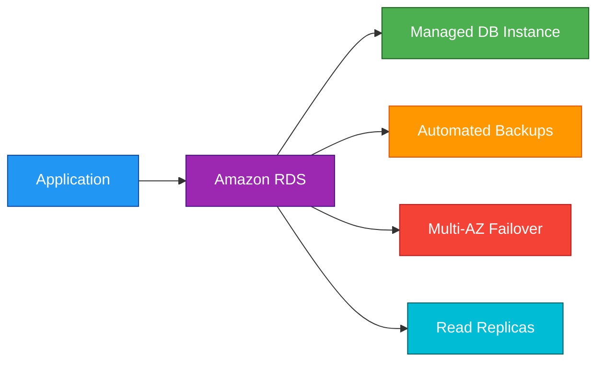
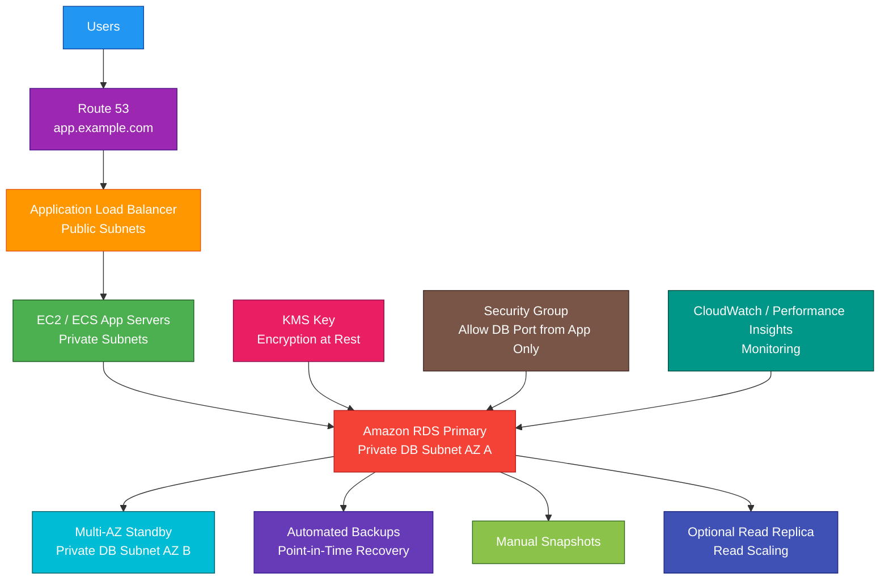

# Amazon RDS

## 1. Definition

### Simple Definition

Amazon RDS, or Relational Database Service, is a managed relational database service from AWS.

It helps you run traditional SQL databases without managing most database infrastructure tasks yourself.

### Memory Hook

RDS = Relational Database Service = Managed SQL databases.

### Basic Idea

You choose a database engine, instance size, storage type, and availability option.

AWS manages many operational tasks like provisioning, patching, backups, monitoring, and failover.

### Supported Database Engines

Amazon RDS supports several relational database engines.

| Engine | Common Use |
|---|---|
| Amazon Aurora | AWS-optimized MySQL/PostgreSQL-compatible database |
| MySQL | Open-source relational database |
| PostgreSQL | Open-source relational database with advanced features |
| MariaDB | MySQL-compatible open-source database |
| Oracle | Enterprise commercial database |
| SQL Server | Microsoft relational database |

## 2. What Problem Does It Solve?

### Main Problem

Amazon RDS solves the problem of running relational databases without manually managing database servers.

### Without RDS

You may need to manage:

- Database installation
- Operating system patching
- Database patching
- Backups
- Replication
- Failover
- Monitoring
- Storage expansion
- Hardware maintenance
- Database server replacement

### With RDS

AWS manages many database administration tasks for you.

You still manage:

- Schema design
- Query design
- Users and permissions
- Database tuning
- Application logic
- Security configuration

### Key Benefit

RDS makes relational databases easier to operate, more available, and easier to back up.

## 3. Core Use Cases

### Traditional Web Applications

Use RDS when your application needs a SQL database.

Examples:

- E-commerce applications
- Content management systems
- Customer management systems
- Internal business applications

### Relational Data

Use RDS when data has relationships and needs SQL queries.

Examples:

- Customers and orders
- Students and courses
- Products and inventory
- Users and roles

### Transactional Workloads

Use RDS for OLTP workloads where many small transactions are performed.

Examples:

- Create order
- Update account balance
- Register user
- Process payment record

### Managed Database Migration

Use RDS when moving from self-managed databases to managed AWS databases.

Example:

Move MySQL running on EC2 to Amazon RDS for MySQL.

### High Availability Databases

Use RDS Multi-AZ when the database needs automatic failover inside a Region.

### Read Scaling

Use RDS Read Replicas when applications need more read capacity.

Example:

Reporting queries use a read replica instead of the primary database.

### Backup and Restore

Use RDS automated backups and snapshots to recover data after accidental changes or failures.

## 4. Important Features for SAA

### DB Instance

A DB instance is the basic compute unit for RDS.

It is the database server managed by AWS.

You choose:

- Engine
- Instance class
- Storage type
- Storage size
- VPC and subnets
- Backup settings
- Multi-AZ settings

### DB Engine

A DB engine is the database software used by the RDS instance.

Examples:

- MySQL
- PostgreSQL
- MariaDB
- Oracle
- SQL Server
- Aurora

### DB Subnet Group

A DB subnet group defines which subnets RDS can use in a VPC.

Important point:

For Multi-AZ deployments, the subnet group should include subnets in multiple Availability Zones.

### Storage Types

RDS supports different storage types.

| Storage Type | Best For |
|---|---|
| General Purpose SSD | Most workloads |
| Provisioned IOPS SSD | High-performance database workloads |
| Magnetic | Legacy workloads only |

### General Purpose SSD

General Purpose SSD is a good default choice for many databases.

It balances cost and performance.

### Provisioned IOPS SSD

Provisioned IOPS is used when the database needs consistent high I/O performance.

Best for:

- High-transaction databases
- Production workloads with heavy I/O
- Latency-sensitive applications

### Storage Auto Scaling

RDS can automatically increase storage when the database is running out of space.

Important point:

Storage can grow automatically, but it does not automatically shrink.

### Automated Backups

Automated backups allow point-in-time recovery.

RDS backs up:

- Database data
- Transaction logs

This allows restoring to a specific time within the backup retention period.

### Backup Retention

Backup retention controls how long automated backups are kept.

Common range:

- 0 days disables automated backups
- Up to 35 days for automated backup retention

### DB Snapshot

A DB snapshot is a manual backup of the database.

Important points:

- Created manually
- Kept until deleted
- Can be copied across Regions
- Can be shared with other accounts
- Useful before major changes

### Automated Backup vs Manual Snapshot

| Feature | Automated Backup | Manual Snapshot |
|---|---|---|
| Created by | AWS automatically | User manually |
| Retention | Based on backup retention period | Kept until deleted |
| Supports PITR | Yes | No, snapshot is a point in time |
| Common use | Recovery window | Long-term backup or migration |

### Point-in-Time Recovery

Point-in-time recovery, or PITR, restores a database to a specific time within the backup retention window.

Use PITR when:

- Data was accidentally deleted
- Bad application update changed data
- You need recovery before a failure time

### Multi-AZ Deployment

Multi-AZ creates a standby database in another Availability Zone.

Important points:

- Used for high availability
- Provides automatic failover
- Standby is not used for normal read traffic
- Protects against AZ failure
- Helps during maintenance

### Multi-AZ Failover

If the primary DB instance fails, RDS automatically fails over to the standby.

The application uses the same database endpoint.

### Read Replica

A Read Replica is a copy of the database used for read scaling.

Important points:

- Used to offload read traffic
- Can be in same Region or cross-Region
- Replication is asynchronous
- Can be promoted to standalone database
- Helps with read-heavy workloads

### Multi-AZ vs Read Replica

| Feature | Multi-AZ | Read Replica |
|---|---|---|
| Main purpose | High availability | Read scaling |
| Failover | Automatic | Manual promotion |
| Read traffic | Standby is not used for reads | Can serve reads |
| Replication | Synchronous or near-synchronous depending on engine | Asynchronous |
| Exam clue | Automatic failover | Scale read queries |

### RDS Proxy

RDS Proxy is a managed database proxy.

It helps applications reuse database connections.

Best for:

- Lambda applications
- Applications with many short-lived connections
- Improving connection pooling
- Reducing database connection storms

### Parameter Groups

A parameter group controls database engine configuration settings.

Example settings:

- Timeouts
- Character sets
- Query behavior
- Memory-related settings

Some changes require a database reboot.

### Option Groups

Option groups enable extra database engine features.

They are especially important for engines like Oracle and SQL Server.

### Maintenance Window

The maintenance window is the time period when AWS can apply patches or maintenance.

Choose a low-traffic time.

### Deletion Protection

Deletion protection prevents accidental database deletion.

Use it for production databases.

### Enhanced Monitoring

Enhanced Monitoring gives deeper OS-level metrics for the DB instance.

### Performance Insights

Performance Insights helps analyze database performance.

Use it to identify:

- Slow queries
- Database load
- Wait events
- Performance bottlenecks

### CloudWatch Metrics

RDS publishes metrics to CloudWatch.

Common metrics:

- CPU utilization
- Free storage space
- Database connections
- Read/write IOPS
- Read/write latency
- Replica lag

## 5. Security Model

### IAM Permissions

IAM controls who can create, modify, delete, and manage RDS resources.

Common permissions:

| Permission | Purpose |
|---|---|
| `rds:CreateDBInstance` | Create DB instance |
| `rds:ModifyDBInstance` | Modify DB settings |
| `rds:DeleteDBInstance` | Delete DB instance |
| `rds:CreateDBSnapshot` | Create manual snapshot |
| `rds:RestoreDBInstanceFromDBSnapshot` | Restore from snapshot |
| `rds:CreateDBSubnetGroup` | Create subnet group |

### Database Authentication

RDS supports database-native users and passwords.

Examples:

- MySQL users
- PostgreSQL roles
- SQL Server logins
- Oracle users

### IAM Database Authentication

Some RDS engines support IAM database authentication.

This allows users or applications to authenticate using IAM tokens instead of static database passwords.

Common engines:

- MySQL
- PostgreSQL

### Security Groups

RDS uses security groups to control network access.

Best practice:

Allow database access only from application security groups, not from the public internet.

Example:

| Source | Destination |
|---|---|
| App server security group | RDS security group on port 3306 |

### Public Accessibility

RDS can be public or private.

Best practice:

Production databases should usually be private in private subnets.

### Encryption at Rest

RDS supports encryption at rest using AWS KMS.

Encryption protects:

- DB storage
- Automated backups
- Manual snapshots
- Read replicas

### Encryption in Transit

Use SSL/TLS to encrypt connections between applications and RDS.

This protects data moving over the network.

### KMS Key Permissions

If using customer managed KMS keys, make sure the correct users and services can use the key.

Wrong KMS permissions can break:

- Backup restore
- Snapshot copy
- Read replica creation
- Database access operations

### Snapshot Security

Snapshots can contain sensitive data.

Protect snapshots using:

- IAM permissions
- KMS encryption
- Careful sharing controls
- Avoid making snapshots public

### Secrets Management

Do not hardcode database passwords in application code.

Use:

- AWS Secrets Manager
- Systems Manager Parameter Store
- IAM database authentication where supported

### Network Isolation

Use VPC design to isolate databases.

Common production pattern:

- Public subnets for load balancers
- Private subnets for application servers
- Private isolated subnets for RDS

### Shared Responsibility

AWS is responsible for:

- RDS managed infrastructure
- Hardware maintenance
- Database engine installation
- Managed backups
- Multi-AZ failover infrastructure
- Physical security
- Managed patching capabilities

You are responsible for:

- Database users and permissions
- Schema design
- Query security
- Security groups
- Encryption settings
- Backup retention
- KMS key policies
- Public accessibility settings
- Application-level security

## 6. High Availability / Durability Behavior

### Availability

RDS can be highly available when configured with Multi-AZ deployment.

Multi-AZ is the main RDS feature for high availability.

### Multi-AZ Behavior

In a Multi-AZ deployment, RDS maintains a standby database in another Availability Zone.

If the primary database fails, RDS automatically fails over to the standby.

### Automatic Failover

RDS can automatically fail over during:

- AZ failure
- DB instance failure
- Storage failure
- Some maintenance events

### Same Endpoint After Failover

Applications connect using the RDS endpoint.

After failover, the endpoint points to the new primary.

Important point:

Applications should reconnect if the connection is interrupted during failover.

### Durability

RDS uses durable storage and backups.

For stronger durability, use:

- Automated backups
- Manual snapshots
- Multi-AZ
- Cross-Region snapshot copies
- Read replicas for some DR patterns

### Read Replicas and Availability

Read replicas improve read scalability.

They can also support disaster recovery if promoted, but failover is not automatic like Multi-AZ.

### Cross-Region Read Replicas

Cross-Region read replicas can help with disaster recovery and global read access.

Replication is asynchronous, so some data lag is possible.

### Backups

Automated backups support point-in-time recovery.

Manual snapshots are kept until deleted.

### Multi-Region Behavior

RDS is regional.

For Multi-Region disaster recovery, use options such as:

- Cross-Region snapshots
- Cross-Region read replicas
- AWS Backup cross-Region copy
- Aurora Global Database for Aurora workloads

### Important Exam Point

Multi-AZ is for high availability.

Read Replicas are for read scaling.

Backups and snapshots are for recovery.

## 7. Cost Optimization Options

### Choose the Right Instance Class

Right-size the DB instance based on workload.

Avoid overprovisioning CPU and memory.

### Use Reserved Instances

For steady production workloads, RDS Reserved Instances can reduce cost.

Use them when database usage is predictable.

### Use Storage Auto Scaling Carefully

Storage Auto Scaling prevents outages from running out of space.

However, storage does not automatically shrink, so monitor growth.

### Choose the Right Storage Type

Use General Purpose SSD for most workloads.

Use Provisioned IOPS only when consistent high I/O performance is required.

### Stop Non-Production Databases

Some RDS instances can be stopped temporarily.

Use this for dev/test databases that are not needed 24/7.

### Delete Unused Snapshots

Manual snapshots stay until deleted and can create long-term cost.

Clean up snapshots that are no longer needed.

### Use Backup Retention Wisely

Longer backup retention increases backup storage usage.

Set retention based on recovery and compliance needs.

### Avoid Unnecessary Multi-AZ in Dev/Test

Multi-AZ improves availability but costs more.

Use it for production or critical workloads.

### Use Read Replicas Only When Needed

Read replicas add cost.

Use them when read scaling, reporting isolation, or DR value justifies the cost.

### Monitor Performance Before Scaling

Use CloudWatch and Performance Insights before increasing instance size.

Sometimes query optimization or indexing is cheaper than scaling up.

### Use Aurora When It Fits

For some high-performance relational workloads, Aurora may provide better performance and scaling options than standard RDS engines.

### Use Serverless Options for Variable Workloads

For variable or unpredictable relational workloads, Aurora Serverless may be more cost-effective than always-running provisioned capacity.

## 8. Common Exam Traps

### Multi-AZ vs Read Replica

This is the biggest RDS exam trap.

| Requirement | Choose |
|---|---|
| Automatic failover and high availability | Multi-AZ |
| Scale read traffic | Read Replica |

### Standby in Multi-AZ Is Not for Reads

In standard RDS Multi-AZ, the standby is not used to serve read traffic.

It is used for failover.

### Read Replica Failover Is Not Automatic

Read replicas can be promoted, but this is not the same as automatic Multi-AZ failover.

### Backups Are Not Read Replicas

Backups restore data after failure or accidental changes.

Read replicas serve read traffic and replicate from the primary.

### RDS Is Not Serverless by Default

RDS instances are provisioned database servers.

For serverless relational scaling, think Aurora Serverless.

### RDS Is Not NoSQL

RDS is relational SQL.

For serverless NoSQL key-value workloads, choose DynamoDB.

### RDS Is Managed, But Not Fully Hands-Off

AWS manages infrastructure, but you still manage:

- Schema
- Indexes
- Queries
- Database users
- Security groups
- Application connection handling

### Public RDS Is Usually Not Best Practice

Production databases should usually be private and accessed through application servers.

### Storage Auto Scaling Does Not Shrink

RDS storage can automatically grow, but it does not automatically reduce size.

### Snapshots Restore to a New DB Instance

Restoring an RDS snapshot creates a new DB instance.

It does not overwrite the existing database directly.

### Encryption Must Be Planned

You cannot always directly enable encryption on an existing unencrypted DB instance.

Common workaround:

Create an encrypted snapshot copy and restore from it.

### Replica Lag Matters

Read replicas use asynchronous replication.

Applications may read stale data from a replica.

### Scaling Writes Is Different From Scaling Reads

Read replicas help with reads.

They do not increase write capacity of the primary database.

## 9. Compare With Similar Services

### Service Comparison Table

| Service | Main Purpose | Best For | Choose When |
|---|---|---|---|
| Amazon RDS | Managed relational databases | Traditional SQL workloads | You need MySQL, PostgreSQL, MariaDB, Oracle, or SQL Server |
| Amazon Aurora | AWS-optimized relational database | High-performance MySQL/PostgreSQL-compatible workloads | You need better scaling and availability than standard RDS |
| DynamoDB | Serverless NoSQL database | Key-value and document workloads | You need low-latency NoSQL at massive scale |
| Redshift | Data warehouse | Analytics and reporting | You need OLAP queries over large datasets |
| ElastiCache | In-memory cache | Fast cached reads | You need Redis or Memcached caching |
| DocumentDB | Document database | MongoDB-compatible workloads | You need document-style database access |

### RDS vs Aurora

| Feature | RDS | Aurora |
|---|---|---|
| Engine type | Standard relational engines | AWS-optimized MySQL/PostgreSQL-compatible |
| Performance | Good | Usually higher |
| Storage scaling | Instance storage model | Distributed Aurora storage |
| Read scaling | Read replicas | Aurora Replicas |
| Best for | Traditional managed SQL | High-performance cloud-native relational apps |

### RDS vs DynamoDB

| Feature | RDS | DynamoDB |
|---|---|---|
| Database type | Relational SQL | NoSQL |
| Query style | SQL, joins, transactions | Key-value/document access |
| Scaling | DB instance and replicas | Serverless table scaling |
| Best for | Relational data | Massive-scale simple access patterns |
| Exam clue | SQL joins needed | Low-latency NoSQL needed |

### RDS vs Redshift

| Feature | RDS | Redshift |
|---|---|---|
| Workload type | OLTP | OLAP |
| Best for | Application transactions | Analytics and reporting |
| Query pattern | Many small transactions | Large analytical queries |
| Example | User order database | Sales reporting warehouse |

### RDS vs ElastiCache

| Feature | RDS | ElastiCache |
|---|---|---|
| Purpose | Durable relational database | In-memory cache |
| Data durability | Persistent | Cache-focused |
| Latency | Low | Very low |
| Best for | Source of truth | Speeding up repeated reads |
| Common use together | Store data | Cache hot data |

### RDS vs Database on EC2

| Feature | RDS | Database on EC2 |
|---|---|---|
| Management | AWS managed | You manage |
| OS access | No | Yes |
| Patching | Managed options | You patch |
| Backups | Built-in | You configure |
| Control | Less | More |
| Best for | Managed operations | Full control requirements |

### When to Choose Amazon RDS

Choose RDS when:

- You need a managed relational database
- You need SQL support
- You need transactions and joins
- You want automated backups
- You want Multi-AZ failover
- You want read replicas for read scaling
- You want less database infrastructure management
- You need engines like MySQL, PostgreSQL, MariaDB, Oracle, or SQL Server

## 10. Mini Architecture Example

### Scenario

A company runs a web application that needs a relational database.

The database must be highly available, private, encrypted, and backed up automatically.

### Architecture

Use Amazon RDS in private subnets with Multi-AZ enabled.

Application servers connect to RDS through a security group rule.

Automated backups and encryption are enabled.

Read replicas can be added later if read traffic grows.

### Why This Is Good

- RDS provides a managed relational database
- Private subnets keep the database away from direct public access
- Security groups allow access only from application servers
- Multi-AZ provides automatic failover
- Automated backups support point-in-time recovery
- KMS encryption protects data at rest
- CloudWatch and Performance Insights help monitor performance
- Read replicas can be added for read-heavy workloads

### Exam Answer Pattern

If the question says:

“Run a managed relational database with automated backups and high availability.”

Think:

Amazon RDS with Multi-AZ.

If the question says:

“Scale read-heavy SQL workloads.”

Think:

RDS Read Replicas.

If the question says:

“Need a NoSQL database at massive scale.”

Think:

DynamoDB.

If the question says:

“Need analytical reporting over large datasets.”

Think:

Redshift.

### Final Memory Hook

RDS = Managed relational database.

Multi-AZ = High availability and automatic failover.

Read Replica = Read scaling.

Automated Backup = Point-in-time recovery.

Manual Snapshot = Kept until deleted.

RDS Proxy = Connection pooling.

Security Group = Controls DB network access.

KMS = Encrypts data at rest.

Performance Insights = Finds database bottlenecks.

Aurora = AWS-optimized relational database.

