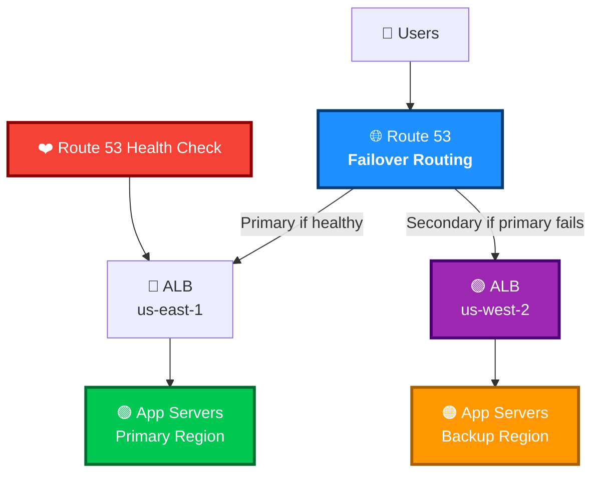

# Route 53

## 1. What Problem Does It Solve?

Amazon Route 53 is AWS’s managed DNS service.

It solves the problem of translating human-friendly domain names like:

```text
example.com
```

into IP addresses or AWS resources like:

```text
ALB, CloudFront, S3 static website, API Gateway, EC2
```

Simple idea:

> Route 53 is the internet traffic director for your domain.

Memory hook:

> **Route 53 = DNS + domain registration + health checks + traffic routing.**  
> The name comes from DNS using **port 53**.

---

## 2. Core Use Cases

| Use Case | Example |
|---|---|
| Register domains | Buy `example.com` |
| Host DNS records | Create records for `www.example.com` |
| Route users to AWS resources | Send traffic to ALB, CloudFront, S3 website |
| Private DNS inside VPC | Resolve `db.internal.example.com` privately |
| Multi-Region routing | Send users to the closest or healthiest Region |
| Failover | Send traffic to backup site if primary fails |
| Hybrid DNS | Connect AWS DNS with on-prem DNS |
| DNS security filtering | Block malicious domains with Resolver DNS Firewall |

---

## 3. Important Features for SAA

### Hosted Zones

A hosted zone is a container for DNS records.

| Hosted Zone Type | Used For |
|---|---|
| Public hosted zone | DNS records visible on the internet |
| Private hosted zone | DNS records only resolvable inside associated VPCs |

Example:

```text
example.com public hosted zone
www.example.com -> ALB
api.example.com -> API Gateway
```

Private example:

```text
internal.example.com private hosted zone
db.internal.example.com -> private EC2 IP
```

---

### DNS Record Types

Common records for the exam:

| Record Type | Purpose |
|---|---|
| A | Maps name to IPv4 address |
| AAAA | Maps name to IPv6 address |
| CNAME | Maps one domain name to another domain name |
| MX | Mail server record |
| TXT | Text record, often used for verification |
| NS | Name servers for the hosted zone |
| SOA | Start of authority record |

---

### Alias Records

Alias records are a Route 53 special feature.

They let you point a DNS name directly to AWS resources.

Common alias targets:

- Elastic Load Balancer
- CloudFront distribution
- S3 static website endpoint
- API Gateway
- Elastic Beanstalk environment
- Another Route 53 record in the same hosted zone

Important exam points:

| Alias Record | CNAME Record |
|---|---|
| AWS-specific Route 53 feature | Standard DNS feature |
| Can be used at root domain/apex, like `example.com` | Cannot be used at root domain |
| Can point to AWS resources | Points to another DNS name |
| Free for many AWS alias targets | Normal DNS query charges may apply |

Example:

```text
example.com -> Alias -> ALB
```

Exam trap:

> For root domain `example.com`, choose **Alias record**, not CNAME.

---

### Routing Policies

Route 53 routing policies control how DNS answers are returned.

| Routing Policy | Use When |
|---|---|
| Simple | One record, basic routing |
| Weighted | Split traffic by percentage |
| Latency-based | Send users to lowest-latency Region |
| Failover | Active-passive disaster recovery |
| Geolocation | Route based on user location |
| Geoproximity | Route based on user/resource location, with optional bias |
| Multivalue answer | Return multiple healthy records |
| IP-based | Route based on client source IP/CIDR |

---

### Simple Routing

Used when one DNS name maps to one target.

Example:

```text
www.example.com -> ALB
```

Use for basic websites.

---

### Weighted Routing

Used to split traffic by assigned weights.

Example:

| Target | Weight |
|---|---:|
| ALB version 1 | 90 |
| ALB version 2 | 10 |

Use cases:

- Blue/green deployment
- Canary release
- A/B testing
- Gradual migration

Memory hook:

> **Weighted = percentage-style traffic control.**

---

### Latency-Based Routing

Routes users to the AWS Region with the lowest latency.

Example:

```text
US user -> us-east-1
Europe user -> eu-west-1
Asia user -> ap-southeast-1
```

Use when:

- App is deployed in multiple Regions
- You want better performance for global users

Exam trap:

> Latency routing is about **best network latency**, not necessarily closest geography.

---

### Failover Routing

Used for active-passive disaster recovery.

Example:

```text
Primary: ALB in us-east-1
Secondary: S3 static website or ALB in us-west-2
```

Route 53 uses health checks to know when to fail over.

Use when:

- You need backup infrastructure
- Primary site failure should redirect users to secondary site

Memory hook:

> **Failover = primary/backup.**

---

### Geolocation Routing

Routes users based on geographic location.

Example:

```text
Users from Germany -> German site
Users from US -> US site
Default -> Global site
```

Use when:

- Content must be localized
- Legal/compliance rules require regional routing

Exam trap:

> Geolocation routing is based on **where the user is located**, not latency.

---

### Geoproximity Routing

Routes based on location of users and resources.

Can shift traffic using a bias value.

Use when:

- You want location-aware routing
- You want to expand or shrink the area served by a Region

Exam focus:

> Geoproximity is less common than geolocation and latency, but know that it supports **bias**.

---

### Multivalue Answer Routing

Returns multiple healthy IP addresses.

Route 53 can return up to 8 healthy records.

Use when:

- You want simple DNS-level load distribution
- You want Route 53 to avoid unhealthy endpoints

Exam trap:

> Multivalue is **not a replacement for ELB**.  
> ELB is still better for real load balancing.

---

### Health Checks

Route 53 health checks monitor endpoints.

Health checks can monitor:

- Public web endpoint
- Other health checks
- CloudWatch alarm

Used for:

- DNS failover
- Monitoring availability
- Routing only to healthy resources

Important:

> Route 53 health checks usually require endpoints to be publicly reachable unless using CloudWatch alarm-based health checks.

---

### TTL

TTL means Time To Live.

It controls how long DNS resolvers cache a DNS answer.

| TTL Type | Effect |
|---|---|
| Low TTL | Faster DNS changes, more DNS queries |
| High TTL | Slower DNS changes, fewer DNS queries |

Example:

```text
TTL = 60 seconds
```

Means DNS resolvers may cache the answer for 60 seconds.

Exam trap:

> DNS failover is not always instant because DNS answers can be cached.

---

### Route 53 Resolver

Route 53 Resolver provides DNS resolution for VPCs.

Main uses:

| Feature | Purpose |
|---|---|
| Default VPC DNS resolver | Resolves AWS and private DNS names |
| Inbound endpoint | On-premises DNS can query AWS private hosted zones |
| Outbound endpoint | AWS VPC can forward DNS queries to on-prem DNS |
| Resolver rules | Define which domains should be forwarded |
| DNS Firewall | Filter/block malicious DNS queries from VPCs |

Hybrid DNS example:

```text
On-prem app -> Resolver inbound endpoint -> private hosted zone
EC2 instance -> Resolver outbound endpoint -> on-prem DNS server
```

Memory hook:

> **Inbound = into AWS.**  
> **Outbound = out from AWS.**

---

### DNSSEC

DNSSEC helps protect DNS responses from tampering.

Route 53 supports:

- DNSSEC signing for hosted zones
- DNSSEC validation with Route 53 Resolver

Exam focus:

> DNSSEC protects DNS integrity.  
> It does not encrypt website traffic. Use HTTPS/TLS for that.

---

## 4. Security Model

### IAM Permissions

Route 53 uses IAM for management access.

Examples:

```text
route53:CreateHostedZone
route53:ChangeResourceRecordSets
route53:GetHostedZone
route53:ListHostedZones
route53:CreateHealthCheck
```

Best practices:

- Use least privilege IAM policies
- Limit who can change DNS records
- Protect domain registration permissions
- Use MFA for admin users
- Use CloudTrail to audit Route 53 API activity

Important:

> DNS changes are high impact. A wrong record can take an app offline.

---

### Encryption Options

Route 53 DNS itself is not a data storage encryption service like S3 or EBS.

Important points:

| Area | Security Feature |
|---|---|
| DNS integrity | DNSSEC |
| Website encryption | Use HTTPS/TLS with ACM certificates |
| API access | AWS API calls use TLS |
| Domain ownership validation | TXT/CNAME records often used |
| Private DNS | Private hosted zones inside VPCs |

Exam trap:

> Route 53 does not encrypt application traffic.  
> Use **ACM + HTTPS** with CloudFront, ALB, or API Gateway.

---

### Network/Security Controls

Important controls:

- Public hosted zones expose DNS records publicly
- Private hosted zones only work inside associated VPCs
- Resolver inbound/outbound endpoints use ENIs in VPC subnets
- Security groups control Resolver endpoint traffic
- DNS Firewall can block or allow domain queries from VPCs
- Health checks can integrate with CloudWatch alarms

---

### Shared Responsibility

AWS is responsible for:

- Availability of Route 53 infrastructure
- Global DNS service operation
- Managed DNS control plane and data plane

You are responsible for:

- Correct DNS records
- Correct TTL values
- Securing IAM permissions
- Domain ownership and renewal
- Enabling DNSSEC if needed
- Configuring health checks and failover correctly
- Avoiding accidental public exposure of internal records

---

## 5. High Availability / Durability Behavior

### Availability

Route 53 is designed as a highly available global DNS service.

Key points:

- Public DNS is globally distributed
- Hosted zones are not tied to one Availability Zone
- Route 53 can route users to healthy endpoints
- Health checks can support automatic DNS failover

---

### Fault Tolerance

Route 53 supports fault tolerance through:

- Health checks
- Failover routing
- Latency routing across Regions
- Weighted routing across multiple targets
- Multivalue answer routing with healthy records

Example:

```text
Primary Region fails
Route 53 health check fails
Route 53 returns secondary Region DNS answer
```

---

### Multi-AZ / Multi-Region Behavior

| Feature | Behavior |
|---|---|
| Public hosted zone | Global service |
| Private hosted zone | Associated with one or more VPCs |
| Resolver endpoints | Regional, deployed in VPC subnets |
| Resolver endpoint HA | Use multiple IPs in different AZs |
| Routing policies | Can route across Regions |
| Health checks | Can monitor endpoints and support failover |

---

### Durability

Route 53 DNS records are managed by AWS and replicated across Route 53 infrastructure.

For SAA:

> Think of Route 53 as a highly available global DNS service, not as a storage durability service like S3.

---

## 6. Cost Optimization Options

Route 53 pricing commonly includes:

- Hosted zones
- DNS queries
- Domain registration/renewal
- Health checks
- Resolver endpoints
- DNS Firewall
- Traffic Flow, if used

Cost optimization tips:

| Option | How It Helps |
|---|---|
| Use Alias records for AWS targets | Alias queries to many AWS resources are free |
| Avoid unnecessary hosted zones | Hosted zones have monthly cost |
| Use appropriate TTL | Higher TTL can reduce query volume |
| Delete unused health checks | Health checks have cost |
| Avoid unnecessary Resolver endpoints | Endpoints can add hourly/query cost |
| Avoid Traffic Flow unless needed | It can be more expensive |
| Consolidate DNS design | Reduces duplicate zones and records |

Exam tip:

> For AWS resources like ALB or CloudFront, prefer **Alias records**.

---

## 7. Common Exam Traps

### Trap 1: CNAME at Root Domain

Wrong:

```text
example.com -> CNAME -> my-alb.amazonaws.com
```

Correct:

```text
example.com -> Alias -> ALB
```

Why:

> CNAME cannot be used at the zone apex/root domain. Alias can.

---

### Trap 2: Geolocation vs Latency

| Policy | Routes Based On |
|---|---|
| Geolocation | User location |
| Latency | Lowest network latency |

Memory hook:

> **Geo = where user is.**  
> **Latency = fastest response.**

---

### Trap 3: Weighted Routing Is Not Auto Scaling

Weighted routing sends a percentage of DNS traffic to targets.

It does not:

- Automatically add servers
- Check CPU usage
- Replace Auto Scaling

Use Auto Scaling for scaling compute.

---

### Trap 4: Multivalue Is Not ELB

Multivalue can return multiple healthy records.

But it does not provide:

- Advanced load balancing
- Layer 7 routing
- TLS termination
- Sticky sessions

Use ELB for real load balancing.

---

### Trap 5: DNS Failover Is Not Instant

Because DNS resolvers cache answers based on TTL.

Low TTL helps faster failover but increases DNS query volume.

---

### Trap 6: Private Hosted Zone Is Not Public

Private hosted zones only resolve inside associated VPCs.

They are used for internal DNS names.

---

### Trap 7: Route 53 Does Not Encrypt Web Traffic

Route 53 routes DNS.

For encrypted application traffic, use:

- ACM certificates
- HTTPS
- CloudFront
- ALB listener with TLS
- API Gateway custom domain with TLS

---

### Trap 8: Health Checks Need Reachability

Standard Route 53 endpoint health checks need to reach the target.

For private resources, consider:

- CloudWatch alarm-based health check
- Internal monitoring
- Failover design using private hosted zone features where applicable

---

## 8. Compare With Similar Services

| Service | Main Purpose | Choose When |
|---|---|---|
| Route 53 | DNS, domain registration, routing, health checks | You need DNS for public or private domains |
| Elastic Load Balancing | Distribute traffic across targets | You need application/network load balancing |
| CloudFront | CDN and edge caching | You need global content delivery and caching |
| AWS Global Accelerator | Static Anycast IPs and global traffic acceleration | You need fast failover and static IPs for global apps |
| VPC DNS Resolver | Default DNS resolution in VPC | You need normal DNS resolution inside VPC |
| Route 53 Resolver | Hybrid/private DNS forwarding | You need AWS-to-on-prem DNS integration |
| AWS Cloud Map | Service discovery | Microservices need dynamic service discovery |
| ACM | TLS certificate management | You need HTTPS certificates |

Simple decision guide:

| Requirement | Best Choice |
|---|---|
| Register domain | Route 53 |
| Create DNS records | Route 53 |
| Root domain to ALB | Route 53 Alias |
| Distribute traffic to EC2 targets | ELB |
| Cache static content globally | CloudFront |
| Private DNS inside VPC | Route 53 Private Hosted Zone |
| Forward DNS between AWS and on-prem | Route 53 Resolver |
| Block DNS queries to bad domains | Resolver DNS Firewall |
| Static global IPs with fast failover | Global Accelerator |

---

## 9. Mini Architecture Example

### Scenario

A company runs a web app in two AWS Regions:

- Primary Region: `us-east-1`
- Backup Region: `us-west-2`

They want users to access:

```text
www.example.com
```

If the primary Region fails, traffic should go to the backup Region.

### Architecture

- Route 53 public hosted zone for `example.com`
- Failover routing policy
- Primary alias record to ALB in `us-east-1`
- Secondary alias record to ALB in `us-west-2`
- Route 53 health check for primary endpoint
- ACM certificates for HTTPS on both ALBs



### Why This Works

- Route 53 answers DNS queries for `www.example.com`
- Users normally go to the primary ALB
- Route 53 health check monitors the primary endpoint
- If primary becomes unhealthy, Route 53 returns the secondary ALB
- DNS caching means failover speed depends partly on TTL

---

## 10. Practice Questions

### Question 1

A company wants to route `example.com` directly to an Application Load Balancer. Which Route 53 record should they use?

A. CNAME record  
B. Alias A record  
C. MX record  
D. TXT record  

**Correct Answer: B. Alias A record**

Explanation:

Alias records can point the root domain/apex, such as `example.com`, to AWS resources like an ALB.

Why the others are wrong:

- A is wrong because CNAME cannot be used at the root domain.
- C is wrong because MX is for email routing.
- D is wrong because TXT is for text verification, not web routing.

---

### Question 2

A company has applications in `us-east-1` and `eu-west-1`. They want users routed to the Region with the best response time. Which routing policy should they use?

A. Weighted routing  
B. Geolocation routing  
C. Latency-based routing  
D. Failover routing  

**Correct Answer: C. Latency-based routing**

Explanation:

Latency-based routing sends users to the AWS Region that provides the lowest latency.

Why the others are wrong:

- A is wrong because weighted routing splits traffic by configured weights.
- B is wrong because geolocation routes based on user location, not measured latency.
- D is wrong because failover is for active-passive disaster recovery.

---

### Question 3

A company wants 90% of users to go to version 1 of an application and 10% to version 2. Which routing policy should they use?

A. Weighted routing  
B. Simple routing  
C. Failover routing  
D. Multivalue answer routing  

**Correct Answer: A. Weighted routing**

Explanation:

Weighted routing lets you split traffic by assigned weights, such as 90/10.

Why the others are wrong:

- B is wrong because simple routing does not split traffic by percentage.
- C is wrong because failover is for primary/backup routing.
- D is wrong because multivalue returns multiple healthy records, not precise percentage splits.

---

### Question 4

A company needs internal DNS names like `db.internal.example.com` to resolve only inside its VPCs. What should it use?

A. Public hosted zone  
B. Private hosted zone  
C. CloudFront distribution  
D. Internet Gateway  

**Correct Answer: B. Private hosted zone**

Explanation:

A private hosted zone stores DNS records that are resolvable only from associated VPCs.

Why the others are wrong:

- A is wrong because public hosted zones are internet-facing.
- C is wrong because CloudFront is a CDN.
- D is wrong because an Internet Gateway provides internet connectivity, not DNS hosting.

---

### Question 5

A company wants its on-premises DNS servers to resolve records in an AWS private hosted zone. Which Route 53 feature should it use?

A. Route 53 Resolver inbound endpoint  
B. Route 53 Resolver outbound endpoint  
C. Route 53 public hosted zone  
D. Weighted routing  

**Correct Answer: A. Route 53 Resolver inbound endpoint**

Explanation:

Inbound endpoints allow DNS queries from on-premises networks into AWS VPC DNS resolution.

Why the others are wrong:

- B is wrong because outbound endpoints forward DNS queries from AWS to external DNS systems.
- C is wrong because public hosted zones are for internet DNS.
- D is wrong because weighted routing controls traffic distribution, not hybrid DNS resolution.

---

## Final Exam Memory Hooks

| Concept | Memory Hook |
|---|---|
| Route 53 | DNS traffic director |
| Alias | AWS-friendly CNAME replacement |
| CNAME | Not for root domain |
| Weighted | Percentage split |
| Latency | Fastest network response |
| Geolocation | User location |
| Failover | Primary/backup |
| Private hosted zone | Internal VPC DNS |
| Resolver inbound | On-prem into AWS |
| Resolver outbound | AWS out to on-prem |
| DNSSEC | DNS integrity, not encryption |
| TTL | DNS cache timer |