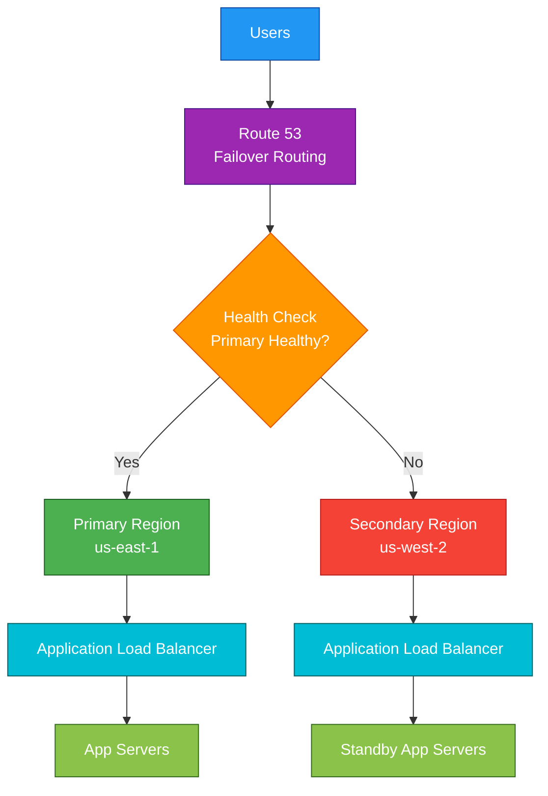

# Route 53

## 1. Definition

### Simple Definition

Amazon Route 53 is AWS’s managed DNS service.

It translates human-friendly domain names like `example.com` into IP addresses or AWS resource endpoints.

### Memory Hook

Route 53 = Route users to the right destination.

### Basic Idea

When a user enters a website name, Route 53 helps decide where that request should go.

### What Route 53 Can Do

Route 53 can be used for:

- Domain registration
- DNS hosting
- Routing traffic to AWS resources
- Health checks
- DNS failover
- Private DNS inside VPCs
- Hybrid DNS between AWS and on-premises networks

## 2. What Problem Does It Solve?

### Main Problem

Route 53 solves the problem of connecting domain names to the correct application or infrastructure.

Without DNS, users would need to remember IP addresses instead of names like `myapp.com`.

### Without Route 53

You would need to manage DNS servers yourself.

This creates problems such as:

- Manual DNS infrastructure management
- Complex failover setup
- Harder routing across Regions
- Harder integration with AWS services
- More operational overhead

### With Route 53

AWS manages the DNS infrastructure for you.

You create DNS records, and Route 53 answers DNS queries globally.

### Key Benefit

Route 53 helps route users reliably, globally, and intelligently.

## 3. Core Use Cases

### Public Website DNS

Use Route 53 to route public domain names to AWS resources.

Examples:

- `example.com` to CloudFront
- `api.example.com` to an Application Load Balancer
- `app.example.com` to EC2 or Elastic IP

### Domain Registration

Route 53 can register and manage domain names.

Examples:

- `example.com`
- `mycompany.io`
- `myapp.net`

### DNS Routing to AWS Services

Route 53 can route traffic to:

- Elastic Load Balancers
- CloudFront distributions
- S3 static websites
- API Gateway custom domains
- Elastic Beanstalk environments

### Health Check and Failover

Route 53 can monitor endpoints and route traffic away from unhealthy targets.

Example:

- Primary Region fails
- Route 53 routes users to standby Region

### Private DNS for VPCs

Private hosted zones allow DNS names to resolve only inside selected VPCs.

Example:

- `db.internal.example.com`
- `api.internal.example.com`

### Hybrid DNS

Route 53 Resolver can connect DNS between AWS VPCs and on-premises data centers.

## 4. Important Features for SAA

### Hosted Zones

A hosted zone is a container for DNS records.

There are two types:

| Hosted Zone Type | Purpose |
|---|---|
| Public Hosted Zone | DNS records for the public internet |
| Private Hosted Zone | DNS records only inside associated VPCs |

### DNS Records

DNS records tell Route 53 how to respond to DNS queries.

Common records:

| Record Type | Purpose |
|---|---|
| A | Maps domain to IPv4 address |
| AAAA | Maps domain to IPv6 address |
| CNAME | Maps one domain name to another domain name |
| MX | Mail server record |
| TXT | Text record, often used for verification |
| NS | Name servers for the domain |
| SOA | Administrative DNS information |

### Alias Records

Alias records are special Route 53 records that point to AWS resources.

Common alias targets:

- Elastic Load Balancer
- CloudFront distribution
- S3 static website endpoint
- API Gateway custom domain
- Another Route 53 record in the same hosted zone

### Alias vs CNAME

| Feature | Alias Record | CNAME Record |
|---|---|---|
| AWS-specific | Yes | No |
| Can be used at root domain | Yes | No |
| Example root domain | `example.com` | Not allowed |
| Points to AWS resources | Yes | Indirectly |
| Extra DNS query cost to AWS target | Usually optimized | Standard DNS behavior |

### Exam Tip: Root Domain

For `example.com`, use an Alias record.

Do not use CNAME at the zone apex/root domain.

### Routing Policies

Route 53 supports different routing policies.

| Routing Policy | Use Case |
|---|---|
| Simple | One record, basic routing |
| Weighted | Split traffic by percentage |
| Latency-Based | Route to lowest-latency Region |
| Failover | Active-passive disaster recovery |
| Geolocation | Route based on user location |
| Geoproximity | Route based on location and optional bias |
| Multivalue Answer | Return multiple healthy IPs |
| IP-Based | Route based on client IP ranges |

### Simple Routing

Simple routing sends traffic to one destination.

Use it when there is no special routing requirement.

### Weighted Routing

Weighted routing splits traffic based on assigned weights.

Example:

| Target | Weight | Result |
|---|---:|---|
| App v1 | 90 | Receives most traffic |
| App v2 | 10 | Receives small test traffic |

Use for:

- Blue/green deployments
- Canary testing
- Gradual migrations

### Latency-Based Routing

Latency-based routing sends users to the AWS Region with the lowest latency.

Use when users are global and you deploy in multiple Regions.

### Failover Routing

Failover routing sends traffic to a primary endpoint when healthy.

If the primary endpoint fails, Route 53 sends traffic to the secondary endpoint.

Use for active-passive disaster recovery.

### Geolocation Routing

Geolocation routing sends users to endpoints based on their geographic location.

Example:

- US users go to US endpoint
- European users go to EU endpoint

### Geoproximity Routing

Geoproximity routing routes users based on the location of resources and users.

You can also apply a bias to shift more traffic toward or away from a location.

### Multivalue Answer Routing

Multivalue answer routing returns multiple healthy records.

It is similar to basic DNS load balancing, but it is not a replacement for an Elastic Load Balancer.

### Health Checks

Route 53 health checks monitor the health of endpoints.

They can check:

- HTTP
- HTTPS
- TCP
- CloudWatch alarms
- Calculated health checks

### TTL

TTL means Time To Live.

It controls how long DNS resolvers cache a DNS response.

| TTL Value | Effect |
|---|---|
| Low TTL | Faster DNS changes, more DNS queries |
| High TTL | Slower DNS changes, fewer DNS queries |

### Route 53 Resolver

Route 53 Resolver provides DNS resolution for VPCs.

Important features:

- Resolver inbound endpoints
- Resolver outbound endpoints
- Resolver rules
- DNS Firewall
- Query logging

### Private Hosted Zones

Private hosted zones provide internal DNS names for resources inside VPCs.

Important points:

- Not accessible from the public internet
- Must be associated with one or more VPCs
- Useful for internal service discovery

## 5. Security Model

### IAM Permissions

IAM controls who can manage Route 53 resources.

Common permissions:

| Permission | Purpose |
|---|---|
| `route53:CreateHostedZone` | Create hosted zones |
| `route53:ChangeResourceRecordSets` | Create, update, or delete DNS records |
| `route53:ListHostedZones` | View hosted zones |
| `route53:GetHostedZone` | Read hosted zone details |
| `route53:CreateHealthCheck` | Create health checks |
| `route53domains:RegisterDomain` | Register domains |

### Hosted Zone Access

Access to hosted zones is controlled mainly through IAM policies.

For SAA, remember:

- Public hosted zones answer public DNS queries
- Private hosted zones only resolve inside associated VPCs
- IAM controls who can change DNS records

### Encryption at Rest

Route 53 is a managed AWS service, and AWS manages the underlying infrastructure security.

For DNS data itself, focus more on access control and DNSSEC than traditional storage encryption.

### Encryption in Transit

Standard DNS queries are not encrypted by default.

For exam purposes, remember:

- DNSSEC helps verify authenticity and integrity
- DNSSEC does not encrypt DNS query contents

### DNSSEC

DNSSEC helps protect against DNS spoofing and tampering.

It provides integrity validation for DNS responses.

### Network and Security Controls

Route 53 is a global DNS service.

Private DNS security controls include:

- Private hosted zones
- VPC associations
- Route 53 Resolver rules
- Resolver DNS Firewall
- Security groups for Resolver endpoints

### Route 53 Resolver DNS Firewall

DNS Firewall can block or allow DNS queries from VPCs based on domain lists.

Use it to help prevent access to malicious or unwanted domains.

### Shared Responsibility

AWS is responsible for:

- Route 53 global DNS infrastructure
- Availability of the managed DNS service
- Physical security
- Service operations

You are responsible for:

- Correct DNS record configuration
- IAM permissions
- Domain ownership management
- Health check configuration
- DNSSEC configuration if needed
- Private hosted zone VPC associations
- Resolver and DNS Firewall rules

## 6. High Availability / Durability Behavior

### Availability

Route 53 is designed as a highly available global DNS service.

It uses a global network of DNS servers to answer queries.

### Fault Tolerance

Route 53 automatically handles DNS infrastructure failures.

You do not manage DNS servers, clusters, or scaling.

### Global Service Behavior

Route 53 is global for public DNS.

However, some features are regional or tied to VPCs.

Examples:

| Feature | Scope |
|---|---|
| Public hosted zones | Global DNS behavior |
| Private hosted zones | Associated VPCs |
| Resolver endpoints | Regional |
| Health checks | Global service feature |

### Multi-AZ Behavior

You do not configure Multi-AZ for Route 53 public DNS.

AWS manages availability across its global DNS infrastructure.

### Multi-Region Behavior

Route 53 is commonly used to route traffic across multiple AWS Regions.

Example:

- Primary application in `us-east-1`
- Disaster recovery application in `us-west-2`
- Route 53 failover routing between them

### Durability

DNS records are managed by AWS as part of the Route 53 service.

For exam purposes, focus on Route 53’s high availability and global DNS design rather than storage durability.

### Failover Behavior

Route 53 can use health checks to detect unhealthy endpoints and route traffic to healthy alternatives.

Important point:

DNS caching can delay failover depending on TTL.

### TTL and Failover

Lower TTL can make failover faster.

Higher TTL can cause clients and resolvers to keep using old DNS answers longer.

## 7. Cost Optimization Options

### Use Appropriate TTL Values

Higher TTL values can reduce DNS query volume.

Lower TTL values are useful when records change often but may increase query volume.

### Use Alias Records for AWS Resources

Alias records are often the best choice for AWS targets such as:

- ELB
- CloudFront
- S3 static website endpoints
- API Gateway custom domains

### Avoid Unnecessary Health Checks

Health checks have additional cost.

Only create health checks when you need failover or health-based routing.

### Avoid Overly Complex Routing

Advanced routing policies can be useful, but unnecessary complexity can increase operational overhead.

Use the simplest routing policy that meets the requirement.

### Monitor Query Volume

High DNS query volume can increase Route 53 costs.

Use DNS query logging when needed, but remember that logs stored in CloudWatch Logs, S3, or other services may create additional cost.

### Domain Registration Costs

Domain registration and renewal are separate costs from DNS hosting and DNS queries.

### Private DNS Cost Awareness

Private hosted zones, Resolver endpoints, and query logs can add cost.

Use them when they solve a real networking or hybrid DNS requirement.

## 8. Common Exam Traps

### Route 53 Is DNS, Not a Load Balancer

Route 53 can route DNS queries, but it does not operate like an Application Load Balancer.

For HTTP path-based routing, choose ALB or CloudFront.

### Multivalue Is Not the Same as ELB

Multivalue answer routing can return multiple healthy IPs.

But it does not replace ELB features like:

- Health-aware load balancing at request level
- TLS termination
- Path-based routing
- Target groups

### CNAME Cannot Be Used at Root Domain

You cannot use CNAME at the zone apex, such as `example.com`.

Use an Alias record instead.

### Alias Is Common for AWS Resources

If the exam asks how to point `example.com` to an ELB, CloudFront distribution, or S3 static website, choose Alias record.

### DNS Failover Is Affected by TTL

Route 53 health checks can detect failure, but DNS caching can delay traffic switching.

Low TTL helps faster changes.

### Private Hosted Zone Is Not Public

Private hosted zones only resolve inside associated VPCs.

They do not expose records to the internet.

### Route 53 Does Not Encrypt DNS Queries by Default

DNSSEC verifies DNS response integrity.

It does not encrypt the DNS query itself.

### Latency-Based vs Geolocation

| Routing Type | Routes Based On |
|---|---|
| Latency-Based | Lowest latency to AWS Region |
| Geolocation | User’s geographic location |

### Weighted vs Failover

| Routing Type | Use Case |
|---|---|
| Weighted | Split traffic between targets |
| Failover | Active-passive disaster recovery |

### Route 53 Resolver Is for VPC DNS

Route 53 Resolver is important for DNS between:

- VPCs
- AWS and on-premises
- Private hosted zones
- Conditional forwarding rules

## 9. Compare With Similar Services

### Service Comparison Table

| Service | Main Purpose | Best For | Choose When |
|---|---|---|---|
| Route 53 | DNS and domain routing | Mapping domain names to resources | You need DNS, domain registration, or DNS failover |
| Elastic Load Balancer | Load balancing | Distributing traffic across targets | You need request-level load balancing |
| CloudFront | CDN | Caching content globally | You need low-latency content delivery |
| Global Accelerator | Global traffic acceleration | Static anycast IPs and fast global routing | You need improved global performance and failover |
| API Gateway | API management | Managing REST, HTTP, or WebSocket APIs | You need API routing, throttling, auth, or stages |
| AWS Cloud Map | Service discovery | Discovering cloud resources dynamically | You need service discovery for microservices |

### Route 53 vs Elastic Load Balancer

| Feature | Route 53 | ELB |
|---|---|---|
| Layer | DNS | Layer 4 or Layer 7 |
| Main job | Resolve domain names | Distribute requests |
| Health checks | DNS-level failover | Target-level load balancing |
| Routing timing | DNS query time | Every request |
| Common use together | Domain points to ELB | ELB forwards to targets |

### Route 53 vs CloudFront

| Feature | Route 53 | CloudFront |
|---|---|---|
| Main purpose | DNS | CDN |
| Caching | No | Yes |
| Routes domain names | Yes | Uses edge locations for content delivery |
| Common use together | Domain points to CloudFront | CloudFront serves cached content |

### Route 53 vs Global Accelerator

| Feature | Route 53 | Global Accelerator |
|---|---|---|
| Routing method | DNS-based | Anycast static IPs |
| Failover speed | Affected by DNS TTL/cache | Faster failover |
| Static IPs | No fixed anycast IPs | Provides static anycast IPs |
| Best for | DNS routing | Global performance and fast failover |

### When to Choose Route 53

Choose Route 53 when:

- You need DNS hosting
- You need to register a domain
- You need to route a domain to AWS resources
- You need DNS failover
- You need private DNS inside a VPC
- You need hybrid DNS with on-premises

## 10. Mini Architecture Example

### Scenario

A company runs a public web application in two AWS Regions.

The company wants users to go to the primary Region normally, but if the primary Region fails, users should be routed to the secondary Region.

### Architecture

Route 53 uses failover routing with health checks.

The primary record points to the main Region.

The secondary record points to the disaster recovery Region.

### Why This Is Good

- Route 53 manages DNS routing
- Health checks detect primary failure
- Users can be redirected to a standby Region
- The architecture supports disaster recovery
- No self-managed DNS servers are required

### Exam Answer Pattern

If the question says:

“Route users to a secondary Region when the primary Region becomes unhealthy.”

Think:

Route 53 failover routing with health checks.

### Final Memory Hook

Route 53 is for DNS routing.

ELB is for request load balancing.

CloudFront is for caching.

Global Accelerator is for static anycast IPs and faster global failover.

