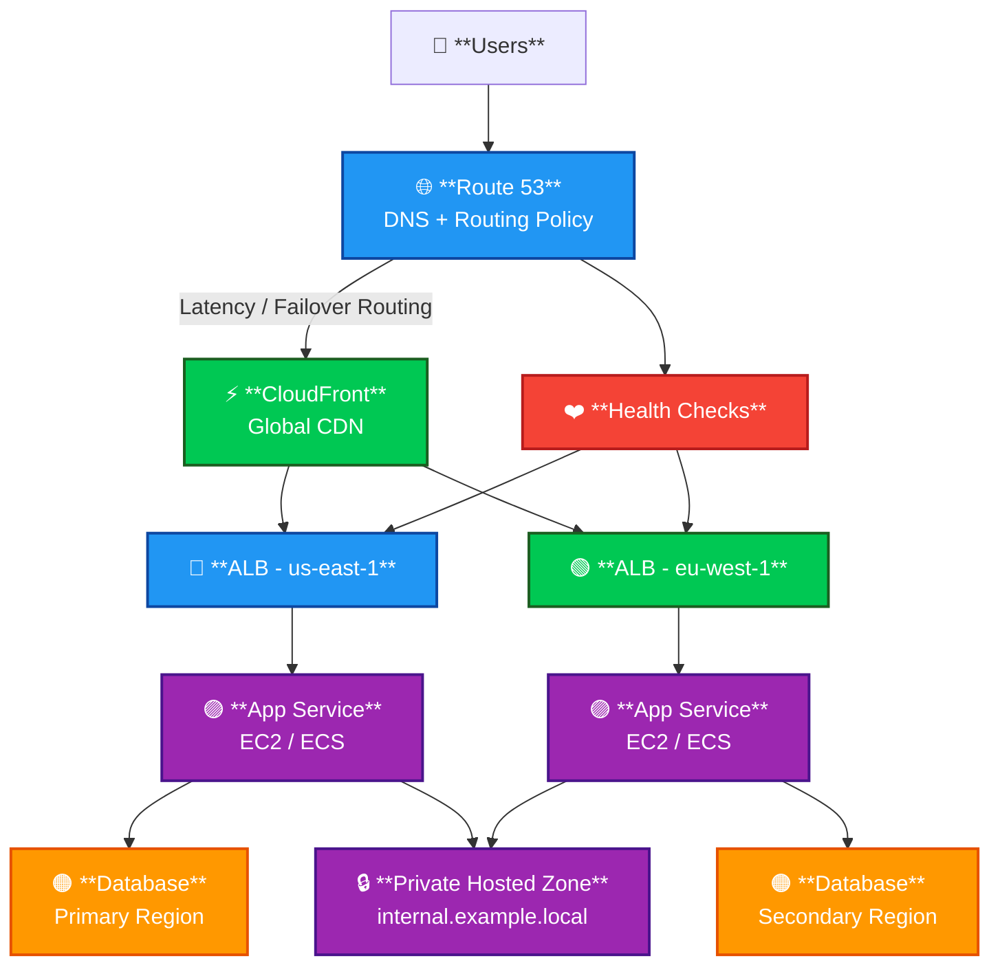

# Route 53

<details>
<summary><strong>## 1. Definition</strong></summary>

Amazon Route 53 is AWS’s highly available and scalable DNS service.

In simple terms:

> Route 53 helps users reach your application using a domain name like `example.com` instead of an IP address.

Route 53 can be used for:

| Function | Meaning |
|---|---|
| Domain registration | Buy and manage domain names |
| DNS routing | Send users to AWS or non-AWS resources |
| Health checks | Detect unhealthy endpoints and route traffic away |
| Private DNS | Resolve internal domain names inside VPCs |

**Memory hook:**  
Route 53 = “Phone book of the internet” + smart traffic router.

</details>

---

<details>
<summary><strong>## 2. What Problem Does It Solve?</strong></summary>

Route 53 solves the problem of connecting human-friendly domain names to cloud resources.

Without Route 53, users would need to remember IP addresses.

Example:

| User Enters | Route 53 Sends Them To |
|---|---|
| `www.example.com` | CloudFront distribution |
| `api.example.com` | Application Load Balancer |
| `internal.example.local` | Private service inside a VPC |

Route 53 also helps with:

- Routing users to the closest or best endpoint
- Failing over to backup resources
- Splitting traffic between multiple versions
- Managing public and private DNS records

</details>

---

<details>
<summary><strong>## 3. Core Use Cases</strong></summary>

Common real-world Route 53 use cases:

| Use Case | Example |
|---|---|
| Host public DNS records | `example.com` points to CloudFront |
| Register domains | Buy `mycompany.com` |
| Route traffic to AWS resources | ALB, CloudFront, S3 static website |
| Route traffic to non-AWS resources | On-premises server IP |
| DNS failover | Route to backup Region if primary fails |
| Blue/green deployments | Weighted routing between app versions |
| Multi-Region apps | Latency-based or failover routing |
| Private DNS in VPC | `db.internal.local` resolves only inside VPC |
| Hybrid DNS | Connect VPC DNS with on-prem DNS using Route 53 Resolver |

</details>

---

<details>
<summary><strong>## 4. Important Features for SAA</strong></summary>

### Hosted Zones

| Type | Purpose |
|---|---|
| Public hosted zone | DNS records for the internet |
| Private hosted zone | DNS records only inside one or more VPCs |

Example:

| Hosted Zone | Visibility |
|---|---|
| `example.com` | Public internet |
| `internal.example.com` | Private VPC DNS |

**Exam tip:**  
Private hosted zones are for internal VPC DNS, not public internet traffic.

---

### DNS Record Types

| Record | Purpose |
|---|---|
| A | Maps name to IPv4 address |
| AAAA | Maps name to IPv6 address |
| CNAME | Maps one DNS name to another DNS name |
| MX | Mail routing |
| TXT | Text verification, SPF, DKIM |
| NS | Name servers for the zone |
| SOA | Administrative DNS info |
| Alias | AWS-specific record pointing to AWS resources |

---

### Alias Records

Alias records are special Route 53 records that can point to AWS resources.

Common Alias targets:

- CloudFront
- Application Load Balancer
- Network Load Balancer
- S3 static website endpoint
- API Gateway
- Elastic Beanstalk
- VPC interface endpoints

Alias records are important because they can be used at the root domain.

Example:

```text
example.com -> CloudFront distribution
```

A normal CNAME usually cannot be used at the root domain.

**Memory hook:**  
Alias = “AWS-aware CNAME-like record.”

---

### Routing Policies

| Routing Policy | Use When |
|---|---|
| Simple | One record, basic routing |
| Weighted | Split traffic by percentage |
| Latency-based | Send users to lowest-latency Region |
| Failover | Active-passive disaster recovery |
| Geolocation | Route based on user location |
| Geoproximity | Route based on distance and optional bias |
| Multivalue answer | Return multiple healthy IPs |
| IP-based | Route based on client IP CIDR range |

---

### Simple Routing

Use simple routing when one domain points to one resource.

Example:

```text
www.example.com -> ALB
```

Best for basic websites.

---

### Weighted Routing

Weighted routing splits traffic between multiple resources.

Example:

| Version | Weight |
|---|---|
| App v1 | 90 |
| App v2 | 10 |

Useful for:

- Canary deployments
- Blue/green deployments
- A/B testing
- Gradual migrations

**Exam tip:**  
Weighted routing does not mean closest or fastest. It means percentage-based traffic distribution.

---

### Latency-Based Routing

Latency-based routing sends users to the AWS Region that gives the lowest latency.

Example:

| User Location | Routed To |
|---|---|
| Europe user | eu-west-1 |
| US user | us-east-1 |

Best for global applications where performance matters.

**Exam tip:**  
Latency-based routing is about network latency, not geography rules.

---

### Failover Routing

Failover routing supports active-passive disaster recovery.

| Record | Purpose |
|---|---|
| Primary | Main application endpoint |
| Secondary | Backup endpoint |

Route 53 uses health checks to decide if it should fail over.

Example:

```text
Primary: us-east-1 ALB
Secondary: us-west-2 ALB
```

**Exam tip:**  
Failover routing usually needs health checks.

---

### Geolocation Routing

Geolocation routing sends users based on their location.

Example:

| User Location | Endpoint |
|---|---|
| Germany | EU website |
| United States | US website |
| Default | Global website |

Useful for:

- Localization
- Compliance
- Region-specific content

**Exam trap:**  
Geolocation is based on user location.  
Latency-based is based on best performance.

---

### Geoproximity Routing

Geoproximity routing sends users based on geographic distance and optional bias.

Bias can expand or shrink the area served by a location.

Use it when you need more control than basic geolocation routing.

---

### Multivalue Answer Routing

Multivalue answer routing returns multiple healthy records.

Example:

```text
api.example.com -> IP1, IP2, IP3
```

It can use health checks and return only healthy values.

**Exam tip:**  
Multivalue routing is not a replacement for an Elastic Load Balancer.

---

### IP-Based Routing

IP-based routing routes users based on their source IP range.

Example:

| Client CIDR | Endpoint |
|---|---|
| Corporate network CIDR | Internal app endpoint |
| Partner CIDR | Partner-specific endpoint |

Useful when routing depends on known client networks.

---

### Health Checks

Route 53 health checks monitor endpoints and can control DNS failover.

Health checks can monitor:

- Web servers
- Application endpoints
- Other health checks
- CloudWatch alarms

Common protocols:

- HTTP
- HTTPS
- TCP

**Exam tip:**  
Route 53 DNS failover depends on DNS TTL. It is not instant.

---

### TTL

TTL means Time To Live.

It controls how long DNS resolvers cache a DNS answer.

| TTL | Effect |
|---|---|
| Low TTL | Faster DNS changes, more queries, higher cost |
| High TTL | Slower DNS changes, fewer queries, lower cost |

**Memory hook:**  
Low TTL = faster changes but more cost.

---

### Route 53 Resolver

Route 53 Resolver handles DNS resolution inside VPCs.

Important parts:

| Component | Purpose |
|---|---|
| Resolver | Default DNS resolver in VPC |
| Inbound endpoint | On-premises DNS can query AWS private DNS |
| Outbound endpoint | AWS resources can query on-premises DNS |
| Resolver rules | Forward specific domains to specific DNS servers |

Use Resolver for hybrid DNS between AWS and on-premises networks.

Example:

```text
EC2 -> Route 53 Resolver -> On-prem DNS
```

---

### DNSSEC

DNSSEC helps protect DNS responses from spoofing or tampering.

Route 53 supports DNSSEC signing for hosted zones.

**Exam focus:**  
DNSSEC improves DNS authenticity and integrity, not encryption of traffic.

</details>

---

<details>
<summary><strong>## 5. Security Model</strong></summary>

### IAM Permissions

Route 53 is controlled using IAM permissions.

Common permissions:

| Permission | Purpose |
|---|---|
| `route53:CreateHostedZone` | Create hosted zones |
| `route53:ChangeResourceRecordSets` | Create/update/delete DNS records |
| `route53:GetHostedZone` | Read hosted zone details |
| `route53:ListHostedZones` | List hosted zones |
| `route53:CreateHealthCheck` | Create health checks |
| `route53domains:*` | Manage domain registration |

**Exam tip:**  
Be careful with `ChangeResourceRecordSets`. It can change production DNS.

---

### Encryption Options

Route 53 DNS itself does not encrypt normal DNS queries.

Security-related options:

| Feature | Purpose |
|---|---|
| DNSSEC | Validates DNS authenticity and integrity |
| HTTPS app endpoint | Encrypts traffic after DNS resolution |
| ACM certificates | Used with CloudFront, ALB, API Gateway |
| IAM | Controls who can change DNS records |

**Important:**  
Route 53 maps names to resources. It does not automatically encrypt your application traffic.

---

### Network / Security Controls

Important controls:

- Use private hosted zones for internal DNS
- Use least-privilege IAM policies
- Enable DNSSEC where required
- Use Route 53 Resolver DNS Firewall to filter DNS queries
- Use health checks carefully for failover
- Avoid exposing private records in public hosted zones

---

### Shared Responsibility

| AWS Responsibility | Customer Responsibility |
|---|---|
| Route 53 infrastructure availability | Correct DNS records |
| DNS service scalability | IAM access control |
| Managed name servers | TTL choices |
| Health check infrastructure | Correct failover design |
| Resolver service infrastructure | VPC DNS and forwarding rules |

**Exam tip:**  
AWS keeps Route 53 available. You are responsible for correct DNS configuration.

</details>

---

<details>
<summary><strong>## 6. High Availability / Durability Behavior</strong></summary>

### Availability

Route 53 is a global service.

It is designed to be highly available and scalable.

Important points:

- It does not run in a single Availability Zone
- It is globally distributed
- It can route users to healthy endpoints
- It can support Multi-Region architectures

---

### Fault Tolerance

Route 53 can improve fault tolerance using:

| Feature | Benefit |
|---|---|
| Health checks | Detect unhealthy endpoints |
| Failover routing | Send traffic to backup endpoint |
| Latency routing | Route users to best Region |
| Weighted routing | Shift traffic gradually |
| Multivalue routing | Return multiple healthy answers |

---

### Multi-AZ and Multi-Region Behavior

Route 53 itself is global.

Your target resources may be:

| Target | HA Design |
|---|---|
| ALB | Multi-AZ inside one Region |
| CloudFront | Global edge network |
| S3 static website | Regional service |
| Multi-Region ALBs | Route 53 failover or latency routing |
| On-premises endpoint | Health check and failover possible |

**Exam tip:**  
Route 53 does not make your app Multi-Region by itself. It only routes to endpoints you design.

---

### Durability

Route 53 stores DNS configuration in hosted zones.

Durability is mainly about configuration being managed by AWS.

For SAA, focus more on:

- Availability
- Routing policies
- Health checks
- Failover behavior

</details>

---

<details>
<summary><strong>## 7. Cost Optimization Options</strong></summary>

Route 53 pricing commonly includes:

| Cost Area | What You Pay For |
|---|---|
| Hosted zones | Monthly cost per hosted zone |
| DNS queries | Public DNS query volume |
| Health checks | Monthly cost per health check |
| Domain registration | Annual domain cost |
| Traffic Flow | Advanced traffic policy records |
| Resolver endpoints | Endpoint hours and query volume |

---

### Cost Optimization Tips

| Tip | Why It Helps |
|---|---|
| Delete unused hosted zones | Avoid monthly hosted zone cost |
| Delete unused health checks | Avoid health check charges |
| Use Alias records to AWS targets where appropriate | Some Alias queries to AWS resources are free |
| Use reasonable TTL values | Higher TTL can reduce query volume |
| Avoid unnecessary advanced routing | Some query types cost more |
| Clean up old test domains | Domain registration renewals can add cost |
| Monitor query volume | Detect unexpected DNS traffic |

---

### TTL Cost Tradeoff

| TTL Choice | Good For | Downside |
|---|---|---|
| Low TTL | Fast failover and migrations | More DNS queries |
| High TTL | Lower query volume | Slower DNS changes |

**Memory hook:**  
TTL is a cost and change-speed lever.

</details>

---

<details>
<summary><strong>## 8. Common Exam Traps</strong></summary>

### Trap 1: Alias vs CNAME

| Alias | CNAME |
|---|---|
| AWS-specific | Standard DNS |
| Can be used at root domain | Usually cannot be used at root domain |
| Can point to AWS resources | Points to another DNS name |
| Often free for AWS targets | Normal DNS query cost applies |

**Remember:**  
Use Alias for `example.com -> CloudFront/ALB`.

---

### Trap 2: Route 53 Is Not a Load Balancer

Route 53 can return DNS answers, but it does not operate like an Elastic Load Balancer.

| Route 53 | ELB |
|---|---|
| DNS routing | Actual traffic distribution |
| Uses DNS caching | Real-time load balancing |
| Failover depends on TTL | Faster target health response |
| Global DNS service | Regional load balancer |

---

### Trap 3: DNS Failover Is Not Instant

DNS records are cached by resolvers.

Even if Route 53 changes the answer, some clients may still use cached records until TTL expires.

---

### Trap 4: Geolocation vs Latency-Based Routing

| Routing Type | Based On |
|---|---|
| Geolocation | User location |
| Latency-based | Lowest network latency |
| Geoproximity | Distance plus optional bias |

---

### Trap 5: Public vs Private Hosted Zone

| Hosted Zone | Visibility |
|---|---|
| Public hosted zone | Internet |
| Private hosted zone | Associated VPCs only |

Private hosted zones require VPC association.

---

### Trap 6: Health Checks and Private Resources

Standard Route 53 public health checkers must be able to reach the endpoint.

For private resources, use options like:

- CloudWatch alarm health checks
- Internal monitoring
- Publicly reachable health endpoint if appropriate

---

### Trap 7: Domain Registration Is Separate From DNS Hosting

Route 53 can register domains and host DNS, but they are separate functions.

You can:

- Register a domain in Route 53 and use another DNS provider
- Register a domain elsewhere and use Route 53 DNS

---

### Trap 8: DNSSEC Does Not Encrypt Website Traffic

DNSSEC helps prove DNS answers are authentic.

It does not replace:

- HTTPS
- TLS certificates
- ACM
- Security groups
- WAF

</details>

---

<details>
<summary><strong>## 9. Compare With Similar Services</strong></summary>

| Service | Main Purpose | Choose It When |
|---|---|---|
| Route 53 | DNS, domain registration, health checks, routing | You need domain-based routing or DNS failover |
| Elastic Load Balancing | Distribute traffic across targets | You need real load balancing across EC2, containers, or IPs |
| CloudFront | CDN and edge caching | You need global content delivery and low-latency static/dynamic content |
| Global Accelerator | Static Anycast IPs and global traffic acceleration | You need fixed IPs and faster failover using AWS global network |
| AWS Certificate Manager | TLS certificates | You need HTTPS certificates for ALB, CloudFront, API Gateway |
| AWS WAF | Web request filtering | You need protection from common web attacks |
| Route 53 Resolver | VPC and hybrid DNS resolution | You need private or on-premises DNS integration |

### Quick Decision Table

| Requirement | Best Choice |
|---|---|
| Map `example.com` to CloudFront | Route 53 Alias |
| Balance traffic across EC2 instances | ALB/NLB |
| Serve global static content | CloudFront |
| Use static global IPs | Global Accelerator |
| Private DNS inside VPC | Route 53 Private Hosted Zone |
| Hybrid DNS with on-premises | Route 53 Resolver |
| DNS-based active-passive DR | Route 53 Failover Routing |

</details>

---

<details>
<summary><strong>## 10. Mini Architecture Example</strong></summary>

### Scenario

A company hosts a public web application.

Requirements:

- Users access the app using `www.example.com`
- Static and dynamic content are delivered globally
- Traffic goes to the closest healthy Region
- If one Region fails, users are routed to another Region
- Internal services use private DNS

### Architecture

```text
User -> Route 53 -> CloudFront -> ALB -> EC2/ECS
                         |
                         -> S3 static assets
```

For Multi-Region:

| Component | Purpose |
|---|---|
| Route 53 latency-based routing | Send users to best Region |
| Health checks | Avoid unhealthy endpoints |
| CloudFront | Global caching |
| ALB | Regional load balancing |
| Private hosted zone | Internal service discovery |

### Mermaid Diagram



### Why This Is Good

- Route 53 provides DNS routing
- Health checks support failover
- CloudFront improves global performance
- ALB distributes traffic inside each Region
- Private hosted zones support internal service names

**SAA memory hook:**  
Route 53 chooses “where to send users.”  
ELB chooses “which backend gets the request.”  
CloudFront chooses “which edge location serves content.”

</details>