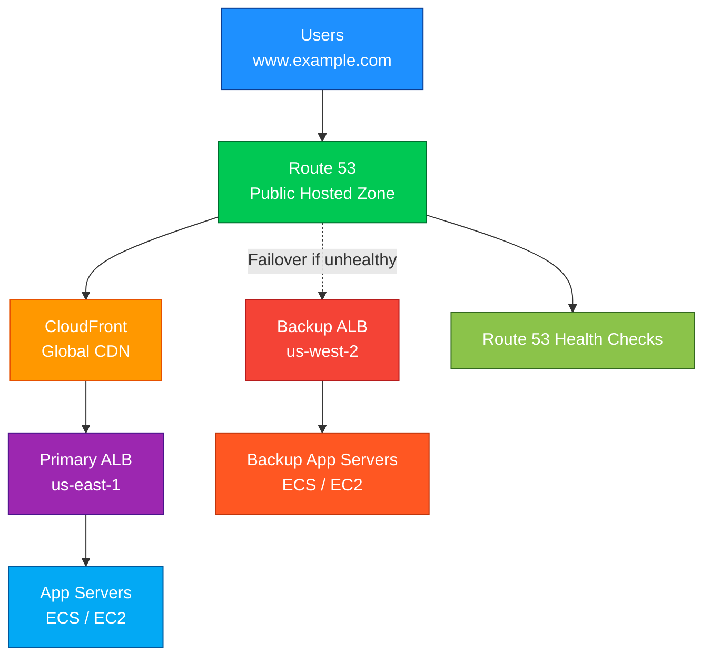

# Route 53

<details>
<summary>1. Definition</summary>

## 1. Definition

### Simple Definition

Amazon Route 53 is AWS’s highly available and scalable DNS service.

It helps translate human-friendly domain names like:

```text
example.com
```

into IP addresses or AWS resources like:

```text
Application Load Balancer
CloudFront distribution
S3 static website
API Gateway
```

### Easy Memory Hook

Route 53 = **“Route users to the right place.”**

### Why Is It Called Route 53?

DNS commonly uses **port 53**, so Route 53 is AWS’s DNS routing service.

### What Route 53 Can Do

Route 53 can:

- Register domain names
- Manage DNS records
- Route traffic to AWS and non-AWS resources
- Check resource health
- Support public and private DNS
- Route users based on latency, location, health, or weights

</details>

<details>
<summary>2. What Problem Does It Solve?</summary>

## 2. What Problem Does It Solve?

### Main Problem

Users do not want to type server IP addresses.

Instead of typing:

```text
203.0.113.10
```

they want to type:

```text
app.example.com
```

Route 53 solves this by mapping domain names to destinations.

### Bigger Problem Route 53 Solves

Route 53 also helps decide **where traffic should go**.

For example:

| Requirement | Route 53 Solution |
|---|---|
| Send users to a load balancer | Alias record |
| Send users to the closest region | Latency routing |
| Split traffic between versions | Weighted routing |
| Route users by country | Geolocation routing |
| Fail over if primary app is unhealthy | Failover routing |
| Use private DNS inside a VPC | Private hosted zone |

### Simple Analogy

Think of Route 53 like a smart receptionist.

A user asks:

```text
Where is app.example.com?
```

Route 53 answers:

```text
Go to this load balancer, CloudFront distribution, or IP address.
```

</details>

<details>
<summary>3. Core Use Cases</summary>

## 3. Core Use Cases

### Public Website DNS

Use Route 53 to route internet users to public applications.

Example:

```text
www.example.com → CloudFront → ALB → EC2/ECS/EKS
```

### Domain Registration

Route 53 can register and manage domains like:

```text
example.com
mycompany.io
```

### Routing to AWS Resources

Route 53 can route traffic to:

- Application Load Balancer
- Network Load Balancer
- CloudFront
- S3 static website endpoint
- API Gateway
- Elastic Beanstalk
- VPC endpoints

### Private DNS for VPCs

Use a **private hosted zone** for internal DNS names.

Example:

```text
db.internal.example.com → private database endpoint
api.internal.example.com → internal load balancer
```

### Disaster Recovery

Use Route 53 failover routing to send users to a backup region if the primary region fails.

Example:

```text
Primary: us-east-1
Backup: us-west-2
```

### Blue/Green or Canary Releases

Use **weighted routing** to gradually shift users.

Example:

| Version | Weight |
|---|---:|
| Old app | 90 |
| New app | 10 |

</details>

<details>
<summary>4. Important Features for SAA</summary>

## 4. Important Features for SAA

### Hosted Zones

A hosted zone is a container for DNS records.

There are two main types:

| Hosted Zone Type | Used For |
|---|---|
| Public hosted zone | Internet-facing DNS |
| Private hosted zone | DNS inside one or more VPCs |

### Public Hosted Zone

Used for public domains.

Example:

```text
example.com
www.example.com
api.example.com
```

Internet users can resolve these records.

### Private Hosted Zone

Used inside VPCs only.

Example:

```text
app.internal.example.com
db.internal.example.com
```

Private hosted zones are commonly used for internal applications and service discovery.

### DNS Record Types

| Record Type | Purpose |
|---|---|
| A | Maps domain to IPv4 address |
| AAAA | Maps domain to IPv6 address |
| CNAME | Maps one domain name to another domain name |
| MX | Mail server record |
| TXT | Text verification records |
| NS | Name servers for the hosted zone |
| SOA | Start of authority record |
| Alias | AWS-specific record pointing to AWS resources |

### A Record

Maps a domain name to an IPv4 address.

Example:

```text
example.com → 203.0.113.10
```

### CNAME Record

Maps one domain name to another domain name.

Example:

```text
www.example.com → app.example.com
```

Important exam point:

- CNAME cannot be used at the zone apex/root domain.
- Example: You usually cannot use CNAME for `example.com`.
- Use an **Alias record** instead for AWS resources.

### Alias Record

Alias records are Route 53-specific records that point to AWS resources.

Examples:

```text
example.com → CloudFront distribution
example.com → Application Load Balancer
api.example.com → API Gateway
```

Alias records are important for the SAA exam.

### Alias vs CNAME

| Feature | CNAME | Alias |
|---|---|---|
| Standard DNS record | Yes | No, AWS-specific |
| Can point to AWS resources | Yes | Yes |
| Can be used at root domain | No | Yes |
| Example root domain support | Cannot use for `example.com` | Can use for `example.com` |
| Extra DNS lookup | Usually yes | No extra lookup for AWS target |
| Common AWS exam answer | Sometimes | Very often |

### Routing Policies

Route 53 routing policies decide how DNS answers are returned.

| Routing Policy | Use Case |
|---|---|
| Simple | One record, basic routing |
| Weighted | Split traffic by percentage |
| Latency-based | Send users to lowest-latency region |
| Failover | Active-passive disaster recovery |
| Geolocation | Route based on user location |
| Geoproximity | Route based on location and optional bias |
| Multi-value answer | Return multiple healthy records |
| IP-based routing | Route based on client IP CIDR blocks |

### Simple Routing

Use when you have one destination.

Example:

```text
www.example.com → one ALB
```

### Weighted Routing

Use to split traffic between multiple resources.

Example:

| Destination | Weight |
|---|---:|
| Version A | 80 |
| Version B | 20 |

Good for:

- Canary deployments
- Blue/green deployments
- A/B testing

### Latency-Based Routing

Routes users to the AWS region with the lowest latency.

Example:

| User Location | Route 53 Sends To |
|---|---|
| Europe user | eu-west-1 |
| US user | us-east-1 |
| Asia user | ap-southeast-1 |

Best for performance.

### Failover Routing

Used for active-passive disaster recovery.

| Resource | Role |
|---|---|
| Primary | Active application |
| Secondary | Backup application |

If the primary health check fails, Route 53 returns the secondary record.

### Geolocation Routing

Routes users based on their geographic location.

Example:

| User Location | Destination |
|---|---|
| US | us-east-1 app |
| Germany | eu-central-1 app |
| Default | global app |

Good for:

- Localization
- Compliance
- Region-specific content

### Geoproximity Routing

Routes based on geographic distance and optional bias.

Useful when you want to shift more or less traffic to a specific region.

Exam tip:

- Geolocation = based on user location rules
- Geoproximity = based on distance plus optional bias

### Multi-Value Answer Routing

Returns multiple healthy records.

Example:

```text
app.example.com → IP1, IP2, IP3
```

It can use health checks, but it is **not a replacement for an Elastic Load Balancer**.

### Health Checks

Route 53 health checks monitor endpoint health.

They can check:

- HTTP
- HTTPS
- TCP
- CloudWatch alarms
- Calculated health checks

Used with routing policies like:

- Failover
- Weighted
- Latency-based
- Geolocation
- Multi-value answer

### TTL

TTL means **Time To Live**.

It controls how long DNS resolvers cache a DNS answer.

| TTL Value | Effect |
|---|---|
| Low TTL | Faster changes, more DNS queries |
| High TTL | Slower changes, fewer DNS queries |

Exam tip:

- Use low TTL before migrations or failovers.
- Use higher TTL for stable records to reduce query volume.

### Route 53 Resolver

Route 53 Resolver provides DNS resolution for VPCs.

It supports:

- DNS resolution inside VPCs
- Hybrid DNS with on-premises
- Inbound resolver endpoints
- Outbound resolver endpoints
- Resolver rules

### Inbound Resolver Endpoint

Allows on-premises systems to resolve private DNS records in AWS.

Example:

```text
On-premises DNS → Route 53 Resolver inbound endpoint → Private hosted zone
```

### Outbound Resolver Endpoint

Allows AWS resources to resolve DNS records from on-premises DNS servers.

Example:

```text
EC2 in VPC → Route 53 Resolver outbound endpoint → On-premises DNS
```

### Resolver Rules

Resolver rules control where DNS queries are forwarded.

Example:

```text
corp.example.com → forward to on-premises DNS
```

</details>

<details>
<summary>5. Security Model</summary>

## 5. Security Model

### IAM Permissions

IAM controls who can manage Route 53 resources.

Examples of Route 53 actions:

```text
route53:CreateHostedZone
route53:ChangeResourceRecordSets
route53:ListHostedZones
route53:GetHealthCheck
route53:CreateHealthCheck
```

Use IAM to control:

- Who can create hosted zones
- Who can change DNS records
- Who can register domains
- Who can manage health checks
- Who can configure Resolver endpoints

### Least Privilege Example

For production DNS, avoid giving broad permissions like:

```text
route53:*
```

Prefer limited permissions for specific tasks.

### Encryption Options

DNS queries are usually not encrypted by default in traditional DNS.

Route 53 security-related features include:

| Feature | Purpose |
|---|---|
| DNSSEC signing | Helps protect public hosted zones from DNS spoofing |
| DNSSEC validation | Helps validate DNS responses |
| Domain privacy | Hides registrant contact details where supported |
| HTTPS/TLS at application layer | Protects app traffic after DNS resolution |

### DNSSEC

DNSSEC helps prove that DNS responses were not tampered with.

Important:

- DNSSEC protects DNS integrity.
- DNSSEC does not encrypt application traffic.
- HTTPS is still needed to encrypt web traffic.

### Network and Security Controls

Route 53 can work with:

| Control | Purpose |
|---|---|
| Private hosted zones | Keep DNS names internal to VPCs |
| VPC association | Control which VPCs can use private DNS |
| Route 53 Resolver rules | Control DNS forwarding |
| Route 53 Resolver DNS Firewall | Block or allow DNS queries |
| Query logging | Log DNS queries for monitoring and investigation |

### Route 53 Resolver DNS Firewall

DNS Firewall can block DNS queries to suspicious or unwanted domains.

Example:

```text
EC2 instance tries to resolve bad-domain.example
DNS Firewall blocks the query
```

Good for:

- Malware domain blocking
- DNS exfiltration protection
- Central DNS security controls

### Query Logging

Route 53 can log DNS queries.

Useful for:

- Security investigation
- Troubleshooting
- Compliance
- Understanding DNS traffic patterns

### Shared Responsibility

| Responsibility | AWS | Customer |
|---|---|---|
| Route 53 infrastructure availability | Yes | No |
| Global DNS service operation | Yes | No |
| Correct DNS record configuration | No | Yes |
| IAM permissions | No | Yes |
| Domain ownership and renewal | No | Yes |
| DNSSEC configuration | Shared | Shared |
| Application security after DNS routing | No | Yes |

</details>

<details>
<summary>6. High Availability / Durability Behavior</summary>

## 6. High Availability / Durability Behavior

### Availability

Route 53 is a global AWS service designed for high availability.

It uses a global network of DNS servers to answer DNS queries.

### Fault Tolerance

Route 53 can route around failures using:

- Health checks
- Failover routing
- Latency routing
- Weighted routing with health checks
- Multi-value answer routing

### Multi-AZ Behavior

Route 53 itself is not tied to one Availability Zone.

It is a global service.

However, Route 53 often routes traffic to resources that are Multi-AZ, such as:

- Application Load Balancer
- Network Load Balancer
- CloudFront
- Multi-AZ applications

### Multi-Region Behavior

Route 53 is commonly used for multi-region architectures.

Example:

| Region | Role |
|---|---|
| us-east-1 | Primary |
| us-west-2 | Disaster recovery |
| eu-west-1 | Low-latency European endpoint |

### DNS Failover Behavior

Route 53 can stop returning unhealthy endpoints when health checks fail.

Example:

```text
Primary ALB unhealthy → Route 53 returns backup ALB
```

### Important TTL Reminder

DNS failover is affected by TTL.

If a resolver cached an old answer, users may continue using it until the TTL expires.

Memory hook:

```text
Lower TTL = faster DNS changes
Higher TTL = fewer DNS queries
```

### Durability

Route 53 stores DNS configuration across AWS-managed infrastructure.

For the SAA exam, focus more on:

- Availability
- Global DNS
- Health checks
- Failover behavior

</details>

<details>
<summary>7. Cost Optimization Options</summary>

## 7. Cost Optimization Options

### Main Cost Areas

Route 53 costs can include:

- Hosted zones
- DNS queries
- Health checks
- Domain registration
- Resolver endpoints
- DNS Firewall
- Traffic flow policies

### Use Alias Records for AWS Resources

Alias queries to many AWS resources can reduce DNS query costs.

Common Alias targets include:

- CloudFront
- Elastic Load Balancer
- S3 static website endpoint
- API Gateway
- Elastic Beanstalk
- VPC endpoints

### Use Higher TTL for Stable Records

Higher TTL means DNS resolvers cache answers longer.

This can reduce the number of DNS queries.

| Record Type | Suggested TTL Idea |
|---|---|
| Stable production endpoint | Higher TTL |
| Migration or failover record | Lower TTL |
| Testing or temporary record | Lower TTL |

### Avoid Unnecessary Health Checks

Health checks have separate costs.

Use them when needed for:

- Failover
- Multi-region routing
- High availability

Avoid creating health checks for records that do not need automatic failover.

### Delete Unused Hosted Zones

Hosted zones can continue to cost money even if they are not used.

Clean up:

- Old test zones
- Temporary domains
- Duplicate hosted zones
- Unused private hosted zones

### Be Careful with Resolver Endpoints

Inbound and outbound Resolver endpoints have hourly costs.

Use them when you need hybrid DNS between AWS and on-premises.

### Cost Memory Hook

```text
Hosted zones + DNS queries + health checks = main Route 53 costs
```

</details>

<details>
<summary>8. Common Exam Traps</summary>

## 8. Common Exam Traps

### Trap 1: CNAME at Root Domain

You usually cannot use a CNAME record at the root domain.

Wrong:

```text
example.com → CNAME to load-balancer.amazonaws.com
```

Correct:

```text
example.com → Alias to load-balancer.amazonaws.com
```

### Trap 2: Alias Is Not the Same as CNAME

Alias records are AWS-specific and can point to AWS resources.

Use Alias for:

- Root domains
- ALB/NLB
- CloudFront
- API Gateway
- S3 static website endpoints

### Trap 3: Route 53 Is Not a Load Balancer

Route 53 works at DNS level.

It does not continuously distribute every request like an Elastic Load Balancer.

Use ELB for request-level load balancing.

Use Route 53 for DNS-level routing.

### Trap 4: Multi-Value Routing Is Not ELB

Multi-value answer routing can return multiple healthy IPs.

But it does not provide the full features of ELB, such as:

- Connection management
- TLS termination
- Request-level balancing
- Advanced listener rules

### Trap 5: TTL Affects Failover Speed

Even if Route 53 detects a failure quickly, DNS resolvers may still cache the old answer.

Low TTL helps faster failover.

### Trap 6: Latency Routing Is Not Geolocation Routing

| Routing Type | Based On |
|---|---|
| Latency routing | Lowest latency to AWS region |
| Geolocation routing | User geographic location |
| Geoproximity routing | Distance and optional bias |

### Trap 7: Public vs Private Hosted Zone

| Hosted Zone | Who Can Resolve It? |
|---|---|
| Public hosted zone | Internet clients |
| Private hosted zone | Associated VPCs only |

### Trap 8: Health Checks Cannot Always Check Private Resources Directly

Route 53 public health checkers need network access to the endpoint.

For private resources, you may need to use:

- CloudWatch alarm health checks
- Public endpoint checks
- Application-level monitoring

### Trap 9: DNSSEC Does Not Encrypt Traffic

DNSSEC helps validate DNS authenticity.

It does not replace HTTPS.

### Trap 10: Domain Registration and DNS Hosting Are Related but Separate

Route 53 can do both:

- Register a domain
- Host DNS records

But you can also:

- Register a domain elsewhere and host DNS in Route 53
- Register in Route 53 and host DNS elsewhere

</details>

<details>
<summary>9. Compare With Similar Services</summary>

## 9. Compare With Similar Services

### Simple Comparison Table

| Service | Main Purpose | Choose When |
|---|---|---|
| Route 53 | DNS and domain routing | You need domain name resolution or DNS-based routing |
| Elastic Load Balancing | Request-level load balancing | You need to distribute traffic across targets |
| CloudFront | CDN and edge caching | You need faster global content delivery |
| Global Accelerator | Static anycast IPs and global traffic acceleration | You need improved global routing for TCP/UDP apps |
| AWS Cloud Map | Service discovery | You need service discovery for microservices |
| Route 53 Resolver | VPC and hybrid DNS resolution | You need DNS between VPCs and on-premises |
| API Gateway Custom Domain | Custom domain for APIs | You need a domain name for API Gateway APIs |

### Route 53 vs Elastic Load Balancer

| Feature | Route 53 | ELB |
|---|---|---|
| Layer | DNS | Layer 4 or Layer 7 |
| Routes every request? | No | Yes |
| Health checks | Yes | Yes |
| Best for | DNS routing | Load balancing |
| Example | `app.example.com → ALB` | ALB distributes traffic to EC2/ECS |

### Route 53 vs CloudFront

| Feature | Route 53 | CloudFront |
|---|---|---|
| Main job | DNS | CDN |
| Caches content | No | Yes |
| Improves global performance | Indirectly | Yes |
| Uses edge locations | DNS edge network | CDN edge network |
| Common pattern | Route domain to CloudFront | Serve cached content globally |

### Route 53 vs Global Accelerator

| Feature | Route 53 | Global Accelerator |
|---|---|---|
| Routing method | DNS-based | Anycast IP-based |
| Uses static IPs | No, not normally | Yes |
| Affected by DNS caching | Yes | Less dependent on DNS caching |
| Best for | DNS control | Global network acceleration |
| Supports TCP/UDP acceleration | No | Yes |

### Route 53 vs AWS Cloud Map

| Feature | Route 53 | AWS Cloud Map |
|---|---|---|
| Main use | DNS routing | Service discovery |
| Common users | Websites and apps | Microservices |
| Works with ECS/EKS | Yes | Yes |
| Best for | Domain DNS | Dynamic service registry |

### Exam Decision Guide

| Scenario | Best Choice |
|---|---|
| Need to route `example.com` to an ALB | Route 53 Alias |
| Need to split 10% traffic to new app version | Route 53 weighted routing |
| Need active-passive DR | Route 53 failover routing |
| Need lowest latency region | Route 53 latency-based routing |
| Need global caching | CloudFront |
| Need request-level load balancing | ELB |
| Need static global IPs | Global Accelerator |
| Need internal DNS in VPC | Route 53 private hosted zone |
| Need hybrid DNS with on-premises | Route 53 Resolver |

</details>

<details>
<summary>10. Mini Architecture Example</summary>

## 10. Mini Architecture Example

### Scenario

A company hosts a global web application.

Requirements:

- Users access the app using `www.example.com`
- Static content should be cached globally
- Application should run behind an Application Load Balancer
- DNS should use the root domain and subdomain
- Backup region should be available for disaster recovery

### Architecture

```text
User → Route 53 → CloudFront → ALB → ECS/EC2
```

### Mermaid Diagram



### How It Works

1. User enters:

```text
www.example.com
```

2. Route 53 resolves the domain name.

3. Route 53 sends the user to CloudFront.

4. CloudFront serves cached content when possible.

5. If dynamic content is needed, CloudFront forwards the request to the primary ALB.

6. If the primary region becomes unhealthy, Route 53 failover routing can return the backup region endpoint.

### SAA Exam Takeaway

For a highly available web app:

```text
Route 53 + CloudFront + ALB + Multi-AZ targets
```

For disaster recovery:

```text
Route 53 failover routing + health checks + backup region
```

### Final Memory Hooks

| Concept | Memory Hook |
|---|---|
| Route 53 | Routes users to the right place |
| Alias | AWS-friendly DNS pointer |
| TTL | DNS cache timer |
| Weighted routing | Traffic splitting |
| Latency routing | Fastest region |
| Geolocation routing | User location rules |
| Failover routing | Primary to backup |
| Private hosted zone | Internal VPC DNS |
| Resolver endpoints | Hybrid DNS bridge |

</details>