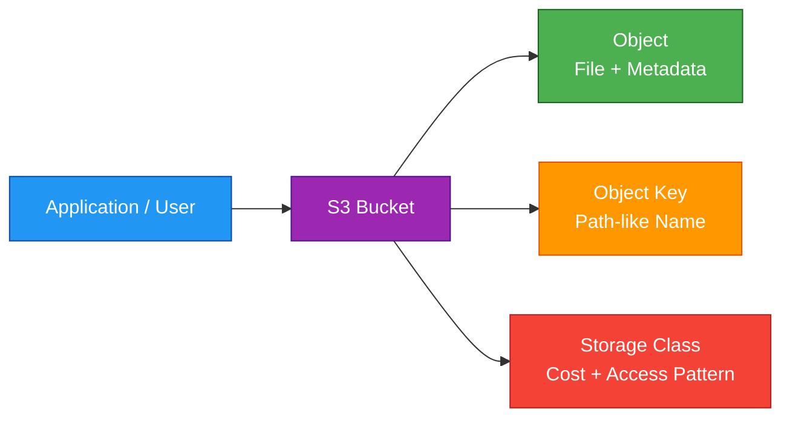
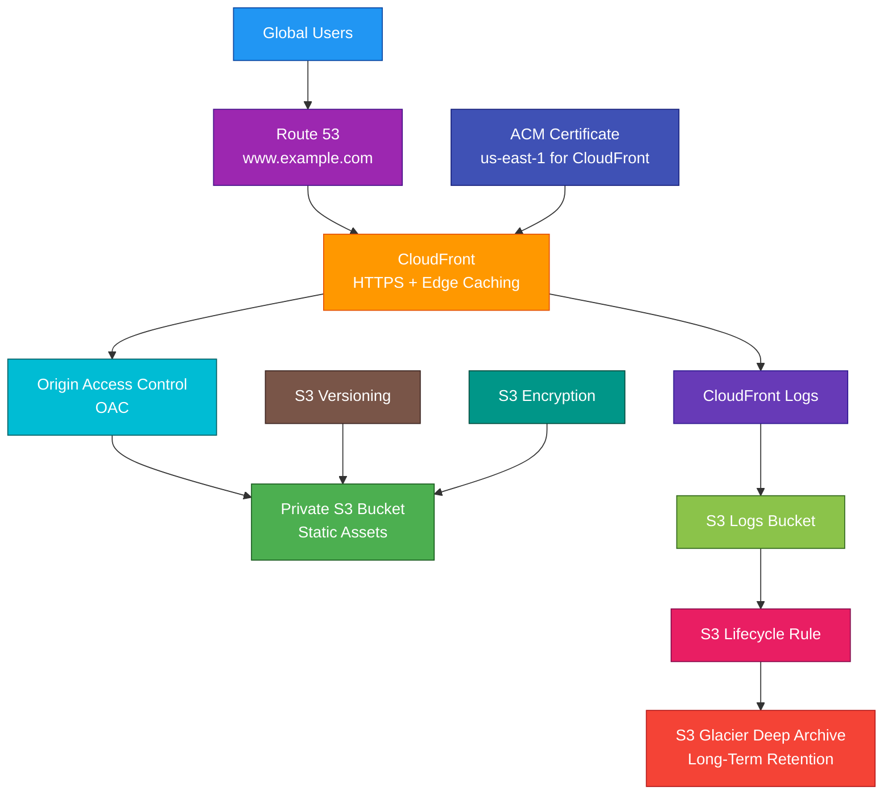

# S3

## 1. Definition

### Simple Definition

Amazon S3, or Simple Storage Service, is AWS’s object storage service.

It stores data as objects inside buckets and is designed for massive scale, high durability, and easy access over the internet or private AWS networks.

### Memory Hook

S3 = Simple Storage Service = Store objects safely at scale.

### Basic Idea

You create a bucket, upload objects, and access them using object keys.

### What S3 Is Best At

S3 is best for:

- Object storage
- Backups
- Static website assets
- Data lakes
- Logs
- Images and videos
- Big data storage
- Disaster recovery copies
- Application file storage

## 2. What Problem Does It Solve?

### Main Problem

S3 solves the problem of storing large amounts of data without managing storage servers.

You do not need to manage disks, file systems, storage clusters, replication, or capacity planning.

### Without S3

You may need to manage:

- Storage hardware
- Disk failures
- Capacity expansion
- Backup systems
- Replication
- File servers
- Storage scaling
- Data durability

### With S3

AWS manages the storage infrastructure.

You focus on:

- Buckets
- Objects
- Permissions
- Encryption
- Lifecycle rules
- Storage classes
- Access patterns

### Key Benefit

S3 provides highly durable, scalable, and cost-effective object storage.

## 3. Core Use Cases

### Backup and Restore

Use S3 to store backups from applications, databases, servers, and other AWS services.

Examples:

- Database exports
- EBS snapshots
- Application backups
- Configuration backups

### Static Website Hosting

S3 can host static websites made of HTML, CSS, JavaScript, images, and videos.

Common pattern:

S3 stores website files, and CloudFront delivers them globally.

### Data Lakes

S3 is commonly used as the foundation for data lakes.

Services like Athena, Glue, EMR, Redshift Spectrum, and Lake Formation can analyze data stored in S3.

### Logs and Audit Data

Store logs in S3 for long-term retention.

Examples:

- CloudTrail logs
- ALB access logs
- VPC Flow Logs
- CloudFront logs
- Application logs

### Media Storage

Use S3 for images, videos, audio, and documents.

Common examples:

- User uploads
- Product images
- Training videos
- Document storage

### Disaster Recovery

Use S3 replication, versioning, and lifecycle policies to support disaster recovery and data protection.

### Application Object Storage

Applications can store and retrieve objects directly from S3 using SDKs and APIs.

Examples:

- Profile pictures
- PDF reports
- Uploaded files
- Generated exports

## 4. Important Features for SAA

### Bucket

A bucket is a container for objects.

Important points:

- Bucket names must be globally unique
- Buckets are created in a specific AWS Region
- Buckets store objects
- Bucket policies control access

### Object

An object is the actual data stored in S3.

An object includes:

- Data
- Key
- Metadata
- Version ID, if versioning is enabled
- Tags, if configured

### Object Key

The object key is the unique name of an object inside a bucket.

Example:

`images/products/shoe-1.png`

S3 does not have real folders.

It uses prefixes that look like folders.

### Object Size

An individual S3 object can be very large.

For large uploads, use multipart upload.

### Multipart Upload

Multipart upload splits a large object into smaller parts and uploads them in parallel.

Use it for:

- Large files
- Better upload reliability
- Faster transfer performance
- Recovering from network interruptions

### Storage Classes

S3 storage classes help optimize cost based on access pattern.

| Storage Class | Best For |
|---|---|
| S3 Standard | Frequently accessed data |
| S3 Intelligent-Tiering | Unknown or changing access patterns |
| S3 Standard-IA | Infrequently accessed data across multiple AZs |
| S3 One Zone-IA | Infrequent data that can be recreated |
| S3 Glacier Instant Retrieval | Archive data needing milliseconds retrieval |
| S3 Glacier Flexible Retrieval | Archive data with minutes-to-hours retrieval |
| S3 Glacier Deep Archive | Lowest-cost long-term archive |
| S3 Express One Zone | High-performance single-AZ object storage |

### S3 Standard

S3 Standard is the default general-purpose storage class.

Use it for frequently accessed data.

### S3 Intelligent-Tiering

S3 Intelligent-Tiering automatically moves objects between access tiers based on usage.

Use it when access patterns are unknown or change over time.

### S3 Standard-IA

S3 Standard-Infrequent Access is for data accessed less often but still needing rapid access.

It stores data across multiple Availability Zones.

### S3 One Zone-IA

S3 One Zone-IA stores data in one Availability Zone.

It costs less than Standard-IA but has lower resilience.

Use it for data that can be recreated.

### S3 Glacier Classes

Glacier storage classes are for archival data.

| Glacier Class | Retrieval Pattern |
|---|---|
| Glacier Instant Retrieval | Milliseconds |
| Glacier Flexible Retrieval | Minutes to hours |
| Glacier Deep Archive | Long-term archive, hours retrieval |

### S3 Express One Zone

S3 Express One Zone is designed for very low-latency access in a single Availability Zone.

Use it for high-performance workloads that can tolerate single-AZ storage design.

### Versioning

Versioning keeps multiple versions of an object.

Use versioning to protect against:

- Accidental overwrite
- Accidental deletion
- Bad application updates

Important point:

Deleting an object in a versioned bucket creates a delete marker.

### Delete Marker

A delete marker makes the object appear deleted, but older versions can still exist.

You can recover by removing the delete marker or restoring a previous version.

### Lifecycle Rules

Lifecycle rules automatically move or expire objects.

Examples:

- Move logs to Glacier after 90 days
- Delete temporary files after 7 days
- Delete old noncurrent versions after 30 days

### Replication

S3 Replication automatically copies objects to another bucket.

Types:

| Type | Meaning |
|---|---|
| Same-Region Replication | Copy objects within the same Region |
| Cross-Region Replication | Copy objects to another Region |

### Cross-Region Replication

CRR is useful for:

- Disaster recovery
- Compliance
- Lower-latency access in another Region
- Account or Region separation

### Same-Region Replication

SRR is useful for:

- Log aggregation
- Same-Region compliance copies
- Copying data between accounts
- Separating production and analytics buckets

### Replication Requirements

Common requirements:

- Versioning enabled on source and destination buckets
- IAM role for replication
- Replication rule configured
- Existing objects are not automatically replicated unless using batch replication

### S3 Event Notifications

S3 can send events when object actions happen.

Examples:

- Object created
- Object deleted
- Restore completed

Common destinations:

- Lambda
- SQS
- SNS
- EventBridge

### Pre-Signed URLs

A pre-signed URL gives temporary access to a private S3 object.

Use it when someone needs short-term access without making the object public.

### Static Website Hosting

S3 can host static websites.

Important exam point:

S3 static website endpoints use HTTP only.

For HTTPS, use CloudFront with an ACM certificate.

### S3 Select

S3 Select retrieves only part of an object using SQL-like expressions.

Use it to reduce data transfer when reading only selected fields from large objects.

### Transfer Acceleration

S3 Transfer Acceleration speeds up long-distance uploads and downloads using AWS edge locations.

Use it when clients are far from the bucket Region.

### Object Lock

S3 Object Lock prevents objects from being deleted or overwritten for a retention period.

Use it for WORM requirements.

WORM means Write Once, Read Many.

### Object Lock Modes

| Mode | Meaning |
|---|---|
| Governance Mode | Some authorized users can override retention |
| Compliance Mode | Retention cannot be overridden during the retention period |

### MFA Delete

MFA Delete requires multi-factor authentication for certain delete operations on versioned buckets.

It helps protect against accidental or malicious deletion.

### Access Points

S3 Access Points provide separate access policies and endpoints for shared datasets.

Use them to simplify access management at scale.

### Multi-Region Access Points

S3 Multi-Region Access Points provide a global endpoint for accessing replicated datasets across Regions.

Use them for globally distributed applications.

### S3 Object Lambda

S3 Object Lambda lets you modify data as it is returned to an application.

Example:

Redact sensitive data from an object before returning it.

## 5. Security Model

### IAM Permissions

IAM controls who can access S3 and what actions they can perform.

Common permissions:

| Permission | Purpose |
|---|---|
| `s3:ListBucket` | List objects in a bucket |
| `s3:GetObject` | Read objects |
| `s3:PutObject` | Upload objects |
| `s3:DeleteObject` | Delete objects |
| `s3:GetBucketPolicy` | Read bucket policy |
| `s3:PutBucketPolicy` | Update bucket policy |

### Bucket Policy

A bucket policy is a resource-based policy attached to a bucket.

Use it to control access to the bucket and objects.

Common uses:

- Allow another AWS account
- Require HTTPS
- Deny unencrypted uploads
- Allow CloudFront access
- Restrict access by IP or VPC endpoint

### Identity-Based Policy

An identity-based policy is attached to an IAM user, group, or role.

Use it to define what that identity can do in S3.

### Bucket Policy vs IAM Policy

| Policy Type | Attached To | Best For |
|---|---|---|
| IAM Policy | User, group, or role | Grant identity permissions |
| Bucket Policy | S3 bucket | Control resource access |
| ACL | Bucket or object | Legacy access control |

### Block Public Access

S3 Block Public Access helps prevent accidental public exposure.

It can be applied at:

- Account level
- Bucket level

Exam tip:

Keep Block Public Access enabled unless public access is truly required.

### Object Ownership

Object Ownership controls object ownership and ACL behavior.

Best practice:

Use Bucket owner enforced to disable ACLs and make bucket policies/IAM policies the main access method.

### Encryption at Rest

S3 supports server-side encryption.

| Option | Meaning |
|---|---|
| SSE-S3 | S3-managed encryption keys |
| SSE-KMS | AWS KMS keys |
| DSSE-KMS | Dual-layer KMS encryption |
| SSE-C | Customer-provided encryption keys |

### SSE-S3

SSE-S3 uses S3-managed keys.

It is simple and commonly used.

### SSE-KMS

SSE-KMS uses AWS KMS keys.

Use it when you need:

- Key control
- Key rotation
- Audit logs through CloudTrail
- Customer managed keys

### SSE-C

SSE-C uses encryption keys provided by the customer.

AWS does not store the key.

This is less common for SAA scenarios.

### Encryption in Transit

Use HTTPS to encrypt data moving between clients and S3.

You can enforce HTTPS using a bucket policy condition.

### VPC Endpoint for S3

S3 supports Gateway VPC Endpoints.

Use them so private subnet resources can access S3 without using the public internet or NAT Gateway.

### Access Logs

S3 server access logging records requests made to a bucket.

For many auditing cases, CloudTrail data events are more useful for object-level API activity.

### CloudTrail Data Events

CloudTrail data events can record object-level activity such as:

- `GetObject`
- `PutObject`
- `DeleteObject`

Important exam point:

S3 object-level API activity requires CloudTrail data events.

### Shared Responsibility

AWS is responsible for:

- S3 infrastructure
- Storage durability
- Service availability
- Physical security
- Managed encryption features

You are responsible for:

- Bucket policies
- IAM permissions
- Public access settings
- Encryption settings
- Lifecycle rules
- Versioning settings
- Replication settings
- Object Lock configuration
- Monitoring and logging

## 6. High Availability / Durability Behavior

### Availability

S3 is a regional service.

Buckets are created in one AWS Region, but data is automatically stored across multiple Availability Zones for most storage classes.

### Durability

S3 is designed for extremely high durability.

For SAA, remember:

S3 is designed for 11 9s of durability.

That means `99.999999999%` durability.

### Availability vs Durability

| Concept | Meaning |
|---|---|
| Durability | Data is not lost |
| Availability | Data can be accessed when needed |

### Multi-AZ Behavior

Most S3 storage classes store data across multiple Availability Zones.

Examples:

- S3 Standard
- S3 Standard-IA
- S3 Intelligent-Tiering
- S3 Glacier classes

### Single-AZ Storage Classes

Some S3 storage classes store data in one Availability Zone.

Examples:

- S3 One Zone-IA
- S3 Express One Zone

Use these only when single-AZ storage is acceptable.

### Regional Behavior

An S3 bucket belongs to one Region.

Objects stay in that Region unless you configure replication or copy them elsewhere.

### Multi-Region Behavior

Use Cross-Region Replication to copy objects to another Region.

Use Multi-Region Access Points for global applications accessing replicated datasets.

### Strong Consistency

S3 provides strong read-after-write consistency for object PUTs, GETs, LISTs, and DELETEs.

This means after writing an object, reads and lists reflect the latest change.

### Replication Durability

Replication creates copies in another bucket.

This helps with:

- Disaster recovery
- Compliance
- Region isolation
- Account isolation

### Versioning for Recovery

Versioning improves recoverability from accidental deletes and overwrites.

For stronger protection, combine versioning with Object Lock.

### Important Exam Point

S3 is highly durable object storage, but it is not a file system and not block storage.

For file storage, think EFS or FSx.

For block storage, think EBS.

## 7. Cost Optimization Options

### Choose the Right Storage Class

Pick storage classes based on access pattern.

| Access Pattern | Good Choice |
|---|---|
| Frequent access | S3 Standard |
| Unknown or changing access | S3 Intelligent-Tiering |
| Infrequent access | S3 Standard-IA |
| Re-creatable infrequent data | S3 One Zone-IA |
| Archive with fast retrieval | Glacier Instant Retrieval |
| Archive with flexible retrieval | Glacier Flexible Retrieval |
| Lowest-cost long-term archive | Glacier Deep Archive |

### Use Lifecycle Policies

Lifecycle policies automatically move data to cheaper storage classes or delete old data.

Example:

- Keep logs in S3 Standard for 30 days
- Move to Glacier after 90 days
- Delete after 7 years

### Use Intelligent-Tiering for Unknown Access

If you do not know how often data will be accessed, S3 Intelligent-Tiering can reduce manual planning.

### Delete Incomplete Multipart Uploads

Incomplete multipart uploads can create storage cost.

Use lifecycle rules to clean them up.

### Expire Old Versions

Versioning can increase storage cost because old versions remain.

Use lifecycle rules to delete old noncurrent versions when they are no longer needed.

### Use S3 Select

S3 Select can reduce data transfer and processing cost by retrieving only needed data from an object.

### Compress Data

Compress files before storing them when appropriate.

This can reduce storage and transfer costs.

### Use VPC Endpoints

For private workloads accessing S3, Gateway VPC Endpoints can reduce NAT Gateway data processing cost.

### Avoid Unnecessary Replication

Replication creates additional storage and request costs.

Replicate only data that needs compliance, DR, or global access.

### Monitor with Storage Lens

S3 Storage Lens helps analyze storage usage, activity, and cost optimization opportunities.

## 8. Common Exam Traps

### S3 Is Object Storage

S3 is not block storage and not a traditional file system.

| Need | Choose |
|---|---|
| Object storage | S3 |
| Block storage for EC2 | EBS |
| Shared Linux file system | EFS |
| Windows file shares | FSx for Windows File Server |

### Bucket Names Are Globally Unique

S3 bucket names must be unique across all AWS accounts globally.

### S3 Is Regional, Not AZ-Specific

Buckets are created in a Region.

Most S3 classes store data across multiple AZs automatically.

### Folders Are Prefixes

S3 does not have real folders.

Folder-like paths are object key prefixes.

### S3 Static Website Endpoint Is HTTP Only

For HTTPS with a custom domain, use CloudFront with ACM.

### Block Public Access Can Override Public Policies

Even if a bucket policy allows public access, Block Public Access can prevent the bucket from becoming public.

### Versioning Does Not Delete Old Versions Automatically

Versioning keeps old object versions.

Use lifecycle rules to expire old versions.

### Delete Marker Confusion

In a versioned bucket, deleting an object creates a delete marker.

The old object versions can still exist.

### Replication Needs Versioning

S3 Replication requires versioning on source and destination buckets.

### Replication Does Not Automatically Copy Existing Objects

By default, replication applies to new objects after the rule is enabled.

Use S3 Batch Replication for existing objects.

### Glacier Is Not Immediate for All Classes

Some Glacier classes require minutes or hours to restore data.

If milliseconds retrieval is required, choose Glacier Instant Retrieval or another appropriate class.

### One Zone-IA Has Lower Resilience

One Zone-IA stores data in one Availability Zone.

Do not use it for critical data that cannot be recreated.

### Pre-Signed URLs Are Temporary

Pre-signed URLs provide temporary access to private objects.

They do not make the whole bucket public.

### Object Lock Requires Planning

Object Lock must be enabled carefully and is used for retention and WORM compliance.

## 9. Compare With Similar Services

### Service Comparison Table

| Service | Storage Type | Best For | Choose When |
|---|---|---|---|
| S3 | Object storage | Files, backups, media, data lakes | You need scalable object storage |
| EBS | Block storage | EC2 disks and databases | You need persistent block storage for EC2 |
| EFS | File storage | Shared Linux file system | Multiple instances need shared file access |
| FSx | Managed file systems | Windows, Lustre, ONTAP, OpenZFS | You need specialized file systems |
| Glacier Classes | Archive storage in S3 | Long-term archival | You need low-cost archive storage |
| Storage Gateway | Hybrid storage | On-premises access to AWS storage | You need hybrid storage integration |

### S3 vs EBS

| Feature | S3 | EBS |
|---|---|---|
| Storage type | Object | Block |
| Access | API/object key | Attached disk |
| Scope | Regional | Availability Zone |
| Best for | Files, backups, data lakes | EC2 volumes and databases |
| Shared access | Easy via API | Usually one EC2 instance |

### S3 vs EFS

| Feature | S3 | EFS |
|---|---|---|
| Storage type | Object | File |
| Protocol | S3 API | NFS |
| Best for | Objects and data lakes | Shared Linux file system |
| Mountable file system | No | Yes |
| Common use | Images, logs, backups | Shared app files |

### S3 vs FSx

| Feature | S3 | FSx |
|---|---|---|
| Storage type | Object | File system |
| Best for | Object storage | Managed file workloads |
| Examples | Backups, static files | Windows shares, Lustre HPC |
| Access style | API | File protocols |

### S3 vs Glacier

| Feature | S3 Standard | S3 Glacier Classes |
|---|---|---|
| Purpose | Frequent access | Archive |
| Retrieval | Immediate | Depends on class |
| Cost | Higher storage cost | Lower storage cost |
| Best for | Active data | Long-term retention |

### S3 vs Storage Gateway

| Feature | S3 | Storage Gateway |
|---|---|---|
| Main purpose | Cloud object storage | Hybrid access to cloud storage |
| Used from | Apps and AWS services | On-premises systems |
| Common pattern | Direct object API | File, volume, or tape gateway |
| Best for | Native AWS object storage | On-premises integration with AWS storage |

### When to Choose S3

Choose S3 when:

- You need object storage
- You need very high durability
- You need to store files, images, videos, logs, or backups
- You need a data lake
- You need lifecycle-based cost optimization
- You need cross-Region replication
- You need static website asset storage
- You do not need block storage or a mounted file system

## 10. Mini Architecture Example

### Scenario

A company runs a public static website with global users.

They want secure HTTPS access, fast global performance, private S3 storage, and low-cost long-term log retention.

### Architecture

Use S3 to store static website assets.

Use CloudFront to deliver content globally over HTTPS.

Use Origin Access Control so users cannot access the S3 bucket directly.

Use lifecycle rules to move old logs to Glacier.

### Why This Is Good

- S3 stores website assets durably
- CloudFront improves global performance
- HTTPS is handled with ACM and CloudFront
- OAC keeps the S3 bucket private
- Versioning helps recover from accidental overwrite or deletion
- Encryption protects objects at rest
- Lifecycle rules reduce long-term log storage cost
- Glacier Deep Archive stores old logs cheaply

### Exam Answer Pattern

If the question says:

“Store large amounts of objects, files, backups, logs, images, or static assets with high durability.”

Think:

Amazon S3.

If the question says:

“Multiple EC2 instances need a shared Linux file system.”

Think:

Amazon EFS.

If the question says:

“An EC2 instance needs persistent block storage.”

Think:

Amazon EBS.

### Final Memory Hook

S3 = Object storage.

EBS = Block storage.

EFS = Shared Linux file storage.

FSx = Specialized managed file systems.

Versioning = Recover old object versions.

Lifecycle = Move or delete objects automatically.

Replication = Copy objects to another bucket.

Object Lock = Prevent deletion or overwrite.

Pre-signed URL = Temporary private access.

CloudFront + S3 = Fast global static content.

