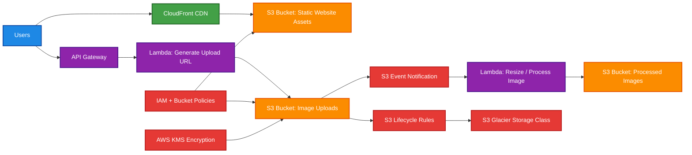

# S3

## 1. Definition

<details>
<summary>1. Definition</summary>

### Simple Definition

Amazon S3, or Simple Storage Service, is AWS object storage.

It stores data as objects inside buckets.

Think of it like a massive, highly durable online storage system for files such as:

- Images
- Videos
- Backups
- Logs
- Static website files
- Data lake files
- Application assets

### Key Terms

| Term | Meaning |
|---|---|
| Bucket | Top-level container for objects |
| Object | A file plus metadata |
| Key | The full object name/path inside the bucket |
| Metadata | Extra information about the object |
| Version ID | Unique ID for a versioned object |
| Prefix | Folder-like path, but not a real folder |

### Beginner Memory Hook

S3 = **Store Simple Stuff at Scale**

</details>

## 2. What Problem Does It Solve?

<details>
<summary>2. What Problem Does It Solve?</summary>

### Main Problem

S3 solves the problem of storing large amounts of data without managing servers, disks, or file systems.

Instead of buying storage hardware, you upload data to S3 and AWS handles:

- Scaling
- Durability
- Availability
- Replication within a Region
- Security features
- Lifecycle management

### Why It Matters for SAA

For the exam, S3 is usually the answer when the question says:

- Store unlimited files
- Store static content
- Build a data lake
- Store backups
- Store logs
- Need highly durable object storage
- Need lifecycle policies
- Need low-cost archival storage

### Important Limitation

S3 is object storage, not block storage or a traditional file system.

You do not modify small parts of a file like a disk. You usually upload or replace the full object.

</details>

## 3. Core Use Cases

<details>
<summary>3. Core Use Cases</summary>

### Common Real-World Uses

| Use Case | Why S3 Fits |
|---|---|
| Static website hosting | Stores HTML, CSS, JS, images |
| Backups | Durable and low-cost storage |
| Data lakes | Stores raw structured and unstructured data |
| Logs | Central place for CloudTrail, ALB, VPC Flow Logs, app logs |
| Media storage | Stores videos, images, documents |
| Disaster recovery | Store replicated or archived data |
| Big data analytics | Athena, Glue, EMR, Redshift Spectrum can query S3 data |
| Software distribution | Store downloadable files |
| Event-driven processing | Trigger Lambda when objects are uploaded |

### Static Website Hosting

S3 can host static websites.

Good for:

- HTML
- CSS
- JavaScript
- Images

Not good for:

- Server-side code
- Databases
- Dynamic backend processing

For HTTPS with a custom domain, usually use:

- S3
- CloudFront
- ACM certificate
- Route 53

### Data Lake

S3 is commonly used as the storage layer for data lakes.

Services that often work with S3:

- AWS Glue
- Amazon Athena
- Amazon EMR
- Amazon Redshift Spectrum
- Amazon QuickSight

</details>

## 4. Important Features for SAA

<details>
<summary>4. Important Features for SAA</summary>

### Buckets

A bucket is the container for objects.

Important points:

- Bucket names must be globally unique.
- Buckets are created in a specific AWS Region.
- Objects inside a bucket are stored using keys.
- S3 looks like folders, but it actually uses prefixes.

### Objects

An object includes:

- Data
- Key
- Metadata
- Version ID, if versioning is enabled
- Tags, if used
- Storage class

### Object Size Limits

| Limit | Value |
|---|---|
| Maximum object size | 5 TB |
| Maximum single PUT upload | 5 GB |
| Recommended for large uploads | Multipart upload |

### Multipart Upload

Multipart upload splits a large file into smaller parts.

Use it when:

- Uploading large files
- Uploads may fail and need retry
- You want better upload performance

Exam hint:

- For large objects, use **multipart upload**.
- For faster long-distance uploads, use **S3 Transfer Acceleration**.

### Versioning

Versioning keeps multiple versions of an object.

Useful for:

- Protecting against accidental deletion
- Recovering overwritten objects
- Supporting Object Lock
- Replication scenarios

Important exam points:

- Versioning is disabled by default.
- Once enabled, it can be suspended but not fully removed.
- Deleting an object adds a delete marker instead of permanently deleting versions.
- To permanently delete a version, delete the specific version ID.

### S3 Object Lock

S3 Object Lock prevents objects from being deleted or overwritten.

Used for:

- Compliance
- WORM storage
- Ransomware protection
- Legal retention

WORM = **Write Once, Read Many**

Object Lock modes:

| Mode | Meaning |
|---|---|
| Governance mode | Some privileged users can bypass retention |
| Compliance mode | No one, including root, can delete or overwrite during retention |

Also supports:

- Retention periods
- Legal holds

Exam trap:

- Object Lock requires versioning.

### S3 Lifecycle Rules

Lifecycle rules automatically move or delete objects.

Common actions:

- Move old objects to cheaper storage classes
- Expire old objects
- Delete incomplete multipart uploads
- Delete old object versions

Example lifecycle flow:

```text
S3 Standard → S3 Standard-IA → S3 Glacier Flexible Retrieval → S3 Glacier Deep Archive
```

### S3 Storage Classes

| Storage Class | Best For | Key Point |
|---|---|---|
| S3 Standard | Frequently accessed data | High availability and low latency |
| S3 Intelligent-Tiering | Unknown or changing access patterns | Automatically moves objects between access tiers |
| S3 Standard-IA | Infrequently accessed data | Lower storage cost, retrieval fee |
| S3 One Zone-IA | Infrequently accessed, recreatable data | Stored in one AZ only |
| S3 Glacier Instant Retrieval | Archive data needing millisecond access | For rarely accessed data |
| S3 Glacier Flexible Retrieval | Long-term archive | Retrieval takes minutes to hours |
| S3 Glacier Deep Archive | Lowest-cost archive | Retrieval usually takes hours |
| S3 Express One Zone | Very low-latency access | Single AZ, high-performance workloads |

### Storage Class Memory Hook

| Need | Choose |
|---|---|
| Frequent access | Standard |
| Unknown access | Intelligent-Tiering |
| Infrequent but important | Standard-IA |
| Infrequent and recreatable | One Zone-IA |
| Archive but instant | Glacier Instant Retrieval |
| Archive and can wait | Glacier Flexible Retrieval |
| Cheapest long-term archive | Glacier Deep Archive |

### S3 Replication

S3 can replicate objects automatically.

Types:

| Type | Meaning |
|---|---|
| CRR | Cross-Region Replication |
| SRR | Same-Region Replication |

Use replication for:

- Compliance
- Disaster recovery
- Lower-latency access in another Region
- Data sovereignty
- Copying data between accounts

Important requirements:

- Versioning must be enabled on source and destination buckets.
- Existing objects are not replicated automatically unless you use S3 Batch Replication.
- Deletes and delete markers have special replication behavior.

### S3 Event Notifications

S3 can send events when objects change.

Can trigger:

- Lambda
- SQS
- SNS
- EventBridge

Common example:

```text
User uploads image → S3 event → Lambda creates thumbnail
```

### S3 Select

S3 Select retrieves only part of an object using SQL-like filtering.

Useful when:

- Objects are large
- You only need selected rows or columns
- You want to reduce data transfer

### S3 Inventory

S3 Inventory creates reports about objects and metadata.

Useful for:

- Auditing
- Compliance
- Finding encryption status
- Tracking storage classes
- Large-scale object reporting

### S3 Batch Operations

S3 Batch Operations performs actions across many objects.

Examples:

- Copy many objects
- Restore archived objects
- Apply tags
- Invoke Lambda for many objects

### S3 Access Points

Access Points simplify access management for shared datasets.

Useful when:

- Many teams access the same bucket
- Each team needs different permissions
- You want separate policies per application or team

### S3 Transfer Acceleration

S3 Transfer Acceleration speeds up uploads over long distances using AWS edge locations.

Use it when:

- Users upload from far away
- Global clients upload large files
- Internet path is slow or inconsistent

</details>

## 5. Security Model

<details>
<summary>5. Security Model</summary>

### Default Security

By default:

- S3 buckets are private.
- Objects are private.
- Only the bucket owner has access.
- Public access is blocked unless explicitly allowed.

### IAM Permissions

S3 access can be controlled with IAM policies.

Common actions:

| Action | Meaning |
|---|---|
| s3:ListBucket | List objects in a bucket |
| s3:GetObject | Read objects |
| s3:PutObject | Upload objects |
| s3:DeleteObject | Delete objects |
| s3:GetBucketPolicy | Read bucket policy |
| s3:PutBucketPolicy | Update bucket policy |

Important distinction:

```text
Bucket-level permissions apply to the bucket ARN.
Object-level permissions apply to object ARNs.
```

Example:

```text
Bucket ARN: arn:aws:s3:::my-bucket
Object ARN: arn:aws:s3:::my-bucket/*
```

### Bucket Policies

Bucket policies are resource-based policies attached to buckets.

Use bucket policies to:

- Allow cross-account access
- Require encryption
- Deny insecure transport
- Restrict access by IP
- Allow CloudFront access
- Require specific VPC endpoint access

### IAM Policy vs Bucket Policy

| Feature | IAM Policy | Bucket Policy |
|---|---|---|
| Attached to | User, group, or role | S3 bucket |
| Best for | Identity permissions | Bucket-wide access rules |
| Cross-account access | Possible | Commonly used |
| Public access control | Not ideal | Commonly used with caution |

### ACLs

ACLs are older access control mechanisms.

For the SAA exam:

- Prefer IAM policies and bucket policies.
- ACLs are generally not recommended for modern access management.
- Object Ownership can disable ACLs.

### Block Public Access

S3 Block Public Access helps prevent accidental public exposure.

Can be configured at:

- Account level
- Bucket level

Exam hint:

If a bucket policy allows public access but Block Public Access is enabled, public access can still be blocked.

### Encryption Options

S3 supports encryption at rest and in transit.

### Encryption in Transit

Use HTTPS/TLS.

You can enforce it with a bucket policy condition:

```text
aws:SecureTransport = false → Deny
```

### Encryption at Rest

| Option | Key Management | Notes |
|---|---|---|
| SSE-S3 | AWS-managed S3 keys | Simple default encryption |
| SSE-KMS | AWS KMS keys | More control and audit logs |
| DSSE-KMS | Dual-layer KMS encryption | Extra compliance-focused protection |
| SSE-C | Customer-provided keys | Customer manages and provides keys |
| Client-side encryption | Customer encrypts before upload | AWS stores encrypted data only |

### SSE-S3

SSE-S3 means S3 manages the encryption keys.

Best for:

- Simple encryption
- Low management overhead
- General workloads

### SSE-KMS

SSE-KMS uses AWS KMS keys.

Best for:

- Key rotation control
- CloudTrail key usage auditing
- Fine-grained key permissions
- Compliance requirements

Exam trap:

For SSE-KMS, users need both:

- S3 permissions
- KMS key permissions

### Bucket Keys

S3 Bucket Keys reduce KMS request costs for SSE-KMS encrypted objects.

Use when:

- Many objects use SSE-KMS
- KMS request cost matters

### Network and Access Controls

You can secure S3 access using:

- IAM policies
- Bucket policies
- S3 Block Public Access
- VPC endpoints
- Access Points
- CloudFront Origin Access Control
- KMS key policies
- AWS Organizations SCPs

### VPC Endpoints for S3

S3 supports VPC endpoints so private resources can access S3 without using the public internet.

Common types:

| Endpoint Type | Common Use |
|---|---|
| Gateway endpoint | Common, cost-effective access from a VPC |
| Interface endpoint | PrivateLink-based access, useful for some advanced/private connectivity cases |

### CloudFront with S3

For secure public content delivery:

```text
Users → CloudFront → S3
```

Use CloudFront Origin Access Control so users cannot directly access the S3 bucket.

### Shared Responsibility

AWS is responsible for:

- S3 infrastructure
- Physical security
- Durability mechanisms
- Availability of the managed service

Customer is responsible for:

- Bucket policies
- IAM permissions
- Encryption choices
- Public access settings
- Object lifecycle rules
- Data classification
- Backup and replication strategy

</details>

## 6. High Availability / Durability Behavior

<details>
<summary>6. High Availability / Durability Behavior</summary>

### Availability

S3 is designed for high availability.

For most general-purpose storage classes, data is stored across multiple Availability Zones in an AWS Region.

This helps protect against:

- Disk failure
- Server failure
- AZ-level failure

### Durability

S3 is designed for extremely high durability.

Common AWS exam phrase:

```text
S3 is designed for 99.999999999% durability.
```

That is often called **eleven 9s of durability**.

### Durability vs Availability

| Concept | Meaning |
|---|---|
| Durability | Will my data be lost? |
| Availability | Can I access my data right now? |

Exam memory hook:

```text
Durability = data safety
Availability = data access
```

### Multi-AZ Behavior

Most S3 storage classes store data redundantly across multiple AZs.

Examples:

- S3 Standard
- S3 Standard-IA
- S3 Intelligent-Tiering
- S3 Glacier classes

### One Zone Storage Classes

Some storage classes store data in only one AZ.

Examples:

- S3 One Zone-IA
- S3 Express One Zone

Exam trap:

One Zone classes can be cheaper, but they are not resilient to AZ loss.

Use One Zone classes only for:

- Re-creatable data
- Secondary copies
- Data that does not require multi-AZ resilience

### Multi-Region Behavior

S3 buckets are Regional by default.

S3 does not automatically replicate every bucket to another Region unless you configure replication.

For Multi-Region resilience, use:

- Cross-Region Replication
- S3 Multi-Region Access Points
- Backup copies
- Application-level failover design

### Strong Consistency

S3 provides strong read-after-write consistency.

After a successful write, overwrite, or delete, subsequent reads reflect the latest change.

This applies to:

- PUT
- DELETE
- LIST operations

### Replication and Fault Tolerance

Replication can improve fault tolerance, but it is not enabled by default.

Use CRR when:

- You need disaster recovery in another Region
- You need compliance copies
- Users in another Region need lower latency

</details>

## 7. Cost Optimization Options

<details>
<summary>7. Cost Optimization Options</summary>

### Main Cost Factors

S3 costs usually come from:

- Storage amount
- Storage class
- Requests
- Data retrieval
- Data transfer
- Replication
- Lifecycle transitions
- KMS requests, if using SSE-KMS

### Choose the Right Storage Class

| Access Pattern | Cost-Effective Choice |
|---|---|
| Frequent access | S3 Standard |
| Unknown/changing access | S3 Intelligent-Tiering |
| Infrequent access | S3 Standard-IA |
| Re-creatable infrequent data | S3 One Zone-IA |
| Rare archive with instant access | S3 Glacier Instant Retrieval |
| Long-term archive | S3 Glacier Flexible Retrieval |
| Lowest-cost archive | S3 Glacier Deep Archive |

### Use Lifecycle Policies

Lifecycle policies reduce cost automatically.

Examples:

- Move logs to Standard-IA after 30 days.
- Move backups to Glacier after 90 days.
- Delete temporary files after 7 days.
- Delete incomplete multipart uploads.
- Delete old object versions.

### Use Intelligent-Tiering

S3 Intelligent-Tiering is good when access patterns are unknown or unpredictable.

It automatically moves objects between access tiers.

Exam hint:

Choose Intelligent-Tiering when the question says:

- Unknown access pattern
- Changing access pattern
- Want automatic cost optimization

### Delete Incomplete Multipart Uploads

Failed multipart uploads can leave unfinished parts in S3.

Use lifecycle rules to delete incomplete multipart uploads and avoid unnecessary cost.

### Use S3 Bucket Keys with SSE-KMS

If using SSE-KMS heavily, S3 Bucket Keys can reduce KMS request costs.

### Avoid Unnecessary Retrieval Fees

Infrequent and archive storage classes may charge retrieval fees.

Do not choose IA or Glacier classes for frequently accessed data.

### Use Compression and Efficient Formats

For data lakes, store data in efficient formats such as:

- Parquet
- ORC
- Compressed JSON/CSV

This can reduce:

- Storage cost
- Athena query cost
- Data scanning cost

### Use S3 Storage Lens

S3 Storage Lens helps analyze usage and find cost-saving opportunities.

Use it to identify:

- Old objects
- Unencrypted objects
- Unused buckets
- Cost optimization opportunities
- Lifecycle rule candidates

</details>

## 8. Common Exam Traps

<details>
<summary>8. Common Exam Traps</summary>

### Trap 1: S3 Is Not EBS

S3 is object storage.

EBS is block storage.

| Need | Choose |
|---|---|
| Store files/objects | S3 |
| Attach disk to EC2 | EBS |
| Shared Linux file system | EFS |
| Windows file share | FSx for Windows File Server |

### Trap 2: S3 Is Regional, Not AZ-Specific

A general-purpose S3 bucket is created in a Region.

Most storage classes replicate across multiple AZs automatically.

### Trap 3: One Zone-IA Is Not Multi-AZ

S3 One Zone-IA stores data in one AZ.

It is cheaper but less resilient.

Use it for re-creatable or secondary data.

### Trap 4: Glacier Is Not the Same as S3 Glacier Storage Classes

For the SAA exam, Glacier-style storage is usually managed through S3 storage classes.

Common classes:

- S3 Glacier Instant Retrieval
- S3 Glacier Flexible Retrieval
- S3 Glacier Deep Archive

### Trap 5: Versioning Does Not Prevent Deletion by Itself

Versioning helps recover deleted or overwritten objects.

But users can still delete specific versions if they have permission.

For stronger protection, use:

- Object Lock
- MFA Delete
- Least privilege IAM
- Bucket policies

### Trap 6: Object Lock Requires Versioning

Object Lock works with versioned objects.

Remember:

```text
Object Lock = WORM + Versioning
```

### Trap 7: Public Bucket Policy May Still Be Blocked

S3 Block Public Access can override public access attempts.

If public access is not working, check:

- Bucket policy
- Object permissions
- Block Public Access
- ACL settings
- CloudFront configuration

### Trap 8: SSE-KMS Requires KMS Permissions

For SSE-KMS, having S3 permissions is not always enough.

The user or service also needs permission to use the KMS key.

### Trap 9: Cross-Region Replication Requires Versioning

CRR and SRR require versioning on both source and destination buckets.

### Trap 10: Existing Objects Are Not Automatically Replicated

Replication usually applies to new objects after replication is configured.

For existing objects, use S3 Batch Replication.

### Trap 11: Lifecycle Rules Are Not Instant

Lifecycle expiration and transitions may not happen immediately at the exact second the rule qualifies.

S3 processes them asynchronously.

### Trap 12: S3 Event Notifications Are At Least Once

S3 event notifications can be delivered more than once.

Design consumers such as Lambda to be idempotent.

### Trap 13: Static Website Endpoint Is Different from REST Endpoint

S3 static website hosting uses a website endpoint.

For secure HTTPS, usually put CloudFront in front of S3.

### Trap 14: S3 Does Not Run Server-Side Code

S3 can host static websites only.

For dynamic applications, use services such as:

- Lambda
- API Gateway
- EC2
- ECS
- Elastic Beanstalk

### Trap 15: Durability and Availability Are Different

Eleven 9s durability means data is very unlikely to be lost.

It does not mean the service is available 99.999999999% of the time.

</details>

## 9. Compare With Similar Services

<details>
<summary>9. Compare With Similar Services</summary>

### S3 vs Other AWS Storage Services

| Service | Storage Type | Best For | Choose When |
|---|---|---|---|
| S3 | Object storage | Files, backups, logs, data lakes | You need scalable object storage |
| EBS | Block storage | EC2 disks | You need a disk attached to one EC2 instance |
| EFS | File storage | Shared Linux file system | Multiple Linux instances need shared files |
| FSx for Windows | File storage | Windows file shares | Windows apps need SMB file shares |
| FSx for Lustre | High-performance file system | HPC, ML, analytics | You need very fast file access, often with S3 integration |
| AWS Backup | Backup management | Centralized backup policies | You need managed backup across AWS services |
| Storage Gateway | Hybrid storage | On-premises to AWS storage | You need hybrid cloud storage integration |

### S3 vs EBS

| Feature | S3 | EBS |
|---|---|---|
| Type | Object storage | Block storage |
| Attached to EC2 | No | Yes |
| Scale | Virtually unlimited | Volume size limits |
| Access | HTTP/API | Operating system disk |
| Best for | Files, logs, backups | Databases, boot volumes, apps needing disk |

### S3 vs EFS

| Feature | S3 | EFS |
|---|---|---|
| Type | Object storage | File storage |
| Access pattern | Object API | File system protocol |
| Shared access | Yes, through API | Yes, mounted by many instances |
| Best for | Data lakes, static assets | Shared Linux application files |

### S3 vs Glacier Storage Classes

| Feature | S3 Standard | S3 Glacier Classes |
|---|---|---|
| Access speed | Milliseconds | Instant to hours depending on class |
| Cost | Higher storage cost | Lower storage cost |
| Best for | Active data | Archive data |
| Retrieval fee | Usually no | Often yes |

### S3 vs CloudFront

| Service | Main Job |
|---|---|
| S3 | Store objects |
| CloudFront | Cache and deliver content globally |

Use together when:

```text
S3 stores content → CloudFront delivers content faster to users
```

### Simple Choice Rule

| Question Says | Likely Answer |
|---|---|
| Store unlimited objects | S3 |
| Attach disk to EC2 | EBS |
| Shared Linux file system | EFS |
| Windows file share | FSx for Windows |
| Archive data cheaply | S3 Glacier storage class |
| Global content delivery | CloudFront with S3 |
| Hybrid on-prem storage | Storage Gateway |

</details>

## 10. Mini Architecture Example

<details>
<summary>10. Mini Architecture Example</summary>

### Scenario

A company wants to host a static website where users can upload images.

Requirements:

- Website should load quickly worldwide.
- Images must be stored durably.
- Uploaded images should be processed automatically.
- Old images should move to cheaper storage.
- The S3 bucket should not be directly public.

### Architecture



### How It Works

1. Users access the website through CloudFront.
2. Static files are stored in S3.
3. Users upload images using a secure pre-signed URL.
4. S3 stores the uploaded images.
5. S3 Event Notifications trigger Lambda.
6. Lambda processes the image and stores the result in another S3 bucket.
7. Lifecycle rules move old images to cheaper storage.
8. IAM, bucket policies, and KMS protect access and encryption.

### Exam-Focused Design Choices

| Requirement | AWS Choice |
|---|---|
| Static website files | S3 |
| Global low-latency delivery | CloudFront |
| Secure uploads | Pre-signed URLs |
| Automatic processing | S3 Event Notification + Lambda |
| Long-term cost savings | Lifecycle rules |
| Private bucket access | CloudFront Origin Access Control |
| Encryption control | SSE-KMS |

### Memory Hook

```text
S3 stores.
CloudFront speeds.
Lambda reacts.
Lifecycle saves.
KMS secures.
```

</details>