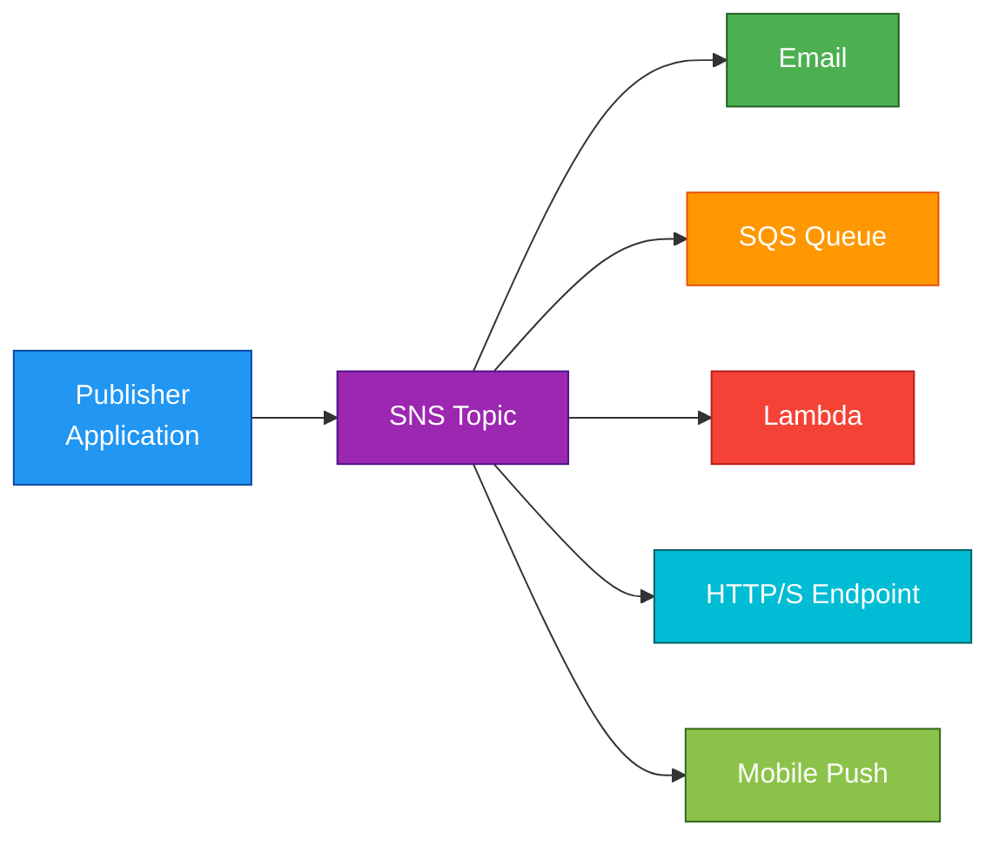
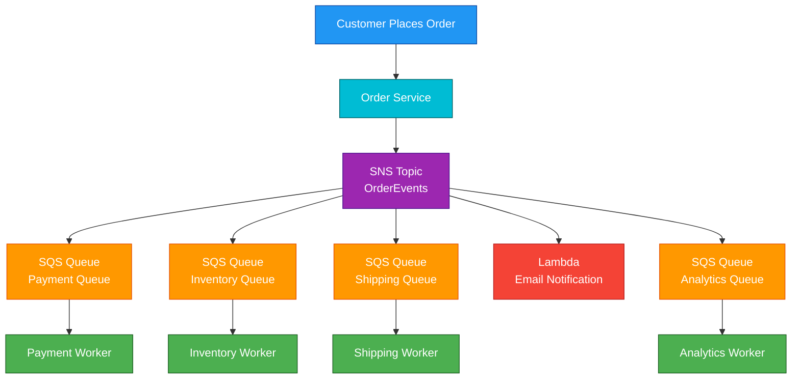

# SNS

## 1. Definition

### Simple Definition

Amazon SNS, or Simple Notification Service, is a fully managed pub/sub messaging service.

It lets one application publish a message to a topic, and SNS delivers that message to many subscribers.

### Memory Hook

SNS = Send Notifications Swiftly

### Basic Idea

Instead of one system calling many systems directly, the system sends one message to SNS.

SNS then fan-outs the message to all subscribers.

## 2. What Problem Does It Solve?

### Main Problem

SNS solves the problem of sending the same event or notification to multiple systems without tightly coupling them together.

### Without SNS

One application may need to directly call:

- Email service
- Order service
- Inventory service
- Analytics service
- Mobile notification service

This creates tight coupling and more failure points.

### With SNS

The application publishes one message to an SNS topic.

SNS handles delivery to all subscribers.

### Key Benefit

SNS helps build event-driven, loosely coupled architectures.

## 3. Core Use Cases

### Application Notifications

Send alerts or notifications to users or systems.

Examples:

- Email alerts
- SMS messages
- Mobile push notifications
- HTTP/S webhooks

### Fan-Out Pattern

Send one message to multiple destinations.

Common example:

- SNS topic receives an order event
- SNS sends the event to multiple SQS queues
- Each queue is processed by a different service

### Decoupling Microservices

SNS allows services to communicate through events instead of direct service-to-service calls.

### CloudWatch Alarms

CloudWatch can send alarm notifications to SNS.

Example:

- EC2 CPU is too high
- CloudWatch Alarm triggers
- SNS sends an email or invokes automation

### Event-Driven Processing

SNS can trigger Lambda functions when a message is published.

### Cross-Account Notifications

SNS topics can allow publishers or subscribers from other AWS accounts using resource policies.

## 4. Important Features for SAA

### Topics

A topic is a communication channel.

Publishers send messages to a topic, and subscribers receive messages from the topic.

### Publishers

A publisher is anything that sends a message to SNS.

Examples:

- Application
- Lambda function
- CloudWatch alarm
- EventBridge rule
- AWS service

### Subscribers

A subscriber is the destination that receives messages from SNS.

Common subscriber types:

| Subscriber Type | Example Use |
|---|---|
| Email | Human notification |
| SMS | Text alerts |
| SQS | Reliable async processing |
| Lambda | Serverless event processing |
| HTTP/S | Webhook integration |
| Mobile Push | Push notifications to mobile apps |

### Standard Topics

Standard SNS topics support high throughput and best-effort ordering.

They are the default choice for most notification and fan-out use cases.

Important points:

- Very high throughput
- At-least-once delivery
- Best-effort ordering
- Messages may occasionally be duplicated

### FIFO Topics

FIFO SNS topics provide strict ordering and exactly-once message publishing when used correctly.

Important points:

- FIFO = First-In-First-Out
- Preserves message order
- Supports message deduplication
- Must have `.fifo` suffix in the topic name
- Often used with SQS FIFO queues

### Message Filtering

SNS subscription filter policies allow subscribers to receive only messages they care about.

Example:

An order topic publishes all order events.

| Subscriber | Filter |
|---|---|
| Fraud service | High-value orders |
| Shipping service | Paid orders |
| Analytics service | All orders |

### Fan-Out to SQS

A very common exam pattern is SNS plus SQS.

SNS sends the same message to multiple SQS queues.

Each consumer processes messages independently.

### Message Delivery Retries

SNS retries delivery for supported endpoints when delivery fails.

For example:

- Lambda
- SQS
- HTTP/S endpoints

### Dead-Letter Queues

SNS subscriptions can use an SQS dead-letter queue to store messages that could not be delivered.

This is important for troubleshooting failed message delivery.

### Message Size

SNS messages can be up to 256 KB.

For larger payloads, store the object in S3 and send the S3 object reference through SNS.

### Raw Message Delivery

For SQS and HTTP/S subscriptions, SNS can deliver the raw message without SNS metadata.

This is useful when the subscriber only wants the original message body.

## 5. Security Model

### IAM Permissions

IAM controls who can manage and use SNS.

Common permissions:

| Permission | Purpose |
|---|---|
| `sns:CreateTopic` | Create SNS topics |
| `sns:Publish` | Publish messages |
| `sns:Subscribe` | Subscribe endpoints |
| `sns:Unsubscribe` | Remove subscriptions |
| `sns:SetTopicAttributes` | Change topic settings |

### Topic Access Policies

SNS topics support resource-based policies.

These policies can control:

- Who can publish to a topic
- Who can subscribe to a topic
- Cross-account access
- AWS service access

### Encryption at Rest

SNS supports server-side encryption using AWS KMS.

This protects messages stored by SNS.

Important points:

- Uses KMS keys
- Can use AWS managed keys or customer managed keys
- Publishers and subscribers may need KMS permissions

### Encryption in Transit

SNS uses HTTPS endpoints for encrypted communication in transit.

For HTTP/S subscriptions, prefer HTTPS over HTTP.

### Network and Security Controls

SNS is a public regional AWS service endpoint.

Important exam point:

SNS does not run inside your VPC.

However, you can use VPC endpoints with AWS PrivateLink for private access from a VPC to SNS.

### Shared Responsibility

AWS is responsible for:

- SNS infrastructure
- Availability of the managed service
- Physical security
- Service patching

You are responsible for:

- IAM permissions
- Topic policies
- Encryption settings
- KMS key permissions
- Subscription endpoint security
- Validating who can publish and subscribe

## 6. High Availability / Durability Behavior

### Availability

SNS is a fully managed regional service.

AWS manages the infrastructure across multiple Availability Zones within a Region.

### Fault Tolerance

SNS is designed to continue operating even if underlying infrastructure fails.

You do not manage servers, clusters, or scaling.

### Multi-AZ Behavior

SNS automatically uses multiple Availability Zones within a Region.

You do not configure Multi-AZ manually.

### Multi-Region Behavior

SNS topics are regional.

If you need Multi-Region notification architecture, create SNS topics in multiple Regions and design replication or publishing logic across Regions.

### Delivery Guarantees

SNS Standard topics provide at-least-once delivery.

This means:

- A message should be delivered one or more times
- Duplicate messages are possible
- Consumers should be idempotent

### Ordering

| Topic Type | Ordering Behavior |
|---|---|
| Standard SNS | Best-effort ordering |
| FIFO SNS | Strict ordering within message group |

### Durability

SNS stores messages temporarily while delivering them.

If long-term message storage or replay is needed, use SQS, EventBridge archive, S3, or another durable storage service depending on the use case.

## 7. Cost Optimization Options

### Use Message Filtering

Use subscription filter policies so subscribers only receive relevant messages.

This can reduce:

- Unnecessary Lambda invocations
- Unnecessary HTTP/S calls
- Unnecessary downstream processing

### Use SQS for Buffering

Instead of invoking expensive processing directly, SNS can send messages to SQS.

Consumers can process messages at a controlled rate.

### Avoid Unnecessary Subscribers

Every subscriber can create extra delivery and processing cost.

Only subscribe systems that actually need the message.

### Use Standard Topics When Ordering Is Not Required

FIFO topics are useful when ordering matters, but Standard topics are usually better for high-throughput general notifications.

### Keep Messages Small

SNS charges can be affected by payload size.

Keep messages small and store large payloads in S3.

Send only the S3 object reference through SNS.

### Avoid SMS Unless Required

SMS notifications can be more expensive than email, SQS, or Lambda-based processing.

Use SMS only when text message delivery is truly needed.

## 8. Common Exam Traps

### SNS vs SQS

SNS pushes messages to subscribers.

SQS stores messages until consumers poll and process them.

Memory hook:

- SNS = Push
- SQS = Pull

### SNS Does Not Store Messages Long-Term

SNS is not a message queue.

If the exam asks for buffering, delayed processing, or retaining messages until a consumer is ready, choose SQS.

### Standard SNS Can Duplicate Messages

Standard SNS uses at-least-once delivery.

Your application should handle duplicate messages.

### Standard SNS Does Not Guarantee Ordering

If strict ordering is required, use FIFO SNS with FIFO SQS.

### Fan-Out Usually Means SNS

If one event must go to multiple consumers, SNS is often the best answer.

### Decoupled Processing Often Means SNS + SQS

For reliable fan-out, use SNS with multiple SQS queues.

This lets each consumer process messages independently.

### Lambda Direct Invocation vs SNS

SNS can trigger Lambda, but if only one Lambda needs the event, direct invocation or EventBridge may be simpler.

Use SNS when multiple subscribers need the same notification.

### EventBridge vs SNS

EventBridge is better for advanced event routing, SaaS integrations, event buses, schemas, and rules.

SNS is better for simple high-throughput pub/sub and fan-out notifications.

### Large Message Trap

SNS messages are limited to 256 KB.

For larger messages, store data in S3 and publish a pointer to the object.

### VPC Trap

SNS is not deployed inside your VPC.

Use VPC endpoints if private connectivity from a VPC is needed.

## 9. Compare With Similar Services

### Service Comparison Table

| Service | Pattern | Best For | Choose When |
|---|---|---|---|
| SNS | Pub/sub push | Fan-out notifications | One message must go to many subscribers |
| SQS | Queue pull | Decoupling and buffering | One or more consumers need to process messages asynchronously |
| EventBridge | Event bus | Advanced event routing | You need rules, event patterns, SaaS integration, or event buses |
| Kinesis Data Streams | Streaming | Real-time data streams | You need ordered streaming data and multiple consumers reading from shards |
| SES | Email service | Sending emails | You need marketing, transactional, or application emails |
| Lambda | Compute | Run code on events | You need serverless processing after receiving an event |

### SNS vs SQS

| Feature | SNS | SQS |
|---|---|---|
| Delivery model | Push | Pull |
| Message storage | Temporary | Stored until consumed or expired |
| Main use | Notify many subscribers | Queue work for processing |
| Consumer behavior | SNS delivers to subscribers | Consumers poll queue |
| Common pairing | SNS fans out to SQS | SQS buffers work |

### SNS vs EventBridge

| Feature | SNS | EventBridge |
|---|---|---|
| Main purpose | Pub/sub notifications | Event routing |
| Routing | Basic filtering | Advanced rules and event patterns |
| Subscribers | Email, SMS, SQS, Lambda, HTTP/S | AWS services, SaaS apps, custom apps |
| Best use | Fan-out | Event-driven integration |
| Exam clue | “Send notification to multiple subscribers” | “Route events based on rules” |

### When to Choose SNS

Choose SNS when:

- One message must notify multiple subscribers
- You need pub/sub messaging
- You need fan-out to SQS queues
- You need simple notifications
- You need CloudWatch alarm notifications

## 10. Mini Architecture Example

### Scenario

An e-commerce application needs to process new orders.

When a customer places an order, multiple systems need to react:

- Payment service
- Inventory service
- Shipping service
- Analytics service
- Email notification service

### Architecture

The order service publishes one event to an SNS topic.

SNS fans out the event to multiple SQS queues and Lambda functions.

Each system processes the event independently.

### Why This Is Good

- The order service publishes only one message
- Each downstream service is independent
- SQS queues protect consumers from traffic spikes
- Failed consumers do not block other consumers
- New subscribers can be added later without changing the order service

### Exam Answer Pattern

If the question says:

“An application needs to send one event to multiple independent systems for processing.”

Think:

SNS topic fan-out to multiple SQS queues.

### Final Memory Hook

SNS is for broadcast.

SQS is for buffering.

EventBridge is for smart routing.

