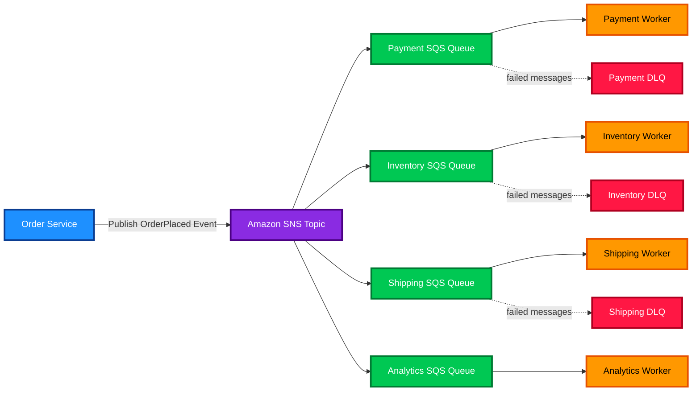

# SNS

<details>
<summary><strong>1. Definition</strong></summary>

**Amazon SNS (Simple Notification Service)** is a **managed pub/sub messaging service**.

Producers publish messages to an **SNS topic**, and SNS pushes those messages to one or more subscribers.

**Simple idea:**

> **SNS = “send one message to many places.”**

Common subscribers include:

| Subscriber Type | Example |
|---|---|
| Amazon SQS | Send events to queues |
| AWS Lambda | Trigger serverless code |
| HTTP/S endpoint | Notify an external API |
| Email | Send human notifications |
| SMS | Send text messages |
| Mobile push | Notify mobile apps |
| Amazon Data Firehose | Stream messages to destinations like S3 |

**Memory hook:**

> **SNS = Notify many subscribers.**  
> **SQS = Store messages for one or more consumers.**

</details>

---

<details>
<summary><strong>2. What Problem Does It Solve?</strong></summary>

SNS solves the problem of **fan-out messaging**.

Without SNS, one application would need to call every downstream system directly.

That creates problems:

- Tight coupling
- More code
- More failures
- Harder scaling
- Difficult integrations

With SNS:

1. An application publishes one message to a topic.
2. SNS delivers that message to all subscribers.
3. Each subscriber handles the message independently.

**Example:**

An order is placed.

SNS can notify:

- Payment service
- Inventory service
- Shipping service
- Analytics pipeline
- Customer email service

The order service does **not** need to know how each system works.

</details>

---

<details>
<summary><strong>3. Core Use Cases</strong></summary>

| Use Case | Why SNS Fits |
|---|---|
| Fan-out events | Send one event to many consumers |
| Application notifications | Notify apps, users, or systems |
| Event-driven architecture | Decouple services using topics |
| Microservices communication | Multiple services react to the same event |
| Alerts | Send notifications from CloudWatch alarms |
| Serverless workflows | Trigger Lambda functions from events |
| SQS fan-out | Send the same message to multiple queues |
| Mobile push notifications | Send push notifications to mobile devices |
| Email/SMS notifications | Notify humans directly |
| Data streaming | Send messages to Firehose for delivery to S3 or analytics systems |

**Exam focus:**

> If the question says **“one message must go to multiple subscribers”**, think **SNS**.

</details>

---

<details>
<summary><strong>4. Important Features for SAA</strong></summary>

<details>
<summary><strong>SNS Topics</strong></summary>

A **topic** is the communication channel.

Publishers send messages to the topic.

Subscribers receive messages from the topic.

```text
Publisher → SNS Topic → Subscribers
```

</details>

<details>
<summary><strong>Publish/Subscribe Model</strong></summary>

SNS uses a **pub/sub** model.

- **Publisher** sends message.
- **Topic** receives message.
- **Subscribers** get message.

The publisher does not need to know who the subscribers are.

This creates **loose coupling**.

</details>

<details>
<summary><strong>Standard Topics</strong></summary>

**Standard SNS topics** are the default topic type.

They provide:

- Very high throughput
- At-least-once delivery
- Best-effort ordering
- Support for many subscriber types

Use Standard topics when:

- Ordering is not critical
- Duplicate messages are acceptable
- You need broad protocol support

**Exam trap:**

> Standard SNS can deliver duplicate messages.  
> Design subscribers to be **idempotent**.

</details>

<details>
<summary><strong>FIFO Topics</strong></summary>

**FIFO SNS topics** support stricter message handling.

They provide:

- First-in, first-out ordering
- Message groups
- Deduplication
- Exactly-once processing when used correctly with SQS FIFO

Use FIFO topics when:

- Message order matters
- Duplicate processing must be avoided
- You are integrating with SQS queues

Important FIFO notes:

| Feature | SNS FIFO |
|---|---|
| Topic name | Must end in `.fifo` |
| Ordering | Within a message group |
| Deduplication window | 5 minutes |
| Common subscriber | SQS FIFO queue |
| Best use case | Ordered event fan-out |

**Memory hook:**

> **FIFO = First In, First Out = order matters.**

</details>

<details>
<summary><strong>Message Filtering</strong></summary>

SNS supports **subscription filter policies**.

This lets subscribers receive only the messages they care about.

Example:

An `OrderEvents` topic receives all order events.

| Subscriber | Filter |
|---|---|
| Payment queue | `eventType = PaymentRequired` |
| Shipping queue | `eventType = ReadyToShip` |
| Analytics queue | All events |

This reduces unnecessary message delivery.

**Exam tip:**

> Use **SNS message filtering** when multiple subscribers need different subsets of the same topic messages.

</details>

<details>
<summary><strong>Fan-Out to SQS</strong></summary>

A very common SAA architecture is:

```text
SNS Topic → multiple SQS queues
```

Why this is useful:

- SNS broadcasts the message.
- Each SQS queue stores a copy.
- Each consumer processes independently.
- One slow consumer does not block others.

**Best practice:**

> Use **SNS + SQS** when you need reliable fan-out with buffering.

</details>

<details>
<summary><strong>Dead-Letter Queues</strong></summary>

SNS subscriptions can use an **SQS dead-letter queue (DLQ)**.

A DLQ stores messages that SNS could not deliver successfully.

Useful for:

- Failed HTTP/S deliveries
- Failed Lambda deliveries
- Troubleshooting bad messages
- Reprocessing failed events later

**Exam tip:**

> If the question asks how to capture failed SNS deliveries, use an **SNS subscription DLQ**.

</details>

<details>
<summary><strong>Delivery Retry</strong></summary>

SNS retries failed deliveries based on the subscriber protocol.

For example:

| Subscriber | Retry Behavior |
|---|---|
| SQS | Durable delivery to queue |
| Lambda | Retries handled by service integration |
| HTTP/S | SNS uses retry policies |
| Email/SMS | Less control than application endpoints |

**Exam focus:**

> SNS is a **push** service.  
> It attempts to deliver messages to subscribers.

</details>

<details>
<summary><strong>Raw Message Delivery</strong></summary>

By default, SNS wraps messages with SNS metadata.

For SQS and HTTP/S subscriptions, you can enable **raw message delivery**.

This sends the original message body without the SNS JSON envelope.

Use it when:

- The subscriber wants a clean message body
- You do not need SNS metadata
- You want simpler downstream processing

</details>

<details>
<summary><strong>CloudWatch Integration</strong></summary>

SNS is commonly used with **Amazon CloudWatch alarms**.

Example:

```text
CloudWatch Alarm → SNS Topic → Email/SMS/Lambda/SQS
```

Use this for:

- Operational alerts
- Incident notifications
- Automated remediation

</details>

</details>

---

<details>
<summary><strong>5. Security Model</strong></summary>

<details>
<summary><strong>IAM Permissions</strong></summary>

Access to SNS is controlled with **IAM policies**.

Common SNS actions:

| Action | Purpose |
|---|---|
| `sns:CreateTopic` | Create a topic |
| `sns:Publish` | Publish messages |
| `sns:Subscribe` | Subscribe endpoints |
| `sns:Unsubscribe` | Remove subscriptions |
| `sns:SetTopicAttributes` | Change topic settings |
| `sns:GetTopicAttributes` | Read topic settings |

Example permissions:

- Producers need `sns:Publish`.
- Admins need topic management permissions.
- Subscribers may need subscribe permissions.
- SQS queue policies must allow SNS to send messages to the queue.

**Important SQS fan-out permission:**

For SNS to send messages to SQS, the SQS queue policy must allow:

```text
sns.amazonaws.com → sqs:SendMessage
```

Usually restricted by the SNS topic ARN.

</details>

<details>
<summary><strong>Topic Policies</strong></summary>

SNS topics can have **resource-based policies**.

Topic policies are useful for:

- Cross-account publishing
- Cross-account subscriptions
- Restricting which principals can publish
- Restricting access by source ARN or account

Example:

A topic in Account A allows a service or role in Account B to publish messages.

**Exam tip:**

> For cross-account access, think **resource-based policy** on the SNS topic.

</details>

<details>
<summary><strong>Encryption Options</strong></summary>

SNS supports encryption in transit and encryption at rest.

| Encryption Type | How |
|---|---|
| In transit | HTTPS/TLS |
| At rest | AWS KMS server-side encryption |
| Key options | AWS managed key or customer managed KMS key |

With KMS encryption:

- SNS encrypts message contents at rest.
- KMS controls key access.
- IAM and key policies must allow needed principals.
- CloudTrail can record KMS usage.

**Important:**

> Encryption protects message body at rest, but metadata and attributes may not be protected the same way.

</details>

<details>
<summary><strong>Network/Security Controls</strong></summary>

SNS supports **interface VPC endpoints using AWS PrivateLink**.

This allows resources in a VPC to publish to SNS without using the public internet.

Use VPC endpoints when:

- EC2 or Lambda in a private subnet must publish to SNS
- You want private AWS network connectivity
- You want to avoid NAT Gateway for SNS API calls
- You want endpoint policies for additional control

Important limitation:

> VPC endpoints help with publishing to SNS privately.  
> They do not mean SNS subscriptions are placed inside your VPC.

</details>

<details>
<summary><strong>Shared Responsibility</strong></summary>

| Responsibility | AWS | Customer |
|---|---:|---:|
| SNS infrastructure | ✅ | ❌ |
| Service availability | ✅ | ❌ |
| Message delivery infrastructure | ✅ | ❌ |
| IAM permissions | ❌ | ✅ |
| Topic policies | ❌ | ✅ |
| KMS key policies | ❌ | ✅ |
| Subscriber reliability | ❌ | ✅ |
| Message schema/design | ❌ | ✅ |
| Handling duplicates | ❌ | ✅ |
| DLQ configuration | ❌ | ✅ |

**Exam focus:**

> AWS runs SNS.  
> You secure access, configure encryption, design retries/DLQs, and make consumers idempotent.

</details>

</details>

---

<details>
<summary><strong>6. High Availability / Durability Behavior</strong></summary>

<details>
<summary><strong>Availability</strong></summary>

SNS is a **fully managed regional service**.

AWS manages:

- Scaling
- Availability
- Infrastructure
- Service maintenance

SNS is designed for high availability within an AWS Region.

</details>

<details>
<summary><strong>Fault Tolerance</strong></summary>

SNS helps fault tolerance by decoupling producers from consumers.

If one subscriber fails:

- Other subscribers can still receive the message.
- Failed deliveries can be retried.
- Failed messages can be sent to a DLQ if configured.

Example:

```text
Order Service → SNS Topic
                 ├── Payment Queue works
                 ├── Shipping Queue works
                 └── Analytics Endpoint fails → DLQ
```

</details>

<details>
<summary><strong>Multi-AZ Behavior</strong></summary>

SNS is managed by AWS across multiple Availability Zones within a Region.

You do not manually choose subnets or AZs for SNS topics.

**Exam tip:**

> SNS is not deployed into your VPC and does not require subnet selection.

</details>

<details>
<summary><strong>Multi-Region Behavior</strong></summary>

SNS topics are **regional**.

A topic exists in one AWS Region.

For multi-region architectures, you usually create topics in multiple Regions and design replication or publishing logic.

Examples:

- Application publishes to the local regional SNS topic.
- EventBridge or custom logic routes events across Regions.
- Disaster recovery design uses duplicate regional topics.

**Exam trap:**

> SNS is highly available in a Region, but an SNS topic is not automatically global.

</details>

<details>
<summary><strong>Durability</strong></summary>

SNS uses managed durability mechanisms for message delivery.

However, for exam design:

- SNS is not a long-term message store.
- SQS is better for buffering and durable queue-based processing.
- Use SNS + SQS when subscribers may be unavailable or slow.
- Use DLQs for failed deliveries.

**Memory hook:**

> **SNS pushes. SQS stores.**

</details>

</details>

---

<details>
<summary><strong>7. Cost Optimization Options</strong></summary>

<details>
<summary><strong>Use Message Filtering</strong></summary>

Message filtering reduces unnecessary deliveries.

Instead of every subscriber receiving every message, subscribers receive only matching messages.

This can reduce:

- Delivery costs
- Downstream compute costs
- Lambda invocations
- Queue processing

</details>

<details>
<summary><strong>Avoid Unnecessary Subscribers</strong></summary>

Each subscription can create delivery activity.

Remove unused subscriptions.

Avoid sending messages to systems that do not need them.

</details>

<details>
<summary><strong>Choose the Right Topic Type</strong></summary>

| Topic Type | Cost/Design Consideration |
|---|---|
| Standard | Best for high-throughput general fan-out |
| FIFO | Use only when ordering/deduplication is required |

Do not choose FIFO just because it sounds safer.

Choose FIFO only when the business requirement needs ordered processing.

</details>

<details>
<summary><strong>Use SQS Buffering Carefully</strong></summary>

SNS + SQS is powerful, but every queue adds cost.

Use separate SQS queues only when consumers need:

- Independent retry
- Independent scaling
- Different processing logic
- Different failure isolation

</details>

<details>
<summary><strong>Control SMS Costs</strong></summary>

SMS can become expensive.

Cost controls:

- Use SMS spending limits
- Avoid unnecessary SMS alerts
- Prefer email, mobile push, or app notifications where appropriate
- Use CloudWatch alarms carefully to avoid alert storms

</details>

<details>
<summary><strong>Optimize Message Size</strong></summary>

SNS pricing can depend on request volume and payload size.

Keep messages small.

For large payloads:

- Store large data in S3
- Send the S3 object key or URL in the SNS message

**Memory hook:**

> Send the **event**, not the whole file.

</details>

</details>

---

<details>
<summary><strong>8. Common Exam Traps</strong></summary>

<details>
<summary><strong>SNS vs SQS</strong></summary>

| Requirement | Choose |
|---|---|
| Push one message to many subscribers | SNS |
| Store messages until consumers poll them | SQS |
| Buffer messages for async processing | SQS |
| Fan-out to multiple independent processors | SNS + SQS |
| Human notification by email/SMS | SNS |

**Trap:**

> SNS does not replace SQS for buffering.

</details>

<details>
<summary><strong>SNS Is Push-Based</strong></summary>

SNS pushes messages to subscribers.

SQS consumers poll messages from queues.

**Exam clue:**

- “Push notification” → SNS
- “Poll messages” → SQS

</details>

<details>
<summary><strong>Standard SNS Can Duplicate Messages</strong></summary>

Standard topics provide at-least-once delivery.

That means duplicates are possible.

Your consumers should be idempotent.

**Idempotent means:**

> Processing the same message more than once does not cause bad results.

</details>

<details>
<summary><strong>FIFO Ordering Is Not Global Across Everything</strong></summary>

FIFO ordering is based on **message groups**.

Messages in the same message group are ordered.

Different message groups can be processed independently.

**Trap:**

> FIFO does not mean every message across all groups blocks every other message.

</details>

<details>
<summary><strong>SNS Topic Is Regional</strong></summary>

SNS topics are regional resources.

They are not automatically global.

For multi-region designs, create regional topics and design routing/replication.

</details>

<details>
<summary><strong>Email Subscriptions Need Confirmation</strong></summary>

Email subscribers must confirm the subscription before receiving messages.

**Exam clue:**

If an email subscription is not receiving messages, check whether the subscription was confirmed.

</details>

<details>
<summary><strong>Use DLQ for Failed Deliveries</strong></summary>

SNS can send failed deliveries to an SQS DLQ.

This is different from an SQS queue’s own DLQ.

**Trap:**

> SNS subscription DLQ handles SNS delivery failures.  
> SQS DLQ handles messages that consumers fail to process from the queue.

</details>

<details>
<summary><strong>CloudWatch Alarm Notifications</strong></summary>

CloudWatch alarms often use SNS for notifications.

Typical flow:

```text
CloudWatch Alarm → SNS Topic → Email/SMS/Lambda
```

</details>

</details>

---

<details>
<summary><strong>9. Compare With Similar Services</strong></summary>

| Service | Main Pattern | Stores Messages? | Push or Pull? | Best For |
|---|---|---:|---|---|
| SNS | Pub/sub fan-out | Short-term delivery handling, not long-term queue storage | Push | Send one message to many subscribers |
| SQS | Queue | Yes | Pull | Buffer messages for async workers |
| EventBridge | Event bus | No long-term queue storage | Push/routing | SaaS/app event routing and rules |
| Kinesis Data Streams | Streaming | Yes, time-based retention | Pull/enhanced fan-out | High-volume ordered streaming data |
| Amazon MQ | Managed message broker | Yes | Broker-based | Existing RabbitMQ/ActiveMQ apps |
| Step Functions | Workflow orchestration | Tracks workflow state | Service orchestration | Multi-step workflows with state |

<details>
<summary><strong>When to Choose SNS</strong></summary>

Choose SNS when:

- One event must notify multiple systems.
- You need pub/sub.
- You need push-based notifications.
- You need fan-out to SQS queues.
- You need email, SMS, Lambda, HTTP/S, or mobile push notifications.

</details>

<details>
<summary><strong>When to Choose SQS</strong></summary>

Choose SQS when:

- Messages must wait until a consumer is ready.
- You need buffering.
- Consumers poll for work.
- You need to smooth traffic spikes.
- Each message should be processed by one consumer group.

</details>

<details>
<summary><strong>When to Choose EventBridge</strong></summary>

Choose EventBridge when:

- You need advanced event routing.
- You are integrating SaaS services.
- You want schema-based event-driven architecture.
- You need event rules and targets.
- You want cleaner application event buses.

**Simple comparison:**

> SNS is great for **fan-out notifications**.  
> EventBridge is great for **event routing**.

</details>

<details>
<summary><strong>When to Choose Kinesis</strong></summary>

Choose Kinesis when:

- You need high-volume streaming.
- Consumers read from shards.
- Data needs time-based retention.
- Order matters within shards.
- Use cases include logs, analytics, clickstreams, or IoT streams.

</details>

</details>

---

<details>
<summary><strong>10. Mini Architecture Example</strong></summary>

<details>
<summary><strong>Scenario: Order Processing Fan-Out</strong></summary>

An e-commerce application needs to process an order event.

Requirements:

- Payment service must process payment.
- Inventory service must reserve stock.
- Shipping service must prepare delivery.
- Analytics service must record the order.
- Each service should fail independently.

Best design:

```text
Order Service → SNS Topic → Multiple SQS Queues → Workers
```

Why this works:

- Order service publishes once.
- SNS fans out to multiple queues.
- Each queue stores its own copy.
- Each worker processes independently.
- If one worker fails, others continue.
- DLQs capture failed processing or delivery.

</details>

<details>
<summary><strong>Mermaid Diagram</strong></summary>



</details>

<details>
<summary><strong>Exam Answer Pattern</strong></summary>

If the exam says:

> “A message should be sent to multiple services, and each service should process the message independently.”

Choose:

> **SNS topic with multiple SQS queue subscriptions.**

</details>

</details>

---

<details>
<summary><strong>Quick Final Review</strong></summary>

| Key Idea | Remember |
|---|---|
| SNS | Pub/sub notification service |
| Main pattern | One-to-many fan-out |
| Delivery style | Push |
| Best pairing | SNS + SQS |
| Standard topic | High throughput, at-least-once, best-effort order |
| FIFO topic | Ordering and deduplication |
| Filtering | Send only matching messages to subscribers |
| DLQ | Capture failed SNS deliveries |
| Encryption | KMS encryption at rest, HTTPS in transit |
| Private access | Interface VPC endpoint via PrivateLink |
| Regional? | Yes, SNS topics are regional |

**Best memory hook:**

> **SNS = Broadcast.**  
> **SQS = Buffer.**  
> **EventBridge = Route events.**

</details>

---

<details>
<summary><strong>References</strong></summary>

- [AWS SNS Developer Guide - What is Amazon SNS?](https://docs.aws.amazon.com/sns/latest/dg/welcome.html)
- [AWS SNS Features and Capabilities](https://docs.aws.amazon.com/sns/latest/dg/welcome-features.html)
- [AWS SNS Dead-Letter Queues](https://docs.aws.amazon.com/sns/latest/dg/sns-dead-letter-queues.html)
- [AWS SNS Server-Side Encryption](https://docs.aws.amazon.com/sns/latest/dg/sns-server-side-encryption.html)
- [AWS SNS VPC Endpoints](https://docs.aws.amazon.com/sns/latest/dg/sns-internetwork-traffic-privacy.html)
- [AWS SNS FIFO Message Delivery](https://docs.aws.amazon.com/sns/latest/dg/fifo-message-delivery.html)
- [AWS SNS Pricing](https://aws.amazon.com/sns/pricing/)

</details>