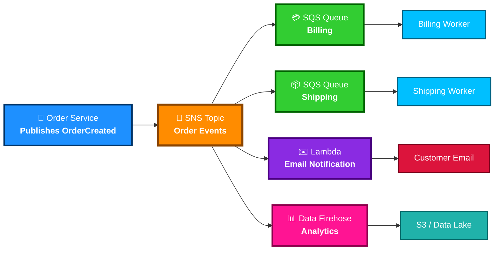

# Amazon SNS

<details>
<summary><strong>1. Definition</strong></summary>

**Amazon SNS — Simple Notification Service** is a fully managed **pub/sub messaging service**.

It lets one application publish a message to a **topic**, and SNS pushes that message to many subscribers.

**Simple idea:**

> One sender → SNS topic → many receivers

Common subscribers include:

- Amazon SQS
- AWS Lambda
- HTTP/HTTPS endpoints
- Email
- SMS
- Mobile push notifications
- Amazon Data Firehose

**Memory hook:**

> **SNS = Send Notifications to Subscribers**

</details>

<details>
<summary><strong>2. What Problem Does It Solve?</strong></summary>

SNS solves the problem of **sending the same event/message to multiple systems at the same time**.

Without SNS:

- One application must call many other systems directly
- Systems become tightly coupled
- Failures in one system can affect others

With SNS:

- Publishers send messages to a topic
- SNS fans out the message to subscribers
- Systems become loosely coupled
- Subscribers can process messages independently

**Main exam idea:**

> Use SNS when you need **pub/sub fanout**.

</details>

<details>
<summary><strong>3. Core Use Cases</strong></summary>

Common SNS use cases:

- **Fanout messages**
  - Send one event to multiple SQS queues, Lambda functions, or HTTP endpoints.

- **Application alerts**
  - Notify admins by email or SMS when something happens.

- **Event-driven architecture**
  - Trigger downstream services when an event occurs.

- **Decoupling microservices**
  - Services communicate through SNS instead of calling each other directly.

- **Serverless workflows**
  - SNS topic triggers Lambda functions.

- **Mobile push notifications**
  - Send notifications to mobile apps.

- **S3/EventBridge/CloudWatch notifications**
  - AWS services can publish events that notify subscribers.

</details>

<details>
<summary><strong>4. Important Features for SAA</strong></summary>

## SNS Topics

A **topic** is a logical channel where publishers send messages.

Subscribers attach to the topic.

Example:

```text
Order Service publishes "OrderCreated" → SNS Topic → Email + Lambda + SQS
```

## Pub/Sub Model

SNS uses **publish/subscribe** messaging.

| Role | Meaning |
|---|---|
| Publisher | Sends message to SNS topic |
| Topic | Communication channel |
| Subscriber | Receives message from topic |

## Fanout Pattern

SNS can send one message to many subscribers.

This is one of the most important SAA patterns.

Example:

```text
SNS Topic
 ├── SQS Queue for Billing
 ├── SQS Queue for Shipping
 └── Lambda for Email Notification
```

## Standard Topics

Standard topics are the default type.

They provide:

- Very high throughput
- At-least-once delivery
- Best-effort ordering
- Possible duplicate messages

Use Standard SNS when:

- Ordering is not critical
- You need high scale
- You want general pub/sub fanout

## FIFO Topics

FIFO topics support:

- Strict ordering
- Message deduplication
- Message groups
- Exactly-once delivery behavior when used correctly with SQS FIFO

Use FIFO SNS when:

- Message order matters
- Duplicate processing must be avoided
- You are usually faning out to SQS FIFO queues

Important:

> SNS FIFO is commonly paired with **SQS FIFO**.

## Message Filtering

Subscribers can use **filter policies** to receive only matching messages.

Example:

```text
SNS Topic receives all order events

Billing Queue receives only:
  eventType = "PAYMENT"

Shipping Queue receives only:
  eventType = "SHIPMENT"
```

This reduces unnecessary processing and cost.

## Raw Message Delivery

By default, SNS wraps messages with metadata.

With **raw message delivery**, SNS sends only the original message payload.

Useful when sending messages to SQS and you do not want SNS metadata.

## Dead-Letter Queues

SNS subscriptions can use an **SQS dead-letter queue** for messages that cannot be delivered.

Use a DLQ to:

- Capture failed deliveries
- Debug bad messages
- Reprocess messages later

Important:

> SNS DLQ is configured on the **subscription**, not the topic.

## Delivery Retries

SNS retries failed deliveries based on the subscriber type.

For example:

- Lambda and SQS integrations are handled by AWS
- HTTP/S endpoints can use retry policies
- Failed messages can be sent to a DLQ

## Message Size

SNS messages can be up to **256 KB**.

For larger payloads:

- Store large data in S3
- Send the S3 object reference through SNS

## Archive and Replay

SNS FIFO topics support message archiving and replay.

Useful for:

- Recovering from subscriber failures
- Replaying events
- Rebuilding downstream state

Exam note:

> Archive and replay is mainly associated with **SNS FIFO topics**.

</details>

<details>
<summary><strong>5. Security Model</strong></summary>

## IAM Permissions

IAM controls who can manage and publish to SNS.

Common permissions:

| Permission | Purpose |
|---|---|
| `sns:CreateTopic` | Create SNS topic |
| `sns:Publish` | Publish messages |
| `sns:Subscribe` | Subscribe endpoints |
| `sns:SetTopicAttributes` | Configure topic settings |
| `sns:DeleteTopic` | Delete topic |

## Topic Access Policies

SNS topics can have **resource-based policies**.

These allow:

- Cross-account publishing
- Cross-account subscriptions
- AWS services to publish to the topic

Example use case:

```text
S3 bucket in Account A publishes event to SNS topic in Account B
```

## Encryption Options

SNS supports encryption:

| Encryption Type | How |
|---|---|
| In transit | HTTPS/TLS |
| At rest | AWS KMS |

With KMS encryption:

- SNS encrypts message data at rest
- You can use AWS managed keys or customer managed keys
- Publishers and consumers may need KMS permissions

Important exam point:

> Encryption protects message body data, but metadata and attributes may not always be encrypted in the same way.

## Network/Security Controls

SNS is a regional AWS managed service.

Security controls include:

- IAM permissions
- SNS topic policies
- KMS encryption
- HTTPS endpoints
- VPC endpoints using AWS PrivateLink for private access to SNS APIs
- Subscription confirmation for email and HTTP/S endpoints

## Shared Responsibility

AWS is responsible for:

- SNS infrastructure
- Availability of the managed service
- Physical security
- Service scaling

You are responsible for:

- IAM policies
- Topic policies
- KMS key policies
- Subscriber security
- Message content
- Choosing encryption
- Monitoring delivery failures

</details>

<details>
<summary><strong>6. High Availability / Durability Behavior</strong></summary>

## Availability

SNS is a highly available managed AWS service.

You do not manage servers, scaling, or patching.

## Fault Tolerance

SNS stores published messages redundantly across multiple AWS-managed systems.

If a subscriber is temporarily unavailable, SNS retries delivery.

## Multi-AZ Behavior

SNS is designed to operate across multiple Availability Zones within a Region.

You do not configure Multi-AZ manually.

## Multi-Region Behavior

SNS topics are **Regional**.

Important:

> SNS does not automatically replicate topics across Regions.

For multi-region architectures, you must design it yourself, for example:

- Create SNS topics in multiple Regions
- Use EventBridge, Lambda, or custom logic for cross-region routing
- Use Route 53 or application logic for failover

## Durability

Durability depends on the topic and subscriber pattern.

| Feature | Behavior |
|---|---|
| Standard topic | At-least-once delivery |
| FIFO topic | Ordered delivery with deduplication |
| DLQ | Stores failed deliveries |
| Archive/replay | Allows replay for SNS FIFO topics |

## Delivery Guarantees

| Topic Type | Ordering | Duplicate Possibility |
|---|---|---|
| Standard SNS | Best effort | Possible |
| FIFO SNS | Strict ordering per message group | Deduplication supported |

Exam memory hook:

> **Standard = speed and scale**  
> **FIFO = order and deduplication**

</details>

<details>
<summary><strong>7. Cost Optimization Options</strong></summary>

SNS pricing is based mainly on:

- Number of publish requests
- Number of notifications delivered
- Data transfer
- SMS delivery charges
- KMS usage if encryption is enabled
- Archive/replay storage if used

## Ways to Reduce Cost

| Option | How It Helps |
|---|---|
| Use message filtering | Avoid sending unnecessary messages to subscribers |
| Avoid unnecessary SMS | SMS can be more expensive than app-to-app messaging |
| Use SQS/Lambda subscribers efficiently | Avoid duplicate processing |
| Keep messages small | Larger payloads can cost more |
| Store large payloads in S3 | Send only S3 reference through SNS |
| Remove unused subscriptions | Prevent wasted deliveries |
| Use DLQs | Avoid losing messages and reduce manual troubleshooting |
| Monitor failed deliveries | Prevent repeated delivery problems |

## Exam Tip

If a subscriber only needs certain messages, use:

> **SNS message filtering**

Do not create many separate topics unless the separation is truly needed.

</details>

<details>
<summary><strong>8. Common Exam Traps</strong></summary>

## SNS vs SQS

| Trap | Correct Understanding |
|---|---|
| SNS stores messages for consumers to poll | No, SNS is push-based |
| SQS pushes messages to consumers | No, SQS is pull-based |
| SNS is mainly for queues | No, SNS is pub/sub fanout |
| SQS is pub/sub | No, SQS is a queue |

## SNS Is Push-Based

SNS pushes messages to subscribers.

SQS requires consumers to poll messages.

Memory hook:

> **SNS pushes. SQS waits.**

## Standard Topics Can Duplicate Messages

SNS Standard topics provide at-least-once delivery.

This means:

- A message can be delivered more than once
- Your application should be idempotent

## Standard Topics Do Not Guarantee Order

SNS Standard topics provide best-effort ordering.

If order matters, use:

> SNS FIFO + SQS FIFO

## DLQ Is on Subscription

SNS DLQs are configured on the **subscription**, not the publisher.

## SNS Does Not Replace EventBridge

SNS is best for simple pub/sub fanout.

EventBridge is better for:

- Event routing
- SaaS integrations
- Event buses
- Schema discovery
- Advanced event patterns

## SNS Does Not Store Messages Like SQS

SNS delivers messages to subscribers.

SQS stores messages until consumers process them.

## Email/SMS Are Not Best for Application Processing

For reliable application processing, prefer:

- SNS → SQS
- SNS → Lambda

Email and SMS are better for human notifications.

## FIFO Has Limitations Compared to Standard

FIFO provides ordering and deduplication, but Standard topics are usually better for very high throughput and simple fanout.

</details>

<details>
<summary><strong>9. Compare With Similar Services</strong></summary>

| Service | Main Purpose | Push or Pull | Choose When |
|---|---|---|---|
| SNS | Pub/sub notifications and fanout | Push | One message must go to many subscribers |
| SQS | Message queue | Pull | One consumer group processes messages asynchronously |
| EventBridge | Event bus and routing | Push/event routing | You need advanced event filtering, SaaS events, or event bus patterns |
| Kinesis Data Streams | Real-time streaming | Pull by consumers | You need ordered high-volume stream processing |
| Amazon MQ | Managed message broker | Broker-based | You need protocols like AMQP, MQTT, OpenWire, or JMS |
| Step Functions | Workflow orchestration | State machine | You need ordered business workflow steps |

## SNS vs SQS

| Feature | SNS | SQS |
|---|---|---|
| Pattern | Pub/Sub | Queue |
| Delivery | Push | Pull |
| Consumers | Many subscribers | Usually one processing group |
| Message storage | Temporary delivery handling | Stores messages |
| Best for | Fanout notifications | Decoupled background processing |

## SNS vs EventBridge

| Feature | SNS | EventBridge |
|---|---|---|
| Best for | Fanout | Event routing |
| Filtering | Subscription filter policies | Advanced event pattern matching |
| SaaS integration | Limited compared to EventBridge | Strong |
| Common pattern | App sends alert/event to many subscribers | Event bus routes events between systems |

## SNS vs Kinesis

| Feature | SNS | Kinesis |
|---|---|---|
| Purpose | Notifications | Streaming data |
| Consumers | Subscribers receive messages | Consumers read from stream |
| Replay | FIFO archive/replay only | Stream retention and replay |
| Use case | Fanout app events | Clickstream, logs, telemetry |

</details>

<details>
<summary><strong>10. Mini Architecture Example</strong></summary>

## Example: Order Processing Fanout

An e-commerce app publishes an order event to SNS.

SNS sends the same event to multiple systems:

- Billing queue
- Shipping queue
- Email notification Lambda
- Analytics Firehose stream



## Why This Architecture Is Good

- Order Service does not directly call every downstream service
- Billing and Shipping can process independently
- Lambda can send customer notifications
- Analytics can store events separately
- If one subscriber fails, others can still receive messages

## SAA Exam Answer Pattern

Choose SNS when the question says:

- "Send one message to multiple consumers"
- "Fan out events"
- "Notify multiple systems"
- "Publish/subscribe"
- "Push notifications"
- "Multiple subscribers need the same event"

## Final Memory Hook

> **SNS = One event, many subscribers**  
> **SQS = One queue, workers pull messages**  
> **EventBridge = Route events by rules**  
> **Kinesis = Stream high-volume ordered data**

</details>