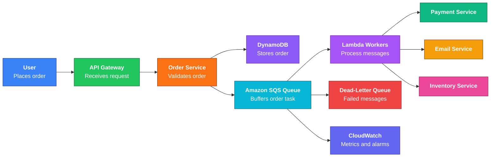

# Amazon SQS

## 1. Definition

<strong>Simple definition</strong>

Amazon SQS, or **Simple Queue Service**, is a fully managed **message queue** service.

It lets one part of an application send messages to a queue, and another part process those messages later.

**Memory hook:**  
**SQS = “Store Queue Safely”**

<strong>Beginner example</strong>

Imagine a restaurant:

- Customers place orders.
- Orders go into a queue.
- Kitchen staff pick up orders one by one.
- If the kitchen is busy, orders wait safely in the queue.

In AWS:

- Producer = sends message
- SQS queue = stores message
- Consumer = processes message

---

## 2. What Problem Does It Solve?

<strong>Decouples applications</strong>

SQS helps separate application components so they do not depend on each other being available at the same time.

Example:

- A web app receives an order.
- Instead of processing payment, email, inventory, and shipping immediately, it sends a message to SQS.
- Worker services process those tasks later.

This improves reliability and scalability.

<strong>Handles traffic spikes</strong>

If 10,000 requests arrive suddenly, SQS can hold messages while workers process them at their own speed.

Without SQS, backend services could be overloaded.

<strong>Prevents data loss during failures</strong>

If a worker crashes while processing a task, the message can become visible again and another worker can retry it.

---

## 3. Core Use Cases

<strong>Background job processing</strong>

Use SQS when users should not wait for slow work.

Examples:

- Image resizing
- Video processing
- Sending emails
- Generating reports
- Processing payments asynchronously

<strong>Decoupling microservices</strong>

Service A can send messages to SQS without directly calling Service B.

This reduces tight coupling between services.

<strong>Buffering traffic spikes</strong>

SQS can absorb sudden request bursts and allow consumers to process messages gradually.

<strong>Retry and failure handling</strong>

Failed messages can be retried automatically.

Messages that keep failing can be moved to a **dead-letter queue**, or DLQ.

<strong>Fanout with SNS</strong>

SNS can publish one message to multiple SQS queues.

This is useful when multiple systems need to process the same event differently.

Example:

- One queue for email service
- One queue for analytics service
- One queue for billing service

---

## 4. Important Features for SAA

<strong>Queue types: Standard vs FIFO</strong>

| Queue Type | Ordering | Duplicate Handling | Throughput | Best For |
|---|---:|---:|---:|---|
| Standard Queue | Best-effort ordering | At-least-once delivery, duplicates possible | Very high | Most workloads |
| FIFO Queue | Strict order within message group | Exactly-once processing behavior using deduplication | Lower than standard, but supports high-throughput FIFO mode | Ordered processing |

**Exam memory hook:**

- **Standard = speed**
- **FIFO = order**

<strong>Standard queues</strong>

Standard queues are the default SQS queue type.

Key exam points:

- Very high throughput
- At-least-once delivery
- Duplicate messages are possible
- Ordering is best-effort, not guaranteed
- Consumers must be idempotent

**Idempotent** means processing the same message twice does not cause incorrect results.

<strong>FIFO queues</strong>

FIFO means **First-In, First-Out**.

Key exam points:

- Preserves message order within a **message group**
- Helps prevent duplicate processing
- Requires `.fifo` queue name suffix
- Requires `MessageGroupId`
- Uses deduplication with:
  - `MessageDeduplicationId`, or
  - Content-based deduplication

**Important:** FIFO ordering is guaranteed only within the same message group.

<strong>Message visibility timeout</strong>

Visibility timeout is the time a message is hidden after a consumer receives it.

Flow:

1. Consumer receives message.
2. SQS hides the message.
3. Consumer processes the message.
4. Consumer deletes the message.
5. If not deleted before timeout, message becomes visible again.

Default visibility timeout: **30 seconds**  
Maximum visibility timeout: **12 hours**

**Exam trap:**  
Visibility timeout does not delete the message.

<strong>Message retention</strong>

Message retention controls how long SQS keeps messages that are not deleted.

Default retention: **4 days**  
Maximum retention: **14 days**  
Minimum retention: **1 minute**

**Exam hook:**  
SQS is not long-term storage. Use S3 for long-term storage.

<strong>Dead-letter queue, or DLQ</strong>

A DLQ stores messages that fail processing multiple times.

You configure:

- Source queue
- DLQ target
- Maximum receive count

If a message fails too many times, SQS moves it to the DLQ.

Use DLQs for:

- Debugging failures
- Isolating bad messages
- Preventing poison messages from blocking processing

**Exam trap:**  
A FIFO queue must use a FIFO DLQ.  
A standard queue must use a standard DLQ.

<strong>Long polling</strong>

Long polling waits for messages to arrive before returning a response.

Benefits:

- Reduces empty responses
- Reduces cost
- Improves efficiency

Maximum long polling wait time: **20 seconds**

**Exam hook:**  
Use long polling to reduce cost and unnecessary API calls.

<strong>Short polling</strong>

Short polling returns immediately, even if no messages are available.

It can create more empty responses and higher cost.

For most exam scenarios, long polling is preferred.

<strong>Delay queues</strong>

A delay queue postpones delivery of new messages.

Maximum delay: **15 minutes**

Use when messages should not be processed immediately.

Example:

- Wait 5 minutes before checking payment status.

<strong>Message timers</strong>

Message timers delay individual messages.

They are similar to delay queues, but apply per message.

Important distinction:

| Feature | Scope |
|---|---|
| Delay queue | Entire queue |
| Message timer | Individual message |

<strong>Maximum message size</strong>

SQS messages can be up to **1 MiB**.

For larger payloads, store the large object in S3 and send an S3 pointer through SQS.

**Exam hook:**  
SQS message = pointer or instruction, not large file storage.

<strong>Batch actions</strong>

SQS supports batching up to **10 messages** per API call.

Common batch actions:

- SendMessageBatch
- DeleteMessageBatch
- ChangeMessageVisibilityBatch

Batching helps reduce cost and improve throughput.

<strong>Lambda integration</strong>

AWS Lambda can poll SQS and process messages automatically.

Important points:

- Lambda polls the queue.
- Lambda invokes the function with message batches.
- Failed messages can be retried.
- DLQs can capture repeated failures.

**Exam trap:**  
SQS itself is pull-based. Consumers poll SQS.

---

## 5. Security Model

<strong>IAM permissions</strong>

Access to SQS is controlled with IAM policies.

Common permissions:

| Action | Purpose |
|---|---|
| `sqs:SendMessage` | Allows sending messages |
| `sqs:ReceiveMessage` | Allows reading messages |
| `sqs:DeleteMessage` | Allows deleting processed messages |
| `sqs:ChangeMessageVisibility` | Allows extending or changing visibility timeout |
| `sqs:GetQueueAttributes` | Allows reading queue settings |

Use least privilege.

Example:

- Producer only needs `SendMessage`.
- Consumer usually needs `ReceiveMessage`, `DeleteMessage`, and `ChangeMessageVisibility`.

<strong>Queue policies</strong>

SQS supports resource-based queue policies.

Queue policies are useful when allowing another AWS account or service to access a queue.

Example:

- Allow SNS topic to send messages to SQS.
- Allow another AWS account to send messages.

<strong>Encryption at rest</strong>

SQS supports server-side encryption.

Options:

| Encryption Option | Description |
|---|---|
| SQS-managed encryption | AWS manages encryption for you |
| AWS KMS key | Use AWS-managed or customer-managed KMS keys |

Use KMS when you need more control over key access and auditing.

<strong>Encryption in transit</strong>

Messages should be sent over HTTPS using TLS.

This protects messages while moving between clients and SQS.

<strong>KMS permissions</strong>

If using SSE with KMS, producers and consumers may need KMS permissions.

Common KMS permissions:

- `kms:GenerateDataKey`
- `kms:Decrypt`

**Exam trap:**  
Having SQS permissions alone may not be enough if the queue uses a customer-managed KMS key.

<strong>Network/security controls</strong>

SQS is a regional public AWS service endpoint, but you can access it privately using an **interface VPC endpoint**, powered by AWS PrivateLink.

Benefits:

- Private access from VPC
- No internet gateway required
- Better security control with endpoint policies

<strong>Shared responsibility</strong>

| AWS Responsibility | Customer Responsibility |
|---|---|
| Manages SQS infrastructure | Configure IAM correctly |
| Provides durability and availability | Enable encryption if required |
| Handles scaling | Delete messages after processing |
| Secures underlying service | Use DLQs and retries properly |
| Maintains service operations | Avoid sending sensitive data unless protected |

---

## 6. High Availability / Durability Behavior

<strong>Availability</strong>

SQS is a highly available managed service.

You do not manage servers, clusters, or brokers.

AWS handles the infrastructure.

<strong>Fault tolerance</strong>

SQS stores messages redundantly across multiple servers.

If a consumer fails, the message can become visible again after the visibility timeout.

This allows another consumer to retry processing.

<strong>Multi-AZ behavior</strong>

SQS is designed to be highly available within an AWS Region.

Messages are stored redundantly across multiple Availability Zones in the Region.

**Exam hook:**  
You do not configure Multi-AZ for SQS. AWS handles it.

<strong>Multi-Region behavior</strong>

SQS queues are regional.

A queue exists in one AWS Region.

For Multi-Region architectures, you must design replication or failover yourself.

Example options:

- Use applications to publish messages to queues in multiple Regions.
- Use EventBridge for cross-Region event routing where appropriate.
- Use disaster recovery patterns with active-active or active-passive design.

<strong>Durability</strong>

SQS is durable for messages during the configured retention period.

Messages remain in the queue until:

- A consumer deletes them after successful processing.
- The retention period expires.
- They are moved to a DLQ after repeated failures.

---

## 7. Cost Optimization Options

<strong>Use long polling</strong>

Long polling reduces empty responses.

Fewer empty receives means fewer unnecessary API requests.

This is one of the most common SQS cost optimization exam answers.

<strong>Use batch operations</strong>

Send, receive, and delete messages in batches when possible.

Batching up to 10 messages per request can reduce API call volume.

<strong>Choose the right queue type</strong>

Use standard queues unless strict ordering or deduplication is required.

FIFO queues are useful, but do not choose FIFO unless the workload needs ordering.

<strong>Delete messages after processing</strong>

Consumers must delete messages after successful processing.

If messages are not deleted, they can be retried repeatedly and increase processing cost.

<strong>Use appropriate retention</strong>

Do not keep messages longer than needed.

Longer retention can be useful for recovery, but SQS is not meant for long-term data storage.

<strong>Use S3 for large payloads</strong>

For large data, store the payload in S3 and send only a pointer in SQS.

This keeps queue messages small and avoids inefficient message handling.

<strong>Scale consumers carefully</strong>

Too few consumers can create backlog.

Too many consumers can increase compute cost.

Use Auto Scaling, Lambda concurrency, or ECS scaling based on queue depth.

---

## 8. Common Exam Traps

<strong>Trap: SQS pushes messages to consumers</strong>

Wrong.

SQS is normally **poll-based**.

Consumers poll the queue to receive messages.

Lambda integration feels automatic, but Lambda is polling SQS behind the scenes.

<strong>Trap: Standard queues guarantee ordering</strong>

Wrong.

Standard queues provide best-effort ordering only.

Use FIFO queues when strict ordering is required.

<strong>Trap: Standard queues deliver exactly once</strong>

Wrong.

Standard queues provide at-least-once delivery.

Duplicate messages are possible.

Design consumers to be idempotent.

<strong>Trap: Visibility timeout deletes a message</strong>

Wrong.

Visibility timeout only hides the message temporarily.

The consumer must delete the message after successful processing.

<strong>Trap: DLQ automatically fixes failed messages</strong>

Wrong.

A DLQ isolates failed messages.

You still need to inspect, fix, and optionally redrive them.

<strong>Trap: FIFO means the entire queue is single-threaded</strong>

Not exactly.

FIFO preserves order within each message group.

Multiple message groups can be processed in parallel.

<strong>Trap: SQS is good for real-time pub/sub fanout by itself</strong>

Not by itself.

SQS is a queue.

For fanout, use SNS publishing to multiple SQS queues.

<strong>Trap: SQS is the same as Kinesis</strong>

Wrong.

SQS is for decoupled message processing.

Kinesis is for streaming data with ordered shards and replay capability.

<strong>Trap: SQS stores messages forever</strong>

Wrong.

Maximum retention is 14 days.

For long-term storage, use S3.

<strong>Trap: Any DLQ type can be attached to any queue</strong>

Wrong.

Queue types must match:

- Standard queue → standard DLQ
- FIFO queue → FIFO DLQ

---

## 9. Compare With Similar Services

<strong>SQS vs similar AWS messaging services</strong>

| Service | Pattern | Choose When | Key Exam Point |
|---|---|---|---|
| SQS | Queue | You need decoupling and async processing | Pull-based queue |
| SNS | Pub/sub | You need to fan out one message to many subscribers | Push-based notifications |
| EventBridge | Event bus | You need event routing, SaaS integration, or rule-based filtering | Best for event-driven apps |
| Kinesis Data Streams | Streaming | You need ordered streaming, replay, and analytics | Uses shards |
| Amazon MQ | Managed message broker | You need protocols like AMQP, MQTT, OpenWire, JMS | Best for legacy broker migration |
| Step Functions | Workflow orchestration | You need multi-step workflows with state and retries | Coordinates services |
| Lambda Async Invocation | Async compute trigger | You want Lambda to handle async retry flow directly | Not a general queue replacement |

<strong>When to choose SQS</strong>

Choose SQS when:

- You need a buffer between services.
- You want asynchronous processing.
- You need retries.
- You need DLQ support.
- You want workers to process jobs at their own pace.
- You do not need complex event routing.

<strong>When not to choose SQS</strong>

Do not choose SQS when:

- You need one event delivered to many systems directly → use SNS or EventBridge.
- You need long-term message replay beyond 14 days → use Kinesis or S3-based design.
- You need streaming analytics → use Kinesis.
- You need complex workflows → use Step Functions.
- You need traditional broker protocols → use Amazon MQ.

---

## 10. Mini Architecture Example

<strong>Architecture: Order processing with SQS</strong>

Scenario:

An e-commerce app receives orders.

Instead of processing everything during the user request, the app sends order messages to SQS.

Workers process orders asynchronously.

Flow:

1. User places order through API Gateway.
2. Order service stores order in DynamoDB.
3. Order service sends message to SQS.
4. Lambda workers poll SQS.
5. Lambda processes payment, inventory, and email tasks.
6. Failed messages go to a DLQ.
7. CloudWatch monitors queue depth and failures.

<strong>Mermaid diagram</strong>

<strong>Why SQS fits this design</strong>

SQS is useful here because:

- The user gets a fast response.
- Workers can process orders independently.
- Traffic spikes are buffered.
- Failed messages can be retried.
- Bad messages can be moved to a DLQ.
- The system becomes more fault tolerant.

---

## SAA Quick Review

<strong>Must-remember facts</strong>

| Topic | Exam Fact |
|---|---|
| Standard queue | High throughput, at-least-once delivery, best-effort ordering |
| FIFO queue | Ordered processing within message group, deduplication support |
| Visibility timeout | Message is hidden after being received |
| Delete message | Required after successful processing |
| DLQ | Stores repeatedly failed messages |
| Long polling | Reduces empty responses and cost |
| Retention | Default 4 days, maximum 14 days |
| Delay queue | Delays new messages up to 15 minutes |
| Message size | Up to 1 MiB |
| Large payloads | Store in S3 and send pointer in SQS |
| Security | IAM, queue policies, encryption, KMS, VPC endpoints |
| Multi-AZ | Handled by AWS within the Region |
| Multi-Region | Must be designed separately |

<strong>Final memory hook</strong>

**SQS = Queue for async work**

Remember:

- **Standard = speed**
- **FIFO = order**
- **Visibility timeout = hidden, not deleted**
- **DLQ = failed message parking lot**
- **Long polling = fewer empty calls**
- **SQS stores messages temporarily, not forever**

