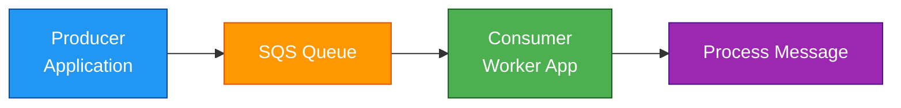
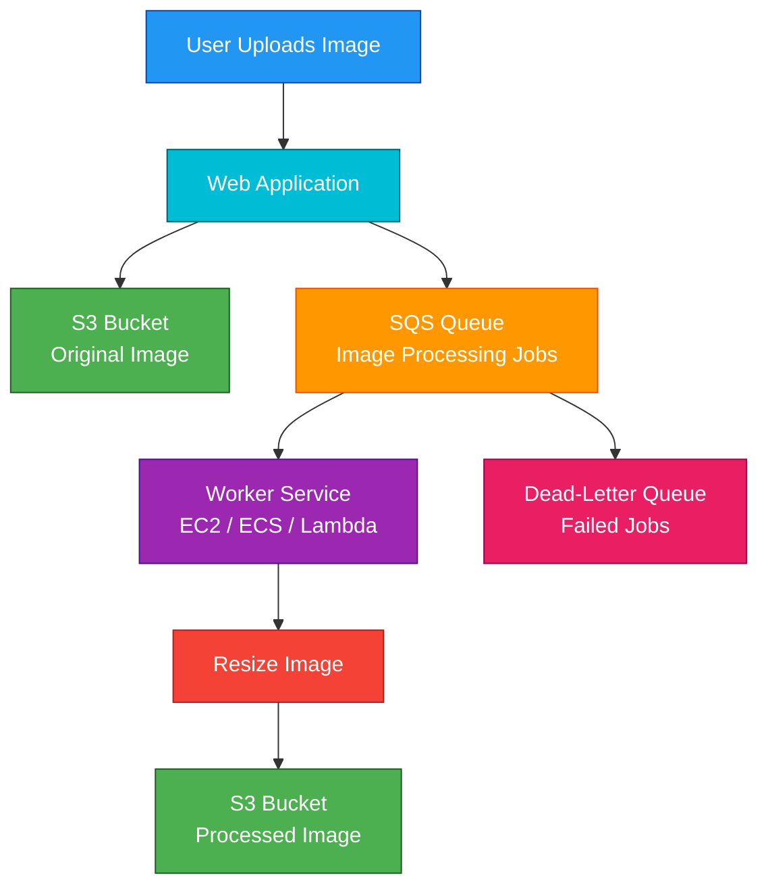

# SQS

## 1. Definition

### Simple Definition

Amazon SQS, or Simple Queue Service, is a fully managed message queue service.

It lets one application send messages to a queue, and another application reads and processes those messages later.

### Memory Hook

SQS = Store Queue Safely

### Basic Idea

SQS helps applications communicate asynchronously.

The sender does not wait for the receiver to process the message.

## 2. What Problem Does It Solve?

### Main Problem

SQS solves the problem of connecting systems that work at different speeds.

One system can send work to a queue, and another system can process that work when it is ready.

### Without SQS

If one service directly calls another service:

- The caller may fail if the receiver is down
- Traffic spikes can overwhelm the receiver
- The caller must wait for a response
- Systems become tightly coupled

### With SQS

The producer places messages into a queue.

The consumer reads messages from the queue and processes them independently.

### Key Benefit

SQS helps build decoupled, reliable, and scalable applications.

## 3. Core Use Cases

### Decoupling Applications

SQS allows services to communicate without directly depending on each other.

Example:

- Web app receives an order
- Web app sends message to SQS
- Backend worker processes the order later

### Buffering Traffic Spikes

SQS can absorb sudden bursts of traffic.

Workers process messages at their own pace.

### Background Job Processing

Use SQS for tasks that do not need to happen immediately.

Examples:

- Image resizing
- Video processing
- Report generation
- Email processing

### Retry and Failure Handling

If a consumer fails to process a message, SQS can make the message visible again for retry.

Failed messages can be moved to a dead-letter queue.

### Microservice Communication

SQS is commonly used between microservices to reduce direct dependencies.

### SNS Fan-Out Target

SNS can publish one message to multiple SQS queues.

Each queue can be processed by a different service.

## 4. Important Features for SAA

### Queue Types

SQS has two main queue types:

| Queue Type | Best For | Ordering | Delivery |
|---|---|---|---|
| Standard Queue | High throughput | Best-effort ordering | At-least-once |
| FIFO Queue | Ordered processing | Strict order within message group | Exactly-once processing when used correctly |

### Standard Queue

Standard queues are the default and most common SAA exam choice.

Important points:

- Nearly unlimited throughput
- At-least-once delivery
- Best-effort ordering
- Duplicate messages are possible
- Consumers must be idempotent

### FIFO Queue

FIFO queues are used when message order matters.

Important points:

- FIFO = First-In-First-Out
- Queue name must end with `.fifo`
- Preserves order within a message group
- Supports deduplication
- Lower throughput than Standard queues
- Commonly paired with SNS FIFO topics

### Producers

A producer sends messages to an SQS queue.

Examples:

- Web application
- Lambda function
- EC2 application
- ECS task
- SNS topic

### Consumers

A consumer reads and processes messages from the queue.

Examples:

- EC2 worker
- Lambda function
- ECS task
- On-premises application

### Polling

Consumers poll SQS to receive messages.

SQS does not push messages directly to consumers.

| Polling Type | Description | Exam Tip |
|---|---|---|
| Short Polling | Returns immediately, may return empty response | Less cost-efficient |
| Long Polling | Waits for messages before responding | Preferred for cost optimization |

### Visibility Timeout

When a consumer receives a message, SQS hides that message from other consumers for a period of time.

This period is called the visibility timeout.

If the consumer finishes successfully, it deletes the message.

If the consumer fails, the message becomes visible again.

### Message Retention

SQS stores messages for a configurable retention period.

Important points:

- Default retention: 4 days
- Maximum retention: 14 days
- Minimum retention: 1 minute

### Dead-Letter Queue

A dead-letter queue, or DLQ, stores messages that fail processing multiple times.

Use DLQs to troubleshoot bad messages.

### Delay Queue

A delay queue postpones delivery of new messages for a configured time.

Example:

A message is sent now but becomes available after 5 minutes.

### Message Timer

A message timer delays a specific individual message.

This is different from a delay queue, which applies to the whole queue.

### Message Size

SQS messages can be up to 256 KB.

For larger payloads, store the data in S3 and send the S3 object reference in the SQS message.

### Batch Operations

SQS supports batch send, receive, and delete operations.

Batching improves efficiency and can reduce cost.

## 5. Security Model

### IAM Permissions

IAM controls who can use and manage SQS.

Common permissions:

| Permission | Purpose |
|---|---|
| `sqs:CreateQueue` | Create a queue |
| `sqs:SendMessage` | Send messages |
| `sqs:ReceiveMessage` | Read messages |
| `sqs:DeleteMessage` | Delete processed messages |
| `sqs:GetQueueAttributes` | View queue settings |
| `sqs:SetQueueAttributes` | Modify queue settings |

### Queue Policies

SQS supports resource-based queue policies.

Queue policies can allow:

- Cross-account access
- SNS topics to send messages to a queue
- Specific AWS services to interact with the queue

### Encryption at Rest

SQS supports server-side encryption.

Options include:

| Encryption Option | Description |
|---|---|
| SSE-SQS | AWS-managed SQS encryption |
| SSE-KMS | Encryption using AWS KMS keys |

### Encryption in Transit

SQS API calls use HTTPS for encryption in transit.

### Network and Security Controls

SQS is a regional public AWS service.

It does not run inside your VPC.

However, you can use VPC endpoints with AWS PrivateLink to privately access SQS from a VPC.

### Shared Responsibility

AWS is responsible for:

- SQS infrastructure
- Availability of the managed service
- Durability of stored messages
- Service patching

You are responsible for:

- IAM permissions
- Queue policies
- Encryption settings
- KMS key permissions
- Consumer logic
- Deleting messages after successful processing

## 6. High Availability / Durability Behavior

### Availability

SQS is a fully managed regional service.

AWS manages the infrastructure across multiple Availability Zones within a Region.

### Fault Tolerance

SQS is designed to handle infrastructure failures automatically.

You do not manage servers, brokers, clusters, or replication.

### Multi-AZ Behavior

Messages are stored redundantly across multiple Availability Zones.

This gives SQS high durability and availability within a Region.

### Multi-Region Behavior

SQS queues are regional.

If you need Multi-Region architecture, you must create queues in multiple Regions and design the replication or failover logic.

### Durability

SQS stores messages durably until they are:

- Deleted by a consumer
- Expired after the message retention period

### Delivery Guarantees

| Queue Type | Delivery Guarantee |
|---|---|
| Standard Queue | At-least-once delivery |
| FIFO Queue | Exactly-once processing when configured and used correctly |

### Ordering

| Queue Type | Ordering Behavior |
|---|---|
| Standard Queue | Best-effort ordering |
| FIFO Queue | Strict ordering within message group |

### Consumer Failure Behavior

If a consumer receives a message but does not delete it before the visibility timeout expires, the message becomes visible again.

Another consumer can then process it.

## 7. Cost Optimization Options

### Use Long Polling

Long polling reduces empty responses.

This can lower cost and improve efficiency.

Exam tip:

Use long polling when the question asks how to reduce empty receives or reduce SQS polling cost.

### Use Batch Operations

Batching lets you send, receive, or delete multiple messages in one API call.

This reduces the number of API requests.

### Choose Standard Queues When Ordering Is Not Required

Standard queues provide very high throughput and are usually the best default option.

Use FIFO only when strict ordering is required.

### Tune Visibility Timeout

Set the visibility timeout long enough for normal processing.

If it is too short, messages may be processed more than once.

If it is too long, failed messages take longer to retry.

### Use Dead-Letter Queues

DLQs help separate failed messages from healthy traffic.

This prevents repeated processing of bad messages from wasting compute resources.

### Keep Messages Small

SQS message size is limited to 256 KB.

For large payloads:

- Store the payload in S3
- Send the S3 object key in the SQS message

### Scale Consumers Carefully

For Lambda consumers, tune:

- Batch size
- Maximum concurrency
- Visibility timeout
- DLQ or failure handling

This helps control downstream cost and avoid overload.

## 8. Common Exam Traps

### SQS vs SNS

SQS stores messages until consumers poll them.

SNS pushes messages to subscribers.

Memory hook:

- SQS = Queue and Pull
- SNS = Notify and Push

### SQS Is Not Push-Based

SQS does not push messages to EC2 or ECS consumers.

Consumers must poll the queue.

Lambda integration feels event-driven, but Lambda service polls SQS on your behalf.

### Visibility Timeout Is Not Message Retention

Visibility timeout controls how long a received message is hidden.

Message retention controls how long SQS stores a message before deleting it automatically.

### Delete Message After Processing

Receiving a message does not remove it from the queue.

The consumer must delete the message after successful processing.

### Standard Queues Can Have Duplicates

Standard queues provide at-least-once delivery.

Applications should be idempotent.

### Standard Queues Do Not Guarantee Order

If strict order is required, choose FIFO queues.

### FIFO Queue Name Requirement

FIFO queue names must end with `.fifo`.

### FIFO Message Groups Matter

FIFO queues preserve order within a message group.

To increase parallelism, use multiple message groups.

### Delay Queue vs Visibility Timeout

| Feature | Meaning |
|---|---|
| Delay Queue | Delays new messages before first delivery |
| Visibility Timeout | Hides received messages during processing |

### DLQ Does Not Fix the Message

A dead-letter queue stores failed messages for investigation.

It does not automatically repair or reprocess the message unless you configure redrive or custom logic.

### Large Message Trap

SQS messages cannot exceed 256 KB.

Use S3 for large payloads and place a pointer in the SQS message.

## 9. Compare With Similar Services

### Service Comparison Table

| Service | Pattern | Best For | Choose When |
|---|---|---|---|
| SQS | Queue pull | Decoupling and buffering | Consumers need to process messages asynchronously |
| SNS | Pub/sub push | Fan-out notifications | One message must go to many subscribers |
| EventBridge | Event bus | Advanced event routing | You need rules, event patterns, SaaS integration, or event buses |
| Kinesis Data Streams | Streaming | Real-time ordered data streams | You need streaming analytics or multiple consumers reading from shards |
| MQ | Managed message broker | Traditional protocols | You need ActiveMQ or RabbitMQ compatibility |
| Step Functions | Workflow orchestration | Multi-step workflows | You need state management, branching, and retries |

### SQS vs SNS

| Feature | SQS | SNS |
|---|---|---|
| Delivery model | Pull | Push |
| Main purpose | Queue work | Notify subscribers |
| Message storage | Stores messages until consumed or expired | Temporary delivery only |
| Common use | Background jobs | Fan-out |
| Consumer behavior | Consumers poll | SNS delivers |

### SQS vs EventBridge

| Feature | SQS | EventBridge |
|---|---|---|
| Main purpose | Queue and buffer messages | Route events |
| Consumer model | Polling | Rule-based delivery |
| Best for | Reliable async processing | Event-driven integrations |
| Message retention | Up to 14 days | Event bus delivery, optional archive/replay |
| Exam clue | “Decouple and buffer work” | “Route events based on rules” |

### SQS vs Kinesis

| Feature | SQS | Kinesis Data Streams |
|---|---|---|
| Main use | Message queue | Data streaming |
| Consumer behavior | Message usually processed and deleted | Records can be read by multiple consumers |
| Ordering | FIFO queue supports ordering | Ordering within shard |
| Retention | Up to 14 days | Stream retention period |
| Best for | Async jobs | Real-time analytics and streaming |

### When to Choose SQS

Choose SQS when:

- You need a message queue
- Consumers process work asynchronously
- You need buffering during traffic spikes
- You need retries for failed processing
- You want to decouple producers and consumers
- The exam mentions polling, visibility timeout, or dead-letter queues

## 10. Mini Architecture Example

### Scenario

An image upload application needs to resize images after users upload them.

The upload should be fast, and image processing can happen in the background.

### Architecture

The web application uploads the image to S3 and sends a message to SQS.

Worker applications poll SQS and process the image later.

### Why This Is Good

- The web application responds quickly
- Image processing happens asynchronously
- Workers can scale based on queue depth
- Failed jobs can be sent to a DLQ
- Traffic spikes are buffered by SQS

### Exam Answer Pattern

If the question says:

“An application needs to decouple components and process messages asynchronously.”

Think:

SQS queue between producer and consumer.

### Final Memory Hook

SQS is for buffering.

SNS is for broadcasting.

EventBridge is for smart event routing.

