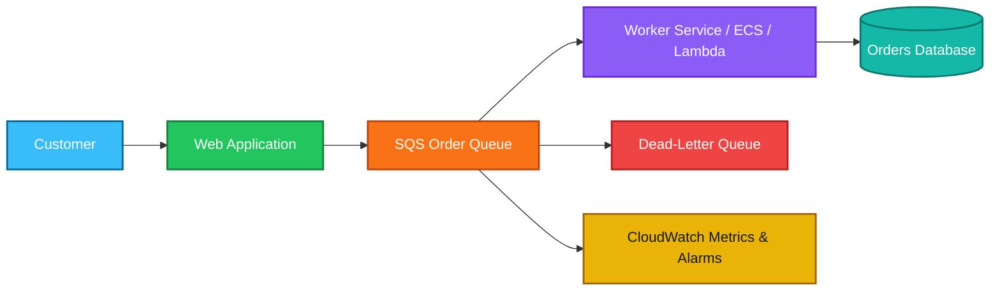

# SQS

<details>
<summary>1. Definition</summary>

## 1. Definition

### Simple Definition

Amazon SQS, or Simple Queue Service, is a fully managed message queue service.

It lets one application send messages to a queue, while another application reads and processes those messages later.

### Easy Analogy

Think of SQS like a waiting line at a restaurant:

- Customers enter the line.
- Workers serve customers when ready.
- If workers are busy, customers wait.
- The restaurant does not break just because many customers arrive at once.

### Key Exam Idea

SQS is used to decouple applications.

That means the sender and receiver do not need to be available at the same time.

### Memory Hook

SQS = Simple Queue Service = Store messages until workers are ready.

</details>

<details>
<summary>2. What Problem Does It Solve?</summary>

## 2. What Problem Does It Solve?

### The Main Problem

Without SQS, applications often call each other directly.

If one service is slow, busy, or temporarily down, the whole system can fail or slow down.

SQS solves this by placing a queue between services.

### Before SQS

```text
App A ---> App B
```

If App B is down, App A may fail.

### With SQS

```text
App A ---> SQS Queue ---> App B
```

If App B is down, messages wait safely in the queue.

### What SQS Helps With

- Decoupling applications
- Handling traffic spikes
- Improving reliability
- Processing tasks asynchronously
- Preventing overloaded services from crashing
- Retrying failed work

### Exam Focus

Choose SQS when the question says:

- Decouple components
- Buffer requests
- Process messages asynchronously
- Handle sudden traffic spikes
- Worker fleet processes jobs from a queue

</details>

<details>
<summary>3. Core Use Cases</summary>

## 3. Core Use Cases

### Background Job Processing

A web app sends tasks to SQS, and worker servers process them later.

Examples:

- Image resizing
- Video processing
- Email sending
- Report generation
- Order processing

### Buffering Traffic

SQS can absorb traffic spikes so backend systems are not overwhelmed.

Example:

```text
Thousands of orders arrive quickly.
SQS stores the orders.
Workers process them at a safe speed.
```

### Decoupling Microservices

One service can send a message without directly calling another service.

This makes the system more fault tolerant.

### Event Processing

SQS can receive messages from services such as:

- SNS
- EventBridge
- Lambda
- S3 event notifications

### Retry Failed Processing

If a consumer fails to process a message, SQS can make the message visible again for another retry.

### Dead-Letter Queue Handling

Failed messages can be moved to a DLQ for investigation after too many failed attempts.

</details>

<details>
<summary>4. Important Features for SAA</summary>

## 4. Important Features for SAA

### Standard Queue

Standard queues are the default SQS queue type.

They provide:

- Very high throughput
- At-least-once delivery
- Best-effort ordering

### Standard Queue Exam Notes

| Feature | Standard Queue |
|---|---|
| Throughput | Very high |
| Delivery | At least once |
| Ordering | Best effort |
| Duplicates possible? | Yes |
| Best for | Maximum scalability |

### FIFO Queue

FIFO means First-In, First-Out.

FIFO queues are used when message order matters.

They provide:

- First-in, first-out ordering
- Exactly-once processing behavior
- Message deduplication
- Message groups

### FIFO Queue Exam Notes

| Feature | FIFO Queue |
|---|---|
| Throughput | Lower than standard, but can scale with batching/high-throughput FIFO |
| Delivery | Exactly-once processing behavior |
| Ordering | Strict order within a message group |
| Duplicates possible? | Prevented using deduplication |
| Best for | Ordered processing |

### Standard vs FIFO

| Requirement | Choose |
|---|---|
| Maximum throughput | Standard Queue |
| Strict ordering | FIFO Queue |
| Duplicate messages are acceptable | Standard Queue |
| Duplicate messages must be prevented | FIFO Queue |
| Order processing system | FIFO Queue |
| Background image processing | Standard Queue |

### Visibility Timeout

Visibility timeout is the time when a message becomes hidden after a consumer receives it.

During this time:

1. A consumer receives the message.
2. SQS hides the message from other consumers.
3. The consumer processes the message.
4. The consumer deletes the message.
5. If not deleted, the message becomes visible again.

### Visibility Timeout Exam Trap

SQS does not automatically delete messages after they are read.

The consumer must delete the message after successful processing.

### Visibility Timeout Example

```text
Visibility timeout = 30 seconds

Worker receives message.
Message is hidden for 30 seconds.
Worker must process and delete it before timeout expires.
If not deleted, message reappears in the queue.
```

### Message Retention

SQS can keep messages in a queue for a configurable period.

Important exam values:

| Setting | Value |
|---|---|
| Default message retention | 4 days |
| Maximum message retention | 14 days |
| Minimum message retention | 1 minute |

### Long Polling

Long polling lets consumers wait for messages instead of constantly checking the queue.

Benefits:

- Reduces empty responses
- Reduces API calls
- Reduces cost
- Improves efficiency

### Short Polling

Short polling checks the queue immediately.

If no message is found, SQS returns an empty response.

### Long Polling Exam Tip

Prefer long polling for cost optimization and better efficiency.

### Delay Queue

A delay queue delays new messages before they become available to consumers.

Example:

```text
Message sent now.
Delay = 5 minutes.
Consumer can receive it after 5 minutes.
```

### Message Timer

A message timer delays a specific individual message.

Difference:

| Feature | Applies To |
|---|---|
| Delay queue | All new messages in the queue |
| Message timer | One specific message |

### Dead-Letter Queue

A dead-letter queue stores messages that failed processing multiple times.

DLQs help with:

- Debugging
- Failure isolation
- Preventing poison messages from blocking processing

### Redrive Policy

A redrive policy defines when messages are sent to a DLQ.

The key setting is:

```text
maxReceiveCount
```

This means how many times a message can be received before being moved to the DLQ.

### Message Size

SQS message size can be up to 256 KB.

For larger payloads:

- Store the large object in S3.
- Send the S3 object reference in the SQS message.

### Lambda Integration

Lambda can poll SQS and process messages automatically.

Common pattern:

```text
SQS Queue ---> Lambda Function
```

SAA exam notes:

- Lambda polls the queue.
- Lambda processes messages in batches.
- Failed messages can be retried.
- DLQs can capture failed messages.

### Fanout Pattern with SNS and SQS

SNS can send the same message to multiple SQS queues.

This is called fanout.

Example:

```text
SNS Topic
   ├── SQS Queue for Billing
   ├── SQS Queue for Shipping
   └── SQS Queue for Analytics
```

### Memory Hook

SNS pushes notifications.

SQS stores messages.

Use SNS + SQS when multiple systems need their own copy of the same event.

</details>

<details>
<summary>5. Security Model</summary>

## 5. Security Model

### IAM Permissions

Access to SQS is controlled with IAM policies.

Common SQS permissions:

| Action | Meaning |
|---|---|
| `sqs:SendMessage` | Send messages to a queue |
| `sqs:ReceiveMessage` | Read messages from a queue |
| `sqs:DeleteMessage` | Delete processed messages |
| `sqs:GetQueueAttributes` | View queue settings |
| `sqs:PurgeQueue` | Delete all messages in the queue |

### Queue Access Policies

SQS also supports queue policies.

Queue policies are resource-based policies attached to the queue.

They are useful when:

- SNS needs permission to publish to SQS
- Another AWS account needs queue access
- A specific service needs to send messages

### Encryption at Rest

SQS supports server-side encryption.

Options include:

| Encryption Option | Description |
|---|---|
| SQS-managed encryption | AWS manages encryption automatically |
| AWS KMS key | You control encryption using KMS |
| Customer-managed KMS key | You manage key policies and permissions |

### Encryption in Transit

Messages sent to and from SQS should use HTTPS.

### Network and Security Controls

SQS is a regional public AWS service.

Security can be improved with:

- IAM least privilege
- Queue policies
- KMS encryption
- VPC endpoints using AWS PrivateLink
- CloudTrail logging
- CloudWatch monitoring

### VPC Endpoint

A VPC endpoint lets private resources access SQS without going through the public internet.

Exam clue:

```text
Private EC2 instances need to access SQS without internet access.
```

Choose:

```text
VPC endpoint for SQS
```

### Shared Responsibility

| AWS Responsibility | Customer Responsibility |
|---|---|
| Securing SQS infrastructure | IAM permissions |
| Service availability | Queue policies |
| Physical data center security | KMS key policies |
| Managed encryption capability | Message content security |
| Regional service durability | Correct retry and DLQ design |

### Important Security Tip

Do not put sensitive information in queue names because names can appear in logs, billing, and monitoring tools.

</details>

<details>
<summary>6. High Availability / Durability Behavior</summary>

## 6. High Availability / Durability Behavior

### Availability

SQS is a fully managed AWS service.

AWS manages the infrastructure, scaling, and availability of the queue service.

### Regional Service

SQS is regional.

A queue exists in one AWS Region.

Example:

```text
us-east-1 queue is separate from eu-west-1 queue
```

### Multi-AZ Durability

SQS stores messages redundantly across multiple Availability Zones within the same Region.

This helps protect messages from infrastructure failure.

### Fault Tolerance

SQS improves fault tolerance because producers and consumers are separated.

If consumers fail:

- Messages remain in the queue.
- Consumers can process them later.

If producers send messages too quickly:

- SQS buffers the messages.
- Consumers process them at their own pace.

### At-Least-Once Delivery

Standard queues provide at-least-once delivery.

This means a message may be delivered more than once.

Applications should be idempotent.

### Idempotency

Idempotency means processing the same message more than once does not cause incorrect results.

Example:

```text
Bad:
Charge customer every time message is processed.

Good:
Check if order ID was already charged before charging.
```

### FIFO Ordering

FIFO queues preserve message order within a message group.

Important:

- Ordering is guaranteed within the same message group.
- Different message groups can be processed in parallel.

### Multi-Region Behavior

SQS does not automatically replicate a queue across Regions.

For multi-Region architectures, you must design replication or failover yourself.

Possible approaches:

- Use separate queues in each Region.
- Use application-level replication.
- Use EventBridge or custom logic for cross-Region event flow.

</details>

<details>
<summary>7. Cost Optimization Options</summary>

## 7. Cost Optimization Options

### Use Long Polling

Long polling reduces the number of empty responses.

This lowers API request costs.

Exam phrase:

```text
Reduce cost from frequent polling when queues are often empty.
```

Choose:

```text
Enable long polling.
```

### Batch Actions

SQS supports batching for actions such as:

- SendMessageBatch
- DeleteMessageBatch
- ChangeMessageVisibilityBatch

Batching reduces the number of API calls.

### Right-Size Message Payloads

Keep messages small.

For large payloads:

1. Store large data in S3.
2. Send only the S3 object key or URL in SQS.

### Delete Messages After Processing

Messages that are not deleted may be processed again.

This can increase:

- Processing cost
- Lambda invocations
- API calls
- Duplicate work

### Tune Visibility Timeout

Set the visibility timeout long enough for normal processing.

If it is too short:

- Messages may be retried too early.
- Duplicate processing may increase cost.

If it is too long:

- Failed messages take longer to retry.

### Use DLQs

DLQs prevent poison messages from being retried forever.

This reduces wasted processing.

### Use Auto Scaling with Queue Metrics

For EC2 or container workers, scale based on queue depth.

Useful CloudWatch metrics:

| Metric | Meaning |
|---|---|
| `ApproximateNumberOfMessagesVisible` | Messages waiting to be processed |
| `ApproximateNumberOfMessagesNotVisible` | Messages currently being processed |
| `ApproximateAgeOfOldestMessage` | Age of oldest message |

### Memory Hook

Long polling saves money.

Batching saves money.

DLQs prevent waste.

</details>

<details>
<summary>8. Common Exam Traps</summary>

## 8. Common Exam Traps

### Trap 1: SQS Does Not Push Messages

SQS is pull-based.

Consumers poll the queue for messages.

SNS is push-based.

### Trap 2: Reading a Message Does Not Delete It

A message must be deleted after successful processing.

If not deleted, it appears again after visibility timeout.

### Trap 3: Standard Queues Can Deliver Duplicates

Standard SQS queues provide at-least-once delivery.

Duplicate messages are possible.

Design consumers to be idempotent.

### Trap 4: Standard Queues Do Not Guarantee Strict Ordering

Standard queues provide best-effort ordering only.

Use FIFO queues when strict ordering is required.

### Trap 5: FIFO Queue Ordering Requires Message Group ID

FIFO queues need a message group ID.

Messages in the same group are processed in order.

Different groups can be processed in parallel.

### Trap 6: DLQ Is for Failed Messages, Not Normal Processing

A DLQ stores messages that failed processing too many times.

It is not used for normal message delivery.

### Trap 7: Visibility Timeout Is Not Message Retention

| Concept | Meaning |
|---|---|
| Visibility timeout | How long a received message is hidden |
| Message retention | How long SQS stores a message before deleting it |

### Trap 8: SQS Is Not a Streaming Service

SQS is a queue.

For high-volume streaming analytics, choose Kinesis.

### Trap 9: SQS Is Not Pub/Sub by Itself

SQS sends each message to one queue.

For pub/sub fanout, use SNS with multiple SQS queues.

### Trap 10: Delay Queue vs Visibility Timeout

| Feature | When It Happens |
|---|---|
| Delay queue | Before the message is first available |
| Visibility timeout | After a consumer receives the message |

### Trap 11: SQS Is Regional

SQS queues are regional.

They are not automatically global or multi-Region.

### Trap 12: FIFO Queues May Not Be Best for Maximum Throughput

If the exam asks for highest possible throughput and ordering is not required, choose standard queue.

</details>

<details>
<summary>9. Compare With Similar Services</summary>

## 9. Compare With Similar Services

### Service Comparison Table

| Service | Main Purpose | Delivery Style | Choose When |
|---|---|---|---|
| SQS | Message queue | Pull | You need decoupling, buffering, async processing |
| SNS | Pub/sub notifications | Push | You need to fan out messages to many subscribers |
| EventBridge | Event bus and routing | Push/event routing | You need event-driven integration and filtering |
| Kinesis Data Streams | Real-time streaming | Stream processing | You need ordered, replayable streaming data |
| Amazon MQ | Managed message broker | Broker protocols | You need RabbitMQ or ActiveMQ compatibility |
| Step Functions | Workflow orchestration | State machine | You need to coordinate multi-step processes |

### SQS vs SNS

| Feature | SQS | SNS |
|---|---|---|
| Pattern | Queue | Pub/Sub |
| Delivery | Pull | Push |
| Stores messages? | Yes | No, except retry behavior |
| Consumer type | Worker polls queue | Subscribers receive notifications |
| Best for | Decoupling and buffering | Fanout notifications |

### SQS vs Kinesis

| Feature | SQS | Kinesis |
|---|---|---|
| Main use | Task queue | Data stream |
| Message replay | Limited by retention and queue behavior | Built for replay within retention |
| Ordering | FIFO queues support ordering | Ordered per shard |
| Consumers | Usually process and delete | Multiple consumers can read stream |
| Best for | Background jobs | Real-time analytics/log streams |

### SQS vs EventBridge

| Feature | SQS | EventBridge |
|---|---|---|
| Purpose | Queue messages | Route events |
| Consumer model | Polling | Event targets |
| Filtering/routing | Basic | Advanced rules |
| Best for | Buffering work | Event-driven architecture |

### SQS vs Amazon MQ

| Feature | SQS | Amazon MQ |
|---|---|---|
| Management | Fully managed serverless queue | Managed broker |
| Protocols | AWS API | ActiveMQ/RabbitMQ protocols |
| Scaling | Simple and managed | Broker-based scaling |
| Best for | Cloud-native queueing | Migrating existing broker apps |

### Quick Decision Guide

| Exam Requirement | Best Choice |
|---|---|
| Decouple app components | SQS |
| Send same message to many systems | SNS |
| Fanout with durable queues | SNS + SQS |
| Real-time clickstream processing | Kinesis |
| Route SaaS/application events | EventBridge |
| Coordinate workflow steps | Step Functions |
| Migrate RabbitMQ/ActiveMQ app | Amazon MQ |

</details>

<details>
<summary>10. Mini Architecture Example</summary>

## 10. Mini Architecture Example

### Scenario

An e-commerce website receives many orders.

The website must respond quickly to users, but order processing may take time.

### Architecture

```text
User places order.
Web app sends order message to SQS.
Worker service processes the order.
Failed messages go to DLQ.
CloudWatch monitors queue depth.
```

### Mermaid Diagram



### Why This Works

The web app does not need to wait for order processing to finish.

SQS buffers the order messages.

Workers process orders at a controlled pace.

If processing fails repeatedly, messages go to the DLQ.

### SAA Exam Answer Pattern

Choose SQS when the architecture needs:

- Loose coupling
- Async processing
- Traffic buffering
- Retry behavior
- Worker-based processing
- Fault tolerance between services

### Final Memory Hook

```text
SQS = Queue and buffer work.
SNS = Notify many subscribers.
Kinesis = Stream real-time data.
EventBridge = Route events.
Step Functions = Orchestrate workflows.
```

</details>