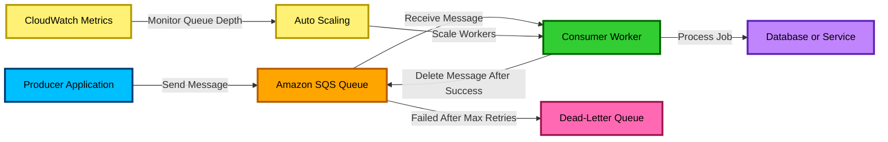

# Amazon SQS

## 1. Simple Explanation

**Amazon SQS**, or **Simple Queue Service**, is a managed AWS service used to store messages between applications.

Think of SQS as a **waiting line**.

One application sends a message to the queue, and another application reads and processes that message later.

This helps applications communicate without depending on each other to be available at the same time.

Example:

- An order service receives a customer order.
- It sends a message to SQS.
- A payment service, shipping service, or email service processes the message later.

SQS helps make systems more **reliable**, **scalable**, and **loosely coupled**.

---

## 2. Why It Exists

SQS exists to solve the problem of **direct dependency between services**.

Without SQS:

- Service A calls Service B directly.
- If Service B is slow or down, Service A may fail.
- Traffic spikes can overwhelm backend services.

With SQS:

- Service A sends messages to a queue.
- Service B processes messages when it is ready.
- Messages wait safely in the queue.
- Backend services can scale independently.

SQS is useful when you need:

- Asynchronous processing
- Decoupled microservices
- Reliable message delivery
- Buffering during traffic spikes
- Background job processing

---

## 3. Core Features

| Feature | Explanation |
|---|---|
| **Fully Managed Queue** | AWS manages the infrastructure. You do not manage servers. |
| **Standard Queue** | Offers very high throughput with at-least-once delivery and best-effort ordering. |
| **FIFO Queue** | Preserves message order and supports exactly-once processing. |
| **Message Retention** | Messages can stay in the queue for a configured time if not processed. |
| **Visibility Timeout** | Temporarily hides a message after it is received so another consumer does not process it immediately. |
| **Dead-Letter Queue** | Stores messages that fail processing multiple times. |
| **Long Polling** | Reduces empty responses and lowers cost by waiting for messages to arrive. |
| **Encryption** | Supports encryption using AWS-managed keys or AWS KMS keys. |
| **Access Control** | Uses IAM policies and queue policies to control who can send or receive messages. |

---

## 4. Important Sub-Topics

### Standard Queue

A **Standard Queue** is the default SQS queue type.

Key points:

- Nearly unlimited throughput
- At-least-once message delivery
- Best-effort ordering
- A message may occasionally be delivered more than once

Use Standard Queue when:

- Maximum throughput is more important than strict order
- Duplicate processing can be handled by the application
- Order does not matter

Example:

- Processing image uploads
- Sending emails
- Logging events
- Background jobs

---

### FIFO Queue

A **FIFO Queue** means **First-In-First-Out**.

Key points:

- Preserves exact message order
- Supports exactly-once processing
- Requires `.fifo` at the end of the queue name
- Uses **Message Group ID**
- Uses **Deduplication ID** to avoid duplicates

Use FIFO Queue when:

- Message order is important
- Duplicate processing must be prevented

Example:

- Bank transactions
- Inventory updates
- Order processing steps
- Payment workflows

---

### Visibility Timeout

**Visibility Timeout** is the amount of time a message is hidden after a consumer receives it.

Flow:

1. Consumer receives a message.
2. SQS hides the message from other consumers.
3. Consumer processes the message.
4. Consumer deletes the message.
5. If the message is not deleted before the timeout expires, it becomes visible again.

Important exam point:

- If processing takes longer than the visibility timeout, the message may be processed more than once.

Example:

If visibility timeout is **30 seconds**, but processing takes **60 seconds**, another consumer may receive the same message after 30 seconds.

---

### Dead-Letter Queue

A **Dead-Letter Queue**, or **DLQ**, stores messages that cannot be processed successfully.

A message is moved to the DLQ after it fails a configured number of times.

This number is called **maximum receive count**.

Use DLQ for:

- Debugging failed messages
- Preventing bad messages from blocking processing
- Separating failed work from normal work

Example:

If a message fails 5 times, send it to the DLQ for investigation.

---

### Short Polling vs Long Polling

| Polling Type | Explanation |
|---|---|
| **Short Polling** | SQS immediately returns a response, even if no messages are available. |
| **Long Polling** | SQS waits for messages before responding, reducing empty responses and cost. |

Exam tip:

Use **Long Polling** to reduce cost and improve efficiency.

---

### Message Retention

SQS can retain messages for a configured period.

Important points:

- Messages are stored until deleted or until retention expires.
- Default retention is commonly 4 days.
- Maximum retention is 14 days.

Exam tip:

If you need messages stored longer than 14 days, SQS alone is not the best solution. Consider Amazon S3, DynamoDB, or another storage service depending on the use case.

---

### Delay Queues

A **Delay Queue** postpones message delivery for a period of time.

Example:

A message is sent now but becomes available to consumers after 5 minutes.

Use cases:

- Retry later
- Delay background processing
- Wait before triggering a workflow

---

### Message Timers

A **Message Timer** delays an individual message.

Difference:

| Feature | Scope |
|---|---|
| **Delay Queue** | Applies delay to all messages in the queue |
| **Message Timer** | Applies delay to one specific message |

---

### SQS with Lambda

SQS commonly integrates with **AWS Lambda**.

Flow:

1. Messages are sent to SQS.
2. Lambda polls SQS.
3. Lambda processes messages in batches.
4. Successfully processed messages are deleted.
5. Failed messages can be retried or sent to a DLQ.

Important exam point:

SQS + Lambda is a common serverless pattern for asynchronous processing.

---

### SQS with Auto Scaling

SQS can be used with EC2 Auto Scaling.

Example:

- Queue depth increases.
- CloudWatch detects more messages.
- Auto Scaling launches more EC2 instances.
- More workers process messages.
- Queue depth decreases.

Important metric:

- **ApproximateNumberOfMessagesVisible**

This metric helps estimate how much work is waiting in the queue.

---

## 5. Architecture / Visual Diagram

---

## 6. Common Use Cases

### Decoupling Microservices

SQS allows services to communicate without calling each other directly.

Example:

- Order service sends a message.
- Inventory service processes it later.
- Email service sends confirmation later.

This improves reliability because each service can work independently.

---

### Background Job Processing

SQS is useful for tasks that do not need to happen immediately.

Examples:

- Sending emails
- Generating reports
- Resizing images
- Processing uploaded files

---

### Buffering Traffic Spikes

If many requests arrive at once, SQS can store messages until consumers are ready.

Example:

An ecommerce site receives thousands of orders during a flash sale. SQS buffers the orders so backend services are not overwhelmed.

---

### Retry Handling

If a consumer fails to process a message, the message can become visible again and be retried.

After too many failures, the message can move to a DLQ.

---

### Serverless Processing

SQS works well with Lambda for event-driven architectures.

Example:

- User uploads a file.
- Application sends a message to SQS.
- Lambda processes the file asynchronously.

---

## 7. Exam-Focused Notes

### Common Exam Scenarios

| Scenario | Best Answer |
|---|---|
| Decouple application components | SQS |
| Buffer traffic spikes | SQS |
| Process background jobs asynchronously | SQS |
| Need high throughput and order does not matter | SQS Standard Queue |
| Need strict ordering and deduplication | SQS FIFO Queue |
| Failed messages need investigation | Dead-Letter Queue |
| Reduce empty polling responses | Long Polling |
| Message becomes visible before processing finishes | Increase Visibility Timeout |
| Store messages longer than 14 days | Use another storage service, such as S3 or DynamoDB |

---

### Keywords That Suggest SQS

Look for these exam keywords:

- **Decouple**
- **Queue**
- **Asynchronous**
- **Buffer**
- **Background processing**
- **Retry**
- **Traffic spikes**
- **Loose coupling**
- **Message processing**
- **Worker fleet**

If the question says one application needs to send work to another application without waiting for immediate processing, SQS is usually a strong answer.

---

### Important Differences from Similar AWS Services

| Service | Main Purpose |
|---|---|
| **SQS** | Message queue for decoupling and asynchronous processing |
| **SNS** | Pub/sub notifications to many subscribers |
| **EventBridge** | Event bus for routing events between AWS services, SaaS apps, and custom apps |
| **Kinesis Data Streams** | Real-time streaming data processing |
| **Step Functions** | Workflow orchestration with state management |
| **Amazon MQ** | Managed message broker for existing protocols like RabbitMQ or ActiveMQ |

---

### Common Traps

#### Trap 1: Choosing SNS when a queue is needed

SNS pushes messages to subscribers.

SQS stores messages until consumers are ready.

If the question says **buffer**, **queue**, or **worker processing**, choose SQS.

---

#### Trap 2: Choosing Standard Queue when order matters

Standard Queue does not guarantee strict ordering.

If the question requires exact order, choose FIFO Queue.

---

#### Trap 3: Forgetting duplicate messages in Standard Queue

Standard Queue provides at-least-once delivery.

This means duplicate messages are possible.

Your application should be **idempotent**, meaning processing the same message more than once should not cause incorrect results.

---

#### Trap 4: Wrong visibility timeout

If messages are processed multiple times unexpectedly, the visibility timeout may be too short.

Increase the visibility timeout so consumers have enough time to finish processing.

---

#### Trap 5: Thinking SQS stores messages forever

SQS is not long-term storage.

Messages can be retained for a limited time only.

For long-term storage, use a service like S3 or DynamoDB.

---

## 8. Comparison Table

| Service | Pattern | Delivery Style | Ordering | Best For |
|---|---|---|---|---|
| **SQS Standard** | Queue | Pull-based | Best-effort | High-throughput background jobs |
| **SQS FIFO** | Queue | Pull-based | Strict ordering | Ordered and deduplicated processing |
| **SNS** | Pub/Sub | Push-based | No strict queue behavior | Fanout notifications |
| **EventBridge** | Event bus | Rule-based routing | Not mainly for queue ordering | Event-driven integration |
| **Kinesis** | Stream | Consumers read from stream | Ordering per shard | Real-time streaming analytics |
| **Step Functions** | Workflow | State transitions | Controlled workflow order | Multi-step business processes |
| **Amazon MQ** | Message broker | Broker protocols | Depends on broker | Migrating existing messaging apps |

---

## 9. Memory Hook

Think of **SQS as a restaurant order line**.

- Customers place orders.
- Orders wait in a queue.
- Kitchen workers process orders when ready.
- If an order fails too many times, it goes to the manager for review.

Memory trick:

**SQS = Simple Queue Service = Simple Waiting Line for Work**

Use SQS when work needs to wait safely until someone is ready to process it.

---

## 10. Quick Review

- SQS is a fully managed message queue.
- It helps decouple applications.
- It is used for asynchronous processing.
- Standard Queue gives high throughput but only best-effort ordering.
- FIFO Queue gives strict ordering and deduplication.
- Visibility Timeout hides a message while it is being processed.
- Messages must be deleted after successful processing.
- Dead-Letter Queues store failed messages.
- Long Polling reduces empty responses and lowers cost.
- SQS is commonly used with Lambda, EC2 workers, Auto Scaling, and CloudWatch.
- Choose SQS when exam questions mention queues, buffering, decoupling, retries, or background jobs.