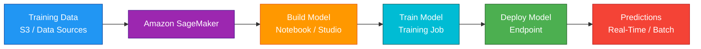
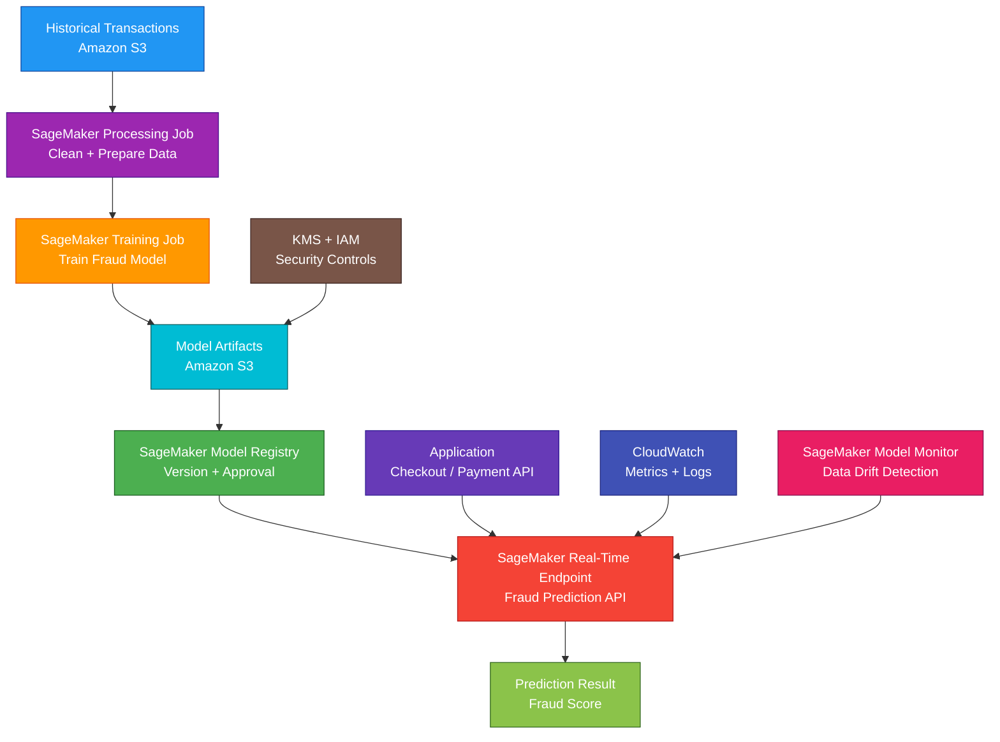

# Amazon SageMaker

<details>
<summary>

## 1. Definition

</summary>

### Simple Definition

Amazon SageMaker is AWS’s managed machine learning service.

It helps data scientists and developers build, train, deploy, and monitor machine learning models without managing all the underlying infrastructure.

### Memory Hook

SageMaker = Managed machine learning platform.

### Basic Idea

You bring data and machine learning code.

SageMaker helps with model development, training, tuning, deployment, and monitoring.



### Key Point

SageMaker is for machine learning workloads.

It is not a general-purpose compute service like EC2, Lambda, or ECS.

</details>

<details>
<summary>

## 2. What Problem Does It Solve?

</summary>

### Main Problem

SageMaker solves the problem of building and running machine learning workflows without manually managing all the ML infrastructure.

Machine learning usually needs many steps:

- Prepare data
- Build model
- Train model
- Tune model
- Deploy model
- Monitor model
- Retrain model

### Without SageMaker

You may need to manually manage:

- Notebook servers
- Training clusters
- GPU instances
- Distributed training
- Model artifacts
- Model hosting servers
- Auto Scaling for inference
- Monitoring
- Experiment tracking
- Deployment pipelines
- Security and access controls

### With SageMaker

AWS provides managed tools for the full ML lifecycle.

You focus more on the model, data, and business problem.

### Key Benefit

SageMaker makes machine learning easier, faster, and more scalable on AWS.

</details>

<details>
<summary>

## 3. Core Use Cases

</summary>

### Build Machine Learning Models

Use SageMaker notebooks or SageMaker Studio to develop ML code.

Examples:

- Python ML experiments
- Data exploration
- Feature engineering
- Model training scripts

### Train Models at Scale

Use SageMaker training jobs to train models using managed compute.

Examples:

- Train image classification model
- Train fraud detection model
- Train recommendation model
- Train forecasting model

### Deploy Real-Time Predictions

Use SageMaker endpoints to host models for real-time inference.

Example:

An application sends customer data to an endpoint and gets a fraud risk score immediately.

### Batch Predictions

Use batch transform for large offline prediction jobs.

Example:

Score millions of customer records overnight and store results in S3.

### Hyperparameter Tuning

Use automatic model tuning to find better model settings.

Example:

Try different learning rates, tree depths, or regularization values.

### ML Pipelines

Use SageMaker Pipelines to automate ML workflows.

Example:

Data processing → training → evaluation → model registration → deployment.

### Monitor Models

Use SageMaker Model Monitor to detect model quality or data drift problems after deployment.

### Use Built-In Algorithms

Use SageMaker built-in algorithms when you want AWS-provided ML algorithms without writing everything from scratch.

Examples:

- XGBoost
- Linear Learner
- K-Means
- Image Classification
- Object Detection
- DeepAR Forecasting

</details>

<details>
<summary>

## 4. Important Features for SAA

</summary>

### SageMaker Studio

SageMaker Studio is an integrated development environment for machine learning.

It helps with:

- Notebooks
- Experiments
- Data preparation
- Model training
- Model deployment
- Pipeline management
- Model monitoring

### Notebook Instances

Notebook instances provide managed Jupyter notebooks.

Use them for:

- Data exploration
- Experimentation
- Model development
- Running ML scripts interactively

### Training Job

A training job runs model training on managed infrastructure.

You define:

- Training data location
- Algorithm or training container
- Instance type
- Instance count
- Output S3 location
- IAM role

### Model Artifacts

Model artifacts are the trained model files.

They are usually stored in Amazon S3 after training.

Example:

```text
s3://my-ml-bucket/model-output/model.tar.gz
```

### Built-In Algorithms

SageMaker provides built-in algorithms for common ML problems.

Use built-in algorithms when you want faster setup and less custom ML code.

### Custom Training Containers

You can bring your own Docker container for training.

Use this when:

- You need custom libraries
- You need a specific ML framework
- You need custom training logic
- Built-in algorithms are not enough

### Common ML Frameworks

SageMaker supports common ML frameworks.

Examples:

- TensorFlow
- PyTorch
- Scikit-learn
- XGBoost
- Hugging Face

### Hyperparameter Tuning

Hyperparameters are settings that control model training.

Examples:

- Learning rate
- Batch size
- Number of trees
- Maximum depth
- Regularization value

SageMaker automatic model tuning tests different values to find a better model.

### Processing Jobs

Processing jobs run data processing workloads.

Use them for:

- Data cleaning
- Feature engineering
- Model evaluation
- Preprocessing
- Postprocessing

### Feature Store

SageMaker Feature Store stores, shares, and manages ML features.

A feature is an input used by a model.

Examples:

- Customer age
- Average order value
- Number of failed login attempts
- Last purchase date

### Model Registry

SageMaker Model Registry stores model versions and approval status.

Use it for:

- Model versioning
- Model governance
- Approval workflows
- Deployment tracking

### SageMaker Pipelines

SageMaker Pipelines automates ML workflows.

Common pipeline steps:

- Process data
- Train model
- Evaluate model
- Register model
- Deploy model

### Real-Time Endpoint

A real-time endpoint hosts a model for low-latency predictions.

Use it when applications need immediate predictions.

Example:

API calls endpoint and receives prediction in milliseconds or seconds.

### Batch Transform

Batch transform runs predictions on large datasets stored in S3.

Use it when predictions do not need to happen immediately.

Example:

Run nightly predictions for all customers.

### Asynchronous Inference

Asynchronous inference is useful for large requests or longer processing times.

It stores input and output in S3 and processes requests asynchronously.

### Serverless Inference

Serverless inference runs inference without managing instances.

Use it for intermittent or unpredictable inference traffic.

### Multi-Model Endpoint

A multi-model endpoint hosts multiple models on one endpoint.

Use it to reduce hosting cost when many models are not all used constantly.

### Model Monitor

SageMaker Model Monitor watches deployed models for problems.

It can detect:

- Data drift
- Model quality issues
- Bias drift
- Feature changes
- Input data changes

### Data Wrangler

SageMaker Data Wrangler helps prepare and transform data visually.

Use it for data cleaning and feature engineering.

### Ground Truth

SageMaker Ground Truth helps create labeled datasets.

Use it when training data needs labels.

Examples:

- Label images
- Label text
- Label objects
- Human-in-the-loop labeling

### JumpStart

SageMaker JumpStart provides prebuilt models, solutions, and examples.

Use it to quickly start with common ML use cases.

### Endpoint Auto Scaling

SageMaker endpoints can scale based on demand.

Common scaling metric:

- Invocations per instance

### Integration with S3

S3 is commonly used with SageMaker for:

- Training data
- Validation data
- Model artifacts
- Batch input
- Batch output
- Logs and reports

### Integration with ECR

SageMaker uses container images.

Amazon ECR stores custom training and inference container images.

### Integration with CloudWatch

CloudWatch stores SageMaker logs and metrics.

Use it to monitor:

- Training jobs
- Endpoint latency
- Endpoint errors
- CPU/GPU utilization
- Invocation count

</details>

<details>
<summary>

## 5. Security Model

</summary>

### IAM Permissions

IAM controls who can create and manage SageMaker resources.

Common permissions:

| Permission | Purpose |
|---|---|
| `sagemaker:CreateTrainingJob` | Start a training job |
| `sagemaker:CreateModel` | Create model resource |
| `sagemaker:CreateEndpoint` | Create endpoint |
| `sagemaker:InvokeEndpoint` | Call model endpoint |
| `sagemaker:CreateNotebookInstance` | Create notebook instance |
| `sagemaker:CreateProcessingJob` | Start processing job |
| `sagemaker:CreatePipeline` | Create ML pipeline |

### Execution Role

SageMaker uses an IAM execution role to access AWS resources.

Example permissions:

- Read training data from S3
- Write model artifacts to S3
- Pull container images from ECR
- Write logs to CloudWatch
- Use KMS keys
- Access VPC resources where configured

### Least Privilege

Give SageMaker only the permissions needed.

Bad example:

Giving SageMaker full administrator access.

Good example:

Allow SageMaker to read only a specific S3 training bucket and write only to a specific model output bucket.

### Encryption at Rest

SageMaker can encrypt data at rest using AWS KMS.

Common encrypted data:

- Training data in S3
- Model artifacts in S3
- Notebook storage volumes
- Training job storage volumes
- Endpoint storage
- Processing job outputs

### Encryption in Transit

Use HTTPS/TLS for API calls and endpoint access.

SageMaker service communication should be encrypted where supported.

### VPC Access

SageMaker resources can be configured to run inside a VPC.

Use VPC access when SageMaker needs private access to:

- RDS
- Redshift
- EFS
- Private S3 access through endpoints
- Internal APIs
- Private data sources

### VPC Endpoints

Use VPC endpoints to privately access AWS services.

Common endpoints:

- S3 gateway endpoint
- SageMaker API endpoint
- SageMaker runtime endpoint
- ECR endpoint
- CloudWatch Logs endpoint

### Network Isolation

Network isolation can restrict containers from making network calls.

Use it when training or inference code should not access external networks.

### Security Groups

When SageMaker runs in a VPC, security groups control network access.

Example:

Allow SageMaker training job to connect to a private data source.

### Secrets Management

Do not hardcode credentials in notebooks, scripts, or containers.

Use:

- IAM roles
- AWS Secrets Manager
- Systems Manager Parameter Store
- KMS encryption

### Notebook Security

Protect notebook environments carefully.

Best practices:

- Use IAM least privilege
- Avoid storing secrets in notebooks
- Restrict internet access when needed
- Use private subnets where appropriate
- Monitor user activity
- Stop unused notebooks

### CloudTrail Auditing

CloudTrail records SageMaker API activity.

Use it to audit:

- Training job creation
- Endpoint creation
- Endpoint invocation access
- Model deployment changes
- Notebook changes
- Pipeline changes

### Shared Responsibility

AWS is responsible for:

- SageMaker managed service infrastructure
- Managed training and hosting infrastructure
- Service availability
- Physical security
- Managed platform operations

You are responsible for:

- IAM permissions
- S3 bucket security
- KMS key policies
- VPC configuration
- Model code security
- Notebook access
- Data privacy
- Secrets handling
- Endpoint authorization
- Monitoring and responding to model issues

</details>

<details>
<summary>

## 6. High Availability / Durability Behavior

</summary>

### Availability

SageMaker is a managed AWS service.

AWS manages much of the infrastructure for training, hosting, and workflow execution.

### Regional Service

SageMaker resources are regional.

Examples:

- Training jobs
- Models
- Endpoints
- Pipelines
- Feature groups
- Notebook instances

### Multi-AZ Behavior

SageMaker endpoints can be designed for high availability across multiple Availability Zones.

AWS manages endpoint hosting infrastructure, but you should configure production endpoints appropriately.

### Endpoint Auto Scaling

Auto Scaling can add or remove endpoint capacity based on traffic.

This improves availability during traffic spikes.

### Endpoint Health

SageMaker monitors endpoint health and can replace unhealthy hosting instances.

### Model Artifact Durability

Model artifacts are usually stored in S3.

For SAA, remember:

S3 is the durable storage layer for trained model files.

### Training Job Behavior

Training jobs are not usually long-running production services.

If a training job fails, fix the issue and rerun it.

### Multi-Region Behavior

SageMaker does not automatically deploy every model globally.

For Multi-Region inference, deploy endpoints in multiple Regions and use:

- Route 53
- CloudFront where appropriate
- Global Accelerator where appropriate
- Application-level routing

### Disaster Recovery

For DR, protect:

- Training data in S3
- Model artifacts in S3
- Container images in ECR
- Pipeline definitions
- Feature Store data
- Model Registry entries
- Infrastructure as Code templates

### Batch Transform Reliability

Batch transform jobs process data from S3 and write results back to S3.

If a job fails, it can be corrected and rerun.

### Important Exam Point

SageMaker manages ML infrastructure, but durable data and artifacts should be stored in services like S3, ECR, and source control.

</details>

<details>
<summary>

## 7. Cost Optimization Options

</summary>

### Stop Unused Notebooks

Notebook instances can create cost while running.

Stop notebooks when not in use.

### Use the Right Instance Type

Choose instance types based on workload needs.

Examples:

- CPU instances for basic training
- GPU instances for deep learning
- Memory-optimized instances for large datasets

### Use Managed Spot Training

Managed Spot Training can reduce training cost by using spare EC2 capacity.

Good for:

- Training jobs that can tolerate interruption
- Long-running training
- Experimentation

### Use Serverless Inference for Spiky Traffic

Serverless inference can reduce cost for intermittent workloads.

Use it when traffic is unpredictable or idle for long periods.

### Use Batch Transform for Offline Predictions

If predictions do not need real-time response, batch transform can be cheaper than always-running endpoints.

### Use Multi-Model Endpoints

Multi-model endpoints can reduce cost when hosting many models with low or variable traffic.

### Right-Size Endpoints

Do not overprovision real-time endpoints.

Monitor:

- Invocation count
- Latency
- CPU/GPU utilization
- Memory
- Error rates

### Use Endpoint Auto Scaling

Auto Scaling helps match inference capacity to demand.

This avoids paying for too much idle endpoint capacity.

### Delete Unused Endpoints

Endpoints can be expensive because they run continuously.

Delete unused endpoints after testing.

### Use Efficient Data Formats

Use efficient formats for training data.

Examples:

- Parquet
- RecordIO where appropriate
- Optimized image formats
- Compressed datasets where useful

### Store Data Cost-Effectively

Use S3 lifecycle policies for old training data, logs, and model artifacts.

Move older data to cheaper S3 storage classes when appropriate.

### Track Experiments

Experiment tracking helps avoid repeated unnecessary training runs.

Use SageMaker Experiments or organized metadata.

</details>

<details>
<summary>

## 8. Common Exam Traps

</summary>

### SageMaker vs EC2

SageMaker is managed ML.

EC2 is general compute.

If the question asks for build, train, deploy, and monitor ML models, choose SageMaker.

### SageMaker vs Lambda

Lambda is for serverless functions.

SageMaker is for ML training and inference.

Use Lambda to call a SageMaker endpoint, not to train large ML models.

### SageMaker vs Comprehend

Comprehend is a managed natural language processing service.

SageMaker is for custom ML model development.

| Requirement | Choose |
|---|---|
| Prebuilt text analysis | Amazon Comprehend |
| Build custom ML model | SageMaker |

### SageMaker vs Rekognition

Rekognition is prebuilt image and video analysis.

SageMaker is for custom ML models.

### SageMaker vs Bedrock

Amazon Bedrock is for building with foundation models and generative AI using managed model APIs.

SageMaker is broader ML infrastructure for custom model building, training, hosting, and MLOps.

### Real-Time Endpoint vs Batch Transform

This is a common exam trap.

| Requirement | Choose |
|---|---|
| Immediate prediction | Real-time endpoint |
| Offline predictions on large dataset | Batch transform |

### Training Job vs Endpoint

Training job creates the model.

Endpoint serves predictions.

### Model Artifacts Are Usually in S3

SageMaker training outputs model artifacts to S3.

Do not treat the training instance as the durable storage layer.

### Endpoint Costs Continue While Running

Real-time endpoints cost money while deployed.

Delete unused endpoints.

### Built-In Algorithms Reduce Custom Work

If the question says use a managed built-in algorithm, SageMaker may be the answer.

### SageMaker Does Not Replace Data Lakes

SageMaker trains and hosts models.

S3, Glue, Athena, and Redshift are commonly used for data storage and analytics.

### Model Monitoring Is Separate from CloudWatch Metrics

CloudWatch monitors infrastructure and service metrics.

SageMaker Model Monitor checks model-related issues like data drift.

### VPC Access Needed for Private Data

If training needs private RDS or private data sources, configure SageMaker VPC access.

</details>

<details>
<summary>

## 9. Compare With Similar Services

</summary>

### Service Comparison Table

| Service | Main Purpose | Best For | Choose When |
|---|---|---|---|
| Amazon SageMaker | Managed ML platform | Build, train, deploy, and monitor custom ML models | You need full ML lifecycle tooling |
| Amazon Bedrock | Generative AI foundation model service | Building GenAI apps with managed foundation models | You need LLMs or foundation models through APIs |
| Amazon Comprehend | Managed NLP | Text analysis without training custom models | You need sentiment, entities, key phrases, language detection |
| Amazon Rekognition | Image/video analysis | Prebuilt computer vision | You need face, object, label, or content detection |
| Amazon Forecast | Time-series forecasting | Forecasting business metrics | You need managed forecasting with less custom ML |
| Amazon Textract | Document text extraction | Extract text, tables, and forms from documents | You need OCR and document extraction |
| AWS Glue | ETL and data preparation | Prepare and transform data | You need data processing before ML training |

### SageMaker vs Bedrock

| Feature | SageMaker | Bedrock |
|---|---|---|
| Main purpose | Custom ML lifecycle | Foundation model and GenAI app development |
| Training custom models | Yes | Focused on foundation model use/customization |
| Hosting models | Yes | Managed model API access |
| Best for | Custom ML and MLOps | LLMs and generative AI |
| Exam clue | Train/deploy custom model | Use foundation models via API |

### SageMaker vs Comprehend

| Feature | SageMaker | Comprehend |
|---|---|---|
| Main purpose | Build custom ML models | Managed NLP service |
| Requires ML code | Often yes | Usually no |
| Best for | Custom ML use cases | Text analysis |
| Example | Custom fraud model | Sentiment analysis |

### SageMaker vs Rekognition

| Feature | SageMaker | Rekognition |
|---|---|---|
| Main purpose | Custom ML platform | Managed computer vision |
| Model customization | Strong | Limited to service features/custom labels |
| Best for | Custom image ML model | Detect labels, faces, moderation |
| Example | Train custom defect model | Detect objects in photos |

### SageMaker vs Lambda

| Feature | SageMaker | Lambda |
|---|---|---|
| Main purpose | ML training and inference | Serverless function compute |
| Long training jobs | Yes | No |
| Model endpoints | Yes | No, but can call endpoints |
| Best for | ML lifecycle | Event-driven code |

### SageMaker vs EC2

| Feature | SageMaker | EC2 |
|---|---|---|
| Main purpose | Managed ML platform | General virtual servers |
| Infrastructure management | Lower | Higher |
| Built-in ML features | Yes | No |
| Best for | ML workflows | Custom server workloads |

### When to Choose SageMaker

Choose SageMaker when:

- You need to build custom ML models
- You need managed training jobs
- You need built-in ML algorithms
- You need GPU training infrastructure
- You need hyperparameter tuning
- You need real-time model endpoints
- You need batch predictions
- You need ML pipelines and model registry
- You need model monitoring and MLOps
- You want to avoid managing ML servers manually

</details>

<details>
<summary>

## 10. Mini Architecture Example

</summary>

### Scenario

A company wants to predict whether a customer transaction is fraudulent.

The model must be trained on historical transaction data and deployed for real-time predictions from an application.

### Architecture

Store historical transaction data in S3.

Use SageMaker Processing to clean and prepare the data.

Use SageMaker Training to train a fraud detection model.

Store model artifacts in S3.

Deploy the model to a SageMaker real-time endpoint.

The application calls the endpoint for fraud predictions.



### Why This Is Good

- S3 stores durable training data
- SageMaker Processing prepares the dataset
- SageMaker Training trains the ML model
- Model artifacts are stored in S3
- Model Registry tracks model versions and approvals
- Real-time endpoint provides immediate predictions
- Application can call the endpoint during transactions
- CloudWatch monitors endpoint metrics and logs
- Model Monitor detects data drift
- IAM and KMS help secure access and encryption

### Exam Answer Pattern

If the question says:

“Build, train, deploy, and monitor a custom machine learning model.”

Think:

Amazon SageMaker.

If the question says:

“Run immediate predictions from an application.”

Think:

SageMaker real-time endpoint.

If the question says:

“Run predictions on a large dataset stored in S3.”

Think:

SageMaker batch transform.

If the question says:

“Use managed generative AI foundation models through APIs.”

Think:

Amazon Bedrock.

### Final Memory Hook

SageMaker = Managed ML platform.

Studio = ML development environment.

Notebook = Interactive ML workspace.

Training job = Trains model.

Model artifact = Trained model file in S3.

Endpoint = Real-time predictions.

Batch transform = Offline predictions.

Processing job = Data prep and evaluation.

Feature Store = Store ML features.

Model Registry = Version and approve models.

Pipelines = Automate ML workflow.

Model Monitor = Detect drift.

Ground Truth = Data labeling.

Built-in algorithms = Less custom code.

ECR = Custom containers.

S3 = Training data and model artifacts.

CloudWatch = Logs and metrics.

</details>