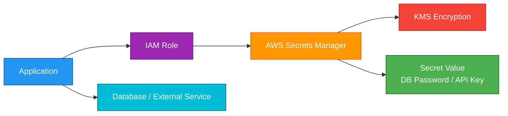
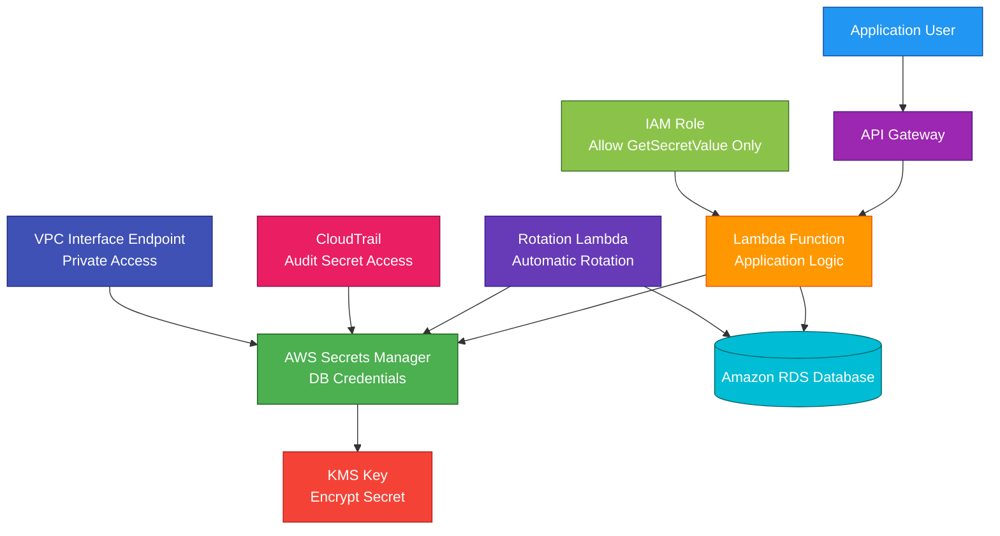

# AWS Secrets Manager

<details>
<summary>

## 1. Definition

</summary>

### Simple Definition

AWS Secrets Manager is a managed service for storing, retrieving, and rotating sensitive information.

Sensitive information includes:

- Database passwords
- API keys
- OAuth tokens
- Application credentials
- Third-party service secrets

### Memory Hook

Secrets Manager = Secure storage + automatic rotation for secrets.

### Basic Idea

Instead of hardcoding passwords in application code, store them in Secrets Manager.

Applications retrieve secrets securely at runtime using IAM permissions.



### Key Point

Secrets Manager helps keep secrets out of:

- Source code
- Git repositories
- Plaintext config files
- AMIs
- Container images
- Lambda environment variables without encryption controls

</details>

<details>
<summary>

## 2. What Problem Does It Solve?

</summary>

### Main Problem

Secrets Manager solves the problem of securely storing and rotating credentials used by applications.

### Without Secrets Manager

You may have risks such as:

- Passwords hardcoded in code
- Secrets committed to Git
- Manual password rotation
- Forgotten old credentials
- Secrets shared insecurely
- Applications using long-lived passwords
- Difficult auditing of secret access

### With Secrets Manager

Secrets are stored securely, encrypted with KMS, retrieved using IAM permissions, and can be rotated automatically.

### Key Benefit

Secrets Manager improves application security by centralizing secret storage and automating secret rotation.

</details>

<details>
<summary>

## 3. Core Use Cases

</summary>

### Database Credentials

Store database usernames and passwords.

Common databases:

- Amazon RDS
- Amazon Aurora
- Amazon Redshift
- Amazon DocumentDB
- Self-managed databases

### Automatic Secret Rotation

Automatically rotate database credentials on a schedule.

Example:

Rotate an RDS password every 30 days.

### API Keys

Store API keys for external services.

Examples:

- Payment provider keys
- Email service API keys
- Mapping API keys
- Monitoring tool tokens

### Application Secrets

Store application-level secrets.

Examples:

- JWT signing secrets
- OAuth client secrets
- Webhook signing secrets
- Encryption passphrases

### Lambda and Serverless Apps

Lambda functions can retrieve secrets from Secrets Manager at runtime.

This avoids hardcoding secrets in function code.

### Containerized Applications

ECS and EKS workloads can retrieve secrets securely.

Examples:

- ECS task pulls database password from Secrets Manager
- EKS pod retrieves API token using IAM-based access

### Cross-Account Secret Access

Secrets Manager supports resource-based policies.

This allows controlled sharing of secrets across AWS accounts.

</details>

<details>
<summary>

## 4. Important Features for SAA

</summary>

### Secret

A secret is the stored sensitive value.

A secret can contain:

- Plain text
- JSON key-value pairs
- Database credentials
- API tokens
- Certificates or keys where appropriate

### Secret Value Example

```json
{
  "username": "app_user",
  "password": "SuperSecretPassword123",
  "engine": "mysql",
  "host": "mydb.example.us-east-1.rds.amazonaws.com",
  "port": 3306,
  "dbname": "appdb"
}
```

### Encryption with KMS

Secrets Manager encrypts secrets at rest using AWS KMS.

You can use:

- AWS managed KMS key
- Customer managed KMS key

### Secret Retrieval

Applications retrieve secrets using the Secrets Manager API.

Common API call:

```text
GetSecretValue
```

### IAM-Based Access

IAM controls who or what can retrieve a secret.

Example:

A Lambda execution role can be allowed to read only one specific secret.

### Resource-Based Policies

Secrets can have resource-based policies.

Use them for:

- Cross-account access
- Organization-wide access patterns
- Restricting who can retrieve a secret

### Automatic Rotation

Secrets Manager can rotate secrets automatically.

Rotation commonly uses a Lambda function.

For supported AWS databases, AWS provides rotation templates.

### Rotation Lambda

A rotation Lambda updates the secret and the target system.

Example:

1. Create new database password.
2. Update the database user password.
3. Test the new password.
4. Mark the new secret version as current.

### Rotation Schedule

You can configure rotation on a schedule.

Example:

- Every 30 days
- Every 60 days
- Custom schedule

### Version Stages

Secrets Manager tracks secret versions using staging labels.

Important labels:

| Version Stage | Meaning |
|---|---|
| `AWSCURRENT` | Current active secret version |
| `AWSPREVIOUS` | Previous secret version |
| `AWSPENDING` | New version during rotation |

### Secret Versioning

When a secret is rotated, Secrets Manager creates a new version.

Version labels help applications use the correct version.

### RDS Integration

Secrets Manager integrates well with RDS and Aurora.

Common use:

- Store database credentials
- Rotate database passwords automatically
- Retrieve credentials from applications securely

### Multi-Region Secrets

Secrets Manager can replicate secrets to multiple AWS Regions.

Use this for:

- Disaster recovery
- Multi-Region applications
- Lower-latency secret access in another Region

### Secret Caching

Applications should cache secrets when appropriate.

This reduces:

- API calls
- Latency
- Cost
- Dependency on frequent secret retrieval

Important point:

Caching must respect rotation timing.

### CloudTrail Auditing

Secrets Manager API calls can be logged in AWS CloudTrail.

Use CloudTrail to audit actions such as:

- Secret creation
- Secret deletion
- Secret value retrieval
- Secret updates
- Rotation configuration changes

### VPC Interface Endpoint

Secrets Manager supports VPC interface endpoints using AWS PrivateLink.

This allows private access from a VPC without using the public internet.

### Recovery Window

When deleting a secret, Secrets Manager usually allows a recovery window.

This helps prevent accidental permanent deletion.

### Secret Replication

Secret replication can copy a secret to another Region.

This helps Multi-Region applications avoid depending on a single Region for secret retrieval.

</details>

<details>
<summary>

## 5. Security Model

</summary>

### IAM Permissions

IAM controls who can manage and retrieve secrets.

Common permissions:

| Permission | Purpose |
|---|---|
| `secretsmanager:CreateSecret` | Create a secret |
| `secretsmanager:GetSecretValue` | Retrieve secret value |
| `secretsmanager:PutSecretValue` | Store new secret value |
| `secretsmanager:UpdateSecret` | Update secret metadata or value |
| `secretsmanager:DeleteSecret` | Delete a secret |
| `secretsmanager:RotateSecret` | Configure or start rotation |
| `secretsmanager:DescribeSecret` | View secret metadata |

### Least Privilege

Give applications access only to the secrets they need.

Bad example:

Allowing all applications to read all secrets.

Good example:

Allowing one Lambda function to read only one database secret.

### Encryption at Rest

Secrets are encrypted at rest using AWS KMS.

Use customer managed KMS keys when you need more control over:

- Key policy
- Key rotation
- Audit requirements
- Cross-account access

### Encryption in Transit

Secrets Manager API calls use HTTPS.

This protects secrets while moving between AWS and the application.

### KMS Key Permissions

If using a customer managed KMS key, both IAM permissions and KMS key permissions must allow access.

Important exam point:

A user or role may have `secretsmanager:GetSecretValue`, but still fail if KMS denies decrypt access.

### Resource-Based Policies

Use secret resource policies carefully.

A bad resource policy can accidentally expose a secret to another account.

### Block Public Access for Secrets

Secrets Manager can help prevent overly broad public access in resource policies.

For exam purposes, avoid any design that exposes secrets publicly.

### Network Security

Use VPC interface endpoints for private access from VPC workloads.

This helps avoid routing secret retrieval traffic over the public internet.

### Rotation Security

Automatic rotation reduces risk from long-lived credentials.

Rotation is especially useful for:

- Database passwords
- Service accounts
- Application credentials
- Third-party API keys where supported by custom rotation logic

### Secrets in Logs

Never log secret values.

Be careful with:

- Lambda logs
- Application logs
- Debug output
- Error messages
- CI/CD logs

### Shared Responsibility

AWS is responsible for:

- Secrets Manager infrastructure
- Secret encryption integration
- Managed service availability
- Physical security
- API security infrastructure

You are responsible for:

- IAM permissions
- KMS key policies
- Secret naming and organization
- Rotation configuration
- Application retrieval logic
- Avoiding secret exposure in logs
- Resource policies
- VPC endpoint policies
- Deleting unused secrets

</details>

<details>
<summary>

## 6. High Availability / Durability Behavior

</summary>

### Availability

Secrets Manager is a managed regional AWS service.

AWS manages the service infrastructure and availability.

### Regional Behavior

Secrets are created in a specific AWS Region.

Applications should retrieve secrets from the Region where the secret exists.

### Multi-AZ Behavior

Secrets Manager is managed by AWS across its regional infrastructure.

You do not configure Multi-AZ manually.

### Multi-Region Behavior

For Multi-Region applications, replicate secrets to other Regions.

This helps applications in another Region retrieve secrets locally.

### Secret Replication

Multi-Region secret replication can help with:

- Regional disaster recovery
- Multi-Region failover
- Lower-latency access
- Application resilience

### Durability

Secrets Manager stores secret metadata and encrypted secret values as part of a managed AWS service.

For SAA, focus on:

- KMS encryption
- Versioning
- Recovery window
- Multi-Region replication
- CloudTrail auditing

### Rotation Resilience

During rotation, version labels help avoid breaking applications.

Important labels:

- `AWSCURRENT`
- `AWSPREVIOUS`
- `AWSPENDING`

If rotation fails, Secrets Manager can keep the previous working version.

### Application Resilience

Applications should handle secret retrieval failures gracefully.

Good practices:

- Cache secrets temporarily
- Retry with backoff
- Avoid retrieving secrets on every request
- Refresh secrets safely after rotation

### Important Exam Point

Secrets Manager protects and rotates secrets, but your application must still handle retries, caching, and database connection refresh after rotation.

</details>

<details>
<summary>

## 7. Cost Optimization Options

</summary>

### Delete Unused Secrets

Secrets Manager charges for stored secrets.

Delete secrets that are no longer needed.

### Use Secret Caching

Frequent API calls can add cost and latency.

Use client-side caching where appropriate.

### Avoid Storing Too Many Duplicate Secrets

Do not create many duplicate secrets for the same credential unless isolation requires it.

Use naming standards and tagging.

### Use Parameter Store When Rotation Is Not Needed

AWS Systems Manager Parameter Store can be cheaper for simple configuration values or secrets that do not need automatic rotation.

Exam tip:

If automatic rotation is required, choose Secrets Manager.

### Use Rotation Only Where Needed

Automatic rotation improves security but may invoke Lambda and add operational cost.

Use it for important credentials, especially database passwords.

### Clean Up Old Rotation Lambdas

Rotation functions and related resources can add cost or operational clutter.

Remove unused rotation resources.

### Use Tags

Tag secrets by:

- Application
- Environment
- Owner
- Cost center
- Data classification

This helps identify unused or duplicate secrets.

### Use Multi-Region Replication Carefully

Replicated secrets improve resilience but can add cost.

Replicate only secrets needed by Multi-Region workloads.

### Reduce Unnecessary Retrievals

Avoid retrieving secrets repeatedly inside tight loops or every request.

Better pattern:

- Retrieve once
- Cache in memory
- Refresh periodically or after failure

### Monitor Usage

Use CloudTrail, CloudWatch, and cost reports to identify:

- Unused secrets
- Overused secrets
- Unexpected secret access
- Excessive API calls

</details>

<details>
<summary>

## 8. Common Exam Traps

</summary>

### Secrets Manager vs Parameter Store

This is the biggest exam trap.

| Requirement | Choose |
|---|---|
| Automatic secret rotation | Secrets Manager |
| Simple config values | Systems Manager Parameter Store |
| Secure strings with lower cost | Parameter Store SecureString |
| Database credential rotation | Secrets Manager |

### Secrets Manager Is Not IAM

IAM controls access to AWS resources.

Secrets Manager stores and manages secret values.

They work together.

### Secrets Manager Is Not KMS

KMS manages encryption keys.

Secrets Manager stores secrets and uses KMS to encrypt them.

### KMS Permissions Can Block Access

Even if IAM allows secret access, KMS can still deny decrypt access.

Check both Secrets Manager permissions and KMS key policy.

### Do Not Hardcode Secrets

If the exam asks how to avoid hardcoded credentials, use Secrets Manager or Parameter Store.

If rotation is required, choose Secrets Manager.

### Rotation Needs Target Support

Secrets Manager can rotate secrets, but the target system must also be updated.

For custom services, you may need a custom Lambda rotation function.

### Applications Must Refresh Rotated Secrets

If an application caches a secret forever, rotation may break connections.

Applications should refresh secrets when needed.

### Secrets Should Not Be Public

Never use a resource policy that allows public access to secrets.

### Secret Retrieval Should Be Audited

Use CloudTrail to audit Secrets Manager API activity.

### Environment Variables Can Still Leak

Putting plaintext secrets directly in environment variables can expose them through logs, debugging, or misconfiguration.

Better:

Retrieve from Secrets Manager at runtime or inject securely through supported integrations.

### Secret Deletion Has Recovery Window

Deleting a secret may not immediately remove it permanently.

Secrets can often be recovered during the recovery window.

### Multi-Region Replication Is Not Automatic for Every Secret

You must configure replication if a secret is needed in another Region.

</details>

<details>
<summary>

## 9. Compare With Similar Services

</summary>

### Service Comparison Table

| Service | Main Purpose | Best For | Choose When |
|---|---|---|---|
| AWS Secrets Manager | Store and rotate secrets | Database passwords and API keys | You need managed secret rotation |
| Systems Manager Parameter Store | Store parameters and simple secrets | App config and lower-cost secure strings | You need config storage or simple encrypted parameters |
| AWS KMS | Key management | Encrypt/decrypt data keys and secrets | You need to manage encryption keys |
| IAM | Access control | Permissions and roles | You need to control who can access AWS resources |
| AWS Certificate Manager | TLS certificates | HTTPS certificates | You need SSL/TLS certificates |
| Amazon Cognito | User authentication | App user sign-up and sign-in | You need identity for web/mobile users |

### Secrets Manager vs Parameter Store

| Feature | Secrets Manager | Parameter Store |
|---|---|---|
| Main purpose | Secrets lifecycle management | Configuration and parameter storage |
| Automatic rotation | Yes | No native automatic rotation like Secrets Manager |
| Common use | Database credentials, API keys | App config, simple secrets |
| Cost | Higher | Often lower |
| KMS encryption | Yes | Yes for SecureString |
| Exam clue | Rotate secrets automatically | Store config or simple secure values |

### Secrets Manager vs KMS

| Feature | Secrets Manager | KMS |
|---|---|---|
| Main purpose | Store secret values | Manage encryption keys |
| Stores passwords/API keys | Yes | No, not directly as a secret store |
| Encrypts secrets | Uses KMS | Provides keys |
| Best for | Secret retrieval and rotation | Key control and cryptographic operations |

### Secrets Manager vs IAM

| Feature | Secrets Manager | IAM |
|---|---|---|
| Main purpose | Store sensitive values | Manage access permissions |
| Stores credentials | Yes | IAM creates identities and roles |
| Controls access | Through IAM/resource policies | Yes |
| Common use together | IAM role reads secret | IAM role grants permission |

### Secrets Manager vs ACM

| Feature | Secrets Manager | ACM |
|---|---|---|
| Main purpose | Store secrets | Manage TLS certificates |
| Rotation | Secret rotation | Certificate renewal |
| Best for | Passwords, API keys, tokens | HTTPS certificates |
| Exam clue | Database password | SSL/TLS certificate |

### Secrets Manager vs Cognito

| Feature | Secrets Manager | Cognito |
|---|---|---|
| Main purpose | Store app secrets | Authenticate app users |
| Best for | Backend credentials | User sign-up/sign-in |
| Example | Store payment API key | Let users log in to mobile app |

### When to Choose Secrets Manager

Choose Secrets Manager when:

- You need to store sensitive credentials
- You need automatic secret rotation
- You need database password rotation
- You need secrets encrypted with KMS
- You need secure runtime retrieval by applications
- You need CloudTrail audit of secret access
- You need cross-account secret sharing with resource policies
- You need Multi-Region secret replication

</details>

<details>
<summary>

## 10. Mini Architecture Example

</summary>

### Scenario

A company runs an application on AWS Lambda.

The Lambda function connects to an Amazon RDS database.

The company does not want the database password hardcoded in the Lambda code or environment variables.

The database password must rotate automatically.

### Architecture

Store the RDS database credentials in AWS Secrets Manager.

Enable automatic rotation using a Lambda rotation function.

Allow the application Lambda execution role to retrieve only that secret.

The application retrieves the secret at runtime and connects to RDS.



### Why This Is Good

- Database password is not hardcoded
- Secret is encrypted with KMS
- Lambda retrieves the secret securely at runtime
- IAM limits access to only the required secret
- Automatic rotation reduces credential risk
- Rotation Lambda updates both Secrets Manager and RDS
- CloudTrail audits secret access
- VPC endpoint can keep secret retrieval traffic private
- RDS remains the durable database source

### Exam Answer Pattern

If the question says:

“Store database credentials securely and rotate them automatically.”

Think:

AWS Secrets Manager.

If the question says:

“Store application configuration values or simple encrypted parameters.”

Think:

Systems Manager Parameter Store.

If the question says:

“Control encryption keys used to encrypt secrets.”

Think:

AWS KMS.

If the question says:

“Grant the application permission to retrieve only one secret.”

Think:

IAM least privilege policy.

### Final Memory Hook

Secrets Manager = Store and rotate secrets.

Parameter Store = Store config and simple secure parameters.

KMS = Encrypt keys, not a secret database.

IAM = Controls who can access secrets.

`GetSecretValue` = Retrieve secret.

Rotation Lambda = Updates secret and target system.

`AWSCURRENT` = Active secret version.

`AWSPREVIOUS` = Old secret version.

CloudTrail = Audit secret API activity.

VPC endpoint = Private access to Secrets Manager.

</details>