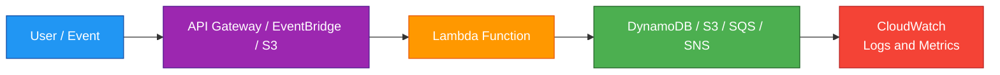
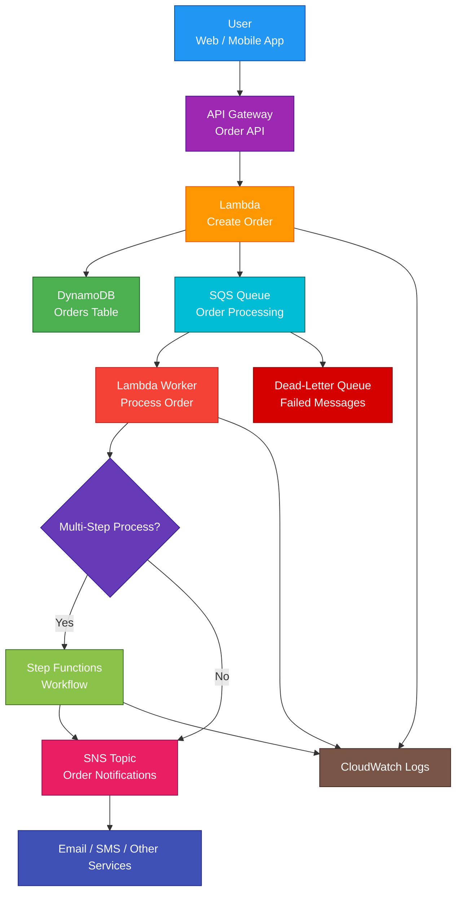

# AWS Serverless

## 1. Definition

### Simple Definition

AWS Serverless is an architecture style where AWS manages the servers, scaling, patching, and infrastructure operations for you.

You focus on writing code, connecting managed services, and building business logic.

### Memory Hook

Serverless = No server management.

### Important Point

Serverless does not mean there are no servers.

It means you do not manage the servers.

### Basic Idea

Serverless applications are usually event-driven.

An event happens, a service reacts, and AWS automatically scales the backend.

### Common AWS Serverless Services

| Service | Serverless Role |
|---|---|
| Lambda | Run code without servers |
| API Gateway | Build managed APIs |
| DynamoDB | Serverless NoSQL database |
| S3 | Serverless object storage |
| SNS | Pub/sub notifications |
| SQS | Message queue |
| EventBridge | Event routing |
| Step Functions | Workflow orchestration |
| Cognito | User authentication |
| AppSync | Managed GraphQL APIs |
| Fargate | Serverless containers |
| Aurora Serverless | Auto-scaling relational database |

## 2. What Problem Does It Solve?

### Main Problem

Serverless solves the problem of managing infrastructure for applications that need to scale, react to events, and run cost-effectively.

### Without Serverless

You may need to manage:

- EC2 instances
- Operating system patches
- Server scaling
- Load balancers
- Runtime installation
- Database capacity planning
- Queue infrastructure
- Monitoring agents
- High availability setup

### With Serverless

AWS manages most infrastructure tasks.

You focus on:

- Code
- Data model
- Events
- Permissions
- Service integrations
- Application logic

### Key Benefit

Serverless reduces operational work and automatically scales based on demand.

### Simple Example

Instead of running an EC2 server all day to process images, you can use Lambda to run only when an image is uploaded to S3.

## 3. Core Use Cases

### Serverless APIs

Use API Gateway plus Lambda to build REST or HTTP APIs.

Example:

- User calls API Gateway
- API Gateway invokes Lambda
- Lambda reads/writes DynamoDB

### Event-Driven Processing

Use serverless services to react to events.

Examples:

- S3 upload triggers Lambda
- DynamoDB Streams trigger Lambda
- EventBridge rule triggers a workflow
- SNS message notifies subscribers

### Background Jobs

Use SQS with Lambda for asynchronous background processing.

Examples:

- Order processing
- Email sending
- Report generation
- File conversion

### Scheduled Tasks

Use EventBridge Scheduler or EventBridge rules to run tasks on a schedule.

Examples:

- Daily cleanup
- Hourly sync
- Weekly report

### Real-Time Applications

Use WebSocket API Gateway, AppSync subscriptions, or IoT services for real-time use cases.

Examples:

- Chat apps
- Live dashboards
- Real-time notifications

### Data Processing

Use Lambda, S3, SQS, Step Functions, and Glue for serverless data workflows.

Examples:

- Process uploaded files
- Transform records
- Move data between services
- Trigger analytics pipelines

### Authentication for Apps

Use Cognito for serverless user sign-up, sign-in, and token-based authentication.

## 4. Important Features for SAA

### Event-Driven Architecture

Serverless applications often react to events.

Examples of events:

- HTTP request
- File uploaded to S3
- Message added to SQS
- Record changed in DynamoDB
- Scheduled time reached
- EventBridge event received

### Lambda

Lambda runs code without managing servers.

Important points:

- Maximum runtime is 15 minutes
- Automatically scales
- Supports synchronous, asynchronous, and poll-based invocations
- Uses IAM execution roles
- Logs to CloudWatch
- Can run inside or outside a VPC

### API Gateway

API Gateway provides a managed front door for APIs.

Common uses:

- REST APIs
- HTTP APIs
- WebSocket APIs
- Authentication
- Throttling
- Usage plans
- Request validation

### DynamoDB

DynamoDB is a serverless NoSQL database.

Important points:

- Low-latency key-value access
- On-Demand or Provisioned capacity
- Multi-AZ by default
- Global Tables for Multi-Region
- Streams for event-driven processing
- PITR for recovery

### S3

S3 is serverless object storage.

Common serverless uses:

- Static website assets
- File uploads
- Data lake storage
- Event trigger source
- Backup storage

### SQS

SQS is a serverless message queue.

Use it to decouple producers and consumers.

Important points:

- Standard queue for high throughput
- FIFO queue for ordering and exactly-once processing
- Dead-letter queues for failed messages
- Lambda can poll SQS automatically

### SNS

SNS is a pub/sub messaging service.

Use it to fan out messages to multiple subscribers.

Examples:

- SNS to SQS
- SNS to Lambda
- SNS to email
- SNS to HTTP endpoint

### EventBridge

EventBridge routes events between AWS services, SaaS apps, and custom applications.

Use it for:

- Event buses
- Scheduled events
- Application integration
- Event-driven automation

### Step Functions

Step Functions coordinates multi-step workflows.

Use it when you need:

- State management
- Retries
- Error handling
- Branching
- Parallel steps
- Human approval workflows
- Long-running orchestration

### Cognito

Cognito provides user authentication for web and mobile apps.

Use it for:

- User sign-up
- User sign-in
- JWT tokens
- Social login
- Federated identity

### AppSync

AppSync is a managed GraphQL API service.

Use it when:

- Clients need GraphQL
- Real-time subscriptions are needed
- Multiple data sources are used
- Offline/mobile sync is helpful

### Fargate

Fargate is serverless container compute.

Use it when:

- You want containers without managing EC2
- Lambda timeout or runtime model does not fit
- You need long-running containerized services

### Aurora Serverless

Aurora Serverless is an auto-scaling relational database option.

Use it when:

- You need SQL
- Workload is variable or unpredictable
- You want relational database features with less capacity management

### SAM

AWS Serverless Application Model, or SAM, is a framework for defining and deploying serverless applications.

It is commonly used with:

- Lambda
- API Gateway
- DynamoDB
- EventBridge
- Step Functions

### Serverless Application Pattern

A common serverless pattern is:

| Layer | Example Service |
|---|---|
| API | API Gateway |
| Compute | Lambda |
| Database | DynamoDB |
| Messaging | SQS / SNS |
| Events | EventBridge |
| Workflow | Step Functions |
| Monitoring | CloudWatch |

## 5. Security Model

### IAM Permissions

IAM is central to serverless security.

Each service should have only the permissions it needs.

Examples:

| Component | IAM Role Example |
|---|---|
| Lambda function | Permission to read one DynamoDB table |
| API Gateway | Permission to invoke Lambda |
| EventBridge | Permission to start Step Functions |
| Step Functions | Permission to invoke specific Lambda functions |

### Least Privilege

Use least privilege for every function and service.

Bad example:

Giving every Lambda function `AdministratorAccess`.

Good example:

Giving one Lambda function only `dynamodb:PutItem` on one table.

### Lambda Execution Role

A Lambda execution role defines what the function can do.

Example:

A Lambda function that writes logs and reads DynamoDB needs:

- CloudWatch Logs permissions
- DynamoDB read permissions

### Resource-Based Policies

Some serverless services use resource-based policies.

Examples:

- Lambda resource policy allows API Gateway to invoke Lambda
- SQS queue policy allows SNS to send messages
- S3 bucket policy controls object access

### Authentication

Common serverless authentication options:

| Need | Service |
|---|---|
| User login | Cognito |
| API auth | API Gateway authorizers |
| AWS service access | IAM roles |
| Custom auth logic | Lambda authorizer |
| JWT validation | HTTP API JWT authorizer |

### Encryption at Rest

Most serverless services support encryption at rest.

Examples:

- DynamoDB encryption
- S3 encryption
- SQS encryption
- SNS encryption
- CloudWatch Logs encryption
- Step Functions encryption options
- KMS customer managed keys where needed

### Encryption in Transit

Use HTTPS/TLS for traffic between clients and AWS services.

Examples:

- HTTPS API Gateway endpoint
- HTTPS CloudFront distribution
- TLS database connections
- AWS API calls over HTTPS

### VPC Access

Some serverless compute can run inside a VPC.

Examples:

- Lambda in a VPC
- Fargate tasks in private subnets

Use VPC access when serverless workloads need private resources such as:

- RDS
- Aurora
- ElastiCache
- Internal load balancers

### Secrets Management

Do not hardcode secrets in code or environment variables.

Use:

- AWS Secrets Manager
- Systems Manager Parameter Store
- KMS encryption

### Shared Responsibility

AWS is responsible for:

- Server infrastructure
- Managed service scaling
- Physical security
- Service availability
- Managed runtime infrastructure

You are responsible for:

- IAM permissions
- Application code
- Data protection
- Input validation
- Secrets handling
- API authentication
- Logging and monitoring
- Service configuration
- Cost controls

## 6. High Availability / Durability Behavior

### Availability

Most AWS serverless services are managed and highly available by default.

You do not configure servers or clusters manually.

### Multi-AZ Behavior

Many serverless services are designed across multiple Availability Zones within a Region.

Examples:

- Lambda
- DynamoDB
- S3
- SQS
- SNS
- API Gateway
- Step Functions
- EventBridge

### Regional Behavior

Most serverless services are regional.

Examples:

- Lambda functions are regional
- DynamoDB tables are regional unless using Global Tables
- API Gateway APIs are regional unless using edge-optimized options
- SQS queues are regional

### Multi-Region Behavior

For Multi-Region serverless architectures, deploy resources in multiple Regions.

Common options:

- DynamoDB Global Tables
- S3 Cross-Region Replication
- Route 53 failover
- CloudFront
- Global Accelerator
- EventBridge global endpoints
- Separate Lambda/API deployments per Region

### Fault Tolerance

Serverless applications improve fault tolerance by using managed services and decoupling.

Common patterns:

- SQS buffers spikes
- DLQs capture failed messages
- Step Functions retries failed steps
- EventBridge routes events reliably
- DynamoDB scales automatically
- Lambda retries asynchronous failures

### Durability

Durability depends on the service.

| Service | Durability Role |
|---|---|
| S3 | Highly durable object storage |
| DynamoDB | Durable NoSQL database |
| SQS | Durable message storage until processed |
| SNS | Message delivery fanout |
| Lambda | Compute, not storage |
| Step Functions | Workflow state management |

### Stateless Compute

Lambda and Fargate tasks should usually be stateless.

Store durable data in:

- S3
- DynamoDB
- RDS/Aurora
- EFS
- SQS

### Failure Handling

Common serverless failure handling tools:

- Lambda retries
- Dead-letter queues
- Lambda destinations
- SQS redrive policy
- Step Functions retry/catch
- CloudWatch alarms
- EventBridge rules

## 7. Cost Optimization Options

### Pay Per Use

Serverless services often charge based on usage.

Examples:

| Service | Common Pricing Factor |
|---|---|
| Lambda | Requests and duration |
| API Gateway | API calls and data transfer |
| DynamoDB | Reads, writes, storage |
| SQS | Requests |
| SNS | Publishes and deliveries |
| Step Functions | State transitions |
| S3 | Storage and requests |

### Reduce Lambda Duration

Shorter Lambda execution usually means lower cost.

Ways to reduce duration:

- Optimize code
- Reuse SDK clients
- Reduce package size
- Avoid unnecessary network calls
- Tune memory setting

### Tune Lambda Memory

Lambda memory affects CPU.

Sometimes increasing memory reduces runtime enough to lower total cost.

### Use SQS to Smooth Spikes

SQS can buffer traffic spikes.

This prevents downstream systems from scaling too aggressively or failing.

### Choose DynamoDB Capacity Mode Carefully

| Workload | Better Option |
|---|---|
| Unpredictable traffic | On-Demand |
| Predictable traffic | Provisioned with Auto Scaling |

### Avoid Overusing Step Functions for Tiny Workflows

Step Functions is excellent for orchestration, but every state transition can add cost.

Use it when workflow visibility, retries, and state management are valuable.

### Use API Gateway Type Carefully

HTTP APIs are usually cheaper and lower latency than REST APIs.

Use REST APIs only when you need advanced REST API features.

### Set Log Retention

CloudWatch Logs can grow over time.

Set retention periods for:

- Lambda logs
- API Gateway logs
- Step Functions logs
- ECS/Fargate logs

### Use Event Filtering

Filter events before invoking compute when possible.

Examples:

- EventBridge event patterns
- Lambda event source filters
- S3 event prefixes/suffixes

### Avoid Idle Resources

Serverless reduces idle compute cost, but some resources can still create cost.

Examples:

- Provisioned Concurrency
- DynamoDB provisioned capacity
- Step Functions Express/Standard usage
- NAT Gateway for private Lambda
- Aurora Serverless capacity
- API Gateway cache

## 8. Common Exam Traps

### Serverless Does Not Mean No Servers Exist

AWS still runs servers.

You just do not manage them.

### Lambda Has a 15-Minute Timeout

If a workload runs longer than 15 minutes, Lambda may not fit.

Consider:

- ECS/Fargate
- EC2
- AWS Batch
- Step Functions with smaller steps

### Lambda Is Stateless

Do not store important data only in Lambda memory or `/tmp`.

Use durable services like S3, DynamoDB, or RDS.

### API Gateway Timeout Trap

Even though Lambda can run up to 15 minutes, API Gateway has shorter integration timeout limits.

For long-running API requests, use async processing with SQS or Step Functions.

### SQS vs SNS

| Service | Purpose |
|---|---|
| SQS | Queue messages for one or more consumers |
| SNS | Publish messages to many subscribers |

### Step Functions vs Lambda

Step Functions coordinates workflows.

Lambda runs code.

Use Step Functions when the process has multiple steps, retries, branching, or state.

### EventBridge vs SNS

EventBridge is better for event routing and filtering across services and applications.

SNS is better for pub/sub fanout notifications.

### DynamoDB Is Not Relational

DynamoDB is NoSQL.

If the question requires SQL joins or relational constraints, choose Aurora or RDS.

### Serverless Can Still Need VPC Design

Lambda or Fargate may need VPC access for private databases.

Private subnet workloads may need NAT Gateway or VPC endpoints for outbound AWS service access.

### Cold Starts Can Affect Latency

Lambda cold starts can add latency.

For latency-sensitive workloads, consider:

- Provisioned Concurrency
- Smaller packages
- Efficient initialization
- Alternative compute such as Fargate for long-running services

### Permissions Are Often the Issue

Many serverless problems are IAM-related.

Check:

- Lambda execution role
- Resource policy
- SQS queue policy
- SNS topic policy
- KMS key policy
- API Gateway invoke permission

### Serverless Is Not Always Cheapest

Serverless is cost-effective for variable workloads.

For constant high-throughput workloads, EC2, ECS on EC2, or reserved capacity may be cheaper.

## 9. Compare With Similar Services

### Service Comparison Table

| Service / Pattern | Main Purpose | Best For | Choose When |
|---|---|---|---|
| Serverless | Managed event-driven architecture | Low-ops, scalable apps | You want AWS to manage infrastructure |
| EC2 | Virtual machines | Full server control | You need OS-level control |
| ECS/Fargate | Serverless containers | Container apps without EC2 management | You need containers, not functions |
| Lambda | Serverless functions | Event-driven short tasks | You need code execution without servers |
| Elastic Beanstalk | Managed app platform | Traditional app deployment | You want easy deployment but still EC2-based |
| EKS | Kubernetes | Kubernetes workloads | You need Kubernetes APIs and tooling |

### Lambda vs Fargate

| Feature | Lambda | Fargate |
|---|---|---|
| Compute model | Functions | Containers |
| Runtime | Max 15 minutes | Long-running supported |
| Best for | Event-driven tasks | Containerized services |
| Scaling | Per invocation | Per task/service |
| Server management | None | None |

### Serverless vs EC2

| Feature | Serverless | EC2 |
|---|---|---|
| Server management | AWS manages | You manage |
| Scaling | Mostly automatic | You configure |
| Cost model | Pay per use | Pay for instance runtime |
| Control | Less OS control | Full OS control |
| Best for | Event-driven apps | Custom long-running servers |

### API Gateway vs ALB

| Feature | API Gateway | ALB |
|---|---|---|
| Main purpose | API management | Load balancing |
| Serverless fit | Very strong with Lambda | Strong with ECS/EC2/Lambda |
| API keys/usage plans | Yes | No |
| Throttling | Strong API-level throttling | More limited |
| Best for | Managed APIs | Web app traffic distribution |

### DynamoDB vs Aurora Serverless

| Feature | DynamoDB | Aurora Serverless |
|---|---|---|
| Database type | NoSQL | Relational |
| Query style | Key-value/document | SQL |
| Scaling | Serverless table scaling | Auto-scaling relational capacity |
| Best for | Massive-scale simple access patterns | Relational workloads with variable demand |
| Exam clue | NoSQL, low latency | SQL, MySQL/PostgreSQL compatible |

### SNS vs SQS vs EventBridge

| Service | Best For | Choose When |
|---|---|---|
| SNS | Fanout notifications | One event should notify many subscribers |
| SQS | Queue buffering | One system should process messages reliably |
| EventBridge | Event routing | Route/filter events between services and apps |

### When to Choose Serverless

Choose serverless when:

- You want minimal server management
- Traffic is variable or unpredictable
- You need automatic scaling
- You are building event-driven applications
- You want pay-per-use pricing
- You need quick development and deployment
- You can design stateless compute
- Managed services fit the workload

## 10. Mini Architecture Example

### Scenario

A company wants to build a serverless order-processing system.

Users place orders through an API.

Orders must be stored, processed asynchronously, and notifications must be sent after processing.

### Architecture

Use API Gateway for the API.

Use Lambda for business logic.

Use DynamoDB for order storage.

Use SQS for asynchronous processing.

Use SNS for notifications.

Use Step Functions if the order process has multiple steps.

### Why This Is Good

- API Gateway provides a managed API endpoint
- Lambda runs code without servers
- DynamoDB stores orders with low latency
- SQS decouples order creation from order processing
- Lambda workers scale with queue depth
- DLQ captures failed messages
- SNS sends notifications to multiple subscribers
- Step Functions can coordinate complex workflows
- CloudWatch provides logs and metrics
- The architecture scales without managing servers

### Exam Answer Pattern

If the question says:

“Build an event-driven application with minimal server management and automatic scaling.”

Think:

Serverless architecture.

If the question says:

“Run code in response to events.”

Think:

Lambda.

If the question says:

“Decouple processing and handle traffic spikes.”

Think:

SQS.

If the question says:

“Fan out one event to many subscribers.”

Think:

SNS.

If the question says:

“Coordinate a multi-step workflow with retries and branching.”

Think:

Step Functions.

### Final Memory Hook

Serverless means AWS manages the servers.

Lambda runs code.

API Gateway exposes APIs.

DynamoDB stores NoSQL data.

S3 stores objects.

SQS queues work.

SNS fans out messages.

EventBridge routes events.

Step Functions coordinates workflows.

Cognito authenticates users.

Fargate runs serverless containers.

