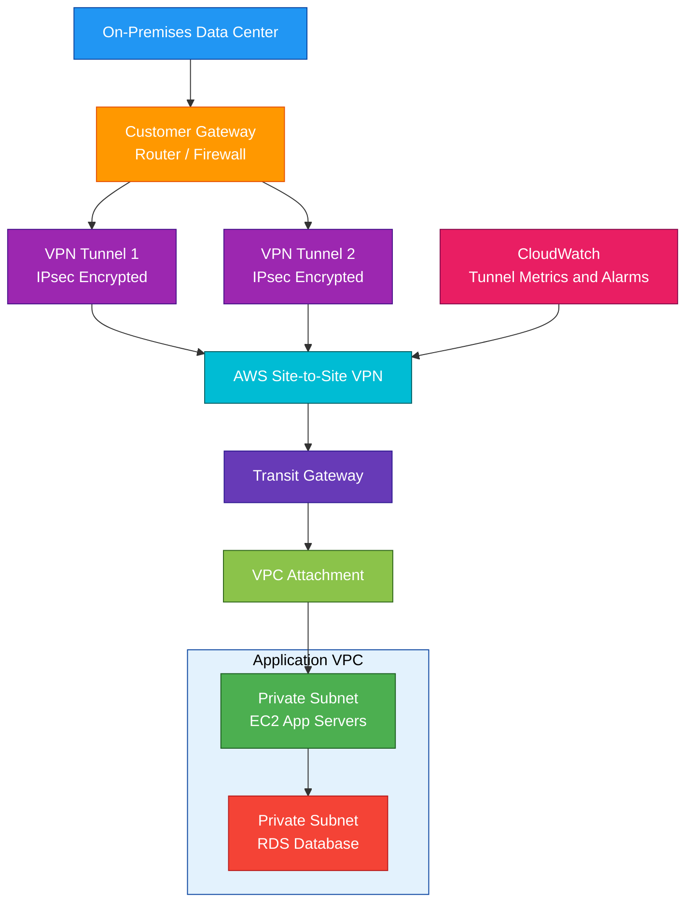

# AWS Site-to-Site VPN

## 1. Definition

### Simple Definition

AWS Site-to-Site VPN is a managed VPN service that securely connects your on-premises network to AWS over the public internet.

It uses encrypted IPsec tunnels between your customer gateway and AWS.

### Memory Hook

Site-to-Site VPN = Encrypted tunnel from your site to AWS.

### Basic Idea

Your on-premises network connects to AWS through two encrypted VPN tunnels.

Traffic travels over the internet, but the VPN encryption protects the data.

### Key Point

Site-to-Site VPN is encrypted by default using IPsec.

It is commonly used for hybrid cloud connectivity between AWS and on-premises networks.

## 2. What Problem Does It Solve?

### Main Problem

Site-to-Site VPN solves the problem of securely connecting an on-premises network to AWS without needing a dedicated private physical connection.

### Without Site-to-Site VPN

You may have problems such as:

- No private connection to AWS resources
- Unencrypted traffic over the internet
- Difficulty accessing private VPC resources from on-premises
- Slow setup for hybrid connectivity
- Need to expose resources publicly

### With Site-to-Site VPN

You can connect on-premises networks to AWS using encrypted tunnels over the internet.

### Key Benefit

Site-to-Site VPN provides quick, encrypted, hybrid connectivity to AWS.

## 3. Core Use Cases

### Hybrid Cloud Connectivity

Connect an on-premises data center, office, or branch network to AWS.

Example:

On-premises applications connect privately to EC2, RDS, or internal load balancers in a VPC.

### Secure Access to Private VPC Resources

Use VPN so on-premises users or systems can access private AWS resources without exposing them to the public internet.

Examples:

- Private EC2 instances
- RDS databases
- Internal APIs
- Private application servers

### Backup Connection for Direct Connect

A common design is Direct Connect as the primary connection and Site-to-Site VPN as backup.

If Direct Connect fails, VPN can provide failover connectivity.

### Fast Hybrid Setup

Site-to-Site VPN is usually faster to set up than Direct Connect because it does not require physical circuit provisioning.

### Multi-VPC Connectivity

Use Site-to-Site VPN with Transit Gateway to connect on-premises networks to multiple VPCs.

### Temporary Connectivity

Use VPN for temporary projects, migrations, or testing environments where a dedicated connection is not required.

### Encrypted Connectivity Over Direct Connect

You can run VPN over Direct Connect if you need encryption over a private Direct Connect path.

## 4. Important Features for SAA

### Customer Gateway

A Customer Gateway represents your on-premises VPN device in AWS.

It usually refers to your router or firewall.

Important details:

- Has a public IP address
- Supports IPsec VPN
- Can use static routing or BGP
- Is configured on the customer side

### Virtual Private Gateway

A Virtual Private Gateway, or VGW, is the AWS-side VPN endpoint attached to a single VPC.

Use VGW when connecting one VPC to an on-premises network.

### Transit Gateway

Transit Gateway is a central hub for connecting many VPCs and networks.

Use Transit Gateway when you need VPN connectivity to multiple VPCs.

### VPN Connection

A VPN connection is the secure connection between AWS and your on-premises network.

It includes two VPN tunnels for high availability.

### Two VPN Tunnels

Each Site-to-Site VPN connection provides two tunnels.

Important exam point:

Use both tunnels for redundancy.

If one tunnel fails, traffic can use the other tunnel.

### IPsec

AWS Site-to-Site VPN uses IPsec to encrypt traffic.

IPsec provides secure communication over the public internet.

### Static Routing

Static routing uses manually configured routes.

Use static routing when BGP is not available or not needed.

### Dynamic Routing with BGP

Dynamic routing uses Border Gateway Protocol, or BGP.

BGP can automatically exchange routes between your on-premises network and AWS.

Exam tip:

BGP is preferred for automatic route exchange and failover.

### Route Propagation

Route propagation can automatically add VPN routes to VPC route tables when using a Virtual Private Gateway.

This reduces manual route table management.

### Tunnel Options

You can configure VPN tunnel options such as:

- Inside tunnel CIDR
- Pre-shared key
- IKE version
- Encryption algorithms
- Integrity algorithms
- Startup action

### Pre-Shared Key

A pre-shared key is used to authenticate the VPN tunnel.

It must match on both AWS and the customer gateway device.

### Accelerated Site-to-Site VPN

Accelerated Site-to-Site VPN uses AWS Global Accelerator to improve VPN performance by routing traffic to the closest AWS edge location.

Use it when global internet paths cause poor VPN performance.

### VPN CloudHub

VPN CloudHub allows multiple remote sites to communicate with each other through AWS VPN.

Use it for hub-and-spoke connectivity between branch offices.

### Monitoring

Site-to-Site VPN integrates with CloudWatch.

Important metrics include:

- Tunnel state
- Tunnel data in
- Tunnel data out

### Logs

VPN tunnel logs can help troubleshoot connectivity problems.

Common issues include:

- IKE negotiation failure
- IPsec configuration mismatch
- Routing problems
- Firewall rules blocking traffic

## 5. Security Model

### IAM Permissions

IAM controls who can create and manage Site-to-Site VPN resources.

Common permissions:

| Permission | Purpose |
|---|---|
| `ec2:CreateVpnConnection` | Create VPN connection |
| `ec2:CreateCustomerGateway` | Create customer gateway |
| `ec2:CreateVpnGateway` | Create virtual private gateway |
| `ec2:AttachVpnGateway` | Attach VGW to VPC |
| `ec2:DeleteVpnConnection` | Delete VPN connection |
| `ec2:DescribeVpnConnections` | View VPN details |

### Encryption in Transit

Site-to-Site VPN encrypts traffic using IPsec.

This protects data as it travels over the public internet.

### Authentication

VPN tunnels use authentication methods such as pre-shared keys.

Both sides must have matching configuration for the tunnel to come up.

### Network Security

VPN does not replace normal VPC security controls.

You still need:

- Security groups
- Network ACLs
- Route tables
- Firewall rules
- Least privilege access
- Application authentication

### Security Groups

Security groups must allow traffic from on-premises CIDR ranges to AWS resources.

Example:

Allow on-premises network `10.1.0.0/16` to connect to an internal application on port `443`.

### Network ACLs

NACLs must also allow the traffic.

Remember:

- NACLs are stateless
- Return traffic must be explicitly allowed

### On-Premises Firewall Rules

Your on-premises firewall must allow the required VPN traffic.

It must also allow internal traffic between on-premises systems and AWS CIDR ranges.

### Route Control

Only routes advertised or configured through the VPN can pass through the tunnel.

Careful route design helps prevent unwanted network access.

### Shared Responsibility

AWS is responsible for:

- AWS-side VPN endpoint infrastructure
- Managed VPN service availability
- AWS service patching
- Physical security of AWS infrastructure

You are responsible for:

- Customer gateway device configuration
- On-premises firewall rules
- Tunnel configuration
- Routing configuration
- Security groups and NACLs
- Monitoring VPN tunnel health
- Managing pre-shared keys and encryption settings

## 6. High Availability / Durability Behavior

### Availability

Each Site-to-Site VPN connection includes two tunnels for redundancy.

AWS recommends configuring both tunnels on your customer gateway device.

### Tunnel Redundancy

If one tunnel fails, traffic can fail over to the second tunnel.

For better availability, both tunnels should be actively monitored and configured.

### Customer Gateway Redundancy

The AWS side has redundant tunnels, but your on-premises side can still be a single point of failure.

For stronger HA, use:

- Redundant customer gateway devices
- Redundant internet connections
- Multiple VPN connections
- BGP for dynamic failover

### Multi-AZ Behavior

Site-to-Site VPN is not deployed into your VPC subnets.

The AWS-managed VPN endpoint provides connectivity into AWS.

Your applications inside AWS should still use Multi-AZ design.

### Multi-Region Behavior

VPN connections are regional.

For Multi-Region architecture, create VPN connectivity to each Region or use Transit Gateway and appropriate routing designs.

### Transit Gateway HA

When using Transit Gateway with VPN, AWS provides a scalable hub for many VPCs and VPN connections.

This is better than managing many separate VPN connections to many VPCs.

### Failover Behavior

Failover can be improved with BGP.

BGP can detect route changes and help traffic move to another tunnel or connection.

### Durability

Site-to-Site VPN is a network connectivity service, not a storage service.

Durability applies to the applications and data stores accessed through the VPN.

### Important Exam Point

Site-to-Site VPN provides encrypted connectivity, but high availability requires both tunnels and good customer-side redundancy.

## 7. Cost Optimization Options

### Use VPN for Lower-Cost Hybrid Connectivity

Site-to-Site VPN is often cheaper and faster to set up than Direct Connect.

Use it when bandwidth and latency requirements are moderate.

### Use Direct Connect for Heavy Long-Term Traffic

For high-volume, predictable hybrid traffic, Direct Connect may be more cost-effective and provide better performance.

### Use Transit Gateway for Many VPCs

If many VPCs need VPN access, use Transit Gateway instead of separate VPNs to every VPC.

This simplifies routing and management.

### Avoid Unused VPN Connections

Delete unused VPN connections, customer gateways, and virtual private gateways.

VPN connections can create ongoing hourly charges.

### Monitor Data Transfer

Hybrid traffic can create data transfer costs.

Monitor how much data moves between on-premises and AWS.

### Choose Accelerated VPN Only When Needed

Accelerated Site-to-Site VPN can improve performance but may add cost.

Use it when internet path performance is a real problem.

### Avoid Overly Complex Routing

Simpler route design reduces operational cost and troubleshooting time.

Use BGP when dynamic routing and failover are needed.

### Use S3/Data Transfer Services for Bulk Migration

For large one-time data migrations, compare VPN with:

- AWS DataSync
- AWS Snowball
- Direct Connect
- S3 Transfer Acceleration

### Use CloudWatch Alarms

Monitor tunnel state to detect failures early.

This reduces downtime and troubleshooting effort.

## 8. Common Exam Traps

### VPN Uses the Public Internet

Site-to-Site VPN uses encrypted tunnels over the public internet.

Direct Connect uses a dedicated private connection.

### VPN Is Encrypted by Default

Site-to-Site VPN uses IPsec encryption.

Direct Connect is private but not encrypted by default.

### Direct Connect Is More Predictable

If the question asks for consistent bandwidth and predictable latency, Direct Connect is usually better than VPN.

### VPN Is Faster to Set Up

If the question asks for quick encrypted connectivity, Site-to-Site VPN is usually better than Direct Connect.

### Use Both VPN Tunnels

Each VPN connection has two tunnels.

Do not configure only one tunnel for production.

### Customer Gateway Can Be a Single Point of Failure

AWS provides two tunnels, but if you have only one on-premises router, your customer side may still fail.

### VGW vs Transit Gateway

| AWS Endpoint | Best For |
|---|---|
| Virtual Private Gateway | VPN to one VPC |
| Transit Gateway | VPN to many VPCs |

### Static Routing vs BGP

Static routing is manual.

BGP supports dynamic route exchange and better failover.

### VPN Does Not Bypass the Internet

Even though it is encrypted, Site-to-Site VPN still uses internet paths unless using VPN over Direct Connect or accelerated VPN.

### Security Groups Still Apply

VPN connectivity does not automatically allow access to EC2, RDS, or other resources.

Security groups and NACLs must allow the traffic.

### Route Tables Still Matter

If route tables do not send traffic to the VPN gateway or Transit Gateway, traffic will not flow through the VPN.

### VPN Is Not Client VPN

Site-to-Site VPN connects networks.

AWS Client VPN connects individual users/devices.

## 9. Compare With Similar Services

### Service Comparison Table

| Service | Main Purpose | Best For | Choose When |
|---|---|---|---|
| Site-to-Site VPN | Encrypted network-to-network connection | Quick hybrid connectivity | You need secure on-premises to AWS connectivity over internet |
| Direct Connect | Dedicated private connection | High bandwidth and predictable latency | You need consistent private network performance |
| Client VPN | User-to-VPC remote access | Individual user VPN access | Remote users need secure access to AWS |
| Transit Gateway | Network hub | Connecting many VPCs and networks | You need scalable hub-and-spoke routing |
| VPC Peering | VPC-to-VPC private connection | Simple direct VPC connectivity | You need private connectivity between two VPCs |
| PrivateLink | Private service access | Accessing specific services privately | You do not want full network connectivity |

### Site-to-Site VPN vs Direct Connect

| Feature | Site-to-Site VPN | Direct Connect |
|---|---|---|
| Network path | Public internet | Dedicated private connection |
| Encryption | IPsec encrypted by default | Not encrypted by default |
| Setup speed | Faster | Slower due to physical setup |
| Performance | Internet-dependent | More consistent |
| Cost | Often lower for small workloads | Better for high-volume steady traffic |
| Best for | Quick secure hybrid access | Enterprise-grade predictable connectivity |

### Site-to-Site VPN vs Client VPN

| Feature | Site-to-Site VPN | Client VPN |
|---|---|---|
| Connects | Network to network | Individual users to AWS |
| Common use | Data center to VPC | Remote employee access |
| Device | Customer gateway router/firewall | User laptop/client |
| Exam clue | On-premises network CIDR | Remote users working from home |

### Site-to-Site VPN vs Transit Gateway

| Feature | Site-to-Site VPN | Transit Gateway |
|---|---|---|
| Main purpose | Hybrid connection | Network hub |
| Connects to on-premises | Yes | Through VPN or Direct Connect |
| Connects many VPCs | Not by itself | Yes |
| Common use together | VPN attaches to TGW | TGW routes to many VPCs |

### Site-to-Site VPN vs VPC Peering

| Feature | Site-to-Site VPN | VPC Peering |
|---|---|---|
| Main purpose | On-premises to AWS | VPC to VPC |
| Encryption | IPsec | Private AWS network path |
| Transitive routing | With TGW design | No |
| Best for | Hybrid connectivity | Simple VPC connectivity |

### Site-to-Site VPN vs PrivateLink

| Feature | Site-to-Site VPN | PrivateLink |
|---|---|---|
| Access scope | Network-level connectivity | Specific service access |
| Common use | On-premises network reaches VPC | Consumer privately accesses provider service |
| Routing | CIDR-based routing | Endpoint-based service access |
| Best for | Hybrid network extension | Private service exposure |

### When to Choose Site-to-Site VPN

Choose Site-to-Site VPN when:

- You need encrypted connectivity between on-premises and AWS
- You need quick hybrid network setup
- You need lower-cost connectivity than Direct Connect
- You need backup for Direct Connect
- You need to connect a branch office or data center to a VPC
- You need IPsec VPN over the internet
- You need temporary or moderate-bandwidth hybrid connectivity

## 10. Mini Architecture Example

### Scenario

A company has an on-premises data center and a VPC in AWS.

Applications in the data center need secure access to private EC2 instances and an RDS database in AWS.

The company wants a quick encrypted connection.

### Architecture

Create a Site-to-Site VPN connection between the on-premises customer gateway and an AWS Transit Gateway.

The Transit Gateway connects to the application VPC.

Both VPN tunnels are configured for redundancy.

### Why This Is Good

- VPN provides encrypted hybrid connectivity
- Both tunnels improve availability
- Transit Gateway supports future connection to more VPCs
- EC2 and RDS can remain private
- Security groups control access from on-premises CIDR ranges
- CloudWatch monitors tunnel health
- Setup is faster than provisioning Direct Connect

### Exam Answer Pattern

If the question says:

“Quickly connect an on-premises network to AWS using encrypted connectivity over the internet.”

Think:

AWS Site-to-Site VPN.

If the question says:

“Need consistent high bandwidth and predictable latency.”

Think:

AWS Direct Connect.

If the question says:

“Remote users need VPN access from laptops.”

Think:

AWS Client VPN.

### Final Memory Hook

Site-to-Site VPN = encrypted network-to-network tunnel.

Client VPN = user-to-AWS VPN.

Direct Connect = private dedicated connection.

Transit Gateway = central network hub.

VGW = VPN to one VPC.

BGP = dynamic routing and better failover.

Use both VPN tunnels for high availability.

