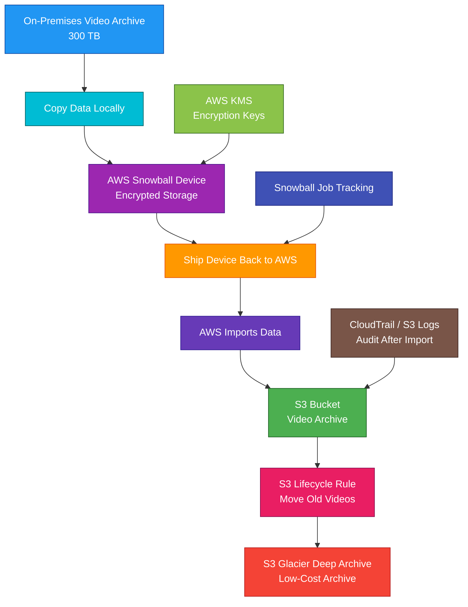

# AWS Snowball

## 1. Definition

### Simple Definition

AWS Snowball is a physical data transfer device used to move large amounts of data into or out of AWS.

It is part of the AWS Snow Family.

### Memory Hook

Snowball = Ship data to AWS when the network is too slow.

### Basic Idea

Instead of uploading huge amounts of data over the internet, AWS ships you a rugged device.

You copy data onto it, ship it back to AWS, and AWS imports the data into services like Amazon S3.

### Main Purpose

AWS Snowball is mainly used for:

- Large data migration
- Offline data transfer
- Limited bandwidth environments
- Edge computing
- Disaster recovery data movement
- Moving data when internet transfer is too slow or expensive

## 2. What Problem Does It Solve?

### Main Problem

AWS Snowball solves the problem of transferring large datasets to AWS when network transfer is slow, expensive, unreliable, or not available.

### Without Snowball

You may face problems such as:

- Uploads taking weeks or months
- High internet bandwidth cost
- Network congestion
- Unreliable connectivity
- Security concerns during long transfers
- Difficulty moving petabytes of data

### With Snowball

You copy data locally to a physical AWS device and ship it to AWS.

AWS imports the data directly into the AWS cloud.

### Key Benefit

Snowball can move massive data faster than online transfer when network bandwidth is limited.

### Simple Example

If uploading 100 TB over the internet would take weeks, using Snowball may be much faster because the data is physically shipped.

## 3. Core Use Cases

### Large Data Migration to AWS

Use Snowball to migrate large datasets from on-premises storage to AWS.

Common target:

- Amazon S3

### Data Center Migration

Use Snowball when moving data from an on-premises data center to AWS as part of a cloud migration.

### Limited Bandwidth Locations

Use Snowball when sites have poor, slow, expensive, or unreliable network connections.

Examples:

- Remote offices
- Research sites
- Ships
- Oil rigs
- Field locations
- Disaster zones

### Disaster Recovery Data Transfer

Use Snowball to move backup copies or recovery data into AWS.

Example:

A company copies large backup archives to Snowball and imports them into S3.

### Edge Computing

Some Snowball Edge devices can run compute workloads at the edge.

Use this when data must be processed locally before being sent to AWS.

Examples:

- Local image processing
- IoT data processing
- Machine learning inference
- Data filtering before upload

### Data Export from AWS

Snowball can also be used to export large amounts of data from AWS to an on-premises location.

### Secure Physical Transfer

Use Snowball when physical transfer with built-in encryption and tamper-resistant hardware is preferred over long online transfer.

## 4. Important Features for SAA

### AWS Snow Family

AWS Snowball belongs to the AWS Snow Family.

Common Snow Family devices include:

| Device | Best For |
|---|---|
| Snowcone | Small data transfer and edge computing |
| Snowball Edge Storage Optimized | Large data transfer and storage-heavy edge work |
| Snowball Edge Compute Optimized | Edge computing workloads needing more compute |

### Snowball vs Snowball Edge

In many SAA exam scenarios, “Snowball” often refers to physical data transfer devices.

Snowball Edge adds edge computing and local storage capabilities.

### Snowball Edge Storage Optimized

Best for:

- Large-scale data migration
- Storage-heavy workloads
- Local data collection
- Importing large datasets into S3

### Snowball Edge Compute Optimized

Best for:

- Edge compute workloads
- Local data processing
- ML inference at the edge
- Environments with limited connectivity

### Snowcone

Snowcone is a smaller Snow Family device.

Best for:

- Smaller data transfers
- Edge locations with limited space
- Lightweight compute
- Harsh or disconnected environments

### Job

A Snowball job defines what you want to do.

Common job types:

| Job Type | Meaning |
|---|---|
| Import to AWS | Copy data from on-premises to AWS |
| Export from AWS | Copy data from AWS to on-premises |
| Local compute/storage | Use device for edge processing |

### Import Job

For an import job:

1. Create a Snowball job in AWS.
2. AWS ships the device to you.
3. You connect it to your local network.
4. You copy data to the device.
5. You ship it back to AWS.
6. AWS imports the data into S3.

### Export Job

For an export job:

1. Create an export job.
2. AWS copies S3 data onto the device.
3. AWS ships the device to you.
4. You copy the data from the device to your local storage.

### Target Storage

The most common AWS target for Snowball imports is Amazon S3.

After data lands in S3, you can use:

- Lifecycle policies
- S3 Glacier storage classes
- Athena
- Glue
- Redshift
- EMR
- Lake Formation

### Snowball Client

The Snowball client is used to unlock the device and transfer data.

It helps with:

- Authentication
- Data transfer
- Device access
- Transfer management

### AWS OpsHub

AWS OpsHub is a graphical tool for managing Snow Family devices.

It can help with:

- Unlocking devices
- Transferring files
- Managing local services
- Monitoring device status
- Running edge workloads

### Local Compute

Snowball Edge can run selected compute workloads locally.

This is useful when:

- Data must be processed before upload
- Connectivity is poor
- Low-latency local processing is required
- Data is generated outside a normal data center

### Offline Data Transfer

Snowball is offline or semi-offline data transfer.

The main data movement happens by physically shipping the device.

### Tamper-Resistant Device

Snowball devices are rugged and tamper-resistant.

They are designed for secure physical shipping.

### End-to-End Tracking

Snowball devices use shipping labels and tracking through the AWS job workflow.

This helps monitor where the device is during the job.

### Data Erasure

After AWS imports the data, Snowball devices are securely erased according to AWS processes.

### S3 Adapter / File Interface

Snowball devices provide ways to copy data using supported tools and interfaces.

For SAA, focus on the concept:

You copy data locally to the device, and AWS imports it into S3.

## 5. Security Model

### IAM Permissions

IAM controls who can create and manage Snowball jobs.

Common permissions:

| Permission | Purpose |
|---|---|
| `snowball:CreateJob` | Create a Snowball job |
| `snowball:DescribeJob` | View job details |
| `snowball:ListJobs` | List Snowball jobs |
| `snowball:CancelJob` | Cancel a job |
| `snowball:GetJobManifest` | Get job manifest |
| `snowball:GetJobUnlockCode` | Get unlock code |

### Encryption at Rest

Data copied to Snowball is encrypted.

AWS Snowball uses encryption to protect data stored on the device.

### KMS Integration

Snowball uses AWS KMS keys for encryption.

Important exam point:

The data on the device is encrypted and protected using keys managed through AWS KMS.

### Device Unlock

To access a Snowball device, you need job-specific credentials such as:

- Job manifest
- Unlock code
- Snowball client or AWS OpsHub

### Physical Security

Snowball devices are designed for secure physical transport.

Security features include:

- Rugged enclosure
- Tamper-resistant design
- Secure shipping process
- Tracking through AWS job workflow

### Encryption in Transit

Data transfer between your local environment and the Snowball device happens over your local network.

Protect local network access using normal security controls.

### Access Control

Only authorized users should be able to:

- Create Snowball jobs
- Download unlock credentials
- Access the device
- Copy data to or from the device
- Manage KMS keys

### S3 Security After Import

After data is imported into S3, normal S3 security controls apply.

Use:

- Bucket policies
- IAM policies
- S3 Block Public Access
- S3 encryption
- S3 versioning
- S3 Object Lock if required

### Shared Responsibility

AWS is responsible for:

- Snowball device security design
- Device shipping workflow
- AWS-side import/export process
- Device erasure after job completion
- Physical security of AWS facilities

You are responsible for:

- IAM permissions
- KMS key access
- Local network security
- Physical custody while the device is on-site
- Copying the correct data
- Protecting unlock credentials
- S3 bucket permissions after import
- Validating imported data

## 6. High Availability / Durability Behavior

### Availability

Snowball is not a high-availability application service.

It is a data transfer and edge device service.

### Physical Device Dependency

While the device is on-site, the transfer depends on:

- Device availability
- Local network access
- Local power
- Local storage systems
- Shipping process

### Durability During Transfer

Data on the device is encrypted and stored locally until the device is returned and imported by AWS.

For important migrations, validate copied data and job completion status.

### Durability After Import

After data is imported into S3, it uses S3 durability.

For SAA, remember:

S3 is designed for 11 9s of durability.

### Multi-AZ Behavior

Snowball itself is a physical device, not a Multi-AZ service.

After data is imported to S3, S3 stores data across multiple Availability Zones for most storage classes.

### Multi-Region Behavior

Snowball jobs are associated with an AWS Region.

If data must exist in multiple Regions, use services such as:

- S3 Cross-Region Replication
- S3 Batch Replication
- AWS Backup copy
- Application-level replication

### Fault Tolerance

For very large migrations, you can use multiple Snowball devices.

This can help:

- Parallelize data transfer
- Reduce migration time
- Lower risk from a single device issue

### Edge Computing Availability

For edge workloads, Snowball Edge can run compute locally.

However, you are responsible for planning local power, physical access, and operational continuity.

### Important Exam Point

Snowball is for transfer and edge processing.

It does not replace S3 durability, Multi-AZ architecture, backups, or replication.

## 7. Cost Optimization Options

### Use Snowball When Network Transfer Is Too Expensive or Slow

Snowball can be cost-effective when transferring large datasets over the network would take too long or consume too much bandwidth.

### Compare With DataSync

Use DataSync when network transfer is practical.

Use Snowball when the dataset is too large or the network is too slow.

### Transfer Only Needed Data

Before copying data to Snowball, remove:

- Duplicate files
- Temporary files
- Old unneeded data
- Corrupted data
- Data that does not need to move

### Use Multiple Devices for Large Migrations

For very large migrations, multiple Snowball devices can reduce total migration time.

### Use S3 Lifecycle After Import

After data lands in S3, use lifecycle policies to move older data to lower-cost storage.

Examples:

- S3 Standard-IA
- S3 Glacier Instant Retrieval
- S3 Glacier Flexible Retrieval
- S3 Glacier Deep Archive

### Avoid Keeping Edge Devices Longer Than Needed

Snowball jobs may have time-based charges after a certain period.

Complete copying and return the device promptly.

### Choose the Right Snow Family Device

| Need | Better Choice |
|---|---|
| Small transfer or small edge site | Snowcone |
| Large storage migration | Snowball Edge Storage Optimized |
| Edge compute-heavy work | Snowball Edge Compute Optimized |

### Compress Data When Appropriate

Compressing data before transfer can reduce the amount of data copied.

Only do this when compression does not interfere with application requirements.

### Plan Network Copy Speed

The local copy process still depends on your local network speed and storage performance.

Optimize local transfer paths to avoid delays.

### Validate Before Shipping

Validate that the required data was copied before returning the device.

This avoids repeat jobs and extra cost.

## 8. Common Exam Traps

### Snowball vs DataSync

Snowball uses physical devices.

DataSync transfers data online over the network.

Memory hook:

- Snowball = Ship data
- DataSync = Sync data over network

### Snowball vs Storage Gateway

Storage Gateway provides ongoing hybrid access to AWS storage.

Snowball is mainly for large physical data transfer or edge use cases.

### Snowball vs Direct Connect

Direct Connect is a dedicated private network connection.

Snowball is a physical device-based data transfer service.

### Snowball Is Not for Small Data Transfers

For small data transfers, use normal internet upload, AWS CLI, S3 Transfer Acceleration, or DataSync.

Snowball is mainly for large-scale transfer.

### Snowball Is Not Real-Time Replication

Snowball is not continuous replication.

It is job-based physical transfer.

For ongoing replication, use services such as:

- DataSync
- S3 Replication
- Database replication
- Storage Gateway for hybrid access

### Snowball Imports Commonly Land in S3

If the exam says large on-premises dataset must be moved into S3 and the network is too slow, Snowball is likely the answer.

### Snowball Edge Can Run Compute

Snowball Edge is not only storage transfer.

It can also run certain local compute workloads at the edge.

### Data Is Encrypted

Snowball encrypts data on the device.

Do not choose an answer that says data is stored unencrypted on the device.

### Device Must Be Returned to AWS for Import

For import jobs, data is not available in AWS until the device is shipped back and imported.

### Snowball Does Not Replace Backup Strategy

Snowball can move backup data, but backup planning still requires retention, restore testing, encryption, and lifecycle policies.

### Snowmobile Is for Extremely Large Data

Older exam materials may mention AWS Snowmobile for exabyte-scale data transfer.

For SAA, focus mainly on Snowball and Snowball Edge.

## 9. Compare With Similar Services

### Service Comparison Table

| Service | Main Purpose | Best For | Choose When |
|---|---|---|---|
| AWS Snowball | Physical data transfer | Large offline data migration | Network transfer is too slow or expensive |
| AWS Snowball Edge | Physical transfer plus edge compute | Edge processing and large transfer | You need local compute/storage in disconnected locations |
| AWS Snowcone | Small rugged edge device | Small transfers and edge locations | You need portable small-scale transfer or edge compute |
| AWS DataSync | Online data transfer | File/object migration over network | Network transfer is practical |
| AWS Storage Gateway | Hybrid storage access | On-premises apps using AWS storage | You need ongoing hybrid storage integration |
| AWS Direct Connect | Dedicated private network | Stable hybrid connectivity | You need consistent private network performance |
| S3 Transfer Acceleration | Faster internet upload to S3 | Long-distance S3 transfers | You need faster online uploads to S3 |

### Snowball vs DataSync

| Feature | Snowball | DataSync |
|---|---|---|
| Transfer method | Physical device shipping | Online network transfer |
| Best for | Huge datasets or slow networks | Network-based migration and sync |
| Ongoing sync | No, job-based | Yes, scheduled or repeated |
| Local device | Yes | Agent often used |
| Exam clue | Network would take weeks/months | Transfer over network is acceptable |

### Snowball vs Storage Gateway

| Feature | Snowball | Storage Gateway |
|---|---|---|
| Main purpose | Physical data movement | Hybrid storage access |
| Usage style | Job-based transfer | Ongoing connection |
| Best for | Bulk migration | On-prem apps needing AWS-backed storage |
| Example | Ship 500 TB to AWS | Local app writes to S3 through SMB/NFS |

### Snowball vs Direct Connect

| Feature | Snowball | Direct Connect |
|---|---|---|
| Main purpose | Data transfer device | Private network connectivity |
| Transfer style | Offline physical shipping | Online private connection |
| Best for | One-time huge migration | Ongoing hybrid traffic |
| Setup | Device job and shipping | Physical network circuit |
| Exam clue | Move huge dataset once | Need predictable low-latency connection |

### Snowball vs S3 Transfer Acceleration

| Feature | Snowball | S3 Transfer Acceleration |
|---|---|---|
| Transfer method | Physical shipping | Internet via AWS edge locations |
| Best for | Very large offline transfers | Faster online uploads to S3 |
| Network required | Local copy plus shipping | Yes |
| Use case | Network too slow | Network usable but long-distance upload is slow |

### Snowball vs Snowcone

| Feature | Snowball | Snowcone |
|---|---|---|
| Size | Larger | Smaller |
| Best for | Larger migrations | Small edge or portable use cases |
| Edge compute | Snowball Edge supports compute | Snowcone supports lightweight edge use |
| Common use | Data center migration | Field, remote, or space-constrained sites |

### When to Choose Snowball

Choose Snowball when:

- You need to move very large datasets
- Network transfer would take too long
- Bandwidth is limited or unreliable
- You need secure physical transfer
- You need to import data into S3
- You need to export large data from AWS
- You need edge storage or edge compute with Snowball Edge
- DataSync or normal upload is not practical

## 10. Mini Architecture Example

### Scenario

A company has 300 TB of archived video files in an on-premises data center.

Uploading the data over the internet would take too long.

The company wants to move the files into Amazon S3 and later archive old videos to Glacier Deep Archive.

### Architecture

Create an AWS Snowball import job.

AWS ships Snowball devices to the data center.

The company copies video files to the devices.

The devices are shipped back to AWS.

AWS imports the data into S3.

S3 lifecycle rules move older videos to Glacier Deep Archive.

### Why This Is Good

- Snowball avoids slow internet upload for hundreds of TB
- Data is encrypted on the device
- Physical transfer can be faster than network transfer
- S3 stores imported data durably
- Lifecycle rules reduce long-term storage cost
- Glacier Deep Archive is good for rarely accessed archives
- Job tracking helps monitor the transfer process
- CloudTrail and S3 logs can support auditing after import

### Exam Answer Pattern

If the question says:

“Move a very large amount of data to AWS, but network transfer would take too long.”

Think:

AWS Snowball.

If the question says:

“Move files over the network on a schedule.”

Think:

AWS DataSync.

If the question says:

“On-premises applications need ongoing access to AWS-backed storage.”

Think:

AWS Storage Gateway.

If the question says:

“Need a private, consistent network connection to AWS.”

Think:

AWS Direct Connect.

### Final Memory Hook

Snowball = Ship large data.

Snowball Edge = Ship data plus edge compute.

Snowcone = Small portable Snow device.

DataSync = Online data transfer.

Storage Gateway = Ongoing hybrid storage access.

Direct Connect = Private network connection.

S3 = Common import destination.

KMS = Encrypts Snowball data.

Lifecycle = Move imported data to cheaper storage.

Glacier Deep Archive = Lowest-cost long-term archive.

