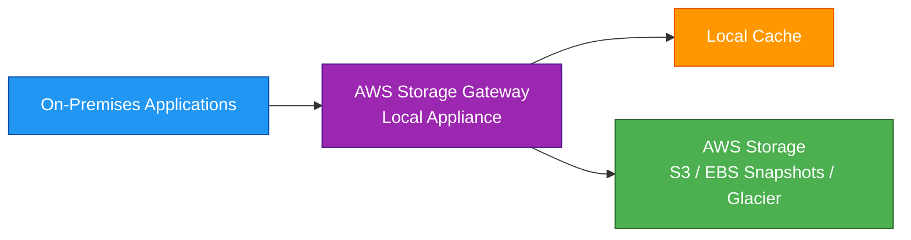
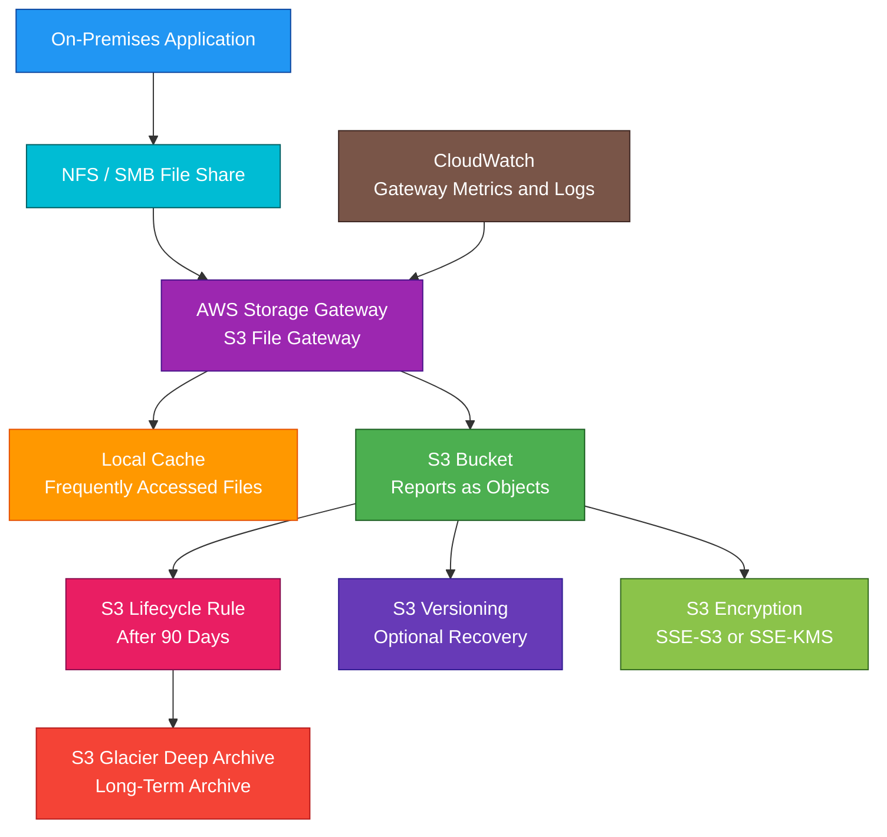

# AWS Storage Gateway

## 1. Definition

### Simple Definition

AWS Storage Gateway is a hybrid cloud storage service that connects on-premises environments to AWS cloud storage.

It lets on-premises applications use AWS storage through familiar storage protocols.

### Memory Hook

Storage Gateway = Bridge between on-premises storage and AWS storage.

### Basic Idea

You deploy a Storage Gateway appliance on-premises as a virtual machine or hardware appliance.

Your local applications connect to the gateway, and the gateway stores or backs up data in AWS.

### Main Gateway Types

| Gateway Type | Best For |
|---|---|
| S3 File Gateway | On-premises file access to S3 |
| Volume Gateway | Block storage backed by AWS |
| Tape Gateway | Virtual tape backup to AWS |
| FSx File Gateway | Legacy/existing use cases for Windows file access to FSx |

## 2. What Problem Does It Solve?

### Main Problem

Storage Gateway solves the problem of connecting on-premises applications to AWS storage without rewriting those applications to use AWS APIs directly.

### Without Storage Gateway

You may have problems such as:

- On-premises apps cannot easily use S3
- Legacy backup systems require tape libraries
- Local apps need low-latency cached access
- Manual file transfers are difficult
- Managing local storage capacity is expensive
- Hybrid storage integration is complex

### With Storage Gateway

You can keep using familiar storage protocols while storing data in AWS.

Examples:

- NFS
- SMB
- iSCSI
- Virtual tape library interface

### Key Benefit

Storage Gateway provides hybrid storage integration between on-premises workloads and AWS cloud storage.

## 3. Core Use Cases

### Hybrid File Storage

Use S3 File Gateway when on-premises applications need file access to objects stored in S3.

Example:

An on-premises app writes files using NFS or SMB, and the files are stored as objects in S3.

### Backup to AWS

Use Storage Gateway to back up on-premises data to AWS.

Common options:

- Tape Gateway for virtual tape backups
- Volume Gateway snapshots
- File Gateway to S3

### Tape Replacement

Use Tape Gateway to replace physical tape infrastructure.

Backup software writes to virtual tapes, and AWS stores the data in S3 and Glacier storage classes.

### Local Cache for Cloud Data

Storage Gateway keeps frequently accessed data locally for low-latency access.

Less frequently accessed data is stored in AWS.

### Disaster Recovery

Use Storage Gateway to store backups or snapshots in AWS so data can be recovered if the on-premises environment fails.

### On-Premises Applications Using S3

Use File Gateway when applications need file protocols but you want the durability and lifecycle features of S3.

### Block Storage for On-Premises Servers

Use Volume Gateway when on-premises servers need iSCSI block volumes backed by AWS storage.

## 4. Important Features for SAA

### Gateway Appliance

Storage Gateway runs as an appliance.

Deployment options include:

- VMware ESXi
- Microsoft Hyper-V
- Linux KVM
- Amazon EC2
- Hardware appliance

### Local Cache

The gateway uses local disks for cache.

The cache stores recently accessed data locally to reduce latency.

### Upload Buffer

Some gateway types use upload buffer storage to temporarily hold data before uploading it to AWS.

### S3 File Gateway

S3 File Gateway provides file access to S3 using NFS or SMB.

Important points:

- Files are stored as S3 objects
- Supports NFS and SMB
- Uses local cache for low-latency access
- Integrates with S3 lifecycle policies
- Useful for hybrid file workflows

### File Gateway Protocols

| Protocol | Common Use |
|---|---|
| NFS | Linux/Unix file access |
| SMB | Windows file access |

### S3 Object Mapping

With S3 File Gateway, files written through the gateway become objects in S3.

This lets you use S3 features such as:

- Lifecycle rules
- Versioning
- Replication
- Encryption
- Object storage durability

### Volume Gateway

Volume Gateway provides cloud-backed block storage to on-premises applications using iSCSI.

It has two modes:

| Mode | Meaning |
|---|---|
| Cached Volumes | Primary data in AWS, frequently accessed data cached locally |
| Stored Volumes | Primary data on-premises, asynchronous backups to AWS |

### Cached Volumes

Cached Volumes store the main copy of data in AWS.

Frequently accessed data is cached locally.

Best for:

- Reducing on-premises storage footprint
- Keeping active data local
- Cloud-backed block storage

### Stored Volumes

Stored Volumes store the full dataset on-premises.

Data is asynchronously backed up to AWS as EBS snapshots.

Best for:

- Low-latency local access to full dataset
- AWS backup protection
- Disaster recovery copies

### Tape Gateway

Tape Gateway provides a virtual tape library, or VTL.

It works with existing backup applications.

Important points:

- Replaces physical tape
- Stores virtual tapes in AWS
- Supports long-term archival
- Integrates with S3 Glacier storage classes
- Useful for backup and compliance

### Virtual Tape Library

A virtual tape library lets existing backup software write backups as if it were writing to physical tapes.

AWS stores those virtual tapes in cloud storage.

### FSx File Gateway

FSx File Gateway was used to provide low-latency on-premises access to Amazon FSx for Windows File Server.

For SAA, focus more on:

- S3 File Gateway
- Volume Gateway
- Tape Gateway

If the scenario needs Windows SMB file shares directly in AWS, think FSx for Windows File Server.

### Snapshots

Volume Gateway can create point-in-time snapshots that are stored as EBS snapshots.

These snapshots can be used for recovery.

### AWS Backup Integration

Storage Gateway can integrate with AWS Backup for supported gateway types.

This helps centralize backup schedules and retention policies.

### CloudWatch Monitoring

Storage Gateway integrates with CloudWatch.

Monitor:

- Cache usage
- Upload buffer usage
- Gateway health
- Cloud upload status
- Read/write throughput
- Errors

## 5. Security Model

### IAM Permissions

IAM controls who can create, activate, manage, and delete Storage Gateway resources.

Common permissions:

| Permission | Purpose |
|---|---|
| `storagegateway:ActivateGateway` | Activate a gateway |
| `storagegateway:CreateNFSFileShare` | Create NFS file share |
| `storagegateway:CreateSMBFileShare` | Create SMB file share |
| `storagegateway:CreateCachediSCSIVolume` | Create cached volume |
| `storagegateway:CreateTapeWithBarcode` | Create virtual tape |
| `storagegateway:DeleteGateway` | Delete gateway |

### Access to File Shares

File Gateway access depends on the file protocol.

| Protocol | Access Control |
|---|---|
| NFS | Client IP and POSIX permissions |
| SMB | Active Directory or guest access settings |

### SMB and Active Directory

For SMB file shares, Storage Gateway can integrate with Microsoft Active Directory.

This allows access control using Windows users and groups.

### Encryption in Transit

Data transferred between the gateway and AWS is encrypted in transit.

Use secure protocols and network controls for local client access.

### Encryption at Rest

Data stored in AWS can be encrypted.

Examples:

- S3 server-side encryption
- KMS keys for S3 objects
- EBS snapshot encryption
- Glacier storage encryption

### KMS Key Permissions

If using customer managed KMS keys, make sure Storage Gateway and users have correct KMS permissions.

Wrong KMS permissions can break uploads, reads, restores, or snapshots.

### Network Security

The gateway needs network connectivity to AWS service endpoints.

Common options:

- Public internet
- VPN
- Direct Connect
- VPC endpoints where supported

### Local Appliance Security

You are responsible for securing the local gateway appliance.

Best practices:

- Restrict admin access
- Patch the host environment
- Protect local disks
- Control network access
- Monitor gateway health

### Least Privilege

Grant only required access to:

- Gateway administrators
- File share users
- Backup operators
- KMS keys
- S3 buckets
- Snapshot resources

### Shared Responsibility

AWS is responsible for:

- Storage Gateway managed service
- AWS-side storage durability
- Cloud service availability
- Physical security of AWS infrastructure

You are responsible for:

- Local appliance deployment
- Local network security
- File share permissions
- IAM permissions
- KMS key policies
- Backup configuration
- Cache disk health
- Monitoring gateway status

## 6. High Availability / Durability Behavior

### Availability

Storage Gateway connects local environments to AWS storage.

The gateway appliance itself runs in your environment, so local availability depends on your deployment.

### Gateway Appliance Availability

If the local gateway appliance fails, on-premises applications may lose access to the gateway until it is restored or replaced.

For stronger availability, design local infrastructure carefully.

### AWS Storage Durability

Data stored in AWS uses the durability of the backend service.

Examples:

| Backend Storage | Durability Role |
|---|---|
| S3 | Durable object storage |
| EBS Snapshots | Durable volume snapshot storage |
| Glacier classes | Durable archive storage |

### Local Cache Behavior

The local cache improves read performance for frequently accessed data.

If data is not in cache, it may need to be retrieved from AWS.

### Cached Volumes Availability

For Cached Volumes, the primary data is stored in AWS and active data is cached locally.

If the on-premises gateway fails, you can recover using AWS-stored data and snapshots.

### Stored Volumes Availability

For Stored Volumes, the full data copy is local and snapshots are stored in AWS.

This provides low-latency local access plus cloud backup.

### Tape Gateway Durability

Virtual tapes are stored in AWS.

Archived tapes can be moved to low-cost archive storage for long-term retention.

### Multi-AZ Behavior

Storage Gateway itself is not a Multi-AZ managed file system like EFS or FSx.

It is a hybrid gateway appliance connected to AWS storage.

### Multi-Region Behavior

Storage Gateway is configured for a specific AWS Region.

For Multi-Region disaster recovery, use AWS storage features such as:

- S3 Cross-Region Replication
- Backup copy
- Snapshot copy
- Application-level DR design

### Important Exam Point

Storage Gateway improves hybrid storage and backup to AWS, but it does not automatically make the on-premises gateway appliance highly available.

## 7. Cost Optimization Options

### Choose the Right Gateway Type

Match the gateway type to the workload.

| Requirement | Best Choice |
|---|---|
| File access to S3 | S3 File Gateway |
| iSCSI block storage | Volume Gateway |
| Replace physical tapes | Tape Gateway |

### Use S3 Lifecycle Policies

For File Gateway data stored in S3, lifecycle policies can move older objects to cheaper storage classes.

Examples:

- S3 Standard-IA
- S3 Glacier Instant Retrieval
- S3 Glacier Flexible Retrieval
- S3 Glacier Deep Archive

### Use Tape Gateway for Archive Cost Savings

Tape Gateway can reduce the cost and management overhead of physical tape infrastructure.

Use Glacier storage classes for long-term retention.

### Right-Size Local Cache

Allocate enough cache for active data.

Too little cache can reduce performance.

Too much cache may waste local storage resources.

### Avoid Storing Unneeded Data Locally

Cached Volumes can reduce on-premises storage needs because the full dataset is stored in AWS and only active data is cached locally.

### Set Backup Retention Carefully

Backups and snapshots add storage cost.

Keep data only as long as business or compliance requires.

### Delete Unused Volumes and Tapes

Clean up unused:

- Volumes
- Snapshots
- Virtual tapes
- File shares
- Old backup data

### Use Direct Connect for Heavy Hybrid Traffic

For large and steady data transfers, Direct Connect may improve performance and reduce certain data transfer costs.

### Monitor CloudWatch Metrics

Watch for:

- Cache misses
- Upload buffer pressure
- Throughput bottlenecks
- Storage growth
- Failed uploads

### Avoid Using Storage Gateway When DataSync Is Better

If the task is a one-time or scheduled data migration, AWS DataSync may be a better fit than Storage Gateway.

## 8. Common Exam Traps

### Storage Gateway vs DataSync

Storage Gateway provides ongoing hybrid access to AWS storage.

DataSync moves data between storage locations.

Memory hook:

- Storage Gateway = Hybrid access
- DataSync = Data movement

### Storage Gateway vs S3

S3 is object storage.

Storage Gateway lets on-premises applications access AWS storage using familiar protocols.

### File Gateway Stores Files as S3 Objects

With S3 File Gateway, files become objects in S3.

This is not the same as a traditional shared file system like EFS.

### Volume Gateway Uses iSCSI

If the exam says on-premises servers need block storage using iSCSI, think Volume Gateway.

### Tape Gateway Replaces Physical Tape

If the exam mentions virtual tape library, backup software, or tape replacement, think Tape Gateway.

### Cached vs Stored Volumes

| Mode | Primary Data Location |
|---|---|
| Cached Volumes | AWS |
| Stored Volumes | On-premises |

### Storage Gateway Is Not EFS

EFS is a managed Linux file system in AWS.

Storage Gateway is a hybrid gateway for on-premises access to AWS-backed storage.

### Storage Gateway Is Not Direct Connect

Direct Connect is a network connection.

Storage Gateway is a storage integration service.

They can be used together.

### Local Cache Is Not the Only Copy

For File Gateway and Cached Volumes, AWS stores the durable copy.

The local cache improves performance.

### Gateway Appliance Must Be Healthy

If the local gateway is down, local applications may lose access.

Monitor gateway health with CloudWatch.

### Not Best for Massive One-Time Migration

For large one-time file migration, DataSync or Snowball may be better.

### S3 File Gateway Is Not for Database Block Storage

If the application needs block storage, use Volume Gateway or another block storage solution.

## 9. Compare With Similar Services

### Service Comparison Table

| Service | Main Purpose | Best For | Choose When |
|---|---|---|---|
| Storage Gateway | Hybrid storage access | On-premises apps using AWS storage | You need ongoing hybrid storage integration |
| DataSync | Data transfer | File/object migration and scheduled sync | You need to move data efficiently |
| Snowball | Offline data transfer | Very large migrations | Network transfer is too slow |
| Direct Connect | Private network connection | Hybrid network connectivity | You need consistent private network performance |
| S3 | Object storage | Files, backups, logs, data lakes | You need native cloud object storage |
| EFS | Managed Linux file system | Shared NFS file storage in AWS | Multiple AWS clients need shared files |
| FSx | Managed specialized file systems | Windows, Lustre, ONTAP, OpenZFS | You need specialized file system features |

### Storage Gateway vs DataSync

| Feature | Storage Gateway | DataSync |
|---|---|---|
| Main purpose | Hybrid storage access | Data movement |
| Usage style | Ongoing access | One-time or scheduled transfer |
| Local appliance | Yes | Agent usually for on-premises |
| Best for | On-prem apps using AWS-backed storage | Migration or sync to AWS |
| Exam clue | Existing apps need NFS/SMB/iSCSI/tape access | Move files from on-premises to AWS |

### Storage Gateway vs Snowball

| Feature | Storage Gateway | Snowball |
|---|---|---|
| Transfer method | Online hybrid access | Physical device |
| Best for | Ongoing access to AWS storage | Huge offline migration |
| Network dependency | Requires network connectivity | Useful when network is too slow |
| Common use | Backup, hybrid file access | Initial bulk data transfer |

### File Gateway vs EFS

| Feature | S3 File Gateway | EFS |
|---|---|---|
| Main purpose | On-premises file access to S3 | Managed NFS file system in AWS |
| Backend | S3 objects | EFS file system |
| Access location | On-premises and hybrid | AWS VPC clients |
| Best for | Hybrid apps writing files to S3 | Multiple AWS Linux clients sharing files |

### Volume Gateway vs EBS

| Feature | Volume Gateway | EBS |
|---|---|---|
| Main purpose | On-premises iSCSI volumes backed by AWS | EC2 block storage |
| Used by | On-premises servers | EC2 instances |
| Backup | EBS snapshots | EBS snapshots |
| Best for | Hybrid block storage | AWS compute block storage |

### Tape Gateway vs AWS Backup

| Feature | Tape Gateway | AWS Backup |
|---|---|---|
| Main purpose | Virtual tape replacement | Centralized AWS backup management |
| Best for | Existing tape-based backup software | AWS resource backup plans |
| Interface | Virtual tape library | Backup plans and vaults |
| Common use | Replace physical tapes | Manage backups across AWS services |

### When to Choose AWS Storage Gateway

Choose Storage Gateway when:

- On-premises applications need AWS-backed storage
- You need file access to S3 using NFS or SMB
- You need iSCSI block volumes backed by AWS
- You need to replace tape backup infrastructure
- You need local cache with cloud storage
- You need hybrid backup or archive to AWS
- You do not want to rewrite applications to use AWS APIs directly

## 10. Mini Architecture Example

### Scenario

A company has an on-premises file-based application that writes reports to a local file share.

The company wants those reports stored durably in S3 and archived cheaply after 90 days.

The application cannot be rewritten to use the S3 API.

### Architecture

Deploy S3 File Gateway on-premises.

Expose an SMB or NFS file share to the application.

Files written to the gateway are stored as objects in S3.

S3 lifecycle policies move old reports to Glacier Deep Archive.

### Why This Is Good

- The on-premises application keeps using normal file protocols
- No application rewrite is required
- S3 stores files durably as objects
- Local cache improves access to frequently used files
- Lifecycle rules reduce long-term storage cost
- Glacier Deep Archive supports low-cost archival
- Encryption protects data at rest
- CloudWatch monitors gateway health and performance

### Exam Answer Pattern

If the question says:

“On-premises applications need file access to data stored in S3.”

Think:

S3 File Gateway.

If the question says:

“On-premises servers need iSCSI block storage backed by AWS.”

Think:

Volume Gateway.

If the question says:

“Replace physical tape backup infrastructure with cloud-based virtual tapes.”

Think:

Tape Gateway.

If the question says:

“Move large amounts of files from on-premises to AWS.”

Think:

AWS DataSync.

### Final Memory Hook

Storage Gateway = Hybrid access to AWS storage.

File Gateway = NFS/SMB files stored as S3 objects.

Volume Gateway = iSCSI block volumes.

Cached Volume = Primary data in AWS.

Stored Volume = Primary data on-premises.

Tape Gateway = Virtual tape library.

DataSync = Move data.

Snowball = Offline huge data transfer.

Direct Connect = Private network path.

S3 = Object storage backend.

