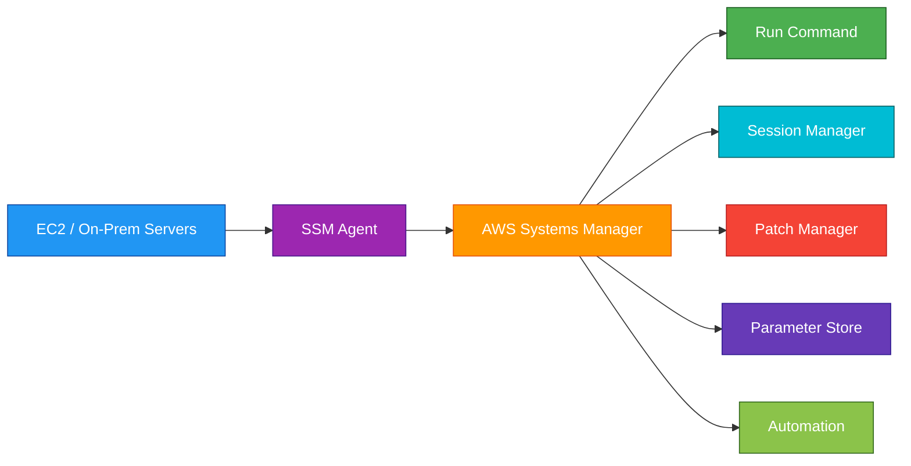
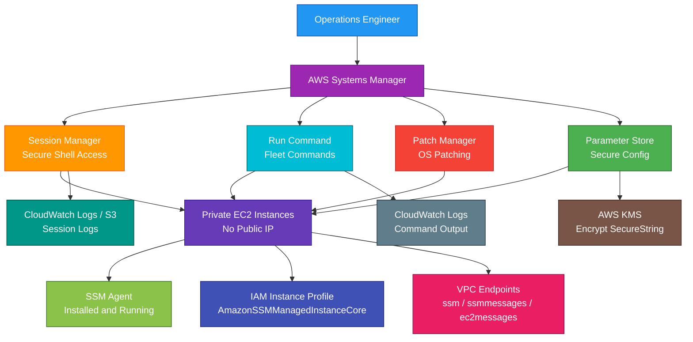

# AWS Systems Manager

<details>
<summary>

## 1. Definition

</summary>

### Simple Definition

AWS Systems Manager is a management service that helps you operate, automate, patch, configure, and securely access AWS resources and hybrid servers.

It gives you one place to manage EC2 instances, on-premises servers, and some other AWS resources.

### Memory Hook

Systems Manager = Manage and automate your servers and operations.

### Basic Idea

Install or use the SSM Agent on managed instances.

Systems Manager can then run commands, patch systems, collect inventory, manage parameters, automate tasks, and provide secure shell access without opening SSH or RDP.



### Key Point

Systems Manager is not one single tool.

It is a collection of operational tools for managing infrastructure and applications.

</details>

<details>
<summary>

## 2. What Problem Does It Solve?

</summary>

### Main Problem

Systems Manager solves the problem of managing many servers and resources safely and consistently.

Instead of logging into each server manually, you can manage fleets of instances from one AWS service.

### Without Systems Manager

You may need to manually handle:

- SSH or RDP access
- OS patching
- Script execution
- Software installation
- Configuration updates
- Secret or parameter storage
- Inventory collection
- Operational runbooks
- Hybrid server management
- Troubleshooting access
- Maintenance windows

### With Systems Manager

You can centrally manage operations using AWS-managed tools.

### Key Benefit

Systems Manager improves operational control, security, automation, and visibility across AWS and hybrid environments.

</details>

<details>
<summary>

## 3. Core Use Cases

</summary>

### Secure Instance Access

Use Session Manager to access EC2 instances without opening SSH port 22 or RDP port 3389.

Example:

Admin connects to a private EC2 instance through the AWS Console or CLI.

### Run Commands at Scale

Use Run Command to execute scripts or commands across many instances.

Examples:

- Restart a service
- Install software
- Check disk space
- Update configuration
- Run troubleshooting commands

### Patch Management

Use Patch Manager to automate operating system patching.

Examples:

- Patch Linux servers
- Patch Windows servers
- Define patch baselines
- Run patching during maintenance windows

### Configuration Management

Use State Manager to keep instances in a desired configuration state.

Examples:

- Ensure CloudWatch Agent is installed
- Ensure antivirus is running
- Ensure a configuration file exists

### Store Parameters and Secrets

Use Parameter Store to store configuration values and secrets.

Examples:

- Database endpoint
- API URL
- Application config
- Encrypted password
- License key

### Operational Automation

Use Automation to run repeatable operational workflows.

Examples:

- Create AMI
- Restart failed service
- Stop unused EC2 instances
- Patch and reboot servers
- Remediate noncompliant resources

### Hybrid Server Management

Use Systems Manager to manage on-premises servers and VMs alongside EC2 instances.

Example:

Patch both AWS EC2 instances and on-premises Linux servers from one place.

### Fleet Visibility

Use Inventory and Fleet Manager to view managed servers, installed software, OS details, and instance status.

</details>

<details>
<summary>

## 4. Important Features for SAA

</summary>

### Managed Instance

A managed instance is a machine that Systems Manager can manage.

It can be:

- EC2 instance
- On-premises server
- Virtual machine in another environment

### SSM Agent

SSM Agent is software installed on managed instances.

It allows Systems Manager to communicate with the instance.

Important point:

Many AWS-provided AMIs already include SSM Agent.

### Instance Profile

EC2 instances need an IAM instance profile with permissions to communicate with Systems Manager.

Common managed policy:

`AmazonSSMManagedInstanceCore`

### Session Manager

Session Manager provides secure shell access to instances.

Benefits:

- No SSH key needed
- No bastion host required
- No inbound port 22 required
- Access controlled by IAM
- Session activity can be logged
- Works with private instances if network access to SSM endpoints exists

### Run Command

Run Command runs commands or scripts on managed instances.

Use it for:

- Administrative tasks
- Troubleshooting
- Software installation
- Configuration changes
- Fleet-wide commands

### Systems Manager Documents

A Systems Manager document, or SSM document, defines actions that Systems Manager performs.

Common document types:

| Document Type | Purpose |
|---|---|
| Command document | Run commands on instances |
| Automation document | Run automation workflows |
| Session document | Configure session behavior |
| Package document | Install or manage software packages |

### AWS-Managed Documents

AWS provides prebuilt documents.

Examples:

- `AWS-RunShellScript`
- `AWS-RunPowerShellScript`
- `AWS-ConfigureAWSPackage`
- `AWS-UpdateSSMAgent`

### Custom Documents

You can create custom SSM documents for your own operational tasks.

Example:

A document that installs company monitoring software and configures logging.

### Patch Manager

Patch Manager automates patching of managed instances.

It supports:

- Patch baselines
- Patch groups
- Maintenance windows
- Compliance reporting
- Linux and Windows patching

### Patch Baseline

A patch baseline defines which patches are approved or rejected.

Example:

Approve critical security patches after 7 days.

### Patch Group

A patch group lets you apply different patch rules to different sets of instances.

Example:

| Patch Group | Patch Rule |
|---|---|
| Dev | Patch weekly |
| Prod | Patch monthly during maintenance window |

### Maintenance Window

A maintenance window defines when operational tasks can run.

Use it for:

- Patching
- Script execution
- Automation tasks
- Software installation
- Controlled production changes

### State Manager

State Manager keeps instances in a desired state.

Example:

Ensure the CloudWatch Agent is installed and configured every day.

### Association

An association connects a State Manager document to targets.

Example:

Run `AWS-ConfigureAWSPackage` on all instances tagged `Environment=Prod`.

### Parameter Store

Parameter Store stores configuration data and secrets.

Parameter types:

| Type | Purpose |
|---|---|
| String | Plain text config |
| StringList | Comma-separated values |
| SecureString | Encrypted value using KMS |

### SecureString

SecureString stores encrypted parameters using AWS KMS.

Use it for sensitive values such as passwords or API keys.

### Parameter Hierarchy

Parameter Store supports hierarchical names.

Example:

```text
/prod/app/database/endpoint
/prod/app/database/password
/dev/app/api/url
```

### Standard and Advanced Parameters

Parameter Store supports standard and advanced parameter tiers.

| Tier | Best For |
|---|---|
| Standard | Basic configuration values |
| Advanced | Larger values, higher limits, policies |

### Parameter Policies

Advanced parameters can use policies.

Examples:

- Expiration
- Expiration notification
- No-change notification

### Automation

Systems Manager Automation runs operational workflows.

Use it to automate repeatable tasks.

Examples:

- Stop and start EC2 instances
- Create AMIs
- Patch instances
- Remediate noncompliant resources
- Update Amazon Machine Images

### Automation Runbook

An automation runbook is an SSM automation document.

It defines steps for an operational workflow.

### OpsCenter

OpsCenter helps operations teams track and resolve operational issues.

An issue in OpsCenter is called an OpsItem.

### OpsItem

An OpsItem is an operational work item.

Examples:

- EC2 instance unhealthy
- Patch compliance failed
- Alarm triggered
- Automation failed

### Fleet Manager

Fleet Manager provides a console-based way to view and manage servers.

Use it to inspect:

- File systems
- Windows registry
- Performance counters
- Processes
- Users and groups
- Instance details

### Inventory

Inventory collects metadata from managed instances.

Examples:

- Installed applications
- AWS components
- Network configuration
- Windows updates
- OS information
- Instance metadata

### Distributor

Distributor helps package and distribute software to managed instances.

Use it for:

- Installing agents
- Deploying internal software
- Managing software packages

### Change Manager

Change Manager helps manage operational change approvals.

Use it when changes need approval before execution.

### Incident Manager

Incident Manager helps coordinate incident response.

Use it for:

- Response plans
- Escalation paths
- On-call contacts
- Incident tracking

### AppConfig

AWS AppConfig helps deploy application configuration safely.

Use it for:

- Feature flags
- Application settings
- Gradual configuration rollout
- Configuration validation
- Rollback on bad config

### Hybrid Activations

Hybrid activations allow Systems Manager to manage non-EC2 machines.

Use this for:

- On-premises servers
- Virtual machines
- Edge servers
- Other cloud VMs

### VPC Endpoints

Private instances need network access to Systems Manager endpoints.

Use VPC endpoints to avoid public internet access.

Common endpoints:

- `ssm`
- `ssmmessages`
- `ec2messages`
- `logs`, if sending logs to CloudWatch
- `kms`, if using encrypted parameters

</details>

<details>
<summary>

## 5. Security Model

</summary>

### IAM Permissions

IAM controls who can use Systems Manager actions.

Common permissions:

| Permission | Purpose |
|---|---|
| `ssm:StartSession` | Start Session Manager session |
| `ssm:SendCommand` | Run command on instances |
| `ssm:GetCommandInvocation` | View command result |
| `ssm:GetParameter` | Read parameter |
| `ssm:GetParameters` | Read multiple parameters |
| `ssm:PutParameter` | Create or update parameter |
| `ssm:StartAutomationExecution` | Start automation workflow |
| `ssm:CreateAssociation` | Create State Manager association |

### EC2 Instance Role

Managed EC2 instances need an IAM role with Systems Manager permissions.

Common policy:

`AmazonSSMManagedInstanceCore`

This allows the instance to communicate with Systems Manager.

### Least Privilege

Give users only the Systems Manager actions they need.

Examples:

- Admins can start sessions on production instances
- Developers can start sessions only on development instances
- Applications can read only specific parameters
- Operators can run only approved documents

### Resource-Level Controls

Use IAM conditions and resource tags to restrict access.

Example:

Allow Session Manager only on instances tagged:

```text
Environment=Dev
```

### Session Manager Security

Session Manager improves security because you can avoid:

- Public SSH access
- Bastion hosts
- Inbound admin ports
- Long-lived SSH keys

### Session Logging

Session Manager sessions can be logged to:

- CloudWatch Logs
- Amazon S3

This supports auditing and compliance.

### Run Command Security

Run Command is powerful.

Restrict who can run commands and which documents they can use.

Bad pattern:

Allow all users to run any shell script on production instances.

Better pattern:

Allow only approved SSM documents on tagged instances.

### Parameter Store Encryption

Use SecureString with KMS for sensitive values.

Example:

Store database password as a SecureString parameter.

### KMS Permissions

To read SecureString parameters, users and roles need both:

- SSM parameter permission
- KMS decrypt permission

Important exam point:

Having `ssm:GetParameter` is not enough if KMS denies decrypt.

### Secrets Handling

Use Parameter Store for configuration and simple secrets.

Use AWS Secrets Manager when you need advanced secret rotation and secret lifecycle management.

### Network Security

Private instances can use VPC endpoints to communicate with Systems Manager privately.

This allows SSM access without:

- Public IP
- NAT Gateway
- Internet Gateway

### No Inbound Ports Required

For Session Manager and Run Command, managed instances initiate outbound communication to Systems Manager.

You do not need inbound SSH or RDP access.

### CloudTrail Auditing

CloudTrail records Systems Manager API activity.

Use it to audit:

- Session starts
- Commands sent
- Parameter changes
- Automation executions
- Document updates

### CloudWatch Monitoring

Use CloudWatch for logs and metrics.

Examples:

- Command output logs
- Session logs
- Automation logs
- Agent health monitoring
- Alarms from operational metrics

### Shared Responsibility

AWS is responsible for:

- Systems Manager managed service infrastructure
- API control plane
- Managed automation service
- Service availability
- Physical security

You are responsible for:

- IAM permissions
- Instance roles
- SSM Agent installation and health
- Patch policies
- Parameter access
- KMS key policies
- Session logging configuration
- Document security
- Network connectivity
- Command and automation safety

</details>

<details>
<summary>

## 6. High Availability / Durability Behavior

</summary>

### Availability

Systems Manager is a managed AWS service.

AWS manages the service infrastructure.

### Regional Service

Systems Manager is regional.

Most Systems Manager resources and operations are tied to a specific AWS Region.

Examples:

- Parameters
- Documents
- Maintenance windows
- Automation executions
- Managed instance registrations

### Managed Instance Connectivity

Managed instances must be able to communicate with Systems Manager endpoints.

Connectivity can be through:

- Internet Gateway
- NAT Gateway
- VPC endpoints
- Hybrid network connectivity for on-premises servers

### SSM Agent Health

Systems Manager depends on SSM Agent running on the managed instance.

If the agent stops or cannot connect, Systems Manager cannot manage the instance.

### No Inbound Admin Port Dependency

Session Manager does not depend on inbound SSH/RDP ports.

This improves operational access resilience for private instances.

### Parameter Store Durability

Parameters are stored by the managed Systems Manager service.

For multi-Region application configuration, you must replicate or define parameters in each required Region.

### Automation Reliability

Automation workflows can use retries, branching, and step outputs.

Still, workflows should be tested before production use.

### Patch Management Reliability

Patch success depends on:

- Instance connectivity
- Package repositories
- OS compatibility
- Maintenance window timing
- Reboot behavior
- Correct patch baseline

### Hybrid Server Behavior

Hybrid managed servers depend on connectivity back to AWS Systems Manager endpoints.

If connectivity is lost, management operations may fail until restored.

### Multi-Region Behavior

Systems Manager does not automatically synchronize all configuration across Regions.

For Multi-Region workloads, plan:

- Parameter replication
- Automation documents in each Region
- Patch policies per Region
- VPC endpoints per Region
- Regional IAM and KMS access

### Important Exam Point

Systems Manager improves operational management, but instances must have SSM Agent, IAM permissions, and network connectivity to SSM endpoints.

</details>

<details>
<summary>

## 7. Cost Optimization Options

</summary>

### Use Session Manager Instead of Bastion Hosts

Session Manager can reduce cost by removing the need for always-running bastion hosts.

Benefits:

- No bastion EC2 cost
- No public admin access
- Centralized IAM control
- Session logging

### Use VPC Endpoints Carefully

VPC endpoints improve private connectivity but can add cost.

Use them when security or architecture requires private access.

### Parameter Store Standard Tier

Use standard parameters for normal configuration values.

Use advanced parameters only when needed for higher limits or policies.

### Use Secrets Manager Only When Needed

Parameter Store can be cheaper for simple secure configuration.

Use Secrets Manager when you need features like automatic rotation.

### Automate Stop/Start of Instances

Use Automation to stop non-production EC2 instances during off-hours.

Example:

Stop dev instances at night and start them in the morning.

### Patch During Planned Windows

Use maintenance windows to avoid unexpected downtime and reduce operational risk.

### Reduce Manual Operations

Automating repeatable tasks reduces human effort and errors.

Examples:

- AMI creation
- Patching
- Software installation
- Restart procedures
- Cleanup tasks

### Clean Up Old Parameters

Delete unused parameters.

Old parameters can create confusion and possible security risk.

### Set Log Retention

CloudWatch Logs from sessions, commands, and automations can grow.

Set log retention periods based on compliance needs.

### Use Tags for Targeting

Tags help target only the needed instances.

This avoids running commands or patching on unnecessary resources.

### Avoid Over-Automation Mistakes

Automation can save cost, but bad automation can cause outages.

Test documents and automation runbooks before production.

</details>

<details>
<summary>

## 8. Common Exam Traps

</summary>

### Systems Manager vs CloudFormation

CloudFormation provisions infrastructure.

Systems Manager operates and manages resources after they exist.

| Requirement | Choose |
|---|---|
| Create AWS resources from templates | CloudFormation |
| Run commands, patch, configure, or access instances | Systems Manager |

### Systems Manager vs CloudWatch

CloudWatch monitors metrics, logs, alarms, and dashboards.

Systems Manager performs operational management tasks.

| Requirement | Choose |
|---|---|
| Monitor CPU and create alarms | CloudWatch |
| Patch instances or run commands | Systems Manager |

### Systems Manager vs AWS Config

AWS Config tracks resource configuration and compliance.

Systems Manager manages and remediates resources.

### Systems Manager vs Secrets Manager

Parameter Store can store configuration and simple secrets.

Secrets Manager is better for automatic secret rotation and advanced secret management.

| Requirement | Choose |
|---|---|
| Store app config or simple encrypted parameter | Parameter Store |
| Store and rotate database credentials | Secrets Manager |

### Session Manager vs SSH

Session Manager can replace SSH for many admin access use cases.

If the exam says no open inbound ports, no bastion host, and secure instance access, think Session Manager.

### Run Command vs Session Manager

Run Command executes commands across one or many instances.

Session Manager gives interactive shell access.

### Patch Manager vs Inspector

Patch Manager applies patches.

Inspector detects vulnerabilities.

| Requirement | Choose |
|---|---|
| Apply OS patches | Patch Manager |
| Scan for vulnerabilities/CVEs | Inspector |

### State Manager vs Automation

State Manager keeps configuration in a desired state.

Automation runs operational workflows.

### Parameter Store Is Regional

Parameters are regional.

Do not assume a parameter created in one Region exists in another.

### KMS Permission Trap

For SecureString parameters, both SSM and KMS permissions are needed.

### SSM Agent Required

If the instance is not appearing as managed, check:

- SSM Agent installed
- SSM Agent running
- IAM instance profile
- Network connectivity
- Region configuration

### Private Instance Access

Private EC2 instances can use Systems Manager if they have SSM connectivity.

They do not need public IPs.

### Maintenance Window Does Not Mean Patch Baseline

A maintenance window defines when tasks run.

A patch baseline defines which patches are approved.

</details>

<details>
<summary>

## 9. Compare With Similar Services

</summary>

### Service Comparison Table

| Service | Main Purpose | Best For | Choose When |
|---|---|---|---|
| AWS Systems Manager | Operations management | Managing, patching, accessing, and automating servers | You need operational control over EC2 or hybrid instances |
| AWS CloudFormation | Infrastructure as Code | Creating AWS resources from templates | You need repeatable provisioning |
| Amazon CloudWatch | Monitoring and observability | Metrics, logs, alarms, dashboards | You need monitoring and alerts |
| AWS Config | Configuration tracking and compliance | Resource history and compliance rules | You need compliance evaluation |
| AWS Secrets Manager | Secret storage and rotation | Rotating credentials and secrets | You need automatic secret rotation |
| AWS OpsWorks | Configuration management with Chef/Puppet | Legacy config management patterns | You need Chef/Puppet-style management |
| AWS Backup | Backup management | Centralized backup policies | You need backup and restore |

### Systems Manager vs CloudFormation

| Feature | Systems Manager | CloudFormation |
|---|---|---|
| Main purpose | Operate and manage resources | Provision resources |
| Example | Patch EC2 instance | Create EC2 instance |
| State | Operational management | Infrastructure desired state |
| Best for | Commands, patching, access, automation | Infrastructure deployment |

### Systems Manager vs CloudWatch

| Feature | Systems Manager | CloudWatch |
|---|---|---|
| Main purpose | Operational actions | Monitoring |
| Logs | Can send command/session logs | Stores and analyzes logs |
| Alarms | Not main feature | Core feature |
| Example | Run patch command | Alarm on high CPU |

### Systems Manager vs AWS Config

| Feature | Systems Manager | AWS Config |
|---|---|---|
| Main purpose | Manage and remediate | Track and evaluate configuration |
| Example | Run automation to fix issue | Detect noncompliant resource |
| Resource history | Limited | Strong feature |
| Common use together | Fix findings | Detect findings |

### Parameter Store vs Secrets Manager

| Feature | Parameter Store | Secrets Manager |
|---|---|---|
| Main purpose | Config and simple secrets | Secrets with lifecycle management |
| Secret rotation | Limited/custom | Built-in rotation support |
| Cost | Often lower for simple use | More advanced features |
| Best for | App config, simple secure values | Database credentials and rotated secrets |

### Session Manager vs Bastion Host

| Feature | Session Manager | Bastion Host |
|---|---|---|
| Inbound SSH needed | No | Usually yes |
| Public IP needed | No | Often yes |
| Access control | IAM | SSH keys/users |
| Logging | Built-in options | Must configure |
| Best for | Secure managed access | Legacy SSH access pattern |

### When to Choose Systems Manager

Choose Systems Manager when:

- You need secure access to EC2 without SSH/RDP
- You need to run commands across instances
- You need OS patch management
- You need to store app configuration parameters
- You need encrypted SecureString parameters
- You need automation runbooks
- You need to manage hybrid servers
- You need maintenance windows
- You need inventory collection
- You need operational issue tracking
- You want to reduce manual server administration

</details>

<details>
<summary>

## 10. Mini Architecture Example

</summary>

### Scenario

A company runs private EC2 instances in private subnets.

Security does not allow SSH from the internet.

The operations team needs secure access, patching, command execution, and encrypted application configuration.

### Architecture

Install and run SSM Agent on EC2 instances.

Attach an IAM instance profile with `AmazonSSMManagedInstanceCore`.

Use VPC endpoints for private connectivity to Systems Manager.

Use Session Manager for secure shell access.

Use Patch Manager for OS patching.

Use Parameter Store for encrypted application configuration.



### Why This Is Good

- EC2 instances stay private with no public IP
- No inbound SSH or RDP ports are required
- Session Manager provides secure access controlled by IAM
- Session logs can be stored in CloudWatch Logs or S3
- Run Command executes tasks across many instances
- Patch Manager automates operating system patching
- Parameter Store stores application configuration
- SecureString parameters are encrypted with KMS
- VPC endpoints allow private Systems Manager access
- IAM instance profile allows EC2 to communicate with Systems Manager
- CloudTrail can audit Systems Manager API actions

### Exam Answer Pattern

If the question says:

“Access private EC2 instances securely without SSH, RDP, bastion hosts, or public IPs.”

Think:

Systems Manager Session Manager.

If the question says:

“Run commands across many EC2 instances.”

Think:

Systems Manager Run Command.

If the question says:

“Automate operating system patching.”

Think:

Systems Manager Patch Manager.

If the question says:

“Store configuration values and encrypted parameters.”

Think:

Systems Manager Parameter Store.

### Final Memory Hook

Systems Manager = Operations management.

SSM Agent = Required on managed instances.

Managed instance = EC2 or hybrid server managed by SSM.

Session Manager = Secure shell access without SSH/RDP.

Run Command = Run commands at scale.

Patch Manager = Apply OS patches.

Patch baseline = Which patches are approved.

Patch group = Which instances use patch rules.

Maintenance window = When tasks run.

State Manager = Keep desired configuration.

Association = Applies state to targets.

Parameter Store = Store config and simple secrets.

SecureString = Encrypted parameter with KMS.

Automation = Run operational workflows.

Runbook = Automation document.

Inventory = Collect instance metadata.

Fleet Manager = View and manage servers.

Distributor = Deploy software packages.

OpsCenter = Track operational issues.

AppConfig = Safe app configuration deployment.

VPC endpoints = Private SSM connectivity.

CloudFormation = Provision infrastructure.

CloudWatch = Monitor and alarm.

AWS Config = Track compliance.

Secrets Manager = Rotate secrets.

</details>