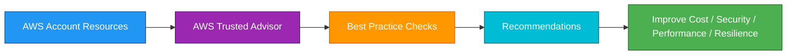
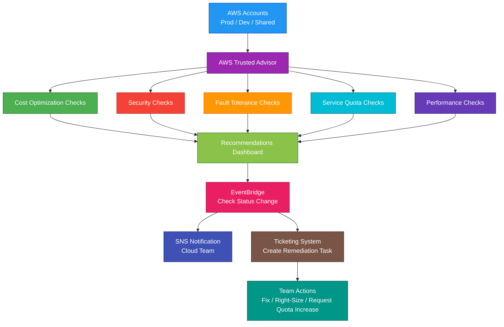

# AWS Trusted Advisor

## 1. Definition

### Simple Definition

AWS Trusted Advisor is an AWS service that gives recommendations to help improve your AWS environment.

It checks your AWS account and suggests improvements for cost, security, performance, fault tolerance, and service quotas.

### Memory Hook

Trusted Advisor = AWS best-practice recommendation checker.

### Basic Idea

Trusted Advisor scans your AWS account settings and usage.

Then it shows recommendations called checks.

### Key Point

Trusted Advisor does not automatically fix everything.

It gives recommendations.

You review the recommendations and decide what actions to take.

## 2. What Problem Does It Solve?

### Main Problem

Trusted Advisor solves the problem of knowing whether your AWS account follows common AWS best practices.

It helps identify:

- Wasted resources
- Security risks
- Performance issues
- Fault tolerance gaps
- Service quota risks

### Without Trusted Advisor

You may miss issues such as:

- Underused EC2 instances
- Idle load balancers
- Open security groups
- Missing MFA on root account
- Low EBS volume usage
- S3 bucket permission risks
- Approaching service quotas
- Single-AZ architecture risks

### With Trusted Advisor

AWS gives a dashboard of checks and recommendations so you can improve your environment.

### Key Benefit

Trusted Advisor helps improve your AWS account health without manually checking every service yourself.

## 3. Core Use Cases

### Cost Optimization

Trusted Advisor can identify resources that may be wasting money.

Examples:

- Idle load balancers
- Underutilized EC2 instances
- Unassociated Elastic IP addresses
- Low-utilization EBS volumes
- Unused RDS resources

### Security Improvement

Trusted Advisor can identify common security risks.

Examples:

- Root account MFA not enabled
- Security groups allowing unrestricted access
- IAM access keys not rotated
- Public S3 bucket access risks
- Exposed ports

### Fault Tolerance Review

Trusted Advisor can help identify resilience issues.

Examples:

- Resources not spread across Availability Zones
- Low backup coverage
- Missing redundancy
- ELB configuration issues

### Performance Improvement

Trusted Advisor can identify resources or configurations that may affect performance.

Examples:

- High utilization resources
- EBS optimization opportunities
- CloudFront performance suggestions
- EC2 instance configuration recommendations

### Service Quota Monitoring

Trusted Advisor can warn when usage is near service quotas.

Examples:

- EC2 instance limits
- VPC limits
- EBS volume limits
- Elastic IP limits
- Load balancer limits

### Regular Account Health Review

Use Trusted Advisor during regular cloud governance reviews.

Example:

A cloud team reviews Trusted Advisor every week to find cost, security, and quota issues.

### Multi-Account Governance

In larger organizations, Trusted Advisor can be used with AWS Organizations and support features to review multiple accounts centrally.

## 4. Important Features for SAA

### Trusted Advisor Checks

A check is a best-practice rule that evaluates your AWS environment.

Examples:

- Is root MFA enabled?
- Are security groups open to the world?
- Are EC2 instances underutilized?
- Are service quotas close to being reached?

### Check Categories

Trusted Advisor checks are grouped into major categories.

| Category | What It Focuses On |
|---|---|
| Cost Optimization | Reduce waste and lower cost |
| Performance | Improve speed and efficiency |
| Security | Reduce security risks |
| Fault Tolerance | Improve availability and resilience |
| Service Quotas | Avoid reaching AWS limits |

### Cost Optimization Checks

Cost checks help find unused or underused resources.

Examples:

- Idle load balancers
- Underutilized EC2 instances
- Unassociated Elastic IP addresses
- Low-utilization EBS volumes

### Security Checks

Security checks help identify common security weaknesses.

Examples:

- Root account MFA
- Open security groups
- IAM access key rotation
- S3 bucket permissions

### Fault Tolerance Checks

Fault tolerance checks help identify architecture risks.

Examples:

- Load balancer health
- Availability Zone distribution
- Backup configuration
- Redundancy gaps

### Performance Checks

Performance checks help identify configurations that may reduce efficiency.

Examples:

- High resource utilization
- EBS performance configuration
- CloudFront usage opportunities

### Service Quota Checks

Service quota checks warn when account usage is close to AWS service limits.

Important point:

Service quota warnings help avoid deployment failures caused by quota limits.

### Check Status Colors

Trusted Advisor uses status indicators.

| Status | Meaning |
|---|---|
| Green | No problem detected |
| Yellow | Investigation recommended |
| Red | Action recommended |
| Gray | Check data unavailable or excluded |

### Refreshing Checks

Trusted Advisor checks can be refreshed.

Some checks refresh automatically.

Some can be refreshed manually depending on the check and support plan.

### Support Plan Dependency

Trusted Advisor access depends on the AWS Support plan.

Basic and Developer Support usually provide access to a limited set of core checks.

Business, Enterprise On-Ramp, and Enterprise Support provide access to more Trusted Advisor checks.

### Core Checks

Core checks usually include important security and service quota checks.

For exam purposes:

More advanced Trusted Advisor checks require higher support plans.

### Trusted Advisor Dashboard

The dashboard shows check results across categories.

It helps quickly identify:

- Critical recommendations
- Warning recommendations
- Estimated monthly savings
- Service quota risks
- Security findings

### Recommended Action

Each check includes recommended actions.

Example:

If a security group allows SSH from `0.0.0.0/0`, Trusted Advisor recommends restricting access.

### Excluded Items

You can exclude resources from some checks.

Use this carefully when a recommendation is not applicable.

### Notifications

Trusted Advisor can send notifications about check results.

This helps teams stay aware of important changes.

### AWS Support API

Some Trusted Advisor data can be accessed through AWS Support API features, depending on the support plan.

This can support automation and reporting.

### EventBridge Integration

Trusted Advisor check status changes can be integrated with event-driven workflows.

Example:

A high-risk check result can trigger a notification or ticket.

### AWS Organizations View

Trusted Advisor can support organization-level visibility for multiple accounts when configured with supported plans and account structures.

This helps central cloud teams review recommendations across accounts.

## 5. Security Model

### IAM Permissions

IAM controls who can view and manage Trusted Advisor information.

Common permissions:

| Permission | Purpose |
|---|---|
| `trustedadvisor:DescribeChecks` | View available checks |
| `trustedadvisor:DescribeCheckResult` | View check results |
| `trustedadvisor:DescribeCheckSummaries` | View check summaries |
| `trustedadvisor:RefreshCheck` | Refresh a check |
| `support:*` | Access AWS Support API features for older/support-related Trusted Advisor operations |

### Least Privilege

Give users only the Trusted Advisor access they need.

Examples:

- Finance team can view cost recommendations
- Security team can view security recommendations
- Cloud admins can refresh checks and manage exclusions

### Read-Only Access

Some users may only need to view recommendations.

Use read-only permissions where possible.

### Administrative Access

Only trusted cloud administrators should be able to manage Trusted Advisor settings, exclusions, and support-related operations.

### Data Visibility

Trusted Advisor recommendations can reveal information about your AWS environment.

Examples:

- Resource IDs
- Security group rules
- Account usage
- Cost-saving opportunities
- Quota usage

Protect access to this information.

### Security Recommendations

Trusted Advisor can help identify risks, but it does not replace a full security program.

Use it with:

- IAM Access Analyzer
- AWS Config
- GuardDuty
- Security Hub
- Inspector
- Macie
- CloudTrail

### Encryption

Trusted Advisor is not an encryption service.

Use encryption services separately:

- KMS for encryption keys
- ACM for TLS certificates
- S3/EBS/RDS encryption for data at rest
- TLS/HTTPS for data in transit

### Shared Responsibility

AWS is responsible for:

- Trusted Advisor managed service infrastructure
- Running best-practice checks
- Maintaining recommendation logic
- Service availability
- Physical security

You are responsible for:

- Reviewing recommendations
- Applying fixes
- IAM access to Trusted Advisor
- Acting on security findings
- Acting on cost findings
- Requesting quota increases
- Monitoring recommendations regularly
- Deciding which recommendations are valid for your environment

## 6. High Availability / Durability Behavior

### Availability

Trusted Advisor is a managed AWS service.

AWS manages the service infrastructure.

### Regional and Global View

Trusted Advisor can evaluate resources across AWS services and Regions depending on the check.

Some checks are global.

Some checks are Region-specific.

### No Multi-AZ Configuration

You do not configure Multi-AZ for Trusted Advisor.

AWS manages the service.

### Fault Tolerance Role

Trusted Advisor does not make your application highly available automatically.

It identifies recommendations that can improve fault tolerance.

Examples:

- Use multiple Availability Zones
- Improve load balancer health
- Improve backup coverage
- Address quota risks

### Durability

Trusted Advisor is not a storage or backup service.

It does not protect application data.

Use other AWS services for durability:

- S3
- EBS snapshots
- RDS backups
- AWS Backup
- DynamoDB backups
- EFS backups

### Recommendation Durability

Trusted Advisor stores check results and recommendations as part of the managed service.

For audit or long-term governance, export or record recommendations using reporting workflows if needed.

### Multi-Account Visibility

For organizations with many accounts, centralized Trusted Advisor visibility can help improve resilience across the environment.

### Important Exam Point

Trusted Advisor recommends improvements, but you must implement the architecture changes yourself.

## 7. Cost Optimization Options

### Use Cost Optimization Checks

Trusted Advisor can identify cost-saving opportunities.

Examples:

- Underutilized EC2 instances
- Idle load balancers
- Unassociated Elastic IPs
- Low-use EBS volumes
- Unused resources

### Review Estimated Savings

Trusted Advisor may show estimated monthly savings for some cost checks.

Use this to prioritize cleanup work.

### Clean Up Idle Resources

Common cleanup actions:

- Delete idle load balancers
- Release unused Elastic IPs
- Remove unused EBS volumes
- Stop or right-size underused EC2 instances
- Delete unused snapshots where appropriate

### Right-Size Resources

Trusted Advisor can help identify resources that may be overprovisioned.

Right-sizing can reduce cost without reducing performance.

### Monitor Service Quotas

Quota checks can prevent failed deployments.

Example:

If EC2 usage is near quota, request a quota increase before a scaling event.

### Use Notifications

Set up notifications or automated workflows for important cost-related checks.

This helps teams respond before waste becomes large.

### Review Regularly

Trusted Advisor is most useful when reviewed regularly.

Suggested review rhythm:

- Weekly for cost checks
- Weekly or daily for security checks
- Before major launches for quota checks
- Before architecture reviews for fault tolerance checks

### Combine With Other Cost Tools

Use Trusted Advisor with:

- AWS Cost Explorer
- AWS Budgets
- AWS Compute Optimizer
- AWS Cost and Usage Reports
- Savings Plans recommendations

### Avoid Blind Deletion

Do not delete resources only because Trusted Advisor marks them underused.

Confirm business need first.

Example:

A low-utilization standby resource may be required for disaster recovery.

## 8. Common Exam Traps

### Trusted Advisor vs AWS Config

Trusted Advisor gives best-practice recommendations.

AWS Config records resource configuration history and evaluates compliance rules.

| Requirement | Choose |
|---|---|
| Best-practice recommendations | Trusted Advisor |
| Track resource configuration changes | AWS Config |
| Evaluate custom compliance rules | AWS Config |

### Trusted Advisor vs Compute Optimizer

Compute Optimizer gives resource right-sizing recommendations.

Trusted Advisor gives broader account recommendations across cost, security, performance, fault tolerance, and quotas.

### Trusted Advisor vs Security Hub

Security Hub aggregates security findings and checks security standards.

Trusted Advisor provides best-practice recommendations, including some security checks.

### Trusted Advisor vs GuardDuty

GuardDuty detects suspicious or malicious activity.

Trusted Advisor provides best-practice checks.

If the question says threat detection, choose GuardDuty.

### Trusted Advisor vs Inspector

Inspector scans workloads for vulnerabilities.

Trusted Advisor gives account-level best-practice recommendations.

If the question says CVE or vulnerability scanning, choose Inspector.

### Trusted Advisor vs Budgets

AWS Budgets alerts when cost or usage crosses thresholds.

Trusted Advisor recommends ways to improve cost and account health.

### Trusted Advisor Does Not Auto-Fix

Trusted Advisor usually recommends actions.

It does not automatically remediate resources unless you build automation.

### Support Plan Matters

Not every account gets every Trusted Advisor check.

More complete Trusted Advisor access requires higher AWS Support plans.

### Trusted Advisor Is Not a Monitoring Alarm Service

For metrics and alarms, use CloudWatch.

Trusted Advisor is for best-practice checks and recommendations.

### Service Quota Warnings Are Not Quota Increases

Trusted Advisor can warn that you are near a quota.

You still need to request or manage quota increases.

### Recommendations Need Context

A recommendation may not always be wrong.

Example:

A low-utilization resource may be intentionally kept for standby or compliance reasons.

## 9. Compare With Similar Services

### Service Comparison Table

| Service | Main Purpose | Best For | Choose When |
|---|---|---|---|
| AWS Trusted Advisor | Best-practice recommendations | Cost, security, performance, fault tolerance, quota checks | You need account health recommendations |
| AWS Config | Configuration tracking and compliance | Resource history and compliance rules | You need to track and evaluate resource configuration |
| AWS Compute Optimizer | Resource right-sizing | EC2, EBS, Lambda, ECS recommendations | You need compute performance and cost recommendations |
| AWS Cost Explorer | Cost analysis | Spend trends and cost breakdowns | You need to analyze AWS spending |
| AWS Budgets | Cost and usage alerts | Budget thresholds and alerts | You need alerts when spending exceeds limits |
| AWS Security Hub | Security findings aggregation | Central security posture dashboard | You need centralized security findings |
| Amazon GuardDuty | Threat detection | Suspicious activity detection | You need to detect malicious behavior |

### Trusted Advisor vs AWS Config

| Feature | Trusted Advisor | AWS Config |
|---|---|---|
| Main purpose | Best-practice recommendations | Configuration tracking and compliance |
| Resource history | No detailed config timeline | Yes |
| Custom rules | Limited | Yes |
| Example | Warns about open security groups | Tracks who changed a security group |
| Best for | Account health recommendations | Compliance and configuration governance |

### Trusted Advisor vs Compute Optimizer

| Feature | Trusted Advisor | Compute Optimizer |
|---|---|---|
| Main purpose | Broad best-practice checks | Resource right-sizing |
| Scope | Cost, security, performance, fault tolerance, quotas | Compute and performance optimization |
| Example | Idle load balancer | EC2 instance should be downsized |
| Best for | General recommendations | Detailed compute optimization |

### Trusted Advisor vs Cost Explorer

| Feature | Trusted Advisor | Cost Explorer |
|---|---|---|
| Main purpose | Cost-saving recommendations | Cost analysis and trends |
| Shows spend history | Limited | Yes |
| Finds idle resources | Yes | Not primary purpose |
| Best for | What to fix | Where money is going |

### Trusted Advisor vs Security Hub

| Feature | Trusted Advisor | Security Hub |
|---|---|---|
| Main purpose | Best-practice checks | Security findings aggregation |
| Security standards | Limited | Stronger focus |
| Receives findings from many services | No | Yes |
| Best for | General account recommendations | Central security posture |

### Trusted Advisor vs GuardDuty

| Feature | Trusted Advisor | GuardDuty |
|---|---|---|
| Main purpose | Best-practice recommendations | Threat detection |
| Detects active threats | No | Yes |
| Example | Root MFA not enabled | IAM key used from malicious IP |
| Best for | Improving account health | Detecting suspicious activity |

### When to Choose Trusted Advisor

Choose Trusted Advisor when:

- You need AWS best-practice recommendations
- You need cost optimization suggestions
- You need account-level security recommendations
- You need performance improvement suggestions
- You need fault tolerance recommendations
- You need service quota warnings
- You want regular AWS account health checks
- You want guidance without manually auditing every resource

## 10. Mini Architecture Example

### Scenario

A company runs workloads in multiple AWS accounts.

The cloud team wants to reduce waste, improve security, and avoid service quota problems before a major product launch.

### Architecture

Use AWS Trusted Advisor to review accounts.

Send important check status changes to EventBridge.

Notify teams through SNS.

Create tickets for critical findings.

Use AWS Organizations and centralized governance tools for multi-account visibility.

### Why This Is Good

- Trusted Advisor gives account health recommendations
- Cost checks help reduce waste
- Security checks identify common risks
- Fault tolerance checks help improve resilience
- Service quota checks help prevent launch failures
- Performance checks help identify improvement opportunities
- EventBridge can trigger automated notifications
- SNS alerts the cloud team
- Tickets help track remediation
- Teams still review and apply fixes intentionally

### Exam Answer Pattern

If the question says:

“Get AWS best-practice recommendations for cost, security, performance, fault tolerance, and service quotas.”

Think:

AWS Trusted Advisor.

If the question says:

“Track AWS resource configuration changes and compliance history.”

Think:

AWS Config.

If the question says:

“Detect suspicious activity or compromised credentials.”

Think:

Amazon GuardDuty.

If the question says:

“Find software vulnerabilities in EC2, ECR, or Lambda.”

Think:

Amazon Inspector.

### Final Memory Hook

Trusted Advisor = Best-practice recommendation checker.

Cost Optimization = Find waste.

Security = Find common risks.

Performance = Improve efficiency.

Fault Tolerance = Improve resilience.

Service Quotas = Avoid limit problems.

Green = OK.

Yellow = Investigate.

Red = Action recommended.

Support plan = Controls check access.

Config = Configuration history and compliance.

Compute Optimizer = Right-sizing.

GuardDuty = Threat detection.

Inspector = Vulnerability scanning.

Security Hub = Central security findings.

CloudWatch = Metrics and alarms.

