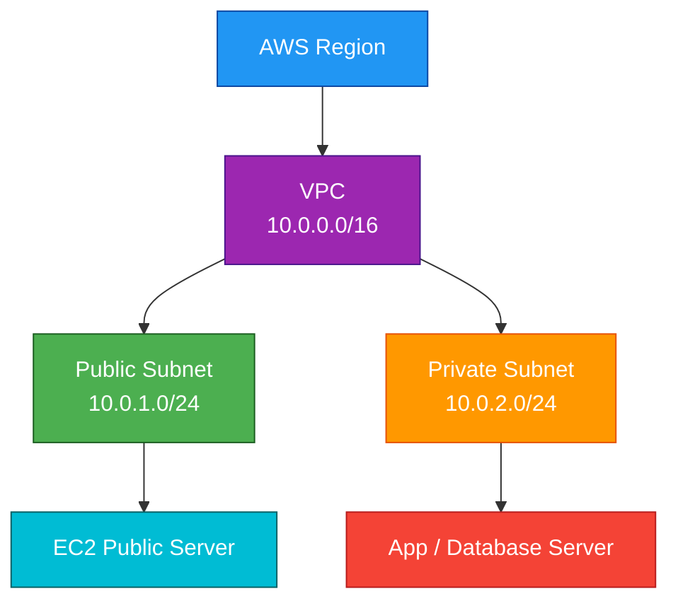
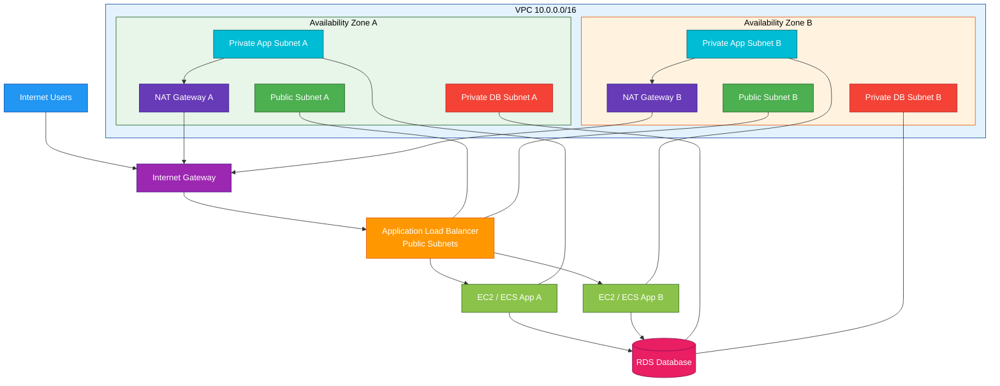

# VPC

## 1. Definition

### Simple Definition

Amazon VPC, or Virtual Private Cloud, is your private network inside AWS.

It lets you launch AWS resources like EC2, RDS, and ECS into a logically isolated network that you control.

### Memory Hook

VPC = Virtual Private Cloud network.

### Basic Idea

A VPC is like your own data center network in AWS.

You control:

- IP address ranges
- Subnets
- Route tables
- Internet access
- Security rules
- Network connectivity

## 2. What Problem Does It Solve?

### Main Problem

VPC solves the problem of securely running cloud resources inside a controlled network.

Without a VPC, you would not have a clean way to isolate resources, control traffic, or design private and public network areas.

### Without VPC

You would have limited control over:

- IP ranges
- Public and private network design
- Routing
- Internet access
- Security boundaries
- Hybrid connectivity

### With VPC

You can build your own cloud network with:

- Public subnets for internet-facing resources
- Private subnets for internal resources
- Security groups and NACLs for traffic control
- Route tables for traffic direction
- VPN or Direct Connect for on-premises connectivity

### Key Benefit

VPC gives you network isolation, security control, and flexible connectivity in AWS.

## 3. Core Use Cases

### Hosting Web Applications

Use public and private subnets to host secure web applications.

Example:

- Load balancer in public subnets
- Application servers in private subnets
- Database in private subnets

### Isolating Environments

Create separate VPCs for:

- Development
- Testing
- Production
- Shared services

### Private Databases

Place RDS, ElastiCache, or internal services in private subnets.

These resources should not be directly reachable from the internet.

### Hybrid Connectivity

Connect AWS to on-premises networks using:

- Site-to-Site VPN
- AWS Direct Connect
- Transit Gateway

### Multi-Tier Architectures

A common design is:

- Public subnet for load balancer
- Private subnet for application servers
- Private isolated subnet for databases

### Private Access to AWS Services

Use VPC endpoints to privately access AWS services without sending traffic over the public internet.

Examples:

- S3 Gateway Endpoint
- DynamoDB Gateway Endpoint
- Interface Endpoints using AWS PrivateLink

## 4. Important Features for SAA

### CIDR Block

A CIDR block defines the IP address range of your VPC.

Example:

`10.0.0.0/16`

This gives the VPC a large private IP range that can be divided into subnets.

### Subnets

A subnet is a smaller network range inside a VPC.

Each subnet exists in one Availability Zone.

| Subnet Type | Purpose |
|---|---|
| Public Subnet | Resources that need direct internet access |
| Private Subnet | Resources that should not be directly reachable from the internet |
| Isolated Subnet | No direct internet route |

### Public Subnet

A subnet is public if its route table has a route to an Internet Gateway.

Example route:

| Destination | Target |
|---|---|
| `0.0.0.0/0` | Internet Gateway |

### Private Subnet

A subnet is private if it does not have a direct route to an Internet Gateway.

Private subnet resources can still access the internet through a NAT Gateway.

### Internet Gateway

An Internet Gateway allows communication between a VPC and the internet.

Important points:

- Attached to a VPC
- Required for public internet access
- Used by public subnets
- Horizontally scaled and highly available

### NAT Gateway

A NAT Gateway allows resources in private subnets to access the internet outbound.

Important points:

- Used for outbound internet access from private subnets
- Does not allow inbound internet access to private instances
- Placed in a public subnet
- Requires an Elastic IP
- Highly available within an Availability Zone

### NAT Gateway High Availability

For high availability, deploy one NAT Gateway per Availability Zone.

Private subnets in each AZ should route to the NAT Gateway in the same AZ.

### Route Tables

Route tables control where network traffic goes.

Each subnet is associated with a route table.

Example public route table:

| Destination | Target |
|---|---|
| `10.0.0.0/16` | Local |
| `0.0.0.0/0` | Internet Gateway |

Example private route table:

| Destination | Target |
|---|---|
| `10.0.0.0/16` | Local |
| `0.0.0.0/0` | NAT Gateway |

### Security Groups

Security groups are virtual firewalls attached to resources like EC2 instances or ENIs.

Important points:

- Stateful
- Allow rules only
- Applied at instance or ENI level
- Return traffic is automatically allowed

### Network ACLs

Network ACLs, or NACLs, are subnet-level firewalls.

Important points:

- Stateless
- Allow and deny rules
- Applied at subnet level
- Rules are evaluated in number order
- Return traffic must be explicitly allowed

### Security Groups vs NACLs

| Feature | Security Group | NACL |
|---|---|---|
| Level | Instance/ENI | Subnet |
| Stateful | Yes | No |
| Rules | Allow only | Allow and deny |
| Return traffic | Automatically allowed | Must be explicitly allowed |
| Common use | Main instance firewall | Extra subnet guardrail |

### Elastic Network Interface

An Elastic Network Interface, or ENI, is a virtual network card in a VPC.

EC2 instances use ENIs to connect to the VPC network.

### Elastic IP

An Elastic IP is a static public IPv4 address.

Use it when a resource needs a fixed public IP.

Common examples:

- NAT Gateway
- Public EC2 instance
- Bastion host

### VPC Endpoints

VPC endpoints allow private access to AWS services.

| Endpoint Type | Used For |
|---|---|
| Gateway Endpoint | S3 and DynamoDB |
| Interface Endpoint | Most AWS services using PrivateLink |

### VPC Peering

VPC Peering connects two VPCs privately.

Important points:

- Non-transitive
- No overlapping CIDR blocks
- Works across accounts and Regions
- Route tables must be updated

### Transit Gateway

Transit Gateway is a central hub for connecting many VPCs and on-premises networks.

Use it when VPC Peering becomes too complex.

### VPC Flow Logs

VPC Flow Logs capture network traffic metadata.

They help with:

- Troubleshooting connectivity
- Security analysis
- Auditing traffic patterns

Flow Logs can be sent to:

- CloudWatch Logs
- S3
- Kinesis Data Firehose

### DNS in VPC

VPC supports DNS resolution and DNS hostnames.

Important options:

| Setting | Purpose |
|---|---|
| DNS resolution | Allows instances to resolve DNS names |
| DNS hostnames | Assigns DNS names to instances with public IPs |

## 5. Security Model

### IAM Permissions

IAM controls who can create and manage VPC resources.

Common permissions:

| Permission | Purpose |
|---|---|
| `ec2:CreateVpc` | Create a VPC |
| `ec2:CreateSubnet` | Create subnets |
| `ec2:CreateRouteTable` | Create route tables |
| `ec2:AuthorizeSecurityGroupIngress` | Add inbound security group rules |
| `ec2:CreateVpcEndpoint` | Create VPC endpoints |
| `ec2:CreateFlowLogs` | Enable VPC Flow Logs |

### Security Groups

Security groups are the main firewall for EC2 and many other VPC resources.

Example web server security group:

| Direction | Rule |
|---|---|
| Inbound | Allow HTTP/HTTPS from internet |
| Inbound | Allow SSH only from trusted IP |
| Outbound | Allow required outbound traffic |

### Network ACLs

NACLs add subnet-level control.

They are useful when you need explicit deny rules.

Example:

Deny traffic from a known bad IP range at the subnet boundary.

### Private Subnets

Place sensitive resources in private subnets.

Examples:

- Databases
- Application servers
- Internal services
- Cache clusters

### VPC Endpoints for Private Access

Use VPC endpoints to keep traffic private between your VPC and supported AWS services.

Example:

Private EC2 instance accesses S3 through an S3 Gateway Endpoint instead of the internet.

### Encryption in Transit

VPC itself provides networking, not automatic application encryption.

Use encryption protocols such as:

- HTTPS
- TLS
- SSH
- VPN
- IPsec

### Encryption at Rest

VPC does not encrypt storage by itself.

Use service-level encryption for resources inside the VPC.

Examples:

- EBS encryption
- RDS encryption
- S3 encryption
- EFS encryption

### Shared Responsibility

AWS is responsible for:

- Physical network infrastructure
- VPC service availability
- Underlying network virtualization
- Managed service infrastructure

You are responsible for:

- CIDR planning
- Subnet design
- Route tables
- Security groups
- NACLs
- VPC endpoint policies
- Flow log configuration
- Resource-level encryption

## 6. High Availability / Durability Behavior

### Availability

A VPC exists within one AWS Region.

Subnets exist within one Availability Zone.

To design for high availability, deploy resources across multiple Availability Zones.

### Multi-AZ Design

A good VPC design uses at least two Availability Zones.

Example:

| AZ | Public Subnet | Private Subnet |
|---|---|---|
| AZ-A | Public subnet A | Private subnet A |
| AZ-B | Public subnet B | Private subnet B |

### Internet Gateway Availability

Internet Gateway is horizontally scaled, redundant, and highly available.

You do not need to create one Internet Gateway per AZ.

### NAT Gateway Availability

NAT Gateway is highly available within one Availability Zone.

For Multi-AZ resilience, create one NAT Gateway in each AZ.

### Route Table HA Design

Private subnets should route to the NAT Gateway in the same AZ.

This avoids cross-AZ dependency and can reduce data transfer cost.

### VPC Endpoints Availability

VPC endpoints are regional or AZ-based depending on endpoint type.

For Interface Endpoints, deploy endpoint network interfaces in multiple subnets across AZs for high availability.

### Multi-Region Behavior

A VPC is regional.

It does not span multiple AWS Regions.

For Multi-Region architecture, create separate VPCs in each Region and connect them using supported networking options.

### Durability

VPC itself is a networking construct.

Durability mainly applies to the resources inside the VPC, such as EBS, RDS, S3, and EFS.

## 7. Cost Optimization Options

### Avoid Unnecessary NAT Gateway Traffic

NAT Gateway can become expensive due to hourly charges and data processing charges.

Use it only when private subnet resources need outbound internet access.

### Use VPC Endpoints

Use VPC endpoints to reduce NAT Gateway traffic for supported AWS services.

Common cost-saving examples:

- S3 Gateway Endpoint
- DynamoDB Gateway Endpoint
- Interface Endpoints for AWS APIs

### Place NAT Gateway in Each AZ Carefully

One NAT Gateway per AZ improves availability but increases cost.

For production, this is usually worth it.

For dev or test environments, fewer NAT Gateways may be acceptable.

### Avoid Cross-AZ Data Transfer

Cross-AZ traffic can add cost.

To reduce cost:

- Keep workloads close to their dependencies
- Route private subnets to same-AZ NAT Gateways
- Design services to minimize unnecessary cross-AZ calls

### Use Private IPs for Internal Traffic

Use private IP communication between resources inside the VPC.

Avoid routing internal traffic through public IPs when private networking is available.

### Clean Up Unused Resources

Delete unused:

- NAT Gateways
- Elastic IPs
- VPC endpoints
- Transit Gateway attachments
- Load balancers
- Flow logs

### Be Careful With Flow Logs

VPC Flow Logs are useful but can generate large log volumes.

Control cost by:

- Logging only what you need
- Choosing the right destination
- Applying retention policies
- Filtering logs where possible

## 8. Common Exam Traps

### Public Subnet Requires Route to Internet Gateway

A subnet is not public just because an EC2 instance has a public IP.

The subnet route table must have a route to an Internet Gateway.

### Private Subnet Does Not Mean No Internet Outbound

Private subnet resources can access the internet outbound through a NAT Gateway.

They just cannot be reached directly from the internet.

### NAT Gateway Is Outbound Only

NAT Gateway allows private instances to initiate outbound internet traffic.

It does not allow inbound internet traffic from the internet to private instances.

### Security Groups Are Stateful

If inbound traffic is allowed, response traffic is automatically allowed.

You do not need a separate outbound rule for the response path.

### NACLs Are Stateless

For NACLs, you must allow both inbound and outbound traffic.

Return traffic must be explicitly allowed.

### VPC Peering Is Non-Transitive

If VPC A peers with VPC B, and VPC B peers with VPC C, VPC A cannot automatically talk to VPC C through VPC B.

Use Transit Gateway for hub-and-spoke connectivity.

### Overlapping CIDRs Are Not Allowed

VPC Peering and many network connections do not support overlapping CIDR ranges.

Plan IP ranges carefully.

### Subnets Are AZ-Specific

A subnet cannot span multiple Availability Zones.

A VPC spans a Region, but each subnet belongs to one AZ.

### Route Tables Control Traffic Direction

Security groups and NACLs allow or deny traffic.

Route tables decide where traffic goes.

### NACL Rule Order Matters

NACL rules are evaluated from the lowest rule number to the highest.

The first matching rule wins.

### Five Reserved IP Addresses per Subnet

AWS reserves five IP addresses in every subnet.

For example, in a subnet like `10.0.1.0/24`, not all IPs are usable.

### VPC Endpoints Avoid Public Internet

VPC endpoints allow private access to supported AWS services.

They are often the correct answer when the question says traffic must not traverse the public internet.

## 9. Compare With Similar Services

### Service Comparison Table

| Service | Main Purpose | Best For | Choose When |
|---|---|---|---|
| VPC | Private AWS network | Running resources in isolated networks | You need network control for AWS resources |
| Subnet | Segment of a VPC | Separating public/private resources | You need AZ-level network segmentation |
| Security Group | Instance-level firewall | Controlling resource traffic | You need stateful allow rules |
| NACL | Subnet-level firewall | Extra subnet boundary control | You need stateless allow/deny rules |
| Transit Gateway | Network hub | Connecting many VPCs and networks | You need scalable hub-and-spoke networking |
| VPC Peering | Direct VPC-to-VPC connection | Simple private VPC connectivity | You need private communication between two VPCs |
| PrivateLink | Private service access | Exposing services privately | You need private access without full network peering |

### VPC Peering vs Transit Gateway

| Feature | VPC Peering | Transit Gateway |
|---|---|---|
| Design | One-to-one | Hub-and-spoke |
| Transitive routing | No | Yes |
| Best for | Few VPCs | Many VPCs and hybrid networks |
| Complexity at scale | High | Lower |
| Overlapping CIDRs | Not supported | Not generally supported for routing |

### Security Group vs NACL

| Feature | Security Group | NACL |
|---|---|---|
| Scope | ENI/resource level | Subnet level |
| Stateful | Yes | No |
| Rule type | Allow only | Allow and deny |
| Rule order | All rules evaluated | Number order |
| Common exam clue | “Instance firewall” | “Subnet firewall” |

### NAT Gateway vs Internet Gateway

| Feature | NAT Gateway | Internet Gateway |
|---|---|---|
| Purpose | Outbound internet for private subnets | Internet access for public subnets |
| Inbound from internet | No | Yes, if routes and security allow |
| Placement | Public subnet | Attached to VPC |
| Needs Elastic IP | Yes | No |
| Common use | Private EC2 updates | Public ALB or public EC2 access |

### Gateway Endpoint vs Interface Endpoint

| Feature | Gateway Endpoint | Interface Endpoint |
|---|---|---|
| Used for | S3 and DynamoDB | Many AWS services |
| Powered by | Route table target | AWS PrivateLink |
| Uses ENI | No | Yes |
| Cost | Usually cheaper | Hourly and data processing cost |
| Common exam clue | Private access to S3/DynamoDB | Private access to AWS APIs |

### When to Choose VPC

Choose VPC when:

- You need to launch AWS resources in a private network
- You need public and private subnets
- You need routing control
- You need network security boundaries
- You need hybrid connectivity
- You need private access to AWS services

## 10. Mini Architecture Example

### Scenario

A company wants to run a secure web application on AWS.

Users should access the website from the internet, but application servers and databases should stay private.

### Architecture

Use a VPC with public and private subnets across two Availability Zones.

### Why This Is Good

- Users access only the public load balancer
- Application servers stay in private subnets
- Database stays in private database subnets
- NAT Gateways allow private resources to access the internet outbound
- Multi-AZ design improves availability
- Security groups control traffic between layers

### Exam Answer Pattern

If the question says:

“Design a secure, highly available network for a web application with public and private tiers.”

Think:

VPC with public subnets, private subnets, route tables, Internet Gateway, NAT Gateway, security groups, and Multi-AZ design.

### Final Memory Hook

VPC is your AWS network.

Subnets divide the network.

Route tables direct traffic.

Security groups protect resources.

NACLs protect subnet boundaries.

NAT Gateway gives private resources outbound internet.

Internet Gateway gives public resources internet access.

