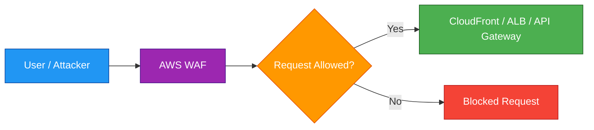
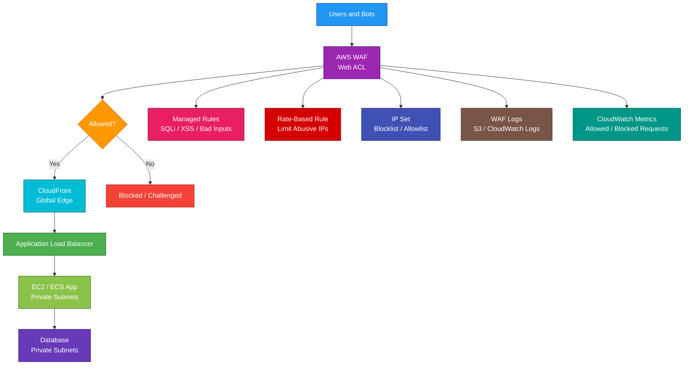

# AWS WAF

## 1. Definition

### Simple Definition

AWS WAF, or Web Application Firewall, is a security service that helps protect web applications from common web attacks.

It lets you create rules to allow, block, count, or challenge web requests before they reach your application.

### Memory Hook

WAF = Web Application Firewall.

### Basic Idea

AWS WAF sits in front of supported AWS services and inspects HTTP/HTTPS requests.

If a request matches a bad pattern, WAF can block it.

### What AWS WAF Protects

AWS WAF can protect services such as:

- Amazon CloudFront
- Application Load Balancer
- Amazon API Gateway
- AWS AppSync
- Amazon Cognito user pools
- AWS App Runner
- AWS Verified Access

## 2. What Problem Does It Solve?

### Main Problem

AWS WAF solves the problem of protecting web applications from malicious or unwanted HTTP/HTTPS requests.

### Without AWS WAF

Your application may be more exposed to:

- SQL injection
- Cross-site scripting
- Bad bots
- Suspicious IP addresses
- Request floods
- Malicious headers
- Invalid request patterns
- Known attack signatures

### With AWS WAF

You can inspect incoming web requests and apply security rules before the traffic reaches your application.

### Key Benefit

AWS WAF provides application-layer protection without requiring you to manage firewall servers.

## 3. Core Use Cases

### Protect Public Websites

Use AWS WAF with CloudFront or ALB to protect public websites from common attacks.

### Protect APIs

Use AWS WAF with API Gateway or AppSync to protect APIs.

Examples:

- Block suspicious IPs
- Rate-limit abusive clients
- Block invalid request patterns
- Protect login endpoints

### Block Common Web Attacks

AWS WAF can help block attacks such as:

- SQL injection
- Cross-site scripting
- HTTP header attacks
- Bad user agents
- Known malicious payloads

### Rate Limiting

Use rate-based rules to block or limit clients that send too many requests.

Example:

Block an IP address that sends thousands of requests in a short time.

### Bot Control

AWS WAF Bot Control can help detect and control bot traffic.

Examples:

- Block bad bots
- Allow known search engine bots
- Challenge suspicious automated traffic

### Geo Blocking

Block or allow requests based on country.

Example:

Allow traffic only from countries where your business operates.

### Custom Access Rules

Create custom rules based on request details.

Examples:

- Block requests with suspicious headers
- Allow only specific IP ranges
- Block specific URI paths
- Require certain headers for internal APIs

## 4. Important Features for SAA

### Web ACL

A Web ACL is the main AWS WAF resource.

It contains rules that inspect web requests.

You attach a Web ACL to supported resources such as CloudFront, ALB, or API Gateway.

### Rule

A rule defines what AWS WAF should inspect and what action it should take.

A rule can match on:

- IP address
- HTTP headers
- URI path
- Query string
- Request body
- HTTP method
- Cookies
- Country
- Rate of requests
- SQL injection patterns
- Cross-site scripting patterns

### Rule Action

Rules can take different actions.

| Action | Meaning |
|---|---|
| Allow | Let the request through |
| Block | Stop the request |
| Count | Count matches but do not block |
| CAPTCHA | Require a CAPTCHA challenge |
| Challenge | Require a silent browser challenge |

### Count Mode

Count mode is useful for testing rules before blocking traffic.

Exam tip:

If you want to test a new WAF rule safely, use Count first.

### Managed Rule Groups

AWS Managed Rules are prebuilt rule groups maintained by AWS.

They help protect against common threats without writing every rule yourself.

Examples:

- Common rule set
- Known bad inputs
- SQL injection protection
- Linux-specific rules
- WordPress-specific rules
- Admin protection

### Custom Rules

Custom rules let you define your own inspection logic.

Use custom rules when managed rules do not fully match your application needs.

### Rule Priority

Rules are evaluated based on priority.

Lower priority numbers are evaluated first.

Important exam point:

Rule order matters.

### Default Web ACL Action

Every Web ACL has a default action.

This applies when no rule matches.

Common choices:

- Allow by default and block bad traffic
- Block by default and allow only trusted traffic

### IP Set

An IP set is a reusable list of IP addresses or CIDR ranges.

Use IP sets to:

- Block known bad IPs
- Allow trusted office IPs
- Restrict admin pages

### Regex Pattern Set

A regex pattern set contains reusable regular expressions.

Use it to match request patterns like suspicious paths or parameters.

### Rate-Based Rule

A rate-based rule counts requests from a source and applies an action when the request rate exceeds a threshold.

Use it to reduce abuse and simple request floods.

### Geo Match

Geo match rules inspect the country where requests originate.

Use it to allow or block countries.

### SQL Injection Match

SQL injection match rules detect patterns that look like SQL injection attacks.

Example attack intent:

Trying to manipulate database queries through input fields.

### Cross-Site Scripting Match

Cross-site scripting, or XSS, match rules detect scripts or malicious code in web requests.

### Bot Control

AWS WAF Bot Control provides bot visibility and control.

Use it when bot traffic is a major concern.

### Fraud Control

AWS WAF fraud control features can help protect sensitive flows such as login and account creation.

Examples:

- Login protection
- Account creation fraud prevention

### Logging

AWS WAF can log inspected requests.

Logs can be sent to destinations such as:

- Amazon CloudWatch Logs
- Amazon S3
- Kinesis Data Firehose

### Metrics

AWS WAF publishes metrics to CloudWatch.

Common metrics include:

- Allowed requests
- Blocked requests
- Counted requests
- CAPTCHA attempts
- Rule matches

### Scope

AWS WAF has different scopes.

| Scope | Used For |
|---|---|
| Regional | ALB, API Gateway, AppSync, Cognito, App Runner, Verified Access |
| CloudFront | CloudFront distributions |

Important exam point:

For CloudFront, AWS WAF configuration uses the CloudFront/global scope.

## 5. Security Model

### IAM Permissions

IAM controls who can create and manage AWS WAF resources.

Common permissions:

| Permission | Purpose |
|---|---|
| `wafv2:CreateWebACL` | Create a Web ACL |
| `wafv2:UpdateWebACL` | Modify a Web ACL |
| `wafv2:DeleteWebACL` | Delete a Web ACL |
| `wafv2:CreateIPSet` | Create an IP set |
| `wafv2:CreateRuleGroup` | Create a rule group |
| `wafv2:AssociateWebACL` | Attach Web ACL to a supported resource |

### Web ACL Association

A Web ACL must be associated with a supported AWS resource to protect it.

Examples:

- CloudFront distribution
- Application Load Balancer
- API Gateway stage
- AppSync API

### Least Privilege

Only trusted security or platform teams should manage WAF rules.

A bad WAF rule can accidentally block real users.

### Encryption in Transit

AWS WAF inspects HTTP/HTTPS requests as they pass through supported services.

TLS termination usually happens at services such as:

- CloudFront
- Application Load Balancer
- API Gateway

### Encryption at Rest

WAF logs stored in S3 or CloudWatch Logs can be encrypted.

Use service-level encryption options such as:

- S3 server-side encryption
- CloudWatch Logs KMS encryption
- Kinesis Data Firehose encryption

### Sensitive Data in Logs

WAF logs may contain request data.

Be careful with:

- Authorization headers
- Cookies
- Query strings
- Request bodies
- User identifiers

Use redaction where appropriate.

### AWS Shield Integration

AWS WAF works well with AWS Shield.

| Service | Purpose |
|---|---|
| AWS WAF | Layer 7 web request protection |
| AWS Shield | DDoS protection |

### AWS Firewall Manager Integration

AWS Firewall Manager can centrally deploy and manage WAF rules across accounts in AWS Organizations.

Use it for multi-account governance.

### Shared Responsibility

AWS is responsible for:

- AWS WAF managed service infrastructure
- Rule processing engine availability
- Managed rule maintenance where applicable
- Physical security
- Service operations

You are responsible for:

- Creating correct Web ACLs
- Choosing rules
- Testing rules
- Monitoring blocked traffic
- Protecting logs
- Tuning false positives
- Applying WAF to the right resources
- Responding to security events

## 6. High Availability / Durability Behavior

### Availability

AWS WAF is a fully managed service.

You do not manage firewall servers, clusters, or scaling.

### CloudFront Scope

When AWS WAF protects CloudFront, inspection happens at AWS edge locations.

This is useful for global web applications.

### Regional Scope

When AWS WAF protects regional services like ALB or API Gateway, WAF applies in that Region.

### Fault Tolerance

AWS manages the WAF infrastructure behind the scenes.

Your protected service should still be designed for high availability.

Example:

Use an ALB across multiple Availability Zones behind WAF protection.

### Multi-AZ Behavior

AWS WAF itself does not require Multi-AZ configuration.

For regional resources, the protected service handles Multi-AZ behavior.

Examples:

- ALB across multiple AZs
- API Gateway managed regional availability
- AppSync managed regional availability

### Multi-Region Behavior

AWS WAF Web ACLs are not automatically shared across all Regions.

For Multi-Region applications, configure WAF protection where needed in each Region or use centralized tools like Firewall Manager.

### Durability

AWS WAF is not a data storage service.

Durability mainly applies to:

- WAF logs stored in S3 or CloudWatch Logs
- Web ACL configuration managed by AWS
- Infrastructure as Code templates used to recreate rules

### Logging Durability

For long-term WAF log storage, send logs to S3 and apply lifecycle policies.

### Important Exam Point

AWS WAF protects the application layer, but it does not make the backend application highly available by itself.

Use WAF with services like CloudFront, ALB, Auto Scaling, and Multi-AZ architecture.

## 7. Cost Optimization Options

### Use Managed Rules Selectively

Managed rule groups are useful but can add cost.

Enable rule groups that match your application risk.

### Avoid Too Many Custom Rules

Each Web ACL and rule can add cost.

Keep rule sets focused and useful.

### Use Count Mode Before Blocking

Testing rules in Count mode helps avoid accidentally blocking real users.

This reduces operational cost and support incidents.

### Scope WAF Correctly

Attach WAF only to resources that need application-layer protection.

Examples:

- Public CloudFront distributions
- Public ALBs
- Public APIs

### Use Rate-Based Rules

Rate-based rules can reduce abusive traffic before it reaches expensive backend services.

This can help lower costs from:

- Lambda invocations
- API Gateway requests
- EC2 scaling
- Database load

### Use CloudFront with WAF

For global applications, placing WAF on CloudFront can block bad traffic at the edge before it reaches your origin.

This can reduce origin load.

### Manage Logging Costs

WAF logs can become large.

Control cost by:

- Logging only when needed
- Using filters if available
- Sending logs to S3 for long-term storage
- Applying S3 lifecycle policies
- Setting CloudWatch Logs retention

### Use Firewall Manager for Multi-Account Efficiency

In large organizations, Firewall Manager can reduce manual rule duplication and management overhead.

### Tune Rules to Reduce False Positives

False positives can block real users and create support work.

Monitor WAF logs and adjust rules carefully.

## 8. Common Exam Traps

### WAF Is Layer 7

AWS WAF protects HTTP and HTTPS web traffic.

It is not a general network firewall for all protocols.

### WAF vs Security Group

| Feature | AWS WAF | Security Group |
|---|---|---|
| Layer | Application layer, Layer 7 | Network/instance level |
| Protects | HTTP/HTTPS requests | Resource network access |
| Example | Block SQL injection | Allow port 443 |
| Attached to | CloudFront, ALB, API Gateway, etc. | EC2, ENI, ALB, RDS, etc. |

### WAF vs NACL

NACLs control subnet-level network traffic.

AWS WAF inspects web request content.

### WAF vs Shield

AWS WAF protects against application-layer web attacks.

AWS Shield protects against DDoS attacks.

They are often used together.

### WAF Does Not Protect All Services

AWS WAF only works with supported services.

You cannot attach WAF directly to every AWS resource.

### WAF Does Not Replace Application Security

WAF helps block malicious traffic, but applications still need secure coding practices.

Examples:

- Input validation
- Authentication
- Authorization
- Secure session handling
- Parameterized SQL queries

### Count Mode Does Not Block

Count mode only counts matching requests.

It does not stop traffic.

Use it for testing rules.

### Rule Order Matters

Rules are evaluated by priority.

A rule evaluated earlier can affect whether later rules matter.

### CloudFront WAF Scope Trap

For CloudFront protection, use the CloudFront/global scope.

For ALB and API Gateway, use regional scope.

### WAF Is Not a CDN

CloudFront is the CDN.

WAF is the web firewall.

They are commonly used together.

### Rate-Based Rule Is Not Full DDoS Protection

Rate-based rules help limit abusive web requests.

For larger DDoS protection, use AWS Shield, especially Shield Advanced for enhanced protection.

### Managed Rules Can Have False Positives

Managed rules are helpful, but they may block legitimate traffic depending on the application.

Test and tune rules.

## 9. Compare With Similar Services

### Service Comparison Table

| Service | Main Purpose | Best For | Choose When |
|---|---|---|---|
| AWS WAF | Web application firewall | HTTP/HTTPS request filtering | You need to block SQL injection, XSS, bots, or bad requests |
| AWS Shield | DDoS protection | Network and application DDoS defense | You need DDoS protection |
| Security Groups | Resource firewall | Controlling inbound/outbound network access | You need instance or ENI-level access control |
| Network ACLs | Subnet firewall | Stateless subnet-level filtering | You need subnet-level allow/deny rules |
| AWS Network Firewall | VPC network firewall | Stateful network traffic inspection | You need centralized VPC traffic filtering |
| Firewall Manager | Central firewall management | Multi-account security policy management | You need to manage WAF/Shield/security policies across accounts |

### AWS WAF vs AWS Shield

| Feature | AWS WAF | AWS Shield |
|---|---|---|
| Main purpose | Web request filtering | DDoS protection |
| Layer | Layer 7 HTTP/HTTPS | Network and application DDoS defense |
| Example | Block SQL injection | Protect from DDoS attack |
| Common use together | Yes | Yes |

### AWS WAF vs Security Groups

| Feature | AWS WAF | Security Group |
|---|---|---|
| Main purpose | Inspect web requests | Control network access |
| Rule type | HTTP headers, body, URI, IP, rate | Protocol, port, source/destination |
| Stateful | Not the same concept | Yes |
| Example | Block `/admin` from unknown IPs | Allow HTTPS from internet |

### AWS WAF vs Network ACL

| Feature | AWS WAF | NACL |
|---|---|---|
| Scope | Supported web entry points | Subnet |
| Layer | Application layer | Network layer |
| Stateful | Rule-based web inspection | Stateless |
| Common use | Block malicious web requests | Block/allow subnet traffic |

### AWS WAF vs AWS Network Firewall

| Feature | AWS WAF | AWS Network Firewall |
|---|---|---|
| Main purpose | Web app protection | VPC network traffic inspection |
| Traffic type | HTTP/HTTPS web requests | VPC traffic |
| Placement | CloudFront, ALB, API Gateway, etc. | VPC subnets |
| Best for | SQL injection, XSS, bots | Network firewalling and domain/IP filtering |

### AWS WAF vs Firewall Manager

| Feature | AWS WAF | Firewall Manager |
|---|---|---|
| Main purpose | Protect web apps | Manage firewall policies centrally |
| Scope | Individual Web ACLs and rules | Multi-account policy deployment |
| Best for | Web request filtering | Organization-wide governance |
| Common use together | Firewall Manager manages WAF policies | WAF enforces rules |

### When to Choose AWS WAF

Choose AWS WAF when:

- You need to protect HTTP/HTTPS applications
- You need to block SQL injection or XSS
- You need IP allow/block lists
- You need rate-based request limiting
- You need bot protection
- You need geo blocking
- You need rules in front of CloudFront, ALB, API Gateway, or AppSync
- You need Layer 7 web request inspection

## 10. Mini Architecture Example

### Scenario

A company hosts a public web application behind CloudFront and an Application Load Balancer.

They want to block common web attacks before traffic reaches the application.

### Architecture

Attach AWS WAF to the CloudFront distribution.

Use managed rules for common attacks.

Use rate-based rules to reduce abusive traffic.

Use CloudWatch and WAF logs for monitoring.

### Why This Is Good

- WAF filters malicious web requests before they reach the app
- CloudFront blocks attacks at the edge
- Managed rules protect against common threats
- Rate-based rules reduce abusive request floods
- IP sets allow reusable allowlists and blocklists
- Logs and metrics help tune rules and investigate traffic
- The backend application remains in private subnets

### Exam Answer Pattern

If the question says:

“Protect a web application from SQL injection, cross-site scripting, bad bots, or malicious HTTP requests.”

Think:

AWS WAF.

If the question says:

“Protect against DDoS attacks.”

Think:

AWS Shield.

If the question says:

“Centrally manage WAF rules across many AWS accounts.”

Think:

AWS Firewall Manager.

### Final Memory Hook

WAF protects web apps.

Shield protects against DDoS.

Security groups protect resources.

NACLs protect subnets.

Network Firewall protects VPC traffic.

Firewall Manager manages firewall policies across accounts.

CloudFront plus WAF blocks bad traffic at the edge.

