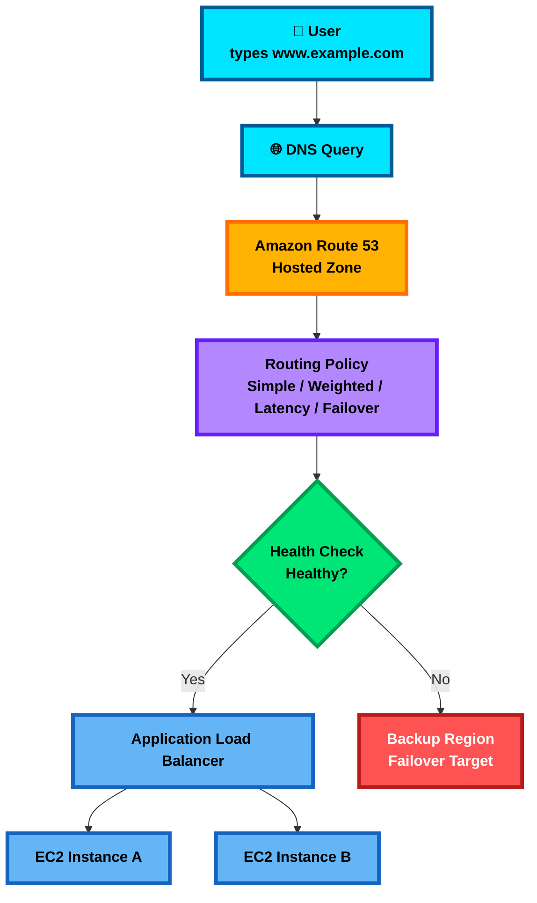

# AWS Route 53

## 1. Simple Explanation

**Amazon Route 53** is AWS’s **DNS service**.

DNS is like the **phonebook of the internet**.

When a user types:

`www.example.com`

Route 53 helps translate that domain name into an address like:

`192.0.2.10`

or routes the user to an AWS service like:

- **Application Load Balancer**
- **CloudFront**
- **S3 static website**
- **API Gateway**
- **Elastic Beanstalk**

Simple idea:

**Route 53 tells users where to go when they type your domain name.**

---

## 2. Why It Exists

Without DNS, users would need to remember IP addresses.

Route 53 exists to:

- Connect domain names to AWS resources
- Register domain names
- Route traffic intelligently
- Improve availability with health checks
- Support failover between regions
- Route private internal DNS inside VPCs

You use Route 53 when you want:

- `myapp.com` to point to your AWS application
- Users to go to the closest AWS Region
- Automatic failover if one endpoint is unhealthy
- Internal DNS names like `db.internal.company.com`

---

## 3. Core Features

| Feature | Simple Meaning | SAA Exam Importance |
|---|---|---|
| **Domain Registration** | Buy/manage domain names | Know Route 53 can register domains |
| **Hosted Zones** | DNS record container | Very important |
| **Public Hosted Zone** | DNS for internet users | Used for public websites |
| **Private Hosted Zone** | DNS only inside VPCs | Used for internal apps |
| **DNS Records** | Rules that map names to targets | Very important |
| **Alias Records** | AWS-friendly DNS record | Very important |
| **Routing Policies** | Decide how traffic is routed | Very heavily tested |
| **Health Checks** | Check if endpoint is healthy | Used for failover |
| **Route 53 Resolver** | DNS resolution for VPC/hybrid networks | Useful for private/hybrid DNS |

---

## 4. How It Works

Basic workflow:

1. User enters `www.example.com`.
2. DNS query goes to Route 53.
3. Route 53 checks the hosted zone for `example.com`.
4. Route 53 finds the correct DNS record.
5. Route 53 returns the target.
6. User connects to the application.

Example:

`www.example.com` → Route 53 → ALB → EC2 instances

Important terms:

| Term | Meaning |
|---|---|
| **Hosted Zone** | Container for DNS records |
| **Record** | DNS rule, such as A, CNAME, Alias |
| **Name Server** | Server that answers DNS queries |
| **TTL** | How long DNS answers are cached |
| **Routing Policy** | Logic used to choose the answer |
| **Health Check** | Determines if a target should receive traffic |

---

## 5. Diagram

---

## 6. Real-World Example

Scenario:

A company runs an e-commerce website:

`www.shop.com`

Architecture:

- Domain managed in **Route 53**
- Public hosted zone for `shop.com`
- `www.shop.com` points to an **Application Load Balancer**
- ALB sends traffic to EC2 instances in multiple Availability Zones
- Route 53 health checks monitor the primary region
- If the primary region fails, Route 53 sends users to a backup region

Example design:

| Component | AWS Service |
|---|---|
| DNS | Route 53 |
| Web entry point | Application Load Balancer |
| Compute | EC2 Auto Scaling group |
| Static content | CloudFront + S3 |
| Failover | Route 53 failover routing |
| Health monitoring | Route 53 health checks |

Exam clue:

If the question says **route users to a healthy secondary site when the primary site fails**, think:

**Route 53 Failover Routing + Health Checks**

---

## 7. SAA Exam Focus

Route 53 is commonly tested around **routing policies**, **alias records**, **health checks**, and **private hosted zones**.

### Common Exam Keywords

| Keyword in Question | Think |
|---|---|
| **closest region / lowest latency** | Latency-based routing |
| **percentage of traffic** | Weighted routing |
| **blue/green deployment** | Weighted routing |
| **A/B testing** | Weighted routing |
| **primary and secondary site** | Failover routing |
| **active-passive** | Failover routing |
| **route by country or continent** | Geolocation routing |
| **route based on resource/user location with bias** | Geoproximity routing |
| **multiple healthy IPs returned** | Multivalue answer routing |
| **internal DNS in VPC** | Private hosted zone |
| **AWS resource target with zone apex** | Alias record |

---

### Routing Policies

| Routing Policy | What It Does | Exam Use Case |
|---|---|---|
| **Simple** | One basic DNS answer | Single website endpoint |
| **Weighted** | Splits traffic by percentage | Blue/green, canary, A/B testing |
| **Latency-based** | Sends user to lowest-latency region | Global performance |
| **Failover** | Sends traffic to backup if primary fails | Disaster recovery |
| **Geolocation** | Routes by user location | Country/continent-specific content |
| **Geoproximity** | Routes by location with optional bias | Shift traffic between regions |
| **Multivalue Answer** | Returns multiple healthy records | Basic DNS-level availability |
| **IP-based** | Routes based on client IP ranges | Custom network-based routing |

---

### Alias Records

**Alias records are very important for the exam.**

An Alias record lets Route 53 point directly to AWS resources.

Common Alias targets:

- Elastic Load Balancer
- CloudFront distribution
- S3 static website endpoint
- API Gateway custom domain
- Elastic Beanstalk environment
- Another Route 53 record in the same hosted zone

Important:

| Record Type | Can Point To | Zone Apex Support |
|---|---|---|
| **CNAME** | Another domain name | No |
| **Alias** | AWS resources | Yes |

Zone apex means root domain:

`example.com`

Exam trap:

You usually **cannot use CNAME for the root domain**.

For root domain AWS targets, use:

**Route 53 Alias Record**

Example:

`example.com` → Alias → Application Load Balancer

---

### Health Checks

Route 53 health checks can monitor:

- HTTP endpoints
- HTTPS endpoints
- TCP endpoints
- CloudWatch alarms
- Calculated health checks

Used with:

- Failover routing
- Weighted routing
- Latency routing
- Geolocation routing
- Multivalue answer routing

Important exam idea:

Route 53 can stop returning unhealthy endpoints when health checks fail.

But remember:

**DNS caching still matters because of TTL.**

Even after failover, some users may still use cached DNS answers until TTL expires.

---

### High Availability

Route 53 improves availability by:

- Using health checks
- Routing to healthy endpoints
- Supporting failover routing
- Supporting multi-region architectures
- Integrating with ELB, CloudFront, and S3

Exam clue:

For highly available public DNS:

**Route 53 is global and highly available by design.**

---

### Scalability

Route 53 is designed to handle very large DNS query volumes.

For scalable architecture:

- Use Route 53 for DNS
- Use CloudFront for global caching
- Use ALB for application traffic
- Use Auto Scaling for compute

---

### Security

Security considerations:

| Security Need | Route 53 Feature |
|---|---|
| Internal DNS only | Private hosted zone |
| Control DNS changes | IAM policies |
| Protect domain from transfer | Domain locking |
| DNS encryption/hybrid DNS control | Route 53 Resolver features |
| DNS filtering in VPC | Route 53 Resolver DNS Firewall |

For SAA, know:

**Private hosted zones are only resolvable from associated VPCs.**

---

### Cost

Route 53 pricing usually includes:

- Hosted zones
- DNS queries
- Health checks
- Domain registration
- Resolver endpoints if used

Exam cost tip:

Route 53 is usually not the biggest cost item, but unnecessary health checks and resolver endpoints can add cost.

---

### Performance

Performance-related routing policies:

| Need | Best Route 53 Choice |
|---|---|
| Lowest latency | Latency-based routing |
| Closest location with traffic shifting | Geoproximity routing |
| Global content acceleration | CloudFront, not Route 53 alone |
| DNS-level distribution | Route 53 routing policies |

Important:

Route 53 chooses DNS answers.

It does **not** accelerate traffic like CloudFront.

---

## 8. Comparisons

### Route 53 vs CloudFront vs Load Balancer

| Service | Main Job | Layer | Exam Clue |
|---|---|---|---|
| **Route 53** | DNS routing | DNS | Domain name routing |
| **CloudFront** | CDN caching and acceleration | Edge/CDN | Cache content globally |
| **ALB** | HTTP/HTTPS load balancing | Layer 7 | Path-based or host-based routing |
| **NLB** | TCP/UDP high-performance load balancing | Layer 4 | Static IP, extreme performance |
| **Global Accelerator** | Anycast static IP acceleration | Network edge | Improve global app performance using static IPs |

---

### Public Hosted Zone vs Private Hosted Zone

| Feature | Public Hosted Zone | Private Hosted Zone |
|---|---|---|
| Used For | Public internet DNS | Internal VPC DNS |
| Example | `www.example.com` | `db.internal.example.com` |
| Accessible From | Internet | Associated VPCs |
| Common Target | ALB, CloudFront, S3 | EC2, internal services |
| Exam Clue | Public website | Internal application name resolution |

---

### Alias vs CNAME

| Feature | Alias Record | CNAME Record |
|---|---|---|
| AWS-specific | Yes | No |
| Can point to AWS resources | Yes | Indirectly |
| Works at root domain | Yes | No |
| Example root domain | `example.com` → ALB | Not allowed |
| Extra DNS query | No extra query in many AWS cases | Usually requires another lookup |
| Exam Answer | Usually preferred for AWS resources | Used for non-root subdomains |

---

### Weighted vs Latency vs Failover

| Need | Choose |
|---|---|
| Send 90% traffic to old app, 10% to new app | **Weighted** |
| Send users to fastest AWS Region | **Latency-based** |
| Send traffic to backup only if primary fails | **Failover** |
| Send European users to Europe endpoint | **Geolocation** |
| Return several healthy IP addresses | **Multivalue Answer** |

---

## 9. Common Mistakes

### Mistake 1: Thinking Route 53 is a load balancer

Route 53 is **DNS**, not a real-time load balancer.

It returns DNS answers.

For application load balancing, use:

**ALB**

For TCP/UDP high-performance load balancing, use:

**NLB**

---

### Mistake 2: Using CNAME for root domain

Wrong:

`example.com` → CNAME → ALB

Better:

`example.com` → Alias → ALB

Exam clue:

If the question mentions **zone apex**, **root domain**, or **naked domain**, choose:

**Alias record**

---

### Mistake 3: Confusing geolocation and latency routing

| Routing Type | Based On |
|---|---|
| **Geolocation** | User location |
| **Latency-based** | Lowest network latency |
| **Geoproximity** | User/resource location plus bias |

Memory:

- **Geo = geography**
- **Latency = speed**
- **Geoproximity = geography + traffic shifting**

---

### Mistake 4: Expecting instant failover

Route 53 failover is not always instant because DNS answers can be cached.

TTL affects how quickly users receive updated DNS answers.

Lower TTL = faster change, but more DNS queries.

---

### Mistake 5: Thinking private hosted zones work from the internet

Private hosted zones are for **VPC internal DNS**.

They do not publicly resolve from the internet.

---

### Mistake 6: Thinking multivalue answer routing replaces ELB

Multivalue answer routing can return multiple healthy IPs, but it is **not a full load balancer**.

For real load balancing, use:

- ALB
- NLB
- Gateway Load Balancer

---

## 10. Memory Hooks

### Route 53 = Internet GPS

Route 53 tells users:

**“Where should I go for this domain?”**

---

### Routing Policy Memory

| Memory Hook | Meaning |
|---|---|
| **Simple = One road** | Basic routing |
| **Weighted = Traffic percentage** | Split traffic |
| **Latency = Fastest road** | Lowest delay |
| **Failover = Backup road** | Disaster recovery |
| **Geolocation = Country road** | Based on user location |
| **Geoproximity = Nearby road with bias** | Location plus traffic shifting |
| **Multivalue = Many healthy roads** | Multiple healthy answers |

---

### Alias Memory

**Alias = AWS-aware DNS shortcut**

Use Alias when pointing to AWS resources, especially at the root domain.

---

### Private Hosted Zone Memory

**Private hosted zone = internal company phonebook**

Only resources inside associated VPCs can use it.

---

## 11. Quick Review

- **Route 53 is AWS DNS.**
- It maps domain names to AWS or external resources.
- **Hosted zones** store DNS records.
- **Public hosted zones** are for internet DNS.
- **Private hosted zones** are for internal VPC DNS.
- **Alias records** are preferred for AWS resources.
- Use **Alias**, not CNAME, for root domains like `example.com`.
- **Weighted routing** = split traffic by percentage.
- **Latency routing** = send users to lowest-latency region.
- **Failover routing** = active-passive disaster recovery.
- **Geolocation routing** = route based on user location.
- **Geoproximity routing** = route based on location plus bias.
- **Multivalue answer routing** = return multiple healthy records.
- **Health checks** help Route 53 avoid unhealthy endpoints.
- DNS failover is affected by **TTL caching**.
- Route 53 is **not a load balancer** and **not a CDN**.
- For global caching, use **CloudFront**.
- For application load balancing, use **ALB**.
- For DNS-based routing and failover, use **Route 53**.